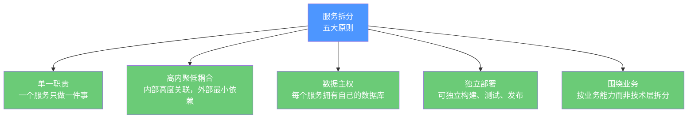
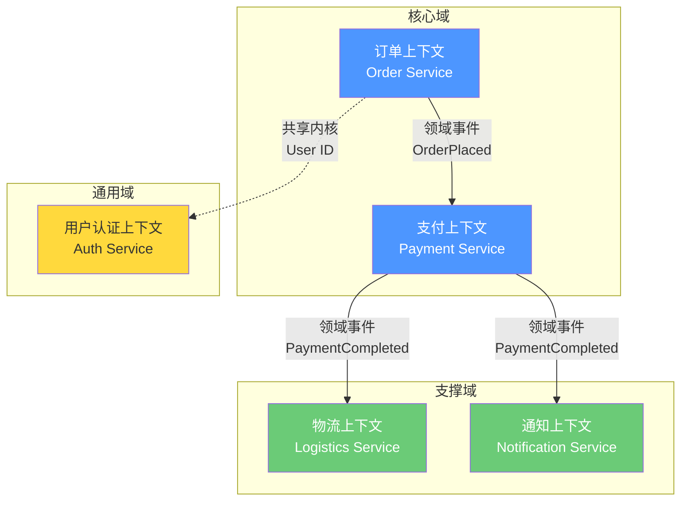
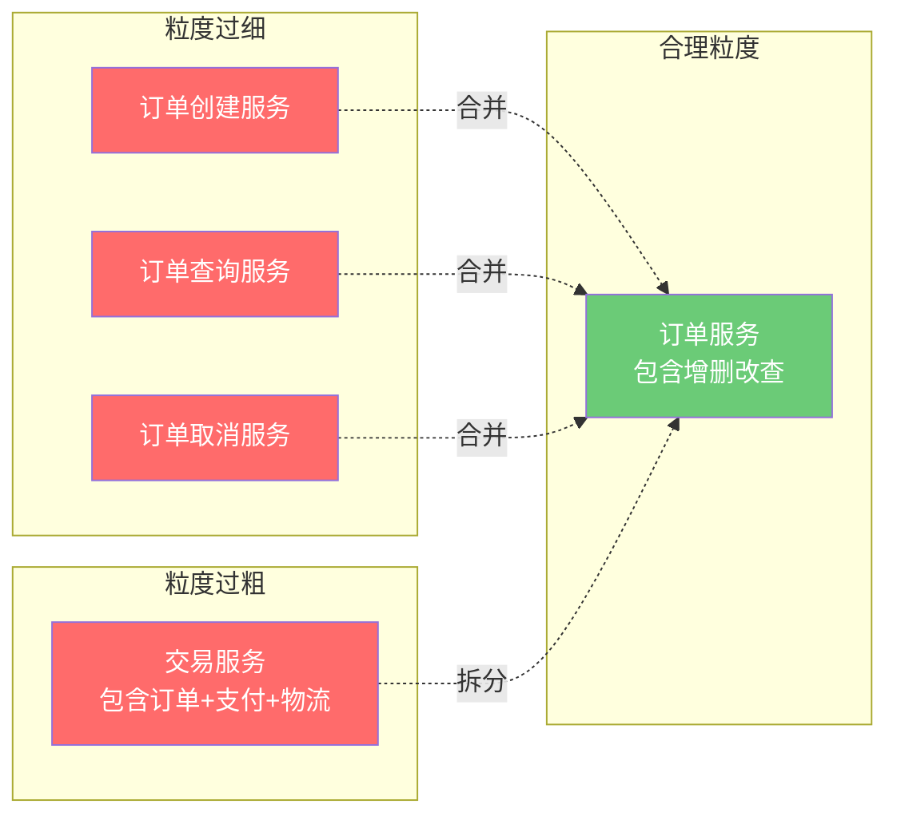

# 服务拆分方法论

## ⭐ 面试重点速览

| 知识模块 | 重点内容 | 面试频率 |
|----------|----------|----------|
| 拆分原则 | 单一职责、高内聚低耦合、数据主权、独立部署 | 极高 |
| DDD 限界上下文 | 战略设计核心，子域划分（核心域/支撑域/通用域） | 极高 |
| 拆分维度 | 按业务能力、按组织结构、按变化频率三种维度对比 | 高 |
| 服务粒度判断 | 太小（纳米服务问题）vs 太大（迷你单体问题）的平衡 | 极高 |
| 反模式 | 按数据库表拆分、按技术层拆分、过早拆分、过度拆分 | 高 |
| 绞杀者模式 | 渐进式拆分，逐步替代，而非大爆炸重写 | 中高 |

---

## 一、服务拆分的核心原则

### 1.1 五大黄金原则



::: danger 拆分第一准则：数据是硬边界
服务拆分最核心的原则就是**数据隔离**。如果两个"服务"共享同一个数据库，它们本质上还是一个分布式单体。数据库是服务之间最硬的边界——跨服务的数据访问必须通过 API 调用，绝不能直接连对方的数据库。
:::

### 1.2 拆分前必须回答的三个问题

1. **这个模块是否可以独立交付业务价值？** 如果不能，它可能不是一个独立服务
2. **这个模块的变化是否独立于其他模块？** 如果每次改动都需要其他模块配合上线，边界可能画错了
3. **这个模块是否有独立的数据存储？** 没有独立数据的"服务"只是部署单元，不是微服务

---

## 二、DDD 限界上下文与微服务拆分

### 2.1 DDD 战略设计核心概念

DDD（Domain-Driven Design）的战略设计为微服务拆分提供了系统化的方法论。核心概念映射关系：

| DDD 概念 | 微服务对应 | 说明 |
|----------|-----------|------|
| **限界上下文**（Bounded Context） | 微服务边界 | 一个限界上下文对应一个或一组微服务 |
| **子域**（Subdomain） | 业务模块 | 核心域、支撑域、通用域 |
| **上下文映射**（Context Map） | 服务间集成关系 | 上下游、防腐层、共享内核等 |
| **聚合**（Aggregate） | 事务边界 | 一个聚合内保证强一致性 |
| **领域事件**（Domain Event） | 异步消息 | 跨上下文/跨服务的通信方式 |



### 2.2 限界上下文的识别方法

**事件风暴（Event Storming）** 是识别限界上下文最常用的工作坊方法：

1. **识别领域事件**：从业务流程出发，列举所有发生的事件（如"订单已创建""支付已完成"）
2. **识别命令和聚合**：找到触发事件的命令，围绕聚合根组织实体
3. **识别限界上下文**：根据术语一致性和业务内聚性划分边界
4. **绘制上下文映射图**：明确上下文之间的关系（上下游、共享内核、防腐层）

::: tip 从事件风暴到微服务
事件风暴的输出天然适合指导微服务拆分。因为在风暴过程中，参与者已经在用业务语言而非技术语言思考边界——这与微服务"围绕业务能力组织"的理念完美契合。
:::

---

## 三、三种拆分维度

### 3.1 按业务能力拆分（推荐）

最自然也是最常用的拆分方式，以电商系统为例：

```
电商系统
├── 用户服务（User Service）        —— 注册、登录、个人信息
├── 商品服务（Product Service）      —— 商品管理、分类、SKU
├── 订单服务（Order Service）        —— 下单、订单状态、订单查询
├── 支付服务（Payment Service）      —— 支付、退款、对账
├── 库存服务（Inventory Service）    —— 库存扣减、库存预警
├── 物流服务（Logistics Service）    —— 发货、物流跟踪
└── 营销服务（Marketing Service）    —— 优惠券、促销活动
```

**优点**：业务边界清晰，与组织架构自然对齐，团队对服务有完整的掌控感。

### 3.2 按组织结构拆分（康威定律）

```
事业部结构 → 服务拆分

电商事业部 → 电商微服务集群
  ├── 订单团队 → 订单服务
  ├── 商品团队 → 商品服务
  └── 支付团队 → 支付服务

金融事业部 → 金融微服务集群
  ├── 理财团队 → 理财服务
  └── 信贷团队 → 信贷服务
```

::: tip 康威定律（Conway's Law）
> 任何组织在设计系统时，其设计出的系统架构都将**复制该组织的沟通结构**。

这意味着：如果你想让微服务拆得合理，**先让团队结构合理**。跨团队的微服务边界几乎必定出问题。
:::

### 3.3 按变化频率拆分

这是最容易忽略但非常实用的维度：

| 变化频率 | 适合的服务 | 特征 |
|----------|-----------|------|
| **高频变化** | 业务规则服务 | 促销引擎、风控规则、推荐算法 —— 频繁上线 |
| **中频变化** | 业务流程服务 | 订单流程、支付流程 —— 随业务迭代调整 |
| **低频变化** | 基础数据服务 | 用户、商品、字典 —— 结构稳定 |
| **几乎不变** | 基础设施服务 | 认证授权、网关、消息 —— 框架级稳定性 |

**核心思想**：将高频变化的模块与低频变化的模块分开部署。如果不分开，每次上线高频模块时都需要对稳定模块做全量回归，严重影响交付速度。

---

## 四、服务粒度判断

### 4.1 粒度过细 vs 粒度过粗



### 4.2 粒度判断的"三个二"法则

| 法则 | 说明 |
|------|------|
| **2 Pizza Team** | 一个服务由一个 6-8 人的团队负责，不多不少 |
| **2 周迭代** | 一个服务的一个功能迭代应该能在 2 周内完成 |
| **2 个数据库表簇** | 一个服务通常管理 2-5 个核心聚合，每个聚合对应 1-3 张表 |

### 4.3 粒度判断信号

::: warning 粒度太细的信号（纳米服务反模式）
- 服务间需要频繁的同步调用才能完成一个业务操作
- 修改一个功能需要同时修改和部署 3 个以上服务
- 服务间的 RPC 延迟超过了业务处理时间
- 每个服务只管理 1-2 张表
:::

::: warning 粒度太粗的信号（迷你单体反模式）
- 不同团队频繁修改同一个服务的同一块代码
- 服务部署时需要跑 30 分钟以上的全量回归测试
- 服务内部模块之间的调用比服务间调用还多
- 你很难说清楚这个服务"到底做什么"
:::

---

## 五、常见拆分反模式

| 反模式 | 描述 | 为什么危险 | 正确做法 |
|--------|------|-----------|----------|
| **按技术层拆分** | Controller 一个服务、Service 一个服务、DAO 一个服务 | 跨层调用极其频繁，延迟爆炸，改了业务逻辑要部署全部三层 | 按业务能力垂直拆分 |
| **按数据库表拆分** | 每张表一个服务 | 跨表 JOIN 变成网络调用，性能和一致性都是灾难 | 按聚合边界拆分 |
| **过早拆分** | 业务尚不确定时就按预设架构拆分 | 边界画错重来的成本很高，过早优化是万恶之源 | 先单体验证业务，后逐步拆分 |
| **大爆炸重写** | 停掉老系统，花 6 个月从零写微服务 | 风险极高，上线即事故 | 绞杀者模式逐步迁移 |
| **数据大杂烩** | 多个服务共享数据库 | 本质上还是分布式单体，无法独立演进 | 每个服务独占数据库 |

---

## ⭐ 面试高频问题汇总

### Q1：如何确定微服务的合适粒度？有没有客观的度量标准？

没有绝对的量化标准，但可以通过以下维度综合判断：

1. **团队维度**：一个服务由一个 2 Pizza Team（6-8 人）负责
2. **业务维度**：一个服务对应一个业务能力，可以独立交付价值
3. **数据维度**：一个服务管理 2-5 个核心聚合，不跨聚合做强一致性事务
4. **通信维度**：一次业务操作不需要超过 3 次跨服务同步调用
5. **部署维度**：一个服务可以独立测试、独立部署、独立扩缩容

关键原则：**先粗后细**。服务粒度可以在演进中调整，拆太细再合并的成本远高于从粗到细逐步优化。

### Q2：DDD 的限界上下文和微服务是什么关系？

限界上下文是 DDD 战略设计的核心概念，它定义了一个**业务边界**——在这个边界内，业务术语的含义是统一的。微服务的服务边界理想情况应该对齐限界上下文：

- **一对一映射**（理想）：一个限界上下文 = 一个微服务
- **一对多映射**（常见）：一个限界上下文包含多个微服务（当上下文内部模块较复杂时）
- **不映射**（反模式）：一个微服务跨越多个限界上下文，意味着出现了边界混乱

关键是理解：限界上下文是**逻辑边界**，微服务是**物理边界**。先用 DDD 确定逻辑边界，再映射为物理边界。

### Q3：有哪些明确的信号说明服务应该拆分？

1. **不同模块的变更节奏差异大**：核心支付模块一年改 2 次，营销模块一天上线 3 次——它们不应该在一个服务里
2. **不同模块的扩容需求差异大**：商品浏览 QPS 是下单 QPS 的 100 倍，需要独立扩容
3. **不同团队在争夺同一服务的修改权**：频繁的代码冲突和上线协调
4. **数据库表之间越来越独立**：某几张表和其余表的关联越来越少
5. **测试范围过大**：改一个功能需要回归测试全服务，测试时间越来越长

### Q4：什么是"按技术层拆分"？为什么这是反模式？

按技术层拆分就是把 MVC 三层分别部署为独立服务：Controller 微服务 → Service 微服务 → DAO 微服务。

**为什么是反模式**：
1. 一个业务请求需要穿透三层服务，增加 2 次网络跳转，延迟大幅增加
2. 三层之间耦合极其紧密，改了业务逻辑通常要同时部署三层
3. 任何一层挂了，整个业务链路不可用

正确的做法是**垂直拆分**：每个服务包含完整的表现层、业务层、数据访问层，自给自足。

### Q5：如果已经拆错了，服务粒度太细，如何合并？

1. **识别合并目标**：选择调用最频繁、数据耦合最紧密的一组服务
2. **统一数据源**：先将多个数据库合并（这是最难的一步，注意数据冲突和迁移方案）
3. **代码合并**：将多个服务的代码合并到一个代码仓库
4. **渐进切换**：保持旧服务运行，逐步将流量切到新合并的服务
5. **下线旧服务**：确认无流量后再下线

关键原则：**数据库合并是最危险的一步**，必须做好数据校验和回滚方案。

### Q6：微服务拆分和康威定律的关系？

康威定律的核心观点：系统架构反映了组织的沟通结构。在微服务拆分中的实践含义：

- **反向康威**：如果你想得到某种架构，先调整组织结构。比如想拆分订单和支付，就让两个团队分别负责
- **跨团队服务集成必定困难**：因为两个团队的沟通成本天然高于一个团队内部。所以服务边界应该沿着团队边界画
- **避免一个服务由多个团队维护**：这会导致代码所有权模糊、决策成本高

---

::: info 相关模块
- [微服务架构全景](./index.md) — 架构演进与适用场景
- [Spring Cloud 技术实现](../spring-cloud/index.md) — Nacos、Gateway、Sentinel、Seata 等
- 分布式理论（middleware/distributed-system/） — 分布式事务、一致性协议
:::