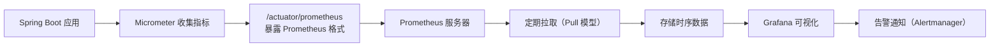
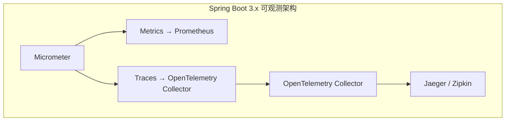

# 监控与 Actuator

## ⭐ 面试重点速览

| 知识模块 | 重点内容 | 面试频率 |
|----------|----------|----------|
| Actuator 核心端点 | health / metrics / env / loggers / mappings 用法 | 极高 |
| 自定义健康检查 | 实现 HealthIndicator 接口、端点扩展 | 高 |
| Micrometer 核心 | Meter 分类（Counter / Gauge / Timer / DistributionSummary） | 高 |
| Prometheus 集成 | Micrometer 暴露 scrape 端点、Prometheus 拉取模型 | 高 |
| 自定义 Metrics | 三种 Meter 类型的实际代码示例 | 中高 |
| Spring Boot 3.x Observability | Micrometer + OpenTelemetry 可观测性 | 中高 |

---

## 一、Actuator 概述

Actuator 是 Spring Boot 提供的**生产级监控端点**集成，它可以让你通过 HTTP 端点或 JMX 暴露应用运行时的各类指标，帮助你监控和管理应用。

引入依赖只需：

```xml
<dependency>
    <groupId>org.springframework.boot</groupId>
    <artifactId>spring-boot-starter-actuator</artifactId>
</dependency>
```

默认只暴露 `health` 和 `info` 两个端点，生产环境可按需暴露更多。开启方式：

```yaml
management:
  endpoints:
    web:
      exposure:
        include: "*"    # 暴露所有端点
        exclude: "env,beans" # 排除敏感端点
  endpoint:
    health:
      show-details: always  # 显示健康检查详情
```

Actuator 的端点都暴露在 `/actuator` 前缀下，例如健康检查是 `GET /actuator/health`。

---

## 二、⭐ Actuator 核心端点详解

### 2.1 常用端点汇总

| 端点路径 | 作用 | 说明 |
|----------|------|------|
| `/actuator/health` | 健康检查 | 检查应用是否健康，显示磁盘、数据库、Redis 等组件状态 |
| `/actuator/metrics` | 指标统计 | 应用运行时各类指标（JVM 内存、CPU、请求数、延迟等） |
| `/actuator/info` | 应用信息 | 显示应用名称、版本、Git 提交等自定义信息 |
| `/actuator/env` | 环境变量 | 显示 Spring 环境中所有配置属性 |
| `/actuator/loggers` | 日志级别 | 查看和动态修改日志级别 |
| `/actuator/mappings` | 请求映射 | 显示所有 `@RequestMapping` 路径 |
| `/actuator/threaddump` | 线程转储 | 获取当前所有线程的堆栈信息 |
| `/actuator/beans` | Bean 列表 | 显示 Spring 容器中所有 Bean |
| `/actuator/configprops` | 配置属性 | 显示所有 `@ConfigurationProperties` 配置类 |
| `/actuator/prometheus` | Prometheus 格式指标 | 暴露 Prometheus 可拉取的格式 |

### 2.2 重点端点详解

#### 2.2.1 `/health` — 健康检查

响应示例：

```json
{
  "status": "UP",
  "components": {
    "diskSpace": {
      "status": "UP",
      "details": {
        "total": 250790436864,
        "free": 100123456789,
        "threshold": 10485760
      }
    },
    "db": {
      "status": "UP",
      "details": {
        "database": "MySQL",
        "version": "8.0.33"
      }
    },
    "redis": {
      "status": "UP",
      "details": {
        "version": "6.2.7"
      }
    }
  }
}
```

健康状态有四种：

| 状态 | 含义 |
|------|------|
| `UP` | 健康 |
| `DOWN` | 不健康（组件故障） |
| `OUT_OF_SERVICE` | 服务不可用 |
| `UNKNOWN` | 未知（未配置） |

Kubernetes 或云平台通常会定期探针 `/actuator/health` 判断应用是否健康。

::: warning 注意敏感信息暴露

`show-details: always` 会显示数据库版本、磁盘剩余空间等详情，方便排查问题。但生产环境如果端点暴露公网，建议设置为 `when-authorized` 只对授权用户显示。
:::

#### 2.2.2 `/metrics` — 指标浏览

访问 `GET /actuator/metrics` 得到所有可用指标名列表：

```json
{
  "names": [
    "jvm.memory.used",
    "jvm.memory.max",
    "system.cpu.usage",
    "http.server.requests",
    "logback.events"
  ]
}
```

访问具体指标：`GET /actuator/metrics/jvm.memory.used`

```json
{
  "name": "jvm.memory.used",
  "measurements": [
    {
      "statistic": "VALUE",
      "value": 234567890
    }
  ],
  "availableTags": [
    {
      "tag": "area",
      "values": ["heap", "nonheap"]
    }
  ]
}
```

#### 2.2.3 `/loggers` — 动态修改日志级别

查看特定包的日志级别：

```
GET /actuator/loggers/com.example.controller
```

响应：

```json
{
  "configuredLevel": "DEBUG",
  "effectiveLevel": "DEBUG"
}
```

动态修改日志级别（无需重启）：

```json
POST /actuator/loggers/com.example.controller
Content-Type: application/json

{
  "configuredLevel": "TRACE"
}
```

这个功能在排查生产环境问题时非常实用：临时把某包日志改成 DEBUG 定位问题，问题解决后改回 WARN。

#### 2.2.4 `/mappings` — 所有请求映射一览

访问 `GET /actuator/mappings` 可以看到所有路径映射、对应的 Controller 方法、HTTP 方法等，排查 404 问题时非常方便。

#### 2.2.5 `/env` — 查看所有环境配置

访问 `GET /actuator/env` 可以看到 Spring 环境中所有配置属性，包括系统环境变量、`application.yml`、命令行参数等。

访问 `GET /actuator/env/spring.datasource.url` 可查看单个属性。

::: danger 安全提示

`/env` 端点会暴露数据库密码等敏感配置，生产环境建议排除此端点或配置安全认证。
:::

#### 2.2.6 `/threaddump` — 线程转储

获取当前所有线程的名称、状态、堆栈，排查死锁、CPU 占用过高非常有用。

```json
{
  "threads": [
    {
      "threadName": "http-nio-8080-exec-1",
      "threadId": 14,
      "blockedTime": 0,
      "blockedCount": 0,
      "waitedTime": 123,
      "waitedCount": 5,
      "lockName": null,
      "lockOwnerId": -1,
      "lockOwnerName": null,
      "inNative": false,
      "suspended": false,
      "threadState": "RUNNABLE",
      "stackTrace": [ ... ]
    }
  ]
}
```

---

## 三、自定义 HealthIndicator（健康检查实现）

Spring Boot 自动为常用组件提供了健康检查：数据库连接池（DataSourceHealthIndicator）、Redis（RedisHealthIndicator）、RabbitMQ、Cassandra、Elasticsearch... 如果需要自定义业务健康检查，只需实现 `HealthIndicator` 接口。

### 3.1 基础自定义示例

检查自定义业务组件是否健康：

```java
package com.example.monitor.health;

import org.springframework.boot.actuate.health.Health;
import org.springframework.boot.actuate.health.HealthIndicator;
import org.springframework.stereotype.Component;

/**
 * 自定义订单服务健康检查
 * 逻辑：调用订单服务的心跳接口，如果返回成功则健康，否则不健康
 */
@Component
public class OrderServiceHealthIndicator implements HealthIndicator {

    private final OrderServiceClient orderServiceClient;

    // 注入你的订单服务客户端
    public OrderServiceHealthIndicator(OrderServiceClient orderServiceClient) {
        this.orderServiceClient = orderServiceClient;
    }

    @Override
    public Health health() {
        try {
            // 调用心跳接口
            boolean available = orderServiceClient.ping();
            if (available) {
                // ✅ 健康状态：UP，可以附带额外细节
                return Health.up()
                        .withDetail("version", orderServiceClient.getVersion())
                        .withDetail("latencyMs", orderServiceClient.getLatencyMs())
                        .build();
            } else {
                // ❌ 不健康：DOWN
                return Health.down()
                        .withDetail("error", "order service ping returned false")
                        .build();
            }
        } catch (Exception e) {
            // 调用异常直接标记为 DOWN
            return Health.down(e)
                    .withDetail("message", "order service ping failed")
                    .build();
        }
    }
}
```

### 3.2 现在访问健康端点就能看到你的自定义检查

```json
{
  "status": "UP",
  "components": {
    "diskSpace": { "status": "UP", ... },
    "orderService": {
      "status": "UP",
      "details": {
        "version": "1.5.0",
        "latencyMs": 23
      }
    }
  }
}
```

### 3.3  reactive 应用：实现 ReactiveHealthIndicator

如果你用 Spring WebFlux（响应式编程），请实现 `ReactiveHealthIndicator`，返回 `Mono<Health>`：

```java
@Component
public class RedisReactiveHealthIndicator implements ReactiveHealthIndicator {

    private final ReactiveRedisConnectionFactory factory;

    public RedisReactiveHealthIndicator(ReactiveRedisConnectionFactory factory) {
        this.factory = factory;
    }

    @Override
    public Mono<Health> health() {
        return factory.getReactiveConnection().serverInfo().map(info ->
            Health.up().withDetail("version", info.get("version")).build()
        ).onErrorResume(e ->
            Mono.just(Health.down(e).build())
        );
    }
}
```

### 3.4 分组健康检查

对于多个数据源的场景，可以使用 `CompositeHealthContributor` 将多个健康检查分组：

```java
@Component
public class MultiDbHealthContributor implements CompositeHealthContributor {

    private final Map<String, HealthIndicator> indicators;

    public MultiDbHealthContributor(Map<String, DataSource> dataSources) {
        this.indicators = new HashMap<>();
        for (Map.Entry<String, DataSource> entry : dataSources.entrySet()) {
            indicators.put(entry.getKey(), new DataSourceHealthIndicator(entry.getValue()));
        }
    }

    @Override
    public HealthIndicator getContributor(String name) {
        return indicators.get(name);
    }

    @Override
    public Iterator<NamedContributor<HealthIndicator>> iterator() {
        return indicators.entrySet().stream()
                .map(entry -> NamedContributor.of(entry.getKey(), entry.getValue()))
                .iterator();
    }
}
```

---

## 四、Micrometer + Prometheus + Grafana 监控体系搭建

### 4.1 核心架构



### 4.2 依赖引入

```xml
<!-- Micrometer 核心依赖 -->
<dependency>
    <groupId>io.micrometer</groupId>
    <artifactId>micrometer-registry-prometheus</artifactId>
</dependency>
<!-- Actuator 已经包含，无需额外引入端点 -->
```

Spring Boot 会自动在 `/actuator/prometheus` 暴露 Prometheus 可拉取的 metrics。

### 4.3 Prometheus 配置（prometheus.yml）

```yaml
global:
  scrape_interval: 15s  # 每 15 秒拉取一次

scrape_configs:
  - job_name: 'spring-boot'
    metrics_path: '/actuator/prometheus'
    static_configs:
      - targets: ['host.docker.internal:8080'] # 你的应用地址
```

### 4.4 使用 Docker 启动 Prometheus 和 Grafana

```dockerfile
# docker-compose.yml
version: '3'
services:
  prometheus:
    image: prom/prometheus:latest
    ports:
      - "9090:9090"
    volumes:
      - ./prometheus.yml:/etc/prometheus/prometheus.yml

  grafana:
    image: grafana/grafana:latest
    ports:
      - "3000:3000"
    environment:
      - GF_SECURITY_ADMIN_USER=admin
      - GF_SECURITY_ADMIN_PASSWORD=admin
```

启动：
```bash
docker-compose up -d
```

### 4.5 Grafana 配置数据源

1. 打开 `http://localhost:3000`，登录 admin/admin
2. 进入 Connections → Data sources → Add data source → Prometheus
3. URL 填 `http://prometheus:9090`，点击 Save & Test
4. 直接导入 Spring Boot 官方 Dashboard（ID 4701），开箱即用得到 JVM、HTTP 请求等图表

::: tip Prometheus Pull 模型 vs Push 模型

| 模型 | 说明 | 使用场景 |
|------|------|----------|
| **Pull（拉取）** | Prometheus 主动到应用端点拉取指标 | 常规微服务应用（能直接访问应用网络） |
| **Push（推送）** | 应用主动推送到 Pushgateway，Prometheus 再拉取 | 短生命周期任务、无法被 Prometheus 主动访问（如客户端应用） |

Spring Boot 应用是长生命周期服务，推荐使用 Pull 模型。
:::

---

## 五、自定义 Metrics 指标（Counter / Gauge / Timer）

Micrometer 定义了四种核心 Meter 类型：

| 类型 | 作用 | 使用场景 |
|------|------|----------|
| **Counter** | 只增不减的计数器 | 请求数、错误数、订单创建数 |
| **Gauge** | 可增可减的当前值 | 当前排队任务数、连接池活跃连接数 |
| **Timer** | 计时器 | 请求延迟、方法执行时间、SQL 查询时间 |
| **DistributionSummary** | 分布统计 | 批量操作大小分布、请求体大小分布 |

### 5.1 Counter（计数器）示例

统计用户下单总数和支付失败次数：

```java
package com.example.monitor.metrics;

import io.micrometer.core.instrument.Counter;
import io.micrometer.core.instrument.MeterRegistry;
import org.springframework.stereotype.Component;

@Component
public class OrderMetrics {

    private final Counter orderCreateCounter;
    private final Counter orderPaymentFailedCounter;

    // 注入 MeterRegistry，Micrometer 自动配置
    public OrderMetrics(MeterRegistry registry) {
        // 定义指标名（推荐用 dot 分隔），加标签用于聚合
        this.orderCreateCounter = Counter.builder("orders.created.total")
                .description("Total number of created orders")
                .tag("env", "production")  // 环境标签，可按环境聚合
                .register(registry);

        this.orderPaymentFailedCounter = Counter.builder("orders.payment.failed")
                .description("Number of failed payment attempts")
                .register(registry);
    }

    /** 订单创建成功后调用 */
    public void incrementOrderCreated() {
        orderCreateCounter.increment();
    }

    /** 支付失败后调用，支持带标签的动态 increment */
    public void incrementPaymentFailed(String gateway) {
        // 也可以在 increment 时动态打标签
        orderPaymentFailedCounter.increment();
    }
}
```

在业务代码中使用：

```java
@Service
@RequiredArgsConstructor
public class OrderService {

    private final OrderMetrics orderMetrics;

    public void createOrder(OrderRequest request) {
        // ... 创建订单逻辑
        orderMetrics.incrementOrderCreated();  // ✅ 指标+1
    }
}
```

### 5.2 Gauge（即时值）示例

Gauge 反映当前某个值，比如当前待处理的订单队列长度：

```java
@Component
public class QueueMetrics {

    public QueueMetrics(MeterRegistry registry, BlockingQueue<OrderTask> orderQueue) {
        // Gauge 不需要手动更新，Micrometer 每次拉取时会自动调用函数获取当前值
        Gauge.builder("order.queue.size", orderQueue, BlockingQueue::size)
                .description("Current size of order processing queue")
                .register(registry);
    }
}
```

::: tip Gauge 的工作方式

Gauge 不保存历史，**每次采集时调用函数获取当前值**。所以不需要你手动更新，只需要告诉 Micrometer 如何获取当前值即可。

相比之下，Counter 需要你手动 `increment()`。
:::

### 5.3 Timer（计时器）示例

统计 HTTP 请求或方法执行耗时分布：

```java
@Component
public class ApiMetrics {

    private final Timer orderProcessTimer;

    public ApiMetrics(MeterRegistry registry) {
        this.orderProcessTimer = Timer.builder("order.process.duration")
                .description("Time taken to process an order")
                .publishPercentiles(0.5, 0.75, 0.95, 0.99)  // 发布 P50/P75/P95/P99 分位数
                .publishPercentileHistogram()  // 生成直方图，方便在 Grafana 绘制热图
                .register(registry);
    }

    /** 记录方法执行时间 —— 方式一：使用 record 方法 */
    public void recordOrderProcess(Runnable task) {
        orderProcessTimer.record(task);
    }

    /** 记录方法执行时间 —— 方式二：使用 Timer.Sample 手动计时 */
    public void recordWithSample(MeterRegistry registry) {
        Timer.Sample sample = Timer.start(registry);
        // ... 执行业务逻辑
        sample.stop(orderProcessTimer);  // 停止计时并记录
    }
}
```

使用示例：

```java
// 在 Controller 中记录请求耗时
@GetMapping("/orders/{id}")
public Order getOrder(@PathVariable Long id, MeterRegistry registry) {
    Timer.Sample sample = Timer.start(registry);
    try {
        return orderService.findById(id);
    } finally {
        sample.stop(registry.timer("http.request.duration", "uri", "/orders/{id}"));
    }
}
```

### 5.4 DistributionSummary（分布统计）

统计一批数据的分布情况，比如每次批量导入的订单数量分布：

```java
DistributionSummary batchImportSummary = DistributionSummary.builder("batch.import.size")
        .description("Number of orders in each batch import")
        .publishPercentiles(0.5, 0.9)
        .register(registry);

// 每次批量导入后记录本次导入了多少条
public void recordBatchImport(int size) {
    batchImportSummary.record(size);
}
```

---

## 六、Spring Boot 3.x Observability：Micrometer 与 OpenTelemetry 集成

### 6.1 什么是 Observability（可观测性）？

可观测性包含三大支柱：

1. **Metrics（指标）**：数值型统计数据，随时间变化
2. **Logs（日志）**：离散的文本事件
3. **Traces（链路追踪）**：请求在多个服务间的调用链路

Spring Boot 3.x 把 Micrometer 从只做 metrics 升级到了全链路可观测性，支持 Micrometer Tracing + OpenTelemetry。

### 6.2 架构对比



### 6.3 依赖引入（Spring Boot 3.x + Micrometer + OpenTelemetry）

```xml
<!-- 核心：Actuator -->
<dependency>
    <groupId>org.springframework.boot</groupId>
    <artifactId>spring-boot-starter-actuator</artifactId>
</dependency>

<!-- Micrometer 追踪 -->
<dependency>
    <groupId>io.micrometer</groupId>
    <artifactId>micrometer-tracing-bridge-otel</artifactId>
</dependency>

<!-- OpenTelemetry 导出到 Collector -->
<dependency>
    <groupId>io.opentelemetry</groupId>
    <artifactId>opentelemetry-exporter-otlp</artifactId>
</dependency>
```

### 6.4 配置文件

```yaml
management:
  tracing:
    enabled: true
    sampling:
      probability: 1.0  # 采样率，开发环境 100%，生产按需调小
  otlp:
    tracing:
      endpoint: http://localhost:4318/v1/traces  # OpenTelemetry Collector 地址
```

### 6.5 核心概念

- **Trace**：一次完整请求链路，包含多个 Span
- **Span**：链路中单个操作（一次 HTTP 调用、一次数据库查询）
- **Baggage**：跨进程传递的自定义上下文信息（比如用户ID、请求ID）
- **Propagation**：链路信息在服务间的传递格式（W3C TraceContext 标准）

### 6.6 手动创建 Span

```java
import io.micrometer.tracing.Tracer;
import io.micrometer.tracing.Span;

@Component
public class OrderService {

    private final Tracer tracer;

    public OrderService(Tracer tracer) {
        this.tracer = tracer;
    }

    public void processLargeOrder(Order order) {
        // 创建自定义 Span
        Span span = tracer.nextSpan().name("order.process.large").start();
        try (Tracer.SpanInScope ws = tracer.withSpan(span)) {
            // ⭐ Span 中添加标签，方便排查问题
            span.tag("orderId", order.getId().toString());
            span.tag("orderAmount", order.getAmount().toString());
            // 执行业务逻辑
            doProcess(order);
        } finally {
            span.end();  // 结束 Span
        }
    }
}
```

::: tip Spring Boot 自动instrumentation

Spring Boot 3.x + Micrometer Tracing 会自动instrument 常见组件：
- Spring Web MVC / WebFlux（HTTP 入口）
- RestTemplate / WebClient（HTTP 出口）
- JDBC（数据库查询）
- Kafka / RabbitMQ（消息队列）

无需手动埋点就能得到完整链路。
:::

### 6.7 对比：Micrometer Tracing vs 传统 Zipkin Brave

| 特性 | Micrometer Tracing + OpenTelemetry | Brave + Zipkin |
|------|-----------------------------------|----------------|
| 标准支持 | 支持 W3C TraceContext | 支持 W3C 和 Brave 自有 |
| OpenTelemetry | 原生支持 | 需桥接 |
| 未来演进 | Spring Boot 3.x 官方推荐 | 维护模式，逐渐迁移 |

---

## ⭐ 面试高频问题汇总

### Q1：Actuator 常用端点有哪些？分别说一下作用。

至少说出 5 个核心端点：

1. **/actuator/health**：健康检查，显示各个组件（数据库、Redis、磁盘）是否健康
2. **/actuator/metrics**：应用运行指标，可查看 JVM 内存、CPU、请求统计等
3. **/actuator/loggers**：查看和动态修改日志级别，生产环境排查问题时非常实用
4. **/actuator/env**：查看环境配置信息
5. **/actuator/mappings**：显示所有 HTTP 请求映射
6. **/actuator/threaddump**：输出线程堆栈，排查死锁、CPU 高占用

### Q2：如何自定义健康检查？

实现 `HealthIndicator` 接口，重写 `health()` 方法，返回 `Health.up()` 或 `Health.down()`。Spring Boot 会自动收集所有 `HealthIndicator` 并聚合显示。响应式应用实现 `ReactiveHealthIndicator`。

```java
// 核心代码结构
@Component
public class MyHealth implements HealthIndicator {
    @Override
    public Health health() {
        return check() ? Health.up().build() : Health.down().build();
    }
}
```

### Q3：Micrometer 中 Counter、Gauge、Timer 有什么区别？分别适用于什么场景？

| 类型 | 特点 | 使用场景 |
|------|------|----------|
| Counter | 只增不减，需要手动 increment | 请求总数、错误数、创建的订单总数 |
| Gauge | 反映当前值，Micrometer 拉取时自动获取 | 当前队列长度、连接池活跃连接数、堆内存使用量 |
| Timer | 统计执行时间和次数分布 | 请求延迟、方法耗时、SQL 查询耗时 |

**记忆口诀**：计数用 Counter，当前值用 Gauge，计时用 Timer。

### Q4：Prometheus 为什么用 Pull（拉取）模型而不是 Push（推送）模型？有什么优缺点？

**Pull 模型优势**：
1. Prometheus 作为中心化服务，统一控制拉取频率，不依赖被采集端
2. 配置简单，Prometheus 只需要知道目标地址列表即可
3. 容易排查问题：如果某个实例无法拉取，直接说明实例不健康

**Push 适用场景**：短生命周期任务、网络隔离无法主动访问的客户端，此时需要 Pushgateway。

**回答结构**：常规微服务推荐 Pull，因为架构更清晰；无法直接访问时用 Push + Pushgateway。

### Q5：Spring Boot 3.x 的 Observability（可观测性）有哪些变化？

1. **Micrometer Tracing**：将链路追踪整合到 Micrometer 生态，统一 API
2. **OpenTelemetry 集成**：原生支持 OpenTelemetry 标准，可直接导出到 OpenTelemetry Collector
3. **自动 instrumentation**：自动对 Web、JDBC、消息队列等常见组件埋点，无需手动代码
4. **W3C TraceContext**：默认使用标准传播格式，跨厂商链路追踪兼容性更好

### Q6：Actuator 的 /actuator/env 端点会暴露敏感信息（如数据库密码），该如何处理？

解决方案：
1. **排除敏感端点**：`management.endpoints.web.exposure.exclude: env` 完全不暴露
2. **开启安全认证**：配合 Spring Security，只允许授权用户访问
3. **脱敏配置**：Spring Boot 自动对 `password`、`secret` 等关键词的配置脱敏，显示为 `******`
4. **细粒度控制**：使用 `info` 端点只暴露非敏感的应用信息，不暴露完整 env

### Q7：什么是分位数？Micrometer 中 publishPercentiles 有什么用？

分位数表示有多少比例的请求小于等于这个值。例如：
- P50（中位数）：50% 的请求小于等于这个延迟，代表平均延迟
- P95：95% 的请求小于等于这个延迟，代表较差情况下的延迟
- P99：99% 的请求小于等于这个延迟，代表尾延迟

`publishPercentiles` 让 Micrometer 计算并导出这些分位数，在 Grafana 中可以展示延迟分布，比平均延迟更能反映真实用户体验。

---

## 面试追问环节

**Q：Grafana 中 JVM 内存指标一直上涨，是不是发生了内存泄漏？**

不一定。JVM 内存上涨是正常现象：
1. JVM 会在内存够用时不着急 Full GC，所以已用内存会慢慢上涨
2. 要看 GC 后内存是否能回落到之前的水平，如果每次 Full GC 后内存基线持续升高，才可能是泄漏
3. 结合 `jmap` / `jhat` / Arthas 等工具分析堆转储，找到占用内存最多的对象

**Q：链路追踪中采样率是什么？为什么要采样？**

采样率就是多少比例的请求会被记录。1.0 表示全采样，0.1 表示只记录 10% 的请求。

原因：高并发系统每秒几十万请求，如果全采样，存储和网络带宽都会成为瓶颈，成本很高。按比例采样可以在降低成本的同时，保留足够的排查问题的数据。

**Q：健康检查中 UP 和 OUT_OF_SERVICE 有什么区别？**

- `UP`：组件正常工作
- `DOWN`：组件完全不可用，整个应用不健康
- `OUT_OF_SERVICE`：组件可以部分工作，但某个特定服务不对外提供（比如维护中）

Kubernetes 的 liveness/readiness 探针会根据整体 status 判断是否重启或停止流量。