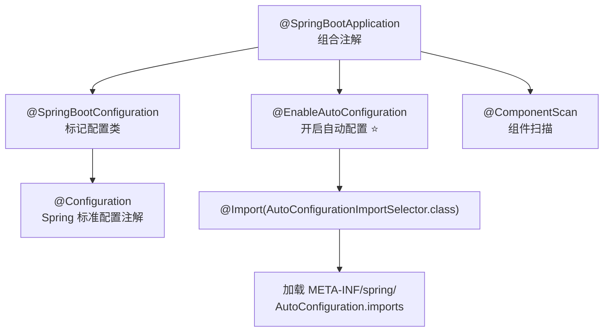
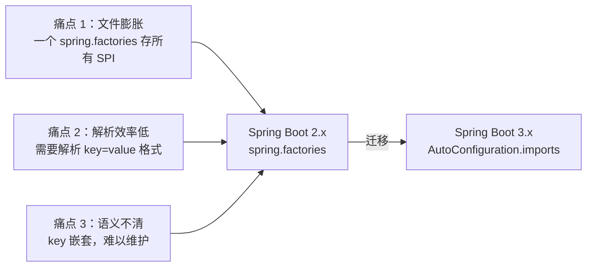
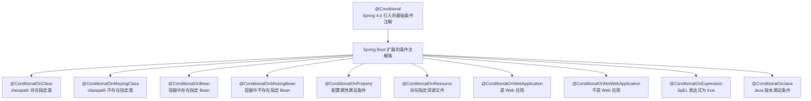
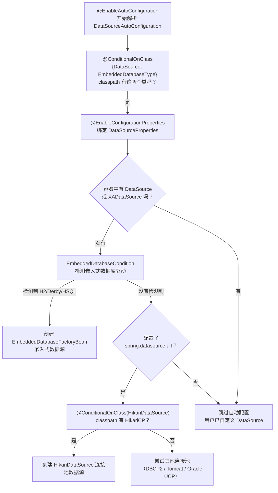

# Spring Boot 自动配置原理

## ⭐ 面试重点速览

| 知识模块 | 重点内容 | 面试频率 |
|----------|----------|----------|
| @SpringBootApplication | 3 个核心注解拆解、组合关系 | 极高 |
| @EnableAutoConfiguration | @Import 机制、AutoConfigurationImportSelector | 极高 |
| 自动配置加载全链路 | selectImports → getAutoConfigurationEntry → getCandidateConfigurations | 高 |
| Spring Boot 3.x 迁移 | spring.factories → AutoConfiguration.imports | 中高 |
| 条件注解体系 | @ConditionalOnClass / @ConditionalOnMissingBean 等 8 个注解 | 极高 |
| 案例分析 | DataSourceAutoConfiguration 条件组合使用 | 中高 |
| 自定义 Starter | 实战开发能力 | 中高 |

---

## 一、什么是自动配置？

**自动配置（Auto-Configuration）** 是 Spring Boot 最核心的特性。它根据 classpath 中的 jar 包依赖、已定义的 Bean、各种属性配置等条件，自动完成 Spring 应用上下文的配置，极大简化了开发者的配置工作。

**核心思想**：约定优于配置（Convention over Configuration）。

::: tip 传统 Spring vs Spring Boot

| 对比维度 | 传统 Spring | Spring Boot |
|----------|-------------|-------------|
| 数据源配置 | 手动配置 DataSource Bean，指定驱动/URL/用户名/密码 | 引入 spring-boot-starter-jdbc，配置文件写 URL 即可 |
| 事务管理 | 手动开启 @EnableTransactionManagement | 自动配置，无需手动开启 |
| MVC 配置 | 手动配置 DispatcherServlet、ViewResolver 等 | 引入 spring-boot-starter-web 即可 |
| 日志配置 | 手动引入 Logback、配置 logback.xml | 自动检测 classpath 中的日志框架并配置 |

:::

::: danger 面试关键认知

自动配置不是凭空"魔法"，而是通过 **条件注解 + SPI 加载机制** 实现的工程化方案。理解其原理是 Spring Boot 面试的"分水岭"——背答案的人只会说"自动配置很方便"，而真正理解的候选人能画全链路流程图、讲清每个条件注解的判断逻辑。

:::

---

## 二、⭐ @SpringBootApplication 注解构成

`@SpringBootApplication` 是 Spring Boot 项目的入口注解，它是一个组合注解，等价于三个核心注解的组合：

```java
@Target(ElementType.TYPE)
@Retention(RetentionPolicy.RUNTIME)
@Documented
@Inherited
@SpringBootConfiguration          // 等价于 @Configuration
@EnableAutoConfiguration          // 核心：开启自动配置
@ComponentScan(                    // 组件扫描
    excludeFilters = { @Filter(type = FilterType.CUSTOM, 
        classes = TypeExcludeFilter.class),
    @Filter(type = FilterType.CUSTOM, 
        classes = AutoConfigurationExcludeFilter.class) }
)
public @interface SpringBootApplication {
    // ... 属性定义
}
```



### 2.1 @SpringBootConfiguration

```java
@Target(ElementType.TYPE)
@Retention(RetentionPolicy.RUNTIME)
@Documented
@Configuration                                        // 本质就是 @Configuration
@Indexed
public @interface SpringBootConfiguration {
    @AliasFor(annotation = Configuration.class)
    boolean proxyBeanMethods() default true;
}
```

本质上就是 `@Configuration` 的语义增强版本，表示该类是一个 Spring 配置类。与普通 `@Configuration` 的区别主要是命名上的区分，让开发者一眼识别这是 Spring Boot 应用的入口配置类。

### 2.2 @EnableAutoConfiguration

这是自动配置的**核心驱动注解**，是整个自动配置体系的"开关"：

```java
@Target(ElementType.TYPE)
@Retention(RetentionPolicy.RUNTIME)
@Documented
@Inherited
@AutoConfigurationPackage                              // 注册自动配置包
@Import(AutoConfigurationImportSelector.class)          // ⭐ 核心：导入自动配置选择器
public @interface EnableAutoConfiguration {
    String ENABLED_OVERRIDE_PROPERTY = "spring.boot.enableautoconfiguration";
    Class<?>[] exclude() default {};                     // 排除特定自动配置类
    String[] excludeName() default {};                   // 排除特定自动配置类名
}
```

关键点：
- `@Import(AutoConfigurationImportSelector.class)` 是核心机制，通过 `@Import` 导入一个 `ImportSelector` 实现类
- `AutoConfigurationImportSelector` 负责从 classpath 中读取并筛选所有候选的自动配置类
- `exclude` / `excludeName` 属性允许开发者排除不需要的自动配置类

### 2.3 @ComponentScan

负责组件扫描，Spring Boot 对其做了定制：**默认不扫描自动配置类**，避免自动配置类被错误地注册为普通 Bean。

```java
// @SpringBootApplication 中 @ComponentScan 的默认配置
@ComponentScan(
    excludeFilters = {
        @Filter(type = FilterType.CUSTOM, 
            classes = TypeExcludeFilter.class),         // 支持通过 spring.beaninfo.ignore 排除
        @Filter(type = FilterType.CUSTOM, 
            classes = AutoConfigurationExcludeFilter.class)  // 排除自动配置类
    }
)
```

`AutoConfigurationExcludeFilter` 会检查类是否在 `META-INF/spring/org.springframework.boot.autoconfigure.AutoConfiguration.imports` 中注册过，如果是则不扫描。这保证了自动配置类只由 `AutoConfigurationImportSelector` 统一加载，遵循自动配置的完整条件判断流程。

::: tip 为什么自动配置类需要排除在组件扫描之外？

自动配置类必须经过条件注解的层层筛选后才能决定是否生效。如果 `@ComponentScan` 不加过滤地扫描它们，这些类会绕过条件判断直接被注册为 Bean，导致自动配置的"按需生效"机制失效。

:::

---

## 三、@EnableAutoConfiguration 原理

### 3.1 @Import 机制回顾

Spring 中 `@Import` 注解用于导入一个或多个类到 Spring 容器中。它支持导入三种类型：

```java
// 1. 导入普通 @Configuration 类
@Import(MyConfiguration.class)

// 2. 导入 ImportSelector 实现 —— 程序化选择哪些类需要导入
@Import(MyImportSelector.class)                        // ⭐ AutoConfigurationImportSelector 就是这种方式

// 3. 导入 ImportBeanDefinitionRegistrar —— 直接注册 BeanDefinition
@Import(MyBeanDefinitionRegistrar.class)
```

`AutoConfigurationImportSelector` 实现了 `ImportSelector` 接口，Spring 在解析 `@Import` 时，会调用它的 `selectImports()` 方法，返回需要导入的配置类全限定名数组。

### 3.2 ImportSelector 接口

```java
public interface ImportSelector {
    // 返回需要导入的类的全限定名
    String[] selectImports(AnnotationMetadata importingClassMetadata);
    
    // 提供一个断言过滤器（可选实现）
    @Nullable
    default Predicate<String> getExclusionFilter() {
        return null;
    }
}
```

`AutoConfigurationImportSelector` 实现了 `DeferredImportSelector`（`ImportSelector` 的子接口），延迟导入意味着所有用户定义的 Bean 先处理完后再处理自动配置类，确保条件注解（如 `@ConditionalOnMissingBean`）能正确判断。

---

## 四、⭐ AutoConfigurationImportSelector 加载全链路

这是面试中**最能体现深度**的部分。完整加载链路如下：

```mermaid
sequenceDiagram
    participant App as SpringApplication
    participant Context as ApplicationContext
    participant Selector as AutoConfigurationImportSelector
    participant Loader as SpringFactoriesLoader
    participant File as AutoConfiguration.imports

    App->>Context: refresh() 刷新容器
    Context->>Selector: 解析 @Import 触发 selectImports()
    Selector->>Selector: 1. selectImports(metadata)
    Selector->>Selector: 2. getAutoConfigurationEntry(metadata)
    Selector->>Selector: 3. getCandidateConfigurations(metadata, attributes)
    Selector->>Loader: 4. SpringFactoriesLoader.loadFactoryNames()
    Loader->>File: 5. 读取 META-INF/spring/AutoConfiguration.imports
    File-->>Loader: 返回所有候选类名
    Loader-->>Selector: List&lt;String&gt; 候选配置类名
    Selector->>Selector: 6. 去重 + 应用 exclude 排除
    Selector->>Selector: 7. 按条件注解筛选（@ConditionalOnXxx）
    Selector-->>Context: 返回最终生效的配置类列表
    Context->>Context: 注册符合条件的自动配置类 Bean
```

### 4.1 核心源码分析

```java
// AutoConfigurationImportSelector 核心逻辑（简化版）
public class AutoConfigurationImportSelector 
        implements DeferredImportSelector, BeanClassLoaderAware, ... {

    // 第 1 步：selectImports —— 入口方法
    @Override
    public String[] selectImports(AnnotationMetadata annotationMetadata) {
        if (!isEnabled(annotationMetadata)) {
            return NO_IMPORTS;           // 如果属性关闭了自动配置，直接返回空
        }
        // 进入核心流程
        AutoConfigurationEntry entry = getAutoConfigurationEntry(annotationMetadata);
        return StringUtils.toStringArray(entry.getConfigurations());
    }

    // 第 2 步：getAutoConfigurationEntry —— 获取自动配置条目
    protected AutoConfigurationEntry getAutoConfigurationEntry(
            AnnotationMetadata annotationMetadata) {
        // 检查自动配置开关（spring.boot.enableautoconfiguration）
        if (!isEnabled(annotationMetadata)) {
            return EMPTY_ENTRY;
        }
        
        // 获取 @EnableAutoConfiguration 注解的属性（exclude / excludeName）
        AnnotationAttributes attributes = getAttributes(annotationMetadata);
        
        // ⭐ 第 3 步：获取所有候选自动配置类
        List<String> configurations = getCandidateConfigurations(annotationMetadata, attributes);
        
        // 去重
        configurations = removeDuplicates(configurations);
        
        // 应用 exclude 排除规则
        Set<String> exclusions = getExclusions(annotationMetadata, attributes);
        configurations.removeAll(exclusions);
        
        // ⭐ 第 7 步：条件过滤 —— 只保留 classpath 和条件都满足的
        configurations = getConfigurationClassFilter().filter(configurations);
        
        // 发布自动配置导入事件（给 Actuator 做监控用）
        fireAutoConfigurationImportEvents(configurations, exclusions);
        
        return new AutoConfigurationEntry(configurations, exclusions);
    }

    // 第 3 步：getCandidateConfigurations —— 从配置文件读取候选类
    protected List<String> getCandidateConfigurations(
            AnnotationMetadata metadata, 
            AnnotationAttributes attributes) {
        // ⭐ 核心：通过 SpringFactoriesLoader 加载
        List<String> configurations = SpringFactoriesLoader.loadFactoryNames(
            getSpringFactoriesLoaderFactoryClass(),     // EnableAutoConfiguration.class
            getBeanClassLoader()
        );
        return configurations;
    }
}
```

### 4.2 SpringFactoriesLoader 加载机制

```java
// SpringFactoriesLoader —— Spring Boot 3.x 关键变化点
public final class SpringFactoriesLoader {

    // 加载所有实现某个类型的工厂类名
    public static List<String> loadFactoryNames(
            Class<?> factoryType, 
            @Nullable ClassLoader classLoader) {
        
        String factoryTypeName = factoryType.getName();
        
        // 1. 从 META-INF/spring/org.springframework.boot.autoconfigure.AutoConfiguration.imports 加载
        // 2. 同时兼容旧的 META-INF/spring.factories 文件（但会输出废弃警告）
        return loadSpringFactories(classLoader)
            .getOrDefault(factoryTypeName, Collections.emptyList());
    }
}
```

::: warning Spring Boot 2.x vs 3.x 加载差异

| 版本 | 加载文件 | 格式 |
|------|----------|------|
| 2.x | `META-INF/spring.factories` | `key=value1,value2` 键值对格式 |
| 3.x | `META-INF/spring/org.springframework.boot.autoconfigure.AutoConfiguration.imports` | 每行一个类名（纯文本列表） |
| 3.x 兼容 | 仍读取 `spring.factories` 但会打印废弃警告 | — |

:::

### 4.3 条件过滤机制

`getConfigurationClassFilter().filter(configurations)` 这一步会遍历所有候选配置类，逐类检查其条件注解：

```java
// 内部类 ConfigurationClassFilter 的过滤逻辑（简化）
private class ConfigurationClassFilter {
    private final ConfigurationClassParser parser;  // 🔁 修改点 — 保持稳定引用，待 context.refresh() 完成

    List<String> filter(List<String> configurations) {
        List<String> result = new ArrayList<>();
        for (String className : configurations) {
            // 跳过排除的类
            if (isExcluded(className)) continue;
            // 条件匹配检查
            if (isConditionMatch(className)) {
                result.add(className);
            }
        }
        return result;
    }
    // ...
}
```

**性能优化**：Spring Boot 不会为每个候选配置类都执行完整的类加载和条件判断。它通过读取 `.class` 文件的注解元数据（ASM 字节码技术），在不加载类的情况下快速判断条件是否匹配。

---

## 五、⭐ Spring Boot 3.x 迁移：spring.factories → AutoConfiguration.imports

### 5.1 为什么做这个改变？



#### 旧格式（spring.factories）

```
# spring-boot-autoconfigure-2.7.x.jar
org.springframework.boot.autoconfigure.EnableAutoConfiguration=\
org.springframework.boot.autoconfigure.aop.AopAutoConfiguration,\
org.springframework.boot.autoconfigure.jdbc.DataSourceAutoConfiguration,\
org.springframework.boot.autoconfigure.web.servlet.WebMvcAutoConfiguration,\
...（数百个类名挤在一起，难以阅读和维护）
```

**问题**：
1. **文件膨胀**：所有 SPI 声明挤在一个文件中，自动配置、初始化器、监听器、失败分析器混在一起
2. **解析复杂**：需要解析 `key=value1,value2` 格式，value 可能很长需要反斜杠续行
3. **维护困难**：修改一个自动配置类名可能导致 merge 冲突，改动粒度太粗
4. **语义模糊**：`spring.factories` 是一个通用 SPI 文件，不能体现"自动配置"这一特定用途

#### 新格式（AutoConfiguration.imports）

```
# spring-boot-autoconfigure-3.x.jar
# META-INF/spring/org.springframework.boot.autoconfigure.AutoConfiguration.imports
org.springframework.boot.autoconfigure.aop.AopAutoConfiguration
org.springframework.boot.autoconfigure.jdbc.DataSourceAutoConfiguration
org.springframework.boot.autoconfigure.web.servlet.WebMvcAutoConfiguration
```

**优势**：
1. **专用文件**：文件名明确表示这是自动配置列表，语义清晰
2. **格式简单**：每行一个类名，无需解析 key-value，不需要反斜杠续行
3. **易于维护**：增删改一行即一次变更，git diff 清晰可读
4. **性能提升**：按行读取，解析开销极小

### 5.2 加载顺序兼容

Spring Boot 3.x 的 `SpringFactoriesLoader` 仍然兼容旧的 `spring.factories`，但会输出废弃警告：

```java
// SpringFactoriesLoader 中的加载逻辑（简化）
static Map<String, List<String>> loadSpringFactories(ClassLoader classLoader) {
    Map<String, List<String>> result = new LinkedHashMap<>();
    
    // 优先加载新的专用文件（没有警告）
    result.putAll(loadAutoConfigurationImportFiles(classLoader));
    
    // 兼容加载旧的 spring.factories（输出 WARN 日志）
    List<String> fromLegacy = loadLegacySpringFactories(classLoader);
    if (!fromLegacy.isEmpty()) {
        logger.warn("spring.factories 已废弃，请迁移到 .imports 文件");
        result.putAll(fromLegacy);
    }
    
    return result;
}
```

### 5.3 文件位置约定

| 场景 | 文件位置 |
|------|----------|
| Spring Boot 官方自动配置 | `spring-boot-autoconfigure.jar` 内的 `META-INF/spring/org.springframework.boot.autoconfigure.AutoConfiguration.imports` |
| 自定义 Starter | 你的 starter 项目 `src/main/resources/META-INF/spring/org.springframework.boot.autoconfigure.AutoConfiguration.imports` |
| 第三方库集成 | 第三方 jar 的对应路径 |

::: tip 迁移指南
如果你从 Spring Boot 2.x 升级到 3.x，需要将 `spring.factories` 中 `org.springframework.boot.autoconfigure.EnableAutoConfiguration` 键对应的值逐行提取到 `AutoConfiguration.imports` 文件中。其他 SPI（如 `ApplicationContextInitializer`）可继续使用 `spring.factories`。
:::

---

## 六、⭐ 条件注解详解

条件注解是自动配置的"筛选器"，决定一个自动配置类是否在当前环境下生效。Spring Boot 提供了丰富的条件注解体系：



### 6.1 @ConditionalOnClass

当 classpath 中存在指定类时生效。这是最常用的条件注解。

```java
// 示例：只有引入 spring-webmvc 依赖时，这个自动配置类才生效
@Configuration(proxyBeanMethods = false)
@ConditionalOnClass({ DispatcherServlet.class, WebMvcConfigurer.class })
public class WebMvcAutoConfiguration {
    // 配置 DispatcherServlet、ViewResolver 等 MVC 组件
}
```

::: tip @ConditionalOnClass 使用 ASM 而非反射

Spring Boot 通过 ASM 字节码框架读取 `.class` 文件的常量池，判断类名是否存在，**不会真正加载这个类**。这避免了 classpath 中缺少该类时抛出 `ClassNotFoundException`。

```java
// 内部实现原理（简化）
// 通过 ClassLoader.getResource() 获取 .class 文件路径
// 然后使用 ASM ClassReader 读取字节码
String resourcePath = className.replace('.', '/') + ".class";
URL resource = classLoader.getResource(resourcePath);
return resource != null;  // 能找到 .class 文件即存在
```

:::

### 6.2 @ConditionalOnMissingBean

当容器中不存在指定类型的 Bean 时生效。这是实现"用户自定义优先"的关键。

```java
@Configuration(proxyBeanMode = false)
public class JdbcTemplateAutoConfiguration {

    @Bean
    @ConditionalOnMissingBean(JdbcOperations.class)  // 用户自定义了 JdbcTemplate 则跳过
    public JdbcTemplate jdbcTemplate(DataSource dataSource) {
        return new JdbcTemplate(dataSource);
    }
}
```

`@ConditionalOnMissingBean` 体现了自动配置的"退让"原则：**如果用户已经自己定义了 Bean，自动配置就不再创建**，避免覆盖用户的自定义 Bean。

### 6.3 @ConditionalOnProperty

根据配置文件中的属性值决定是否生效。支持前缀、名称、匹配值等灵活配置。

```java
@Configuration(proxyBeanMethods = false)
@ConditionalOnProperty(
    prefix = "spring.datasource",    // 属性前缀
    name = "url",                     // 属性名 → 完整路径为 spring.datasource.url
    matchIfMissing = false            // 属性不存在时是否匹配（默认 false）
)
public class DataSourceAutoConfiguration {
    // 只有配置了 spring.datasource.url 时才创建 DataSource
}
```

```yaml
# application.yml —— 配置了 spring.datasource.url，条件满足
spring:
  datasource:
    url: jdbc:mysql://localhost:3306/mydb
    username: root
    password: 123456
```

::: tip matchIfMissing 参数
- `matchIfMissing = true`：属性不存在时条件也视为满足（常用于"默认开启，可通过属性关闭"的场景）
- `matchIfMissing = false`（默认）：属性不存在时条件不满足
:::

### 6.4 @ConditionalOnBean

当容器中存在指定 Bean 时才生效。

```java
@Configuration(proxyBeanMethods = false)
@ConditionalOnBean(DataSource.class)  // 只有存在 DataSource Bean 时才配置事务管理器
public class DataSourceTransactionManagerAutoConfiguration {

    @Bean
    @ConditionalOnMissingBean
    public PlatformTransactionManager transactionManager(DataSource dataSource) {
        return new DataSourceTransactionManager(dataSource);
    }
}
```

### 6.5 @ConditionalOnMissingClass

与 @ConditionalOnClass 相反，当 classpath 中不存在指定类时生效。

```java
@Configuration(proxyBeanMethods = false)
@ConditionalOnMissingClass("org.springframework.web.servlet.DispatcherServlet")
// 非 Web 环境下加载的配置
public class NonWebAutoConfiguration {
    // ...
}
```

### 6.6 @ConditionalOnWebApplication

根据应用类型决定是否生效。

```java
@Configuration(proxyBeanMethods = false)
@ConditionalOnWebApplication(type = ConditionalOnWebApplication.Type.SERVLET)
// 仅在 Servlet Web 环境下生效（排除 Reactive Web 环境）
public class ServletWebServerFactoryAutoConfiguration {
    // 配置 Tomcat / Jetty / Undertow 等 Servlet 容器
}
```

### 6.7 条件注解优先级

多个条件注解同时作用时的处理顺序：

| 优先级 | 条件注解 | 执行阶段 |
|--------|----------|----------|
| 最高 | `@ConditionalOnClass` / `@ConditionalOnMissingClass` | Phase 1：classpath 检查（使用 ASM，不加载类） |
| 高 | `@ConditionalOnProperty` | Phase 2：配置属性检查 |
| 中 | `@ConditionalOnBean` / `@ConditionalOnMissingBean` | Phase 3：容器 Bean 检查（需解析 BeanDefinition） |
| 低 | `@ConditionalOnWebApplication` | Phase 4：环境类型检查 |
| 最低 | `@ConditionalOnExpression` | Phase 5：SpEL 表达式求值 |

::: danger 常见陷阱：@ConditionalOnBean 的加载顺序问题

`@ConditionalOnBean` 的判断依赖其他 Bean 是否已被注册。如果你在自定义自动配置类中使用 `@ConditionalOnBean`，确保被依赖的 Bean 在你的配置类之前被处理。推荐使用 `@AutoConfigureBefore` / `@AutoConfigureAfter` 控制配置类的加载顺序：

```java
@Configuration(proxyBeanMethods = false)
@AutoConfigureAfter(DataSourceAutoConfiguration.class)   // 在 DataSource 自动配置之后
@ConditionalOnBean(DataSource.class)                      // 确保 DataSource 已注册
public class MyJdbcAutoConfiguration {
    // ...
}
```

:::

---

## 七、自动配置类案例分析：DataSourceAutoConfiguration

以 `DataSourceAutoConfiguration` 为例，分析真实自动配置类中的条件注解组合使用：

```java
// 真实的 DataSourceAutoConfiguration 源码（Spring Boot 3.x 简化版）
@AutoConfiguration(after = SqlInitializationAutoConfiguration.class)  // 标记为自动配置类
@ConditionalOnClass({ DataSource.class, EmbeddedDatabaseType.class })
@EnableConfigurationProperties(DataSourceProperties.class)
@Import({ DataSourcePoolMetadataProvidersConfiguration.class,
          DataSourceCheckpointRestoreConfiguration.class })
public class DataSourceAutoConfiguration {

    // ═══════════════════════════════════════════════
    // 嵌入式数据库自动配置（H2 / Derby / HSQL）
    // ═══════════════════════════════════════════════
    @Configuration(proxyBeanMethods = false)
    @Conditional(EmbeddedDatabaseCondition.class)                // 条件 1：检测到嵌入式数据库
    @ConditionalOnMissingBean({ DataSource.class, XADataSource.class })
    static class EmbeddedDatabaseConfiguration {

        @Bean
        @ConditionalOnMissingBean
        EmbeddedDatabaseFactoryBean dataSource(
                DataSourceProperties properties) {
            // 创建嵌入式数据库的 DataSource
            EmbeddedDatabaseFactoryBean factory = new EmbeddedDatabaseFactoryBean();
            factory.setDatabaseProperties(properties);
            return factory;
        }
    }

    // ═══════════════════════════════════════════════
    // 连接池数据源自动配置（HikariCP）
    // ═══════════════════════════════════════════════
    @Configuration(proxyBeanMethods = false)
    @ConditionalOnProperty(prefix = "spring.datasource", name = "url")
    @ConditionalOnMissingBean({ DataSource.class, XADataSource.class })
    @ConditionalOnClass(HikariDataSource.class)
    @Import(Hikari.class)                                      // HikariCP 连接池配置
    static class PooledDataSourceConfiguration {
        // 使用 HikariCP 作为连接池创建 DataSource
    }

    // ═══════════════════════════════════════════════
    // 连接池配置（HikariCP 默认）
    // ═══════════════════════════════════════════════
    @Configuration(proxyBeanMethods = false)
    @ConditionalOnClass(HikariDataSource.class)
    @ConditionalOnMissingBean(DataSource.class)
    @ConditionalOnProperty(
        name = "spring.datasource.type", 
        havingValue = "com.zaxxer.hikari.HikariDataSource", 
        matchIfMissing = true                                   // 默认就是 HikariCP
    )
    static class Hikari {
        @Bean
        @ConditionalOnMissingBean
        HikariDataSource dataSource(
                DataSourceProperties properties) {
            // 使用属性绑定创建 HikariCP DataSource
            HikariDataSource dataSource = properties
                .initializeDataSourceBuilder()
                .type(HikariDataSource.class)
                .build();
            return dataSource;
        }
    }
}
```

### 7.1 条件注解组合分析



### 7.2 条件逻辑总结

`DataSourceAutoConfiguration` 展现了自动配置的核心设计模式：

1. **分层条件**：外层 `@ConditionalOnClass` 做 classpath 粗筛，内层 `@ConditionalOnMissingBean` + `@ConditionalOnProperty` 做细粒度控制
2. **内部配置类**：使用 `static` 内部类隔离不同场景的配置（嵌入式 vs 连接池），每个内部类有独立的条件注解
3. **退让原则**：`@ConditionalOnMissingBean` 保证用户自定义 Bean 优先
4. **默认值智能选择**：`matchIfMissing = true` 让 HikariCP 成为默认连接池

---

## 八、自动配置执行流程图（全景）

```mermaid
sequenceDiagram
    participant App as Spring Boot 应用
    participant SA as SpringApplication
    participant AC as ApplicationContext
    participant MB as @SpringBootApplication
    participant EA as @EnableAutoConfiguration
    participant AIS as AutoConfigurationImportSelector
    participant SFL as SpringFactoriesLoader
    participant Imports as AutoConfiguration.imports
    participant Filter as 条件过滤器
    participant Bean as 自动配置 Bean

    App->>SA: SpringApplication.run()
    SA->>AC: 创建 ApplicationContext
    AC->>MB: 解析 @SpringBootApplication
    MB->>EA: 解析 @EnableAutoConfiguration
    EA->>AIS: @Import(AutoConfigurationImportSelector)
    AC->>AIS: 触发 DeferredImportSelector.selectImports()
    AIS->>AIS: 检查 spring.boot.enableautoconfiguration 开关
    AIS->>AIS: 获取 exclude/excludeName 排除列表
    AIS->>SFL: loadFactoryNames(EnableAutoConfiguration)
    SFL->>Imports: 读取所有 jar 中的 AutoConfiguration.imports
    Imports-->>SFL: 返回候选配置类列表（约 150+ 个）
    SFL-->>AIS: List&lt;String&gt; 候选类名
    AIS->>AIS: 去重 + 排除
    AIS->>Filter: 逐类条件过滤
    Filter->>Filter: Phase 1: @ConditionalOnClass（ASM 字节码）
    Filter->>Filter: Phase 2: @ConditionalOnProperty（配置属性）
    Filter->>Filter: Phase 3: @ConditionalOnMissingBean（容器检查）
    Filter->>Filter: Phase 4: @ConditionalOnWebApplication
    Filter-->>AIS: 返回条件匹配的配置类
    AIS->>AC: 注册符合条件的配置类
    AC->>Bean: 创建自动配置 Bean 实例
```

---

## 九、自动配置失败分析

### 9.1 自动配置报告

Spring Boot 提供了自动配置报告功能，帮助开发者诊断哪些自动配置生效、哪些被跳过及原因：

```yaml
# application.yml —— 开启自动配置报告
debug: true
# 或启动时加参数：--debug
```

启动后会输出类似以下格式的报告：

```
============================
CONDITIONS EVALUATION REPORT
============================

Positive matches:
-----------------
   DataSourceAutoConfiguration matched:
      - @ConditionalOnClass found required classes 
        'javax.sql.DataSource', 'org.springframework.jdbc.datasource.embedded.EmbeddedDatabaseType'
      - @ConditionalOnProperty (spring.datasource.url) matched

Negative matches:
-----------------
   RabbitAutoConfiguration:
      Did not match:
         - @ConditionalOnClass did not find required class 
           'com.rabbitmq.client.Channel'
```

### 9.2 Actuator 端点监控

引入 `spring-boot-starter-actuator` 后，可以通过 HTTP 端点查看：

```yaml
# 开启 condition 端点
management:
  endpoints:
    web:
      exposure:
        include: conditions
```

访问 `GET /actuator/conditions` 即可获得完整的条件匹配报告。

::: tip 调试技巧

当你引入了一个 starter 但功能没生效时：
1. 开启 `debug: true` 查看 CONDITIONS EVALUATION REPORT
2. 在 Negative matches 中找到与你的功能相关的自动配置类
3. 查看 "Did not match" 的原因，针对性修复

:::

---

## 十、自定义自动配置 Starter

理解原理后，动手写一个自定义 Starter 是检验学习效果的最佳方式：

### 10.1 项目结构

```
my-spring-boot-starter/
└── src/
    └── main/
        ├── java/
        │   └── com/example/
        │       ├── MyService.java                    # 核心服务类
        │       ├── MyProperties.java                 # 配置属性类
        │       └── MyAutoConfiguration.java          # 自动配置类
        └── resources/
            └── META-INF/
                └── spring/
                    └── org.springframework.boot.autoconfigure.AutoConfiguration.imports
```

### 10.2 核心代码

```java
// 1. 配置属性类 —— 让用户可以在 application.yml 中配置
@ConfigurationProperties(prefix = "my.service")
public class MyProperties {
    private boolean enabled = true;      // 默认开启
    private String name = "default";     // 默认名称
    private int timeout = 3000;          // 默认超时 3 秒
    // getter / setter 省略
}
```

```java
// 2. 核心服务类
public class MyService {
    private final MyProperties properties;

    public MyService(MyProperties properties) {
        this.properties = properties;
    }

    public String hello() {
        return "Hello from " + properties.getName() 
            + ", timeout=" + properties.getTimeout() + "ms";
    }
}
```

```java
// 3. 自动配置类
@AutoConfiguration                                               // Spring Boot 3.x 新注解
@EnableConfigurationProperties(MyProperties.class)               // 启用属性绑定
@ConditionalOnClass(MyService.class)                             // classpath 有这个类
@ConditionalOnProperty(prefix = "my.service", name = "enabled", 
    havingValue = "true", matchIfMissing = true)                 // 可通过属性控制开关
public class MyAutoConfiguration {

    @Bean
    @ConditionalOnMissingBean                                     // 用户自定义优先
    public MyService myService(MyProperties properties) {
        return new MyService(properties);
    }
}
```

```java
// 4. AutoConfiguration.imports 文件内容
// META-INF/spring/org.springframework.boot.autoconfigure.AutoConfiguration.imports
com.example.MyAutoConfiguration
```

### 10.3 使用方式

```yaml
# 引入 starter 后的 application.yml 配置
my:
  service:
    enabled: true
    name: production
    timeout: 5000
```

```java
// 业务代码中直接注入即可使用
@Service
public class BusinessService {
    @Autowired
    private MyService myService;  // 自动配置创建，开箱即用
    
    public void doSomething() {
        System.out.println(myService.hello());
    }
}
```

---

## ⭐ 面试高频问题汇总

### Q1：Spring Boot 的自动配置是如何实现的？请简述核心原理。

**核心机制**：`@EnableAutoConfiguration` → `@Import(AutoConfigurationImportSelector.class)` → 读取 `META-INF/spring/org.springframework.boot.autoconfigure.AutoConfiguration.imports` → 获取所有候选配置类 → 通过条件注解过滤 → 注册符合条件的配置类。

**一句话总结**：通过 SPI 加载机制收集候选配置类，再通过条件注解体系进行筛选，最终按需注册 Bean。

### Q2：@SpringBootApplication 由哪几个注解组成？各自的作用是什么？

| 注解 | 作用 |
|------|------|
| `@SpringBootConfiguration` | 标记该类为配置类（本质是 `@Configuration`） |
| `@EnableAutoConfiguration` | 触发自动配置加载机制（核心） |
| `@ComponentScan` | 组件扫描，自动发现并注册 `@Component` 等注解的 Bean |

`@ComponentScan` 中配置了 `AutoConfigurationExcludeFilter`，确保自动配置类不会被重复扫描。

### Q3：AutoConfigurationImportSelector 的加载全链路是怎样的？

selectImports → getAutoConfigurationEntry → getCandidateConfigurations → SpringFactoriesLoader.loadFactoryNames → 读取 AutoConfiguration.imports → 去重 + 应用 exclude 排除 → 条件注解过滤（@ConditionalOnClass 等）→ 返回最终生效的配置类列表 → 容器注册。

### Q4：Spring Boot 3.x 为什么将 spring.factories 迁移到 AutoConfiguration.imports？

| 旧方案问题 | 新方案优势 |
|------------|------------|
| 所有 SPI 声明挤在一个文件中 | 专用于自动配置，语义清晰 |
| 需要解析 key=value 格式 | 每行一个类名，解析简单 |
| 反斜杠续行，可读性差 | 一行一个，diff 清晰 |
| 改一行可能引发 merge 冲突 | 改动粒度小，易维护 |

### Q5：@ConditionalOnClass 是如何判断 classpath 中是否存在某个类的？它和直接 try-catch Class.forName 有什么区别？

Spring Boot 使用 **ASM 字节码技术**读取 `.class` 文件的常量池判断类名是否存在，不会真正加载类。与 `Class.forName()` 的区别：

| 方式 | Class.forName() | @ConditionalOnClass（ASM） |
|------|-----------------|---------------------------|
| 是否加载类 | 是（触发 static 初始化） | 否（只读字节码元数据） |
| 类不存在时 | 抛出 ClassNotFoundException | 返回 false，不抛异常 |
| 性能 | 高开销 | 低开销 |

### Q6：说一下 DataSourceAutoConfiguration 的条件注解组合，以及每种条件的作用？

- `@ConditionalOnClass({DataSource.class, EmbeddedDatabaseType.class})`：classpath 中存在 JDBC 相关类
- `EmbeddedDatabaseCondition`：检测嵌入式数据库驱动类是否存在
- `@ConditionalOnProperty(prefix="spring.datasource", name="url")`：用户配置了数据库连接 URL
- `@ConditionalOnMissingBean({DataSource.class, XADataSource.class})`：用户没有自定义 DataSource
- `@ConditionalOnClass(HikariDataSource.class)`：classpath 中有 HikariCP 连接池

这些条件通过分层组合，实现了：嵌入式数据库优先 → 用户自定义优先 → HikariCP 连接池 → 其他连接池的优先级链。

### Q7：@ConditionalOnBean 和 @ConditionalOnMissingBean 的加载顺序问题如何解决？

`@ConditionalOnBean` 需要等到被依赖的 Bean 被注册后才能判断。解决方式：
1. 使用 `@AutoConfigureAfter` / `@AutoConfigureBefore` 控制配置类加载顺序
2. 使用 `@AutoConfigureOrder` 指定数值优先级
3. 将条件注解放在内部类上，利用外部类先注册、内部类后处理的机制

### Q8：如何实现一个自定义的 Spring Boot Starter？

核心四要素：

1. **配置属性类**：`@ConfigurationProperties(prefix = "xxx")`，让用户可配置
2. **自动配置类**：`@AutoConfiguration` + 条件注解组合
3. **AutoConfiguration.imports 文件**：注册自动配置类
4. **可选的 spring-boot-starter 空项目**：统一管理依赖传递

具体代码和项目结构见上文第十章。

### Q9：如何排查自动配置为什么不生效？

三步法：
1. 开启 `debug: true` 查看 CONDITIONS EVALUATION REPORT
2. 在 Negative matches 中找到目标自动配置类，查看 "Did not match" 原因
3. 针对性修复（添加缺失的依赖、配置属性、或去掉冲突的类）

### Q10：Spring Boot 自动配置和 Spring 的 @Import 机制是什么关系？

`@Import` 是 Spring 提供的 Bean 导入机制，`AutoConfigurationImportSelector` 通过实现 `ImportSelector` 接口（具体是 `DeferredImportSelector`）介入 `@Import` 的处理流程。Spring 解析 `@EnableAutoConfiguration` 上的 `@Import` 时，调用 `selectImports()` 返回需要导入的配置类名列表，从而批量、程序化地导入自动配置类。

---

## 面试追问环节

**Q：如果让你设计一个框架的自动配置机制，你会怎么做？**

核心设计思路：

1. **SPI 加载层**：通过 classpath 扫描，收集所有候选配置类（类似 `AutoConfiguration.imports`）
2. **条件过滤层**：定义一套条件注解体系，支持 classpath 检查、属性检查、Bean 存在性检查等
3. **优先级控制**：支持配置类之间的排序（`@AutoConfigureBefore` / `@AutoConfigureAfter`）
4. **性能优化**：使用 ASM 字节码技术避免不必要的类加载
5. **调试支持**：提供配置报告，让开发者了解每个配置类的匹配/不匹配原因

**Q：Spring Boot 启动时加载了多少个自动配置类？这些类都会被实例化吗？**

Spring Boot 3.x 的 `spring-boot-autoconfigure` 中注册了约 150+ 个候选自动配置类，但**实际被实例化的只有条件匹配的那一部分**。条件过滤通过 ASM 读取注解元数据，在不加载类的情况下完成判断，未匹配的类不会触发类加载和实例化，从而保证了启动性能。