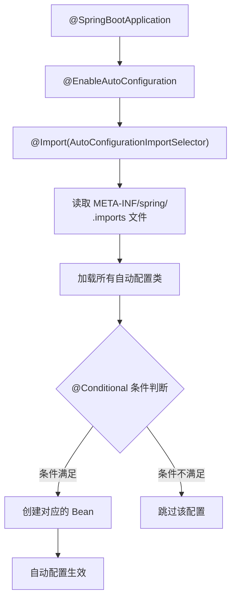
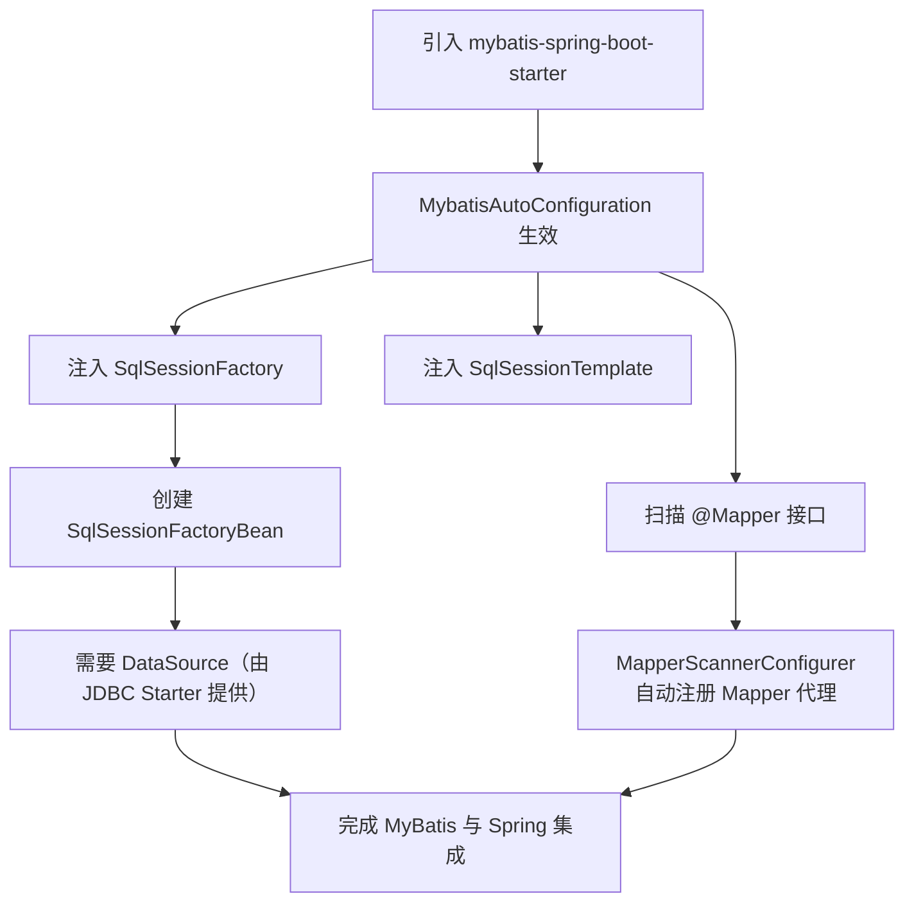

# Starter 机制与自定义

## ⭐ 面试重点速览

| 知识模块 | 重点内容 | 面试频率 |
|----------|----------|----------|
| Starter 命名规范 | 官方 vs 第三方命名规则、Maven 坐标查找机制 | 中高 |
| 自动配置原理 | @EnableAutoConfiguration、spring.factories、AutoConfiguration.imports | 极高 |
| 自定义 Starter | autoconfigure 模块 + starter 模块结构、完整开发流程 | 高 |
| @Conditional 注解 | 各类条件注解的使用场景和优先级 | 高 |
| @ConfigurationProperties | 配置绑定、属性提示、元数据生成 | 中高 |
| Starter 源码分析 | MyBatis-Spring-Boot-Starter 自动配置类解读 | 中高 |

---

## 一、Starter 机制原理

### 1.1 什么是 Starter？

Starter 是 Spring Boot 的核心设计之一，它**把一组相关的依赖打包成一个"启动器"**，让开发者无需关心版本兼容和繁琐的配置，一键引入即可使用。

```xml
<!-- 不用 Starter 时的痛苦：需要手动引入 N 个依赖，还要处理版本兼容 -->
<dependency>
    <groupId>org.springframework</groupId>
    <artifactId>spring-webmvc</artifactId>
    <version>6.1.0</version>
</dependency>
<dependency>
    <groupId>com.fasterxml.jackson.core</groupId>
    <artifactId>jackson-databind</artifactId>
    <version>2.15.0</version>
</dependency>
<!-- 还需要 jackson-core、jackson-annotations、tomcat-embed 等等... -->

<!-- 使用 Starter 后：一行搞定所有 -->
<dependency>
    <groupId>org.springframework.boot</groupId>
    <artifactId>spring-boot-starter-web</artifactId>
</dependency>
```

### 1.2 自动配置核心流程

Spring Boot 的自动配置通过以下链路触发：



::: tip Spring Boot 2.7 前后配置方式变化

**Spring Boot 2.7 之前**：自动配置类写在 `META-INF/spring.factories` 中
```
org.springframework.boot.autoconfigure.EnableAutoConfiguration=\
com.example.MyAutoConfiguration
```

**Spring Boot 2.7 之后（含 3.x）**：改用在 `META-INF/spring/org.springframework.boot.autoconfigure.AutoConfiguration.imports` 中逐行列出
```
com.example.MyAutoConfiguration
```

新方式的优势：
- 每行一个类名，更清晰，Git 冲突更容易解决
- 不再通过 `Properties` 解析，性能更好
- 支持注释行（以 `#` 开头）
:::

### 1.3 @Conditional 条件注解体系

自动配置之所以"智能"，关键在于 `@Conditional` 系列注解，它们让配置类按条件生效：

| 条件注解 | 生效条件 | 典型场景 |
|----------|----------|----------|
| `@ConditionalOnClass` | classpath 中存在指定类 | 检测是否存在某依赖（如 DataSource） |
| `@ConditionalOnMissingClass` | classpath 中不存在指定类 | 降级方案 |
| `@ConditionalOnBean` | 容器中存在指定的 Bean | 依赖其他自动配置已生效 |
| `@ConditionalOnMissingBean` | 容器中不存在指定的 Bean | 提供默认 Bean，用户可覆盖 |
| `@ConditionalOnProperty` | 配置文件中存在指定属性 | 通过配置开关功能 |
| `@ConditionalOnResource` | classpath 中存在指定资源文件 | 检测特定配置文件 |
| `@ConditionalOnWebApplication` | 当前是 Web 应用 | Web 相关配置 |
| `@ConditionalOnExpression` | SpEL 表达式为 true | 复杂条件组合 |

```java
// 真实源码片段：DataSourceAutoConfiguration 中的条件注解
@AutoConfiguration
@ConditionalOnClass({ DataSource.class, EmbeddedDatabaseType.class })  // 有 DataSource 类才生效
@EnableConfigurationProperties(DataSourceProperties.class)
public class DataSourceAutoConfiguration {

    @Configuration(proxyBeanMethods = false)
    @ConditionalOnMissingBean(DataSource.class)          // 用户没自定义时才提供默认
    @ConditionalOnProperty(name = "spring.datasource.type") // 配置了 type 才生效
    static class Generic {
        @Bean
        DataSource dataSource(DataSourceProperties properties) {
            return properties.initializeDataSourceBuilder().build();
        }
    }
}
```

::: danger 注意 @ConditionalOnBean 的执行顺序问题

`@ConditionalOnBean` 的判断依赖于 Bean 的注册顺序，因此它所在的自动配置类**必须排在目标 Bean 的配置类之后**。可以通过 `@AutoConfigureAfter` 或 `@AutoConfigureBefore` 控制顺序。如果顺序不当，条件判断可能得到错误结果。
:::

---

## 二、Starter 命名规范

### 2.1 官方 vs 第三方命名

Spring Boot 官方对 Starter 的命名有明确的**约定优于配置**规则：

| 类型 | 命名格式 | 示例 | GroupId |
|------|----------|------|---------|
| **官方 Starter** | `spring-boot-starter-{模块}` | `spring-boot-starter-web` | `org.springframework.boot` |
| **第三方 Starter** | `{模块}-spring-boot-starter` | `mybatis-spring-boot-starter` | 自定义（如 `org.mybatis.spring.boot`） |

::: tip 命名规范背后的设计意图

- 官方前缀 `spring-boot-starter-*`：一眼识别为 Spring 官方维护，质量和兼容性有保障
- 第三方前缀 `*-spring-boot-starter`：使用项目名开头，方便在 IDE 中按项目名搜索所有相关依赖（starter、autoconfigure、core 等会排在一起）
:::

### 2.2 Maven 坐标结构

一个规范的第三方 Starter 通常包含两个模块：

```
mybatis-spring-boot
├── mybatis-spring-boot-autoconfigure   # 自动配置模块（核心逻辑）
│   ├── src/main/java/.../autoconfigure/
│   └── src/main/resources/META-INF/spring/
│       └── org.springframework.boot.autoconfigure.AutoConfiguration.imports
└── mybatis-spring-boot-starter         # Starter 模块（空壳，仅 POM 依赖）
    └── pom.xml（引入 autoconfigure 模块 + 所有需要的第三方库）
```

```xml
<!-- mybatis-spring-boot-starter/pom.xml —— "空壳"模块的核心职责 -->
<dependencies>
    <!-- 引入自动配置模块 -->
    <dependency>
        <groupId>org.mybatis.spring.boot</groupId>
        <artifactId>mybatis-spring-boot-autoconfigure</artifactId>
        <version>${project.version}</version>
    </dependency>
    <!-- 引入 MyBatis 核心库 -->
    <dependency>
        <groupId>org.mybatis</groupId>
        <artifactId>mybatis</artifactId>
    </dependency>
    <!-- 引入 MyBatis-Spring 桥接 -->
    <dependency>
        <groupId>org.mybatis</groupId>
        <artifactId>mybatis-spring</artifactId>
    </dependency>
</dependencies>
```

---

## 三、⭐ 自定义 Starter 开发全流程

本节通过一个完整的**短信服务 Starter（sms-spring-boot-starter）**示例，演示从零开发自定义 Starter 的全过程。

### 3.1 项目结构

```
sms-spring-boot
├── sms-spring-boot-autoconfigure          # 自动配置模块
│   ├── pom.xml
│   └── src/main/
│       ├── java/com/example/sms/
│       │   ├── SmsProperties.java         # 配置属性类
│       │   ├── SmsService.java            # 核心服务接口
│       │   ├── AliyunSmsService.java       # 阿里云实现
│       │   └── autoconfigure/
│       │       └── SmsAutoConfiguration.java  # 自动配置类
│       └── resources/META-INF/
│           ├── spring/
│           │   └── org.springframework.boot.autoconfigure.AutoConfiguration.imports
│           └── additional-spring-configuration-metadata.json  # 额外元数据
├── sms-spring-boot-starter                # Starter 模块
│   └── pom.xml
└── pom.xml                                # 父 POM
```

### 3.2 步骤一：编写配置属性类

```java
package com.example.sms;

import org.springframework.boot.context.properties.ConfigurationProperties;

/**
 * SMS 配置属性 —— 与 application.yml 中的 sms.* 绑定
 */
@ConfigurationProperties(prefix = "sms")  // 绑定以 sms 为前缀的配置
public class SmsProperties {

    /** 短信服务提供商：aliyun / tencent */
    private Provider provider = Provider.ALIYUN;  // 默认阿里云

    /** 阿里云短信配置 */
    private Aliyun aliyun = new Aliyun();

    /** 腾讯云短信配置 */
    private Tencent tencent = new Tencent();

    // -------- getter / setter --------
    public Provider getProvider() { return provider; }
    public void setProvider(Provider provider) { this.provider = provider; }
    public Aliyun getAliyun() { return aliyun; }
    public void setAliyun(Aliyun aliyun) { this.aliyun = aliyun; }
    public Tencent getTencent() { return tencent; }
    public void setTencent(Tencent tencent) { this.tencent = tencent; }

    public enum Provider { ALIYUN, TENCENT }

    /** 阿里云嵌套配置 */
    public static class Aliyun {
        /** AccessKey ID */
        private String accessKeyId;
        /** AccessKey Secret */
        private String accessKeySecret;
        /** 短信签名 */
        private String signName = "默认签名";

        // getter / setter 省略...
        public String getAccessKeyId() { return accessKeyId; }
        public void setAccessKeyId(String accessKeyId) { this.accessKeyId = accessKeyId; }
        public String getAccessKeySecret() { return accessKeySecret; }
        public void setAccessKeySecret(String accessKeySecret) { this.accessKeySecret = accessKeySecret; }
        public String getSignName() { return signName; }
        public void setSignName(String signName) { this.signName = signName; }
    }

    /** 腾讯云嵌套配置 */
    public static class Tencent {
        private String secretId;
        private String secretKey;
        private String appId;

        // getter / setter 省略...
        public String getSecretId() { return secretId; }
        public void setSecretId(String secretId) { this.secretId = secretId; }
        public String getSecretKey() { return secretKey; }
        public void setSecretKey(String secretKey) { this.secretKey = secretKey; }
        public String getAppId() { return appId; }
        public void setAppId(String appId) { this.appId = appId; }
    }
}
```

### 3.3 步骤二：编写核心服务接口与实现

```java
package com.example.sms;

/** 短信服务接口 —— 面向接口编程，方便切换提供商 */
public interface SmsService {
    /** 发送短信 */
    boolean send(String phoneNumber, String content);
}
```

```java
package com.example.sms;

/** 阿里云短信实现 */
public class AliyunSmsService implements SmsService {

    private final SmsProperties.Aliyun config;

    // 构造器传入配置
    public AliyunSmsService(SmsProperties.Aliyun config) {
        this.config = config;
    }

    @Override
    public boolean send(String phoneNumber, String content) {
        // 使用阿里云 SDK 发送短信（此处为示意代码）
        System.out.printf("[阿里云短信] 发送至 %s，内容：%s，签名：%s%n",
                phoneNumber, content, config.getSignName());
        return true;
    }
}
```

### 3.4 步骤三：编写自动配置类（核心）

```java
package com.example.sms.autoconfigure;

import com.example.sms.*;
import org.springframework.boot.autoconfigure.AutoConfiguration;
import org.springframework.boot.autoconfigure.condition.ConditionalOnClass;
import org.springframework.boot.autoconfigure.condition.ConditionalOnMissingBean;
import org.springframework.boot.autoconfigure.condition.ConditionalOnProperty;
import org.springframework.boot.context.properties.EnableConfigurationProperties;
import org.springframework.context.annotation.Bean;

/**
 * 短信自动配置类 —— Starter 的核心
 *
 * 关键注解说明：
 * - @AutoConfiguration：声明这是一个自动配置类（Spring Boot 2.7+ 新增，替代 @Configuration）
 * - @EnableConfigurationProperties：激活 @ConfigurationProperties Bean 并绑定配置
 * - @ConditionalOnClass：classpath 下有 SmsService 类时才生效（即 starter 已被引入）
 * - @ConditionalOnProperty：支持通过 sms.enabled=true/false 开关功能
 */
@AutoConfiguration
@EnableConfigurationProperties(SmsProperties.class)     // 绑定配置属性
@ConditionalOnClass(SmsService.class)                    // 存在 SmsService 接口才生效
@ConditionalOnProperty(prefix = "sms", name = "enabled", havingValue = "true", matchIfMissing = true)
public class SmsAutoConfiguration {

    /**
     * 根据配置中的 provider 字段动态创建对应的短信服务实现
     * @ConditionalOnMissingBean：让用户可以通过 @Bean 自定义覆盖
     */
    @Bean
    @ConditionalOnMissingBean(SmsService.class)
    public SmsService smsService(SmsProperties properties) {
        SmsProperties.Provider provider = properties.getProvider();
        switch (provider) {
            case TENCENT:
                return createTencentService(properties.getTencent());
            case ALIYUN:
            default:
                return createAliyunService(properties.getAliyun());
        }
    }

    /** 创建阿里云短信服务 */
    private SmsService createAliyunService(SmsProperties.Aliyun config) {
        // 校验必要配置
        if (config.getAccessKeyId() == null || config.getAccessKeySecret() == null) {
            throw new IllegalArgumentException("阿里云短信配置缺失：accessKeyId 和 accessKeySecret 为必填项");
        }
        return new AliyunSmsService(config);
    }

    /** 创建腾讯云短信服务 */
    private SmsService createTencentService(SmsProperties.Tencent config) {
        // 腾讯云实现（此处省略）
        return phone -> {
            System.out.printf("[腾讯云短信] 发送至 %s%n", phone);
            return true;
        };
    }
}
```

### 3.5 步骤四：注册自动配置类

在 `sms-spring-boot-autoconfigure/src/main/resources/META-INF/spring/` 目录下创建 `org.springframework.boot.autoconfigure.AutoConfiguration.imports` 文件：

```
com.example.sms.autoconfigure.SmsAutoConfiguration
```

::: warning 特别注意

文件名必须完全一致，一个字符都不能错：
- `META-INF/spring/org.springframework.boot.autoconfigure.AutoConfiguration.imports`

Spring Boot 2.7 之前使用 `META-INF/spring.factories`，3.x 已废弃该方式。
:::

### 3.6 步骤五：starter 模块的 POM

```xml
<!-- sms-spring-boot-starter/pom.xml -->
<project>
    <modelVersion>4.0.0</modelVersion>

    <parent>
        <groupId>com.example</groupId>
        <artifactId>sms-spring-boot</artifactId>
        <version>1.0.0</version>
    </parent>

    <artifactId>sms-spring-boot-starter</artifactId>
    <!-- ⭐ 命名：{模块}-spring-boot-starter，符合第三方命名规范 -->

    <dependencies>
        <!-- 引入自动配置模块（核心） -->
        <dependency>
            <groupId>com.example</groupId>
            <artifactId>sms-spring-boot-autoconfigure</artifactId>
            <version>${project.version}</version>
        </dependency>

        <!-- 如果需要第三方 SDK，也在此引入 -->
        <!-- 例如：阿里云短信 SDK -->
        <!--
        <dependency>
            <groupId>com.aliyun</groupId>
            <artifactId>aliyun-java-sdk-core</artifactId>
        </dependency>
        -->
    </dependencies>
</project>
```

### 3.7 步骤六：使用者只需引入 Starter

```xml
<!-- 使用者项目的 pom.xml -->
<dependency>
    <groupId>com.example</groupId>
    <artifactId>sms-spring-boot-starter</artifactId>
    <version>1.0.0</version>
</dependency>
```

```yaml
# application.yml —— 使用者的配置文件
sms:
  enabled: true                # 开关注解，默认 true
  provider: aliyun             # 选择短信服务商
  aliyun:
    access-key-id: LTAI5tXXXX # ID 编辑器会自动提示
    access-key-secret: your-secret
    sign-name: 我的应用
```

```java
// 使用者代码 —— 零配置直接注入使用
@Service
@RequiredArgsConstructor
public class UserService {

    private final SmsService smsService;  // 直接注入，无需任何配置

    public void sendVerificationCode(String phone) {
        smsService.send(phone, "您的验证码是：123456");
    }
}
```

---

## 四、@ConfigurationProperties 配置绑定与属性提示

### 4.1 元数据生成机制

当你在 IDE 中编辑 `application.yml` 时，输入 `sms.` 后 IDE 会自动弹出 `aliyun`、`tencent`、`provider` 等属性提示，这是由 **`spring-boot-configuration-processor`** 生成的元数据支持的。

```xml
<!-- autoconfigure 模块的 pom.xml 中加入此依赖 -->
<dependency>
    <groupId>org.springframework.boot</groupId>
    <artifactId>spring-boot-configuration-processor</artifactId>
    <optional>true</optional>  <!-- ⭐ 编译期使用，不打入最终 JAR -->
</dependency>
```

编译后，在 `target/classes/META-INF/` 下自动生成 `spring-configuration-metadata.json`：

```json
{
  "groups": [
    {
      "name": "sms",
      "type": "com.example.sms.SmsProperties",
      "sourceType": "com.example.sms.SmsProperties"
    },
    {
      "name": "sms.aliyun",
      "type": "com.example.sms.SmsProperties$Aliyun",
      "sourceType": "com.example.sms.SmsProperties"
    }
  ],
  "properties": [
    {
      "name": "sms.provider",
      "type": "com.example.sms.SmsProperties$Provider",
      "sourceType": "com.example.sms.SmsProperties",
      "defaultValue": "aliyun"
    },
    {
      "name": "sms.aliyun.access-key-id",
      "type": "java.lang.String",
      "description": "AccessKey ID",
      "sourceType": "com.example.sms.SmsProperties$Aliyun"
    }
  ],
  "hints": [
    {
      "name": "sms.provider",
      "values": [
        { "value": "aliyun", "description": "阿里云短信" },
        { "value": "tencent", "description": "腾讯云短信" }
      ]
    }
  ]
}
```

### 4.2 手动补充元数据

对于无法通过 Javadoc 自动推导的提示（如枚举值列表、已废弃属性的替代说明），可创建 `additional-spring-configuration-metadata.json`：

```json
{
  "properties": [
    {
      "name": "sms.aliyun.access-key-id",
      "type": "java.lang.String",
      "description": "阿里云 RAM 用户的 AccessKey ID（必填）"
    }
  ]
}
```

::: tip 属性命名规则

`@ConfigurationProperties(prefix = "sms")` 中的属性名会自动转为 **kebab-case**（短横线分隔）：
- Java 字段 `accessKeyId` → YAML 属性 `access-key-id`
- Java 字段 `signName` → YAML 属性 `sign-name`

这种"宽松绑定"是 Spring Boot 的一大特性，允许 `accessKeyId`、`access-key-id`、`ACCESS_KEY_ID` 多种写法。
:::

---

## 五、常见 Starter 源码分析（MyBatis-Spring-Boot-Starter）

### 5.1 整体架构

MyBatis-Spring-Boot-Starter 是第三方 Starter 的经典范例。其自动配置流程如下：



### 5.2 核心自动配置类解读

```java
// MyBatis 源码简化版（核心逻辑）
@AutoConfiguration
@ConditionalOnClass({ SqlSessionFactory.class, SqlSessionFactoryBean.class })
@ConditionalOnSingleCandidate(DataSource.class)     // ⭐ 容器中有且仅有一个 DataSource
@EnableConfigurationProperties(MybatisProperties.class)
@AutoConfigureAfter(DataSourceAutoConfiguration.class)  // ⭐ 在 DataSource 配置之后加载
public class MybatisAutoConfiguration implements InitializingBean {

    private final MybatisProperties properties;

    public MybatisAutoConfiguration(MybatisProperties properties) {
        this.properties = properties;
    }

    // 核心 Bean：SqlSessionFactory
    @Bean
    @ConditionalOnMissingBean
    public SqlSessionFactory sqlSessionFactory(DataSource dataSource) throws Exception {
        SqlSessionFactoryBean factory = new SqlSessionFactoryBean();
        factory.setDataSource(dataSource);
        // ⭐ 关键：将配置属性注入到 SqlSessionFactoryBean
        factory.setMapperLocations(
            properties.resolveMapperLocations()  // 解析 mapper-locations 路径
        );
        factory.setTypeAliasesPackage(properties.getTypeAliasesPackage());
        factory.setConfiguration(properties.getConfiguration());
        // ... 其他配置
        return factory.getObject();
    }

    // 核心 Bean：SqlSessionTemplate（线程安全的 SqlSession 实现）
    @Bean
    @ConditionalOnMissingBean
    public SqlSessionTemplate sqlSessionTemplate(SqlSessionFactory sqlSessionFactory) {
        ExecutorType executorType = properties.getExecutorType();
        return new SqlSessionTemplate(sqlSessionFactory, executorType);
    }

    // ⭐ 自动扫描 @Mapper 接口并注册为 Bean
    // 内部使用了 ImportBeanDefinitionRegistrar 在配置类阶段注册 BeanDefinition
    @AutoConfiguration
    @ConditionalOnMissingBean(MapperFactoryBean.class)
    @Import(AutoConfiguredMapperScannerRegistrar.class)
    public static class MapperScannerRegistrarNotFoundConfiguration {
        // 如果没有显式配置 @MapperScan，则自动扫描
    }
}
```

### 5.3 设计亮点

1. **`@ConditionalOnSingleCandidate(DataSource.class)`**：确保只有一个数据源候选人，避免多数据源歧义
2. **`@AutoConfigureAfter(DataSourceAutoConfiguration.class)`**：显式声明加载顺序，因为 SqlSessionFactory 依赖 DataSource
3. **`AutoConfiguredMapperScannerRegistrar`**：通过 `ImportBeanDefinitionRegistrar`，在 Bean 实例化之前就注册 Mapper 的 BeanDefinition，解决了常规 `@Bean` 方法无法动态注册的问题

::: warning 为何 @Mapper 扫描使用 ImportBeanDefinitionRegistrar 而非 @Bean？

因为 `@Mapper` 扫描需要在配置类解析阶段就注册 BeanDefinition（早于 Bean 实例化），而 `@Bean` 方法是在配置类实例化后才执行的。`ImportBeanDefinitionRegistrar` 运行在更早的阶段，能确保所有 Mapper 的 BeanDefinition 在 MyBatis 自动配置完成前就注册好。
:::

---

## ⭐ 面试高频问题汇总

### Q1：Spring Boot 的自动配置原理是什么？

**核心链路**：`@SpringBootApplication` → `@EnableAutoConfiguration` → `@Import(AutoConfigurationImportSelector)` → 读取 `META-INF/spring/org.springframework.boot.autoconfigure.AutoConfiguration.imports` 文件 → 加载所有自动配置类 → 通过 `@Conditional` 系列注解按条件生效。

**面试加分**：补充说明 Spring Boot 2.7 之前使用的是 `spring.factories` 机制，2.7 之后（含 3.x）迁移到了 `.imports` 文件，一行一个类名，更清晰。

### Q2：为什么第三方 Starter 命名是 xxx-spring-boot-starter 而不是 spring-boot-starter-xxx？

1. **命名空间隔离**：`spring-boot-starter-*` 是 Spring 官方保留的命名空间，第三方不能占用
2. **IDE 搜索体验**：以项目名开头（如 `mybatis-*`），IDE 中所有相关依赖会自动排在一起
3. **Maven 坐标分离**：GroupId 不同，ArtifactId 的规则也不同；官方 Starter 的 GroupId 是 `org.springframework.boot`

### Q3：如何自定义一个 Spring Boot Starter？核心步骤有哪些？

**核心五步**：
1. 创建 `xxx-spring-boot-autoconfigure` 模块，编写自动配置类（`@AutoConfiguration` + `@Conditional`）
2. 在 `META-INF/spring/org.springframework.boot.autoconfigure.AutoConfiguration.imports` 中注册配置类
3. 使用 `@ConfigurationProperties` 定义可配置属性，配合 `spring-boot-configuration-processor` 生成元数据
4. 创建 `xxx-spring-boot-starter` 模块，POM 中引入 autoconfigure 模块和所有必要的第三方依赖
5. 发布到 Maven 仓库，使用者只需引入 starter 即可

**面试加分**：强调 starter 模块只是一个"空壳 POM"，真正逻辑在 autoconfigure 模块。

### Q4：@ConditionalOnBean 和 @ConditionalOnMissingBean 有什么坑？

| 问题 | 说明 |
|------|------|
| **顺序依赖** | Bean 的注册顺序决定条件判断结果，需配合 `@AutoConfigureAfter` / `@AutoConfigureBefore` |
| **父容器干扰** | 在 Spring MVC 父子容器场景下，可能查到父容器的 Bean 导致误判 |
| **代理对象** | AOP 代理后的 Bean 类型可能不匹配判断条件 |
| **循环依赖** | 两个配置类互相依赖对方创建的 Bean，导致两者都不生效 |
| **性能影响** | `@ConditionalOnMissingBean` 需要扫描所有 BeanDefinition，启动时有一定开销 |

**最佳实践**：尽量使用 `@ConditionalOnClass`（检查 classpath）和 `@ConditionalOnProperty`（检查配置）替代 `@ConditionalOnBean`。

### Q5：@ConfigurationProperties 和 @Value 有什么区别？何时用哪个？

| 维度 | @ConfigurationProperties | @Value |
|------|--------------------------|--------|
| 绑定方式 | 批量绑定，按前缀一次性绑定整个对象 | 单个属性逐个绑定 |
| 类型安全 | 支持类型安全（自动类型转换） | 纯字符串，需手动转换 |
| 嵌套对象 | 支持嵌套 POJO | 不支持 |
| 松散绑定 | 支持 kebab-case / camelCase / UPPER_CASE | 不支持（仅精确匹配） |
| JSR-303 校验 | 支持 @Validated 校验 | 不支持 |
| 使用场景 | 一组关联配置 | 单个简单配置 |

**推荐**：大量关联配置用 `@ConfigurationProperties`，单个零散配置用 `@Value`。

### Q6：spring-boot-configuration-processor 的作用是什么？为什么标记为 optional？

**作用**：编译时自动扫描 `@ConfigurationProperties` 注解的类，生成 `spring-configuration-metadata.json` 元数据文件，IDE 据此提供属性自动补全和文档提示。

**标记 optional 的原因**：它**只在编译期使用**，运行时完全不需要。标记 `optional` 可防止它被传递依赖引入到使用者的项目中，避免使用者项目中不必要地引入该 jar。

### Q7：如果我想在自定义 Starter 中提供多个实现，让用户通过配置切换，该怎么设计？

**策略模式 + 条件 Bean**：

```java
@Bean
@ConditionalOnProperty(name = "sms.provider", havingValue = "aliyun", matchIfMissing = true)
public SmsService aliyunSmsService(SmsProperties properties) {
    return new AliyunSmsService(properties.getAliyun());
}

@Bean
@ConditionalOnProperty(name = "sms.provider", havingValue = "tencent")
public SmsService tencentSmsService(SmsProperties properties) {
    return new TencentSmsService(properties.getTencent());
}
```

或使用**工厂模式**在单个 `@Bean` 方法内通过 switch-case 动态创建（如本文 3.4 节的示例）。

---

## 面试追问环节

**Q：Spring Boot 3.x 中自动配置机制有哪些变化？**

1. **spring.factories 废弃**：自动配置类改用 `.imports` 文件注册
2. **@AutoConfiguration 注解**：新增 `@AutoConfiguration` 替代 `@Configuration`，语义更清晰，且自动配置类不会被包扫描误加载
3. **AOT 支持**：3.x 提供 AOT 编译支持，自动配置在编译期即可确定，进一步加速启动
4. **@EnableAutoConfiguration 优先级调整**：用户自定义 Bean 的优先级高于自动配置

**Q：你的 Starter 被多个项目同时使用时，如何确保不会重复创建 Bean？**

使用 `@ConditionalOnMissingBean`：只有用户没有自定义同名 Bean 时，Starter 才创建默认 Bean。这是 Spring Boot 约定的"默认 + 可覆盖"模式。