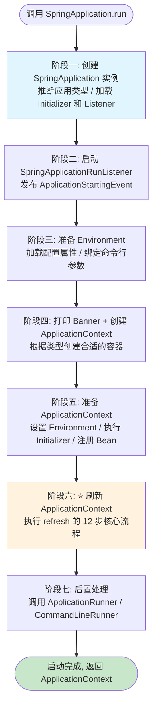
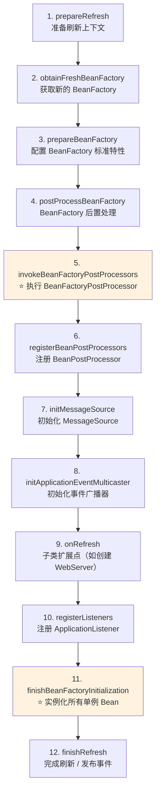
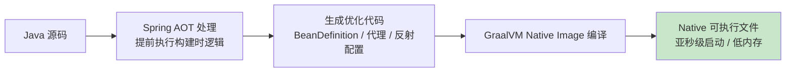

# Spring Boot 启动流程

## ⭐ 面试重点速览

| 知识模块 | 重点内容 | 面试频率 |
|----------|----------|----------|
| SpringApplication 初始化 | 推断应用类型（Servlet/Reactive/None）、加载 Initializer 和 Listener | 高 |
| run() 八大阶段 | 各阶段执行顺序、RunListener 事件发布、Environment 准备 | 极高 |
| ApplicationContext.refresh() | 12 步核心流程、每步作用、Bean 生命周期入口 | 极高 |
| 配置加载优先级 | 11 级配置源优先级、覆盖规则 | 中高 |
| 自动配置原理 | @EnableAutoConfiguration、spring.factories、条件注解 | 极高 |
| Spring Boot 3.x 新特性 | AOT 编译、虚拟线程、优雅关机 | 中高 |

---

## 一、SpringApplication.run() 启动流程总览

### 1.1 Mermaid 流程图



::: tip 核心方法入口

整个 Spring Boot 启动逻辑集中在 `SpringApplication.run()` 这一个方法中。

```java
@SpringBootApplication
public class MyApplication {
    public static void main(String[] args) {
        ConfigurableApplicationContext context = SpringApplication.run(MyApplication.class, args);
    }
}
```

:::

### 1.2 run() 方法关键源码（简化版）

```java
public ConfigurableApplicationContext run(String... args) {
    SpringApplicationRunListeners listeners = getRunListeners(args);    // 阶段二
    listeners.starting();                                               // 发布 starting 事件
    try {
        ConfigurableEnvironment env = prepareEnvironment(listeners, ...);// 阶段三：准备 Environment
        ConfigurableApplicationContext context = createApplicationContext(); // 阶段四：创建容器
        prepareContext(context, env, listeners, ...);                   // 阶段五：准备 Context
        refreshContext(context);                                        // 阶段六：⭐ refresh 12 步
        afterRefresh(context, ...);                                     // 阶段七：后置处理
        listeners.started(context);                                     // 发布 started 事件
        callRunners(context, ...);                                      // 调用 Runner
    } catch (Throwable ex) {
        handleRunFailure(...); throw new IllegalStateException(ex);
    }
    listeners.running(context);                                        // 发布 ready 事件
    return context;
}
```

---

## 二、SpringApplication 初始化（阶段一详解）

阶段一发生在 `new SpringApplication(primarySources)` 构造器中，完成四件关键工作。

### 2.1 推断应用类型

```java
public SpringApplication(ResourceLoader resourceLoader, Class<?>... primarySources) {
    // ⭐ 第一步：推断 Web 应用类型
    this.webApplicationType = WebApplicationType.deduceFromClasspath();
    // 第二步：加载 Initializers（SPI 机制）
    setInitializers((Collection) getSpringFactoriesInstances(ApplicationContextInitializer.class));
    // 第三步：加载 Listeners（SPI 机制）
    setListeners((Collection) getSpringFactoriesInstances(ApplicationListener.class));
    // 第四步：推断主类
    this.mainApplicationClass = deduceMainApplicationClass();
}
```

**`WebApplicationType.deduceFromClasspath()` 推断逻辑：**

| 条件 | 推断结果 | 使用的 Context |
|------|----------|----------------|
| 存在 `DispatcherHandler` 且不存在 `DispatcherServlet` | **REACTIVE** | `AnnotationConfigReactiveWebServerApplicationContext` |
| 存在 `Servlet` 和 `ConfigurableWebApplicationContext` | **SERVLET** | `AnnotationConfigServletWebServerApplicationContext` |
| 以上条件均不满足 | **NONE** | `AnnotationConfigApplicationContext` |

```java
// 推断源码的核心逻辑（简化版）
static WebApplicationType deduceFromClasspath() {
    // 存在 WebFlux 的 DispatcherHandler 且不存在 Spring MVC 的 DispatcherServlet → REACTIVE
    if (ClassUtils.isPresent(REACTIVE_DISPATCHER_HANDLER, null)
            && !ClassUtils.isPresent(MVC_DISPATCHER_SERVLET, null)) {
        return WebApplicationType.REACTIVE;
    }
    // 两个都不存在 → NONE（非 Web 应用）
    if (!ClassUtils.isPresent(MVC_DISPATCHER_SERVLET, null)
            && !ClassUtils.isPresent(JERSEY_CLASS, null)) {
        return WebApplicationType.NONE;
    }
    // 默认 → SERVLET
    return WebApplicationType.SERVLET;
}
```

### 2.2 加载 ApplicationContextInitializer

`ApplicationContextInitializer` 用于**在 refresh 之前**对 ApplicationContext 进行初始化配置（如激活 Profile、设置属性源）。

```java
@FunctionalInterface
public interface ApplicationContextInitializer<C extends ConfigurableApplicationContext> {
    void initialize(C applicationContext);
}

// 自定义 Initializer 示例：根据环境变量激活 Profile
public class ProfileActivatingInitializer 
        implements ApplicationContextInitializer<ConfigurableApplicationContext> {
    @Override
    public void initialize(ConfigurableApplicationContext context) {
        String activeProfile = System.getProperty("spring.profiles.active", "dev");
        context.getEnvironment().setActiveProfiles(activeProfile);
    }
}
```

**加载机制**：通过 SPI 从 `META-INF/spring.factories`（2.x）或 `META-INF/spring/*.imports`（3.x）中读取全限定名并反射实例化。

::: warning Spring Boot 2.x vs 3.x 加载方式变化

| 版本 | 配置文件 | Key |
|------|----------|-----|
| 2.x | `META-INF/spring.factories` | `org.springframework.context.ApplicationContextInitializer` |
| 3.x | `META-INF/spring.factories` + `*.imports` | 逐步迁移到新的 `*.imports` 格式 |

Spring Boot 3.x 为 AOT 编译做准备，将自动配置声明从 `spring.factories` 迁移到结构化 import 文件。
:::

### 2.3 加载 ApplicationListener

实现 Spring 事件驱动机制，监听启动各阶段的 `SpringApplicationEvent`。

| 内置 Listener | 作用 |
|---------------|------|
| `ConfigFileApplicationListener` | 加载 `application.properties/yml` |
| `LoggingApplicationListener` | 初始化日志系统 |
| `BackgroundPreinitializer` | 后台预初始化耗时操作 |
| `DelegatingApplicationListener` | 委托给其他 Listener |

### 2.4 推断主类

```java
private Class<?> deduceMainApplicationClass() {
    try {
        StackTraceElement[] stackTrace = new RuntimeException().getStackTrace();
        for (StackTraceElement element : stackTrace) {
            // 遍历调用栈，找到包含 main 方法的类
            if ("main".equals(element.getMethodName())) {
                return Class.forName(element.getClassName());
            }
        }
    } catch (ClassNotFoundException ex) { /* 忽略 */ }
    return null;
}
```

---

## 三、⭐ ApplicationContext.refresh() 十二步核心流程

::: danger 面试高频考点

`refresh()` 方法是整个 Spring 容器初始化的核心入口，也是面试中最容易被深入追问的部分。**必须掌握每一步的名称和作用**。
:::



### 第 1 步：prepareRefresh() —— 准备刷新

```java
protected void prepareRefresh() {
    this.startupDate = System.currentTimeMillis();  // 记录启动时间
    this.closed.set(false);                         // 关闭标志 → false
    this.active.set(true);                          // 激活标志 → true
    initPropertySources();                          // 初始化 PropertySources（子类扩展）
    getEnvironment().validateRequiredProperties();  // 校验 required 属性
    this.earlyApplicationEvents = new LinkedHashSet<>(); // 存储早期事件
}
```

::: tip 校验 required 属性

如果配置了 `environment.setRequiredProperties("app.name")`，而该属性未在任意配置源中找到，则会抛出 `MissingRequiredPropertiesException`，容器直接启动失败。
:::

### 第 2 步：obtainFreshBeanFactory() —— 获取 BeanFactory

```java
protected ConfigurableListableBeanFactory obtainFreshBeanFactory() {
    refreshBeanFactory();   // 若已有 BeanFactory 则销毁后重建
    return getBeanFactory(); // 返回新的 DefaultListableBeanFactory
}
```

- Spring Boot 的 `ServletWebServerApplicationContext`：Bean 定义已通过 `prepareContext` 加载完毕，此步骤直接返回。
- 传统 `AnnotationConfigApplicationContext`：在此步骤创建 `DefaultListableBeanFactory`，并扫描加载 `BeanDefinition`。

### 第 3 步：prepareBeanFactory() —— 配置 BeanFactory

配置 BeanFactory 的标准特性（ClassLoader、SpEL 解析器、属性编辑器等），并注册**与环境相关的特殊 Bean**。

```java
protected void prepareBeanFactory(ConfigurableListableBeanFactory beanFactory) {
    beanFactory.setBeanClassLoader(getClassLoader());
    // 设置 SpEL 表达式解析器（用于解析 #{...} 表达式）
    beanFactory.setBeanExpressionResolver(new StandardBeanExpressionResolver());
    // 注册 ApplicationContextAwareProcessor（让 Bean 感知容器）
    beanFactory.addBeanPostProcessor(new ApplicationContextAwareProcessor(this));
    // 忽略框架内部接口的自动装配
    beanFactory.ignoreDependencyInterface(EnvironmentAware.class);
    // 注册特殊单例 Bean
    beanFactory.registerSingleton("environment", getEnvironment());
}
```

### 第 4 步：postProcessBeanFactory() —— BeanFactory 后置处理

**模板方法**（空实现），留给子类扩展。Spring Boot 的 `ServletWebServerApplicationContext` 在此注册 Web 相关 Bean：

```java
// Spring Boot 的子类实现
protected void postProcessBeanFactory(ConfigurableListableBeanFactory beanFactory) {
    beanFactory.addBeanPostProcessor(
        new WebApplicationContextServletContextAwareProcessor(this));
    beanFactory.ignoreDependencyInterface(ServletContextAware.class);
    registerWebApplicationScopes(); // 注册 request、session 作用域
}
```

### 第 5 步：⭐ invokeBeanFactoryPostProcessors() —— 执行 BeanFactoryPostProcessor

这是 `refresh()` 流程中**最关键的第一步**（处理元数据阶段）。

执行两类 PostProcessor：
1. **BeanDefinitionRegistryPostProcessor**：可注册新的 `BeanDefinition`
2. **BeanFactoryPostProcessor**：对已注册的 `BeanDefinition` 进行修改

```java
protected void invokeBeanFactoryPostProcessors(ConfigurableListableBeanFactory beanFactory) {
    PostProcessorRegistrationDelegate.invokeBeanFactoryPostProcessors(beanFactory, 
        getBeanFactoryPostProcessors());
    // ⭐ ConfigurationClassPostProcessor 在此执行：
    // 1. 扫描所有 @Configuration 类
    // 2. 解析 @ComponentScan、@Import、@Bean 注解
    // 3. 解析 @EnableAutoConfiguration（自动配置的入口！）
}
```

::: danger 自动配置在此步骤生效

`@EnableAutoConfiguration` → `AutoConfigurationImportSelector` 在此步骤中被 `ConfigurationClassPostProcessor` 解析，Spring Boot 的自动配置全套逻辑在此处触发。
:::

### 第 6 步：registerBeanPostProcessors() —— 注册 BeanPostProcessor

将实现 `BeanPostProcessor` 接口的 Bean 注册到 BeanFactory 中（**只看定义，暂不执行**）。按优先级排序注册：`PriorityOrdered` → `Ordered` → 普通 → `MergedBeanDefinitionPostProcessor`。

这些 Processor 将在第 11 步（Bean 实例化）时被调用，用于对 Bean 实例进行增强（如 AOP 代理、`@Autowired` 注入）。

### 第 7 步：initMessageSource() —— 初始化消息源

用于国际化（i18n）支持。若容器中有自定义的 `MessageSource` Bean 则使用之，否则使用默认的 `DelegatingMessageSource`。最常见的使用方式是配置 `messages.properties` 文件，然后通过 `MessageSource.getMessage()` 获取国际化文案。

### 第 8 步：initApplicationEventMulticaster() —— 初始化事件广播器

若容器中有自定义的 `ApplicationEventMulticaster` 则使用之，否则使用默认的 `SimpleApplicationEventMulticaster`。广播器就绪后，容器具备事件分发能力，之前累积的 `earlyApplicationEvents` 将在后续步骤广播。

### 第 9 步：onRefresh() —— 子类扩展点

空实现，留给子类覆盖。**Spring Boot 在此启动内嵌 Web 服务器**：

```java
// Spring Boot ServletWebServerApplicationContext 的实现
protected void onRefresh() {
    super.onRefresh();
    try {
        createWebServer(); // ⭐ 创建并启动内嵌 Tomcat / Jetty / Undertow
    } catch (Throwable ex) {
        throw new ApplicationContextException("Unable to start web server", ex);
    }
}
```

### 第 10 步：registerListeners() —— 注册监听器

将手工添加的 `ApplicationListener` 和 BeanFactory 中 `ApplicationListener` 类型的 Bean 注册到事件广播器，然后广播之前累积的 `earlyApplicationEvents`。

### 第 11 步：⭐ finishBeanFactoryInitialization() —— 实例化所有单例 Bean

**这是整个 Spring 启动流程中耗时最长、最核心的一步**。

```java
protected void finishBeanFactoryInitialization(ConfigurableListableBeanFactory beanFactory) {
    // 初始化 ConversionService（类型转换服务）
    // ...
    beanFactory.freezeConfiguration(); // 冻结所有 Bean 定义（禁止再修改）
    beanFactory.preInstantiateSingletons(); // ⭐ 预实例化所有非懒加载单例 Bean
}
```

`preInstantiateSingletons()` 对每个单例 Bean 触发完整生命周期：实例化 → 属性填充 → Aware 回调 → `BeanPostProcessor` 前置处理 → `@PostConstruct` / `InitializingBean` → `BeanPostProcessor` 后置处理（⭐ AOP 代理创建点） → 存入单例池 `singletonObjects`。

### 第 12 步：finishRefresh() —— 完成刷新

```java
protected void finishRefresh() {
    clearResourceCaches();                              // 清除资源缓存
    initLifecycleProcessor();                           // 初始化 LifecycleProcessor
    getLifecycleProcessor().onRefresh();                // 启动生命周期 Bean
    publishEvent(new ContextRefreshedEvent(this));      // ⭐ 发布 ContextRefreshedEvent
    LiveBeansView.registerApplicationContext(this);      // JMX 监控注册
}
```

::: tip refresh() 完成后的信号

当 `ContextRefreshedEvent` 发布时，所有单例 Bean 已就绪、容器已完全可用。`@EventListener(ContextRefreshedEvent.class)` 监听的方法会在此时被触发。
:::

---

## 四、配置加载优先级

Spring Boot 支持从多个来源加载配置，按优先级从高到低排列。

### 4.1 配置优先级对照表（11 级）

| 优先级 | 配置来源 | 示例 | 说明 |
|--------|----------|------|------|
| **1（最高）** | 命令行参数 | `--server.port=9090` | 启动时直接传入，覆盖所有其他来源 |
| **2** | `SPRING_APPLICATION_JSON` | `SPRING_APPLICATION_JSON='{"server.port":9090}'` | 通过环境变量或系统属性传入 JSON |
| **3** | JNDI 属性 | `java:comp/env/server.port` | Java EE 容器环境 |
| **4** | Java 系统属性 | `-Dserver.port=9090` | `System.getProperties()` |
| **5** | 操作系统环境变量 | `SERVER_PORT=9090` | 注意命名转换规则 |
| **6** | `RandomValuePropertySource` | `random.int(1024,65536)` | 随机值属性源 |
| **7** | 外部 `application-{profile}.properties` | jar 包外 Profile 文件 | 最高优先级的配置文件 |
| **8** | 内部 `application-{profile}.properties` | jar 包内 Profile 文件 | 打包在 jar 内的 Profile 配置 |
| **9** | 外部 `application.properties` | jar 包外默认配置 | 打包部署时可覆盖 |
| **10** | 内部 `application.properties` | jar 包内默认配置 | 项目默认配置 |
| **11（最低）** | `SpringApplication.setDefaultProperties()` | 代码中设定的默认值 | 兜底默认值 |

### 4.2 配置加载代码验证

```java
@SpringBootApplication
public class ConfigPriorityDemo {
    public static void main(String[] args) {
        SpringApplication app = new SpringApplication(ConfigPriorityDemo.class);
        Properties defaultProps = new Properties();
        defaultProps.setProperty("server.port", "8080");  // 第 11 级：默认值
        app.setDefaultProperties(defaultProps);
        // 启动时 --server.port=9090 会覆盖以上所有配置
        ConfigurableApplicationContext ctx = app.run(args);
        System.out.println("最终端口: " + ctx.getEnvironment().getProperty("server.port"));
    }
}
```

### 4.3 环境变量命名转换规则（宽松绑定）

| 写法 | 场景 |
|------|------|
| `server.port` | properties / yml 文件（标准写法） |
| `SERVER_PORT` | 操作系统环境变量（下划线转点号） |
| `SERVERPORT` | 操作系统环境变量（全大写、无分隔符） |

::: warning 注意

环境变量 `SERVER_PORT` 会被同时映射为 `server.port` 和 `serverport`。`SystemEnvironmentPropertySource` 在查找时会尝试多种命名变体。
:::

---

## 五、Spring Boot 3.x 新特性

### 5.1 AOT 编译（Ahead-of-Time Compilation）

AOT 编译是 Spring Boot 3.0 引入的重大特性，目的是**显著缩短应用启动时间**并**减小内存占用**。

```bash
mvn -Pnative spring-boot:build-image  # 使用 GraalVM Native Image 构建原生可执行文件
```

**AOT 工作原理**：



| 特性 | JVM 模式 | AOT Native 模式 |
|------|----------|-----------------|
| 启动速度 | 秒级（2-5s） | **亚秒级**（< 0.1s） |
| 内存占用 | 较高（200MB+） | **低**（20-50MB） |
| 动态代理 | 运行时生成 | 编译时生成 |
| 反射 | 运行时支持 | 需提前注册（AOT 自动收集） |
| 适用场景 | 传统 Web 应用 | 微服务 / Serverless |

::: warning AOT 的限制

1. 不能使用 `@Profile` 动态切换（编译时固定）
2. 不能使用 `@Conditional` 动态判断（AOT 阶段已确定）
3. JPA 懒加载需特殊配置（代理类提前注册）
4. 某些运行时动态代理不兼容（如 CGLIB）
:::

### 5.2 虚拟线程支持（Virtual Threads）

Spring Boot 3.2+ 全面支持 Java 21 的虚拟线程（Project Loom），极大提升高并发场景下 I/O 密集型任务的吞吐量。

```yaml
# application.yml — 一行配置启用虚拟线程
spring:
  threads:
    virtual:
      enabled: true
```

```java
// 代码中手动配置：将 Tomcat 请求处理线程池替换为虚拟线程
@Configuration
public class VirtualThreadConfig {
    @Bean
    public TomcatProtocolHandlerCustomizer<?> protocolHandlerCustomizer() {
        return handler -> handler.setExecutor(Executors.newVirtualThreadPerTaskExecutor());
    }
}
```

**虚拟线程 vs 平台线程对比**：

| 维度 | 平台线程（传统） | 虚拟线程（JDK 21+） |
|------|-----------------|---------------------|
| 创建成本 | 高（~1MB 栈空间） | 极低（~KB 级） |
| 最大并发数 | 有限（如 200 个） | **百万级** |
| 阻塞 I/O 处理 | 线程被阻塞 | 自动挂起/恢复 |
| 适用场景 | CPU 密集型 | **I/O 密集型** |
| 代码改动 | N/A | **零改动**（直接替换 Executor） |

::: tip 虚拟线程适合的场景

虚拟线程在 I/O 密集型场景效果显著（REST API 调用、数据库查询、消息队列消费），代码改动为零。CPU 计算密集型服务则平台线程更合适。
:::

### 5.3 优雅关机（Graceful Shutdown）

Spring Boot 3.x 内置了优雅关机机制，确保应用关闭时不丢失正在处理的请求。

```yaml
server:
  shutdown: graceful
spring:
  lifecycle:
    timeout-per-shutdown-phase: 30s  # 等待现有请求完成的超时时间
```

```java
@Component
public class GracefulShutdownHandler {
    @PreDestroy
    public void onShutdown() {
        // 不再接受新请求，等待进行中的请求完成
        log.info("应用正在优雅关闭，释放资源...");
    }
}
```

**优雅关机执行流程**：


::: danger 注意事项

1. **Kubernetes**：`terminationGracePeriodSeconds` 需比 `timeout-per-shutdown-phase` 更长
2. **负载均衡**：确保下线前已从负载均衡中移除（配合就绪探针）
3. **异步任务**：需单独处理 `@Async` 等异步任务的优雅关闭
:::

---

## ⭐ 面试高频问题汇总

### Q1：Spring Boot 的启动过程是怎样的？请简述核心阶段。

1. **创建 SpringApplication**：推断应用类型，加载 Initializer 和 Listener
2. **启动 RunListeners**：发布 `ApplicationStartingEvent`
3. **准备 Environment**：加载配置属性，绑定命令行参数
4. **创建并准备 ApplicationContext**：根据类型创建容器，执行 Initializer，加载自动配置
5. **刷新 ApplicationContext**：执行 `refresh()` 12 步流程，完成 Bean 完整生命周期
6. **后置处理**：调用 `ApplicationRunner` 和 `CommandLineRunner`

**面试加分**：`refresh()` 中 `invokeBeanFactoryPostProcessors` 触发自动配置，`finishBeanFactoryInitialization` 实例化所有单例 Bean。

---

### Q2：`ApplicationContext.refresh()` 中的 12 个步骤分别做了什么？

| 步骤 | 作用 | 关键点 |
|------|------|--------|
| `prepareRefresh()` | 准备上下文，记录启动时间 | 校验 required 属性 |
| `obtainFreshBeanFactory()` | 获取/刷新 BeanFactory | 返回 `DefaultListableBeanFactory` |
| `prepareBeanFactory()` | 配置 BeanFactory 标准特性 | 注册 SpEL、AwareProcessor |
| `postProcessBeanFactory()` | BeanFactory 后置处理（扩展点） | Spring Boot 注册 Web 作用域 |
| `invokeBeanFactoryPostProcessors()` | **执行 BeanFactoryPostProcessor** | 自动配置在此触发 |
| `registerBeanPostProcessors()` | 注册 BeanPostProcessor | 为后续 Bean 增强做准备 |
| `initMessageSource()` | 初始化国际化消息源 | i18n 支持 |
| `initApplicationEventMulticaster()` | 初始化事件广播器 | 事件驱动机制就绪 |
| `onRefresh()` | 子类扩展点 | **Spring Boot 启动内嵌 Web 服务器** |
| `registerListeners()` | 注册 ApplicationListener | 广播早期累积的事件 |
| `finishBeanFactoryInitialization()` | **实例化所有单例 Bean** | Bean 生命周期核心入口 |
| `finishRefresh()` | 完成刷新，发布事件 | 发布 `ContextRefreshedEvent` |

---

### Q3：Spring Boot 的自动配置是如何实现的？

核心入口是 `@SpringBootApplication` 中的 `@EnableAutoConfiguration`：

```
@SpringBootApplication
  └── @EnableAutoConfiguration
        └── @Import(AutoConfigurationImportSelector.class)
```

`AutoConfigurationImportSelector` 加载流程：

1. 读取 `META-INF/spring/*.imports`（3.x）获取所有候选自动配置类
2. 通过条件注解（`@ConditionalOnClass`、`@ConditionalOnMissingBean` 等）过滤
3. 将符合条件的自动配置类注册为 `BeanDefinition`

```java
// DataSourceAutoConfiguration 示例
@AutoConfiguration
@ConditionalOnClass({DataSource.class, EmbeddedDatabaseType.class})
@ConditionalOnMissingBean(type = "io.r2dbc.spi.ConnectionFactory")
@EnableConfigurationProperties(DataSourceProperties.class)
public class DataSourceAutoConfiguration {
    @Bean
    @ConditionalOnMissingBean
    public DataSource dataSource(DataSourceProperties properties) {
        return properties.initializeDataSourceBuilder().build();
    }
}
```

**面试加分**：条件注解五种类型 —— `@ConditionalOnClass`、`@ConditionalOnMissingBean`、`@ConditionalOnProperty`、`@ConditionalOnResource`、`@ConditionalOnExpression`。

---

### Q4：Spring Boot 和 Spring Framework 启动的区别是什么？

| 维度 | Spring Framework | Spring Boot |
|------|-----------------|-------------|
| 启动方式 | 手动创建 `ApplicationContext` | `SpringApplication.run()` 一键启动 |
| 容器创建 | 手动选择（XML / 注解） | 自动推断（Servlet / Reactive / None） |
| 配置加载 | 手动配置 | 自动加载 `application.properties` |
| Bean 注册 | 手动 `@ComponentScan` 或 XML | 自动配置 + 条件注解按需加载 |
| Web 服务器 | 需部署外部 Tomcat / Jetty | 内嵌 Web 服务器，`java -jar` 直接运行 |

---

### Q5：Spring Boot 中如何自定义启动逻辑？有哪些扩展点？

| 扩展方式 | 执行时机 | 典型用途 |
|----------|----------|----------|
| `ApplicationContextInitializer` | refresh 之前 | 激活 Profile、添加属性源 |
| `ApplicationRunner` | refresh 完成之后 | 启动后执行一次性任务 |
| `CommandLineRunner` | refresh 完成之后 | 同 ApplicationRunner，可获取原始参数 |
| `ApplicationListener` | 各阶段事件 | 监听启动各阶段的 Spring 事件 |
| `@PostConstruct` | Bean 初始化后 | 单个 Bean 的初始化逻辑 |

---

### Q6：为什么 Spring Boot 的 jar 可以直接运行？Fat Jar 的原理是什么？

Spring Boot 使用 **Fat Jar** 打包方式，通过自定义 `LaunchedURLClassLoader` 加载 `BOOT-INF/lib/` 中嵌套的所有依赖 jar。`java -jar` 时 MANIFEST.MF 指向 `JarLauncher`，它创建 ClassLoader 后反射调用用户真正的 `main` 方法。

---

### Q7：Spring Boot 启动慢，如何排查和优化？

| 优化方向 | 具体措施 |
|----------|----------|
| **减少自动配置** | `@EnableAutoConfiguration(exclude = ...)` |
| **懒加载** | `spring.main.lazy-initialization=true` |
| **减少扫描路径** | 精确指定 `@ComponentScan` 的 basePackages |
| **JVM 参数** | `-XX:TieredStopAtLevel=1 -noverify` |
| **AOT 编译** | 使用 GraalVM Native Image（亚秒级启动） |
| **异步初始化** | 使用 `@Async` + 线程池初始化耗时资源 |

---

### Q8：`ApplicationRunner` 和 `CommandLineRunner` 有什么区别？

| 维度 | ApplicationRunner | CommandLineRunner |
|------|-------------------|-------------------|
| 参数类型 | `ApplicationArguments`（封装后的参数） | `String... args`（原始参数数组） |
| 参数解析 | 自动解析 `--key=value` 格式 | 需手动解析 |
| 推荐场景 | 需要解析命名参数时 | 无需解析或简单场景 |

```java
// ApplicationRunner：参数已自动解析
@Bean ApplicationRunner appRunner() {
    return args -> System.out.println("参数: " + args.getOptionNames());
}
// CommandLineRunner：原始参数数组
@Bean CommandLineRunner cmdRunner() {
    return args -> System.out.println("原始: " + Arrays.toString(args));
}
```

---

## 面试追问环节

**Q：如果让你手写一个 Mini Spring Boot 启动器，你会如何设计？**

1. 检查 classpath 推断应用类型（Servlet / Reactive / None）
2. SPI 加载 Initializer 和 Listener 并实例化
3. 按优先级加载命令行、环境变量、properties 文件
4. 根据应用类型创建对应的 ApplicationContext
5. 扫描 `@Component` 注解的类，生成 BeanDefinition
6. 遍历 Bean 定义，通过反射完成 `@Autowired` 注入
7. 创建内嵌 Tomcat/Jetty 实例，绑定端口启动

**Q：Spring Boot 3.x 相比 2.x 在启动流程上有哪些变化？**

1. 自动配置声明从 `spring.factories` 迁移到 `*.imports`（为 AOT 优化）
2. Jakarta EE 迁移：`javax.*` 改为 `jakarta.*`
3. AOT 引擎集成：新增 `SpringApplicationAotProcessor` 处理阶段
4. 虚拟线程支持：内嵌 Tomcat/Jetty 可直接使用虚拟线程
5. 优雅关机增强：`server.shutdown=graceful` 成为内置选项
6. ProblemDetails 支持：RFC 7807 规范错误响应