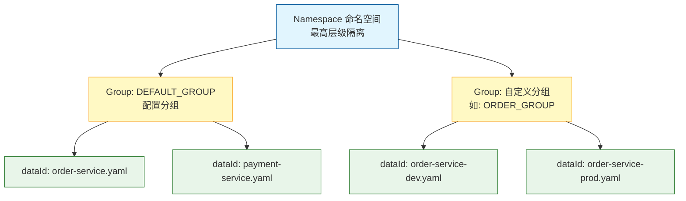
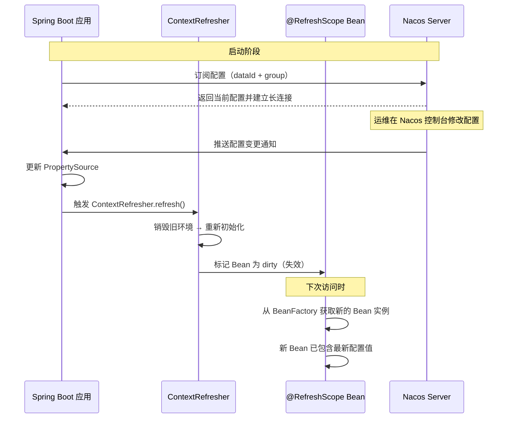
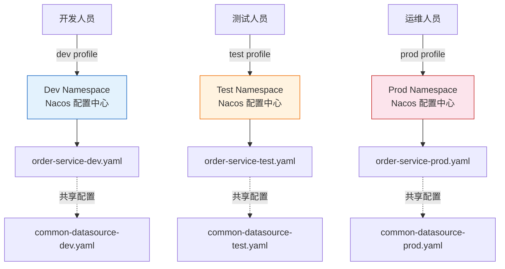

# 配置中心

## ⭐ 面试重点速览

| 知识模块 | 重点内容 | 面试频率 |
|----------|----------|----------|
| Nacos 核心概念 | dataId、group、namespace 三者关系与命名规范 | 极高 |
| 配置动态刷新 | @RefreshScope 原理、ContextRefresher、长轮询 / gRPC 双向流 | 极高 |
| 配置优先级 | shared-configs vs extension-configs、namespace 隔离策略 | 高 |
| 配置加密 | Jasypt 集成、ENC() 前缀、秘钥管理 | 中高 |
| 多环境管理 | bootstrap.yml vs application.yml、profile 切换机制 | 高 |
| 灰度发布 | namespace 隔离、配置分组、蓝绿部署支撑 | 中 |

---

## 一、Nacos Config 配置管理核心概念

### 1.1 什么是 Nacos？

Nacos（Dynamic Naming and Configuration Service）是阿里巴巴开源的服务发现与配置管理平台，在 Spring Cloud Alibaba 体系中承担**注册中心**和**配置中心**双重角色。作为配置中心，Nacos 提供以下核心能力：

- **配置集中管理**：所有微服务的配置统一存储在 Nacos Server，避免散落在各服务本地
- **动态刷新**：配置变更后无需重启服务即可生效
- **版本管理**：支持配置历史版本回滚
- **权限控制**：支持命名空间级别的权限隔离

### 1.2 三大核心概念：dataId、group、namespace

Nacos 通过 **dataId**、**group**、**namespace** 三级结构来定位唯一配置，形成了 `namespace > group > dataId` 的层级关系。



**dataId** —— 配置的唯一标识

在 Spring Cloud Alibaba 中，dataId 的默认生成规则为：

```
${spring.application.name}-${spring.profiles.active}.${spring.cloud.nacos.config.file-extension}
```

例如：`order-service-dev.yaml` 对应应用名 `order-service`、环境 `dev`、文件类型 `yaml`。

**group** —— 配置分组

默认值为 `DEFAULT_GROUP`。通过 group 可以实现不同业务模块或不同版本的分组管理：

```yaml
spring:
  cloud:
    nacos:
      config:
        group: ORDER_GROUP  # 将当前服务配置归属到订单分组
```

**namespace** —— 租户隔离

用于实现多环境或多租户的物理隔离。不同的 namespace 下可以有相同 dataId 和 group 的配置，互不影响。

```yaml
spring:
  cloud:
    nacos:
      config:
        namespace: f47e0e1a-5c5b-4a3c-9d4e-8a2c3b6f1e7d  # 命名空间ID
```

::: tip 实际开发中的最佳实践
- **namespace** 用于隔离环境（dev / test / prod，各自独立的命名空间）
- **group** 用于隔离业务模块（ORDER_GROUP、PAYMENT_GROUP）
- **dataId** 对应具体的微服务配置
:::

---

## 二、⭐ 配置动态刷新原理

### 2.1 整体架构

Nacos 配置动态刷新的核心流程如下：



### 2.2 @RefreshScope 注解原理

`@RefreshScope` 是 Spring Cloud 提供的一个自定义作用域注解，继承自 `@Scope("refresh")`。被标记的 Bean 在配置刷新时会**惰性重建**。

```java
// @RefreshScope 注解本质
@Target({ElementType.TYPE, ElementType.METHOD})
@Retention(RetentionPolicy.RUNTIME)
@Scope("refresh")  // 核心：使用 refresh 作用域
@Documented
public @interface RefreshScope {
    // 别名
    @AliasFor(annotation = Scope.class)
    ScopedProxyMode proxyMode() default ScopedProxyMode.TARGET_CLASS;
}
```

**工作原理分解**：

```java
@Service
@RefreshScope  // 标记此 Bean 支持配置动态刷新
public class OrderConfigService {
    
    @Value("${order.timeout:30}")  // 读取配置中心的 order.timeout
    private int timeout;
    
    public int getTimeout() {
        return timeout;  // 配置刷新后，下次调用获取的是新值
    }
}
```

关键流程说明：

1. **代理模式**：`@RefreshScope` 默认使用 CGLIB 代理（`ScopedProxyMode.TARGET_CLASS`），Spring 容器中实际存放的是代理对象
2. **惰性重建**：配置变更时不会立即重建 Bean，而是将其标记为"dirty"。只有当 Bean 的方法被实际调用时，才会触发重新创建
3. **缓存机制**：RefreshScope 内部使用 `BeanLifecycleWrapperCache` 缓存 Bean 实例，refresh 时清空缓存

```java
// RefreshScope 核心实现逻辑（简化版）
public class RefreshScope extends GenericScope {

    // 刷新所有标记了 @RefreshScope 的 Bean
    public void refreshAll() {
        super.destroy();  // 清空所有缓存，标记所有 Bean 为 dirty
        // 此时 Bean 并未真正重建，只是缓存被清空
    }
    
    @Override
    public Object get(String name, ObjectFactory<?> objectFactory) {
        // 缓存为空时（已 dirty），调用 objectFactory 重新创建 Bean
        BeanLifecycleWrapper bean = this.cache.put(name, 
            new BeanLifecycleWrapper(name, objectFactory));
        return bean.getBean();  // 返回新创建的 Bean（已包含最新配置）
    }
}
```

::: warning 注意：@Value 注入的限制
`@Value` 注入的字段配合 `@RefreshScope` 可以动态刷新，但如果是通过 `Environment.getProperty()` 获取的值且没有经过 RefreshScope 代理，则不会自动刷新。确保配置消费方是 RefreshScope 管理的 Bean。
:::

### 2.3 ContextRefresher 刷新上下文

`ContextRefresher` 是 Spring Cloud 提供的配置刷新入口，其 `refresh()` 方法会执行以下步骤：

```java
public class ContextRefresher {
    
    public synchronized Set<String> refresh() {
        // 步骤1：对比新旧配置，找出变更的 key
        Set<String> keys = refreshEnvironment();
        
        // 步骤2：重新绑定 @ConfigurationProperties 注解的 Bean
        this.scope.refreshAll();  // 销毁并重建所有 @RefreshScope Bean
        
        return keys;
    }
    
    public synchronized Set<String> refreshEnvironment() {
        // 1. 从 Environment 中提取旧配置
        Map<String, Object> before = extract(this.context.getEnvironment());
        
        // 2. 从配置中心拉取最新配置，更新到 Environment
        addConfigFilesToEnvironment();
        
        // 3. 对比差异
        Map<String, Object> after = extract(this.context.getEnvironment());
        Set<String> changed = findChanges(before, after);
        
        return changed;
    }
}
```

### 2.4 Nacos 1.x 长轮询机制 vs Nacos 2.x gRPC 双向流

这是面试中的核心加分点，两种机制对比：

| 维度 | Nacos 1.x 长轮询（Long Polling） | Nacos 2.x gRPC 双向流 |
|------|----------------------------------|------------------------|
| **通信协议** | HTTP（客户端向服务端发请求后挂起） | gRPC（基于 HTTP/2，双向流） |
| **连接模型** | 客户端定期发起 HTTP 长轮询，超时后重连 | 建立一条持久的长连接，双向通信 |
| **实时性** | 依赖轮询间隔（默认 30s），存在延迟 | 服务端变更后立即推送，接近实时 |
| **资源消耗** | 每次轮询都需建立连接，消耗 TCP 资源 | 一条连接复用，资源消耗低 |
| **并发支持** | HTTP 短连接模型，并发能力有限 | HTTP/2 多路复用，并发能力显著提升 |

**Nacos 1.x 长轮询机制详解**：

```java
// ClientWorker 核心逻辑（简化版）
public class ClientWorker {
    
    private long timeout = 30000L;  // 长轮询超时时长（30秒）
    
    public void checkServerConfig() {
        // 1. 向 Nacos Server 发送请求，带上本地配置的 MD5
        HttpURLConnection conn = sendRequest(getServerConfigUrl(), headers);
        
        // 2. Nacos Server 收到请求后：
        //    - 如果配置 MD5 变了 → 立即返回新配置
        //    - 如果配置 MD5 没变 → 挂起连接，设置 30s 超时等待
        //    - 30s 内如果配置变更 → 立即返回
        //    - 30s 后仍未变更 → 返回 304 Not Modified
        
        // 3. 客户端收到响应后，判断是否需要更新
        if (configChanged) {
            // 更新本地配置
            updateLocalConfig();
            // 触发 ContextRefresher
            contextRefresher.refresh();
        }
        
        // 4. 立即发起下一次长轮询（循环往复）
        scheduleNextCheck();
    }
}
```

**Nacos 2.x gRPC 双向流机制**：

```java
// Nacos 2.x 客户端通过 gRPC 建立双向流连接
public class GrpcConfigClient {
    
    public void connect() {
        // 1. 客户端与 Nacos Server 建立 gRPC 长连接
        ManagedChannel channel = ManagedChannelBuilder
            .forAddress(nacosServerAddr, nacosServerPort)
            .usePlaintext()
            .build();
        
        // 2. 创建双向流 Stub
        ConfigServiceGrpc.ConfigServiceStub stub = 
            ConfigServiceGrpc.newStub(channel);
            
        // 3. 双向流通信：客户端可以持续发送请求，服务端可以主动推送
        StreamObserver<ConfigResponse> responseObserver = 
            new StreamObserver<ConfigResponse>() {
                @Override
                public void onNext(ConfigResponse response) {
                    // 服务端主动推送的配置变更通知
                    handleConfigChange(response);
                }
            };
        StreamObserver<ConfigRequest> requestObserver = 
            stub.configBiStream(responseObserver);
        
        // 4. 订阅配置
        requestObserver.onNext(ConfigRequest.newBuilder()
            .setDataId("order-service-dev.yaml")
            .setGroup("DEFAULT_GROUP")
            .build());
    }
}
```

::: danger 面试高频追问：长轮询和 Websocket 有什么区别？
- **长轮询**：客户端发起 HTTP 请求，服务端挂起连接直到有数据或超时。每次交互都是独立的 HTTP 请求/响应。
- **WebSocket**：基于 TCP 的全双工协议，建立后双方可随时互发消息，无需维护请求/响应周期。
- **gRPC 双向流**：基于 HTTP/2，比 WebSocket 更轻量，支持多路复用，适合微服务间高效通信。
:::

---

## 三、配置优先级与灰度发布

### 3.1 shared-configs vs extension-configs

Nacos 除了主配置外，还支持**共享配置（shared-configs）**和**扩展配置（extension-configs）**，用于多服务间共享公共配置。

```yaml
spring:
  application:
    name: order-service
  cloud:
    nacos:
      config:
        server-addr: 127.0.0.1:8848
        namespace: dev-namespace-id
        group: ORDER_GROUP
        file-extension: yaml
        # ===== 共享配置 =====
        shared-configs:
          - data-id: common-datasource.yaml    # 公共数据源配置
            group: COMMON_GROUP
            refresh: true                      # 是否支持动态刷新
          - data-id: common-redis.yaml         # 公共 Redis 配置
            group: COMMON_GROUP
            refresh: true
        # ===== 扩展配置 =====
        extension-configs:
          - data-id: order-extension.yaml      # 订单模块扩展配置
            group: EXTENSION_GROUP
            refresh: true
```

### 3.2 ⭐ 配置优先级完整链条

配置加载的优先级从高到低排列，这是面试中的高频考点：

```
1. 当前应用专属配置（${spring.application.name}-${profile}.${file-extension}）
   ↓
2. 当前应用通用配置（${spring.application.name}.${file-extension}）
   ↓
3. extension-configs（扩展配置，按数组顺序，越靠后的优先级越高）
   ↓
4. shared-configs（共享配置，按数组顺序，越靠后优先级越高）
   ↓
5. 本地 application.yml / application.properties
   ↓
6. bootstrap.yml / bootstrap.properties
```


::: danger 面试易错点
**extension-configs 和 shared-configs 的优先级方向不同**：
- extension-configs 数组中，**越靠后优先级越高**（后面的覆盖前面的）
- shared-configs 数组中，**越靠后优先级越高**（后面的覆盖前面的）
- 但是 extension-configs 整体优先级**高于** shared-configs
:::

### 3.3 namespace 隔离与灰度发布

通过 namespace 可以实现配置级别的环境隔离和灰度发布：

```yaml
# 灰度发布场景示例
spring:
  cloud:
    nacos:
      config:
        # 正式命名空间（稳定版本）
        namespace: prod-namespace-id
        # 灰度时切换到灰度命名空间
        # namespace: gray-namespace-id
```

**灰度发布配置策略**：

```java
// 通过代码动态切换 namespace 实现灰度发布
@ConfigurationProperties(prefix = "spring.cloud.nacos.config")
public class NacosGrayConfig {
    
    private String namespace;
    
    // 灰度策略：通过请求 Header 或用户 ID 取模判断
    public boolean isGrayUser(String userId) {
        int hash = userId.hashCode();
        // 10% 流量进入灰度环境
        return Math.abs(hash) % 10 == 0;
    }
    
    // 切换 namespace
    public void switchToGray() {
        this.namespace = "gray-namespace-id";
        // 刷新配置上下文
        contextRefresher.refresh();
    }
    
    public void switchToNormal() {
        this.namespace = "prod-namespace-id";
        contextRefresher.refresh();
    }
}
```

---

## 四、配置加密（Jasypt 集成）

### 4.1 为什么要加密配置？

配置文件中的敏感信息（数据库密码、API 密钥、第三方令牌等）如果以明文存储，一旦配置文件泄露，系统安全性将完全丧失。Jasypt（Java Simplified Encryption）提供配置加密方案。

### 4.2 Jasypt 集成步骤

**步骤一：添加依赖**

```xml
<dependency>
    <groupId>com.github.ulisesbocchio</groupId>
    <artifactId>jasypt-spring-boot-starter</artifactId>
    <version>3.0.5</version>
</dependency>
```

**步骤二：配置加密密钥**

```yaml
# 加密秘钥（生产环境通过环境变量或启动参数注入，绝不硬编码）
jasypt:
  encryptor:
    password: ${JASYPT_ENCRYPTOR_PASSWORD}  # 通过环境变量注入
    algorithm: PBEWithMD5AndDES              # 加密算法
    iv-generator-classname: org.jasypt.iv.NoIvGenerator
```

**步骤三：生成密文**

```java
// 使用 Jasypt 命令行生成密文
// java -cp jasypt.jar org.jasypt.intf.cli.JasyptPBEStringEncryptionCLI \
//      input="root123" password="your-secret-key" algorithm=PBEWithMD5AndDES

// 输出密文：ENC(abc123def456...)
```

**步骤四：配置中使用 ENC() 前缀**

```yaml
spring:
  datasource:
    username: root
    password: ENC(xKj8F3mQ2pL7vN9yR4wT6aB1cD5eG0hJ)  # 密文形式
    
# 自定义加密配置
order:
  api:
    key: ENC(qYmZ5oR2sT8uV1wX4yA6bC0dE3fG7hI9)
```

### 4.3 工作原理

```java
// Jasypt 加解密核心流程
// Spring 加载配置时，EncryptablePropertyResolver 拦截所有属性值
public class DefaultEncryptablePropertyResolver {
    
    // 正则匹配 ENC(...) 前缀
    private static final String ENC_PREFIX = "ENC(";
    private static final String ENC_SUFFIX = ")";
    
    public String resolvePropertyValue(String value) {
        if (value != null && value.startsWith(ENC_PREFIX) && value.endsWith(ENC_SUFFIX)) {
            // 提取密文内容
            String encrypted = value.substring(
                ENC_PREFIX.length(), 
                value.length() - ENC_SUFFIX.length()
            );
            // 解密返回明文
            return encryptor.decrypt(encrypted);
        }
        // 非密文直接返回
        return value;
    }
}
```

::: tip 生产环境安全建议
1. **加密密钥绝不写入配置文件**，通过启动参数 `-Djasypt.encryptor.password=xxx` 或环境变量注入
2. **密钥定期轮换**，并做好密钥的权限管控
3. **结合 Vault 等专业密钥管理服务**，实现更安全的秘钥管理
4. Jasypt 适合中小型项目，大型项目建议使用 Spring Cloud Vault 或云厂商的密钥管理服务
:::

::: warning Jasypt 的局限性
- Jasypt 加密的密钥仍然需要安全保管，只是将"明文密码"问题转换为了"密钥保管"问题
- 加密算法的安全性取决于密钥强度，应选择足够强度的加密算法（如 PBEWITHHMACSHA512ANDAES_256）
- 不适用于需要频繁轮换密钥的场景
:::

---

## 五、多环境配置管理策略

### 5.1 bootstrap.yml vs application.yml

Spring Cloud 配置体系中有两个核心配置文件，它们的加载时机和用途不同：

| 维度 | bootstrap.yml | application.yml |
|------|--------------|-----------------|
| **加载时机** | Spring Boot 启动最早阶段（Bootstrap Context） | Application Context 初始化阶段 |
| **加载顺序** | **先于** application.yml 加载 | **后于** bootstrap.yml 加载 |
| **主要用途** | 配置中心的连接信息（server-addr、namespace 等） | 应用自身业务配置 |
| **Spring Cloud 2020.0+** | 默认不启用，需显式引入依赖 | 默认加载 |

```yaml
# bootstrap.yml —— 连接配置中心所需的最小配置
spring:
  application:
    name: order-service
  cloud:
    nacos:
      config:
        server-addr: 127.0.0.1:8848  # 配置中心地址
        namespace: ${NACOS_NAMESPACE:dev}  # 命名空间
        group: ORDER_GROUP
        file-extension: yaml

---
# application.yml —— 业务配置（也可放在 Nacos 中）
server:
  port: 8080
```

```java
// Spring Cloud 2020.0 之后推荐的方式（无需 bootstrap.yml）
// 直接在 application.yml 中配置连接信息
spring:
  application:
    name: order-service
  cloud:
    nacos:
      config:
        server-addr: 127.0.0.1:8848
        namespace: ${NACOS_NAMESPACE:dev}
        # 启用配置导入（Spring Cloud 2020.0+ 新特性）
        import: nacos:order-service-${spring.profiles.active}.yaml
```

::: warning Spring Cloud 版本差异
从 Spring Cloud 2020.0（Ilford）开始，Bootstrap 上下文默认被禁用。如需使用 bootstrap.yml，需要显式添加依赖：
```xml
<dependency>
    <groupId>org.springframework.cloud</groupId>
    <artifactId>spring-cloud-starter-bootstrap</artifactId>
</dependency>
```
:::

### 5.2 多环境配置管理策略

通过 `spring.profiles.active` 和 Nacos namespace 的配合，实现 dev / test / prod 多环境隔离：

```yaml
# ========== 策略一：通过 profile 切换 ==========
# application.yml —— 公共配置
spring:
  application:
    name: order-service
  cloud:
    nacos:
      config:
        server-addr: 127.0.0.1:8848
        file-extension: yaml
        # 根据 profile 自动拼接 dataId: order-service-dev.yaml / order-service-prod.yaml

# application-dev.yml —— 开发环境
spring:
  cloud:
    nacos:
      config:
        namespace: dev-namespace-id  # dev 命名空间

# application-prod.yml —— 生产环境
spring:
  cloud:
    nacos:
      config:
        namespace: prod-namespace-id  # prod 命名空间
```

```java
// ========== 策略二：通过启动参数切换 ==========
// 开发环境启动命令
// java -jar order-service.jar --spring.profiles.active=dev
//
// 生产环境启动命令
// java -jar order-service.jar --spring.profiles.active=prod \
//      --spring.cloud.nacos.config.namespace=prod-namespace-id
```

**多环境管理最佳实践总结**：



::: tip 实际项目经验
1. **绝不混用 namespace**：dev 不能访问 prod 的配置，反之亦然
2. **敏感配置上 Nacos**：数据库密码等放到 Nacos 上并启用加密，不放在代码中
3. **公共配置抽离**：数据源、Redis、MQ 等公共配置抽取为 shared-configs
4. **版本化**：利用 Nacos 的配置版本管理，变更前先备份
:::

---

## ⭐ 面试高频问题汇总

### Q1：Nacos 配置中心的 dataId 命名规则是什么？group 和 namespace 分别用于什么场景？

dataId 在 Spring Cloud Alibaba 中的默认格式为：`${spring.application.name}-${spring.profiles.active}.${file-extension}`，例如 `order-service-dev.yaml`。

- **namespace**：用于环境或租户的物理隔离（dev/test/prod 各一个命名空间）
- **group**：用于同一环境内的逻辑分组（ORDER_GROUP、PAYMENT_GROUP）
- **dataId**：具体微服务的配置标识

### Q2：@RefreshScope 是如何实现配置动态刷新的？它的作用域代理是怎么工作的？

核心机制：

1. **代理模式**：`@RefreshScope` 的 `proxyMode = ScopedProxyMode.TARGET_CLASS`，Spring 容器中存放的是 CGLIB 代理对象
2. **惰性重建**：配置变更后清空 RefreshScope 的缓存（标记 dirty），在下次实际调用方法时才重新创建 Bean
3. **配合 ContextRefresher**：Nacos 监听到配置变更后，触发 `ContextRefresher.refresh()` → 更新 Environment → `RefreshScope.refreshAll()` 清空缓存 → 下次访问时导航到新实例

面试加分点：指出 RefreshScope 本质是一个自定义的 Bean 作用域（类比 singleton/prototype），其特点是配置刷新时缓存失效。

### Q3：Nacos 1.x 的长轮询和 Nacos 2.x 的 gRPC 双向流有什么区别？为什么要升级到 2.x？

| 对比维度 | 1.x 长轮询 | 2.x gRPC 双向流 |
|----------|-----------|----------------|
| 实时性 | 最多 30s 延迟 | 实时推送 |
| 连接开销 | 每次轮询建立新连接 | 单条长连接复用 |
| 并发能力 | HTTP 短连接模型 | HTTP/2 多路复用 |
| 资源消耗 | 较高（频繁建立/断开 TCP） | 低 |

升级到 2.x 的核心原因：更高的实时性、更低的资源消耗、更强的并发处理能力。

### Q4：shared-configs 和 extension-configs 的区别是什么？配置优先级是怎样的？

两者都用于跨服务共享配置，区别在于：

- **shared-configs**：共享配置，适合存放所有服务公共的配置（如通用数据源、通用中间件）
- **extension-configs**：扩展配置，适合某个业务域的特定扩展配置，优先级高于 shared-configs

优先级从高到低：应用专属配置 > 应用通用配置 > extension-configs > shared-configs > 本地 application.yml > bootstrap.yml

### Q5：如何保证 Nacos 配置中心的高可用？

1. **Nacos 集群部署**：至少 3 个节点，使用内置数据库集群或外部 MySQL 集群
2. **客户端缓存**：每个微服务本地都有一份配置的快照（snapshot），即使 Nacos 全部宕机，服务仍可基于本地快照正常运行
3. **故障转移机制**：客户端配置 `nacos.server-addr` 支持多地址逗号分隔，自动切换
4. **配置回滚**：Nacos 控制台支持配置历史版本一键回滚

### Q6：配置加密用 Jasypt 安全吗？密钥如何管理？

Jasypt 本身是安全的（支持多种强加密算法），但安全问题主要集中在**密钥管理**上：

1. **密钥不写入配置文件**：通过启动参数 `-D` 或环境变量注入密钥
2. **生产环境密钥管控**：密钥应由运维人员掌握，不提交到代码仓库
3. **密钥轮换**：定期更换加密密钥并重新生成密文
4. **进阶方案**：大型项目建议升级到 Spring Cloud Vault 或云厂商的 KMS（密钥管理服务），实现动态密钥管理

### Q7：bootstrap.yml 和 application.yml 的加载顺序是什么？Spring Cloud 2020.0 之后发生了什么变化？

**加载顺序**：bootstrap.yml 先于 application.yml 加载（Bootstrap Context → Application Context）。

**Spring Cloud 2020.0 变化**：默认禁用 Bootstrap 上下文，原因是简化配置架构。推荐使用 `spring.config.import` 替代。如需恢复旧行为，需显式添加 `spring-cloud-starter-bootstrap` 依赖。

---

## 面试追问环节

**Q：如果 Nacos Server 全部宕机，正在运行的微服务会受影响吗？**

不会立即受影响。原因如下：

1. 每个 Spring Cloud 客户端在启动时都从 Nacos 拉取了配置，并保存了本地快照文件（snapshot）
2. 正在运行的 JVM 进程中，Environment 已经加载了配置值
3. 客户端会不断重试连接 Nacos，重连成功后恢复正常

但新启动的服务无法获取配置，这是风险点。因此生产环境 Nacos 集群高可用至关重要。

**Q：如何实现配置变更后的业务通知？**

```java
// 方式一：监听 RefreshScopeRefreshedEvent 事件
@Component
public class ConfigChangeListener {
    
    @EventListener(RefreshScopeRefreshedEvent.class)
    public void onRefresh(RefreshScopeRefreshedEvent event) {
        // 配置刷新后执行自定义逻辑
        log.info("配置已刷新，执行缓存清理、连接重建等操作");
    }
}

// 方式二：Nacos 原生监听器
@NacosConfigListener(dataId = "order-service-dev.yaml")
public void onConfigChange(String newConfig) {
    log.info("Nacos 配置变更: {}", newConfig);
}
```