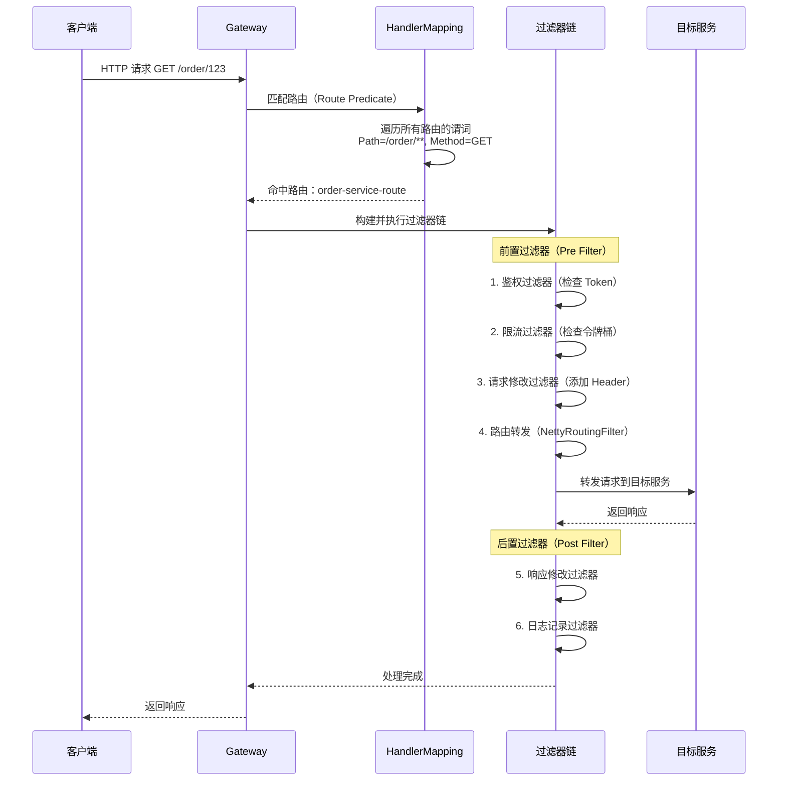
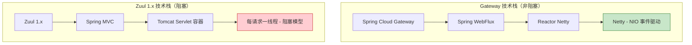
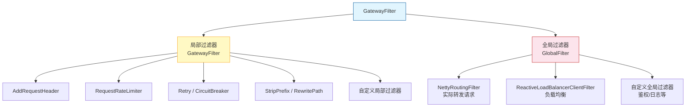
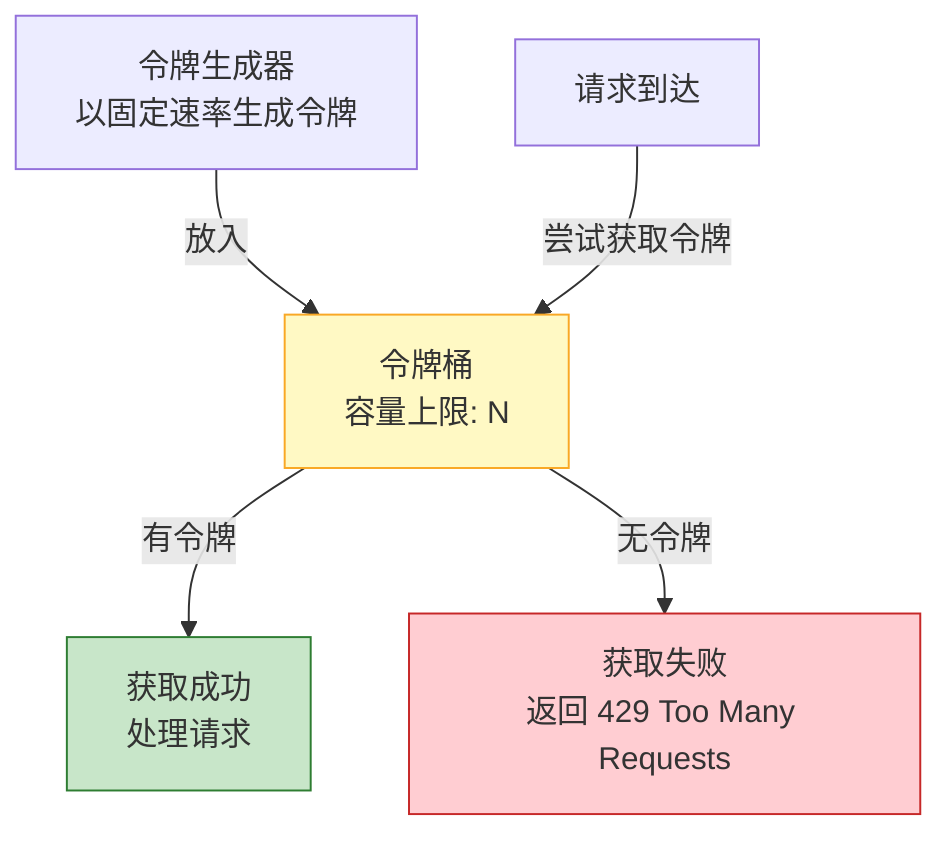

# API 网关

## ⭐ 面试重点速览

| 知识模块 | 重点内容 | 面试频率 |
|----------|----------|----------|
| 三大核心概念 | Route / Predicate / Filter 的定义与协作关系 | 极高 |
| 工作原理 | WebFlux + Reactor Netty 非阻塞 IO，区别于 Spring MVC | 极高 |
| 路由谓词 | Path / Header / Query / Method / Host / Cookie / 时间谓词等 | 高 |
| GatewayFilter 过滤器链 | 局部过滤器 vs 全局过滤器 GlobalFilter，自定义过滤器 | 极高 |
| 限流实现 | RequestRateLimiter + Redis 令牌桶算法 | 高 |
| Gateway vs Zuul 1.x | IO 模型、性能、维护状态全面对比 | 极高 |
| 过滤器执行顺序 | Ordered 接口、@Order 注解、洋葱模型 | 中高 |

---

## 一、⭐ Gateway 三大核心概念

### 1.1 什么是 API 网关？

Spring Cloud Gateway 是 Spring 官方基于 Spring WebFlux 构建的 API 网关，为微服务架构提供统一的路由转发、过滤器链、限流熔断等能力。它替代了已停止维护的 Netflix Zuul 1.x。

```mermaid
graph TB
    subgraph 客户端
        A[浏览器/App]
        B[第三方系统]
        C[内部服务调用]
    end
    
    subgraph Gateway 网关
        D[Spring Cloud Gateway<br/>统一入口]
        D1[路由转发]
        D2[鉴权认证]
        D3[限流熔断]
        D4[日志监控]
        D5[跨域处理]
    end
    
    subgraph 微服务集群
        E[订单服务]
        F[支付服务]
        G[用户服务]
        H[商品服务]
    end
    
    A --> D
    B --> D
    C --> D
    D --> D1
    D --> D2
    D --> D3
    D --> D4
    D --> D5
    D1 --> E
    D1 --> F
    D1 --> G
    D1 --> H
    
    style D fill:#e1f5fe,stroke:#01579b,stroke-width:3px
    style E fill:#e8f5e9,stroke:#2e7d32
    style F fill:#e8f5e9,stroke:#2e7d32
    style G fill:#e8f5e9,stroke:#2e7d32
    style H fill:#e8f5e9,stroke:#2e7d32
```



### 1.2 三大核心概念：Route / Predicate / Filter

| 概念 | 英文 | 说明 | 类比 |
|------|------|------|------|
| **路由** | Route | 网关的基本构建块，包含目标 URI、谓词集合和过滤器集合 | 导航路线的目的地 |
| **谓词** | Predicate | 匹配 HTTP 请求的条件（路径、Header、参数等），基于 Java 8 `Predicate` | 路线的筛选条件 |
| **过滤器** | Filter | 对请求和响应进行修改处理的组件，分为局部和全局两类 | 路上的检查站 |

```java
// 路由定义完整示例 —— 演示三大概念
@Configuration
public class GatewayConfig {
    @Bean
    public RouteLocator customRoutes(RouteLocatorBuilder builder) {
        return builder.routes()
            // ===== Route：定义一条路由规则 =====
            .route("order-service-route", r -> r
                // ===== Predicate：匹配路径 + 方法 + Header =====
                .path("/order/**")
                .and().method("GET")
                .and().header("X-Request-Id")
                // ===== Filter：修改请求/响应 =====
                .filters(f -> f
                    .addRequestHeader("X-Gateway-From", "SpringCloudGateway")
                    .addResponseHeader("X-Response-Time", 
                        String.valueOf(System.currentTimeMillis()))
                )
                // 目标 URI
                .uri("lb://order-service")
            )
            .build();
    }
}
```

### 1.3 ⭐ 请求处理工作流程图



---

## 二、工作原理

### 2.1 基于 Spring WebFlux + Reactor Netty

Spring Cloud Gateway 与 Spring MVC 网关（如 Zuul 1.x）在技术栈上有本质区别：



| 维度 | Spring Cloud Gateway | Zuul 1.x / Spring MVC 网关 |
|------|---------------------|---------------------------|
| **底层框架** | Spring WebFlux | Spring MVC |
| **网络运行时** | Reactor Netty（Netty） | Tomcat / Jetty |
| **IO 模型** | **非阻塞 NIO**（事件驱动） | **阻塞 BIO**（每请求一线程） |
| **线程模型** | 少量 EventLoop 线程 | 每个请求占用一个线程 |
| **并发能力** | 高（线程无需等待 IO） | 受线程池大小限制 |
| **适用场景** | 高并发网关、长连接、流式传输 | 低并发、传统 Web 应用 |

### 2.2 非阻塞 IO 原理

```java
// 传统阻塞 IO（BIO）—— 每请求一线程，Tomcat 200 线程 = 200 并发
public class BlockingHandler {
    public void handle(Request req, Response resp) {
        String result = downstreamService.call(req);  // 线程阻塞等待！
        resp.write(result);  // 线程一直被占用直到响应完成
    }
}

// 非阻塞 IO（NIO）—— 事件驱动，少量线程处理海量请求
public class NonBlockingHandler {
    public Mono<Void> handle(ServerHttpRequest req, ServerHttpResponse resp) {
        return downstreamService.callAsync(req)  // 异步调用，线程立即释放
            .flatMap(result -> resp.writeWith(Mono.just(result)));
        // 当下游返回结果时，EventLoop 回调处理
    }
}
```

### 2.3 Gateway 内部核心组件

```java
// 1. RoutePredicateHandlerMapping —— 路由匹配器
public class RoutePredicateHandlerMapping extends AbstractHandlerMapping {
    @Override
    protected Mono<?> getHandlerInternal(ServerWebExchange exchange) {
        return this.routeLocator.getRoutes()
            .filter(route -> route.getPredicate().test(exchange))  // 匹配谓词
            .next()  // 取第一个匹配的路由
            .map(route -> {
                exchange.getAttributes().put(GATEWAY_ROUTE_ATTR, route);
                return this.webHandler;  // 返回 FilteringWebHandler
            });
    }
}

// 2. FilteringWebHandler —— 过滤器链执行器
public class FilteringWebHandler implements WebHandler {
    private final List<GatewayFilter> globalFilters;
    
    @Override
    public Mono<Void> handle(ServerWebExchange exchange) {
        Route route = exchange.getRequiredAttribute(GATEWAY_ROUTE_ATTR);
        // 合并全局过滤器 + 路由过滤器，按 Order 排序
        List<GatewayFilter> combined = new ArrayList<>(this.globalFilters);
        combined.addAll(route.getFilters());
        AnnotationAwareOrderComparator.sort(combined);
        // 构建过滤器链并执行
        return new DefaultGatewayFilterChain(combined).filter(exchange);
    }
}
```

::: tip 关键：Gateway 不是基于 Servlet 的
Gateway 运行在 Netty 之上，不依赖 Servlet 容器。因此：
- 不能使用 `HttpServletRequest` / `HttpServletResponse`（使用 `ServerWebExchange` 替代）
- 不能使用传统 Filter（使用 GatewayFilter 替代）
- 所有处理必须是异步非阻塞的（返回 Mono/Flux）
:::

---

## 三、路由谓词 Predicate

### 3.1 谓词工厂概述

Gateway 内置了丰富的谓词工厂，所有谓词都实现了 `RoutePredicateFactory` 接口。请求必须**同时满足路由上配置的所有谓词**才会被转发。

### 3.2 常用谓词速查

| 谓词 | 说明 | YAML 示例 |
|------|------|-----------|
| **Path** | 路径匹配（最常用） | `Path=/order/**` |
| **Method** | HTTP 方法 | `Method=GET,POST` |
| **Header** | 请求头匹配（支持正则） | `Header=X-Request-Id, \d+` |
| **Query** | 查询参数匹配 | `Query=version, v\d+` |
| **Host** | 域名匹配 | `Host=**.order.com` |
| **Cookie** | Cookie 匹配 | `Cookie=sessionId, [a-zA-Z0-9]+` |
| **Before/After** | 时间范围（定时上下线） | `After=2026-01-01T00:00:00+08:00[Asia/Shanghai]` |
| **Between** | 时间区间 | `Between=2026-01-01T00:00:00+08:00, 2026-06-30T23:59:59+08:00` |
| **Weight** | 权重路由（灰度发布） | `Weight=order-group, 80` |
| **RemoteAddr** | IP 地址范围 | `RemoteAddr=192.168.1.0/24` |

### 3.3 谓词配置示例

```yaml
spring:
  cloud:
    gateway:
      routes:
        # 示例1：基础路由
        - id: order-service
          uri: lb://order-service
          predicates:
            - Path=/order/**
            - Method=GET,POST

        # 示例2：带鉴权的路由
        - id: secure-service
          uri: lb://secure-service
          predicates:
            - Path=/api/secure/**
            - Header=Authorization, Bearer\s.+
            - Header=X-Request-Id, \d+

        # 示例3：定时上线路由（2026年全年有效）
        - id: time-limited-service
          uri: lb://special-service
          predicates:
            - Path=/promo/**
            - Between=2026-01-01T00:00:00+08:00, 2026-12-31T23:59:59+08:00
```

### 3.4 权重路由 —— 灰度发布

```yaml
spring:
  cloud:
    gateway:
      routes:
        - id: order-service-v1       # 稳定版本，80% 流量
          uri: lb://order-service-v1
          predicates:
            - Path=/order/**
            - Weight=order-group, 80
        - id: order-service-v2       # 灰度版本，20% 流量
          uri: lb://order-service-v2
          predicates:
            - Path=/order/**
            - Weight=order-group, 20
```

::: tip 权重路由的价值
通过 Weight 谓词，可以不依赖外部组件实现流量切分，配合不同版本的微服务实例，轻松实现蓝绿部署和金丝雀发布。
:::

::: warning 谓词匹配规则
所有谓词之间是**AND 关系**，请求必须同时满足所有谓词才能命中路由。如果多个路由匹配同一请求，默认使用第一个匹配的路由（按配置顺序）。
:::

---

## 四、⭐ GatewayFilter 过滤器链

### 4.1 过滤器分类



| 类型 | 作用范围 | 配置方式 | 典型用途 |
|------|----------|----------|----------|
| **局部过滤器** | 特定路由 | 路由配置 `filters` 节点下 | 添加 Header、重写路径、限流、重试 |
| **全局过滤器** | 所有路由 | 实现 `GlobalFilter` 并注册为 Bean | 鉴权、全局日志、负载均衡、路由转发 |

### 4.2 内置过滤器速查

| 过滤器 | 功能 | 示例 |
|--------|------|------|
| `AddRequestHeader` | 添加请求头 | `AddRequestHeader=X-Gateway, true` |
| `AddRequestParameter` | 添加请求参数 | `AddRequestParameter=source, gateway` |
| `AddResponseHeader` | 添加响应头 | `AddResponseHeader=X-Result, success` |
| `RemoveRequestHeader` | 移除请求头 | `RemoveRequestHeader=X-Internal-Token` |
| `RewritePath` | 路径重写 | `RewritePath=/api/(?<seg>.*), /$\{seg}` |
| `StripPrefix` | 去除路径前缀 | `StripPrefix=1`（去除 /api） |
| `PrefixPath` | 添加路径前缀 | `PrefixPath=/api` |
| `RedirectTo` | 重定向 | `RedirectTo=302, https://new.example.com` |
| `Retry` | 重试 | `Retry=3`（重试3次） |

### 4.3 路径重写实战

```yaml
spring:
  cloud:
    gateway:
      routes:
        - id: api-rewrite
          uri: lb://order-service
          predicates:
            - Path=/api/v1/order/**
          filters:
            - StripPrefix=2  # 将 /api/v1/order/123 → /order/123
```

### 4.4 ⭐ 自定义全局过滤器 GlobalFilter

```java
// 自定义鉴权全局过滤器 —— 面试高频考点
@Component
@Order(-1)  // 数字越小优先级越高，确保鉴权在其他过滤器之前执行
public class AuthGlobalFilter implements GlobalFilter {
    
    @Override
    public Mono<Void> filter(ServerWebExchange exchange, GatewayFilterChain chain) {
        String path = exchange.getRequest().getURI().getPath();
        
        // 白名单路径直接放行
        if (isWhitePath(path)) {
            return chain.filter(exchange);
        }
        
        // 提取并验证 Token
        String token = exchange.getRequest().getHeaders().getFirst("Authorization");
        if (token == null || !token.startsWith("Bearer ")) {
            exchange.getResponse().setStatusCode(HttpStatus.UNAUTHORIZED);
            return exchange.getResponse().setComplete();
        }
        
        try {
            // 解析 JWT 并提取用户信息
            Claims claims = JwtUtil.parseJWT(token.substring(7));
            String userId = claims.get("userId", String.class);
            
            // 将用户信息透传到下游微服务
            exchange.getRequest().mutate()
                .header("X-User-Id", userId)
                .header("X-User-Name", claims.get("username", String.class))
                .build();
            
            return chain.filter(exchange);
            
        } catch (Exception e) {
            exchange.getResponse().setStatusCode(HttpStatus.UNAUTHORIZED);
            return exchange.getResponse().setComplete();
        }
    }
    
    private boolean isWhitePath(String path) {
        AntPathMatcher matcher = new AntPathMatcher();
        return matcher.match("/auth/**", path) || matcher.match("/public/**", path);
    }
}
```

### 4.5 自定义局部过滤器 GatewayFilter

```java
// 自定义请求耗时统计过滤器（局部过滤器工厂）
@Component
public class TimeCostGatewayFilterFactory 
        extends AbstractGatewayFilterFactory<TimeCostGatewayFilterFactory.Config> {
    
    public TimeCostGatewayFilterFactory() {
        super(Config.class);
    }
    
    @Override
    public GatewayFilter apply(Config config) {
        return (exchange, chain) -> {
            long startTime = System.currentTimeMillis();
            return chain.filter(exchange)
                .then(Mono.fromRunnable(() -> {
                    long cost = System.currentTimeMillis() - startTime;
                    if (cost > config.getMaxTimeMs()) {
                        log.warn("慢请求告警：URI={}, 耗时={}ms",
                            exchange.getRequest().getURI(), cost);
                    }
                    exchange.getResponse().getHeaders()
                        .add("X-Request-Cost-Ms", String.valueOf(cost));
                }));
        };
    }
    
    @Data
    public static class Config {
        private long maxTimeMs = 1000;  // 默认慢请求阈值 1 秒
    }
}
```

```yaml
# 在路由中使用自定义过滤器
spring:
  cloud:
    gateway:
      routes:
        - id: order-service
          uri: lb://order-service
          predicates:
            - Path=/order/**
          filters:
            - TimeCost=3000  # 慢请求阈值设为 3 秒
```

### 4.6 ⭐ 过滤器执行顺序 —— 洋葱模型

```mermaid
graph LR
    A[请求到达] --> B[Order: -100<br/>FirstGlobalFilter<br/>前置处理]
    B --> C[Order: 0<br/>AuthGlobalFilter<br/>鉴权验证]
    C --> D[Order: 1<br/>路由过滤器<br/>Header 修改等]
    D --> E[Order: 10150<br/>LoadBalancer<br/>负载均衡]
    E --> F[Order: MAX<br/>NettyRoutingFilter<br/>实际转发]
    F --> G[目标服务]
    
    G --> H[Order: MAX<br/>NettyRoutingFilter<br/>后置处理]
    H --> I[Order: 10150<br/>LoadBalancer<br/>后置处理]
    I --> J[Order: 1<br/>路由过滤器<br/>后置处理]
    J --> K[Order: 0<br/>AuthGlobalFilter<br/>后置处理]
    K --> L[Order: -100<br/>FirstGlobalFilter<br/>后置处理]
    L --> M[响应返回]
    
    style B fill:#ffcdd2,stroke:#c62828
    style F fill:#c8e6c9,stroke:#2e7d32
    style M fill:#e1f5fe,stroke:#01579b
```



执行顺序规则：
1. Order 值越小，优先级越高（越先执行前置处理）
2. 全局过滤器：默认按 `Ordered` 接口排序，也可以通过 `@Order` 注解指定
3. 路由过滤器：默认 Order = 1，在全局过滤器之后
4. `NettyRoutingFilter`（Order = Integer.MAX_VALUE）是分水岭：之前是前置处理，之后是后置处理（倒序）

::: danger 面试陷阱：洋葱模型
过滤器链的执行遵循**责任链模式**，呈"洋葱"结构：
- 前置处理（Pre）：按 Order 从小到大依次执行
- 后置处理（Post）：按 Order 从大到小倒序执行

在 `filter()` 方法中，`chain.filter(exchange)` 之前的代码是前置处理，`.then()` 中的代码是后置处理。
:::

---

## 五、限流实现

### 5.1 令牌桶算法原理

Spring Cloud Gateway 内置 `RequestRateLimiter` 过滤器，采用**令牌桶算法（Token Bucket）**，底层依赖 Redis 存储令牌状态。



### 5.2 配置实现

**添加依赖**：

```xml
<dependency>
    <groupId>org.springframework.boot</groupId>
    <artifactId>spring-boot-starter-data-redis-reactive</artifactId>
</dependency>
```

**定义限流 Key 策略**：

```java
@Configuration
public class RateLimiterConfig {
    
    // 按请求 IP 限流（最常用）
    @Bean
    @Primary
    public KeyResolver ipKeyResolver() {
        return exchange -> Mono.just(
            exchange.getRequest().getRemoteAddress()
                .getAddress().getHostAddress()
        );
    }
    
    // 按用户 ID 限流（需配合鉴权）
    @Bean
    public KeyResolver userKeyResolver() {
        return exchange -> Mono.just(
            exchange.getRequest().getHeaders().getFirst("X-User-Id")
        );
    }
    
    // 按请求路径限流（接口级别）
    @Bean
    public KeyResolver apiKeyResolver() {
        return exchange -> Mono.just(
            exchange.getRequest().getURI().getPath()
        );
    }
}
```

**配置路由限流规则**：

```yaml
spring:
  cloud:
    gateway:
      routes:
        - id: order-service
          uri: lb://order-service
          predicates:
            - Path=/order/**
          filters:
            - name: RequestRateLimiter
              args:
                redis-rate-limiter:
                  replenishRate: 10       # 令牌桶每秒填充速率（QPS）
                  burstCapacity: 20       # 令牌桶最大容量（允许瞬时突发量）
                  requestedTokens: 1      # 每个请求消耗令牌数
```

### 5.3 Redis 原子性保证

```java
// RedisRateLimiter 使用 Lua 脚本保证原子性
// 核心逻辑：一次性完成"计算填充 + 判断令牌 + 消耗令牌"三步操作
public class RedisRateLimiter {
    
    // Lua 脚本关键逻辑（简化版）
    // local filled = min(capacity, last_tokens + (now - last_time) * rate / 1000)
    // local allowed = filled >= requested
    // if allowed then new_tokens = filled - requested end
    // redis.call('setex', tokens_key, ttl, new_tokens)
    // 返回 {allowed, new_tokens}
    
    public Mono<Response> isAllowed(String routeId, String id) {
        List<String> keys = Arrays.asList(
            "request_rate_limiter.{" + id + "}.tokens",
            "request_rate_limiter.{" + id + "}.timestamp"
        );
        // Redis 单线程执行 Lua 脚本，天然原子性
        return this.redisTemplate.execute(script, keys, 
            rate, capacity, currentTime, requestedTokens);
    }
}
```

::: tip 令牌桶 vs 漏桶
- **令牌桶**：允许突发流量（桶满时允许瞬时消耗大量令牌），适合需要处理突发的场景
- **漏桶**：强制匀速处理，无论流量多大都按固定速率流出，适合需要平滑流量的场景

Gateway 使用令牌桶，兼顾平滑限流和突发处理能力。
:::

---

## 六、Gateway vs Zuul 1.x 对比

### 6.1 全面对比

| 对比维度 | Spring Cloud Gateway | Netflix Zuul 1.x |
|----------|---------------------|-------------------|
| **底层框架** | Spring WebFlux（响应式） | Spring MVC（Servlet 阻塞式） |
| **IO 模型** | 非阻塞 NIO（Netty） | 阻塞 BIO（Tomcat） |
| **线程模型** | EventLoop（少量线程） | Thread-per-Request（大量线程） |
| **内存消耗** | 低（线程不阻塞等待） | 高（线程阻塞期间占用内存） |
| **连接数支持** | 数万并发连接 | 受线程池大小限制（通常 200-500） |
| **性能** | RPS 约为 Zuul 1.x 的 1.6 倍 | 基准性能 |
| **限流 / 熔断 / 重试** | 内置支持 | 需自行集成 Hystrix 等 |
| **维护状态** | 活跃维护（Spring 官方） | 已停止维护（2018年） |
| **Spring Boot 3.x** | 完整支持 | 不兼容 |
| **学习曲线** | 中等（需了解 WebFlux） | 较低 |

### 6.2 处理模型对比

```java
// Zuul 1.x —— 同步阻塞，每请求一线程
public class ZuulServlet extends HttpServlet {
    @Override
    public void service(HttpServletRequest req, HttpServletResponse resp) {
        zuulRunner.init(req, resp);
        preRoute();   // 前置过滤器（阻塞）
        route();      // 路由转发（阻塞等待下游服务响应）
        postRoute();  // 后置过滤器（阻塞）
        zuulRunner.destroy();
    }
}

// Gateway —— 异步非阻塞，少量 EventLoop 线程
public class FilteringWebHandler implements WebHandler {
    @Override
    public Mono<Void> handle(ServerWebExchange exchange) {
        // 立即返回 Mono，线程不阻塞，可处理其他请求
        return new DefaultGatewayFilterChain(filters)
            .filter(exchange)
            .onErrorResume(...);
    }
}
```

::: danger 为什么必须从 Zuul 1.x 迁移？
1. **已停止维护**：Netflix 于 2018 年宣布不再更新 Zuul 1.x
2. **Spring Boot 3.x 不兼容**：Zuul 1.x 依赖 `javax.servlet`，Spring Boot 3.x 使用 `jakarta.servlet`
3. **性能瓶颈**：阻塞 IO 模型在高并发场景下线程资源消耗严重
4. **功能缺失**：Gateway 内置限流、熔断、重试，Zuul 1.x 需额外集成
:::

---

## ⭐ 面试高频问题汇总

### Q1：请解释 Spring Cloud Gateway 的三大核心概念：Route、Predicate、Filter。

- **Route（路由）**：网关的基本构建块，由 ID、目标 URI、谓词集合和过滤器集合组成。
- **Predicate（谓词）**：匹配 HTTP 请求的条件，基于 Java 8 `java.util.function.Predicate`。常见的有 Path、Method、Header、Query、Host 等。请求必须满足路由上所有谓词才会被转发。
- **Filter（过滤器）**：对请求/响应进行修改处理的组件。分为局部过滤器（GatewayFilter，作用于特定路由）和全局过滤器（GlobalFilter，作用于所有路由）。

### Q2：Spring Cloud Gateway 的底层原理是什么？为什么它比 Zuul 1.x 性能更好？

Gateway 基于 **Spring WebFlux** 和 **Reactor Netty** 构建，采用**非阻塞 NIO 模型**。核心区别：

- Gateway 使用 Netty 的 EventLoop 线程模型，少量线程（通常 CPU 核心数 * 2）即可处理数万并发连接，线程不会阻塞等待 IO
- Zuul 1.x 使用 Servlet 阻塞模型，每个请求占用一个线程，线程池大小（通常 200）直接限制了并发能力

性能测试中 Gateway 的 RPS 约为 Zuul 1.x 的 1.6 倍，且在高并发下优势更明显。

### Q3：GatewayFilter 和 GlobalFilter 有什么区别？它们的执行顺序如何确定？

| 维度 | GatewayFilter（局部过滤器） | GlobalFilter（全局过滤器） |
|------|---------------------------|---------------------------|
| 作用范围 | 特定路由 | 所有路由 |
| 配置方式 | 路由配置中 `filters` 节点 | 实现 `GlobalFilter` 接口并注册为 Bean |
| 典型用途 | 添加 Header、路径重写、限流 | 鉴权、全局日志、负载均衡 |

执行顺序：按 `Ordered` 接口的 `getOrder()` 返回值排序，值越小越先执行。过滤器链采用**洋葱模型**：前置处理从小到大执行，后置处理从大到小倒序执行。`NettyRoutingFilter`（Order = Integer.MAX_VALUE）是分水岭。

### Q4：如何实现一个自定义的全局鉴权过滤器？

```java
@Component
@Order(-1)  // 最高优先级
public class AuthGlobalFilter implements GlobalFilter {
    @Override
    public Mono<Void> filter(ServerWebExchange exchange, GatewayFilterChain chain) {
        String token = exchange.getRequest().getHeaders().getFirst("Authorization");
        if (token == null) {
            exchange.getResponse().setStatusCode(HttpStatus.UNAUTHORIZED);
            return exchange.getResponse().setComplete();
        }
        // 验证 Token 并将用户信息透传给下游
        exchange.getRequest().mutate()
            .header("X-User-Id", parseUserId(token))
            .build();
        return chain.filter(exchange);
    }
}
```

关键点：实现 `GlobalFilter` 接口，通过 `@Order` 控制优先级，用 `exchange.getRequest().mutate()` 修改请求头。

### Q5：Gateway 如何实现限流？令牌桶算法在 Redis 中如何保证原子性？

Gateway 使用 `RequestRateLimiter` 过滤器 + **Redis 令牌桶算法**实现限流。通过 `KeyResolver` 定义限流维度（IP、用户、接口）。

**Redis 原子性保证**：使用 **Lua 脚本**在 Redis 服务端一次性执行"计算填充 + 判断令牌 + 消耗令牌"三步操作，Redis 单线程模型保证 Lua 脚本执行期间不会被其他命令打断，天然原子性。

核心参数：`replenishRate`（QPS）、`burstCapacity`（令牌桶容量）、`requestedTokens`（每请求消耗令牌数）。

### Q6：Gateway 和 Zuul 1.x 的核心区别是什么？为什么 Zuul 1.x 被废弃了？

核心区别在于 IO 模型：
- Gateway：非阻塞 NIO（Netty + EventLoop），高并发性能好
- Zuul 1.x：阻塞 BIO（Tomcat + Thread-per-Request），并发受线程池限制

被废弃原因：阻塞 IO 模型性能瓶颈明显、Netflix 已停止维护、不兼容 Spring Boot 3.x、Gateway 内置限流/熔断/重试等丰富功能。

### Q7：过滤器链的"洋葱模型"是什么？如何理解前置和后置过滤器的执行顺序？

过滤器链采用责任链模式，执行顺序像"剥洋葱"：

```
请求 → Filter1.pre → Filter2.pre → Filter3.pre → 目标服务
                                                      ↓
响应 ← Filter1.post ← Filter2.post ← Filter3.post ← 目标服务
```

- 前置处理（pre）：按 Order 从小到大依次执行
- `NettyRoutingFilter`（Order = MAX）：实际转发请求到目标服务
- 后置处理（post）：按 Order 从大到小倒序执行

在 `filter()` 方法中，`chain.filter(exchange)` 之前的代码是前置处理，`.then()` 中的代码是后置处理。

---

## 面试追问环节

**Q：如果 Gateway 挂了，整个微服务系统是不是就不可用了？如何保证网关高可用？**

Gateway 挂掉后外部请求确实无法进入，但可以采取以下措施：

1. **多实例部署 + Nginx 负载均衡**：部署多个 Gateway 实例，Nginx 前置做四层/七层负载均衡
2. **Kubernetes 部署**：使用 K8s Deployment + Service 管理 Gateway 副本，配合 HPA 自动扩缩容
3. **健康检查**：配置 Nginx upstream 健康检查，自动剔除不健康的实例
4. **服务间通信**：内部微服务间使用 Feign/Dubbo 直接通信，不经过网关（网关只暴露对外 API）

**Q：Gateway 如何实现动态路由（不重启服务更新路由规则）？**

```java
// 方式一：通过 Actuator 端点动态刷新
// POST /actuator/gateway/refresh —— 刷新路由

// 方式二：结合 Nacos 配置中心实现动态路由
@RefreshScope
@Configuration
public class DynamicRouteConfig {
    // 路由配置从 Nacos 读取，支持动态刷新
}

// 方式三：编码方式动态增删路由
@Autowired
private RouteDefinitionWriter routeDefinitionWriter;

public void addRoute(RouteDefinition definition) {
    routeDefinitionWriter.save(Mono.just(definition)).subscribe();
}

public void deleteRoute(String routeId) {
    routeDefinitionWriter.delete(Mono.just(routeId)).subscribe();
}
```

**Q：Gateway 的限流在分布式环境下如何保证准确性？**

通过 Redis 集中式存储令牌桶状态，所有 Gateway 实例共享同一个 Redis 中的令牌桶数据。Redis 单线程执行 Lua 脚本，天然保证原子性和一致性。网络延迟可能带来微小误差，在绝大多数场景下可以接受。