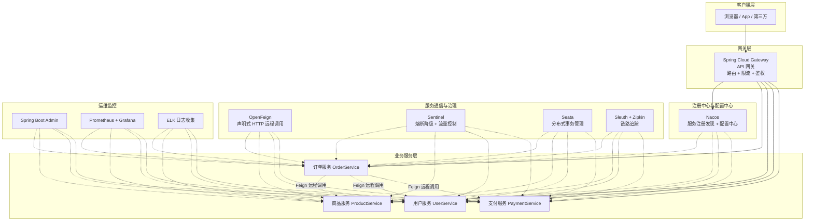
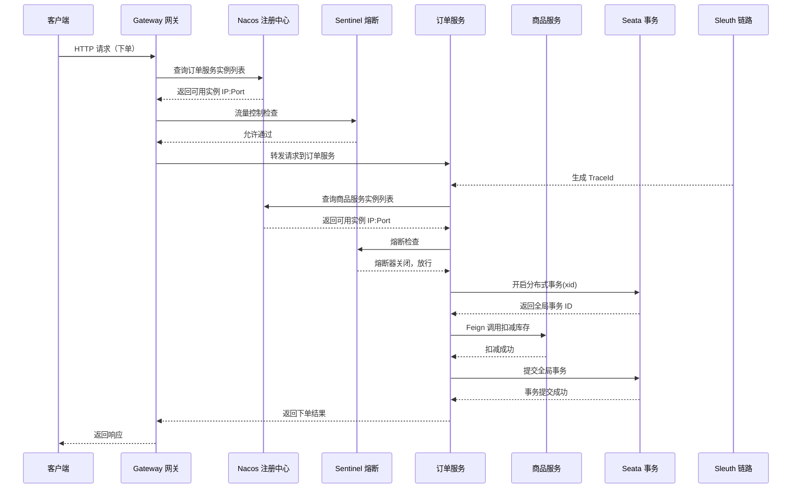
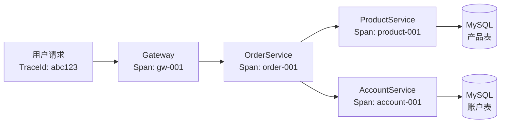

# 微服务架构概览

## ⭐ 面试重点速览

| 知识模块 | 重点内容 | 面试频率 |
|----------|----------|----------|
| 微服务 vs 单体 | 架构对比、优缺点、拆分原则 | 极高 |
| Spring Cloud 技术栈 | 组件全景图、各组件职责 | 极高 |
| 服务注册与发现 | Nacos / Eureka / Consul 原理与对比 | 极高 |
| 远程调用 | Feign / OpenFeign 声明式调用原理 | 高 |
| 配置中心 | Nacos Config 动态刷新、配置优先级 | 中高 |
| API 网关 | Gateway 路由、过滤器、限流 | 高 |
| 熔断降级 | Sentinel 流量控制与熔断策略 | 高 |
| 分布式事务 | Seata AT / TCC 模式原理 | 中高 |
| 版本演进 | Spring Cloud 版本号变化、与 Boot 对应关系 | 中 |

---

## 一、微服务架构 vs 单体架构

### 1.1 什么是微服务架构？

**微服务架构（Microservices Architecture）** 是一种将单个应用程序划分为一组小型服务的架构风格，每个服务运行在自己的进程中，服务间通过轻量级通信机制（通常是 HTTP/REST 或 RPC）互相协作。每个服务围绕业务能力构建，可独立部署、独立扩展。

::: tip 一句话总结
微服务架构 = 将"巨石应用"拆分为一组"独立自治"的小服务，每个服务都具备完整的生命周期管理能力。
:::

### 1.2 单体架构 vs 微服务架构对比

| 对比维度 | 单体架构 | 微服务架构 |
|----------|----------|------------|
| **代码组织** | 所有功能模块在一个代码仓库 | 每个服务独立代码仓库 |
| **部署方式** | 整体打包部署，一次发布所有功能 | 每个服务独立部署，互不影响 |
| **技术栈** | 统一技术栈，全项目使用同一语言/框架 | 每个服务可独立选择技术栈（多语言） |
| **数据存储** | 共享单一数据库 | 每个服务有独立数据库（数据去中心化） |
| **扩展性** | 整体扩展，无法按模块伸缩 | 按需扩展，可对热点服务单独扩容 |
| **故障隔离** | 单点故障可能导致整个系统不可用 | 故障隔离在单个服务内，不影响其他服务 |
| **团队协作** | 耦合度高，多人协作易冲突 | 团队按服务拆分，松耦合并行开发 |
| **测试难度** | 集成测试复杂，启动慢 | 服务独立测试，启动快 |
| **运维复杂度** | 简单，单个应用 | 复杂，需处理服务发现、配置中心、链路追踪等 |
| **适用场景** | 小型项目、快速原型、内部工具 | 中大型项目、高并发、多团队协作 |

### 1.3 微服务面临的挑战

::: danger 微服务不是银弹！

引入微服务意味着引入分布式系统的所有复杂性：

1. **服务治理**：服务数量激增，如何管理服务间的依赖关系？
2. **网络通信**：服务间调用从本地方法调用变为远程网络调用，延迟和故障率增加
3. **数据一致性**：数据库分拆后，跨服务的事务保证变得困难
4. **运维复杂度**：需要容器化、CI/CD、监控告警、日志聚合等基础设施
5. **调试困难**：一次请求可能跨越多个服务，问题定位困难
6. **版本管理**：服务间接口版本兼容需要额外管理

:::

### 1.4 拆分原则

```java
// 不合理拆分：将紧密耦合的逻辑分到两个服务
// 服务 A
@Service
public class OrderService {
    public void createOrder(Order order) {
        // 调用服务 B 的库存检查
        inventoryClient.checkStock(order.getItems());
        // 调用服务 B 的库存扣减
        inventoryClient.deductStock(order.getItems());
        // 保存订单
        orderDao.save(order);
    }
}

// ⚠ 问题：库存检查 + 扣减属于紧密耦合的高频操作
// 拆分后会引入额外的网络开销和分布式事务复杂度
```

::: tip 合理的微服务拆分原则
- **单一职责**：每个服务只负责一个业务领域
- **高内聚低耦合**：经常一起变化的功能放在同一服务
- **按业务能力划分**：订单服务、商品服务、用户服务 —— 领域驱动
- **数据独立性**：每个服务拥有自己的数据库
- **团队对齐**：服务边界与团队边界对齐（康威定律）
:::

---

## 二、⭐ Spring Cloud 技术栈全景图

### 2.1 组件架构图



### 2.2 请求调用链路



---

## 三、各组件职责简述

### 3.1 服务注册与发现 -- Nacos

**核心职责**：管理所有微服务的网络位置（IP + Port），让服务消费者能够动态发现服务提供者。

```java
// 服务提供者启动时注册到 Nacos
@SpringBootApplication
@EnableDiscoveryClient  // 启用服务发现客户端
public class OrderApplication {
    public static void main(String[] args) {
        SpringApplication.run(OrderApplication.class, args);
    }
}
```
```yaml
# application.yml —— 服务提供者配置
spring:
  cloud:
    nacos:
      discovery:
        server-addr: 127.0.0.1:8848  # Nacos 服务地址
        service: order-service        # 注册到 Nacos 的服务名
```

详细原理见 [服务注册与发现](./registry.md)。

### 3.2 配置中心 -- Nacos Config

**核心职责**：集中管理所有服务的配置文件，支持动态刷新，无需重启即可生效。

```yaml
# bootstrap.yml —— 配置中心（优先级高于 application.yml）
spring:
  cloud:
    nacos:
      config:
        server-addr: 127.0.0.1:8848
        file-extension: yaml           # 配置文件格式
        group: DEFAULT_GROUP            # 配置分组
        namespace: dev                  # 命名空间（环境隔离）
```

```java
// 动态刷新配置 —— @RefreshScope
@RestController
@RefreshScope  // 配置变更后自动刷新此 Bean
public class ConfigController {

    @Value("${app.timeout:3000}")
    private int timeout;  // Nacos 修改配置后，值自动更新

    @GetMapping("/timeout")
    public int getTimeout() {
        return timeout;
    }
}
```

### 3.3 API 网关 -- Spring Cloud Gateway

**核心职责**：统一入口，负责路由转发、身份认证、限流熔断、日志记录等横切关注点。

```java
// Gateway 路由配置（Java DSL 方式）
@Configuration
public class GatewayConfig {

    @Bean
    public RouteLocator customRoutes(RouteLocatorBuilder builder) {
        return builder.routes()
            // 路由规则 1：订单服务
            .route("order-service", r -> r
                .path("/api/order/**")       // 匹配路径
                .filters(f -> f
                    .addRequestHeader("X-Gateway", "Gateway")
                    .stripPrefix(1)           // 去掉第一级路径前缀
                )
                .uri("lb://order-service"))   // lb 表示负载均衡
            // 路由规则 2：商品服务
            .route("product-service", r -> r
                .path("/api/product/**")
                .filters(f -> f.circuitBreaker(c -> c
                    .setName("productCB")     // 集成熔断器
                ))
                .uri("lb://product-service"))
            .build();
    }
}
```

::: tip Gateway 三大核心概念
| 概念 | 说明 |
|------|------|
| **Route（路由）** | 网关的基本构建块，包含 ID、目标 URI、Predicate 集合、Filter 集合 |
| **Predicate（断言）** | 基于 Java 8 Predicate，匹配 HTTP 请求的各种属性（路径、Header、参数等） |
| **Filter（过滤器）** | 对请求和响应进行修改处理的过滤器链，分为 pre 和 post 两类 |
:::

### 3.4 远程调用 -- OpenFeign

**核心职责**：声明式 HTTP 客户端，让服务间远程调用像调用本地方法一样简单。

```java
// 定义 Feign 客户端接口
@FeignClient(
    name = "product-service",    // 目标服务名（与 Nacos 注册一致）
    fallbackFactory = ProductClientFallbackFactory.class  // 降级处理
)
public interface ProductClient {

    @GetMapping("/product/{id}")
    ProductDTO getProductById(@PathVariable("id") Long id);

    @PostMapping("/product/stock/deduct")
    Result deductStock(@RequestBody StockDeductDTO dto);
}

// 调用方式：像本地 Service 一样注入使用
@Service
public class OrderService {

    private final ProductClient productClient;  // 注入 Feign 客户端

    public Order createOrder(OrderDTO dto) {
        // 远程调用商品服务 —— 就像调用本地方法！
        ProductDTO product = productClient.getProductById(dto.getProductId());
        // ... 创建订单逻辑
    }
}
```

::: danger Feign 调用链关键问题
1. **超时配置**：Feign 默认连接超时 10s、读取超时 60s，高并发场景需要调小
2. **重试机制**：默认不重试，需要配合 Ribbon/LoadBalancer 配置
3. **熔断降级**：必须配置 fallback 或 fallbackFactory，防止服务雪崩
4. **请求拦截器**：通过 RequestInterceptor 统一传递认证 Token、TraceId 等
:::

### 3.5 熔断降级 -- Sentinel

**核心职责**：流量控制、熔断降级、系统负载保护，保障微服务整体稳定性。

```java
// 定义 Sentinel 资源（熔断保护的方法）
@Service
public class ProductService {

    // @SentinelResource 定义受保护的资源
    @SentinelResource(
        value = "getProductDetail",       // 资源名称（唯一标识）
        blockHandler = "handleBlock",     // 限流/熔断后的处理方法
        fallback = "handleFallback"       // 业务异常后的降级方法
    )
    public ProductDTO getProductDetail(Long productId) {
        // 假设此处可能调用外部服务或数据库，可能超时
        return productDao.findById(productId);
    }

    // blockHandler：限流/熔断触发时调用（BlockException 子类）
    public ProductDTO handleBlock(Long productId, BlockException ex) {
        log.warn("被限流或熔断了，productId={}", productId);
        return ProductDTO.defaultProduct();  // 返回兜底数据
    }

    // fallback：业务异常时调用（非 BlockException）
    public ProductDTO handleFallback(Long productId, Throwable ex) {
        log.error("业务异常，productId={}", productId, ex);
        return ProductDTO.defaultProduct();
    }
}
```

::: tip Sentinel 三大核心能力

| 能力 | 说明 | 场景示例 |
|------|------|----------|
| **流量控制** | QPS / 线程数限流，支持匀速排队、Warm Up 等 | 秒杀活动，限制下单接口 QPS |
| **熔断降级** | 慢调用比例 / 异常比例 / 异常数触发熔断 | 下游服务响应变慢，自动切断调用 |
| **系统保护** | 根据系统 Load、CPU、RT 等指标做自适应保护 | 防止流量洪峰打垮整个系统 |

:::

### 3.6 分布式事务 -- Seata

**核心职责**：解决跨服务、跨数据库的数据一致性问题。

```java
// Seata AT 模式 —— 对业务代码无侵入
@Service
public class OrderService {

    // @GlobalTransactional 开启全局事务
    @GlobalTransactional(name = "create-order", rollbackFor = Exception.class)
    public Order createOrder(OrderDTO dto) {
        // 操作 1：本地数据库 —— 创建订单
        orderDao.insert(order);
        // 操作 2：远程调用 —— 扣减库存（Feign）
        productClient.deductStock(dto.getProductId(), dto.getQuantity());
        // 操作 3：远程调用 —— 扣减账户余额（Feign）
        accountClient.debit(dto.getUserId(), dto.getAmount());
        // 任何一步失败，Seata 自动回滚所有操作
        return order;
    }
}
```

Seata 支持四种事务模式：

| 模式 | 原理 | 侵入性 | 性能 | 适用场景 |
|------|------|--------|------|----------|
| **AT** | 自动生成反向 SQL（undo_log 回滚） | 无 | 高 | 基于关系型数据库的通用场景 |
| **TCC** | 手动实现 Try / Confirm / Cancel | 高 | 最高 | 对性能要求极高的场景 |
| **Saga** | 长事务的正向补偿机制 | 中 | 中 | 长业务流程、老系统集成 |
| **XA** | 基于数据库 XA 协议的两阶段提交 | 无 | 低 | 需要强一致性的金融场景 |

### 3.7 链路追踪 -- Sleuth + Zipkin

**核心职责**：追踪一次请求在多个微服务间的完整调用链路，便于问题定位和性能分析。

```java
// Sleuth 自动生成 TraceId 和 SpanId，无需额外代码
// 日志输出中自动包含 [appName, traceId, spanId, export]
// 示例日志：2024-01-15 INFO [order-service,abc123,def456,true] 创建订单成功
```



---

## 四、Spring Cloud 版本演进

### 4.1 版本命名规则变迁

::: danger 面试易混淆点

**Spring Cloud 版本号不是数字，而是伦敦地铁站名！**
- 早期：Angel → Brixton → Camden → Dalston → Edgware → Finchley → Greenwich → Hoxton
- 现在：2020.0.x（Ilford）、2021.0.x（Jubilee）、2022.0.x（Kilburn）、2023.0.x（Leyton）、2024.0.x
- 从 2020.0 版本开始，Spring Cloud 采用了**日历化版本号（Calendar Versioning）**
- 版本号格式：`YYYY.MINOR.MICRO`，其中 YYYY 是发布年份

:::

### 4.2 Spring Cloud 与 Spring Boot 版本对应关系

| Spring Cloud 版本 | 代号 | Spring Boot 版本 | 发布时间 | 关键变化 |
|-------------------|------|-------------------|----------|----------|
| **Hoxton.SR12** | Hoxton | 2.2.x / 2.3.x | 2020 | Spring Cloud Netflix 进入维护模式 |
| **2020.0.x** | Ilford | 2.4.x / 2.5.x | 2020.12 | 移除 spring-cloud-netflix 核心组件，推荐 Spring Cloud LoadBalancer 替代 Ribbon |
| **2021.0.x** | Jubilee | 2.6.x / 2.7.x | 2021.12 | Spring Cloud Sleuth 被 Micrometer Tracing 替代做准备 |
| **2022.0.x** | Kilburn | 3.0.x | 2022.12 | Spring Boot 3.0 基线，Java 17 起点，Jakarta EE 迁移 |
| **2023.0.x** | Leyton | 3.1.x / 3.2.x | 2023.12 | 虚拟线程支持，AOT 编译优化 |
| **2024.0.x** | -- | 3.3.x / 3.4.x | 2024.12 | Spring Boot 3.4 基线，持续优化 GraalVM 原生镜像 |

### 4.3 重要版本变化详解

```java
// ⚠ Spring Cloud 2022.0.x 起必须使用 Java 17
// Spring Boot 3.0 + Spring Cloud 2022.0.0 + Java 17

// pom.xml 关键变化示例
<properties>
    <java.version>17</java.version>
    <spring-boot.version>3.2.0</spring-boot.version>
    <spring-cloud.version>2023.0.0</spring-cloud.version>
</properties>

// ⚠ Jakarta EE 迁移：javax.* → jakarta.*
// 旧代码（Spring Boot 2.x）
import javax.annotation.PostConstruct;
import javax.servlet.http.HttpServletRequest;

// 新代码（Spring Boot 3.x）
import jakarta.annotation.PostConstruct;
import jakarta.servlet.http.HttpServletRequest;
```

::: warning Netflix OSS 组件已被替代
| 旧组件（已进入维护） | 替代方案 |
|----------------------|----------|
| **Ribbon**（负载均衡） | Spring Cloud LoadBalancer |
| **Hystrix**（熔断器） | Resilience4j 或 Sentinel |
| **Zuul 1.x**（网关） | Spring Cloud Gateway |
| **Archaius**（配置） | Spring Cloud Config / Nacos Config |
:::

---

## ⭐ 面试高频问题汇总

### Q1：微服务和单体架构的核心区别是什么？什么时候该选微服务？

**核心区别**：单体是"一个应用做所有事"，微服务是"多个独立应用各司其职"。具体体现在**部署独立性**（单体一次部署所有，微服务分服务独立部署）、**数据独立性**（单体共享数据库，微服务各服务独立数据库）、**技术异构性**（单体统一技术栈，微服务可多语言）。

**选型建议**：
- 团队人数 < 10、业务逻辑简单、快速验证想法时选单体
- 团队人数 > 50、业务复杂需多团队并行、高并发需弹性伸缩时选微服务
- 推荐演进路线：单体先行 → 模块化拆分 → 逐步微服务化

### Q2：Spring Cloud 和 Spring Cloud Alibaba 是什么关系？

Spring Cloud 是 Spring 官方提供的微服务解决方案规范/抽象层，而 Spring Cloud Alibaba 是阿里巴巴基于 Spring Cloud 规范实现的**完整技术栈**。两者关系类似于 Java EE 规范与具体实现。

| 能力 | Spring Cloud 官方 | Spring Cloud Alibaba |
|------|-------------------|----------------------|
| 注册中心 | Eureka / Consul | **Nacos** |
| 配置中心 | Spring Cloud Config | **Nacos Config** |
| 网关 | Spring Cloud Gateway | Spring Cloud Gateway（复用） |
| 熔断限流 | Resilience4j | **Sentinel** |
| 分布式事务 | --（无内置方案） | **Seata** |
| 消息驱动 | Spring Cloud Stream | RocketMQ Binder |

### Q3：Gateway 和 Zuul 有什么区别？为什么现在推荐 Gateway？

| 维度 | Zuul 1.x | Spring Cloud Gateway |
|------|----------|----------------------|
| 底层框架 | Servlet 2.5（阻塞 I/O） | Spring WebFlux（非阻塞 Netty） |
| 线程模型 | 同步阻塞，一个请求一个线程 | 异步非阻塞，事件驱动 |
| 性能 | 一般（受限于线程池大小） | 高（Reactor 模式，资源占用低） |
| 长连接支持 | 差（WebSocket 支持不完善） | 好（原生支持 WebSocket） |
| 限流方式 | 需依赖外部组件 | 内置 RequestRateLimiter |

**面试加分**：Gateway 基于 Reactor 和 WebFlux，使用 Netty 作为底层通信框架，在高并发场景下线程开销远小于 Zuul 1.x。Zuul 2.x 虽然也采用了 Netty，但 Spring 官方已经放弃推进 Zuul。

### Q4：Feign 的底层实现原理是什么？

Feign 本质上是**基于 JDK 动态代理**的 HTTP 客户端：

1. `@FeignClient` 注解标注的接口在 Spring 启动时，由 `FeignClientsRegistrar` 扫描并注册为 `FeignClientFactoryBean`
2. 使用 JDK 动态代理 `Proxy.newProxyInstance()` 为接口创建代理对象
3. 方法调用被 `MethodHandler` 拦截，将方法参数和注解（`@GetMapping`、`@PathVariable` 等）解析为 HTTP 请求
4. 通过 `Client` 组件（默认使用 `HttpURLConnection`，可替换为 OkHttp 或 Apache HttpClient）发送 HTTP 请求
5. 响应结果由 `Decoder` 反序列化为方法返回类型

**面试加分**：Feign 还集成了 Ribbon/LoadBalancer（负载均衡）和 Hystrix/Sentinel（熔断降级），实现全链路代理增强。

### Q5：Sentinel 的熔断降级有哪几种策略？它们的触发条件是什么？

| 熔断策略 | 触发条件 | 适用场景 |
|----------|----------|----------|
| **慢调用比例** | 响应时间 > 最大 RT 的请求占比超过阈值 | 下游服务性能下降，需要快速切断 |
| **异常比例** | 异常数 / 总请求数 超过阈值 | 下游服务出错率升高 |
| **异常数** | 一分钟内异常数超过阈值 | 对异常非常敏感的场景 |

所有策略在熔断器打开后，经过**熔断时长**会自动进入**半开状态**，允许少量请求探测下游是否恢复。如果探测成功则关闭熔断器，失败则重新进入熔断状态。

### Q6：Seata AT 模式的回滚原理是什么？

Seata AT 模式通过**两阶段提交 + 反向 SQL**实现自动回滚：

1. **一阶段（业务 SQL 执行）**：执行业务 SQL 的同时，Seata 解析 SQL 生成前置镜像（before image）和后置镜像（after image），写入 `undo_log` 表
2. **二阶段-提交**：如果全局事务提交，异步删除 `undo_log` 记录
3. **二阶段-回滚**：如果全局事务回滚，根据 `undo_log` 中的 before image 生成反向 SQL（INSERT 变 DELETE、UPDATE 还原旧值），执行回滚

::: danger AT 模式的隔离性注意
AT 模式默认是**读未提交**隔离级别。如果业务对隔离性有更高要求，可通过 `@GlobalLock` 注解或 `SELECT FOR UPDATE` 语句来增强隔离。
:::

### Q7：如何保证微服务间的接口兼容性？

1. **接口版本管理**：URL 路径带版本号（如 `/api/v1/order`、`/api/v2/order`）
2. **契约测试**：使用 Spring Cloud Contract 验证服务提供者和消费者的接口一致性
3. **向后兼容**：新增字段允许，删除/修改已有字段语义需发布新版本
4. **灰度发布**：新版本服务先路由少量流量验证，逐步扩大比例
5. **API 文档**：使用 Swagger / Knife4j 自动生成接口文档

---

## 面试追问环节

**Q：如果让你从头设计一个微服务治理平台，你会设计哪些核心模块？**

核心模块：
1. **注册中心**：服务上下线通知、健康检查、元数据管理
2. **配置中心**：配置集中管理、环境隔离、动态刷新
3. **API 网关**：统一鉴权、限流熔断、路由转发、协议转换
4. **服务调用**：声明式 RPC、负载均衡、超时重试
5. **熔断降级**：实时指标采集、熔断判断、降级策略执行
6. **链路追踪**：分布式 TraceId 传递、调用链采样与存储
7. **监控告警**：Metrics 采集（QPS、RT、错误率）、可视化大盘、告警规则