# 负载均衡

## ⭐ 面试重点速览

| 知识模块 | 重点内容 | 面试频率 |
|----------|----------|----------|
| 客户端 vs 服务端负载均衡 | Nginx vs Spring Cloud LoadBalancer 架构差异 | 极高 |
| Spring Cloud LoadBalancer | 替代 Ribbon、响应式架构、ServiceInstanceListSupplier | 高 |
| 负载均衡策略 | RoundRobin / Random / Weighted / Nacos 权重集成 | 极高 |
| 自定义负载均衡 | 实现 ReactorLoadBalancer 接口 | 中高 |
| 负载均衡组件演进 | Ribbon → LoadBalancer 的迁移要点 | 高 |

---

## 一、客户端负载均衡 vs 服务端负载均衡

### 1.1 基本概念

负载均衡的本质是**将请求均匀分配到多个服务实例上**，避免单点过载，提升系统整体吞吐量和可用性。根据"谁来做负载均衡决策"，可分为两大类：

```
                 服务端负载均衡                          客户端负载均衡

Client ──→ [Nginx/LVS] ──→ Instance A           Client ──→ [本地负载均衡器] ──→ Instance A
                              Instance B                                          Instance B
                              Instance C                                          Instance C

  客户端不感知后端实例          负载均衡器集中决策      客户端持有实例列表         自行选择
```

### 1.2 服务端负载均衡：Nginx

Nginx 是最经典的服务端负载均衡方案，属于**集中式代理架构**：

```nginx
# Nginx 配置示例：对后端服务做轮询负载均衡
upstream user-service {
    server 192.168.1.101:8080 weight=3;  # 权重 3
    server 192.168.1.102:8080 weight=1;  # 权重 1
    server 192.168.1.103:8080 backup;    # 备用节点
}

server {
    listen 80;
    location /api/user/ {
        proxy_pass http://user-service;
    }
}
```

**优点**：
- 对客户端透明，客户端不需要任何改造
- 集中管理，运维方便
- 功能丰富（限流、缓存、SSL 卸载）

**缺点**：
- 单点瓶颈：所有流量经过 Nginx，Nginx 成为性能瓶颈
- 额外网络跳转：多一跳，增加延迟
- 需要额外部署和维护负载均衡服务器

### 1.3 客户端负载均衡：Spring Cloud LoadBalancer

客户端负载均衡将"选择实例"的逻辑嵌入到**调用方进程内部**：

```java
// Spring Cloud LoadBalancer 自动为 RestTemplate 注入负载均衡能力
@Bean
@LoadBalanced  // 核心注解：为 RestTemplate 添加拦截器
public RestTemplate restTemplate() {
    return new RestTemplate();
}

@Service
public class OrderService {
    @Autowired
    private RestTemplate restTemplate;

    public UserDto getUser(Long userId) {
        // 直接使用服务名，负载均衡器自动选择实例
        return restTemplate.getForObject(
            "http://user-service/users/{id}", UserDto.class, userId);
    }
}
```

**优点**：
- 无额外网络跳转，直连目标实例
- 无单点瓶颈，天然分布式
- 与服务发现（Nacos/Eureka/Consul）无缝集成

**缺点**：
- 客户端需要集成负载均衡逻辑
- 多语言环境下需要各语言都实现
- 实例变更通知有延迟

### 1.4 架构对比

```mermaid
graph LR
    subgraph 服务端负载均衡
        C1[Client A] --> LB[Nginx / F5]
        C2[Client B] --> LB
        LB --> S1[Service Instance 1]
        LB --> S2[Service Instance 2]
        LB --> S3[Service Instance 3]
    end

    subgraph 客户端负载均衡
        C3[Client A<br/>含 LoadBalancer] --> S4[Service Instance 1]
        C3 --> S5[Service Instance 2]
        C4[Client B<br/>含 LoadBalancer] --> S4
        C4 --> S5
    end
```



::: tip 实际架构：两者结合使用
在生产环境中，通常是**服务端 + 客户端**双层负载均衡：
- 外层用 Nginx/K8s Service 做入口流量分发
- 内层用 Spring Cloud LoadBalancer 做微服务间调用分发
:::

---

## 二、Spring Cloud LoadBalancer 原理

### 2.1 从 Ribbon 到 LoadBalancer

Ribbon 曾是 Spring Cloud 的默认负载均衡组件，但 Netflix 在 2018 年宣布 Ribbon 进入维护模式。Spring Cloud 社区推出了 **Spring Cloud LoadBalancer** 作为替代方案。

| 对比维度 | Ribbon（已废弃） | Spring Cloud LoadBalancer（推荐） |
|----------|------------------|-----------------------------------|
| 架构模型 | 阻塞式（Servlet） | 响应式（Reactor） |
| 维护状态 | 停止维护 | 活跃维护 |
| Spring 版本 | 需额外引入 | Spring Cloud 官方内置 |
| 线程模型 | 每个请求一个线程 | 事件驱动，少量线程 |
| 自定义策略 | IRule 接口 | ReactorLoadBalancer 接口 |
| 功能丰富度 | 成熟、功能多 | 轻量、核心功能完备 |

### 2.2 核心架构与工作流程

```mermaid
graph TD
    A[@LoadBalanced RestTemplate / WebClient] --> B[LoadBalancerInterceptor<br/>请求拦截器]
    B --> C[BlockingLoadBalancerClient<br/>负载均衡客户端]
    C --> D[ReactiveLoadBalancer.Factory<br/>负载均衡器工厂]
    D --> E[ServiceInstanceListSupplier<br/>获取服务实例列表]
    E --> F[Nacos / Eureka / Consul<br/>服务发现中心]
    D --> G[ReactorLoadBalancer<br/>执行负载均衡算法]
    G --> H{选择实例}
    H --> I[返回 ServiceInstance]
    I --> J[发起 HTTP 调用]
```

**核心组件说明**：

| 组件 | 作用 |
|------|------|
| `@LoadBalanced` | 标记 RestTemplate/WebClient，使其具备负载均衡能力 |
| `LoadBalancerInterceptor` | 拦截请求，从 URI 中提取服务名，委托给负载均衡客户端 |
| `BlockingLoadBalancerClient` | 阻塞式负载均衡客户端（配合 RestTemplate） |
| `ReactiveLoadBalancer.Factory` | 响应式负载均衡器工厂，管理每个服务的负载均衡器 |
| `ServiceInstanceListSupplier` | 从服务发现中心获取实例列表 |
| `ReactorLoadBalancer` | 执行具体的负载均衡算法（轮询/随机等） |

### 2.3 @LoadBalanced 原理

`@LoadBalanced` 注解本质上是一个**限定符（Qualifier）注解**，配合 `LoadBalancerAutoConfiguration` 自动配置工作：

```java
// Spring Cloud 自动配置的核心逻辑（简化版）
@Configuration
@ConditionalOnClass(RestTemplate.class)
public class LoadBalancerAutoConfiguration {

    // 收集所有标注了 @LoadBalanced 的 RestTemplate
    @LoadBalanced
    @Autowired(required = false)
    private List<RestTemplate> restTemplates = Collections.emptyList();

    // 为每个 @LoadBalanced 的 RestTemplate 添加拦截器
    @Bean
    public SmartInitializingSingleton loadBalancedRestTemplateInitializer(
            ObjectProvider<List<RestTemplateCustomizer>> customizers) {
        return () -> customizers.ifAvailable(customizerList -> {
            for (RestTemplateCustomizer customizer : customizerList) {
                for (RestTemplate restTemplate : restTemplates) {
                    customizer.customize(restTemplate);
                }
            }
        });
    }
}
```

::: tip 关键点
Spring 容器中可以有多个 RestTemplate。标注 `@LoadBalanced` 的会被自动收集并添加 `LoadBalancerInterceptor` 拦截器，而未标注的则是普通 RestTemplate，可直接通过 IP:Port 调用。
:::

### 2.4 ServiceInstanceListSupplier 机制

实例列表的获取是通过 `ServiceInstanceListSupplier` 实现的，它支持**链式组合**：

```java
// 默认链路（Spring Cloud 自动配置）
// CachingServiceInstanceListSupplier（缓存层）
//   └── HealthCheckServiceInstanceListSupplier（健康检查过滤）
//         └── DiscoveryClientServiceInstanceListSupplier（从注册中心获取）
```

```yaml
# 自定义配置：关闭健康检查缓存
spring:
  cloud:
    loadbalancer:
      cache:
        enabled: false         # 关闭缓存（默认开启）
      health-check:
        initial-delay: 10s     # 健康检查初始延迟
        interval: 25s          # 健康检查间隔
```

---

## 三、负载均衡策略

### 3.1 轮询策略（RoundRobinLoadBalancer）—— 默认策略

默认就是轮询，每个请求按顺序分配到下一个实例，**实现最简单**：

```java
// 轮询算法核心（Spring Cloud 源码简化）
public class RoundRobinLoadBalancer implements ReactorServiceInstanceLoadBalancer {

    private final AtomicInteger position = new AtomicInteger(0);

    @Override
    public Mono<Response<ServiceInstance>> choose(Request request) {
        ServiceInstanceListSupplier supplier = ...;
        return supplier.get().next().map(instances -> {
            int pos = Math.abs(position.incrementAndGet());
            // 取模实现轮询
            ServiceInstance instance = instances.get(pos % instances.size());
            return new DefaultResponse(instance);
        });
    }
}
```

### 3.2 随机策略（RandomLoadBalancer）

需要自定义实现，Spring Cloud LoadBalancer 官方默认并未提供随机策略实现。但你可以轻松扩展：

```java
// 自定义随机负载均衡策略
public class RandomLoadBalancer implements ReactorServiceInstanceLoadBalancer {

    private final String serviceId;
    private final ObjectProvider<ServiceInstanceListSupplier> supplierProvider;

    public RandomLoadBalancer(
            String serviceId,
            ObjectProvider<ServiceInstanceListSupplier> supplierProvider) {
        this.serviceId = serviceId;
        this.supplierProvider = supplierProvider;
    }

    @Override
    public Mono<Response<ServiceInstance>> choose(Request request) {
        ServiceInstanceListSupplier supplier = supplierProvider.getIfAvailable();
        return supplier.get(request).next().map(instances -> {
            if (instances.isEmpty()) {
                return new EmptyResponse();
            }
            // 随机选取一个实例
            int index = ThreadLocalRandom.current().nextInt(instances.size());
            return new DefaultResponse(instances.get(index));
        });
    }
}
```

### 3.3 加权策略（WeightedLoadBalancer）

加权负载均衡适用于实例配置不均的场景，高性能机器分配更高权重：

```java
// 加权随机负载均衡（Nacos 权重风格）
public class WeightedLoadBalancer implements ReactorServiceInstanceLoadBalancer {

    private final String serviceId;
    private final ObjectProvider<ServiceInstanceListSupplier> supplierProvider;

    @Override
    public Mono<Response<ServiceInstance>> choose(Request request) {
        ServiceInstanceListSupplier supplier = supplierProvider.getIfAvailable();
        return supplier.get(request).next().map(instances -> {
            if (instances.isEmpty()) return new EmptyResponse();

            // 计算总权重
            int totalWeight = instances.stream()
                .mapToInt(this::getWeight).sum();
            if (totalWeight <= 0) {
                // 权重均为 0，退化为随机
                int idx = ThreadLocalRandom.current().nextInt(instances.size());
                return new DefaultResponse(instances.get(idx));
            }

            // 基于权重随机选择
            int offset = ThreadLocalRandom.current().nextInt(totalWeight);
            for (ServiceInstance instance : instances) {
                offset -= getWeight(instance);
                if (offset < 0) {
                    return new DefaultResponse(instance);
                }
            }
            return new DefaultResponse(instances.get(0));
        });
    }

    // 从 Nacos 元数据中读取权重，默认为 1
    private int getWeight(ServiceInstance instance) {
        String weightStr = instance.getMetadata().getOrDefault("nacos.weight", "1");
        return Integer.parseInt(weightStr);
    }
}
```

### 3.4 Nacos 权重集成

Nacos 注册中心原生支持权重配置，Spring Cloud Alibaba 提供了开箱即用的 Nacos 权重负载均衡：

```yaml
# 启用 Nacos 权重负载均衡
spring:
  cloud:
    nacos:
      discovery:
        server-addr: localhost:8848
    loadbalancer:
      nacos:
        enabled: true         # 开启 Nacos 权重负载均衡
```

```java
// Nacos 权重负载均衡器源码核心逻辑（简化版）
// NacosLoadBalancer 继承自 RoundRobinLoadBalancer
public class NacosLoadBalancer implements ReactorServiceInstanceLoadBalancer {

    @Override
    public Mono<Response<ServiceInstance>> choose(Request request) {
        return supplier.get(request).next().map(instances -> {
            // 获取所有健康的、权重大于 0 的实例
            List<ServiceInstance> availableInstances = instances.stream()
                .filter(i -> getWeight(i) > 0)
                .collect(Collectors.toList());
            
            if (availableInstances.isEmpty()) return new EmptyResponse();

            // 根据权重做带权随机选择
            return new DefaultResponse(selectByWeight(availableInstances));
        });
    }
}
```

::: warning Nacos 权重注意事项
- 权重为 0 的实例不会被选中（可实现优雅下线）
- 权重支持浮点数（0.01 ~ 100），默认 1.0
- 权重修改后，Nacos 会推送变更通知，客户端动态生效
:::

### 3.5 最少连接策略

最少连接策略选择当前活跃连接数最少的实例，适合长连接或耗时不均匀的场景：

```java
// 最少连接负载均衡（基于并发请求计数）
public class LeastConnectionsLoadBalancer implements ReactorServiceInstanceLoadBalancer {

    private final String serviceId;
    private final ObjectProvider<ServiceInstanceListSupplier> supplierProvider;
    // 记录每个实例的活跃连接数
    private final ConcurrentMap<String, AtomicInteger> connections = new ConcurrentHashMap<>();

    @Override
    public Mono<Response<ServiceInstance>> choose(Request request) {
        ServiceInstanceListSupplier supplier = supplierProvider.getIfAvailable();
        return supplier.get(request).next().map(instances -> {
            if (instances.isEmpty()) return new EmptyResponse();

            // 找到连接数最少的实例
            ServiceInstance best = instances.stream()
                .min(Comparator.comparingInt(i ->
                    connections.computeIfAbsent(getKey(i), k -> new AtomicInteger(0)).get()))
                .orElse(instances.get(0));

            // 选中后增加计数
            connections.computeIfAbsent(getKey(best), k -> new AtomicInteger(0)).incrementAndGet();
            return new DefaultResponse(best);
        });
    }

    // 请求完成后需调用此方法减少计数
    public void releaseConnection(ServiceInstance instance) {
        AtomicInteger count = connections.get(getKey(instance));
        if (count != null) count.decrementAndGet();
    }

    private String getKey(ServiceInstance i) {
        return i.getHost() + ":" + i.getPort();
    }
}
```

::: danger 最少连接策略的挑战
最少连接策略需要准确追踪每个实例的并发请求数，实现起来比较繁琐。生产环境中更推荐使用**加权轮询**配合**断路器（Sentinel/Hystrix）**来达到类似效果。
:::

---

## 四、自定义负载均衡策略

### 4.1 实现 ReactorLoadBalancer 接口

```java
// 步骤 1：实现自定义负载均衡器
// 一致性哈希负载均衡 —— 同一用户请求始终路由到同一实例
public class ConsistentHashLoadBalancer implements ReactorServiceInstanceLoadBalancer {

    private final String serviceId;
    private final ObjectProvider<ServiceInstanceListSupplier> supplierProvider;

    // 虚拟节点数，用于平衡哈希环
    private static final int VIRTUAL_NODE_COUNT = 160;

    public ConsistentHashLoadBalancer(
            String serviceId,
            ObjectProvider<ServiceInstanceListSupplier> supplierProvider) {
        this.serviceId = serviceId;
        this.supplierProvider = supplierProvider;
    }

    @Override
    public Mono<Response<ServiceInstance>> choose(Request request) {
        ServiceInstanceListSupplier supplier = supplierProvider.getIfAvailable();
        return supplier.get(request).next().map(instances -> {
            if (instances.isEmpty()) return new EmptyResponse();

            // 获取请求上下文中的 userId（需要调用方透传）
            DefaultRequestContext context = (DefaultRequestContext) request.getContext();
            String userId = (String) context.getHint();

            if (userId == null || instances.size() == 1) {
                // 无用户标识时退化为轮询
                return new DefaultResponse(instances.get(0));
            }

            // 一致性哈希计算选择实例
            int hash = Math.abs(userId.hashCode());
            int index = hash % instances.size();
            return new DefaultResponse(instances.get(index));
        });
    }
}
```

### 4.2 ⭐ 注册自定义策略到 Spring 容器

```java
// 步骤 2：注册自定义负载均衡器到 Spring 容器
@Configuration
@LoadBalancerClients(defaultConfiguration = ConsistentHashConfig.class)
public class CustomLoadBalancerConfig { }

// 自定义配置类（注意：不能加 @Configuration，否则会被全局扫描）
public class ConsistentHashConfig {

    @Bean
    public ReactorLoadBalancer<ServiceInstance> consistentHashLoadBalancer(
            Environment env,
            LoadBalancerClientFactory clientFactory) {
        String serviceId = env.getProperty(LoadBalancerClientFactory.PROPERTY_NAME);
        return new ConsistentHashLoadBalancer(
            serviceId,
            clientFactory.getLazyProvider(serviceId, ServiceInstanceListSupplier.class)
        );
    }
}
```

### 4.3 指定不同服务使用不同策略

```java
// 为不同服务指定不同的负载均衡策略
@Configuration
@LoadBalancerClients({
    @LoadBalancerClient(
        name = "user-service",
        configuration = ConsistentHashConfig.class),  // user-service 用一致性哈希
    @LoadBalancerClient(
        name = "order-service",
        configuration = RandomConfig.class)            // order-service 用随机
})
public class GlobalLoadBalancerConfig { }
```

::: tip 负载均衡策略选择建议
| 场景 | 推荐策略 |
|------|----------|
| 实例配置均等、无状态服务 | 轮询（默认） |
| 需要快速随机分布 | 随机 |
| 实例配置不均（高性能机器） | Nacos 权重 |
| 有状态服务（如 WebSocket） | 一致性哈希 |
| 长连接、耗时不均匀 | 最少连接 + 断路器 |
:::

---

## ⭐ 面试高频问题汇总

### Q1：客户端负载均衡和服务端负载均衡的核心区别是什么？

| 维度 | 客户端负载均衡 | 服务端负载均衡 |
|------|---------------|---------------|
| 决策位置 | 调用方进程内部 | 独立的中间代理 |
| 实例列表来源 | 注册中心直接获取 | 代理自行维护 |
| 网络跳数 | 直接调用，少一跳 | 多一跳经过代理 |
| 典型实现 | Spring Cloud LoadBalancer | Nginx / F5 / LVS |
| 瓶颈风险 | 无单点 | 代理本身可能成为瓶颈 |
| 语言耦合 | 各语言都要实现 | 与语言无关 |

### Q2：Spring Cloud LoadBalancer 相比 Ribbon 有哪些优势？

1. **响应式架构**：基于 Reactor，非阻塞，资源利用率高（Ribbon 是阻塞式）
2. **官方内置**：Spring Cloud 官方维护，无需额外引入依赖
3. **更轻量**：核心代码量远小于 Ribbon，启动更快
4. **活跃维护**：Ribbon 已停止维护，LoadBalancer 持续更新
5. **更好的扩展性**：基于 `ServiceInstanceListSupplier` 链式组合，扩展更灵活

### Q3：@LoadBalanced 注解的原理是什么？

`@LoadBalanced` 是一个被 `@Qualifier` 标注的注解，配合 `LoadBalancerAutoConfiguration`：
1. 收集所有标注了 `@LoadBalanced` 的 `RestTemplate` Bean
2. 通过 `RestTemplateCustomizer` 为它们统一添加 `LoadBalancerInterceptor` 拦截器
3. 当 RestTemplate 发起请求时，拦截器拦截请求 URI，提取服务名
4. 委托给 `BlockingLoadBalancerClient` 选择实例，将服务名替换为实际的 IP:Port

### Q4：如何实现自定义负载均衡策略？

核心三步：

**步骤一**：实现 `ReactorServiceInstanceLoadBalancer` 接口的 `choose()` 方法，编写自定义选择逻辑

**步骤二**：创建配置类，注册自定义 LoadBalancer Bean（注意该配置类不能加 `@ComponentScan` 可见的注解，否则会被全局应用）

**步骤三**：使用 `@LoadBalancerClient(name = "服务名", configuration = 配置类.class)` 绑定到指定服务

### Q5：Nacos 权重负载均衡和普通加权有什么区别？

普通加权策略是**静态配置**的，需要修改代码或配置文件更新权重。Nacos 权重则是**动态配置**的：
- 在 Nacos 控制台界面实时调整实例权重
- 权重变更后 Nacos Server 推送通知到客户端
- 客户端热更新权重，无需重启服务
- 权重为 0 时该实例自动停止接收流量（支持优雅上下线）

### Q6：负载均衡和服务发现是什么关系？

| 维度 | 服务发现 | 负载均衡 |
|------|---------|----------|
| 关注点 | **有哪些**实例可用 | **选哪个**实例调用 |
| 输出 | 实例列表 | 一个具体实例 |
| 数据来源 | 注册中心 | 服务发现提供的列表 |
| 关系 | 上游依赖 | 下游消费者 |

**面试加分**：服务发现是负载均衡的**前提**。没有服务发现提供实例列表，负载均衡就成了无米之炊。但在 Spring Cloud 体系中二者已深度集成，ServiceInstanceListSupplier 同时承担了服务发现和实例列表供应的职责。

---

## 面试追问环节

**Q：为什么微服务架构中推荐客户端负载均衡而非服务端负载均衡？**

三点核心原因：
1. **去中心化**：客户端负载均衡避免了 Nginx 成为单点瓶颈，符合微服务去中心化的设计理念
2. **减少网络跳数**：客户端直连目标实例，延迟更低（微服务间调用本身就多跳，减少一跳很关键）
3. **动态感知**：客户端直接对接注册中心，实例上下线感知更及时，无需手动维护 Nginx upstream

**补充**：当然，这并不意味着 Nginx 在微服务中毫无用武之地。在网关层（入口流量）使用 Nginx 仍然是最佳实践，内部微服务间的调用才推荐客户端负载均衡。

**Q：如果让你设计一个负载均衡策略，如何处理"热点实例"问题？**

核心思路：**反馈式权重动态调整**。
1. 每个实例暴露健康指标（CPU、内存、响应时间）
2. 负载均衡器定期拉取这些指标
3. 根据指标动态调整权重：响应慢的降低权重，响应快的提高权重
4. 配合断路器，彻底剔除故障实例

这其实就是**智能负载均衡**，Netflix 的 Ribbon 曾有类似的 WeightedResponseTimeRule 实现。