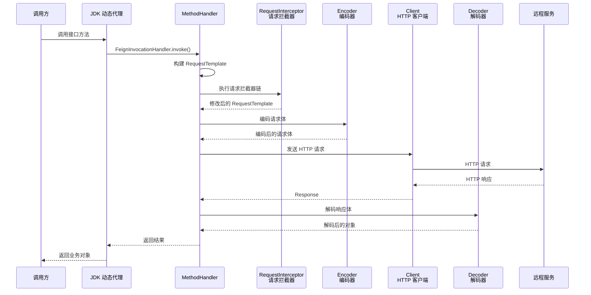

# OpenFeign 远程调用

## ⭐ 面试重点速览

| 知识模块 | 重点内容 | 面试频率 |
|----------|----------|----------|
| 动态代理原理 | JDK 动态代理 + Contract 契约解析、@FeignClient 扫描流程 | 极高 |
| 执行流程 | 请求拦截 → 编码 → 发送 HTTP → 解码 → 返回的完整链路 | 极高 |
| 超时与重试 | connectTimeout / readTimeout 配置、Retryer 重试机制 | 高 |
| 拦截器与日志 | RequestInterceptor 统一处理、四种日志级别 | 高 |
| Sentinel 集成 | fallback vs fallbackFactory 差异、熔断降级策略 | 极高 |
| 性能优化 | HttpClient 5 / OkHttp 连接池、GZIP 压缩、异步调用 | 中高 |

---

## 一、⭐ Feign 动态代理原理

### 1.1 什么是 Feign？

Feign 是一个**声明式 HTTP 客户端**，只需定义接口并添加注解，即可像调用本地方法一样发起远程调用，无需手动拼接 URL、构造请求体：

```java
// 只需定义接口，无需写实现类
@FeignClient(name = "user-service", path = "/users")
public interface UserClient {

    @GetMapping("/{id}")
    UserDto getUserById(@PathVariable("id") Long id);

    @PostMapping
    UserDto createUser(@RequestBody UserDto user);
}

// 调用方 —— 像调用本地方法一样使用
@Service
@RequiredArgsConstructor
public class OrderService {
    private final UserClient userClient;

    public OrderDto getOrderDetail(Long orderId) {
        Order order = orderDao.findById(orderId);
        UserDto user = userClient.getUserById(order.getUserId()); // 声明式调用
        return OrderDto.of(order, user);
    }
}
```

### 1.2 ⭐ JDK 动态代理核心流程

Feign 的核心是利用 **JDK 动态代理**，在运行时为 `@FeignClient` 注解的接口生成代理对象，将方法调用转化为 HTTP 请求：

```mermaid
graph TD
    A[@FeignClient 接口定义] --> B[FeignClientsRegistrar<br/>扫描 @FeignClient 注解]
    B --> C[生成 FeignClientFactoryBean<br/>每个 @FeignClient 对应一个 FactoryBean]
    C --> D[Feign.Builder 构建 Feign 实例]
    D --> E[Contract 契约解析<br/>解析 @RequestMapping/@GetMapping 等注解]
    E --> F[生成 MethodHandler<br/>每个方法对应一个 MethodHandler]
    F --> G[JDK 动态代理<br/>Proxy.newProxyInstance 创建代理对象]
    G --> H[方法调用时 → MethodHandler.invoke]
    H --> I[构造 RequestTemplate → 编码器编码 → 发送 HTTP]
    I --> J[解码器解码响应 → 返回结果]
```

### 1.3 源码级解析：代理对象是如何创建的？

```java
// Feign 核心构建流程（简化版源码）
public abstract class Feign {

    public <T> T target(Target<T> target) {
        return build().newInstance(target);
    }

    public <T> T newInstance(Target<T> target) {
        // 步骤 1：通过 Contract 解析接口方法，生成 MethodMetadata
        Map<String, MethodHandler> nameToHandler = targetToHandlersByName.apply(target);

        // 步骤 2：创建 InvocationHandler
        InvocationHandler handler = new ReflectiveFeign.FeignInvocationHandler(target, nameToHandler);

        // 步骤 3：JDK 动态代理创建代理对象
        T proxy = (T) Proxy.newProxyInstance(
            target.type().getClassLoader(),   // 类加载器
            new Class<?>[]{target.type()},    // 接口数组
            handler                            // InvocationHandler
        );
        return proxy;
    }
}
```

**FeignInvocationHandler 核心逻辑**：

```java
// 当调用代理对象的方法时，实际执行的是此 Handler
public class FeignInvocationHandler implements InvocationHandler {

    // 方法名 -> MethodHandler 的映射
    private final Map<Method, MethodHandler> dispatch;

    @Override
    public Object invoke(Object proxy, Method method, Object[] args) throws Throwable {
        // 排除 Object 基础方法（equals / hashCode / toString）
        if (method.getDeclaringClass() == Object.class) {
            return method.invoke(this, args);
        }

        // 关键：根据方法名查找到对应的 MethodHandler，执行 HTTP 请求
        return dispatch.get(method).invoke(args);
    }
}
```

### 1.4 Contract 契约解析

`Contract` 是 Feign 的**注解解析器**，负责将 Spring MVC 注解（`@RequestMapping`、`@GetMapping`、`@PathVariable` 等）解析为 Feign 内部的 `MethodMetadata`：

```java
// Spring Cloud OpenFeign 使用 SpringMvcContract 解析 Spring MVC 注解
public class SpringMvcContract extends Contract.BaseContract {

    @Override
    protected void processAnnotationOnMethod(
            MethodMetadata data, Annotation methodAnnotation, Method method) {
        // 解析 @RequestMapping / @GetMapping / @PostMapping 等
        if (RequestMapping.class.isInstance(methodAnnotation)) {
            RequestMapping requestMapping = (RequestMapping) methodAnnotation;
            // 提取 HTTP 方法
            data.template().method(Request.HttpMethod.valueOf(
                requestMapping.method()[0].name()));
            // 提取 URL 路径
            String path = requestMapping.value()[0];
            data.template().uri(path);
            // 提取 Produces / Consumes
            // ...
        }
    }

    @Override
    protected void processAnnotationOnParameter(
            MethodMetadata data, Annotation[] annotations, int paramIndex) {
        // 解析 @PathVariable、@RequestParam、@RequestBody、@RequestHeader 等
        for (Annotation annotation : annotations) {
            if (annotation instanceof PathVariable) {
                // 将参数名加入模板变量列表
                String varName = ((PathVariable) annotation).value();
                data.indexToVariableName().put(paramIndex, varName);
            }
            // ...
        }
    }
}
```

::: tip 为什么 Feign 支持 Spring MVC 注解？
Feign 原生有自己的注解体系（`@RequestLine`、`@Param` 等），Spring Cloud OpenFeign 通过 `SpringMvcContract` 将 Spring MVC 注解"翻译"成 Feign 内部能理解的 `MethodMetadata`。这样开发者无需学习两套注解，直接复用 Spring MVC 的注解即可。
:::

### 1.5 @FeignClient 扫描与注册

```java
// FeignClientsRegistrar 负责扫描并注册 @FeignClient
// 核心流程（简化版）
class FeignClientsRegistrar implements ImportBeanDefinitionRegistrar {

    @Override
    public void registerBeanDefinitions(AnnotationMetadata metadata, BeanDefinitionRegistry registry) {
        // 1. 扫描所有 @FeignClient 注解
        Map<String, Object> attrs = metadata.getAnnotationAttributes(FeignClient.class.getName());
        String name = (String) attrs.get("name");       // 服务名
        String url = (String) attrs.get("url");          // 直连 URL（可选）
        String path = (String) attrs.get("path");        // 统一路径前缀
        Class<?> fallback = (Class<?>) attrs.get("fallback");
        Class<?> fallbackFactory = (Class<?>) attrs.get("fallbackFactory");

        // 2. 为每个 @FeignClient 注册 FeignClientFactoryBean
        BeanDefinitionBuilder builder = BeanDefinitionBuilder
            .genericBeanDefinition(FeignClientFactoryBean.class);
        builder.addPropertyValue("name", name);
        builder.addPropertyValue("url", url);
        builder.addPropertyValue("path", path);
        // ...

        registry.registerBeanDefinition(name + ".FeignClientSpecification", builder.getBeanDefinition());
    }
}
```

::: warning 注意：@EnableFeignClients 必须存在
`@EnableFeignClients` 注解导入了 `FeignClientsRegistrar`，这是 Feign 扫描的入口。**Spring Boot 的自动配置不会自动扫描 @FeignClient**，必须在启动类或配置类上添加 `@EnableFeignClients`。
:::

---

## 二、Feign 的执行流程

### 2.1 完整请求链路



### 2.2 MethodHandler 核心执行逻辑

```java
// SynchronousMethodHandler —— Feign 方法调用的核心实现
public class SynchronousMethodHandler implements MethodHandler {

    private final MethodMetadata metadata;          // 方法元数据
    private final Target<?> target;                 // 目标信息（URL / 服务名）
    private final Client client;                    // HTTP 客户端
    private final Encoder encoder;                  // 请求编码器
    private final Decoder decoder;                  // 响应解码器
    private final RequestInterceptor interceptor;   // 请求拦截器
    private final Retryer retryer;                  // 重试器

    @Override
    public Object invoke(Object[] argv) throws Throwable {
        // 步骤 1：根据方法元数据和参数构建 RequestTemplate
        RequestTemplate template = buildTemplateFromArgs(argv);

        // 步骤 2：执行请求拦截器（可修改 header、参数等）
        interceptor.apply(template);

        // 步骤 3：编码请求体（将 Java 对象转为 JSON / XML）
        Request request = target.apply(template);

        // 步骤 4：结合重试器发送 HTTP 请求
        Response response = retryer.continueOrPropagate(e -> {
            return client.execute(request, options);
        });

        // 步骤 5：解码响应体（将 JSON / XML 转为 Java 对象）
        return decoder.decode(response, metadata.returnType());
    }
}
```

### 2.3 请求拦截器（RequestInterceptor）

`RequestInterceptor` 是 Feign 最常用的扩展点，可以在请求发送前**统一处理请求头、认证信息、链路追踪 ID** 等：

```java
// 自定义请求拦截器：为每个 Feign 请求添加认证 Token 和 TraceId
@Component
public class FeignAuthInterceptor implements RequestInterceptor {

    @Override
    public void apply(RequestTemplate template) {
        // 从当前请求上下文获取认证信息
        ServletRequestAttributes attributes = 
            (ServletRequestAttributes) RequestContextHolder.getRequestAttributes();
        if (attributes != null) {
            HttpServletRequest request = attributes.getRequest();
            // 透传认证 Token
            String token = request.getHeader("Authorization");
            if (token != null) {
                template.header("Authorization", token);
            }
            // 透传链路追踪 ID
            String traceId = request.getHeader("X-Trace-Id");
            if (traceId != null) {
                template.header("X-Trace-Id", traceId);
            }
        }
    }
}
```

::: tip 典型应用场景
| 场景 | 拦截器处理内容 |
|------|---------------|
| 认证透传 | 从当前请求中提取 Token，设置到 Feign 请求头 |
| 链路追踪 | 透传 TraceId / SpanId，实现全链路日志关联 |
| 灰度发布 | 添加灰度标签 header，路由到灰度实例 |
| 通用参数 | 添加客户端版本号、平台标识等 |
:::

### 2.4 编码器（Encoder）与解码器（Decoder）

Feign 默认使用 Spring MVC 的 `HttpMessageConverter` 进行编解码，支持 JSON、XML、表单等格式：

```java
// 自定义编码器：处理特殊请求格式
@Configuration
public class FeignEncoderConfig {

    @Bean
    public Encoder feignEncoder() {
        // 默认使用 SpringEncoder（基于 Jackson）
        return new SpringEncoder(() -> new HttpMessageConverters(
            new MappingJackson2HttpMessageConverter()
        ));
    }
}

// 自定义解码器：处理特殊响应格式
@Configuration
public class FeignDecoderConfig {

    @Bean
    public Decoder feignDecoder() {
        // 默认使用 SpringDecoder（基于 Jackson）
        return new SpringDecoder(() -> new HttpMessageConverters(
            new MappingJackson2HttpMessageConverter()
        ));
    }
}
```

---

## 三、超时配置与重试机制

### 3.1 超时配置

Feign 的超时包含两个维度：**连接超时**（建立连接的时间）和**读取超时**（等待响应数据的时间）：

```yaml
# 全局超时配置（对所有 Feign 客户端生效）
spring:
  cloud:
    openfeign:
      client:
        config:
          default:
            connectTimeout: 5000      # 连接超时，单位毫秒，默认 10s
            readTimeout: 10000        # 读取超时，单位毫秒，默认 60s
```

```yaml
# 针对特定服务的超时配置
spring:
  cloud:
    openfeign:
      client:
        config:
          user-service:               # 服务名
            connectTimeout: 3000
            readTimeout: 5000
          order-service:              # 另一个服务
            connectTimeout: 10000
            readTimeout: 30000
```

```java
// 代码级超时配置（通过 Request.Options）
@Configuration
public class FeignTimeoutConfig {

    @Bean
    public Request.Options options() {
        return new Request.Options(
            5, TimeUnit.SECONDS,      // connectTimeout
            10, TimeUnit.SECONDS,     // readTimeout
            true                       // followRedirects
        );
    }
}
```

::: danger 超时配置的优先级
超时配置的优先级从高到低：
1. 代码级 `Request.Options` Bean（**最高优先级**）
2. `application.yml` 中对特定服务的配置
3. `application.yml` 中 `default` 全局配置
4. Feign 默认值（connectTimeout=10s, readTimeout=60s）
:::

### 3.2 重试机制（Retryer）

Feign 内置了重试机制，默认**不重试**（`Retryer.NEVER_RETRY`）：

```java
// 自定义 Retryer：最多重试 3 次，间隔 100ms，最大间隔 1s
@Configuration
public class FeignRetryConfig {

    @Bean
    public Retryer retryer() {
        return new Retryer.Default(
            100,                      // 初始间隔（毫秒）
            TimeUnit.SECONDS.toMillis(1), // 最大间隔（毫秒）
            3                         // 最大重试次数
        );
    }
}
```

::: warning 重试机制的注意事项
- **幂等性**：重试仅适用于 GET 等幂等请求。POST 请求默认不重试，否则可能造成重复创建数据
- **超时关系**：总耗时 = 重试次数 * (connectTimeout + readTimeout)，需合理设置
- **与 Ribbon 重试的区别**：Feign 的 Retryer 是客户端层面的重试，Ribbon 的重试可以跨实例（已废弃）
- **推荐做法**：生产环境优先使用 Sentinel/Resilience4j 的熔断重试，而非 Feign 内置 Retryer
:::

### 3.3 超时重试完整示例

```java
@FeignClient(
    name = "user-service",
    configuration = UserServiceFeignConfig.class
)
public interface UserClient {
    @GetMapping("/users/{id}")
    UserDto getUserById(@PathVariable("id") Long id);
}

@Configuration
public class UserServiceFeignConfig {

    // 超时配置
    @Bean
    public Request.Options options() {
        return new Request.Options(3, TimeUnit.SECONDS, 5, TimeUnit.SECONDS, true);
    }

    // 重试配置：重试 2 次，间隔从 500ms 开始，最大 2s
    @Bean
    public Retryer retryer() {
        return new Retryer.Default(500, 2000, 2);
    }
}
```

---

## 四、拦截器（RequestInterceptor）与日志配置

### 4.1 拦截器链

Feign 支持配置**多个拦截器**，按顺序组成拦截器链：

```java
// 拦截器 1：认证 Token 透传
@Component
public class AuthInterceptor implements RequestInterceptor {
    @Override
    public void apply(RequestTemplate template) {
        // 从 SecurityContext 获取 Token
        Authentication auth = SecurityContextHolder.getContext().getAuthentication();
        if (auth != null && auth.getCredentials() instanceof String) {
            template.header("Authorization", "Bearer " + auth.getCredentials());
        }
    }
}

// 拦截器 2：链路追踪透传
@Component
public class TraceInterceptor implements RequestInterceptor {
    @Override
    public void apply(RequestTemplate template) {
        // 从 Tracer（如 SkyWalking）获取 TraceId
        String traceId = MDC.get("traceId");
        if (traceId != null) {
            template.header("X-Trace-Id", traceId);
        }
    }
}

// 拦截器 3：客户端信息透传
@Component
public class ClientInfoInterceptor implements RequestInterceptor {
    @Override
    public void apply(RequestTemplate template) {
        template.header("X-Client-Version", "1.0.0");
        template.header("X-Client-Name", "order-service");
    }
}
```

### 4.2 四种日志级别

Feign 提供了四种日志级别，用于调试和排查问题：

| 级别 | 说明 | 输出内容 |
|------|------|----------|
| **NONE**（默认） | 不记录日志 | 无 |
| **BASIC** | 仅记录请求方法和 URL，以及响应状态码和执行时间 | `GET http://user-service/users/1 200 145ms` |
| **HEADERS** | 记录 BASIC + 请求和响应头 | 以上 + header 信息 |
| **FULL** | 记录 HEADERS + 请求体和响应体 | 所有信息，包括 body |

```yaml
# 全局日志级别配置
logging:
  level:
    com.example.feign.UserClient: DEBUG    # Feign 日志需要 DEBUG 级别

spring:
  cloud:
    openfeign:
      client:
        config:
          default:
            loggerLevel: BASIC              # 默认建议 BASIC
          user-service:
            loggerLevel: FULL               # 特定服务可开启 FULL 调试
```

```java
// 代码级日志配置
@Configuration
public class FeignLogConfig {

    @Bean
    public Logger.Level feignLoggerLevel() {
        return Logger.Level.FULL;           // 开发调试时开启 FULL
    }
}
```

::: danger 生产环境日志级别建议
- **生产环境**：使用 `BASIC` 或 `HEADERS`，避免打印请求体导致性能下降和敏感信息泄露
- **调试环境**：使用 `FULL`，便于排查问题
- 日志级别 `DEBUG` 必须开启，否则 Feign Logger 不生效
:::

---

## 五、Feign + Sentinel 集成实现熔断

### 5.1 Sentinel 简介

Sentinel 是阿里巴巴开源的**流量控制组件**，提供流量控制、熔断降级、系统负载保护等功能。与 Feign 集成后，可以自动为 Feign 接口添加熔断保护。

```xml
<!-- 引入 Sentinel 和 Feign 集成依赖 -->
<dependency>
    <groupId>com.alibaba.cloud</groupId>
    <artifactId>spring-cloud-starter-alibaba-sentinel</artifactId>
</dependency>
```

```yaml
# 开启 Feign 对 Sentinel 的支持
spring:
  cloud:
    sentinel:
      transport:
        dashboard: localhost:8080  # Sentinel 控制台地址
feign:
  sentinel:
    enabled: true                  # 开启 Feign Sentinel 整合
```

### 5.2 fallback：简单降级

`fallback` 适用于**不需要获取异常信息**的场景，提供一个降级实现类：

```java
// 步骤 1：定义 Feign 接口，指定 fallback
@FeignClient(
    name = "user-service",
    fallback = UserClientFallback.class  // 降级实现类
)
public interface UserClient {

    @GetMapping("/users/{id}")
    UserDto getUserById(@PathVariable("id") Long id);

    @PostMapping("/users")
    Result<UserDto> createUser(@RequestBody UserDto user);
}

// 步骤 2：实现降级逻辑（需实现原接口 + 注册为 Spring Bean）
@Component
public class UserClientFallback implements UserClient {

    @Override
    public UserDto getUserById(Long id) {
        // 降级逻辑：返回兜底数据
        UserDto fallback = new UserDto();
        fallback.setId(id);
        fallback.setNickname("用户信息获取失败");
        return fallback;
    }

    @Override
    public Result<UserDto> createUser(UserDto user) {
        return Result.error("用户服务不可用，创建失败");
    }
}
```

### 5.3 ⭐ fallbackFactory：捕获异常

`fallbackFactory` 可以**获取到触发熔断的具体异常信息**，便于日志记录和差异化降级：

```java
// 步骤 1：定义 Feign 接口，指定 fallbackFactory
@FeignClient(
    name = "user-service",
    fallbackFactory = UserClientFallbackFactory.class  // 降级工厂
)
public interface UserClient {

    @GetMapping("/users/{id}")
    UserDto getUserById(@PathVariable("id") Long id);

    @PostMapping("/users")
    Result<UserDto> createUser(@RequestBody UserDto user);
}

// 步骤 2：实现 FallbackFactory（注意泛型）
@Component
@Slf4j
public class UserClientFallbackFactory implements FallbackFactory<UserClient> {

    @Override
    public UserClient create(Throwable cause) {
        // 记录异常日志，便于排查问题
        log.error("user-service 远程调用失败，触发降级", cause);

        return new UserClient() {
            @Override
            public UserDto getUserById(Long id) {
                // 可基于异常类型做差异化处理
                if (cause instanceof TimeoutException) {
                    log.warn("user-service 调用超时");
                } else if (cause instanceof ConnectException) {
                    log.warn("user-service 连接失败");
                }
                UserDto fallback = new UserDto();
                fallback.setId(id);
                fallback.setNickname("用户信息暂时不可用");
                return fallback;
            }

            @Override
            public Result<UserDto> createUser(UserDto user) {
                return Result.error("用户服务暂时不可用");
            }
        };
    }
}
```

### 5.4 fallback vs fallbackFactory 对比

| 维度 | fallback | fallbackFactory |
|------|----------|-----------------|
| 异常信息 | **无法获取**异常详情 | **可以获取** Throwable 异常 |
| 差异化处理 | 不支持 | 可根据异常类型差异化降级 |
| 实现复杂度 | 简单，只需实现接口 | 稍复杂，需实现 FallbackFactory |
| 适用场景 | 简单的兜底逻辑 | 需记录日志或区分异常类型 |
| 推荐度 | 一般 | ⭐⭐⭐ 推荐 |

::: tip 最佳实践
生产环境**强烈推荐使用 fallbackFactory**，原因：
1. 可以记录异常日志，便于排查问题
2. 可以根据异常类型做差异化处理（超时 vs 连接失败 vs 业务异常）
3. fallback 无法感知异常，一旦降级你完全不知道发生了什么
:::

### 5.5 Sentinel 规则配置示例

```java
// 通过 Sentinel 控制台或代码配置熔断规则
@Configuration
public class SentinelRuleConfig implements CommandLineRunner {

    @Override
    public void run(String... args) {
        // 初始化熔断规则
        initDegradeRule("user-service");
        initFlowRule("user-service");
    }

    // 熔断降级规则：异常比例超过 50% 时熔断
    private void initDegradeRule(String resource) {
        List<DegradeRule> rules = new ArrayList<>();
        DegradeRule rule = new DegradeRule(resource)
            .setGrade(RuleConstant.DEGRADE_GRADE_EXCEPTION_RATIO) // 异常比例
            .setCount(0.5)            // 异常比例阈值 50%
            .setTimeWindow(10)        // 熔断时长 10 秒
            .setMinRequestAmount(10)  // 最小请求数 10
            .setStatIntervalMs(10000);// 统计窗口 10 秒
        rules.add(rule);
        DegradeRuleManager.loadRules(rules);
    }

    // 流量控制规则：QPS 限流
    private void initFlowRule(String resource) {
        List<FlowRule> rules = new ArrayList<>();
        FlowRule rule = new FlowRule(resource)
            .setGrade(RuleConstant.FLOW_GRADE_QPS) // QPS 模式
            .setCount(100)                          // QPS 阈值 100
            .setControlBehavior(RuleConstant.CONTROL_BEHAVIOR_DEFAULT);
        rules.add(rule);
        FlowRuleManager.loadRules(rules);
    }
}
```

---

## 六、Feign 性能优化

### 6.1 连接池替换：HttpClient 5 / OkHttp

Feign 默认使用 JDK 的 `HttpURLConnection`（每个请求新建连接，无连接池），**生产环境必须替换**：

```xml
<!-- 方案一：Apache HttpClient 5（推荐） -->
<dependency>
    <groupId>io.github.openfeign</groupId>
    <artifactId>feign-hc5</artifactId>
</dependency>
```

```yaml
# 开启 HttpClient 5
spring:
  cloud:
    openfeign:
      httpclient:
        hc5:
          enabled: true
        # 连接池配置
        max-connections: 200           # 最大连接数
        max-connections-per-route: 50  # 每个路由的最大连接数
        time-to-live: 900              # 连接存活时间（秒）
        time-to-live-unit: seconds
```

```xml
<!-- 方案二：OkHttp（性能优秀，Kotlin 友好） -->
<dependency>
    <groupId>io.github.openfeign</groupId>
    <artifactId>feign-okhttp</artifactId>
</dependency>
```

```yaml
# 开启 OkHttp
spring:
  cloud:
    openfeign:
      okhttp:
        enabled: true
```

```java
// OkHttp 连接池自定义配置
@Configuration
public class OkHttpConfig {

    @Bean
    public OkHttpClient okHttpClient() {
        return new OkHttpClient.Builder()
            .connectTimeout(3, TimeUnit.SECONDS)
            .readTimeout(5, TimeUnit.SECONDS)
            .connectionPool(new ConnectionPool(
                100,                          // 最大空闲连接数
                5, TimeUnit.MINUTES           // 空闲连接存活时间
            ))
            .addInterceptor(new LoggingInterceptor()) // 自定义拦截器
            .build();
    }
}
```

### 6.2 连接池性能对比

| HTTP 客户端 | 连接池 | 性能 | 内存占用 | 推荐场景 |
|-------------|--------|------|----------|----------|
| JDK HttpURLConnection | 无 | 最低 | 最低 | 仅开发测试 |
| Apache HttpClient 5 | 有 | 高 | 中等 | 通用生产环境 |
| OkHttp | 有 | 最高 | 中等 | 高并发、Kotlin 项目 |

::: danger 默认连接池的坑
Feign 默认使用 `HttpURLConnection`，每次请求都会**新建 TCP 连接**（三次握手），请求结束后**关闭连接**（四次挥手）。在高并发场景下，这会导致大量 TIME_WAIT 连接和端口耗尽。**生产环境必须替换为 HttpClient 5 或 OkHttp**。
:::

### 6.3 GZIP 压缩

启用 GZIP 压缩可显著减少网络传输数据量，尤其对大响应体效果明显：

```yaml
# 开启 GZIP 压缩（请求和响应双向压缩）
spring:
  cloud:
    openfeign:
      compression:
        request:
          enabled: true
          mime-types: text/xml,application/xml,application/json
          min-request-size: 2048    # 最小压缩阈值（字节）
        response:
          enabled: true
```

::: tip 压缩的适用场景
- 响应体大（> 2KB）时开启，小响应体压缩反而增加 CPU 开销
- JSON/XML 文本压缩率高（可达 70-90%），图片等二进制数据不建议压缩
- 压缩是 CPU 密集型操作，高并发下需权衡 CPU 和带宽
:::

### 6.4 异步调用

对于非核心链路或可并行的调用，可使用异步方式提升吞吐量：

```java
// 方案一：使用 @Async + CompletableFuture
@FeignClient(name = "user-service")
public interface UserClient {

    @GetMapping("/users/{id}")
    CompletableFuture<UserDto> getUserByIdAsync(@PathVariable("id") Long id);
}

@Service
public class OrderService {
    private final UserClient userClient;
    private final ProductClient productClient;

    // 并行调用多个服务，减少总耗时
    public OrderDetailDto getOrderDetail(Long orderId) {
        CompletableFuture<UserDto> userFuture = userClient.getUserByIdAsync(userId);
        CompletableFuture<ProductDto> productFuture = productClient.getProductByIdAsync(productId);

        // 所有异步调用完成后组合结果
        CompletableFuture.allOf(userFuture, productFuture).join();

        return OrderDetailDto.of(
            userFuture.getNow(null),
            productFuture.getNow(null)
        );
    }
}
```

```java
// 方案二：使用响应式 WebClient 替代 Feign（响应式全链路）
@Service
public class ReactiveOrderService {

    private final WebClient webClient;

    public Mono<OrderDetailDto> getOrderDetail(Long orderId) {
        Mono<UserDto> userMono = webClient.get()
            .uri("http://user-service/users/{id}", userId)
            .retrieve()
            .bodyToMono(UserDto.class);

        Mono<ProductDto> productMono = webClient.get()
            .uri("http://product-service/products/{id}", productId)
            .retrieve()
            .bodyToMono(ProductDto.class);

        return Mono.zip(userMono, productMono)
            .map(tuple -> OrderDetailDto.of(tuple.getT1(), tuple.getT2()));
    }
}
```

### 6.5 性能优化汇总

| 优化项 | 默认值 | 推荐值 | 提升效果 |
|--------|--------|--------|----------|
| HTTP 客户端 | HttpURLConnection | HttpClient 5 / OkHttp | 连接复用，性能提升 3-5 倍 |
| 连接池大小 | 无 | max-connections=200 | 支撑高并发 |
| GZIP 压缩 | 关闭 | 开启（大响应体） | 减少 70-90% 传输量 |
| 日志级别 | NONE | BASIC（生产）/ FULL（调试） | 减少日志 I/O 开销 |
| 超时配置 | connect=10s, read=60s | connect=3s, read=5s | 快速失败，避免雪崩 |
| 重试机制 | 不重试 | 配合 Sentinel 熔断重试 | 避免无效重试 |

---

## ⭐ 面试高频问题汇总

### Q1：Feign 的动态代理是如何实现的？请描述完整流程。

Feign 使用 **JDK 动态代理**，核心流程如下：

1. `@EnableFeignClients` 导入 `FeignClientsRegistrar`，扫描所有 `@FeignClient` 注解
2. 为每个 `@FeignClient` 生成 `FeignClientFactoryBean`（FactoryBean）
3. `Feign.Builder` 通过 `Contract` 解析接口方法上的 Spring MVC 注解，生成 `MethodMetadata`
4. 每个方法对应一个 `MethodHandler`（`SynchronousMethodHandler`）
5. 通过 `Proxy.newProxyInstance()` 创建代理对象，绑定 `FeignInvocationHandler`
6. 方法调用时，`FeignInvocationHandler.invoke()` 根据方法名路由到对应的 `MethodHandler`，执行 HTTP 请求

**面试加分**：强调 `Contract` 的作用——将 Spring MVC 注解"翻译"成 Feign 内部的 `MethodMetadata`，使得 Feign 支持 Spring MVC 注解。

### Q2：Feign 的完整执行流程是怎样的？

```
接口方法调用 → JDK 代理拦截 → 构建 RequestTemplate → 执行 RequestInterceptor 链
→ Encoder 编码请求体 → Client 发送 HTTP 请求 → 获取响应 → Decoder 解码响应体 → 返回结果
```

关键组件及其职责：
- **RequestInterceptor**：统一修改请求（如添加认证 Token、TraceId）
- **Encoder**：将 Java 对象序列化为 JSON/XML 请求体
- **Client**：底层 HTTP 客户端（默认 HttpURLConnection，推荐替换为 HttpClient 5）
- **Decoder**：将 JSON/XML 响应体反序列化为 Java 对象
- **Retryer**：控制重试逻辑

### Q3：Feign 的超时配置有哪些层级？优先级如何？

超时配置分为四个层级，优先级从高到低：

1. **代码级 `Request.Options` Bean**（最高优先级）
2. **YAML 中特定服务配置**（`spring.cloud.openfeign.client.config.{serviceName}`）
3. **YAML 中 default 全局配置**（`spring.cloud.openfeign.client.config.default`）
4. **Feign 默认值**（connectTimeout=10s, readTimeout=60s）

注意：超时还受底层 HTTP 客户端（如 OkHttp 的 `connectTimeout`）影响，两者取最小值。

### Q4：fallback 和 fallbackFactory 有什么区别？什么时候用哪个？

| 维度 | fallback | fallbackFactory |
|------|----------|-----------------|
| 异常信息 | 无法获取 | 可获取 Throwable |
| 差异化处理 | 不支持 | 支持 |
| 复杂度 | 简单 | 稍复杂 |

**推荐 fallbackFactory**。原因：生产环境中必须记录异常日志，且需要根据异常类型做差异化处理（超时降级返回缓存数据、连接失败返回兜底数据、业务异常透传错误码）。

### Q5：Feign 有哪些性能优化手段？

核心优化手段（按重要性排序）：

1. **替换 HTTP 客户端**：从默认的 `HttpURLConnection` 替换为 `HttpClient 5` 或 `OkHttp`（启用连接池），性能提升 3-5 倍
2. **调整连接池大小**：`max-connections=200`，`max-connections-per-route=50`
3. **开启 GZIP 压缩**：对大响应体（> 2KB）开启压缩，减少 70-90% 传输量
4. **合理配置超时**：connectTimeout=3s, readTimeout=5s，快速失败
5. **日志级别设为 BASIC**：生产环境避免 FULL 级别导致的性能损耗
6. **异步调用**：非核心链路使用 `CompletableFuture` 或 `WebClient` 并行调用

### Q6：Feign 和 RestTemplate 有什么区别？什么时候用 Feign？

| 维度 | Feign | RestTemplate |
|------|-------|-------------|
| 调用方式 | 声明式（接口 + 注解） | 编程式（代码拼接 URL） |
| 代码量 | 极简 | 较多 |
| 可读性 | 高，接口即文档 | 一般 |
| 维护性 | 好，修改接口即可 | 差，需改多处 |
| 统一处理 | 拦截器统一处理 | 需手动添加 |
| 熔断集成 | 天然支持 Sentinel | 需手动实现 |

**推荐 Feign**：声明式调用更符合微服务开发理念，代码更简洁，且与 Sentinel 无缝集成。RestTemplate 仅适合简单场景或需要精细控制 HTTP 细节的场景。

### Q7：Feign 如何实现认证信息透传？

通过 `RequestInterceptor` 实现。核心思路：从当前请求上下文（`RequestContextHolder`）中获取认证信息，设置到 Feign 请求的 Header 中：

```java
@Component
public class AuthInterceptor implements RequestInterceptor {
    @Override
    public void apply(RequestTemplate template) {
        // 从 SecurityContext 或 RequestHeader 获取 Token
        String token = getTokenFromCurrentRequest();
        if (token != null) {
            template.header("Authorization", "Bearer " + token);
        }
    }
}
```

这样无需在每个 Feign 接口方法上手动添加 `@RequestHeader` 注解。

---

## 面试追问环节

**Q：Feign 调用底层走的是 HTTP/1.1 还是 HTTP/2？能升级吗？**

Feign 默认使用 HTTP/1.1。如果底层 HTTP 客户端支持 HTTP/2（如 OkHttp 配置 `protocols(Protocol.H2_PRIOR_KNOWLEDGE)`），则可以升级。但需要注意：**服务端也必须支持 HTTP/2**。在微服务内部，HTTP/2 的多路复用可以显著减少连接数，提升性能。

**Q：如果 Feign 接口返回的是流式数据（如大文件下载），该怎么处理？**

Feign 默认会将整个响应体加载到内存中反序列化，不适合流式处理。解决方案：
1. 返回类型改为 `feign.Response`，手动处理流
2. 使用 `WebClient` 替代 Feign，支持响应式流
3. 大文件下载场景建议使用专门的 OSS/COS 存储，Feign 只传递下载 URL

**Q：如何在 Feign 调用时传递自定义请求上下文（如灰度标签）？**

三种方式：
1. **RequestInterceptor**：在线程本地变量（ThreadLocal/TransmittableThreadLocal）中存储上下文，拦截器读取并设置到 Header
2. **@RequestHeader**：方法参数上显式传递
3. **Feign RequestInterceptor + Hystrix/Sentinel 的并发策略**：确保线程池切换时上下文不丢失（使用 `TransmittableThreadLocal` 或 `HystrixRequestVariableDefault`）