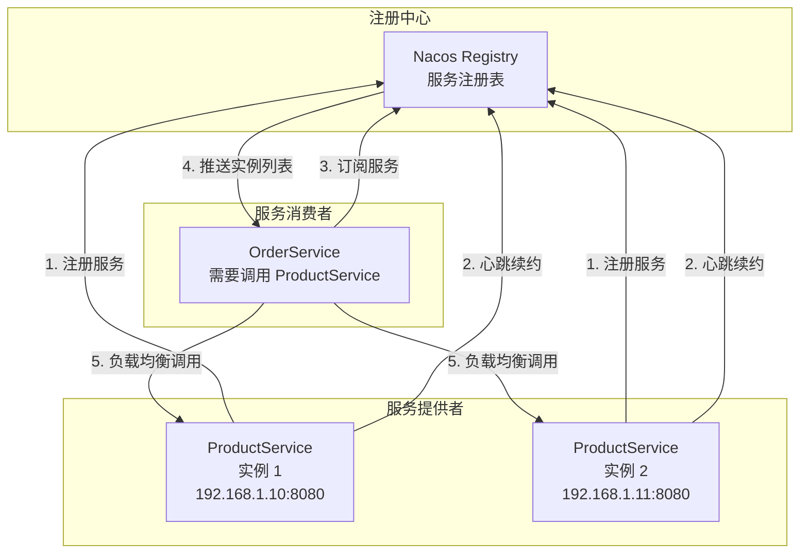
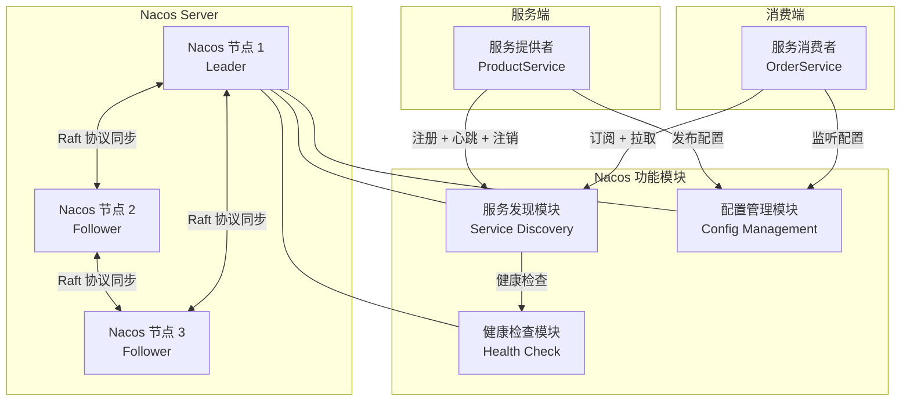
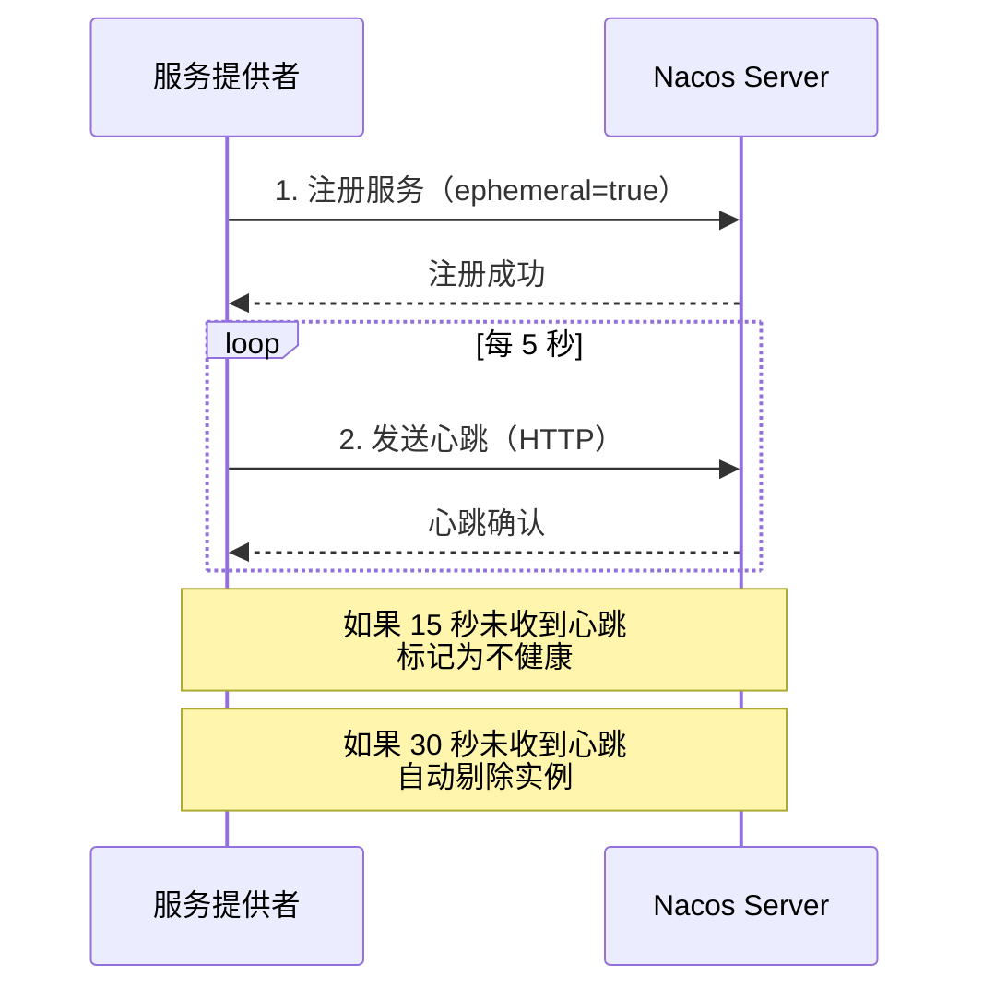
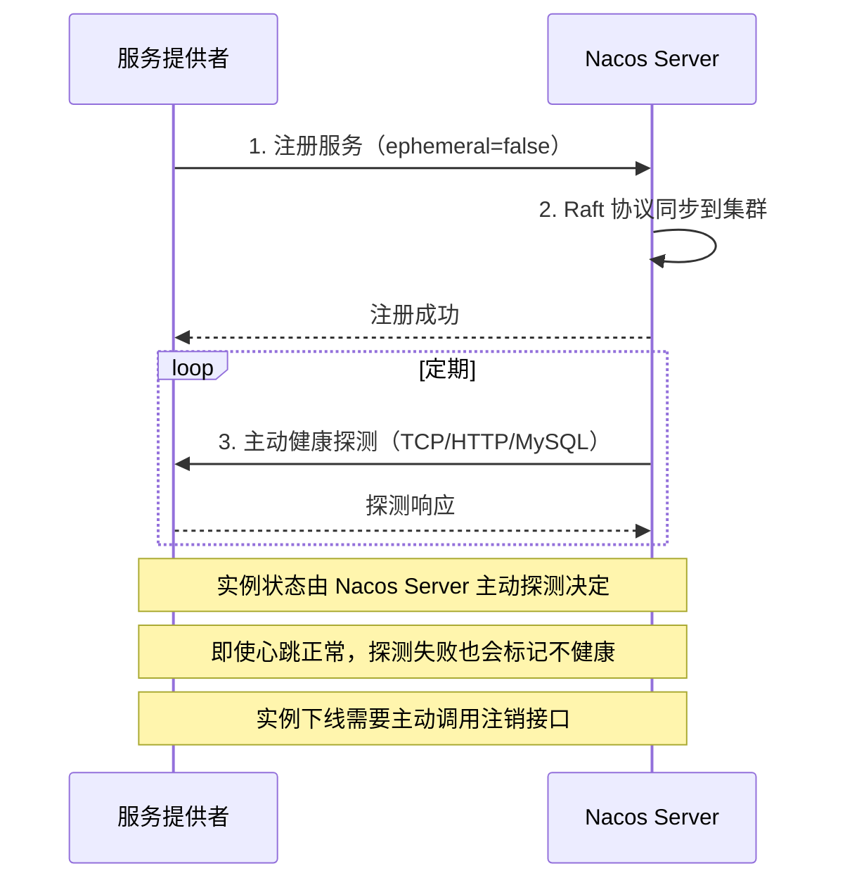
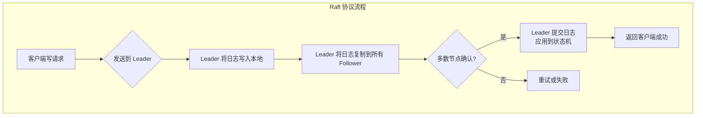
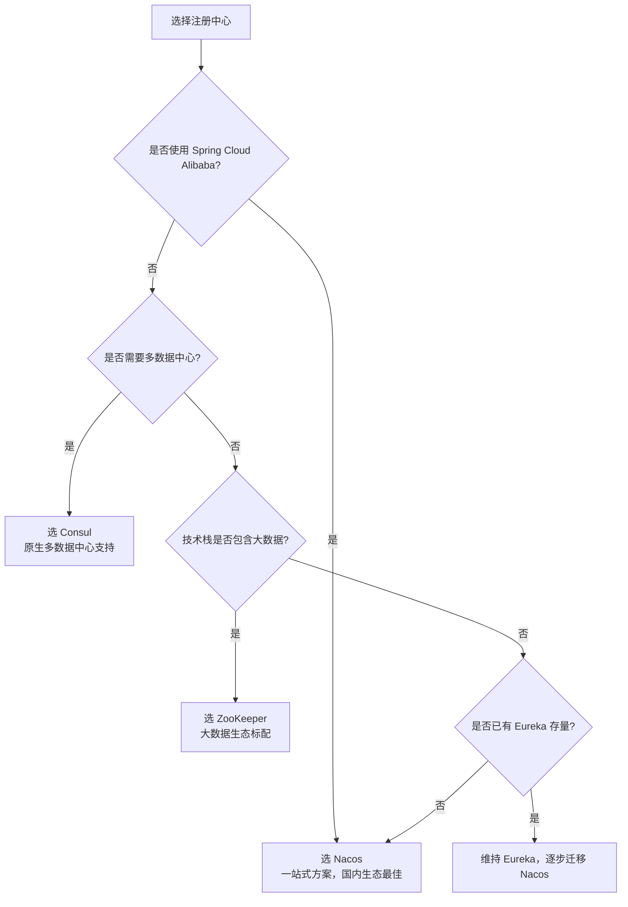
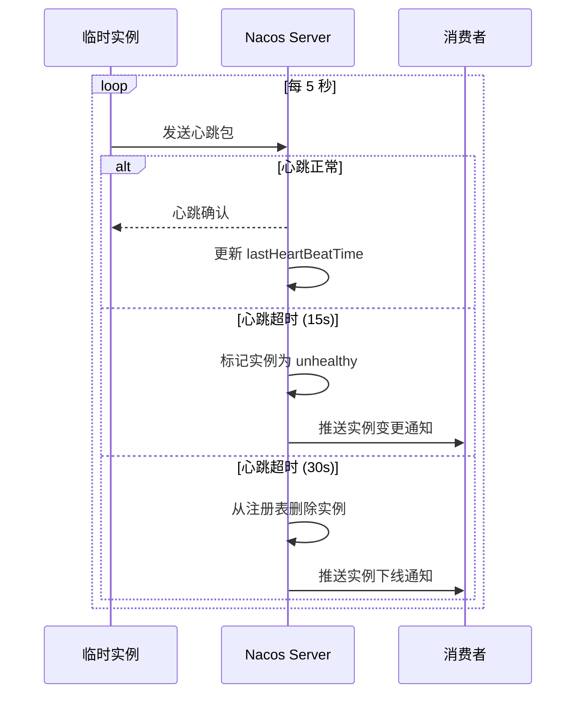
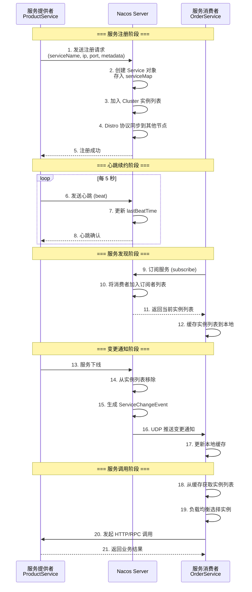
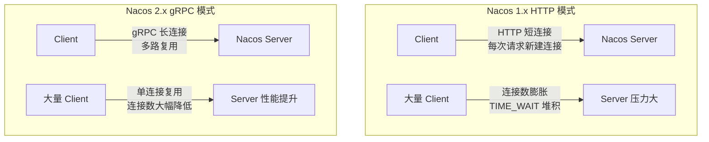
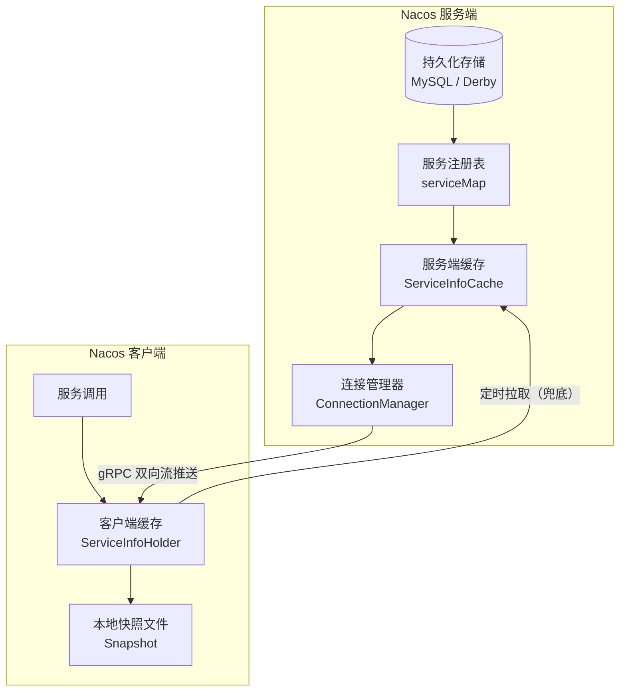

# 服务注册与发现

## ⭐ 面试重点速览

| 知识模块 | 重点内容 | 面试频率 |
|----------|----------|----------|
| Nacos 核心功能 | 服务发现 + 配置中心，一站式微服务治理方案 | 极高 |
| AP vs CP 模式 | 临时实例 vs 持久实例，CAP 理论取舍，Raft 协议 | 极高 |
| 注册中心对比 | Nacos vs Eureka vs Consul vs ZooKeeper（CAP / 协议 / 健康检查） | 极高 |
| 健康检查机制 | 临时实例心跳 vs 持久实例主动探测，保护阈值 | 高 |
| 服务注册发现流程 | 完整时序图，服务端缓存、客户端缓存机制 | 高 |
| Nacos 2.x 新特性 | gRPC 通信、双层缓存、性能提升 | 中高 |
| 自我保护机制 | 心跳保护阈值、CAP 模式切换 | 中 |

---

## 一、为什么需要服务注册与发现？

### 1.1 问题背景

在微服务架构中，服务实例的数量和网络位置是动态变化的。服务可能因为扩容、缩容、故障、滚动更新等原因频繁上下线，如果服务消费者硬编码调用地址，将无法应对这种动态性。

```java
// 传统方式 —— 硬编码服务地址，完全不可行
@Service
public class OrderService {
    // ⚠ 问题：如果 product-service 的 IP 或端口变了，必须修改代码重新部署
    private static final String PRODUCT_URL = "http://192.168.1.100:8080/product";

    public ProductDTO getProduct(Long id) {
        return restTemplate.getForObject(PRODUCT_URL + "/" + id, ProductDTO.class);
    }
}
```

::: danger 硬编码的致命问题
1. **地址变更**：IP 或端口变化需要修改代码
2. **负载均衡**：无法在多个实例之间分发请求
3. **故障转移**：实例宕机无法自动切换到其他实例
4. **动态扩缩**：新增实例无法被自动发现
:::

### 1.2 服务注册与发现模式



**核心流程**：
1. **注册**：服务提供者启动时向注册中心注册自己的网络位置（IP + 端口 + 元数据）
2. **心跳**：服务提供者定期向注册中心发送心跳，证明自己还活着
3. **订阅**：服务消费者从注册中心获取服务提供者的实例列表
4. **推送**：当服务实例列表发生变化时，注册中心主动推送更新给消费者
5. **调用**：消费者通过负载均衡策略选择一个实例发起远程调用

---

## 二、⭐ Nacos 核心功能

### 2.1 Nacos 是什么？

**Nacos（Dynamic Naming and Configuration Service）** 是阿里巴巴开源的一个更易于构建云原生应用的动态服务发现、配置管理和服务管理平台。它是 Spring Cloud Alibaba 的核心组件。

::: tip Nacos = Naming（命名服务） + Configuration（配置服务）
Nacos 提供两大核心功能：**服务发现**和**配置管理**，无需单独部署 Eureka + Config 两套组件，实现一站式微服务治理。
:::

### 2.2 Nacos 架构概览



### 2.3 快速上手

```java
// 服务提供者 —— 注册到 Nacos
@SpringBootApplication
@EnableDiscoveryClient
public class ProductApplication {
    public static void main(String[] args) {
        SpringApplication.run(ProductApplication.class, args);
    }
}
```

```yaml
# 服务提供者配置
spring:
  application:
    name: product-service        # 服务名（唯一标识）
  cloud:
    nacos:
      discovery:
        server-addr: 127.0.0.1:8848   # Nacos 地址
        namespace: dev                 # 命名空间（环境隔离）
        group: DEFAULT_GROUP           # 分组
        ephemeral: true                # true=临时实例(AP)，false=持久实例(CP)
```

```java
// 服务消费者 —— 通过 Feign 调用
@FeignClient(name = "product-service")  // 服务名与注册一致
public interface ProductClient {
    @GetMapping("/product/{id}")
    ProductDTO getById(@PathVariable Long id);
}
```

---

## 三、⭐ AP 模式 vs CP 模式

### 3.1 CAP 理论回顾

::: danger 面试必考：CAP 理论
CAP 理论指出，分布式系统无法同时满足以下三个特性，最多只能同时满足两个：

| 特性 | 含义 | 牺牲后果 |
|------|------|----------|
| **C（Consistency）** | 一致性：所有节点在同一时刻看到相同数据 | 牺牲可用性 |
| **A（Availability）** | 可用性：每个请求都能获得非错误响应 | 可能返回旧数据 |
| **P（Partition Tolerance）** | 分区容错性：网络分区时系统仍能正常工作 | 分布式系统必须满足 |
:::

在分布式系统中，P（分区容错性）是必须满足的（网络故障不可避免），因此只能在 C 和 A 之间做取舍。

### 3.2 Nacos 的双模式支持

Nacos 是唯一同时支持 **AP 模式**和 **CP 模式**的注册中心，通过 `ephemeral` 参数控制：

```yaml
spring:
  cloud:
    nacos:
      discovery:
        ephemeral: true   # true = 临时实例 → AP 模式
        ephemeral: false  # false = 持久实例 → CP 模式
```

#### 临时实例（AP 模式）



**特点**：
- 服务实例主动发送心跳维持注册
- 心跳超时后自动剔除，无需人工干预
- 保证可用性优先（AP），可能短暂返回已下线实例
- 适用于**大多数微服务场景**

#### 持久实例（CP 模式）



**特点**：
- Nacos Server 主动探测实例健康状态
- 实例下线后不会自动剔除，需要手动注销
- 保证一致性优先（CP），通过 Raft 协议保证数据一致性
- 适用于**对数据一致性要求较高的场景**（如 DNS、CoreDNS 场景）

### 3.3 Raft 协议简述

Nacos 在 CP 模式下使用 **Raft 协议** 保证集群数据一致性：



**Raft 关键概念**：

| 概念 | 说明 |
|------|------|
| **Leader** | 集群唯一领导者，处理所有写请求，通过选举产生 |
| **Follower** | 跟随者，被动接收 Leader 的日志复制 |
| **Candidate** | 候选人，选举过程中的临时状态 |
| **Term** | 任期，逻辑时钟，每次选举 Term+1 |
| **Heartbeat** | Leader 定期向 Follower 发送心跳，维持领导地位 |

::: tip 为什么 Nacos 选择 Raft 而不是 Paxos？
Raft 协议相比 Paxos 更易于理解和实现，核心思想是"Leader 选举 + 日志复制"，通过强领导者模型简化一致性保证。Nacos 的 CP 模式实现基于 SOFA-JRaft（蚂蚁金服开源的 Raft 实现）。
:::

---

## 四、⭐ Nacos vs Eureka vs Consul vs ZooKeeper 对比

### 4.1 综合对比表

| 对比维度 | Nacos | Eureka | Consul | ZooKeeper |
|----------|-------|--------|--------|-----------|
| **CAP 模型** | AP + CP（可切换） | AP | CP | CP |
| **一致性协议** | Distro(AP) / Raft(CP) | 无（Peer to Peer 复制） | Raft | ZAB（类 Paxos） |
| **健康检查** | 心跳 + 主动探测（TCP/HTTP/MySQL） | 心跳（可配置） | TCP/HTTP/gRPC + Script | Keep Alive 长连接 |
| **多数据中心** | 支持（namespace 隔离） | 支持（Region/Zone） | 原生支持多数据中心 | 不支持 |
| **配置中心** | 内置，功能完善 | 无（需配合 Spring Cloud Config） | 内置 KV 存储 | 可用作配置中心（但非最佳实践） |
| **雪崩保护** | 支持（保护阈值 0-1） | 支持（自我保护模式） | 不支持 | 不支持 |
| **多语言 SDK** | Java / Go / Python / Node.js / C++ | Java（官方）；社区提供其他语言 | Go / Java / Python / .NET | Java（官方）；社区提供其他语言 |
| **管理界面** | 完善的 Web 控制台 | 基础 Web 控制台 | 完善的 Web 控制台 | 需第三方工具（如 ZooNavigator） |
| **社区活跃度** | ⭐⭐⭐⭐⭐ 非常活跃 | ⭐⭐ 已停更（2.x 进入维护模式） | ⭐⭐⭐⭐ 活跃 | ⭐⭐⭐⭐ 活跃 |
| **Spring Cloud 集成** | spring-cloud-starter-alibaba-nacos-discovery | spring-cloud-starter-netflix-eureka-server | spring-cloud-starter-consul-discovery | spring-cloud-starter-zookeeper-discovery |
| **学习成本** | 中 | 低 | 中高 | 高 |
| **适用场景** | 国内主流微服务方案 | 旧项目维护 | 多数据中心、Service Mesh | 大数据生态（Hadoop/HBase/Kafka） |

### 4.2 各组件深入分析

#### Eureka（Netflix，已停更）

```java
// Eureka 的核心设计理念：AP 优先，可用性高于一致性
// 服务实例 90 秒未续约 → 进入自我保护模式 → 不剔除任何实例
```

::: warning Eureka 2.x 已停止开发
Netflix 已经宣布 Eureka 2.0 停止开发，现有 Eureka 1.x 进入维护模式。Spring Cloud Netflix 也整体进入了维护模式。**新项目不建议使用 Eureka**。
:::

**Eureka 自我保护机制**：当 Eureka Server 在短时间内丢失大量客户端心跳时（可能因为网络分区），会进入自我保护模式，不再剔除任何服务实例。这体现了 Eureka 的 AP 设计 —— 宁愿保留错误的实例信息，也不丢失正确的实例信息。

#### Consul（HashiCorp）

```go
// Consul 内置了 Service Mesh 方案（Consul Connect）
// 原生支持多数据中心，强一致性（Raft）
// 健康检查支持：Script、HTTP、TCP、TTL、gRPC 等多种方式
```

**Consul 优势**：
- 完善的健康检查机制（支持自定义脚本检查）
- 原生 DNS 接口，可直接通过 DNS 解析服务名
- 内置 KV 存储，可作为配置中心
- 支持多数据中心，跨数据中心的服务发现

**Consul 劣势**：
- 强一致性（CP）导致在 Leader 选举期间服务不可用
- Go 语言编写，Java 生态集成不如 Nacos 深入
- 配置中心功能较 Nacos 弱

#### ZooKeeper（Apache）

```
ZooKeeper 的 CP 设计在服务发现场景下的问题：
当 Leader 宕机，整个集群进入选举期间（30-120 秒），
此时 ZooKeeper 集群不可用，导致所有服务注册发现功能瘫痪。
这对于服务发现来说是致命的 —— 我们宁愿返回旧数据，也不能完全不可用。
```

::: danger ZooKeeper 不适合作为服务发现中心
1. **选举期间不可用**：Leader 选举期间整个集群拒绝服务
2. **无健康检查**：只有 TCP Keep-Alive，无法判断业务健康
3. **会话超时剔除**：网络抖动可能导致大量服务被误剔除
4. **不适合高写场景**：ZooKeeper 的写性能瓶颈明显
5. **CP 模型不适合**：服务发现更看重可用性而非一致性
:::

### 4.3 选型建议



---

## 五、健康检查机制

### 5.1 临时实例的心跳检测

```yaml
# Nacos 客户端心跳配置
spring:
  cloud:
    nacos:
      discovery:
        ephemeral: true          # 临时实例
        heart-beat-interval: 5   # 心跳间隔（秒），默认 5s
        heart-beat-timeout: 15   # 心跳超时（秒），默认 15s
        ip-delete-timeout: 30    # 实例剔除时间（秒），默认 30s
```



**心跳检测关键参数**：

| 参数 | 默认值 | 说明 |
|------|--------|------|
| `heart-beat-interval` | 5s | 客户端发送心跳的间隔 |
| `heart-beat-timeout` | 15s | 服务端判定心跳超时的时间 |
| `ip-delete-timeout` | 30s | 超时后从注册表删除实例的时间 |

**保护阈值（Protection Threshold）**：

```java
// 保护阈值是一个 0-1 的浮点数（默认 0.85）
// 作用：当健康的实例数 / 总实例数 < 保护阈值时，Nacos 不再剔除任何实例
// 防止网络抖动导致大量实例被误剔除

// 示例：
// 假设 product-service 有 10 个实例，保护阈值 0.85
// 正常情况：10 个实例健康 → 健康比例 100% > 85% → 正常剔除
// 异常情况：网络抖动导致 8 个实例心跳超时 → 健康比例 20% < 85% → 触发保护
// 保护模式下：Nacos 保留所有实例，即使它们心跳超时
```

### 5.2 持久实例的主动探测

```yaml
# Nacos 持久实例健康检查配置
spring:
  cloud:
    nacos:
      discovery:
        ephemeral: false  # 持久实例
```

Nacos Server 对持久实例支持三种主动探测方式：

| 探测类型 | 探测方式 | 配置示例 | 适用场景 |
|----------|----------|----------|----------|
| **TCP** | 尝试建立 TCP 连接 | `tcp:192.168.1.10:8080` | 简单的端口存活检测 |
| **HTTP** | 发送 HTTP GET 请求，检查响应码 | `http://192.168.1.10:8080/health` | Web 服务健康检查 |
| **MySQL** | 执行 MySQL 查询 | `mysql:root:password@tcp(127.0.0.1:3306)/db` | 数据库实例健康检查 |

```java
// 持久实例健康检查服务端配置（通过 Nacos 控制台或 API 配置）
// 持久实例不会自动心跳，必须由 Nacos Server 主动探测
// 探测失败后，实例状态变为 unhealthy，但不会自动删除
// 需要手动调用注销 API 删除实例
```

### 5.3 两种健康检查对比

| 维度 | 临时实例（心跳检测） | 持久实例（主动探测） |
|------|---------------------|---------------------|
| **检测发起方** | 客户端（实例主动上报） | 服务端（Nacos 主动探测） |
| **检测频率** | 5 秒一次心跳 | 可配置（建议 5-10 秒） |
| **下线方式** | 心跳超时自动剔除 | 需手动注销或 API 调用 |
| **CAP 模式** | AP（可用性优先） | CP（一致性优先） |
| **网络开销** | 低（心跳包很小） | 中（HTTP/TCP 探测有开销） |
| **适用场景** | 常规微服务 | DNS、CoreDNS、需要精确控制的场景 |

---

## 六、服务注册与发现流程

### 6.1 完整时序图



### 6.2 客户端缓存机制

Nacos 客户端有两层缓存，确保即使注册中心短暂不可用，服务调用也不受影响：

```java
// Nacos 客户端缓存架构
public class NacosDiscoveryClient {

    // 第一层：服务列表缓存（ServiceInfoHolder）
    // 存储从服务端拉取的最新服务实例列表
    // 更新时机：服务端推送 + 客户端定时拉取（默认 10 秒）
    private ConcurrentHashMap<String, ServiceInfo> serviceInfoMap;

    // 第二层：本地快照文件（Snapshot）
    // 持久化到磁盘（~/.nacos/naming/ 目录）
    // 作用：客户端重启后，如果无法连接 Nacos，使用本地快照
    // 实现"注册中心宕机，服务调用不中断"
}
```

```yaml
# Nacos 客户端参数配置
spring:
  cloud:
    nacos:
      discovery:
        # 定时拉取间隔（毫秒），默认 10000ms
        naming-load-cache-at-start: false
        watch:
          enabled: true
```

### 6.3 服务实例选取策略

```java
// Nacos 默认使用权重随机（Weighted Random）策略
// 可在 Nacos 控制台为每个实例设置权重（0-1）
// 权重为 0 的实例不会被选中（可用于灰度发布中的实例隔离）

// 负载均衡策略（通过 Spring Cloud LoadBalancer 配置）
@Configuration
public class LoadBalancerConfig {

    @Bean
    public ReactorLoadBalancer<ServiceInstance> customLoadBalancer(
            Environment environment, LoadBalancerClientFactory factory) {
        String name = environment.getProperty(LoadBalancerClientFactory.PROPERTY_NAME);
        // 使用 Nacos 提供的权重负载均衡器
        return new NacosLoadBalancer(
            factory.getLazyProvider(name, ServiceInstanceListSupplier.class), name);
    }
}
```

---

## 七、Nacos 2.x 新特性

### 7.1 gRPC 通信（最核心的变化）

Nacos 1.x 使用 HTTP 协议进行客户端与服务端通信，Nacos 2.x 升级为 **gRPC + HTTP 双协议**。



| 对比维度 | Nacos 1.x（HTTP） | Nacos 2.x（gRPC） |
|----------|-------------------|-------------------|
| **连接方式** | 短连接，每次请求新建 | 长连接，复用 TCP 连接 |
| **连接数** | 每个 Client 可能产生多个连接 | 每个 Client 一个长连接 |
| **推送机制** | UDP 推送（不可靠） | gRPC 双向流（可靠推送） |
| **性能** | 受限于 HTTP 短连接开销 | 多路复用，性能提升 10 倍以上 |
| **云原生** | 一般 | 完美适配 K8s 环境 |

```java
// Nacos 2.x 客户端使用 gRPC 通信（无需额外配置，自动切换）
// 服务端需启动 gRPC 端口（默认偏移 1000，即 9848）
// 客户端向服务端 8848 端口发起通信，自动升级为 gRPC
```

### 7.2 双层缓存架构

Nacos 2.x 引入了**服务端缓存 + 客户端缓存**的双层缓存机制：



**双层缓存的作用**：

| 缓存层 | 位置 | 作用 | 失效场景 |
|--------|------|------|----------|
| **服务端缓存** | Nacos Server 内存 | 减少数据库查询，加速服务发现 | 实例变更时主动更新 |
| **客户端缓存** | 应用进程内存 | 注册中心宕机时，仍可从缓存获取实例 | 定时拉取 + 服务端推送更新 |
| **本地快照** | 磁盘文件 | 应用重启后，注册中心不可用时兜底 | 每次拉取成功后更新 |

### 7.3 Nacos 2.x 性能提升

```
测试场景：10000 个服务实例，1000 个消费者
+-------------------+------------+------------+
| 指标              | Nacos 1.x  | Nacos 2.x  |
+-------------------+------------+------------+
| 注册 TPS          | ~2000/s    | ~15000/s   |
| 服务发现 QPS      | ~5000/s    | ~35000/s   |
| 推送延迟          | ~500ms     | ~50ms      |
| 服务端连接数      | ~10000     | ~1000      |
| 内存占用          | 1x         | 0.5x       |
+-------------------+------------+------------+
```

::: tip Nacos 2.x 迁移建议
1. Nacos 2.x 服务端完全兼容 1.x 客户端，可以平滑升级
2. 建议先升级服务端到 2.x，再逐步升级客户端
3. 注意 gRPC 端口（9848/9849）需要在防火墙中开放
4. 2.x 启动时默认占用 4 个端口：8848(HTTP)、9848(gRPC)、9849(gRPC-SDK)、7848(Jraft)
:::

---

## ⭐ 面试高频问题汇总

### Q1：Nacos 是如何同时支持 AP 和 CP 模式的？什么场景用哪种？

Nacos 通过**临时实例（ephemeral=true）** 和**持久实例（ephemeral=false）** 来区分两种模式：

| 实例类型 | CAP 模式 | 一致性协议 | 健康检查 | 下线方式 |
|----------|----------|------------|----------|----------|
| 临时实例 | AP | Distro（自研） | 客户端心跳 | 心跳超时自动剔除 |
| 持久实例 | CP | Raft | 服务端主动探测 | 手动注销 |

**选型建议**：
- 绝大多数微服务场景使用临时实例（AP 模式），因为服务发现更看重可用性
- 需要对服务列表有强一致性要求时（如 DNS 场景）使用持久实例（CP 模式）
- 同一个 Nacos 集群可以同时存在两种类型的实例

### Q2：为什么 ZooKeeper 不适合做服务发现中心？

ZooKeeper 的 CP 设计在服务发现场景下存在三个致命问题：

1. **Leader 选举期间不可用**：当 ZooKeeper 集群的 Leader 宕机，需要 30-120 秒选举新 Leader，期间整个集群拒绝服务。对于服务发现，这意味着所有服务都无法获取实例列表，调用完全中断
2. **无业务级别的健康检查**：ZooKeeper 只有 TCP Keep-Alive，无法判断服务是否真正健康（如数据库连接池耗尽但端口仍存活的情况）
3. **网络抖动导致大量误剔除**：ZooKeeper 使用 Session 超时机制，网络抖动可能导致大量服务 Session 过期，瞬间被剔除

**面试加分**：服务发现是典型的"读多写少"场景，且对可用性要求极高（宁可返回过期数据，也不能完全不可用）。AP 模型更适合服务发现，CP 模型更适合分布式协调。

### Q3：Eureka 的自我保护机制是什么？为什么要设计它？

**自我保护机制**：当 Eureka Server 在短时间内丢失超过一定比例（默认 85%）的客户端心跳时，会触发自我保护。此时 Eureka 不再剔除任何服务实例，即使它们心跳超时。

**设计原因**：Eureka 的 AP 设计哲学 —— 宁可保留错误的实例信息（可能调用到已下线实例），也不丢失正确的实例信息（可能调用不到存活的实例）。在网络分区故障时，这能保证服务间大多数调用仍然成功。

**Nacos 的对应机制**：Nacos 通过**保护阈值（Protection Threshold）** 实现类似功能，默认值 0.85，当健康实例比例低于阈值时触发保护。

### Q4：Nacos 1.x 和 2.x 的核心区别是什么？升级有哪些注意事项？

| 维度 | Nacos 1.x | Nacos 2.x |
|------|-----------|-----------|
| 通信协议 | HTTP（短连接） | gRPC + HTTP（长连接优先） |
| 推送机制 | UDP 推送（不可靠） | gRPC 双向流（可靠推送） |
| 缓存架构 | 单层（客户端缓存） | 双层（服务端缓存 + 客户端缓存） |
| 性能 | 基准 | 注册/发现 QPS 提升 5-10 倍 |
| 连接数 | 每个请求一个连接 | 每个客户端一个长连接 |
| 端口 | 8848 | 8848 + 9848 + 9849 + 7848 |

**升级注意事项**：
1. 2.x 服务端兼容 1.x 客户端，可先升级服务端
2. 需要额外开放 gRPC 端口（9848/9849/7848）
3. 建议先在测试环境充分验证
4. 注意 gRPC 端口偏移量（默认主端口 + 1000）

### Q5：服务注册与发现的完整流程是怎样的？请画出关键时序。

**完整流程**（详见第六章时序图）：

1. **注册**：服务提供者启动 → 向 Nacos 发送注册请求（服务名 + IP + 端口 + 元数据）
2. **心跳**：临时实例每 5 秒发送心跳，持久实例由 Nacos 主动探测
3. **订阅**：服务消费者向 Nacos 订阅目标服务 → Nacos 返回当前实例列表
4. **缓存**：消费者将实例列表缓存到本地内存 + 磁盘快照
5. **推送**：实例变更时 Nacos 通过 gRPC 双向流主动推送变更通知
6. **调用**：消费者从缓存获取实例列表 → 负载均衡选择实例 → 发起远程调用

**面试加分**：强调"注册中心宕机不影响服务调用"—— 因为客户端有本地缓存和磁盘快照两层兜底。

### Q6：Nacos 服务发现的路由和负载均衡策略有哪些？

Nacos 本身提供**权重随机**策略，配合 Spring Cloud LoadBalancer 可实现多种策略：

| 策略 | 说明 | 使用场景 |
|------|------|----------|
| **权重随机** | 按实例权重随机选择（Nacos 原生） | 通用场景，灰度发布 |
| **轮询** | 依次轮询所有实例 | 实例性能一致的场景 |
| **最少连接** | 选择当前连接数最少的实例 | 长连接场景 |
| **区域感知** | 优先选择同区域/同机房的实例 | 多机房部署，降低延迟 |
| **一致性哈希** | 相同参数的请求路由到同一实例 | 有状态服务 |

### Q7：如何保证 Nacos 注册中心自身的高可用？

1. **集群部署**：最少 3 个节点，推荐奇数个节点（便于 Raft 选举）
2. **数据持久化**：使用 MySQL 集群存储服务注册信息（推荐）
3. **负载均衡**：在 Nacos 集群前面加 Nginx / SLB 做负载均衡
4. **多机房部署**：跨机房部署 Nacos 节点，防止单机房故障
5. **监控告警**：对 Nacos 集群的 CPU、内存、QPS、连接数等指标监控

```yaml
# Nacos 集群部署配置示例（conf/cluster.conf）
# 每个节点都需要配置完整的集群列表
192.168.1.10:8848
192.168.1.11:8848
192.168.1.12:8848
```

---

## 面试追问环节

**Q：如果 Nacos 集群全部宕机，正在运行的服务会受影响吗？**

**不会完全中断**。因为 Nacos 客户端有两层缓存保障：
1. **内存缓存**：客户端内存中保留着最后一次拉取的服务实例列表
2. **磁盘快照**：`~/.nacos/naming/` 目录下的本地快照文件

即使 Nacos 全部宕机，服务消费者仍然可以从本地缓存获取实例列表，继续调用其他服务。**但新上线的实例无法被发现，已下线的实例可能被继续调用**。

**Q：Nacos 的 Distro 协议和 Raft 协议分别在什么场景下工作？**

- **Distro 协议**：用于临时实例（AP 模式）的集群数据同步。采用最终一致性，不需要 Leader 选举，每个节点都可以处理读写请求，适合高并发场景
- **Raft 协议**：用于持久实例（CP 模式）的集群数据同步和集群元数据管理。保证强一致性，需要 Leader 选举，写请求只能由 Leader 处理

**Q：如何实现服务实例的优雅上下线？**

```java
// 优雅下线
@Component
public class GracefulShutdown {

    @PreDestroy
    public void shutdown() {
        // 1. 从 Nacos 注销服务（停止接收新请求）
        nacosRegistration.deregister();
        // 2. 等待正在处理的请求完成（建议 30 秒）
        Thread.sleep(30000);
        // 3. Spring 容器销毁
    }
}
```

```java
// 优雅上线 —— 预热
// 刚启动的服务实例设置较低权重，逐步增加
// Nacos 控制台设置 weight = 0.1 → 预热 60 秒后 set weight = 1.0
```