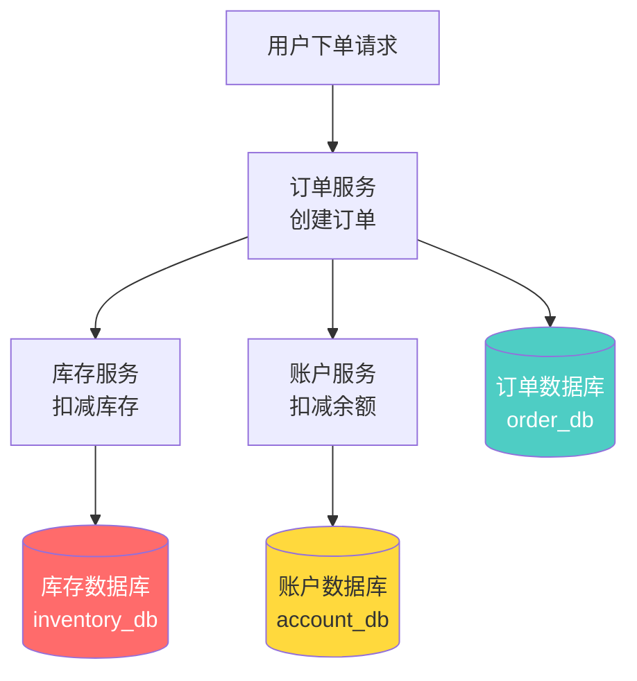
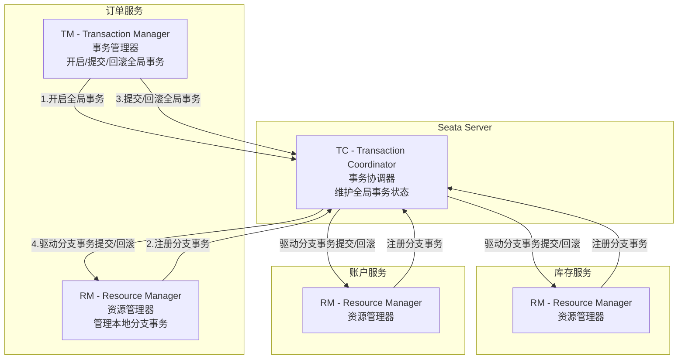
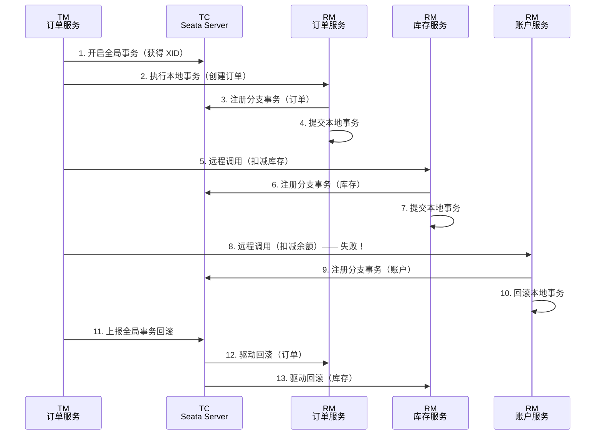

# Seata 分布式事务

## ⭐ 面试重点速览

| 知识模块 | 重点内容 | 面试频率 |
|----------|----------|----------|
| 分布式事务问题场景 | CAP 理论、刚性/柔性事务、经典订单库存账户场景 | 极高 |
| Seata 三组件架构 | TC / TM / RM 角色与职责、Mermaid 架构图 | 极高 |
| 四种模式对比 | AT / TCC / Saga / XA 原理、优缺点、适用场景 | 极高 |
| AT 模式原理 | UNDO_LOG 回滚日志、before image / after image、两阶段提交 | 极高 |
| TCC 模式原理 | Try / Confirm / Cancel 三阶段、空回滚 / 悬挂 / 幂等 | 高 |
| 实战配置 | 集成步骤、配置项、AT 模式表结构 | 中高 |

---

## 一、分布式事务问题场景

### 1.1 什么是分布式事务？

在微服务架构中，一次业务操作往往需要跨越多个独立的数据库和服务。以电商下单为例：



**问题**：如果订单创建成功、库存扣减成功，但账户扣减失败（余额不足 or 账户服务宕机），那么前面已经成功的操作需要回滚。但三个操作分别在不同的数据库上，无法用单个数据库的事务来保证一致性。

### 1.2 分布式事务的核心矛盾

```java
// 伪代码：下单流程
@Transactional // 只能保证 order_db 的事务，无法跨库！
public void createOrder(OrderDTO dto) {
    // 1. 订单服务 → 操作 order_db
    orderMapper.insert(order);               // 成功 ✓

    // 2. 库存服务 → 操作 inventory_db（远程调用）
    inventoryClient.deduct(dto.getProductId(), dto.getCount()); // 成功 ✓

    // 3. 账户服务 → 操作 account_db（远程调用）
    accountClient.debit(dto.getUserId(), dto.getAmount()); // 失败 ✗ —— 前两步无法回滚！
}
```

::: danger 核心矛盾
本地事务（`@Transactional`）只能保证**单个数据库**的 ACID，无法跨服务、跨数据库协调多个本地事务的一致性。这就是分布式事务要解决的问题。
:::

### 1.3 CAP 理论与柔性事务

| 理论 | 说明 |
|------|------|
| **CAP 定理** | 分布式系统无法同时满足 C（一致性）、A（可用性）、P（分区容错性），只能三选二 |
| **刚性事务** | 追求强一致性（ACID），如 XA 协议，性能差，不适合高并发场景 |
| **柔性事务** | 追求最终一致性（BASE），如 AT、TCC、Saga，允许短暂不一致，最终达到一致 |

::: tip 实际选择
在互联网场景下，**P（分区容错性）是必须选择的**（网络分区不可避免），因此实际是在 CP 和 AP 之间选择。Seata 的 AT 和 TCC 模式本质上是选择了 **AP（最终一致性）**，在保证可用性的前提下，通过异步补偿机制达到最终一致。
:::

---

## 二、Seata 是什么？

Seata（Simple Extensible Autonomous Transaction Architecture）是阿里巴巴开源的**分布式事务解决方案**，提供高性能、易用的分布式事务服务。Seata 致力于在微服务架构下提供**高性能**和**零侵入**的分布式事务能力。

```java
// Seata 使用示例：通过 @GlobalTransactional 注解开启全局事务
@Service
public class OrderServiceImpl implements OrderService {

    @Override
    @GlobalTransactional(name = "create-order", rollbackFor = Exception.class)
    public Order createOrder(OrderDTO dto) {
        // 1. 创建订单
        orderMapper.insert(order);                    // 本地事务

        // 2. 扣减库存（远程调用）
        inventoryClient.deduct(dto.getProductId(), dto.getCount());

        // 3. 扣减余额（远程调用）
        accountClient.debit(dto.getUserId(), dto.getAmount());

        // 任何一步失败，Seata 会自动回滚前面所有步骤
        return order;
    }
}
```

---

## 三、⭐ Seata 三组件架构

### 3.1 架构全景图



### 3.2 三组件职责

| 组件 | 全称 | 职责 | 典型角色 |
|------|------|------|----------|
| **TC** | Transaction Coordinator | 维护全局事务和分支事务的状态，驱动全局提交或回滚 | Seata Server（独立部署） |
| **TM** | Transaction Manager | 定义全局事务的范围：开启全局事务、提交或回滚全局事务 | 标注 `@GlobalTransactional` 的发起方 |
| **RM** | Resource Manager | 管理分支事务的资源：注册分支事务、报告分支事务状态、驱动分支事务提交或回滚 | 每个参与全局事务的微服务 |

### 3.3 一次完整调用流程



::: tip 关键理解
- **TM 只有一个**：发起全局事务的服务（标注 `@GlobalTransactional` 的那个）
- **RM 可以有多个**：每个参与全局事务的服务都是一个 RM
- **TC 是独立部署**：Seata Server 需要单独部署，作为协调中心
:::

---

## 四、⭐ 四种模式对比

### 4.1 总览对比表

| 维度 | AT | TCC | Saga | XA |
|------|-----|-----|------|-----|
| **一致性** | 最终一致 | 最终一致 | 最终一致 | 强一致 |
| **隔离性** | 读已提交（默认） | 未提交读 | 未提交读 | 串行化 |
| **侵入性** | ⭐⭐⭐ 零侵入（加注解即可） | 高（需实现 Try/Confirm/Cancel） | 低（需实现补偿方法） | 低（依赖数据库支持） |
| **性能** | ⭐⭐⭐ 高 | ⭐⭐⭐ 高 | ⭐⭐⭐ 高 | ⭐ 低（长时间锁资源） |
| **回滚方式** | 自动（UNDO_LOG） | 手动（Cancel） | 手动（补偿方法） | 自动（数据库支持） |
| **数据库要求** | 关系型数据库（支持 ACID） | 无要求 | 无要求 | 支持 XA 协议 |
| **适用场景** | 通用场景，快速改造 | 高性能、自定义资源 | 长事务、多服务编排 | 强一致性要求 |
| **补偿机制** | 自动反向补偿 | 手动 Cancel | 手动正向补偿 | 自动回滚 |

### 4.2 AT 模式（Automatic Transaction）

**核心原理**：基于**本地事务 + UNDO_LOG** 实现自动回滚。一阶段直接提交本地事务并记录 UNDO_LOG，二阶段根据全局事务结果决定删除 UNDO_LOG（提交）或执行反向 SQL（回滚）。

**优点**：零侵入，只需加 `@GlobalTransactional` 注解，对业务代码无感知
**缺点**：依赖关系型数据库的 ACID 能力，仅支持 SQL 操作
**适用场景**：Java + 关系型数据库的通用微服务场景

### 4.3 TCC 模式（Try-Confirm-Cancel）

**核心原理**：将业务操作分为 **Try（预留资源）→ Confirm（确认提交）→ Cancel（补偿回滚）** 三个阶段，每个阶段由开发者手动实现。

**优点**：不依赖底层数据库，可以操作任意资源（Redis、MQ、文件等）
**缺点**：侵入性高，需要手动实现三个阶段的逻辑，开发成本高
**适用场景**：涉及非数据库资源操作、需要高性能、或对一致性要求高的场景

### 4.4 Saga 模式

**核心原理**：将长事务拆分为多个**有序的本地事务**，每个本地事务都有一个对应的**补偿操作**。如果某个步骤失败，则按相反顺序依次执行补偿操作。

**优点**：无锁、高性能、适合长事务
**缺点**：隔离性弱，可能出现脏读
**适用场景**：长事务链路、多服务编排、不能使用 AT 的场景（如异构语言）

### 4.5 XA 模式

**核心原理**：基于数据库的 XA 协议，使用**两阶段提交（2PC）**。一阶段 Prepare（锁定资源），二阶段 Commit/Rollback。

**优点**：强一致性，对业务代码无侵入
**缺点**：性能极差（长时间持有数据库锁），需要数据库支持 XA
**适用场景**：对一致性要求极高且并发量不大的场景（如金融清算）

---

## 五、⭐ AT 模式原理（超高频）

### 5.1 核心机制：两阶段提交

AT 模式是 Seata 的默认模式，也是面试中最常问的模式。其核心是**两阶段提交协议**：

```mermaid
graph TB
    subgraph 一阶段：业务数据 + UNDO_LOG 在同一本地事务中提交
        A1[执行业务 SQL] --> A2[生成 before image]
        A2 --> A3[生成 after image]
        A3 --> A4[插入 UNDO_LOG]
        A4 --> A5[提交本地事务]
    end

    subgraph 二阶段-提交：异步删除 UNDO_LOG
        B1[TC 通知全局提交] --> B2[异步删除 UNDO_LOG]
    end

    subgraph 二阶段-回滚：通过 UNDO_LOG 反向补偿
        C1[TC 通知全局回滚] --> C2[读取 UNDO_LOG]
        C2 --> C3[数据校验：对比 after image 与当前数据]
        C3 --> C4[执行反向 SQL]
        C4 --> C5[删除 UNDO_LOG]
    end

    A5 --> B1
    A5 --> C1
```

### 5.2 UNDO_LOG 表结构

```sql
-- AT 模式需要每个业务数据库创建此表
CREATE TABLE `undo_log` (
    `id`            BIGINT(20) NOT NULL AUTO_INCREMENT,
    `branch_id`     BIGINT(20) NOT NULL COMMENT '分支事务 ID',
    `xid`           VARCHAR(100) NOT NULL COMMENT '全局事务 XID',
    `context`       VARCHAR(128) NOT NULL COMMENT '上下文信息',
    `rollback_info` LONGBLOB NOT NULL COMMENT '回滚信息（before image + after image）',
    `log_status`    INT(11) NOT NULL COMMENT '日志状态',
    `log_created`   DATETIME NOT NULL COMMENT '创建时间',
    `log_modified`  DATETIME NOT NULL COMMENT '修改时间',
    PRIMARY KEY (`id`),
    UNIQUE KEY `ux_undo_log` (`xid`, `branch_id`)  -- 全局事务 + 分支事务唯一
) ENGINE=InnoDB DEFAULT CHARSET=utf8mb4;
```

### 5.3 before image 与 after image

```java
// 以 "用户下单扣减库存" 为例说明 before image 和 after image

// 原始 SQL：UPDATE product SET stock = stock - 5 WHERE id = 100

// === before image（执行 SQL 前的数据快照）===
// SELECT id, stock FROM product WHERE id = 100
// 结果：{ id: 100, stock: 100 }

// === after image（执行 SQL 后的数据快照）===
// SELECT id, stock FROM product WHERE id = 100
// 结果：{ id: 100, stock: 95 }

// === 回滚时生成的反向 SQL ===
// 根据 before image 和 after image 自动生成：
// UPDATE product SET stock = 100 WHERE id = 100
// （将 stock 从 95 恢复为 100）
```

### 5.4 写隔离与读隔离

**写隔离**：AT 模式通过**全局锁**保证同一行数据的并发写操作串行化。

```java
// 写隔离流程
// 事务 A：UPDATE product SET stock = stock - 5 WHERE id = 100（获取全局锁）
// 事务 B：UPDATE product SET stock = stock - 3 WHERE id = 100（等待全局锁释放）
// 事务 A 提交全局事务 → 释放全局锁 → 事务 B 获取全局锁 → 执行
```

**读隔离**：AT 模式的默认隔离级别是**读未提交（Read Uncommitted）**。如需更高的隔离级别，Seata 提供了 `SELECT FOR UPDATE` 语句代理，可以申请全局锁。

```java
// 读已提交隔离：使用 SELECT FOR UPDATE
@GlobalTransactional
public void transfer() {
    // SELECT FOR UPDATE 会申请全局锁，确保读到的是已提交的数据
    Account account = accountMapper.selectForUpdate(accountId);
    // ...
}
```

::: danger 面试追问：AT 模式为什么需要全局锁？

AT 模式的一阶段已经提交了本地事务，这意味着其他事务可以读到未全局提交的数据（脏读）。全局锁的作用是**防止并发写冲突**：在全局事务提交/回滚之前，其他事务不能修改同一行数据。这是 AT 模式"读已提交"隔离级别的基石。
:::

### 5.5 AT 模式优缺点

| 优点 | 缺点 |
|------|------|
| 零侵入，只需加 `@GlobalTransactional` 注解 | 仅支持关系型数据库 |
| 性能高，一阶段直接提交，不长时间锁资源 | 需要额外创建 UNDO_LOG 表 |
| 自动回滚，无需手动编写补偿逻辑 | 默认隔离级别较低（读未提交） |
| 支持 Spring Cloud、Dubbo 等多种微服务框架 | 全局锁可能成为性能瓶颈 |

---

## 六、TCC 模式原理

### 6.1 三阶段说明

TCC（Try-Confirm-Cancel）将业务操作拆分为三个阶段：

| 阶段 | 说明 | 必须满足 |
|------|------|----------|
| **Try** | 预留资源，检查和锁定需要的资源 | 所有检查通过，预留资源成功 |
| **Confirm** | 确认提交，真正执行业务操作 | 幂等操作（可能被重复调用） |
| **Cancel** | 补偿回滚，释放 Try 阶段预留的资源 | 幂等操作 + 空回滚（Try 未执行时 Cancel 也能正确处理） |

### 6.2 以转账为例

```java
// TCC 模式：账户 A 转账 100 元给账户 B

// ===== Try 阶段：预留资源 =====
// 账户 A：冻结 100 元（available_amount - 100, frozen_amount + 100）
// 账户 B：不做任何操作（不处理目标账户，避免并发问题）

// ===== Confirm 阶段：确认提交 =====
// 账户 A：扣减冻结金额（frozen_amount - 100）
// 账户 B：增加可用余额（available_amount + 100）

// ===== Cancel 阶段：补偿回滚 =====
// 账户 A：解冻金额（available_amount + 100, frozen_amount - 100）
// 账户 B：不做任何操作
```

```java
// TCC 接口定义
public interface AccountTccAction {

    /**
     * Try：预留资源
     * @param businessNo 业务流水号，用于幂等控制
     * @param userId 用户 ID
     * @param amount 冻结金额
     */
    @TwoPhaseBusinessAction(name = "account-debit", commitMethod = "commit", rollbackMethod = "rollback")
    boolean prepareDebit(@BusinessActionContextParameter(paramName = "businessNo") String businessNo,
                         @BusinessActionContextParameter(paramName = "userId") Long userId,
                         @BusinessActionContextParameter(paramName = "amount") BigDecimal amount);

    /**
     * Confirm：确认提交
     */
    boolean commit(BusinessActionContext context);

    /**
     * Cancel：补偿回滚
     */
    boolean rollback(BusinessActionContext context);
}
```

```java
// TCC 实现类
@Service
public class AccountTccActionImpl implements AccountTccAction {

    @Override
    @Transactional
    public boolean prepareDebit(String businessNo, Long userId, BigDecimal amount) {
        // Try：冻结账户余额
        // 1. 幂等校验：检查 businessNo 是否已处理（防悬挂）
        if (tccRecordMapper.exists(businessNo)) {
            return true; // 已处理过，幂等返回
        }
        // 2. 检查余额是否充足
        Account account = accountMapper.selectForUpdate(userId);
        if (account.getAvailableAmount().compareTo(amount) < 0) {
            throw new InsufficientBalanceException("余额不足");
        }
        // 3. 冻结金额（可用余额减少，冻结金额增加）
        accountMapper.freezeAmount(userId, amount);
        // 4. 记录 Try 操作（用于幂等和空回滚判断）
        tccRecordMapper.insert(businessNo, "TRY", amount);
        return true;
    }

    @Override
    @Transactional
    public boolean commit(BusinessActionContext context) {
        String businessNo = context.getActionContext("businessNo");
        // Confirm：真正扣减冻结金额
        // 幂等：如果已处理过，直接返回
        if (tccRecordMapper.isConfirmed(businessNo)) {
            return true;
        }
        Long userId = Long.valueOf(context.getActionContext("userId"));
        BigDecimal amount = new BigDecimal(context.getActionContext("amount"));
        accountMapper.confirmDebit(userId, amount); // 冻结金额减少
        tccRecordMapper.updateStatus(businessNo, "CONFIRM");
        return true;
    }

    @Override
    @Transactional
    public boolean rollback(BusinessActionContext context) {
        String businessNo = context.getActionContext("businessNo");
        // Cancel：解冻金额
        // 空回滚：如果 Try 未执行，直接返回（防止空回滚）
        if (!tccRecordMapper.exists(businessNo)) {
            // 插入一条空回滚记录，防止后续 Try 悬挂
            tccRecordMapper.insert(businessNo, "CANCEL_EMPTY", BigDecimal.ZERO);
            return true;
        }
        // 幂等：如果已回滚过，直接返回
        if (tccRecordMapper.isCancelled(businessNo)) {
            return true;
        }
        Long userId = Long.valueOf(context.getActionContext("userId"));
        BigDecimal amount = new BigDecimal(context.getActionContext("amount"));
        accountMapper.unfreezeAmount(userId, amount); // 解冻金额
        tccRecordMapper.updateStatus(businessNo, "CANCEL");
        return true;
    }
}
```

::: danger TCC 三大难题
1. **空回滚**：Try 未执行，Cancel 却被调用。解决方案：Cancel 阶段判断 Try 是否执行过，未执行则直接返回（但要记录防止悬挂）
2. **悬挂**：Cancel 比 Try 先执行。解决方案：Try 执行前先检查 Cancel 是否已执行，如已执行则拒绝 Try
3. **幂等**：Try/Confirm/Cancel 可能被重复调用。解决方案：通过业务流水号（businessNo）做幂等控制
:::

---

## 七、Seata 实战配置与集成步骤

### 7.1 部署 Seata Server（TC）

```bash
# 1. 下载并启动 Seata Server
# 方式一：直接启动
sh seata-server.sh -p 8091 -m file

# 方式二：Docker 部署
docker run -d --name seata-server \
  -p 8091:8091 \
  -e SEATA_IP=192.168.1.100 \
  seataio/seata-server:latest
```

```yaml
# seata-server 配置文件 registry.conf
registry:
  type: nacos                          # 注册中心类型
  nacos:
    application: seata-server
    server-addr: localhost:8848
    group: SEATA_GROUP
    namespace: ""

config:
  type: nacos                          # 配置中心类型
  nacos:
    server-addr: localhost:8848
    group: SEATA_GROUP
    namespace: ""
    data-id: seataServer.properties
```

### 7.2 应用端集成

```xml
<!-- 引入 Seata 依赖 -->
<dependency>
    <groupId>com.alibaba.cloud</groupId>
    <artifactId>spring-cloud-starter-alibaba-seata</artifactId>
</dependency>
```

```yaml
# application.yml 配置
spring:
  application:
    name: order-service
  cloud:
    alibaba:
      seata:
        tx-service-group: my_test_tx_group  # 事务分组，映射到 seata-server 集群

seata:
  registry:
    type: nacos
    nacos:
      server-addr: localhost:8848
      group: SEATA_GROUP
      application: seata-server
  config:
    type: nacos
    nacos:
      server-addr: localhost:8848
      group: SEATA_GROUP
  tx-service-group: my_test_tx_group
  service:
    vgroup-mapping:
      my_test_tx_group: default  # 事务分组 → seata-server 集群映射
```

### 7.3 AT 模式 UNDO_LOG 表创建

```sql
-- 在每个参与全局事务的数据库中执行
CREATE TABLE `undo_log` (
    `id`            BIGINT(20) NOT NULL AUTO_INCREMENT,
    `branch_id`     BIGINT(20) NOT NULL,
    `xid`           VARCHAR(100) NOT NULL,
    `context`       VARCHAR(128) NOT NULL,
    `rollback_info` LONGBLOB NOT NULL,
    `log_status`    INT(11) NOT NULL,
    `log_created`   DATETIME NOT NULL,
    `log_modified`  DATETIME NOT NULL,
    `ext`           VARCHAR(100) DEFAULT NULL,
    PRIMARY KEY (`id`),
    UNIQUE KEY `ux_undo_log` (`xid`, `branch_id`)
) ENGINE=InnoDB AUTO_INCREMENT=1 DEFAULT CHARSET=utf8mb4;
```

### 7.4 业务代码集成

```java
// 方式一：注解方式（推荐）
@Service
public class OrderServiceImpl implements OrderService {

    @Override
    @GlobalTransactional(name = "create-order", timeoutMills = 300000, rollbackFor = Exception.class)
    public Order createOrder(OrderDTO dto) {
        // 1. 创建订单（本地事务）
        Order order = new Order();
        order.setUserId(dto.getUserId());
        order.setProductId(dto.getProductId());
        order.setAmount(dto.getAmount());
        orderMapper.insert(order);

        // 2. 扣减库存（Feign 远程调用，库存服务自动传播 XID）
        inventoryClient.deduct(dto.getProductId(), dto.getCount());

        // 3. 扣减余额（Feign 远程调用，账户服务自动传播 XID）
        accountClient.debit(dto.getUserId(), dto.getAmount());

        return order;
    }
}

// 方式二：API 方式（灵活控制）
@Service
public class OrderServiceApiImpl implements OrderService {

    @Override
    public Order createOrder(OrderDTO dto) {
        // 手动开启全局事务
        GlobalTransaction tx = GlobalTransactionContext.getCurrentOrCreate();
        try {
            tx.begin(300000, "create-order"); // 超时 5 分钟

            orderMapper.insert(order);
            inventoryClient.deduct(dto.getProductId(), dto.getCount());
            accountClient.debit(dto.getUserId(), dto.getAmount());

            tx.commit(); // 全局提交
            return order;
        } catch (Exception e) {
            tx.rollback(); // 全局回滚
            throw e;
        }
    }
}
```

### 7.5 XID 传播机制

```java
// Seata 通过 Feign 拦截器自动传播 XID，无需手动处理
// 原理：请求前将 XID 放入请求头，接收方从请求头提取 XID 并绑定到当前线程

// 自定义 Feign 拦截器（Seata 已自动配置，通常不需要手动写）
@Configuration
public class SeataFeignConfig {
    @Bean
    public RequestInterceptor seataRequestInterceptor() {
        return requestTemplate -> {
            String xid = RootContext.getXID();
            if (StringUtils.isNotBlank(xid)) {
                requestTemplate.header(RootContext.KEY_XID, xid);
            }
        };
    }
}
```

::: tip XID 传播机制
Seata 通过 `RootContext` 在当前线程的 ThreadLocal 中存储 XID。当发起远程调用（Feign / Dubbo）时，拦截器自动将 XID 放入请求头；接收方拦截器自动提取并绑定到当前线程的 `RootContext`。这样 XID 在整个调用链中自动传播，无需手动传递。
:::

---

## ⭐ 面试高频问题汇总

### Q1：什么是分布式事务？为什么需要 Seata？

分布式事务是指一次业务操作跨越多个独立的数据库和服务，需要保证这些操作要么全部成功，要么全部失败。

本地事务（`@Transactional`）只能保证单个数据库的 ACID，无法跨服务协调。Seata 提供了**高性能、零侵入**的分布式事务解决方案，通过 TC/TM/RM 三组件架构协调多个服务的本地事务。

### Q2：Seata 的三大组件分别是什么？各自职责？

| 组件 | 职责 |
|------|------|
| **TC（Transaction Coordinator）** | 事务协调器，维护全局事务和分支事务状态，驱动全局提交/回滚（Seata Server） |
| **TM（Transaction Manager）** | 事务管理器，定义全局事务范围，开启/提交/回滚全局事务（`@GlobalTransactional` 标注的服务） |
| **RM（Resource Manager）** | 资源管理器，管理分支事务资源，注册分支事务，报告状态，执行提交/回滚（每个参与方） |

**一句话**：TM 开启全局事务，RM 注册分支事务，TC 协调全局事务的提交与回滚。

### Q3：Seata 四种事务模式的对比及各自适用场景？

| 模式 | 核心特点 | 适用场景 |
|------|----------|----------|
| **AT** | 零侵入，基于 UNDO_LOG 自动回滚 | 通用场景，Java + 关系型数据库 |
| **TCC** | 手动实现 Try/Confirm/Cancel，高性能 | 高性能、非数据库资源、自定义资源 |
| **Saga** | 正向补偿，长事务无锁 | 长事务链路、异构语言、多服务编排 |
| **XA** | 强一致性，数据库 XA 协议 | 强一致性要求、低并发场景 |

### Q4：请详细描述 AT 模式的二阶段提交流程。

**一阶段**：
1. 解析业务 SQL，生成 before image（执行前的数据快照）
2. 执行业务 SQL
3. 生成 after image（执行后的数据快照）
4. 将 before image + after image 插入 UNDO_LOG 表
5. 提交本地事务（业务数据 + UNDO_LOG 在同一事务中）

**二阶段-提交**：
1. TC 通知全局事务提交
2. RM 异步删除 UNDO_LOG（无需回滚）

**二阶段-回滚**：
1. TC 通知全局事务回滚
2. RM 读取 UNDO_LOG 中的 before image 和 after image
3. 校验当前数据是否与 after image 一致（防止脏写）
4. 执行反向 SQL（根据 before image 恢复数据）
5. 删除 UNDO_LOG

### Q5：AT 模式的 before image 和 after image 是什么？为什么需要它们？

- **before image**：执行 SQL 前的数据快照，用于回滚时恢复数据
- **after image**：执行 SQL 后的数据快照，用于回滚时校验数据是否被其他事务修改（脏写校验）

回滚时如果发现当前数据与 after image 不一致，说明数据被其他事务修改过，此时无法安全回滚，会抛出异常要求人工介入。

### Q6：TCC 模式的空回滚、悬挂、幂等问题如何解决？

| 问题 | 场景 | 解决方案 |
|------|------|----------|
| **空回滚** | Try 未执行但 Cancel 被调用 | Cancel 中判断 Try 是否执行过，未执行则直接返回（但要插入防悬挂记录） |
| **悬挂** | Cancel 比 Try 先执行 | Try 执行前检查 Cancel 是否已执行，如已执行则拒绝 Try |
| **幂等** | Try/Confirm/Cancel 被重复调用 | 通过业务流水号（businessNo）在数据库做唯一约束，已处理则跳过 |

**核心思路**：所有 TCC 实现都需要一个**记录表**来追踪每个阶段的状态，通过唯一键（businessNo）保证幂等和防悬挂。

### Q7：Seata AT 模式和 XA 模式（2PC）的本质区别是什么？

| 维度 | AT 模式 | XA 模式（2PC） |
|------|---------|---------------|
| **一阶段提交** | 直接提交本地事务（释放数据库锁） | 不提交，Prepare 阶段锁定资源 |
| **锁持有时间** | 极短（仅本地事务期间） | 长（整个全局事务期间） |
| **性能** | 高 | 低（锁资源导致并发低） |
| **一致性** | 最终一致 | 强一致 |
| **回滚方式** | 通过 UNDO_LOG 反向补偿 | 数据库原生回滚 |
| **数据库要求** | 支持 ACID 的关系型数据库 | 支持 XA 协议 |

AT 模式的核心创新是**将锁的持有时间从全局事务级别缩短到本地事务级别**，通过 UNDO_LOG 实现了"先提交，后补偿"的机制，是性能与一致性的折中。

### Q8：Seata 的 XID 是如何在微服务调用链中传播的？

XID 通过 `RootContext`（ThreadLocal）存储在当前线程中。当发起远程调用时：
1. **发送端**：Feign/Dubbo 拦截器从 `RootContext.getXID()` 获取 XID，放入请求头
2. **接收端**：拦截器从请求头提取 XID，调用 `RootContext.bind(xid)` 绑定到当前线程
3. 整个过程对业务代码完全透明，无需手动传递

### Q9：@GlobalTransactional 和 @Transactional 可以同时使用吗？

**可以同时使用，但要注意作用域**：
- `@Transactional` 控制**本地事务**（单个数据库）
- `@GlobalTransactional` 控制**全局事务**（跨服务/跨数据库）
- 通常 `@GlobalTransactional` 标注在入口方法上，`@Transactional` 标注在内部方法上
- Seata AT 模式下，每个分支事务本身就是通过 `@Transactional` 控制的本地事务

---

## 面试追问环节

**Q：如果 AT 模式回滚时发现数据被篡改（脏写），Seata 会如何处理？**

Seata 在回滚时会对比当前数据与 after image 是否一致。如果不一致，说明数据在全局事务提交前被其他事务修改了（脏写），此时 Seata 会：
1. 抛出 `BranchRollbackFailedException` 异常
2. 记录异常日志，提示需要人工介入
3. 这是 AT 模式**读已提交**隔离级别的代价 —— 极端情况下可能需要人工处理

**Q：Seata 在高并发场景下，全局锁会成为瓶颈吗？如何优化？**

会。全局锁是 AT 模式写隔离的保证，高并发下对同一行数据的竞争会导致性能下降。优化策略：
1. **减少全局事务范围**：尽量缩小 `@GlobalTransactional` 覆盖的代码范围
2. **避免热点数据**：将热点数据拆分（如库存分片），减少锁竞争
3. **切换 TCC 模式**：TCC 不依赖全局锁，性能更高
4. **异步化**：核心链路保证一致性，非核心操作异步最终一致