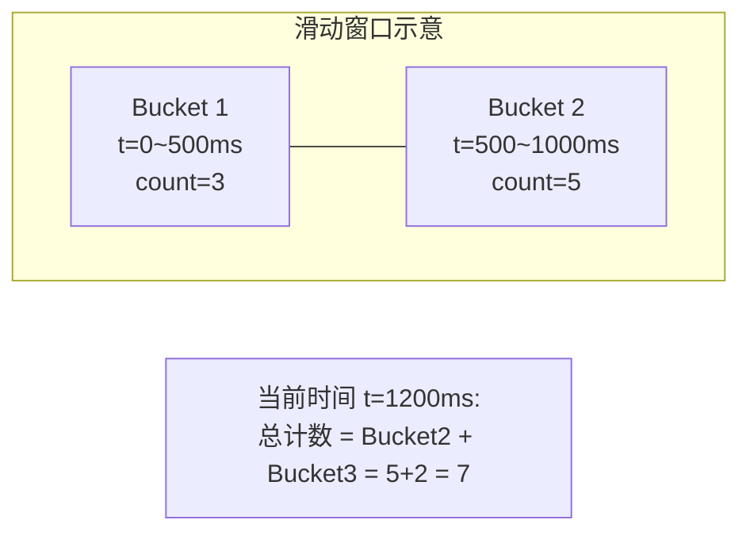
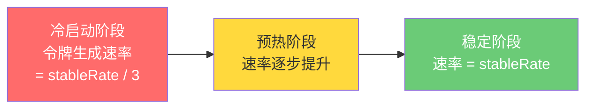
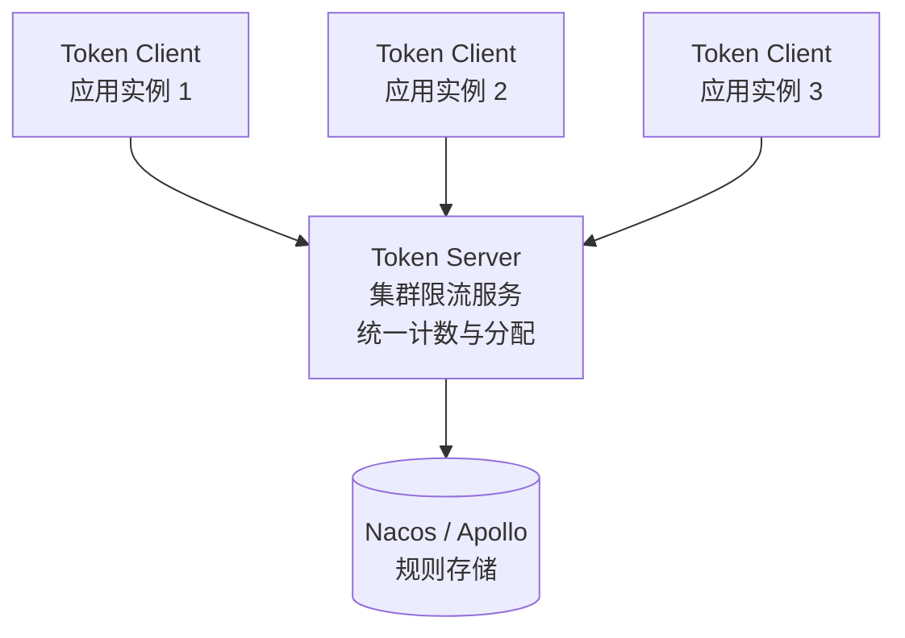
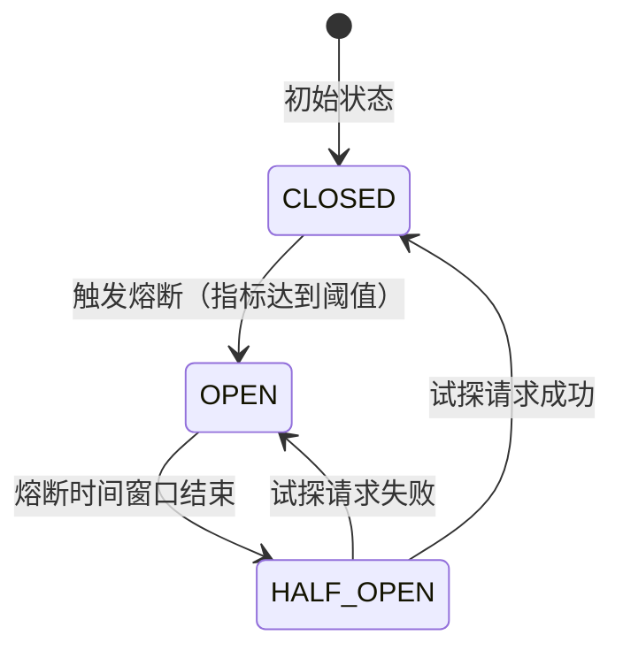
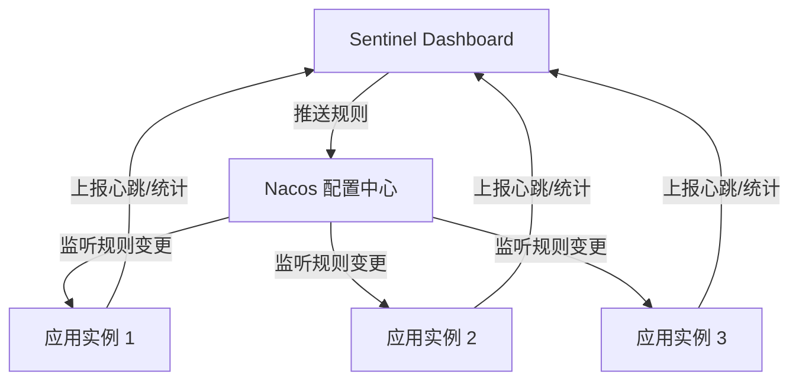

# Sentinel 熔断降级

## ⭐ 面试重点速览

| 知识模块 | 重点内容 | 面试频率 |
|----------|----------|----------|
| Sentinel 核心架构 | Slot Chain 责任链模式、核心 Slot 职责 | 极高 |
| 限流算法 | 滑动窗口 / 令牌桶 / 漏桶 原理与对比 | 极高 |
| 限流方式 | 6 种限流方式（QPS / 并发 / 关联 / 链路 / 热点 / 集群） | 高 |
| 熔断降级策略 | 慢调用比例 / 异常比例 / 异常数、状态机转换 | 极高 |
| Sentinel vs Hystrix vs Resilience4j | 功能、性能、社区对比 | 高 |
| 控制台与动态规则 | 控制台使用、Nacos 动态规则推送 | 中高 |

---

## 一、Sentinel 是什么？

Sentinel（哨兵）是阿里巴巴开源的面向分布式服务架构的**流量控制与熔断降级**组件，它以"流量"为切入点，从**流量控制、熔断降级、系统自适应保护**等多个维度保障微服务的稳定性。

```java
// Sentinel 核心概念
// 资源（Resource）：Sentinel 要保护的目标，可以是一段代码、一个方法或一个接口
// 规则（Rule）：围绕资源设定的控制策略（限流、熔断、降级、热点等）

// 最简使用示例
public static void main(String[] args) {
    // 1. 定义资源并配置规则
    initFlowRules(); // 定义限流规则：QPS = 10

    // 2. 使用 Sentinel 保护代码
    try (Entry entry = SphU.entry("helloWorld")) {
        // 被保护的资源（业务逻辑）
        System.out.println("Hello Sentinel!");
    } catch (BlockException e) {
        // 被限流/降级后的处理逻辑
        System.out.println("请求被限流！");
    }
}
```

::: tip Sentinel 的设计理念
Sentinel 的设计理念是：**"让开发者只需要关心资源的定义，而不需要关心规则的执行逻辑"**。开发者通过简单的 API 定义资源，规则的管理和数据的统计由 Sentinel 内部完成。
:::

---

## 二、⭐ Sentinel 核心架构 —— Slot Chain 责任链模式

### 2.1 设计思想

Sentinel 的核心是 **Slot Chain（责任链）**，每个 Slot 负责不同的功能（如统计、限流、降级、日志），各个 Slot 之间通过责任链模式串联，实现了高内聚低耦合。

### 2.2 Slot Chain 流程图

```mermaid
graph LR
    A[请求进入<br/>SphU.entry] --> B[1.NodeSelectorSlot<br/>构建调用链节点]
    B --> C[2.ClusterBuilderSlot<br/>构建集群节点]
    C --> D[3.LogSlot<br/>记录日志]
    D --> E[4.StatisticSlot<br/>实时统计]
    E --> F[5.AuthoritySlot<br/>黑白名单校验]
    F --> G[6.SystemSlot<br/>系统自适应保护]
    G --> H[7.FlowSlot<br/>流量控制]
    H --> I[8.DegradeSlot<br/>熔断降级]
    I --> J[9.ParamFlowSlot<br/>热点参数限流]
    J --> K[请求通过<br/>执行业务逻辑]
```



### 2.3 各 Slot 职责详解

| Slot | 职责 | 说明 |
|------|------|------|
| **NodeSelectorSlot** | 构建调用链节点 | 为当前资源创建 `DefaultNode`，记录调用链路 |
| **ClusterBuilderSlot** | 构建集群节点 | 为当前资源创建 `ClusterNode`，统计集群维度的数据 |
| **LogSlot** | 记录日志 | 记录 BlockException 异常日志 |
| **StatisticSlot** | ⭐ 实时统计 | 核心统计 Slot，记录 RT、QPS、异常数、线程数等指标 |
| **AuthoritySlot** | 黑白名单校验 | 基于调用来源进行黑白名单控制 |
| **SystemSlot** | 系统自适应保护 | 基于系统整体负载（Load、CPU、RT、QPS）进行保护 |
| **FlowSlot** | 流量控制 | 根据预设的限流规则进行流量控制 |
| **DegradeSlot** | 熔断降级 | 根据预设的降级规则进行熔断降级 |
| **ParamFlowSlot** | 热点参数限流 | 针对请求中的"热点参数"进行精细化限流 |

::: tip Slot Chain 的执行顺序很重要！
`StatisticSlot` 位于 FlowSlot 和 DegradeSlot **之前**，这意味着统计数据的采集永远在规则检查之前进行。即使请求最终被限流，统计信息也已经记录下来，这保证了后续的规则评估始终基于最新的数据。
:::

### 2.4 Slot Chain 实现原理

```java
// Sentinel 核心入口：SphU.entry()
// 内部通过 SPI 加载 ProcessorSlot 实现，构建责任链

// 简化版责任链执行逻辑（源码抽象）
public class DefaultProcessorSlotChain extends ProcessorSlotChain {

    private AbstractLinkedProcessorSlot<?> first; // 链表头节点

    @Override
    public void entry(Context context, ResourceWrapper resourceWrapper,
                      Object param, int count, boolean prioritized, Object... args) {
        // 从链表头开始逐个调用 Slot
        if (first != null) {
            first.transformEntry(context, resourceWrapper, param, count, prioritized, args);
        }
    }
}

// 每个 Slot 的抽象基类
public abstract class AbstractLinkedProcessorSlot<T> implements ProcessorSlot<T> {
    private AbstractLinkedProcessorSlot<?> next; // 责任链中的下一个 Slot

    @Override
    public void fireEntry(Context context, ResourceWrapper resourceWrapper,
                          Object obj, int count, boolean prioritized, Object... args) {
        if (next != null) {
            next.transformEntry(context, resourceWrapper, obj, count, prioritized, args);
        }
    }
}
```

::: danger 面试追问：为什么用责任链模式？

1. **高扩展性**：新增功能只需添加新的 Slot，无需改动现有代码（开闭原则）
2. **职责单一**：每个 Slot 只关注自己的领域（统计、限流、降级各司其职）
3. **顺序灵活**：Slot 的执行顺序可以灵活调整（如统计必须在限流之前）
4. **可插拔**：通过 SPI 机制加载 Slot，支持自定义 Slot 扩展
:::

---

## 三、限流算法

Sentinel 支持三种核心限流算法，不同场景下可以选择不同的算法。

### 3.1 滑动窗口计数（默认）

**原理**：将时间窗口划分为多个小窗口（bucket），每个 bucket 独立计数。时间推移时滑动窗口，丢弃过期 bucket 的计数，保证计数的实时性和准确性。



**Sentinel 实现**：使用 `LeapArray` 环形数组实现滑动窗口，默认窗口大小 1s，划分为 2 个 bucket（每个 500ms）。

```java
// 配置滑动窗口限流规则
FlowRule rule = new FlowRule("resourceName")
    .setCount(100)             // QPS 阈值
    .setGrade(RuleConstant.FLOW_GRADE_QPS); // QPS 模式（默认滑动窗口）
FlowRuleManager.loadRules(Collections.singletonList(rule));
```

**应用场景**：通用限流场景，对实时性要求不极端的大部分业务。

### 3.2 令牌桶 —— WarmUp（预热/冷启动）

**原理**：系统启动时桶里没有令牌（或很少），令牌以**逐渐加速**的方式生成，直到达到稳定速率。这模拟了"系统预热"的过程，避免冷启动时瞬间大流量把系统打垮。



**关键参数**：

| 参数 | 说明 |
|------|------|
| `count` | 稳定期的 QPS 阈值 |
| `warmUpPeriodSec` | 预热时长（秒），从冷启动到稳定期所需时间 |
| `coldFactor` | 冷启动因子，默认 3，即冷启动时 QPS 为稳定期的 1/3 |

```java
// 配置 WarmUp 限流规则
FlowRule rule = new FlowRule("resourceName")
    .setCount(100)                             // 稳定期 QPS = 100
    .setGrade(RuleConstant.FLOW_GRADE_QPS)
    .setControlBehavior(RuleConstant.CONTROL_BEHAVIOR_WARM_UP)
    .setWarmUpPeriodSec(10);                   // 预热 10 秒
FlowRuleManager.loadRules(Collections.singletonList(rule));
```

**应用场景**：系统刚启动时、缓存刚清空后、连接池刚建立时等场景。典型如秒杀系统的库存服务，刚启动需要预热。

### 3.3 漏桶 —— 排队等待

**原理**：请求以任意速率进入，但以**恒定速率**流出。超过桶容量的请求排队等待，超时则拒绝。保证了流量的绝对均匀，但可能引入延迟。

```java
// 配置排队等待限流规则
FlowRule rule = new FlowRule("resourceName")
    .setCount(100)                                    // 每秒处理 100 个请求
    .setGrade(RuleConstant.FLOW_GRADE_QPS)
    .setControlBehavior(RuleConstant.CONTROL_BEHAVIOR_RATE_LIMITER)
    .setMaxQueueingTimeMs(500);                       // 最大排队时间 500ms
FlowRuleManager.loadRules(Collections.singletonList(rule));
```

::: warning 排队等待模式的注意事项
- 请求的最大排队时间是固定的，超过则直接拒绝
- 适用于对**延迟不敏感**但对**流速均匀性**要求高的场景（如消息队列消费端）
- 不适合对响应时间敏感的场景
:::

**应用场景**：消息处理管道、批量数据处理、对下游保护（避免瞬间流量尖刺打垮下游）。

### 3.4 三种算法对比

| 维度 | 滑动窗口 | 令牌桶（WarmUp） | 漏桶（排队等待） |
|------|----------|------------------|------------------|
| **核心思想** | 滑动时间窗口计数 | 令牌生成速率递增 | 恒定速率流出 |
| **流量整形** | 允许瞬间突发 | 平滑增长 | 绝对匀速 |
| **延迟** | 无额外延迟 | 无额外延迟 | 有排队延迟 |
| **冷启动保护** | 无 | 有 | 无 |
| **适用场景** | 通用限流 | 系统预热 | 对下游保护 |
| **Sentinel 配置** | 默认行为 | `CONTROL_BEHAVIOR_WARM_UP` | `CONTROL_BEHAVIOR_RATE_LIMITER` |

---

## 四、6 种限流方式

### 4.1 QPS 限流（最常用）

根据每秒请求数（QPS）进行限流，支持三种流控效果：直接拒绝、WarmUp、排队等待。

```java
// 方式一：通过代码配置
private static void initQpsRule() {
    List<FlowRule> rules = new ArrayList<>();
    FlowRule rule = new FlowRule("getUserById")
        .setCount(50)                                   // QPS 阈值
        .setGrade(RuleConstant.FLOW_GRADE_QPS)          // QPS 模式
        .setControlBehavior(RuleConstant.CONTROL_BEHAVIOR_DEFAULT); // 直接拒绝
    rules.add(rule);
    FlowRuleManager.loadRules(rules);
}

// 方式二：通过 @SentinelResource 注解（推荐）
@RestController
public class UserController {

    @GetMapping("/user/{id}")
    @SentinelResource(value = "getUserById",
        blockHandler = "handleBlock")  // 限流后回调方法
    public User getUserById(@PathVariable Long id) {
        return userService.findById(id);
    }

    // 限流/降级处理：参数必须和原方法一致，且多一个 BlockException
    public User handleBlock(Long id, BlockException ex) {
        log.warn("getUserById 被限流, id={}", id);
        return new User(-1L, "服务繁忙，请稍后再试");
    }
}
```

### 4.2 并发线程数限流

限制同一时刻同时处理该资源的**线程数**，而非 QPS。适用于保护慢调用导致线程堆积的场景。

```java
// 配置并发线程数限流
FlowRule rule = new FlowRule("slowApi")
    .setCount(5)                                    // 最多 5 个线程同时执行
    .setGrade(RuleConstant.FLOW_GRADE_THREAD);      // 线程数模式
FlowRuleManager.loadRules(Collections.singletonList(rule));

// 使用场景：保护数据库连接池
@SentinelResource(value = "dbQuery",
    fallback = "dbQueryFallback",
    blockHandler = "dbQueryBlock")
public List<Data> dbQuery(String sql) {
    // 耗时查询，同一时刻最多 10 个线程执行
    return jdbcTemplate.query(sql, rowMapper);
}
```

::: tip QPS 限流 vs 并发线程数限流
- **QPS 限流**：控制的是"请求的速率"，适合保护 CPU 密集型接口
- **线程数限流**：控制的是"并发的数量"，适合保护 IO 密集型接口（如数据库连接池、RPC 调用）
- 如果接口耗时不稳定（如依赖外部服务），线程数限流比 QPS 限流更合适
:::

### 4.3 关联限流

当资源 A 达到阈值时，限制资源 B 的访问。典型场景：**支付接口和下单接口共享一个数据库连接池**，当支付接口 QPS 过高时，自动限制下单接口的 QPS。

```java
// 关联限流：当 "/pay" 的 QPS 超过 100 时，限制 "/order" 的 QPS 为 10
FlowRule rule = new FlowRule("/order")              // 被限制的资源
    .setCount(10)                                    // /order 的 QPS 阈值
    .setGrade(RuleConstant.FLOW_GRADE_QPS)
    .setStrategy(RuleConstant.STRATEGY_RELATE)       // 关联模式
    .setRefResource("/pay");                         // 关联的资源（触发条件）
FlowRuleManager.loadRules(Collections.singletonList(rule));
```

### 4.4 链路限流

只针对**某一条调用链路**进行限流，而不是限制整个资源。例如：同一个 `queryGoods` 方法被"搜索"和"推荐"两条链路调用，只限制"搜索"链路的 QPS。

```java
// 链路限流：只限制来自 "/search" 入口的 queryGoods 调用
FlowRule rule = new FlowRule("queryGoods")           // 被保护的资源
    .setCount(50)
    .setGrade(RuleConstant.FLOW_GRADE_QPS)
    .setStrategy(RuleConstant.STRATEGY_CHAIN)         // 链路模式
    .setRefResource("/search");                       // 入口资源名称
FlowRuleManager.loadRules(Collections.singletonList(rule));
```

::: warning 链路限流的前提
需要在 `application.yml` 中关闭 Sentinel 的"Context 合并"机制：
```yaml
spring:
  cloud:
    sentinel:
      web-context-unify: false  # 关闭 Context 合并，否则链路限流不生效
```
:::

### 4.5 热点参数限流

对请求中的**某个参数**进行精细化限流。例如：商品 ID = 100 的请求特别火爆，只对这个"热点商品"做限流，其他商品正常访问。

```java
// 热点参数限流：对商品 ID 参数做精细化控制
@GetMapping("/goods/{goodsId}")
@SentinelResource(value = "queryGoods",
    blockHandler = "queryGoodsBlock")
public Goods queryGoods(@PathVariable Long goodsId) {
    return goodsService.findById(goodsId);
}

// 配置热点规则（通过代码）
private static void initParamFlowRule() {
    ParamFlowRule rule = new ParamFlowRule("queryGoods")
        .setParamIdx(0)                         // 参数索引（第 0 个参数 goodsId）
        .setCount(100)                          // 默认 QPS 阈值
        .setGrade(RuleConstant.FLOW_GRADE_QPS);

    // 设置例外项：特定参数值使用不同阈值
    ParamFlowItem item1 = new ParamFlowItem()
        .setObject("100")                       // 热点商品 ID = 100
        .setCount(10)                           // 限制为 QPS = 10
        .setClassType(Long.class.getName());
    ParamFlowItem item2 = new ParamFlowItem()
        .setObject("200")
        .setCount(5);                           // 更严格的限制
    rule.setParamFlowItemList(Arrays.asList(item1, item2));

    ParamFlowRuleManager.loadRules(Collections.singletonList(rule));
}

// 限流回调方法
public Goods queryGoodsBlock(Long goodsId, BlockException ex) {
    return new Goods(-1L, "该商品访问过热，请稍后重试");
}
```

**应用场景**：秒杀中某个爆款商品、大 V 的热门内容、特定 IP 的恶意攻击等。

### 4.6 集群限流

在分布式环境下，**统一计算**某个资源在所有机器上的总 QPS，由 Token Server 统一分配令牌。



::: danger 集群限流注意事项
- 集群限流需要额外部署 **Token Server**（通常以独立模式或嵌入模式运行）
- Token Server 有单点问题，生产环境需要做高可用
- 性能开销：每次请求需要向 Token Server 申请令牌，存在网络开销
- 适用于对**全局精确限流**有强需求的场景（如全局 QPS = 1000，多台机器共享这个配额）
:::

---

## 五、⭐ 熔断降级策略

### 5.1 熔断状态机

Sentinel 的熔断降级采用经典的**三态状态机**模型：



| 状态 | 说明 |
|------|------|
| **CLOSED（关闭）** | 正常状态，请求可以正常通过，同时统计数据 |
| **OPEN（打开）** | 熔断状态，所有请求直接拒绝，抛出 `DegradeException` |
| **HALF_OPEN（半开）** | 试探状态，允许少量请求通过。成功则切换到 CLOSED，失败则回到 OPEN |

### 5.2 三种熔断策略

Sentinel 支持三种熔断策略：

```java
// 熔断规则配置模板
DegradeRule rule = new DegradeRule("resourceName")
    .setGrade(RuleConstant.DEGRADE_GRADE_RT)     // 熔断策略
    .setCount(100)                                // 阈值
    .setTimeWindow(10)                            // 熔断时间窗口（秒）
    .setMinRequestAmount(5)                       // 最小请求数（触发统计的最小请求量）
    .setStatIntervalMs(1000);                     // 统计时长（毫秒）
```

#### 策略一：慢调用比例（`DEGRADE_GRADE_RT`）

当**慢调用比例**超过阈值时触发熔断。

```java
// 慢调用比例熔断
DegradeRule rule = new DegradeRule("slowService")
    .setGrade(RuleConstant.DEGRADE_GRADE_RT)     // 慢调用比例模式
    .setCount(200)                                // 最大 RT = 200ms
    .setTimeWindow(10)                            // 熔断 10 秒
    .setMinRequestAmount(10)                      // 最少 10 个请求才触发统计
    .setSlowRatioThreshold(0.5);                  // 慢调用比例阈值 = 50%

// 含义：1 秒内至少有 10 个请求，其中 RT > 200ms 的请求占比 > 50%，则触发熔断
DegradeRuleManager.loadRules(Collections.singletonList(rule));
```

**触发条件**：`统计时长内慢调用数 / 总调用数 > slowRatioThreshold`，且总调用数 >= `minRequestAmount`。

#### 策略二：异常比例（`DEGRADE_GRADE_EXCEPTION_RATIO`）

当**异常比例**超过阈值时触发熔断。

```java
// 异常比例熔断
DegradeRule rule = new DegradeRule("errorProneService")
    .setGrade(RuleConstant.DEGRADE_GRADE_EXCEPTION_RATIO)  // 异常比例模式
    .setCount(0.3)                                // 异常比例阈值 = 30%
    .setTimeWindow(10)                            // 熔断 10 秒
    .setMinRequestAmount(10);                     // 最少 10 个请求才统计

// 含义：1 秒内至少有 10 个请求，异常比例 > 30%，则触发熔断
DegradeRuleManager.loadRules(Collections.singletonList(rule));
```

#### 策略三：异常数（`DEGRADE_GRADE_EXCEPTION_COUNT`）

当**异常数量**超过阈值时触发熔断。

```java
// 异常数熔断
DegradeRule rule = new DegradeRule("exceptionService")
    .setGrade(RuleConstant.DEGRADE_GRADE_EXCEPTION_COUNT)  // 异常数模式
    .setCount(5)                                  // 异常数阈值 = 5
    .setTimeWindow(10)                            // 熔断 10 秒
    .setMinRequestAmount(10);                     // 最少 10 个请求才统计

// 含义：1 分钟内异常数 > 5，触发熔断
DegradeRuleManager.loadRules(Collections.singletonList(rule));
```

::: warning 异常数熔断的注意点
异常数熔断的统计时长是**分钟级**（与慢调用比例和异常比例的秒级不同），因此更适合对**低频但严重**的错误进行熔断。
:::

### 5.3 三种策略对比

| 维度 | 慢调用比例 | 异常比例 | 异常数 |
|------|-----------|---------|--------|
| **统计维度** | RT（响应时间） | 异常数/总请求数 | 异常数绝对值 |
| **统计时长** | 秒级（默认 1s） | 秒级（默认 1s） | **分钟级** |
| **触发条件** | 慢调用占比 > 阈值 | 异常占比 > 阈值 | 异常数 > 阈值 |
| **适用场景** | 依赖服务变慢 | 依赖服务偶发异常 | 依赖服务持续异常 |
| **核心关注** | P99/P95 延迟 | 错误率 | 错误计数 |
| **最小请求数** | 生效 | 生效 | 生效 |

### 5.4 注解式熔断降级

```java
@RestController
public class PaymentController {

    @GetMapping("/pay")
    @SentinelResource(
        value = "pay",
        fallback = "payFallback",       // 降级方法（处理业务异常）
        fallbackClass = FallbackHandler.class,
        blockHandler = "payBlock",      // 限流方法（处理 BlockException）
        blockHandlerClass = BlockHandler.class
    )
    public Result pay(@RequestParam Long orderId) {
        // 调用支付服务
        return paymentService.executePay(orderId);
    }
}

// 降级处理类（处理业务异常）
public class FallbackHandler {
    // 必须是 static 方法，参数和返回值与原方法一致
    public static Result payFallback(Long orderId, Throwable ex) {
        log.error("支付服务降级, orderId={}", orderId, ex);
        return Result.fail("支付服务暂不可用，请稍后重试");
    }
}

// 限流处理类（处理 Sentinel 限流/熔断异常）
public class BlockHandler {
    public static Result payBlock(Long orderId, BlockException ex) {
        log.warn("支付服务被限流, orderId={}", orderId);
        return Result.fail("系统繁忙，请稍后重试");
    }
}
```

::: tip fallback 和 blockHandler 的区别
- **blockHandler**：处理 Sentinel 抛出的 `BlockException`（限流、熔断、降级等）
- **fallback**：处理业务方法中抛出的异常（包括 `BlockException` 和业务异常）
- 两者可同时配置，`fallback` 的优先级更高（先执行 fallback，fallback 未配置时才执行 blockHandler）
:::

---

## 六、Sentinel vs Hystrix vs Resilience4j 对比

### 6.1 功能维度对比

| 对比维度 | Sentinel | Hystrix | Resilience4j |
|----------|----------|---------|-------------|
| **限流** | ⭐⭐⭐ 丰富（6 种策略） | ⭐ 仅信号量+线程池隔离 | ⭐⭐ RateLimiter 模块 |
| **熔断** | ⭐⭐⭐ 慢调用/异常比例/异常数 | ⭐⭐ 基于 HystrixCircuitBreaker | ⭐⭐ CircuitBreaker 模块 |
| **降级** | ⭐⭐⭐ 注解 + 规则灵活 | ⭐⭐ fallback 机制 | ⭐⭐ fallback 机制 |
| **系统保护** | ⭐⭐⭐ 系统自适应规则 | ❌ 不支持 | ❌ 不支持 |
| **热点流控** | ⭐⭐⭐ 参数级精细化控制 | ❌ 不支持 | ❌ 不支持 |
| **集群流控** | ⭐⭐ Token Server 支持 | ❌ 不支持 | ❌ 不支持 |
| **控制台/可视化** | ⭐⭐⭐ Dashboard 功能丰富 | ⭐ Dashboard 功能简单 | ❌ 无官方控制台 |
| **动态规则** | ⭐⭐⭐ Nacos/Apollo/ZK 多源 | ⭐ 仅 Archaius | ⭐⭐ 通过配置中心 |

### 6.2 性能对比

| 指标 | Sentinel | Hystrix | Resilience4j |
|------|----------|---------|-------------|
| **统计实现** | LeapArray 滑动窗口（轻量） | RxJava 响应式编程（重） | Ring Bit Buffer（轻量） |
| **资源消耗** | 低 | 较高（依赖 RxJava） | 低 |
| **线程模型** | 纯内存统计，无额外线程 | 每个依赖一个线程池 | 函数式编程，无额外线程 |
| **内存占用** | ~300KB | ~2MB+（包含 RxJava） | ~200KB |

### 6.3 社区状态

| 维度 | Sentinel | Hystrix | Resilience4j |
|------|----------|---------|-------------|
| **维护状态** | 活跃维护（阿里巴巴） | ⚠️ 停止维护（Netflix 2018） | 活跃维护 |
| **GitHub Stars** | ~22k+ | ~24k+ | ~9k+ |
| **Spring Cloud 集成** | spring-cloud-alibaba-sentinel | spring-cloud-netflix-hystrix | spring-cloud-circuitbreaker |
| **生态完善度** | 高（阿里云、Dubbo、gRPC） | 中（仅 Spring Cloud） | 中（Spring Cloud 官方推荐替代） |

::: danger 面试追问：为什么 Hystrix 被淘汰？

1. **Netflix 于 2018 年宣布停止维护**，进入维护模式（不再添加新功能）
2. **设计较重**：强依赖 RxJava，线程池隔离导致大量上下文切换
3. **功能单一**：主要提供熔断降级，缺少丰富的限流策略和系统保护
4. **Sentinel 替代优势**：更丰富的流控策略、更低的资源消耗、活跃的社区维护
5. **Spring Cloud 官方推荐**：Resilience4j 作为 Hystrix 的替代方案
:::

---

## 七、Sentinel 控制台使用与动态规则推送

### 7.1 控制台部署

```bash
# 下载并启动 Sentinel Dashboard
java -Dserver.port=8080 \
     -Dcsp.sentinel.dashboard.server=localhost:8080 \
     -Dproject.name=sentinel-dashboard \
     -jar sentinel-dashboard.jar
```

```yaml
# 应用端配置（连接控制台）
spring:
  cloud:
    sentinel:
      transport:
        dashboard: localhost:8080    # 控制台地址
        port: 8719                   # 应用与 Dashboard 通信端口
        client-ip: 192.168.1.100     # 本机 IP（可选）
      eager: true                     # 是否提前初始化（默认懒加载）
```

### 7.2 控制台功能概览

| 功能模块 | 说明 |
|----------|------|
| **实时监控** | 查看 QPS、RT、线程数、通过/拒绝请求数等实时指标 |
| **簇点链路** | 显示所有资源的调用链路，支持直接配置规则 |
| **流控规则** | 新增/编辑/删除 QPS、线程数等流控规则 |
| **降级规则** | 新增/编辑/删除熔断降级规则 |
| **热点规则** | 新增/编辑/删除热点参数限流规则 |
| **系统规则** | 配置系统自适应保护规则 |
| **授权规则** | 配置黑白名单规则 |
| **集群流控** | 管理 Token Server 和 Token Client |

### 7.3 ⭐ 动态规则推送（Nacos 集成）

Sentinel 控制台默认的规则是**内存存储**，应用重启后规则丢失。生产环境需要配合配置中心实现**规则的持久化**。



**集成步骤**：

```xml
<!-- 引入 Sentinel Datasource Nacos 依赖 -->
<dependency>
    <groupId>com.alibaba.csp</groupId>
    <artifactId>sentinel-datasource-nacos</artifactId>
</dependency>
```

```yaml
# 配置 Nacos 作为规则数据源
spring:
  cloud:
    sentinel:
      transport:
        dashboard: localhost:8080
      datasource:
        # 流控规则数据源
        flow:
          nacos:
            server-addr: localhost:8848
            data-id: ${spring.application.name}-flow-rules
            group-id: SENTINEL_GROUP
            data-type: json
            rule-type: flow         # 规则类型
        # 降级规则数据源
        degrade:
          nacos:
            server-addr: localhost:8848
            data-id: ${spring.application.name}-degrade-rules
            group-id: SENTINEL_GROUP
            data-type: json
            rule-type: degrade
```

::: tip 推送模式选择
Sentinel 控制台的规则推送分为两种模式：
- **原始模式（Pull）**：Dashboard 将规则推送到客户端内存，不持久化
- **改造模式（Push）**：Dashboard 将规则推送到配置中心（Nacos/Apollo/ZK），应用监听配置中心变化。**推荐生产环境使用此模式**
:::

### 7.4 Spring Cloud Gateway 集成 Sentinel

```yaml
spring:
  cloud:
    gateway:
      routes:
        - id: order-service
          uri: lb://order-service
          predicates:
            - Path=/order/**
          filters:
            - name: RequestRateLimiter
              args:
                redis-rate-limiter.replenishRate: 10    # 每秒填充令牌数
                redis-rate-limiter.burstCapacity: 20    # 令牌桶容量
    sentinel:
      transport:
        dashboard: localhost:8080
      # Gateway 专属配置
      scg:
        fallback:
          mode: response          # 降级模式
          response-status: 429    # 降级 HTTP 状态码
          response-body: '{"code":429,"msg":"请求过多，已被限流"}'
```

---

## ⭐ 面试高频问题汇总

### Q1：Sentinel 的核心架构是什么？为什么选择责任链模式？

Sentinel 核心是 **Slot Chain 责任链模式**，包含 9 个 Slot（NodeSelectorSlot → ClusterBuilderSlot → LogSlot → StatisticSlot → AuthoritySlot → SystemSlot → FlowSlot → DegradeSlot → ParamFlowSlot）。

选择责任链模式的原因：**高扩展性**（新增 Slot 不改现有代码）、**职责单一**（每个 Slot 专注各自领域）、**顺序灵活**（统计数据必须在限流降级之前）、**SPI 可插拔**（支持自定义 Slot）。

### Q2：Sentinel 支持哪些限流算法？各自适用什么场景？

三种核心算法：
1. **滑动窗口计数**（默认）：将 1 秒窗口划分为多个 bucket，时间推移滚动计数。适用于通用限流
2. **令牌桶 WarmUp**：冷启动阶段令牌生成速率缓慢提升到稳定值。适用于系统预热（缓存清空、连接池建立）
3. **漏桶排队等待**：请求以恒定速率流出，超过容量排队等待。适用于对下游保护、消息处理管道

### Q3：Sentinel 的六种限流方式分别是什么？各自的使用场景？

1. **QPS 限流**：限制每秒请求数，最常用
2. **并发线程数限流**：限制同时执行的线程数，保护 IO 密集型接口
3. **关联限流**：资源 A 达到阈值时限制资源 B，保护共享资源（如共享数据库连接池）
4. **链路限流**：只限制特定入口链路的流量，实现精细化控制
5. **热点参数限流**：针对特定参数值做精细化限流（如热门商品 ID 单独限制）
6. **集群限流**：分布式环境下统一计算全局 QPS

### Q4：请画出 Sentinel 的熔断状态机，并解释各状态的转换条件。

三态状态机：
- **CLOSED → OPEN**：统计周期内指标（慢调用比例/异常比例/异常数）达到阈值
- **OPEN → HALF_OPEN**：熔断时间窗口结束，允许少量试探请求
- **HALF_OPEN → CLOSED**：试探请求成功
- **HALF_OPEN → OPEN**：试探请求失败，重新进入熔断

### Q5：Sentinel 慢调用比例和异常比例熔断的统计时长分别是多少？为什么不同？

- **慢调用比例**和**异常比例**：统计时长是**秒级**（默认 1 秒），因为它们基于"比例"，秒级统计可以更快响应
- **异常数**：统计时长是**分钟级**，因为它基于"绝对数量"，分钟级可以避免因偶发波动导致误熔断

这种差异确保了不同策略在不同时间维度上都能做出合理的熔断决策。

### Q6：Sentinel 和 Hystrix 的核心区别？为什么 Sentinel 逐步取代 Hystrix？

| 维度 | Sentinel | Hystrix |
|------|----------|---------|
| 维护状态 | 活跃维护 | 已停止维护（2018 年） |
| 限流策略 | 6 种丰富策略 | 仅信号量/线程池隔离 |
| 资源消耗 | 低（纯内存滑动窗口） | 较高（强依赖 RxJava） |
| 熔断策略 | 3 种（慢调用/异常比例/异常数） | 1 种（基于错误率） |
| 控制台 | 功能丰富 | 功能简单 |
| 动态规则 | 多源支持（Nacos/Apollo/ZK） | 仅 Archaius |

Sentinel 的优势：更丰富的流控策略、更低的资源消耗、活跃的社区维护、阿里大流量验证。

### Q7：Sentinel 的规则是如何持久化的？生产环境推荐什么方案？

Sentinel 控制台默认将规则存储在**内存**中，应用重启后丢失。生产环境推荐通过**配置中心**实现持久化：

1. 引入 `sentinel-datasource-nacos` 依赖
2. 在 `application.yml` 中配置 Nacos 数据源（指定 dataId、groupId、rule-type）
3. 推荐使用 **Push 模式**：Dashboard 将规则推送到 Nacos，应用监听 Nacos 配置变更

**推荐生产方案**：Sentinel Dashboard（规则管理） + Nacos（规则持久化与推送） + Sentinel Client（规则执行）。

### Q8：@SentinelResource 注解中 fallback 和 blockHandler 的区别？

- **blockHandler**：只处理 Sentinel 抛出的 `BlockException`（限流、熔断、授权不通过等），是 Sentinel 框架层面的保护
- **fallback**：处理业务方法执行过程中抛出的所有异常（包括 `BlockException` 和业务异常），是业务层面的兜底
- **优先级**：如果同时配置，先执行 fallback 逻辑；fallback 可以处理 blockHandler 处理不了的情况

### Q9：Sentinel 的 StatisticSlot 为什么要在 FlowSlot 和 DegradeSlot 之前？

因为**统计数据是一切规则判断的基础**。StatisticSlot 必须在 FlowSlot 和 DegradeSlot 之前执行，确保即使请求最终被限流或熔断拒绝，统计数据也已经记录下来了。这样保证了后续的规则评估始终基于最新的、完整的数据，避免统计失真导致误判。

---

## 面试追问环节

**Q：在高并发场景下，Sentinel 的滑动窗口是如何保证高性能统计的？**

核心设计：
1. **LeapArray 环形数组**：预先分配固定大小的数组，避免动态扩容
2. **无锁化设计**：每个 bucket 使用 `LongAdder`（而非 `AtomicLong`），减少 CAS 竞争
3. **时间窗口预计算**：通过 `currentWindowStart` 计算当前 bucket 索引（`timeMillis / windowLengthInMs % arrayLength`），O(1) 定位
4. **懒创建 bucket**：bucket 按需创建，减少内存浪费

**Q：如果让你设计一套熔断降级框架，你会怎么设计？**

核心思路：
1. **统计层**：使用滑动窗口统计 RT、错误数、QPS 等指标
2. **规则层**：定义熔断条件（慢调用比例/异常比例/异常数）+ 状态机
3. **执行层**：在请求入口处判断当前状态，OPEN 时直接拒绝，HALF_OPEN 时允许少量，CLOSED 时正常执行
4. **恢复机制**：通过时间窗口 + HALF_OPEN 试探机制实现自动恢复
5. **可观测性**：暴露指标给监控系统，提供可视化控制台