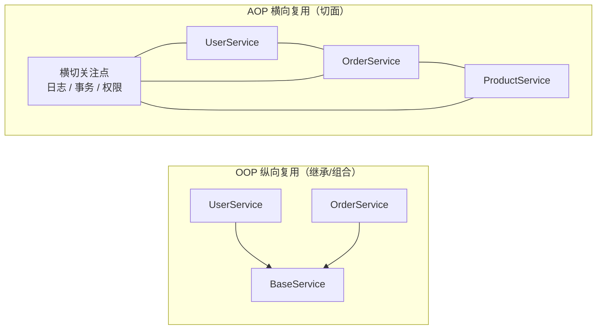
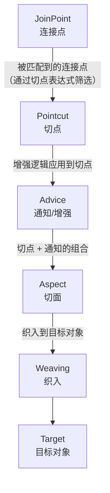
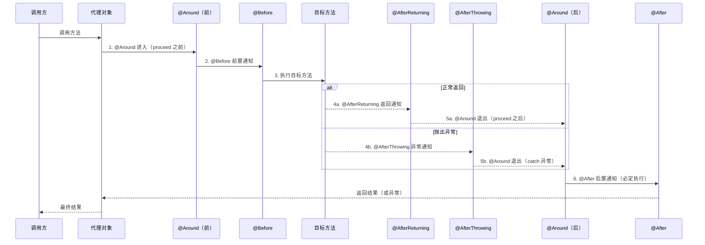
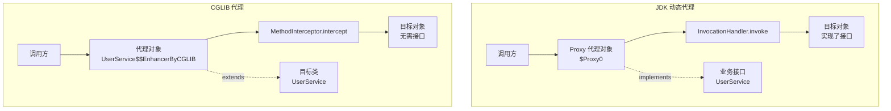
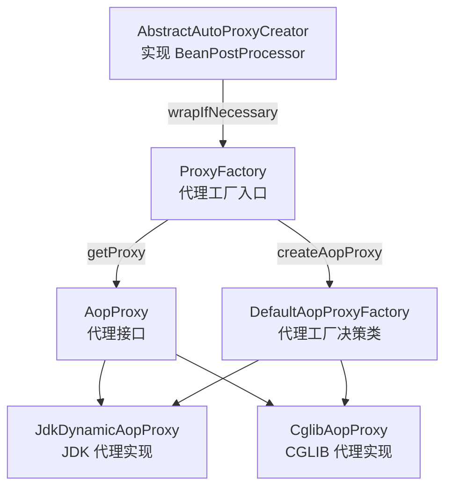
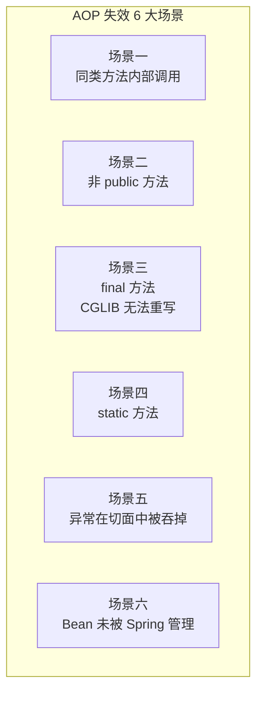
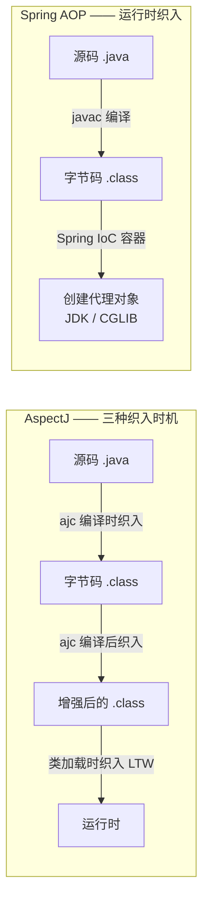

# AOP 原理与实现

## ⭐ 面试重点速览

| 知识模块 | 重点内容 | 面试频率 |
|----------|----------|----------|
| AOP 核心概念 | Aspect / JoinPoint / Pointcut / Advice / Weaving / Target | 极高 |
| 通知类型与执行顺序 | 5 种 Advice 的执行顺序、@Around 环绕通知 | 极高 |
| JDK vs CGLIB 代理 | 原理区别、Spring 选择策略、ProxyFactory 源码 | 极高 |
| AOP 失效场景 | 同类调用、非 public、final/static 方法、异常被吞等 6 种场景 | 高 |
| AspectJ vs Spring AOP | 编译时织入 vs 运行时代理、LTW、性能对比 | 中高 |
| 源码关键类 | ProxyFactory / AopProxy / JdkDynamicAopProxy / CglibAopProxy | 中高 |

---

## 一、AOP 核心概念

### 1.1 什么是 AOP？

**AOP（Aspect-Oriented Programming，面向切面编程）** 是对 OOP（面向对象编程）的补充。OOP 通过继承/组合实现纵向的代码复用，而 AOP 通过"横切"的方式提取散布在各模块中的**横切关注点**（Cross-cutting Concerns），如日志、事务、权限、缓存等。



### 1.2 ⭐ 六大核心概念



| 概念 | 说明 | 类比 |
|------|------|------|
| **Aspect（切面）** | 切点 + 通知的集合，横切关注点的模块化 | 一个 `@Aspect` 注解的类 |
| **JoinPoint（连接点）** | 程序执行中的某个点，如方法调用、异常抛出 | 一棵树上的所有树叶 |
| **Pointcut（切点）** | 匹配连接点的谓词/表达式，筛选要增强的点 | 从树叶中筛选出特定叶子 |
| **Advice（通知）** | 在切点处执行的具体增强逻辑（Before / Around 等） | 在筛选出的叶子上做标记 |
| **Weaving（织入）** | 将切面应用到目标对象，创建代理对象的过程 | 把标记好的叶子粘回树上 |
| **Target（目标对象）** | 被代理的原始对象 | 原始的那棵树 |

### 1.3 代码示例：定义切面

```java
// ===== 定义切面 =====
@Aspect        // 声明这是一个切面类
@Component     // 交给 Spring 管理
public class LogAspect {

    // ===== 定义切点：匹配 Service 层所有方法 =====
    @Pointcut("execution(* com.example.service.*.*(..))")
    public void serviceLayer() { }  // 切点签名，方法体为空

    // ===== 前置通知：在切点方法执行前运行 =====
    @Before("serviceLayer()")
    public void before(JoinPoint joinPoint) {
        // 获取目标方法签名
        String methodName = joinPoint.getSignature().getName();
        // 获取方法入参
        Object[] args = joinPoint.getArgs();
        System.out.println(">> 调用方法：" + methodName + "，参数：" + Arrays.toString(args));
    }
}
```

::: tip JoinPoint 常用方法
- `getSignature().getName()` —— 获取方法名
- `getArgs()` —— 获取方法参数数组
- `getTarget()` —— 获取目标对象（原始对象，非代理）
- `getThis()` —— 获取代理对象
:::

---

## 二、5 种通知类型及执行顺序

### 2.1 五种 Advice 说明

| 通知类型 | 注解 | 执行时机 | 是否可拦截返回值 | 是否可阻止执行 |
|----------|------|----------|:---:|:---:|
| **前置通知** | `@Before` | 目标方法执行前 | 否 | 否 |
| **环绕通知** | `@Around` | 目标方法执行前后 | **是** | **是** |
| **后置通知** | `@After` | 目标方法执行后（无论是否异常） | 否 | 否 |
| **返回通知** | `@AfterReturning` | 目标方法正常返回后 | 是（只读） | 否 |
| **异常通知** | `@AfterThrowing` | 目标方法抛出异常后 | 否 | 否 |

### 2.2 完整执行顺序（Mermaid 时序图）



::: danger 关键记忆点
- **正常流程**：`@Around(前) -> @Before -> 目标方法 -> @AfterReturning -> @After -> @Around(后)`
- **异常流程**：`@Around(前) -> @Before -> 目标方法抛异常 -> @AfterThrowing -> @After -> @Around(后)`
- `@After` 类似 `finally`，**无论是否异常都会执行**
- `@AfterReturning` 和 `@AfterThrowing` **互斥**，只会执行其中一个
:::

### 2.3 代码示例：五种通知完整演示

```java
@Aspect
@Component
public class FullAdviceDemo {

    @Pointcut("execution(* com.example.service.OrderService.placeOrder(..))")
    public void orderPointcut() { }

    @Around("orderPointcut()")
    public Object around(ProceedingJoinPoint pjp) throws Throwable {
        System.out.println("1. [@Around 前] 环绕通知开始 —— 可修改参数、决定是否执行目标方法");
        try {
            // proceed() 调用目标方法，相当于 Filter 链中的 chain.doFilter()
            Object result = pjp.proceed();
            System.out.println("5. [@Around 后（正常）] 环绕通知结束 —— 可修改返回值");
            return result;
        } catch (Exception e) {
            System.out.println("5. [@Around 后（异常）] 环绕通知捕获异常：" + e.getMessage());
            throw e; // 可选择吞掉异常或重新抛出
        }
    }

    @Before("orderPointcut()")
    public void before() {
        System.out.println("2. [@Before] 前置通知 —— 在目标方法执行前调用");
    }

    @After("orderPointcut()")
    public void after() {
        System.out.println("6. [@After] 后置通知 —— 类似 finally，无论是否异常都执行");
    }

    @AfterReturning(pointcut = "orderPointcut()", returning = "result")
    public void afterReturning(Object result) {
        System.out.println("4. [@AfterReturning] 返回通知 —— 返回值：" + result);
    }

    @AfterThrowing(pointcut = "orderPointcut()", throwing = "ex")
    public void afterThrowing(Exception ex) {
        System.out.println("4. [@AfterThrowing] 异常通知 —— 异常信息：" + ex.getMessage());
    }
}
```

### 2.4 @Around 的深度解析

```java
// @Around 是最强大的通知 —— 它控制着目标方法是否执行、何时执行
@Around("orderPointcut()")
public Object aroundAdvice(ProceedingJoinPoint pjp) throws Throwable {
    // ===== 阶段 1：目标方法执行前 =====
    Object[] args = pjp.getArgs();
    // 可以修改参数（比如脱敏后再传给目标方法）
    // args[0] = maskSensitive(args[0]);

    // ===== 阶段 2：决定是否执行目标方法 =====
    // 如果注释掉 pjp.proceed()，目标方法不会执行，直接返回 null
    // 这可以实现"权限不足时直接拒绝"的效果
    Object result;
    try {
        result = pjp.proceed(args); // 调用目标方法（带修改后的参数）

        // ===== 阶段 3：目标方法正常返回后 =====
        // 可以修改返回值（比如包装一层统一响应格式）
        // result = Result.success(result);
    } catch (Exception e) {
        // ===== 阶段 4：目标方法抛异常后 =====
        // 可以记录日志、发送告警、转换异常类型
        // 也可以 return 降级值（类似 Hystrix 熔断）
        log.error("方法执行异常", e);
        throw new BusinessException("操作失败", e); // 转换异常类型
    }
    return result;
}
```

::: warning @Around 使用注意事项
1. **必须调用 `pjp.proceed()`**，否则目标方法不会执行
2. **必须返回 `pjp.proceed()` 的结果**（如果是 Object 返回类型），否则调用方得到 null
3. 可以在 `proceed()` 前后做缓存逻辑：缓存命中时跳过 `proceed()` 直接返回缓存值
4. `@Around` 的优先级高于 `@Before` 和 `@After`
:::

---

## 三、⭐ JDK 动态代理 vs CGLIB 代理

### 3.1 两种代理方式原理



### 3.2 核心区别对比

| 维度 | JDK 动态代理 | CGLIB 代理 |
|------|-------------|-----------|
| **实现机制** | 基于反射，通过 `Proxy.newProxyInstance()` 创建 | 基于字节码技术（ASM），动态生成子类 |
| **代理关系** | 代理对象**实现**了目标接口 | 代理对象**继承**了目标类 |
| **前置条件** | 目标类**必须实现接口** | 目标类**不能是 final**，方法不能是 final |
| **性能（创建）** | 较快（JDK 原生反射） | 较慢（需生成字节码） |
| **性能（调用）** | CGLIB 略快（方法索引直接调用） | 早期更快，JDK 8+ 反射已大幅优化 |
| **默认代理方式** | Spring Boot 1.x 默认 | Spring Boot 2.x+ 默认 |
| **$Proxy 命名** | `$Proxy0` 格式 | `XXX$$EnhancerByCGLIB$$xxx` 格式 |

### 3.3 Spring 选择策略

```java
// Spring AOP 自动选择代理方式的默认策略
// 源码位置：DefaultAopProxyFactory.createAopProxy()

public class DefaultAopProxyFactory implements AopProxyFactory {

    @Override
    public AopProxy createAopProxy(AdvisedSupport config) {
        // 条件1：isOptimize() 为 true —— 强制使用 CGLIB
        // 条件2：isProxyTargetClass() 为 true —— 强制使用 CGLIB
        // 条件3：没有用户自定义的 ProxyTargetClass 设置
        if (config.isOptimize() || config.isProxyTargetClass()
                || hasNoUserSuppliedProxyInterfaces(config)) {
            Class<?> targetClass = config.getTargetClass();
            if (targetClass.isInterface() || Proxy.isProxyClass(targetClass)) {
                return new JdkDynamicAopProxy(config);  // 目标是接口 → JDK
            }
            return new ObjenesisCglibAopProxy(config);  // 目标是类 → CGLIB
        }
        return new JdkDynamicAopProxy(config);  // 有接口 → JDK
    }
}
```

::: tip 判定逻辑总结
1. **目标类实现了接口** → 默认使用 JDK 动态代理
2. **目标类没有实现接口** → 使用 CGLIB
3. **设置 `proxyTargetClass = true`** → 强制使用 CGLIB
4. **Spring Boot 2.x 中 `spring.aop.proxy-target-class` 默认为 `true`** → 默认 CGLIB
:::

```java
// ===== 显式指定代理方式 =====
// 方式 1：application.yml
// spring.aop.proxy-target-class=true   # true=CGLIB, false=JDK

// 方式 2：@EnableAspectJAutoProxy 注解
@Configuration
@EnableAspectJAutoProxy(proxyTargetClass = true)  // 强制使用 CGLIB
public class AopConfig { }
```

### 3.4 JDK 动态代理手写 Demo

```java
// ===== JDK 动态代理原理演示（手写版） =====
public class JdkProxyDemo {
    public static void main(String[] args) {
        // 1. 目标对象（必须实现接口）
        UserService target = new UserServiceImpl();

        // 2. 创建代理对象
        //    参数一：类加载器
        //    参数二：目标对象实现的接口数组
        //    参数三：InvocationHandler —— 代理逻辑
        UserService proxy = (UserService) Proxy.newProxyInstance(
            target.getClass().getClassLoader(),
            target.getClass().getInterfaces(),
            new InvocationHandler() {
                @Override
                public Object invoke(Object proxy, Method method, Object[] args) throws Throwable {
                    System.out.println(">> [JDK 代理] 方法执行前：" + method.getName());
                    Object result = method.invoke(target, args); // 反射调用目标方法
                    System.out.println("<< [JDK 代理] 方法执行后：" + method.getName());
                    return result;
                }
            }
        );

        // 3. 通过代理调用 —— 实际上走的是 InvocationHandler.invoke()
        proxy.saveUser("张三");
    }
}
```

### 3.5 CGLIB 代理手写 Demo

```java
// ===== CGLIB 代理原理演示（手写版） =====
public class CglibProxyDemo {
    public static void main(String[] args) {
        // 1. 创建 Enhancer（增强器）
        Enhancer enhancer = new Enhancer();

        // 2. 设置父类 —— CGLIB 通过继承目标类来生成代理
        enhancer.setSuperclass(OrderService.class);

        // 3. 设置回调 —— MethodInterceptor 相当于 JDK 的 InvocationHandler
        enhancer.setCallback(new MethodInterceptor() {
            @Override
            public Object intercept(Object obj, Method method, Object[] args,
                                    MethodProxy proxy) throws Throwable {
                System.out.println(">> [CGLIB 代理] 方法执行前：" + method.getName());
                // proxy.invokeSuper() 调用父类（目标类）的方法 —— 比反射更快
                Object result = proxy.invokeSuper(obj, args);
                System.out.println("<< [CGLIB 代理] 方法执行后：" + method.getName());
                return result;
            }
        });

        // 4. 创建代理对象（是目标类的子类实例）
        OrderService proxy = (OrderService) enhancer.create();
        proxy.placeOrder("order-001");
    }
}
```

### 3.6 源码关键类一览



| 类名 | 作用 |
|------|------|
| `ProxyFactory` | 创建 AOP 代理的入口类，封装代理创建细节 |
| `AopProxy` | 顶层代理接口，`getProxy()` 返回代理对象 |
| `JdkDynamicAopProxy` | JDK 动态代理实现，实现了 `InvocationHandler` |
| `CglibAopProxy` | CGLIB 代理实现，内部使用 `Enhancer` |
| `DefaultAopProxyFactory` | 决策类，根据配置选择 JDK 或 CGLIB |
| `AbstractAutoProxyCreator` | 关键！实现 `BeanPostProcessor`，在 `postProcessAfterInitialization` 阶段自动创建代理 |

---

## 四、AOP 失效的 6 种场景

### 4.1 场景总览



### 4.2 场景一：同类方法内部调用（最高频）

```java
@Service
public class OrderService {

    // ===== 方法 A：有 AOP 增强 =====
    @Transactional  // 事务切面生效
    public void methodA() {
        // ❌ 直接调用 methodB()，走的是 this 引用，不是代理对象
        // this.methodB() 等同于 methodB()，AOP 失效！
        this.methodB();
    }

    // ===== 方法 B：也有 AOP 增强 =====
    @Transactional  // 事务切面失效！
    public void methodB() {
        // 此方法的事务不会被 Spring 管理
    }
}
```

::: danger 根本原因
Spring AOP 基于**代理对象**工作。当 `methodA()` 中调用 `this.methodB()` 时，`this` 指向的是**原始对象**而非代理对象，因此 AOP 拦截器链不会被触发。**代理对象的方法调用才会触发 AOP，原始对象的内部调用不会**。
:::

```java
// ===== 解决方案 =====
@Service
public class OrderService {

    @Autowired
    private OrderService self;  // 注入自己的代理对象

    @Transactional
    public void methodA() {
        // ✅ 通过代理对象调用，AOP 生效！
        self.methodB();
    }

    @Transactional
    public void methodB() {
        // 事务正常生效
    }
}
```

::: warning 自注入的注意事项
- 自注入可能导致循环依赖，需配合 `@Lazy` 注解
- Spring Boot 2.6+ 默认禁止循环依赖，需设置 `spring.main.allow-circular-references=true`
- 更好的做法：将 methodB 抽取到另一个 Service 中
:::

### 4.3 场景二：非 public 方法

```java
@Service
public class UserService {

    // ❌ AOP 对 protected 方法不生效
    @Transactional
    protected void internalUpdate() {
        // JDK 动态代理要求接口方法（必然是 public）
        // CGLIB 代理可以代理 protected 方法，但 Spring 默认不拦截
    }

    // ❌ AOP 对 private 方法不生效
    @Transactional
    private void internalLogic() {
        // JDK 代理：private 方法不在接口中，无法代理
        // CGLIB 代理：private 方法不能被子类重写，无法代理
    }
}
```

### 4.4 场景三：final 方法（CGLIB）

```java
@Service
public class PaymentService {

    // ❌ CGLIB 通过继承实现代理，final 方法不能被重写
    @Transactional
    public final void processPayment() {
        // CGLIB 代理时会跳过此方法，AOP 失效
        // JDK 代理无此限制（基于接口而非继承）
    }
}
```

### 4.5 场景四：static 方法

```java
@Service
public class LogService {

    // ❌ static 方法属于类级别，不属于实例，代理机制无法拦截
    @Transactional
    public static void writeLog() {
        // 无论是 JDK 还是 CGLIB 代理，都无法拦截 static 方法
    }
}
```

### 4.6 场景五：异常在切面中被吞掉

```java
@Aspect
@Component
public class BrokenAspect {

    @Around("execution(* com.example.service.*.*(..))")
    public Object around(ProceedingJoinPoint pjp) {
        try {
            return pjp.proceed();
        } catch (Throwable e) {
            // ❌ 异常被吞掉了！@AfterThrowing 永远收不到异常
            // @Transactional 也感知不到异常，事务不会回滚！
            log.error("出现异常", e);
            return null; // 返回 null 当作正常返回
        }
    }
}
```

### 4.7 场景六：Bean 未被 Spring 管理

```java
// ❌ 没有 @Component/@Service 等注解，Spring 无法管理
public class NotManagedBean {

    @Transactional  // 无效！
    public void doSomething() {
        // 这个对象是 new 出来的，不是从容器中获取的
        // Spring AOP 无从介入
    }

    public static void main(String[] args) {
        NotManagedBean bean = new NotManagedBean(); // new 出来的，不是代理
        bean.doSomething(); // AOP 完全失效
    }
}
```

### 4.8 失效场景速查表

| 场景 | 根本原因 | JDK 代理 | CGLIB 代理 | 解决思路 |
|------|----------|:---:|:---:|------|
| 同类内部调用 | `this` 指向原始对象 | 失效 | 失效 | 自注入代理 / 抽到独立 Bean |
| 非 public 方法 | 代理机制限制 | 失效 | 失效（默认） | 改为 public |
| final 方法 | CGLIB 无法重写 | 正常 | 失效 | 去掉 final / 改用 JDK 代理 |
| static 方法 | 类级别，无法代理 | 失效 | 失效 | 改为实例方法 |
| 异常被吞 | 事务靠异常回滚 | 失效 | 失效 | 重新抛出异常 |
| Bean 不受管理 | `new` 创建的实例 | 失效 | 失效 | 通过容器获取 Bean |

---

## 五、AspectJ 与 Spring AOP 的区别

### 5.1 核心区别

| 维度 | Spring AOP | AspectJ |
|------|-----------|---------|
| **织入时机** | **运行时**（通过动态代理） | **编译时 / 编译后 / 类加载时** |
| **织入方式** | 基于代理（JDK 动态代理 / CGLIB） | 基于字节码修改（ajc 编译器） |
| **连接点范围** | 仅支持**方法执行** | 支持**构造器调用、字段访问/赋值、static 初始化、方法执行**等 |
| **性能** | 有代理层开销 | 无代理层，更接近原生性能 |
| **依赖** | 只需 Spring AOP 模块 | 需 AspectJ 编译器（ajc）或加载时织入（LTW） |
| **对 POJO 的侵入性** | 完全无侵入 | 编译时织入无侵入，但需特殊编译器 |
| **使用复杂度** | 简单 | 较复杂 |

### 5.2 织入时机对比



### 5.3 AspectJ 的 LTW（Load-Time Weaving）

```xml
<!-- ===== 开启 AspectJ LTW（加载时织入） ===== -->
<!-- spring-config.xml -->
<context:load-time-weaver aspectj-weaving="on"/>

<!-- 或使用注解方式 -->
@Configuration
@EnableLoadTimeWeaving(aspectjWeaving = ENABLED)
public class AopConfig { }
```

```java
// ===== aop.xml（META-INF 下的 AspectJ 配置文件） =====
// <aspectj>
//     <weaver>
//         <!-- 指定要织入的包 -->
//         <include within="com.example.service.*"/>
//     </weaver>
//     <aspects>
//         <aspect name="com.example.aop.LogAspect"/>
//     </aspects>
// </aspectj>
```

### 5.4 Spring AOP 与 AspectJ 的切点表达式语法

Spring AOP 使用 **AspectJ 的切点表达式语法**，但能力有限制：

```java
// ===== 常用切点表达式 =====
@Pointcut("execution(* com.example.service.*.*(..))")       // 方法执行
@Pointcut("within(com.example.service.*)")                   // 类级别
@Pointcut("this(com.example.service.UserService)")           // 代理对象类型
@Pointcut("target(com.example.service.UserService)")         // 目标对象类型
@Pointcut("@annotation(org.springframework.transaction.annotation.Transactional)") // 注解匹配
@Pointcut("@within(org.springframework.stereotype.Service)") // 类注解匹配
@Pointcut("args(java.lang.String)")                          // 参数类型匹配
@Pointcut("bean(orderService)")                              // Bean 名称匹配（Spring 独有）
```

::: warning 注意
- Spring AOP 的 `execution` 只支持方法执行，AspectJ 还支持构造器、字段等
- `bean()` 是 Spring AOP 独有的，AspectJ 中没有
- Spring AOP 不支持 `call()`、`get()`、`set()` 等 AspectJ 独有的切点指示符
:::

### 5.5 选型建议

| 场景 | 推荐方案 |
|------|----------|
| 一般业务 AOP（事务、日志、权限） | **Spring AOP**（简单够用） |
| 需要增强 final 类 / private 方法 | **AspectJ**（Spring AOP 无法处理） |
| 需要增强构造器、静态方法 | **AspectJ**（Spring AOP 不支持） |
| 对性能要求极高 | **AspectJ**（编译时织入，无代理开销） |
| Spring Boot 项目、团队简单 | **Spring AOP**（零配置、上手快） |

---

## 六、AOP 实战场景

### 6.1 场景一：统一日志记录

```java
@Aspect
@Component
public class ControllerLogAspect {

    @Around("@annotation(org.springframework.web.bind.annotation.RequestMapping)")
    public Object logAround(ProceedingJoinPoint pjp) throws Throwable {
        long start = System.currentTimeMillis();
        String method = pjp.getSignature().toShortString();
        Object[] args = pjp.getArgs();

        log.info(">> 请求开始：{}，参数：{}", method, args);
        try {
            Object result = pjp.proceed();
            long cost = System.currentTimeMillis() - start;
            log.info("<< 请求结束：{}，耗时：{}ms，结果：{}", method, cost, result);
            return result;
        } catch (Exception e) {
            long cost = System.currentTimeMillis() - start;
            log.error("<< 请求异常：{}，耗时：{}ms，异常：{}", method, cost, e.getMessage());
            throw e;
        }
    }
}
```

### 6.2 场景二：基于注解的权限校验

```java
// ===== 1. 自定义注解 =====
@Target(ElementType.METHOD)
@Retention(RetentionPolicy.RUNTIME)
public @interface RequirePermission {
    String value();  // 权限标识，如 "user:delete"
}

// ===== 2. 切面处理 =====
@Aspect
@Component
public class PermissionAspect {

    @Around("@annotation(requirePermission)")
    public Object checkPermission(ProceedingJoinPoint pjp,
                                  RequirePermission requirePermission) throws Throwable {
        String permission = requirePermission.value();
        // 从上下文获取当前用户（Session / JWT / ThreadLocal 等）
        User currentUser = UserContextHolder.getCurrentUser();
        if (currentUser == null || !currentUser.hasPermission(permission)) {
            throw new AccessDeniedException("缺少权限：" + permission);
        }
        return pjp.proceed();
    }
}

// ===== 3. 使用 =====
@RestController
public class UserController {
    @RequirePermission("user:delete")
    @DeleteMapping("/users/{id}")
    public Result deleteUser(@PathVariable Long id) {
        // 只有拥有 user:delete 权限的用户才能执行
        userService.delete(id);
        return Result.success();
    }
}
```

### 6.3 场景三：分布式锁注解

```java
@Target(ElementType.METHOD)
@Retention(RetentionPolicy.RUNTIME)
public @interface RedisLock {
    String key();        // 锁的 key，支持 SpEL 表达式
    long waitTime() default 3;   // 等待超时（秒）
    long leaseTime() default 10; // 持有超时（秒）
}

@Aspect
@Component
public class RedisLockAspect {

    @Autowired
    private RedissonClient redissonClient;

    @Around("@annotation(redisLock)")
    public Object around(ProceedingJoinPoint pjp, RedisLock redisLock) throws Throwable {
        // 解析 SpEL 获取锁的 key（简化示例，实际需 SpEL 解析器）
        String lockKey = redisLock.key();
        RLock lock = redissonClient.getLock(lockKey);

        boolean acquired = lock.tryLock(redisLock.waitTime(), 
                                         redisLock.leaseTime(), TimeUnit.SECONDS);
        if (!acquired) {
            throw new RuntimeException("获取分布式锁失败：" + lockKey);
        }
        try {
            return pjp.proceed();
        } finally {
            if (lock.isHeldByCurrentThread()) {
                lock.unlock();
            }
        }
    }
}
```

---

## ⭐ 面试高频问题汇总

### Q1：请用一句话解释什么是 AOP，它解决了什么问题？

AOP（面向切面编程）通过将散布在各模块中的**横切关注点**（日志、事务、权限等）抽取到独立的**切面**中，实现业务逻辑与横切逻辑的解耦。核心思想是：**在运行时动态地将增强逻辑"织入"到目标方法中，而无需修改目标代码**。

---

### Q2：Spring AOP 与 AspectJ 有什么区别？如何选择？

| 维度 | Spring AOP | AspectJ |
|------|-----------|---------|
| 织入时机 | 运行时（动态代理） | 编译时/类加载时（字节码修改） |
| 连接点 | 仅方法执行 | 方法/构造器/字段/初始化等 |
| 性能 | 有代理开销 | 接近原生 |
| 复杂度 | 简单 | 复杂 |

**选择原则**：
- 需求简单（事务、日志、权限） → **Spring AOP**
- 需要增强 final 类、private 方法、构造器 → **AspectJ**
- 性能敏感场景 → **AspectJ 编译时织入**

---

### Q3：JDK 动态代理和 CGLIB 代理的原理和区别？Spring 如何选择？

**JDK 动态代理**：基于反射，通过 `Proxy.newProxyInstance()` 创建代理对象，要求目标类**必须实现接口**。代理对象实现了目标接口，方法调用转发到 `InvocationHandler.invoke()`。

**CGLIB 代理**：基于字节码技术（ASM），通过 `Enhancer` 动态生成**目标类的子类**，重写父类方法。要求目标类和方法**不能是 final**。

**Spring 选择策略**（`DefaultAopProxyFactory.createAopProxy()`）：
1. 目标类实现了接口 → 默认 JDK 代理
2. 目标类未实现接口 → CGLIB 代理
3. `proxyTargetClass = true` → 强制 CGLIB
4. Spring Boot 2.x 默认 `proxy-target-class=true` → 默认 CGLIB

---

### Q4：五种 Advice 的执行顺序是怎样的？

**正常返回流程**：
`@Around(前) -> @Before -> 目标方法 -> @AfterReturning -> @After -> @Around(后)`

**异常流程**：
`@Around(前) -> @Before -> 目标方法抛异常 -> @AfterThrowing -> @After -> @Around(后)`

关键记忆：
- `@After` 类似 `finally`，**无论是否异常都执行**
- `@AfterReturning` 和 `@AfterThrowing` **互斥**
- `@Around` 必须显式调用 `pjp.proceed()` 才能触发目标方法

---

### Q5：AOP 在什么情况下会失效？请列举至少 5 种场景。

1. **同类方法内部调用**：`this.methodB()` 走的是原始对象，不走代理
2. **非 public 方法**：JDK 代理仅代理接口方法（public），CGLIB 默认不代理非 public
3. **final 方法**：CGLIB 通过继承实现，final 方法无法重写
4. **static 方法**：属于类级别，代理机制基于实例，无法拦截
5. **异常在 @Around 中被吞掉**：事务回滚依赖异常传播，吞掉异常导致事务不回滚
6. **Bean 非 Spring 管理**：`new` 出来的对象不经过 Spring 容器，无代理

---

### Q6：`BeanPostProcessor` 和 `AbstractAutoProxyCreator` 是什么关系？AOP 代理何时创建？

**关系**：`AbstractAutoProxyCreator` 是 `BeanPostProcessor` 的子类实现，专门负责 AOP 代理的自动创建。

**创建时机**：在 Bean 生命周期的 **`postProcessAfterInitialization`** 阶段。当 Bean 初始化完成后，`AbstractAutoProxyCreator` 检查该 Bean 是否需要 AOP 增强（匹配切点表达式），如需则创建代理对象。

**关键**：存入 Spring 单例池（`singletonObjects`）的是**代理对象**，而非原始 Bean。

---

### Q7：Spring AOP 为什么只支持方法级别的连接点？

因为 Spring AOP 基于**动态代理**实现。JDK 代理只能代理接口方法，CGLIB 代理只能代理可重写的实例方法。构造器调用、字段访问、静态方法等无法被代理拦截。如果确实需要更细粒度的连接点支持，应使用 AspectJ。

---

### Q8：@Transactional 失效的场景有哪些？和 AOP 失效有什么关系？

`@Transactional` 本质上是通过 Spring AOP 实现的（`TransactionInterceptor`），所以 **AOP 失效 = @Transactional 失效**。

典型失效场景：
1. **同类方法内部调用** —— 最常见，内部调用绕过代理
2. **非 public 方法** —— Spring 事务默认只对 public 方法生效
3. **异常被 try-catch 吞掉** —— 事务回滚靠感知异常
4. **rollbackFor 未配置** —— 默认只回滚 RuntimeException 和 Error
5. **数据库引擎不支持事务** —— 如 MyISAM

---

### Q9：`@Async` 注解为什么有时候不生效？和 AOP 有什么关系？

`@Async` 同样基于 Spring AOP 实现，所以 AOP 失效场景对其同样适用。特别常见的：
- 同类方法内部调用 `this.asyncMethod()` —— 不走代理，异步失效
- Spring Boot 中未启用 `@EnableAsync`

**解决**：将异步方法抽到独立的 Service 中，或通过 `ApplicationContext.getBean()` 获取代理对象调用。

---

### Q10：如何手写一个简易 AOP 框架？

核心步骤：
1. **代理工厂**：根据目标类选择 JDK 或 CGLIB 创建代理
2. **拦截器链**：将多个 Advice 封装成拦截器链（类似 Filter 链）
3. **切点匹配**：通过 AspectJ 切点表达式判断方法是否需要代理
4. **方法调用**：在代理对象中，按顺序执行拦截器链，最后调用目标方法

```java
// 简易 AOP 核心逻辑示意
public Object invoke(Object proxy, Method method, Object[] args) {
    // 1. 切点匹配：判断当前方法是否需要增强
    if (!pointcut.matches(method)) {
        return method.invoke(target, args); // 不需要增强，直接调用
    }
    // 2. 执行拦截器链（Before -> 目标方法 -> After）
    invokeBeforeAdvices();            // @Before
    try {
        Object result = method.invoke(target, args); // 目标方法
        invokeAfterReturning(result); // @AfterReturning
        return result;
    } catch (Exception e) {
        invokeAfterThrowing(e);       // @AfterThrowing
        throw e;
    } finally {
        invokeAfter();                // @After (finally)
    }
}
```

---

## 面试追问环节

**Q：Spring AOP 和 MyBatis 插件的实现原理有什么异同？**

两者都基于**动态代理**：
- Spring AOP：通过 `ProxyFactory` + `JdkDynamicAopProxy/CglibAopProxy`，在 Bean 后置处理器中集中创建代理
- MyBatis 插件：通过 `Plugin.wrap()` + `InvocationHandler`，为 Executor、StatementHandler 等组件创建代理

**核心区别**：Spring AOP 使用**切点表达式匹配**决定是否增强；MyBatis 插件使用 `@Intercepts` + `@Signature` 注解指定拦截的方法签名。Spring AOP 更灵活，MyBatis 插件更简单直接。

**Q：为什么 Spring 不用 AspectJ 的编译时织入作为默认方案？**

1. **零侵入**：Spring AOP 不需要特殊编译器（ajc），对开发流程无影响
2. **IoC 天然集成**：Spring AOP 在 Bean 初始化阶段创建代理，与容器无缝配合
3. **简单够用**：90% 的 AOP 场景（事务、日志、权限）只需方法级别增强
4. **动态性**：运行时决定是否代理，无需重新编译

**Q：Spring Boot 2.x 为什么默认改为 CGLIB 代理？**

1. **接口无法注入**：`@Autowired` 注入具体类（非接口）时，JDK 代理会因类型不匹配失败
2. **更符合直觉**：开发者往往注入的是**实现类**而非接口类型
3. **减少配置**：不需要每次显式设置 `proxyTargetClass = true`

---

## 附录：AOP 核心配置速查

```properties
# ===== application.properties 中 AOP 相关配置 =====

# 1. 强制使用 CGLIB 代理（Spring Boot 2.x 默认为 true）
spring.aop.proxy-target-class=true

# 2. 启用 @AspectJ 注解支持（Spring Boot 默认已启用）
# 等同于 @EnableAspectJAutoProxy

# 3. 是否暴露代理对象到 AopContext（用于同类调用自救）
spring.aop.auto=true
# 配合代码：((XxxService) AopContext.currentProxy()).methodB()
```