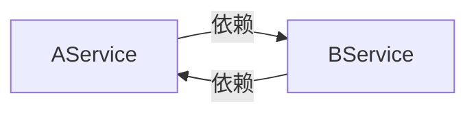
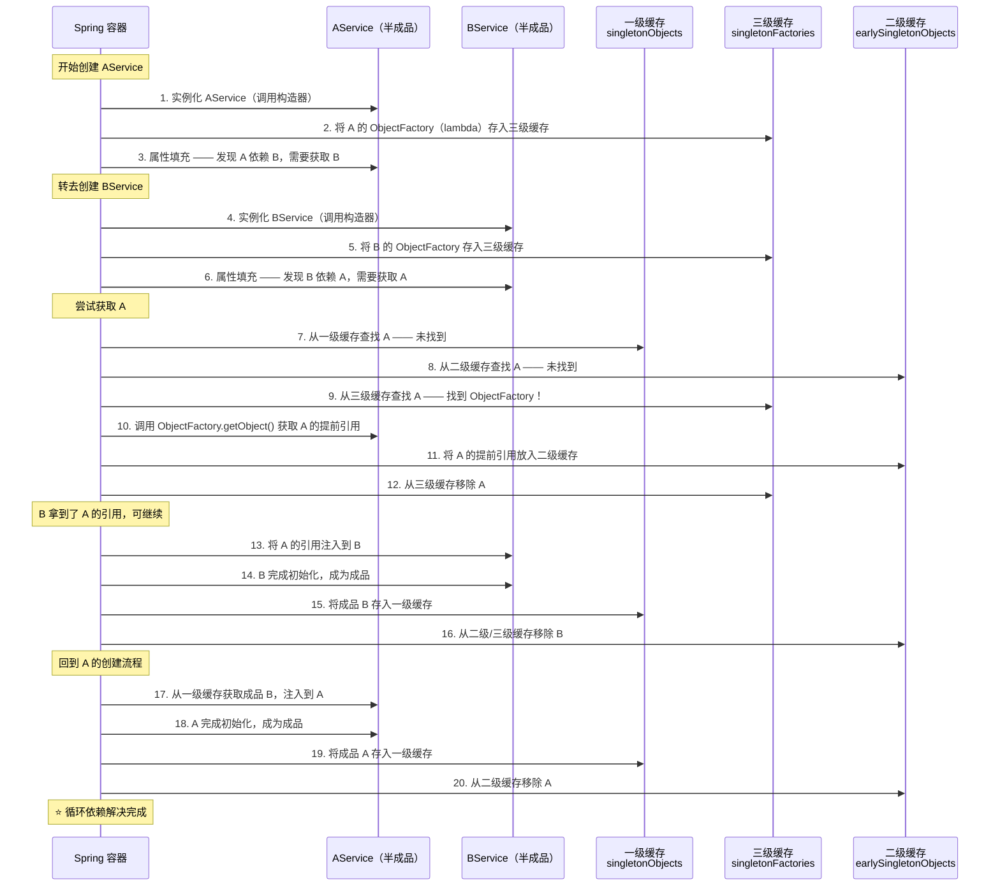
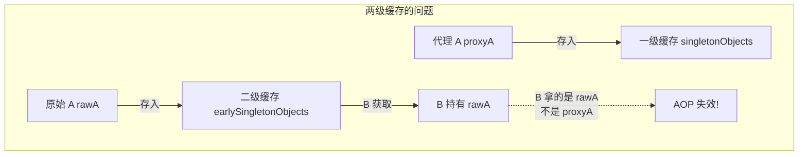
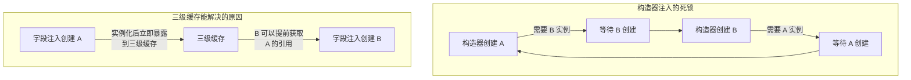

# 依赖注入与循环依赖

## ⭐ 面试重点速览

| 知识模块 | 重点内容 | 面试频率 |
|----------|----------|----------|
| @Autowired vs @Resource | 注入方式、byType vs byName、来源规范 | 极高 |
| 三种注入方式对比 | 构造器注入、Setter 注入、字段注入 | 极高 |
| 三级缓存机制 | singletonObjects、earlySingletonObjects、singletonFactories | 极高 |
| 三级 vs 两级缓存 | AOP 代理对象循环依赖的解决 | 高 |
| 构造器注入循环依赖 | 无法解决的原因、@Lazy 延迟注入策略 | 高 |
| 原型 Bean 循环依赖 | 无法解决的底层原因 | 中 |
| 源码调用链 | DefaultSingletonBeanRegistry#getSingleton | 高 |

---

## 一、@Autowired 与 @Resource 的区别

### 1.1 来源与规范

| 维度 | @Autowired | @Resource |
|------|-----------|-----------|
| **来源** | Spring 框架（`org.springframework.beans.factory.annotation`） | JDK 标准（`javax.annotation.Resource`，JSR-250） |
| **注入策略** | 默认 **byType**（按类型匹配） | 默认 **byName**（按名称匹配），找不到再 fallback to byType |
| **可配置性** | 配合 `@Qualifier` 实现 byName | 通过 `name` 属性指定 Bean 名称 |
| **作用位置** | 字段、构造器、Setter 方法、普通方法、参数 | 字段、Setter 方法（不支持构造器、普通方法） |
| **required 属性** | `@Autowired(required = false)` | 默认行为由容器决定 |

### 1.2 工作原理对比

```java
// ===== @Autowired：默认 byType，配合 @Qualifier 实现 byName =====
@Service
public class OrderService {

    // 情况1：byType —— 容器中只有一个 UserDao 实现类
    @Autowired
    private UserDao userDao; // Spring 按类型 UserDao 找到唯一 Bean 并注入

    // 情况2：byType 失败 + @Qualifier 辅助 byName
    @Autowired
    @Qualifier("userDaoImplV2") // 多个 UserDao 实现类时，按名称精确指定
    private UserDao userDaoV2;

    // 情况3：required = false —— 找不到也不报错，值为 null
    @Autowired(required = false)
    private LogService logService; // 可能不存在此 Bean，允许为空
}

// ===== @Resource：默认 byName，找不到时 fallback to byType =====
@Service
public class ProductService {

    // 情况1：byName —— 按字段名 "productDao" 匹配 Bean
    @Resource
    private ProductDao productDao; // 先找名为 "productDao" 的 Bean

    // 情况2：显式指定 name
    @Resource(name = "productDaoV2")
    private ProductDao productDao; // 严格按名称 "productDaoV2" 匹配

    // 情况3：byName 失败 → fallback to byType
    @Resource
    private ProductMapper productMapper; // 先找 "productMapper"，找不到按类型找
}
```

### 1.3 注入策略选择建议

::: tip 实际项目选择建议
- **团队统一规范**：优先 `@Resource`，因为是 JDK 标准，减少对 Spring 的耦合；或统一 `@Autowired`，配合 `@Qualifier`，团队保持一致即可
- **需要可选注入**：使用 `@Autowired(required = false)`
- **多个同类型 Bean**：`@Autowired` + `@Qualifier` 或 `@Resource(name = "...")`
- **构造器注入**：只能使用 `@Autowired`（`@Resource` 不支持构造器）
:::

### 1.4 @Autowired 底层解析流程

Spring 通过 `DefaultListableBeanFactory#resolveDependency` 完成自动注入，核心流程如下：

```java
// @Autowired 解析依赖的简化流程
// 入口：DefaultListableBeanFactory#doResolveDependency

// Step 1：按类型查找所有匹配的 Bean（byType）
Map<String, Object> matchingBeans = findAutowireCandidates(beanName, type, descriptor);

// Step 2：如果只有一个匹配，直接注入
if (matchingBeans.size() == 1) {
    return matchingBeans.values().iterator().next();
}

// Step 3：如果有多个匹配，尝试按名称精选（@Qualifier 或字段名）
if (matchingBeans.size() > 1) {
    // 优先使用 @Qualifier 指定的名称
    // 其次使用字段名/方法参数名作为 Bean 名称
    String autowiredBeanName = determineAutowireCandidate(matchingBeans, descriptor);
    if (autowiredBeanName != null) {
        return matchingBeans.get(autowiredBeanName);
    }
    // 仍无法确定 → 抛出 NoUniqueBeanDefinitionException
}

// Step 4：如果没有任何匹配，检查 required 属性
if (descriptor.isRequired()) {
    throw new NoSuchBeanDefinitionException(type);
}
return null; // required = false 时返回 null
```

```mermaid
graph TD
    A[@Autowired 解析依赖] --> B{按类型查找<br/>byType}
    B -->|找到 1 个| C[直接注入]
    B -->|找到 0 个| D{required 属性?}
    D -->|true| E[抛出异常<br/>NoSuchBeanDefinitionException]
    D -->|false| F[注入 null]
    B -->|找到多个| G{有 @Qualifier?}
    G -->|是| H[按 @Qualifier 名称<br/>精选注入]
    G -->|否| I{字段名匹配?}
    I -->|匹配成功| J[按字段名注入]
    I -->|匹配失败| K[抛出异常<br/>NoUniqueBeanDefinitionException]
```

---

## 二、三种注入方式深度对比

### 2.1 对比总览

| 维度 | 构造器注入 | Setter 注入 | 字段注入 |
|------|-----------|-------------|----------|
| **实现方式** | `public A(B b) { this.b = b; }` | `public void setB(B b) { this.b = b; }` | `@Autowired private B b;` |
| **依赖不可变性** | 支持 `final`，不可变 | 可变，运行时可能被修改 | 可变，反射注入 |
| **强制依赖** | 强制，构造时必须传入 | 非强制，可能漏设 | 非强制，可能为 null |
| **单元测试友好** | 直接 new 传 mock | 手动 set mock | 需要反射/启动容器 |
| **循环依赖** | 无法解决（构造时即死锁） | 可解决（先创建再注入） | 可解决（与 Setter 同理） |
| **Spring 官方推荐** | ⭐⭐⭐ 强烈推荐 | ⭐⭐ 可选依赖时 | ⭐ 不推荐 |
| **代码简洁度** | 构造参数多时冗长 | 方法较多 | 非常简洁 |

### 2.2 代码对比示例

```java
// ===== 1. 构造器注入（⭐ 官方推荐）=====
@Service
public class OrderService {
    private final OrderDao orderDao;       // final：不可变，线程安全
    private final PaymentService paymentService; // final：保证不为 null

    // Spring 4.3+ 单构造器时 @Autowired 可省略
    public OrderService(OrderDao orderDao, PaymentService paymentService) {
        this.orderDao = orderDao;
        this.paymentService = paymentService;
    }

    public void createOrder(Order order) {
        orderDao.save(order);              // 一定能调用 —— 构造器保证了不为 null
        paymentService.pay(order);
    }
}

// 使用 Lombok 简化
@Service
@RequiredArgsConstructor // 为所有 final 字段生成构造器
public class OrderService {
    private final OrderDao orderDao;
    private final PaymentService paymentService;
}

// ===== 2. Setter 注入（可选依赖场景）=====
@Service
public class OrderService {
    private OrderDao orderDao;
    private PaymentService paymentService;

    // Setter 注入：可以在运行时动态替换依赖
    @Autowired
    public void setOrderDao(OrderDao orderDao) {
        this.orderDao = orderDao;
    }

    @Autowired(required = false) // 可选依赖：支付服务可能不存在
    public void setPaymentService(PaymentService paymentService) {
        this.paymentService = paymentService;
    }

    public void createOrder(Order order) {
        orderDao.save(order);
        if (paymentService != null) {      // 必须判空！
            paymentService.pay(order);
        }
    }
}

// ===== 3. 字段注入（不推荐）=====
@Service
public class OrderService {
    @Autowired
    private OrderDao orderDao;             // 反射注入，无法用 final
    @Autowired
    private PaymentService paymentService; // 单元测试时无法 mock

    public void createOrder(Order order) {
        // orderDao 可能为 null —— 编译器无法检查
        orderDao.save(order);
    }
}
```

### 2.3 单元测试友好度对比

```java
// 构造器注入的单元测试 —— 最简单
@Test
void testCreateOrder() {
    OrderDao mockDao = mock(OrderDao.class);
    PaymentService mockPayment = mock(PaymentService.class);

    // 直接 new + 传入 mock，零 Spring 依赖
    OrderService service = new OrderService(mockDao, mockPayment);
    service.createOrder(new Order());
    verify(mockDao).save(any());
}

// 字段注入的单元测试 —— 必须借助 Mockito 框架注入
@Test
void testCreateOrder() {
    // 需要 @InjectMocks + @Mock 注解，依赖 Mockito 框架
    @InjectMocks
    OrderService service;
    @Mock
    OrderDao orderDao;

    // 或者手动反射注入 mock —— 麻烦、脆弱
}
```

::: danger 字段注入的致命缺陷
1. **无法使用 `final` 修饰**：依赖可能被意外修改
2. **破坏单一职责原则**：注入太容易导致类注入过多依赖而不自知
3. **隐藏循环依赖**：字段注入的循环依赖不会在启动时报错，运行时才暴露
4. **无法在构造器中使用注入的依赖**：构造器执行时字段尚未注入
:::

---

## 三、⭐ 循环依赖三级缓存机制（源码级分析）

### 3.1 什么是循环依赖？

```java
// 典型循环依赖场景
@Service
public class AService {
    @Autowired
    private BService bService; // A 依赖 B
}

@Service
public class BService {
    @Autowired
    private AService aService; // B 依赖 A
}
// 创建 A → 发现需要 B → 创建 B → 发现需要 A → 形成闭环
```



Spring 只解决 **singleton（单例）作用域**的 Setter 注入 / 字段注入的循环依赖，通过**三级缓存**机制实现。

### 3.2 三级缓存定义（源码）

在 `DefaultSingletonBeanRegistry` 中定义了三个核心 Map：

```java
public class DefaultSingletonBeanRegistry extends SimpleAliasRegistry {

    /** 一级缓存：存放完全创建好的成品 Bean（即完成所有生命周期的 Bean） */
    private final Map<String, Object> singletonObjects = new ConcurrentHashMap<>(256);

    /** 二级缓存：存放提前暴露的半成品 Bean（已实例化但未完成属性填充和初始化） */
    private final Map<String, Object> earlySingletonObjects = new HashMap<>(16);

    /** 三级缓存：存放 Bean 的 ObjectFactory 工厂（用于生成半成品 Bean 的提前引用） */
    private final Map<String, ObjectFactory<?>> singletonFactories = new HashMap<>(16);

    /** 存放正在创建中的 Bean 名称（用于检测循环依赖） */
    private final Set<String> singletonsCurrentlyInCreation = Collections.newSetFromMap(
        new ConcurrentHashMap<>(16));
}
```

| 缓存级别 | 名称 | 存放内容 | 比喻 |
|----------|------|----------|------|
| **一级** | `singletonObjects` | 完全初始化的成品 Bean | 成品仓库 |
| **二级** | `earlySingletonObjects` | 已实例化但未初始化的半成品 Bean | 半成品暂存区 |
| **三级** | `singletonFactories` | `ObjectFactory` 工厂，生产半成品/代理对象 | 加工车间 |

### 3.3 Mermaid 流程图：A依赖B、B依赖A 的解决全过程



### 3.4 核心源码流程（DefaultSingletonBeanRegistry#getSingleton）

```java
// Spring 获取单例 Bean 的核心方法（简化版，关键逻辑加中文注释）
public class DefaultSingletonBeanRegistry extends SimpleAliasRegistry {

    // 三个核心缓存
    private final Map<String, Object> singletonObjects = new ConcurrentHashMap<>(256);       // 一级：成品
    private final Map<String, Object> earlySingletonObjects = new HashMap<>(16);             // 二级：半成品
    private final Map<String, ObjectFactory<?>> singletonFactories = new HashMap<>(16);      // 三级：工厂

    /**
     * 获取单例 Bean 的核心方法
     * @param beanName Bean 名称
     * @param singletonFactory 创建 Bean 的回调（lambda 表达式）
     */
    protected Object getSingleton(String beanName, boolean allowEarlyReference) {
        // ===== Step 1：从一级缓存（成品库）获取 =====
        Object singletonObject = this.singletonObjects.get(beanName);
        if (singletonObject == null && isSingletonCurrentlyInCreation(beanName)) {
            // 一级缓存没有，且这个 Bean 正在创建中 → 说明可能发生了循环依赖

            // ===== Step 2：从二级缓存（半成品暂存区）获取 =====
            singletonObject = this.earlySingletonObjects.get(beanName);
            if (singletonObject == null && allowEarlyReference) {
                // 二级缓存也没有 → 尝试从三级缓存获取

                // ===== Step 3：从三级缓存获取 ObjectFactory 并生产半成品 =====
                ObjectFactory<?> singletonFactory = this.singletonFactories.get(beanName);
                if (singletonFactory != null) {
                    // 调用工厂方法生成 Bean 的提前引用（可能是原始对象或 AOP 代理）
                    singletonObject = singletonFactory.getObject();

                    // 升级：将生产的半成品放入二级缓存
                    this.earlySingletonObjects.put(beanName, singletonObject);
                    // 销毁三级缓存中的工厂（工厂已使用完毕）
                    this.singletonFactories.remove(beanName);
                }
            }
        }
        return singletonObject;
    }
}
```

### 3.5 提前暴露工厂的时机

在 `AbstractAutowireCapableBeanFactory#doCreateBean` 中，实例化 Bean 后**立即**将工厂放入三级缓存：

```java
// AbstractAutowireCapableBeanFactory#doCreateBean（简化）
protected Object doCreateBean(String beanName, RootBeanDefinition mbd, Object[] args) {

    // Step 1：实例化 —— 调用构造器创建 Bean 实例
    BeanWrapper instanceWrapper = createBeanInstance(beanName, mbd, args);
    Object bean = instanceWrapper.getWrappedInstance();

    // Step 2：⭐ 提前暴露 —— 将 ObjectFactory 放入三级缓存
    // 此时 Bean 只是空壳，属性尚未填充，但已经可以被其他 Bean 引用
    if (earlySingletonExposure) {
        addSingletonFactory(beanName, () -> getEarlyBeanReference(beanName, mbd, bean));
        // ↑ 这个 lambda 就是三级缓存中的 ObjectFactory
        // 当其他 Bean 需要此 Bean 的引用时，调用此 lambda 获取提前引用
    }

    // Step 3：属性填充 —— 注入依赖（此处可能触发循环依赖的解决）
    populateBean(beanName, mbd, instanceWrapper);

    // Step 4：初始化 —— @PostConstruct、InitializingBean 等
    initializeBean(beanName, exposedObject, mbd);

    // Step 5：注册销毁回调
    registerDisposableBeanIfNecessary(beanName, bean, mbd);

    return exposedObject;
}
```

::: tip 关键理解
`addSingletonFactory` 在**实例化之后、属性填充之前**调用。这就是 Spring 能够解决循环依赖的根本原因 —— 在注入依赖属性之前，先把"自己能生成提前引用的能力"暴露出去。
:::

### 3.6 缓存迁移过程总结

```
创建 A 的过程：
┌─────────────────────────────────────────────────────┐
│ 1. 实例化 A → 空壳对象                                │
│ 2. A 的 ObjectFactory 进入【三级缓存】                 │
│ 3. 填充属性 → 发现需要 B → 暂停 A，去创建 B             │
│                                                       │
│    创建 B 的过程：                                     │
│    3a. 实例化 B → 空壳对象                              │
│    3b. B 的 ObjectFactory 进入【三级缓存】              │
│    3c. 填充属性 → 发现需要 A → 去获取 A                  │
│    3d. 一级缓存找 A → 无                                │
│    3e. 二级缓存找 A → 无                                │
│    3f. 三级缓存找 A → 找到！调用 getObject()             │
│    3g. A 的引用 → 放入【二级缓存】，移除三级缓存           │
│    3h. 将 A 注入到 B 中                                │
│    3i. B 完成初始化 → 放入【一级缓存】，清除二级/三级      │
│                                                       │
│ 4. 从一级缓存获取成品 B → 注入到 A                       │
│ 5. A 完成初始化 → 放入【一级缓存】，清除二级缓存          │
└─────────────────────────────────────────────────────┘
```

---

## 四、⭐ 为什么需要三级缓存而不是两级？

### 4.1 核心问题：AOP 代理对象

这是面试中最容易被追问的知识点。如果只使用两级缓存，普通对象的循环依赖可以解决，但**涉及 AOP 的循环依赖**会出现问题。

### 4.2 场景分析：A 需要被 AOP 代理

```java
@Service
public class AService {
    @Autowired
    private BService bService;

    @Transactional // ← A 需要被 AOP 代理，生成代理对象
    public void doSomething() {
        bService.help();
    }
}

@Service
public class BService {
    @Autowired
    private AService aService; // B 依赖 A

    public void help() {
        aService.doSomething();
    }
}
```

### 4.3 如果只有两级缓存的困境

```
如果只有两级缓存（singletonObjects + earlySingletonObjects）：

Step 1: 实例化 A → 得到原始对象 rawA
Step 2: 将 rawA 放入二级缓存 earlySingletonObjects  ← 问题！存的是原始对象
Step 3: B 从二级缓存获取 A → 拿到 rawA（原始对象）
Step 4: B 使用 rawA 进行属性注入
Step 5: A 完成初始化 → postProcessAfterInitialization 阶段生成 AOP 代理 proxyA
Step 6: proxyA 放入一级缓存 singletonObjects

结果：B 中注入的是 rawA（原始对象），但一级缓存中是 proxyA（代理对象）
      两个对象不一致！AOP 失效！
```



### 4.4 三级缓存的巧妙设计

```
三级缓存的精髓在于：不是直接存"半成品对象"，而是存"生产半成品的工厂（lambda）"

Step 1: 实例化 A → 得到原始对象 rawA
Step 2: 将 ObjectFactory（lambda）放入三级缓存 singletonFactories
        → 这个 lambda 内部逻辑是：
          "如果 A 需要 AOP 代理，返回 proxyA；否则返回 rawA"
Step 3: B 需要 A → 从三级缓存取出 ObjectFactory
Step 4: 调用 getObject() → 此时触发 getEarlyBeanReference()
        → SmartInstantiationAwareBeanPostProcessor 介入
        → AbstractAutoProxyCreator 检查是否需要代理
        → 需要代理 → 提前生成 proxyA！
Step 5: proxyA 放入二级缓存 earlySingletonObjects
Step 6: B 拿到 proxyA（代理对象）进行注入 ✓

结果：B 中注入的是 proxyA，一级缓存最终存入的也是同一个 proxyA（或等价的代理对象）
      AOP 生效！
```

### 4.5 关键源码：getEarlyBeanReference

```java
// AbstractAutoProxyCreator#getEarlyBeanReference
// 这是三级缓存中 lambda 的核心逻辑
public Object getEarlyBeanReference(Object bean, String beanName) {
    Object cacheKey = getCacheKey(bean.getClass(), beanName);
    // 将原始对象和 Bean 名称缓存起来
    this.earlyProxyReferences.put(cacheKey, bean);
    // 如果需要代理，提前创建 AOP 代理对象并返回
    // 这样 B 拿到的就是代理对象了
    return wrapIfNecessary(bean, beanName, cacheKey);
    // wrapIfNecessary：检查是否需要 AOP 增强，需要则创建代理
}
```

::: danger 三级缓存的精髓
**三级缓存的 "三级" 不是数量上的区别，而是 "延迟决策" 的设计思想：**

- **两级缓存**：实例化后立即决定"存什么" → 存原始对象 → AOP 代理对象不一致
- **三级缓存**：实例化后存"工厂" → 有人需要时再决定返回什么 → 如果此时 AOP 切面已加载，就返回代理对象

**Spring 通过将"半成品"的生成推迟到真正需要时，解决了 AOP 代理对象的循环依赖问题。**
:::

---

## 五、构造器注入的循环依赖

### 5.1 为什么构造器注入无法解决循环依赖？

```java
@Service
public class AService {
    private final BService bService;

    // 构造器注入：创建 A 时就必须有 B
    public AService(BService bService) {
        this.bService = bService;  // ← 等 B 创建完成
    }
}

@Service
public class BService {
    private final AService aService;

    // 构造器注入：创建 B 时就必须有 A
    public BService(AService aService) {
        this.aService = aService;  // ← 等 A 创建完成
    }
}
// 死锁：A 等 B 完成 → B 等 A 完成 → 互相等待 → 启动失败
```



::: danger 根本原因
三级缓存依赖一个关键前提：**实例化之后、属性填充之前，提前暴露半成品引用**。`addSingletonFactory` 的调用时机在 `createBeanInstance`（实例化）之后、`populateBean`（属性填充）之前。

构造器注入的循环依赖无法解决，因为：
1. 调用构造器本身就需要依赖方 —— 构造函数的参数就是依赖对象
2. 构造器阶段 Bean 尚未实例化完成，无法提前暴露到缓存
3. 形成"先有鸡还是先有蛋"的僵局
:::

### 5.2 解决方案：@Lazy 注解

```java
@Service
public class AService {
    private final BService bService;

    // @Lazy：延迟初始化 —— 不立即注入真实 B，而是注入代理
    public AService(@Lazy BService bService) {
        this.bService = bService;
    }
}

@Service
public class BService {
    private final AService aService;

    // @Lazy：延迟初始化 —— 不立即注入真实 A，而是注入代理
    public BService(@Lazy AService aService) {
        this.aService = aService;
    }
}
```

::: tip @Lazy 的原理
`@Lazy` 并非真正打破循环依赖，而是**延迟了依赖的实际获取时机**：

1. Spring 不注入真实的 Bean，而是注入一个 **CGLIB 代理对象**
2. 构造器成功执行（拿到了代理对象作为实参）
3. 代理对象在**首次方法调用时**，才去容器中获取真实的 Bean
4. 此时真实 Bean 早已创建完成，不存在循环依赖问题

实际上，它把"构造时依赖"转换成了"使用时依赖"。
:::

### 5.3 @Lazy 源码视角

```java
// ContextAnnotationAutowireCandidateResolver 处理 @Lazy
// 简化逻辑：
public class ContextAnnotationAutowireCandidateResolver {

    // 当检测到 @Lazy 注解时，返回的不是真实 Bean，而是延迟代理
    protected Object buildLazyResolutionProxy(DependencyDescriptor descriptor, String beanName) {
        // 创建一个代理对象，拦截所有方法调用
        return ProxyFactory.getProxy(TargetSource.class, invocation -> {
            // 首次方法调用时，才从容器中取出真实 Bean
            Object target = beanFactory.getBean(beanName);
            // 将方法调用委托给真实 Bean
            return invocation.getMethod().invoke(target, invocation.getArguments());
        });
    }
}
```

---

## 六、原型（Prototype）Bean 的循环依赖

### 6.1 为什么原型 Bean 无法解决循环依赖？

```java
@Component
@Scope("prototype")
public class AService {
    @Autowired
    private BService bService; // A 是原型，依赖 B
}

@Component
@Scope("prototype")
public class BService {
    @Autowired
    private AService aService; // B 是原型，依赖 A
}

// 使用时：
AService a = context.getBean(AService.class);
// → 创建 A → 需要 B → 创建 B → 需要 A → 创建 A → 需要 B → ... 无限递归
// → BeanCurrentlyInCreationException！
```

### 6.2 根本原因

```java
// DefaultSingletonBeanRegistry#getSingleton 只处理 singleton 的循环依赖
protected Object getSingleton(String beanName, boolean allowEarlyReference) {
    Object singletonObject = this.singletonObjects.get(beanName);
    if (singletonObject == null && isSingletonCurrentlyInCreation(beanName)) {
        // ↑ 关键：只有 singleton 才会进入 "正在创建中" 集合
        // prototype Bean 不会放入 singletonsCurrentlyInCreation 集合
        // 因此不会走二级/三级缓存的查找逻辑
    }
    return singletonObject;
}
```

| 维度 | Singleton Bean | Prototype Bean |
|------|---------------|----------------|
| **是否加入"正在创建中"集合** | 是 | 否 |
| **是否有提前暴露机制** | 有（三级缓存） | 无 |
| **循环依赖能否解决** | Setter/字段注入可解决 | 始终无法解决 |
| **报错信息** | - | `BeanCurrentlyInCreationException` |

::: warning 原型 Bean 循环依赖的本质
Spring 不缓存原型 Bean（每次都是新的），因此没有一个"半成品暂存区"来存放提前暴露的对象。原型 Bean 的创建是"原子"的 —— 要么完全创建好返回，要么失败。没有"创建到一半暂停、先给个引用"的机制。

**如果确实需要原型 Bean 之间互相引用，建议通过 ApplicationContext 手动获取（不推荐）或重构设计消除循环依赖。**
:::

### 6.3 缓解方案（不推荐）

```java
@Component
@Scope("prototype")
public class AService {
    @Autowired
    private ApplicationContext context; // 注入容器

    public void doSomething() {
        // 使用时再从容器获取，而非启动时注入
        BService b = context.getBean(BService.class);
        b.help();
    }
}
// 但这种方式将循环依赖问题"推迟"到了运行时，治标不治本
```

---

## 七、最佳实践与设计建议

### 7.1 避免循环依赖的设计策略

| 策略 | 说明 | 推荐度 |
|------|------|--------|
| **重新设计** | 审视架构，消除不必要的循环依赖 | ⭐⭐⭐ 最佳 |
| **提取中介者** | 引入第三个类 C，让 A 和 B 都依赖 C | ⭐⭐⭐ 推荐 |
| **使用接口** | 将互相依赖的部分提取为接口，降低耦合 | ⭐⭐ |
| **事件驱动** | 使用 ApplicationEvent 解耦 | ⭐⭐ |
| **@Lazy** | 不得已时使用，是治标方案 | ⭐ 最后手段 |

```java
// 实践：通过引入中介者消除循环依赖
// 重构前：A ↔ B 循环依赖
// 重构后：A → C ← B（C 是中介者）

@Service
public class MediatorService { // 中介者 C
    public void handleOrderComplete(Order order) {
        // 协调 A 和 B 的业务逻辑，消除它们的直接互相依赖
    }
}
```

### 7.2 总结一览

```
                    Spring 循环依赖解决能力矩阵
┌──────────────────┬────────────────────┬──────────────────────┐
│                  │  Singleton 作用域   │  Prototype 作用域     │
├──────────────────┼────────────────────┼──────────────────────┤
│ 构造器注入        │  无法解决           │  无法解决             │
│                  │  方案：@Lazy        │  无法解决             │
├──────────────────┼────────────────────┼──────────────────────┤
│ Setter / 字段注入 │  ⭐ 三级缓存解决    │  无法解决             │
│                  │  方案：天然支持      │  报：BeanCurrently-  │
│                  │                    │  InCreationException │
└──────────────────┴────────────────────┴──────────────────────┘
```

---

## ⭐ 面试高频问题汇总

### Q1：@Autowired 和 @Resource 有什么区别？

| 维度 | @Autowired | @Resource |
|------|-----------|-----------|
| 来源 | Spring 框架 | JDK（JSR-250） |
| 注入策略 | 默认 byType | 默认 byName，失败 fallback byType |
| 配合注解 | `@Qualifier` 指定名称 | `name` 属性指定名称 |
| 作用位置 | 字段、构造器、Setter、方法、参数 | 字段、Setter |

**一句话**：`@Autowired` 按类型找，`@Qualifier` 辅助按名；`@Resource` 按名找，找不到再按类型。

### Q2：Spring 官方为什么推荐构造器注入？

1. **依赖不可变**：`final` 修饰，初始化后不可被修改
2. **强制不为 null**：构造器参数必须传入，编译器保证
3. **测试友好**：`new Service(mockDao)` 即可单元测试，无需启动容器
4. **暴露循环依赖**：构造器的循环依赖启动即报错，而非隐藏到运行时

### Q3：Spring 三级缓存分别是什么？各自存放什么？

| 缓存 | 类型 | 内容 | 作用 |
|------|------|------|------|
| 一级：`singletonObjects` | `ConcurrentHashMap` | 完全初始化完毕的成品 Bean | 最终存储 |
| 二级：`earlySingletonObjects` | `HashMap` | 提前暴露的半成品 Bean | 解决循环依赖 |
| 三级：`singletonFactories` | `HashMap` | `ObjectFactory` 工厂 | 延迟生成代理对象 |

### Q4：为什么需要三级缓存？两级缓存不行吗？

**不行**。如果只有两级缓存（singletonObjects + earlySingletonObjects），earlySingletonObjects 中存的是原始对象。但当 Bean 需要 AOP 代理时，一级缓存存的是代理对象 —— 两个对象不一致，AOP 失效。

三级缓存的精髓：**不直接存半成品对象，而是存一个"工厂"（lambda）**。当 B 需要 A 的引用时调用工厂，工厂此时已能感知 AOP 切面配置，返回代理对象而非原始对象，保证了一致性。

### Q5：构造器注入的循环依赖为什么无法解决？如何应对？

**原因**：构造器调用本身就需要依赖方作为参数，此时 Bean 尚未实例化完成，无法提前暴露到缓存。三级缓存依赖 "实例化后提前暴露" 这一前提，构造器注入阶段还达不到这个前提。

**应对**：使用 `@Lazy` 注解，Spring 注入一个代理对象代替真实 Bean，将依赖的获取推迟到首次方法调用时。

### Q6：原型（Prototype）Bean 的循环依赖会怎样？

直接抛出 `BeanCurrentlyInCreationException`。因为原型 Bean 不会被加入 "正在创建中" 的集合，也没有三级缓存的支持机制。Spring 对每个原型 Bean 的获取都是独立创建，不存在"半成品暂存"的概念。

### Q7：如果让你手动实现一个简单的三级缓存解决循环依赖，你会怎么做？

```java
// 简易三级缓存实现思路（伪代码）
public class SimpleIoC {
    Map<String, Object> singletonObjects = new HashMap<>();        // 一级：成品
    Map<String, Object> earlySingletonObjects = new HashMap<>();   // 二级：半成品
    Map<String, Supplier<Object>> singletonFactories = new HashMap<>(); // 三级：工厂

    public Object getBean(String name) {
        // 1. 查一级缓存
        Object bean = singletonObjects.get(name);
        if (bean != null) return bean;

        // 2. 查二级缓存
        bean = earlySingletonObjects.get(name);
        if (bean != null) return bean;

        // 3. 查三级缓存
        Supplier<Object> factory = singletonFactories.get(name);
        if (factory != null) {
            bean = factory.get();           // 生产半成品/代理
            earlySingletonObjects.put(name, bean); // 升级到二级
            singletonFactories.remove(name);       // 清除三级
            return bean;
        }

        // 4. 都没有 → 创建新 Bean
        return createBean(name);
    }

    private Object createBean(String name) {
        Object instance = instantiate(name); // 实例化

        // ⭐ 关键：实例化后立即暴露工厂到三级缓存
        singletonFactories.put(name, () -> getEarlyReference(name, instance));

        populateProperties(name, instance);  // 属性填充（可能触发循环依赖解决）
        initialize(name, instance);          // 初始化

        singletonObjects.put(name, instance); // 放入一级缓存
        earlySingletonObjects.remove(name);   // 清理
        return instance;
    }
}
```

### Q8：Spring 中 `@Transactional` 导致循环依赖会怎样？如何排查？

`@Transactional` 创建的是 AOP 代理。如果 A 有 `@Transactional` 且与 B 循环依赖：

1. **字段注入/Setter 注入**：三级缓存机制正常工作，会提前生成 A 的代理对象给 B
2. **构造器注入**：启动报错，提示循环依赖

排查方法：
- 看启动日志中的 `BeanCurrentlyInCreationException`
- 使用 IDEA 的 Bean 依赖图（Spring Bean Dependencies）可视化分析
- 检查 `@Transactional` 所在类的注入方式是否为构造器注入
- 使用 `spring.main.allow-circular-references=true`（Spring Boot 2.6+ 默认禁止循环依赖，注意版本差异）

::: warning Spring Boot 2.6+ 的变化
从 Spring Boot 2.6 开始，默认 **禁止** 循环依赖（`spring.main.allow-circular-references=false`）。如果项目中存在循环依赖，启动时会直接报错。这是官方推荐的做法 —— 强迫开发者消除循环依赖，而非依赖 Spring 的三级缓存机制。

生产中建议保持默认的 `false`，重构代码消除循环依赖。
:::

---

## 面试追问环节

**Q：Spring 解决循环依赖的代码中最精妙的设计是什么？**

两个精妙点：
1. **`addSingletonFactory` 的调用时机**：在 `doCreateBean` 中，实例化完成后、属性填充之前立即暴露工厂，完美利用了"我虽然还没组装完，但我的引用（外壳）已经可以先给别人用了"这个时间差
2. **三级缓存而非两级**：通过 ObjectFactory 实现了 "延迟决策" —— 在真正需要时才生成提前引用，此时 AOP 切面配置已就绪，可以生成代理对象

**Q：假如没有 AOP，两级缓存是不是就够了？**

理论上是的。没有 AOP 的场景下，原始对象和成品对象是同一个引用，二级存原始对象、一级存成品对象，但不影响一致性。但 Spring 作为通用框架，必须考虑 AOP 场景，所以三级缓存是必要的设计。

**Q：你实际项目中有没有遇到过循环依赖的问题？怎么解决的？**

建议回答思路：先描述场景（比如 Service A 需要 Service B 的方法、Servcie B 需要 Service A 的方法），然后说明解决方案 —— 优先重构设计（提取公共逻辑到第三个 Service），其次使用 `@Lazy`。表达出"理解循环依赖的本质，知道如何规避"即可。