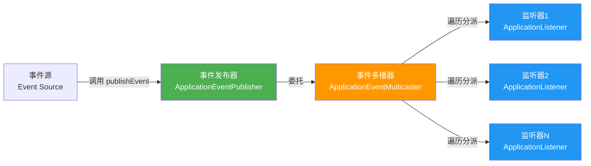
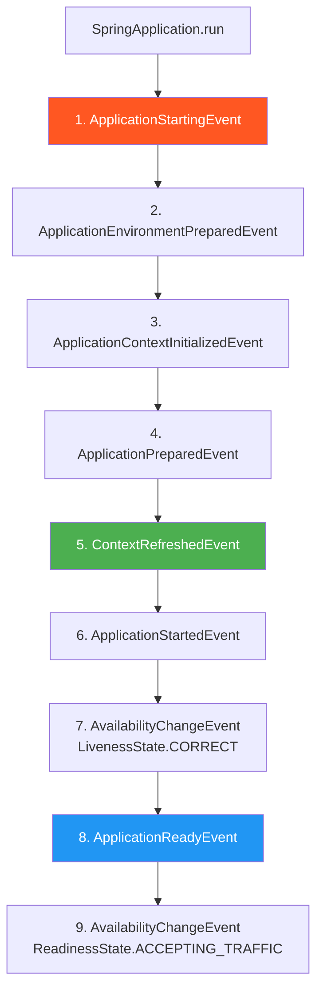

# Spring 事件机制

## ⭐ 面试重点速览

| 知识模块 | 重点内容 | 面试频率 |
|----------|----------|----------|
| 核心接口 | ApplicationEvent / ApplicationListener / ApplicationEventPublisher | 极高 |
| @EventListener | 注解驱动监听、同步/异步切换、条件过滤 | 极高 |
| 启动事件链 | Spring Boot 7 个核心启动事件及执行顺序 | 高 |
| @TransactionalEventListener | 事务提交后再处理、phase 四个阶段 | 极高 |
| 自定义事件 | 完整的事件发布与监听示例 | 中高 |
| 底层原理 | SimpleApplicationEventMulticaster、线程池配置 | 中 |

---

## 一、观察者模式与事件驱动模型

### 1.1 经典观察者模式

Spring 事件机制本质上是**观察者模式（Observer Pattern）** 的成熟实现。在观察者模式中，主题（Subject）维护一个观察者（Observer）列表，当状态发生变化时通知所有观察者。

```java
// 经典观察者模式：JDK 原生实现
// Subject（被观察者）
public class NewsPublisher extends Observable {
    public void publishNews(String news) {
        setChanged();                  // 标记状态已改变
        notifyObservers(news);         // 通知所有观察者
    }
}

// Observer（观察者）
public class NewsSubscriber implements Observer {
    @Override
    public void update(Observable o, Object arg) {
        System.out.println("收到新闻：" + arg);
    }
}
```

### 1.2 Spring 事件驱动模型的角色映射



| 观察者模式角色 | Spring 事件机制对应 | 职责 |
|---------------|-------------------|------|
| 主题（Subject） | ApplicationEventPublisher | 发布事件 |
| 事件对象 | ApplicationEvent | 封装事件信息 |
| 观察者（Observer） | ApplicationListener | 接收并处理事件 |
| 通知机制 | ApplicationEventMulticaster | 将事件分派给所有匹配的监听器 |

::: tip Spring 事件机制的默认行为
Spring 默认使用 `SimpleApplicationEventMulticaster` 来多播事件，**默认是同步执行的**。也就是说，事件发布者必须等待所有监听器处理完毕后才能继续执行。这一点面试中经常被问到。
:::

---

## 二、三大核心接口详解

### 2.1 ApplicationEvent —— 事件对象

所有 Spring 事件的基类，继承自 JDK 的 `java.util.EventObject`。

```java
// ApplicationEvent 继承体系
public abstract class ApplicationEvent extends EventObject {

    private final long timestamp; // 事件发生时间戳

    public ApplicationEvent(Object source) {
        super(source);
        this.timestamp = System.currentTimeMillis();
    }

    public final long getTimestamp() {
        return this.timestamp;
    }
}
```

Spring 内置的常见事件：

| 事件类 | 触发时机 | 用途 |
|--------|---------|------|
| `ContextRefreshedEvent` | ApplicationContext 初始化或刷新完成 | 容器就绪后的初始化操作 |
| `ContextStartedEvent` | ApplicationContext 启动 | 启动后处理 |
| `ContextStoppedEvent` | ApplicationContext 停止 | 停止后清理 |
| `ContextClosedEvent` | ApplicationContext 关闭 | 关闭前资源释放 |
| `RequestHandledEvent` | Web 请求处理完成 | 请求监控与统计 |

### 2.2 ApplicationListener —— 事件监听器

监听器的职责是接收事件并执行业务逻辑。Spring 提供了两种使用方式：**接口实现**和**注解驱动**。

```java
// 方式一：实现 ApplicationListener 接口（泛型指定监听的事件类型）
@Component
public class OrderCreatedListener implements ApplicationListener<OrderCreatedEvent> {

    @Override
    public void onApplicationEvent(OrderCreatedEvent event) {
        // 监听到订单创建事件后的业务处理
        String orderId = event.getOrderId();
        System.out.println("订单创建事件监听：orderId=" + orderId);
        // 例如：发送通知短信、记录审计日志等
    }
}
```

### 2.3 ApplicationEventPublisher —— 事件发布器

负责将事件发布给 Spring 容器，容器再分派给匹配的监听器。

```java
// 在业务 Service 中发布事件
@Service
public class OrderService {

    // 注入事件发布器
    @Autowired
    private ApplicationEventPublisher publisher;

    public void createOrder(Order order) {
        // 1. 执行业务逻辑：保存订单到数据库
        orderDao.save(order);

        // 2. 发布事件 —— 通知其他模块"订单已创建"
        publisher.publishEvent(new OrderCreatedEvent(this, order.getId()));

        System.out.println("订单创建完成，事件已发布");
    }
}
```

::: warning 注意：实现 ApplicationEventPublisherAware 也可以获取发布器
如果不想使用 `@Autowired`，可以让 Bean 实现 `ApplicationEventPublisherAware` 接口，Spring 会自动回调 `setApplicationEventPublisher` 方法注入发布器。但在现代 Spring 开发中，直接 `@Autowired` 更简洁。
:::

---

## 三、⭐ @EventListener 注解使用

### 3.1 基础用法

从 Spring 4.2 开始，推荐使用 `@EventListener` 注解代替实现 `ApplicationListener` 接口，使得监听器定义更加简洁灵活。

```java
@Component
public class OrderEventHandler {

    // 只需在方法上加 @EventListener，参数类型决定监听的事件类型
    @EventListener
    public void handleOrderCreated(OrderCreatedEvent event) {
        System.out.println("收到订单创建事件：" + event.getOrderId());
        // 处理业务逻辑...
    }
}
```

### 3.2 同步执行（默认行为）与异步执行（@Async）

```java
@Component
@EnableAsync  // 在配置类上开启异步支持
public class OrderEventHandler {

    // 同步执行：发布者线程阻塞，等待此方法执行完毕
    @EventListener
    public void syncHandle(OrderCreatedEvent event) {
        System.out.println("同步监听，线程：" + Thread.currentThread().getName());
        // 耗时的处理会导致发布者被阻塞
    }

    // 异步执行：在独立线程池中执行，发布者立即返回
    @EventListener
    @Async  // 配合 @EnableAsync 使用
    public void asyncHandle(OrderCreatedEvent event) {
        System.out.println("异步监听，线程：" + Thread.currentThread().getName());
        // 即使耗时很长，也不会阻塞发布者
    }
}
```

::: danger 异步监听器的注意事项
1. **必须**在配置类上加 `@EnableAsync`，否则 `@Async` 不生效，仍然是同步执行
2. 异步监听器中的**异常不会传播给发布者**，需要自行处理异常
3. 异步监听器无法使用 `@TransactionalEventListener` 的事务绑定能力
4. 默认使用 `SimpleAsyncTaskExecutor`（每次创建新线程），**生产环境必须配置自定义线程池**
:::

### 3.3 ⭐ 条件过滤（Spring Expression 表达式）

`@EventListener` 支持通过 `condition` 属性使用 SpEL 表达式过滤事件：

```java
@Component
public class ConditionalEventHandler {

    // 仅处理金额大于 100 的订单事件
    @EventListener(condition = "#event.amount > 100")
    public void handleLargeOrder(OrderCreatedEvent event) {
        System.out.println("处理大额订单：" + event.getOrderId()
                + "，金额：" + event.getAmount());
    }

    // 仅处理指定来源的事件
    @EventListener(condition = "#event.source == T(com.example.SourceEnum).APP")
    public void handleAppOrder(OrderCreatedEvent event) {
        System.out.println("处理来自 App 的订单：" + event.getOrderId());
    }
}
```

::: tip SpEL 表达式在 @EventListener 中的常用写法
- `#event.属性名` —— 访问事件对象的属性
- `#参数名` —— 访问方法参数
- `T(全限定类名).常量` —— 访问静态常量
- `#event.属性名 > 数值` —— 数值比较
- `#event.属性名 != null` —— 空值判断
:::

### 3.4 同一方法监听多个事件

```java
@Component
public class MultiEventHandler {

    // 一个方法同时监听多种事件
    @EventListener({ContextRefreshedEvent.class, ContextClosedEvent.class})
    public void handleContextLifecycle(ApplicationEvent event) {
        if (event instanceof ContextRefreshedEvent) {
            System.out.println("容器刷新完成");
        } else if (event instanceof ContextClosedEvent) {
            System.out.println("容器关闭");
        }
    }
}
```

---

## 四、⭐ Spring Boot 启动事件链

### 4.1 启动流程与事件映射

Spring Boot 启动过程中会按顺序发布一系列事件，理解这些事件对于在启动各阶段插入自定义逻辑至关重要。



### 4.2 七大核心事件详解

| 序号 | 事件 | 触发时机 | 容器状态 | 典型用途 |
|------|------|---------|---------|---------|
| 1 | **ApplicationStartingEvent** | `run()` 方法刚开始执行 | 未创建 | 早期日志配置、早期的初始化（此时 Bean 还未加载） |
| 2 | **ApplicationEnvironmentPreparedEvent** | Environment 准备完成 | 未创建 | 读取环境变量、动态修改配置 |
| 3 | **ApplicationContextInitializedEvent** | ApplicationContext 创建完成 | 已创建/未加载 | 对 ApplicationContext 做早期配置 |
| 4 | **ApplicationPreparedEvent** | Bean 定义加载完成 | 已创建/未刷新 | Bean 定义级别的后处理 |
| 5 | **ContextRefreshedEvent** | ApplicationContext 刷新完成 | 完全就绪 | **最常用** —— 所有 Bean 已创建，可安全执行初始化 |
| 6 | **ApplicationStartedEvent** | 在执行 CommandLineRunner 之前 | 完全就绪 | 应用已启动但未完全就绪时的处理 |
| 7 | **ApplicationReadyEvent** | 在执行 CommandLineRunner 之后 | 完全就绪 | **应用完全就绪**，可接受外部请求 |

### 4.3 监听启动事件的正确姿势

```java
@Component
public class MyBootEventListener {

    // ⭐ 最常用：所有 Bean 初始化完成后执行
    @EventListener(ContextRefreshedEvent.class)
    public void onContextRefreshed(ContextRefreshedEvent event) {
        // 此时所有单例 Bean 已创建，可以安全获取任何 Bean
        System.out.println("====== 容器刷新完成，所有 Bean 就绪 ======");
    }

    // 应用完全就绪后执行（在 CommandLineRunner 之后）
    @EventListener(ApplicationReadyEvent.class)
    public void onApplicationReady(ApplicationReadyEvent event) {
        System.out.println("====== 应用完全就绪，可以接收请求 ======");
    }
}
```

::: warning ContextRefreshedEvent 可能多次触发
`ContextRefreshedEvent` 不仅是 Spring Boot 启动时触发，在 Web 应用中如果有父子容器（如 Spring MVC 的 DispatcherServlet 创建子容器），该事件会触发多次。可以通过 `event.getApplicationContext().getParent()` 是否为 null 来判断是否为根容器的事件。
:::

### 4.4 早期事件的监听方式

前两个事件（StartingEvent 和 EnvironmentPreparedEvent）在 ApplicationContext 创建之前发布，因此**不能通过 `@EventListener` 或 `@Component` 监听**，需要通过 `SpringApplication.addListeners()` 手动注册：

```java
@SpringBootApplication
public class MyApplication {
    public static void main(String[] args) {
        SpringApplication app = new SpringApplication(MyApplication.class);

        // 监听早期事件 —— 必须在 run() 之前注册
        app.addListeners(event -> {
            if (event instanceof ApplicationStartingEvent) {
                System.out.println("====== Spring Boot 开始启动 ======");
            }
        });

        app.run(args);
    }
}
```

---

## 五、⭐ 事务事件 @TransactionalEventListener

### 5.1 为什么需要事务事件监听器？

这是一个非常高频的面试考点。请看以下问题场景：

```java
@Service
public class OrderService {
    @Autowired
    private ApplicationEventPublisher publisher;

    @Transactional
    public void createOrder(Order order) {
        orderDao.save(order);                   // 保存订单
        publisher.publishEvent(new OrderCreatedEvent(this, order.getId())); // 发布事件
        // 如果此处发生异常，事务回滚，订单没存进去，
        // 但监听器可能已经发送了通知短信 —— 造成数据不一致！
    }
}
```

上面的代码存在严重问题：事件发布在事务提交之前，如果后续抛异常导致事务回滚，监听器却已经处理了事件（例如给用户发了短信），造成**数据与业务不一致**。

### 5.2 @TransactionalEventListener 工作原理

`@TransactionalEventListener` 是 `@EventListener` 的事务增强版，**默认在事务提交后才执行监听方法**：

```java
@Component
public class OrderTransactionalHandler {

    // ⭐ 默认：事务成功提交后才执行（phase = TransactionPhase.AFTER_COMMIT）
    @TransactionalEventListener
    public void handleOrderCreatedAfterCommit(OrderCreatedEvent event) {
        // 此时能确保订单数据已成功持久化到数据库
        System.out.println("事务提交成功，安全处理事件：" + event.getOrderId());
        // 发送短信、推送通知、更新缓存等
    }
}
```

### 5.3 ⭐ phase 参数四种阶段详解

```java
@Component
public class TransactionPhaseHandler {

    // 1. AFTER_COMMIT（默认）：事务提交后执行 —— 最常用
    @TransactionalEventListener(phase = TransactionPhase.AFTER_COMMIT)
    public void afterCommit(OrderCreatedEvent event) {
        System.out.println("事务提交后：发送通知短信");
    }

    // 2. AFTER_ROLLBACK：事务回滚后执行
    @TransactionalEventListener(phase = TransactionPhase.AFTER_ROLLBACK)
    public void afterRollback(OrderCreatedEvent event) {
        System.out.println("事务回滚后：记录异常、触发补偿逻辑");
    }

    // 3. AFTER_COMPLETION：事务完成后（不论提交还是回滚）
    @TransactionalEventListener(phase = TransactionPhase.AFTER_COMPLETION)
    public void afterCompletion(OrderCreatedEvent event) {
        System.out.println("事务结束：清理 ThreadLocal 等资源");
    }

    // 4. BEFORE_COMMIT：事务提交前执行
    @TransactionalEventListener(phase = TransactionPhase.BEFORE_COMMIT)
    public void beforeCommit(OrderCreatedEvent event) {
        System.out.println("事务提交前：做最后的合法性校验");
        // 注意：此处抛异常仍会导致事务回滚
    }
}
```

::: tip phase 选择最佳实践

| 场景 | 推荐 phase | 理由 |
|------|-----------|------|
| 发送通知、更新缓存 | AFTER_COMMIT | 保证数据已持久化 |
| 记录异常、触发补偿 | AFTER_ROLLBACK | 回滚后才需要补偿 |
| 清理线程资源 | AFTER_COMPLETION | 无论成败都要清理 |
| 提交前额外校验 | BEFORE_COMMIT | 模拟 beforeCompletion |
:::

### 5.4 fallbackExecution 降级执行

```java
@Component
public class FallbackHandler {

    // fallbackExecution = true：即使没有事务，也会执行监听方法
    @TransactionalEventListener(fallbackExecution = true)
    public void handleWithFallback(OrderCreatedEvent event) {
        // 有事务时：事务提交后执行
        // 无事务时：同步立即执行（退化为普通 @EventListener）
        System.out.println("处理事件（支持无事务降级）");
    }
}
```

::: danger @TransactionalEventListener 关键注意事项
1. **必须在事务中发布事件**，否则监听器永远不会执行（除非 `fallbackExecution = true`）
2. 监听器方法内部发生异常**默认不会回滚事务**（事务已经提交/回滚完毕）
3. 仅支持 `@EventListener` 注解方法，不支持 `ApplicationListener` 接口方式
4. Spring 4.2+ 才可用（Spring Boot 1.4+ 默认支持）
:::

---

## 六、自定义事件完整示例

### 6.1 定义事件类

```java
// 自定义事件：继承 ApplicationEvent
@Getter
public class OrderCreatedEvent extends ApplicationEvent {

    private final String orderId;   // 订单ID
    private final BigDecimal amount; // 订单金额
    private final Long userId;      // 用户ID

    public OrderCreatedEvent(Object source, String orderId,
                              BigDecimal amount, Long userId) {
        super(source);
        this.orderId = orderId;
        this.amount = amount;
        this.userId = userId;
    }
}
```

### 6.2 发布事件

```java
@Service
public class OrderService {

    @Autowired
    private ApplicationEventPublisher publisher;

    @Transactional
    public void createOrder(CreateOrderRequest request) {
        // 步骤1：保存订单到数据库
        Order order = orderDao.save(request.toOrder());

        // 步骤2：发布"订单创建成功"事件（事务提交后监听器才会执行）
        OrderCreatedEvent event = new OrderCreatedEvent(
                this, order.getId(), order.getAmount(), order.getUserId());
        publisher.publishEvent(event);
    }
}
```

### 6.3 多监听器协同处理（典型解耦场景）

```java
@Component
public class OrderEventHandlers {

    // 监听器1：发送短信通知 —— 事务提交后异步执行
    @TransactionalEventListener(phase = TransactionPhase.AFTER_COMMIT)
    @Async
    public void sendSms(OrderCreatedEvent event) {
        System.out.println("【短信服务】发送订单确认短信给用户："
                + event.getUserId());
        smsService.sendOrderConfirmation(event.getUserId(), event.getOrderId());
    }

    // 监听器2：同步库存 —— 事务提交后异步执行
    @TransactionalEventListener(phase = TransactionPhase.AFTER_COMMIT)
    @Async
    public void deductInventory(OrderCreatedEvent event) {
        System.out.println("【库存服务】扣减库存，订单：" + event.getOrderId());
        inventoryService.deduct(event.getOrderId());
    }

    // 监听器3：记录审计日志 —— 事务提交后同步执行（必须成功）
    @TransactionalEventListener(phase = TransactionPhase.AFTER_COMMIT)
    public void auditLog(OrderCreatedEvent event) {
        System.out.println("【审计服务】记录操作日志，订单：" + event.getOrderId());
        auditService.saveLog("CREATE_ORDER", event.getOrderId());
    }

    // 监听器4：大额订单告警（通过 condition 条件过滤）
    @TransactionalEventListener(
        phase = TransactionPhase.AFTER_COMMIT,
        condition = "#event.amount > 10000"
    )
    public void largeOrderAlert(OrderCreatedEvent event) {
        System.out.println("【风控服务】大额订单告警：" + event.getOrderId());
        riskService.notifyLargeOrder(event);
    }
}
```

::: tip 事件驱动架构的优势
通过上述示例可以看到，订单创建完成后，短信、库存、审计、风控等模块各自独立监听事件，实现了**业务解耦**。新增功能只需新增监听器，无需修改 `OrderService` 代码，完美符合**开闭原则（OCP）**。
:::

### 6.4 事件传播机制

```mermaid
graph TB
    subgraph "Spring 事件传播"
        A[OrderService.publishEvent] --> B{SimpleApplicationEventMulticaster}
        B --> C[Listener1: 发送短信]
        B --> D[Listener2: 同步库存]
        B --> E[Listener3: 审计日志]
    end

    subgraph "事务边界"
        F[@Transactional 方法]
        G[保存订单]
        H[发布事件 - 仅暂存]
        I[事务提交]
        J[@TransactionalEventListener 被触发]
        F --> G --> H --> I --> J
    end

    style B fill:#FF9800,color:#fff
    style J fill:#4CAF50,color:#fff
```

---

## 七、事件机制底层原理

### 7.1 SimpleApplicationEventMulticaster 源码解读

```java
// Spring 默认的事件多播器 —— 核心逻辑简化版
public class SimpleApplicationEventMulticaster
        extends AbstractApplicationEventMulticaster {

    // 默认是同步的：Executor 为 null
    @Nullable
    private Executor taskExecutor;

    @Override
    public void multicastEvent(ApplicationEvent event, @Nullable ResolvableType eventType) {
        // 获取所有匹配的监听器
        for (ApplicationListener<?> listener : getApplicationListeners(event, eventType)) {
            Executor executor = getTaskExecutor();
            if (executor != null) {
                // 如果配置了线程池 → 异步执行
                executor.execute(() -> invokeListener(listener, event));
            } else {
                // 没有线程池 → 同步执行（默认行为）
                invokeListener(listener, event);
            }
        }
    }

    // 设置线程池后，所有监听器都变为异步执行
    public void setTaskExecutor(@Nullable Executor taskExecutor) {
        this.taskExecutor = taskExecutor;
    }
}
```

::: tip 如何全局配置异步事件？
只需向 `SimpleApplicationEventMulticaster` 注入一个线程池即可：
```java
@Configuration
public class AsyncEventConfig {
    @Bean(name = "applicationEventMulticaster")
    public ApplicationEventMulticaster simpleApplicationEventMulticaster() {
        SimpleApplicationEventMulticaster multicaster = new SimpleApplicationEventMulticaster();
        multicaster.setTaskExecutor(Executors.newFixedThreadPool(4));
        return multicaster;
    }
}
```
注意：一旦全局配置了 `taskExecutor`，**所有监听器**都会变成异步执行。建议还是使用 `@Async` 逐个控制，粒度更细。
:::

---

## ⭐ 面试高频问题汇总

### Q1：Spring 事件机制和观察者模式有什么关系？

Spring 事件机制是**观察者模式的工程化实现**。`ApplicationEventPublisher` 是主题（Subject），`ApplicationListener` 是观察者（Observer），`ApplicationEvent` 是事件对象。Spring 在此基础上增加了异步支持、事务绑定、条件过滤等企业级特性，远超经典观察者模式的能力范围。

### Q2：@EventListener 和 ApplicationListener 接口怎么选？

| 维度 | @EventListener | ApplicationListener 接口 |
|------|---------------|-------------------------|
| 简洁性 | 极高（只需一个注解） | 需要实现接口 + 泛型 |
| 灵活性 | 支持 SpEL 条件过滤、多事件 | 固定单事件 |
| 事务绑定 | 支持 @TransactionalEventListener | **不支持** |
| 异步 | 支持 @Async | 需手动处理 |
| 推荐度 | ⭐⭐⭐ 强烈推荐 | ⭐ 遗留兼容 |

**一句话总结**：Spring 4.2+ 的项目一律使用 `@EventListener`，`ApplicationListener` 接口仅在维护遗留代码时接触。

### Q3：Spring Boot 启动过程中发布了哪些关键事件？它们的顺序是什么？

核心事件按顺序为：
1. `ApplicationStartingEvent` —— 启动开始（最早，ApplicationContext 未创建）
2. `ApplicationEnvironmentPreparedEvent` —— 环境变量就绪
3. `ApplicationContextInitializedEvent` —— ApplicationContext 创建
4. `ApplicationPreparedEvent` —— Bean 定义加载完成
5. `ContextRefreshedEvent` —— **容器刷新完成，所有 Bean 就绪（最常用）**
6. `ApplicationStartedEvent` —— CommandLineRunner 执行前
7. `ApplicationReadyEvent` —— CommandLineRunner 执行后，**应用完全就绪**

### Q4：@TransactionalEventListener 和 @EventListener 的核心区别是什么？为什么需要前者？

**核心区别**：`@TransactionalEventListener` 将监听器执行时机绑定到**事务生命周期**，默认在事务**成功提交之后**才执行。

**为什么需要**：普通 `@EventListener` 在 `publishEvent()` 调用时立即/异步执行，如果后续事务回滚，监听器已经执行了（如发了短信），造成**数据不一致**。`@TransactionalEventListener` 解决了这一问题，确保"数据落库"和"事件处理"的一致性。

### Q5：@TransactionalEventListener 的 phase 有哪几种？分别用在什么场景？

| phase | 时机 | 场景 |
|-------|------|------|
| `AFTER_COMMIT`（默认） | 事务提交后 | 发送通知、更新缓存、调用外部接口 |
| `AFTER_ROLLBACK` | 事务回滚后 | 记录异常日志、触发补偿/重试逻辑 |
| `AFTER_COMPLETION` | 事务完成后（无论成败） | 清理 ThreadLocal、释放临时资源 |
| `BEFORE_COMMIT` | 事务提交前 | 提交前的最后校验（类似 beforeCompletion） |

### Q6：Spring 事件默认是同步还是异步？如何改为异步？两者各有什么优缺点？

**默认是同步的**。Spring 使用 `SimpleApplicationEventMulticaster` 多播事件，其 `taskExecutor` 默认为 null，所有监听器在发布者的线程中**顺序同步执行**。

**改为异步的三种方式**：
1. 监听器方法上加 `@Async`（推荐，粒度细）
2. 给 `SimpleApplicationEventMulticaster` 设置全局 `taskExecutor`
3. 监听器内部手动提交到线程池

| 方式 | 优点 | 缺点 |
|------|------|------|
| 同步（默认） | 逻辑简单、异常直接传播、事务天然支持 | 监听器慢会阻塞发布者 |
| 异步 | 高性能、不阻塞发布者、故障隔离 | 异常不传播、不兼容 `@TransactionalEventListener`、需处理线程安全 |

### Q7：如何保证事件处理的可靠性？（事件丢失怎么办？）

Spring 内置事件机制没有持久化保障，监听器异常会导致事件丢失。生产环境可采取以下策略：

1. **本地事务表 + 定时补偿**：发布事件时写入一张"待处理事件表"（与业务在同一事务内），后台定时扫描未处理的事件重试
2. **消息队列（RabbitMQ / Kafka）**：使用消息中间件替代 Spring 事件，获得持久化、重试、死信队列等能力
3. **监听器内异常处理**：`try-catch` 包裹关键逻辑，避免异常中断后续监听器
4. **监控告警**：对事件处理失败进行打点和告警

### Q8：ContextRefreshedEvent 在 Spring Boot 中会被触发几次？

在典型的 Spring Boot Web 应用中，**至少触发 2 次**：
- 第 1 次：Root ApplicationContext（`AnnotationConfigServletWebServerApplicationContext`）刷新完成
- 第 2 次：DispatcherServlet 创建的子 ApplicationContext 刷新完成

通过 `event.getApplicationContext().getParent()` 来判断：**父容器为 null → 是根容器的事件**，可以通过 `event.getApplicationContext() instanceof 特定类型` 来精确判断。

---

## 面试追问环节

**Q：如果让你设计一个基于 Spring 事件的"插件化"架构，你会怎么做？**

核心思路：
1. 定义统一的"插件事件"基类（如 `PluginEvent`），包含插件类型、数据负载
2. 各插件模块独立开发，只需在自己的 `@EventListener` 中声明监听的事件类型
3. 核心框架只负责在合适的时机发布 `PluginEvent`，不感知插件的存在
4. 通过 SpEL 条件过滤实现插件的动态开关（如 `condition = "#event.pluginName == 'sms'"`）
5. 插件间如需通信，也通过事件实现，避免直接依赖

**Q：Spring 事件机制和消息队列（MQ）的核心区别？什么时候该用 MQ 替换 Spring 事件？**

| 维度 | Spring 事件 | 消息队列 |
|------|-----------|---------|
| 持久化 | 无 | 有 |
| 可靠性 | 低（进程重启丢失） | 高（消息持久化到磁盘） |
| 跨进程 | 不支持 | 支持 |
| 延迟 | 极低（内存级） | 中等 |
| 事务绑定 | 天然支持 `@TransactionalEventListener` | 需最终一致性方案 |

**替换时机**：当需要跨服务通信、消息持久化、高可靠性保障时，应从 Spring 事件迁移到消息队列。Spring 事件适合**单体应用内部的模块解耦**，MQ 适合**分布式系统的服务解耦**。