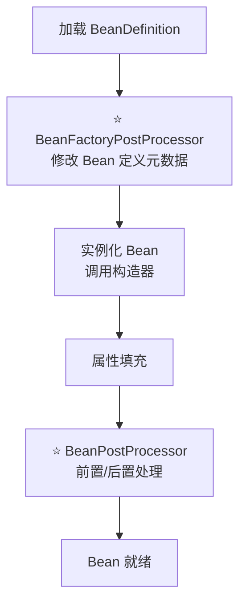
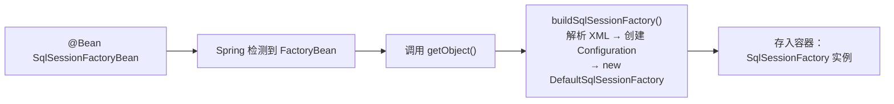
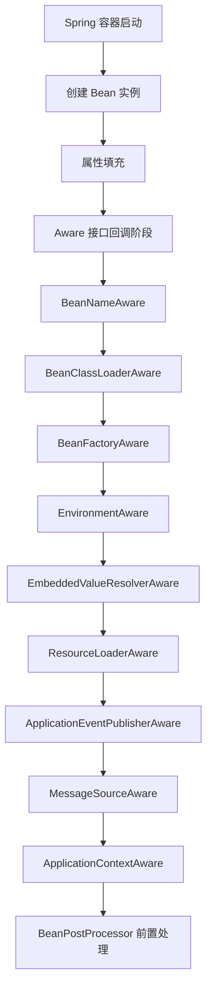
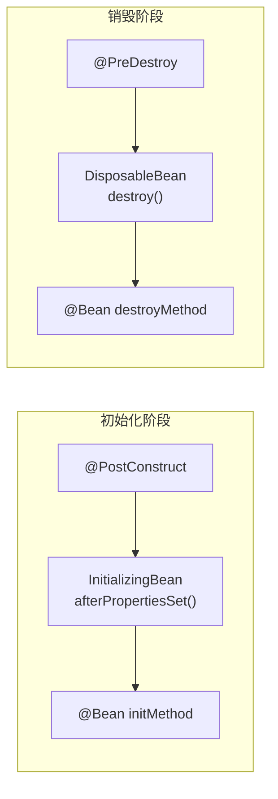
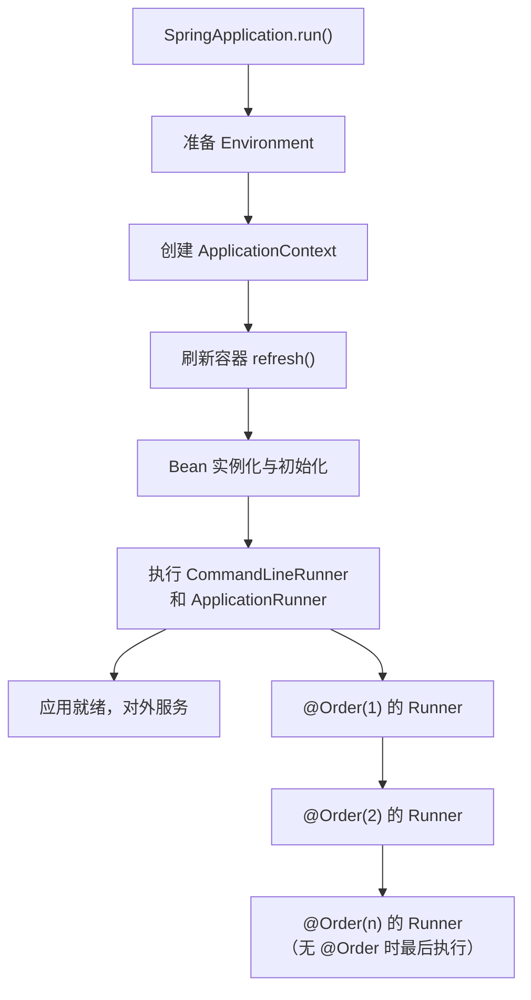
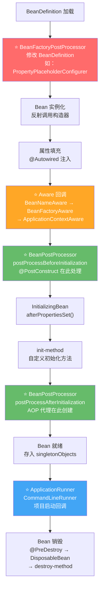

# Spring 扩展点全景

## ⭐ 面试重点速览

| 知识模块 | 重点内容 | 面试频率 |
|----------|----------|----------|
| BeanFactoryPostProcessor | 修改 BeanDefinition、执行时机、PropertyPlaceholderConfigurer | 高 |
| BeanPostProcessor | 实例前后处理、AOP 代理创建、自定义注解实现 | 极高 |
| ImportBeanDefinitionRegistrar | 编程式注册 BeanDefinition、MyBatis 集成原理 | 高 |
| FactoryBean | getObject()、SqlSessionFactoryBean、与普通 Bean 区别 | 极高 |
| Aware 接口 | 让 Bean 感知容器、六大核心 Aware | 中高 |
| InitializingBean / DisposableBean | 与 @PostConstruct / @PreDestroy 执行顺序 | 极高 |
| ApplicationRunner / CommandLineRunner | Spring Boot 启动回调、区别与适用场景 | 高 |

---

## 一、BeanFactoryPostProcessor vs BeanPostProcessor

### 1.1 核心区别

这是 Spring 容器中**两个最核心的扩展点**，名字相似但职责完全不同：

::: danger 务必区分清楚
- **BeanFactoryPostProcessor**：操作 **BeanDefinition**（bean 的"图纸"），在 bean **实例化之前**执行
- **BeanPostProcessor**：操作 **bean 实例**（"成品"或"半成品"），在 bean **初始化前后**执行
:::



| 维度 | BeanFactoryPostProcessor | BeanPostProcessor |
|------|--------------------------|-------------------|
| **操作对象** | BeanDefinition（元数据/图纸） | Bean 实例（成品/半成品） |
| **执行时机** | 所有 Bean 实例化之前 | 每个 Bean 初始化前后 |
| **经典实现** | ConfigurationClassPostProcessor、PropertyPlaceholderConfigurer | AbstractAutoProxyCreator、CommonAnnotationBeanPostProcessor |
| **触发次数** | 每个处理器执行一次 | 每个 Bean 都会触发 |
| **影响范围** | 容器级别的全局配置 | 单个 Bean 级别的增强 |

### 1.2 BeanFactoryPostProcessor 详解

```java
// BeanFactoryPostProcessor 接口定义
@FunctionalInterface
public interface BeanFactoryPostProcessor {
    void postProcessBeanFactory(ConfigurableListableBeanFactory beanFactory) 
            throws BeansException;
}
```

**经典实现一：PropertyPlaceholderConfigurer（属性占位符解析）**

```java
// 使用 ${} 占位符时，就是 PropertyPlaceholderConfigurer 在背后工作
@Configuration
@PropertySource("classpath:application.properties")
public class AppConfig {
    @Value("${server.port}")   // ⬅️ PropertyPlaceholderConfigurer 负责解析
    private int port;
}
```

**经典实现二：ConfigurationClassPostProcessor（解析 @Configuration）**

这是 Spring 最核心的 BFPP，负责解析 `@Configuration`、`@ComponentScan`、`@Import` 等注解，是驱动整个注解体系运转的引擎。

### 1.3 BeanPostProcessor 详解

```java
public interface BeanPostProcessor {
    @Nullable
    default Object postProcessBeforeInitialization(Object bean, String beanName) {
        return bean; // 初始化前 —— 返回原始 bean 或包装后的 bean
    }

    @Nullable
    default Object postProcessAfterInitialization(Object bean, String beanName) {
        return bean; // 初始化后 —— ⭐ AOP 代理在此生成！
    }
}
```

**经典实现：AbstractAutoProxyCreator（AOP 自动代理创建器）**

在 `postProcessAfterInitialization` 阶段，检查 Bean 是否需要 AOP 增强，若需要则通过 JDK 动态代理或 CGLIB 创建代理对象。

::: tip 面试加分点
Spring 容器的 `singletonObjects` 中存入的是 `postProcessAfterInitialization` 返回的结果。如果 Bean 被 AOP 增强，存入的是代理对象，而非原始 Bean。
:::

---

## 二、⭐ BeanPostProcessor 实战：自定义 @Log 注解处理器

### 2.1 需求描述

实现一个 `@Log` 注解，标注在方法上后，自动在方法执行前后打印日志，类似 AOP 的 `@Around` 但通过 BeanPostProcessor 实现。

### 2.2 定义注解

```java
@Target(ElementType.TYPE)  // 标注在类上
@Retention(RetentionPolicy.RUNTIME)
public @interface Log {
}
```

### 2.3 实现 LogBeanPostProcessor

```java
@Component
public class LogBeanPostProcessor implements BeanPostProcessor {

    @Override
    public Object postProcessAfterInitialization(Object bean, String beanName) 
            throws BeansException {
        // 只处理带有 @Log 注解的 Bean
        Class<?> clazz = bean.getClass();
        if (!clazz.isAnnotationPresent(Log.class)) {
            return bean;
        }

        // 用 JDK 动态代理包装原始 Bean，拦截所有方法调用
        return Proxy.newProxyInstance(
                clazz.getClassLoader(),
                clazz.getInterfaces(),
                (proxy, method, args) -> {
                    System.out.println("[Log] >>> 调用方法：" + method.getName());
                    long start = System.currentTimeMillis();
                    try {
                        Object result = method.invoke(bean, args);  // 执行原方法
                        long cost = System.currentTimeMillis() - start;
                        System.out.println("[Log] <<< 方法结束：" + method.getName() 
                                + "，耗时：" + cost + "ms");
                        return result;
                    } catch (Exception e) {
                        System.out.println("[Log] <<< 方法异常：" + method.getName()
                                + "，异常：" + e.getMessage());
                        throw e.getCause();
                    }
                }
        );
    }
}
```

### 2.4 使用示例

```java
@Service
@Log  // ⬅️ 只需一个注解，自动打印日志！
public class UserServiceImpl implements UserService {
    @Override
    public User findById(Long id) {
        // 模拟业务逻辑
        return new User(id, "张三");
    }
}

// 控制台输出：
// [Log] >>> 调用方法：findById
// [Log] <<< 方法结束：findById，耗时：2ms
```

::: warning 注意
此示例用 JDK 动态代理要求目标 Bean 实现了接口。未实现接口则需要使用 CGLIB。在生产环境中，推荐直接用 Spring AOP（`@Aspect` + `@Around`）实现此需求，代码更简洁且支持更多切入点表达式。
:::

---

## 三、ImportBeanDefinitionRegistrar 详解

### 3.1 什么是 ImportBeanDefinitionRegistrar？

`ImportBeanDefinitionRegistrar` 允许**编程式**向 Spring 容器注册 `BeanDefinition`。它比 `@ComponentScan` 更灵活，可以动态决定注册哪些 Bean，是 MyBatis、Feign 等框架集成 Spring 的核心扩展点。

```java
public interface ImportBeanDefinitionRegistrar {
    default void registerBeanDefinitions(
            AnnotationMetadata importingClassMetadata,  // @Import 所在类的注解元数据
            BeanDefinitionRegistry registry              // BeanDefinition 注册中心
    ) {
    }
}
```

### 3.2 经典实现：MyBatis MapperScannerConfigurer 原理

MyBatis 与 Spring 集成时，只需标注 `@MapperScan`，就能自动将所有 Mapper 接口注册为 Bean。这背后的核心就是 `ImportBeanDefinitionRegistrar`。

```mermaid
graph TD
    A[@MapperScan 注解] --> B[MapperScannerRegistrar<br/>实现 ImportBeanDefinitionRegistrar]
    B --> C[registerBeanDefinitions 方法]
    C --> D[ClassPathMapperScanner<br/>扫描指定包路径]
    D --> E{是 Mapper 接口?}
    E -->|是| F[创建 BeanDefinition<br/>beanClass = MapperFactoryBean]
    F --> G[注册到 BeanDefinitionRegistry]
    E -->|否| H[跳过]
    G --> I[Spring 容器管理<br/>自动注入可用]
```

### 3.3 手写简易版 MapperScannerRegistrar

```java
// 步骤1：自定义 @MapperScan 注解
@Target(ElementType.TYPE)
@Retention(RetentionPolicy.RUNTIME)
@Import(MyMapperScannerRegistrar.class)  // ⭐ 关键：通过 @Import 触发
public @interface MyMapperScan {
    String basePackage();  // 指定扫描的包路径
}

// 步骤2：实现 Registrar
public class MyMapperScannerRegistrar implements ImportBeanDefinitionRegistrar {

    @Override
    public void registerBeanDefinitions(
            AnnotationMetadata metadata, BeanDefinitionRegistry registry) {
        
        // 从 @MyMapperScan 注解中获取 basePackage
        Map<String, Object> attrs = metadata.getAnnotationAttributes(
                MyMapperScan.class.getName());
        String basePackage = (String) attrs.get("basePackage");
        
        // 将包路径转换为资源路径，扫描所有 .class 文件
        String path = basePackage.replace('.', '/');
        // 简化处理：此处省略实际的类扫描逻辑
        // 在实际框架中，会用 ClassPathBeanDefinitionScanner 扫描
        
        // 得到所有 Mapper 接口后，为每个接口创建 BeanDefinition
        // （简化示例，假设扫描到了 UserMapper.class）
        BeanDefinitionBuilder builder = BeanDefinitionBuilder
                .genericBeanDefinition(MapperFactoryBean.class);  // FactoryBean 包装
        builder.addConstructorArgValue(UserMapper.class);
        
        registry.registerBeanDefinition("userMapper", builder.getBeanDefinition());
    }
}

// 步骤3：使用 @MyMapperScan
@Configuration
@MyMapperScan(basePackage = "com.example.mapper")
public class AppConfig { }
```

### 3.4 BeanDefinition 注册核心方法

```java
// BeanDefinition 注册的核心 API
registry.registerBeanDefinition("beanName", beanDefinition);  // 注册
registry.removeBeanDefinition("beanName");                     // 移除
registry.containsBeanDefinition("beanName");                   // 检查存在
registry.getBeanDefinition("beanName");                        // 获取
```

::: tip ImportBeanDefinitionRegistrar 的优势
- 比 `@ComponentScan` 更灵活，可以动态决定注册哪些 Bean
- 可以读取注解元数据（如 `@MapperScan` 的 `basePackage`）
- 可以注册 FactoryBean（MyBatis 的 Mapper 就是通过 `MapperFactoryBean` 注册的）
- 可以通过 `Aware` 获取容器环境（如 `EnvironmentAware`）
:::

---

## 四、FactoryBean 详解

### 4.1 FactoryBean 与普通 Bean 的区别

| 维度 | 普通 Bean | FactoryBean |
|------|-----------|-------------|
| **获取方式** | `getBean("xxx")` 直接返回 | `getBean("xxx")` 返回 `getObject()` 的返回值 |
| **获取自身** | 无 | `getBean("&xxx")` 返回 FactoryBean 本身 |
| **创建控制** | Spring 通过构造器/工厂方法创建 | 完全由 `getObject()` 方法控制 |
| **是否单例** | 由 scope 决定 | `isSingleton()` 方法决定 |
| **经典实现** | `@Service` / `@Component` 标注的类 | `SqlSessionFactoryBean`、`ProxyFactoryBean` |

```java
public interface FactoryBean<T> {
    @Nullable
    T getObject() throws Exception;     // ⭐ 返回要创建的 Bean 实例
    
    @Nullable
    Class<?> getObjectType();           // 返回 Bean 的类型
    
    default boolean isSingleton() {     // 是否为单例
        return true;
    }
}
```

### 4.2 MyBatis SqlSessionFactoryBean 原理

MyBatis 的 `SqlSessionFactory` 不是直接 new 出来的，而是通过 `SqlSessionFactoryBean` 创建的：

```java
// Spring XML 或注解中配置的是 SqlSessionFactoryBean
@Bean
public SqlSessionFactoryBean sqlSessionFactory(DataSource dataSource) {
    SqlSessionFactoryBean factoryBean = new SqlSessionFactoryBean();
    factoryBean.setDataSource(dataSource);
    factoryBean.setMapperLocations(
        new PathMatchingResourcePatternResolver()
            .getResources("classpath:mapper/*.xml"));
    return factoryBean;  // 返回的是 FactoryBean，但容器实际拿到的是 SqlSessionFactory
}

// 使用方拿到的直接是 SqlSessionFactory，无需感知 FactoryBean 的存在
@Autowired
private SqlSessionFactory sqlSessionFactory;  // ⬅️ 实际注入的是 getObject() 的返回值
```



### 4.3 手写简易 FactoryBean

```java
// 场景：创建一个"连接池" Bean，初始化逻辑复杂，用 FactoryBean 封装
@Component
public class ConnectionPoolFactoryBean implements FactoryBean<ConnectionPool> {

    private String url = "jdbc:mysql://localhost:3306/test";
    private int maxSize = 10;

    @Override
    public ConnectionPool getObject() throws Exception {
        // 复杂的创建逻辑封装在这里，外部只需注入 ConnectionPool
        ConnectionPool pool = new ConnectionPool();
        pool.setUrl(url);
        pool.setMaxSize(maxSize);
        pool.init();  // 初始化连接（建立连接、检测可用性等）
        return pool;
    }

    @Override
    public Class<?> getObjectType() {
        return ConnectionPool.class;
    }

    @Override
    public boolean isSingleton() {
        return true;  // 连接池应该是单例
    }
}

// 使用方完全不需要知道 FactoryBean 的存在
@Service
public class UserService {
    @Autowired
    private ConnectionPool pool;  // 直接注入 ConnectionPool
}
```

### 4.4 & 前缀：获取 FactoryBean 本身

```java
// 获取 FactoryBean 创建的 Bean（常用）
ConnectionPool pool = context.getBean(ConnectionPool.class);

// 获取 FactoryBean 本身（通过 & 前缀）
ConnectionPoolFactoryBean factoryBean = 
    context.getBean("&connectionPoolFactoryBean", ConnectionPoolFactoryBean.class);
```

::: warning 面试常问
为什么 MyBatis 的 Mapper 接口不需要实现类就能注入？
- `MapperFactoryBean` 的 `getObject()` 方法内部通过 `SqlSession.getMapper()` 获取 JDK 动态代理对象
- Spring 容器存入的是代理对象，所以可以注入 Mapper 接口
:::

---

## 五、Aware 接口家族

### 5.1 什么是 Aware 接口？

Aware（感知）接口让 Bean 能够"感知"到 Spring 容器的存在，获取容器提供的基础设施。Bean 实现某个 Aware 接口后，Spring 会在特定阶段回调接口方法，将资源注入到 Bean 中。



### 5.2 六大核心 Aware 接口

```java
@Component
public class AwareDemoBean implements
        BeanNameAware, BeanFactoryAware, ApplicationContextAware,
        EnvironmentAware, ResourceLoaderAware, EmbeddedValueResolverAware {

    @Override public void setBeanName(String name) { /* 1. 获取自己的 Bean 名称 */ }
    @Override public void setBeanFactory(BeanFactory bf) { /* 2. 手动获取其他 Bean */ }
    @Override public void setApplicationContext(ApplicationContext ctx) { /* 3. 事件发布、国际化 */ }
    @Override public void setEnvironment(Environment env) { /* 4. 获取配置属性、Profile */ }
    @Override public void setResourceLoader(ResourceLoader loader) { /* 5. 加载 classpath 资源 */ }
    @Override public void setEmbeddedValueResolver(StringValueResolver r) { /* 6. 解析 ${} 和 SpEL */ }
}
```

### 5.3 Aware 接口能力速查表

| Aware 接口 | 回调方法 | 获取的能力 | 典型场景 |
|------------|----------|------------|----------|
| **BeanNameAware** | `setBeanName(String)` | 当前 Bean 的名称 | 日志记录、动态注册 |
| **BeanFactoryAware** | `setBeanFactory(BeanFactory)` | BeanFactory 实例 | 编程式获取 Bean |
| **ApplicationContextAware** | `setApplicationContext(ApplicationContext)` | ApplicationContext | 发布事件、获取环境、获取 Bean |
| **EnvironmentAware** | `setEnvironment(Environment)` | Environment | 读取配置、判断 Profile |
| **ResourceLoaderAware** | `setResourceLoader(ResourceLoader)` | ResourceLoader | 加载模板文件、资源文件 |
| **EmbeddedValueResolverAware** | `setEmbeddedValueResolver(StringValueResolver)` | 占位符解析 | 解析 `${}` 和 SpEL |

### 5.4 实战：通过 ApplicationContextAware 获取容器工具

```java
@Component
public class SpringContextHolder implements ApplicationContextAware {

    private static ApplicationContext context;  // 静态持有，全局可访问

    @Override
    public void setApplicationContext(ApplicationContext ctx) {
        context = ctx;
    }

    // 静态工具方法：在任何地方获取 Bean
    public static <T> T getBean(Class<T> clazz) {
        return context.getBean(clazz);
    }

    // 发布事件
    public static void publishEvent(Object event) {
        context.publishEvent(event);
    }
}
```

::: danger 慎用静态持有 ApplicationContext
虽然上面的写法很常见（如 Hutool 的 `SpringUtil`），但**不推荐**在业务代码中大量使用。优先使用依赖注入（`@Autowired`），静态持有只在工具类等确实无法注入的场景中使用。
:::

---

## 六、InitializingBean / DisposableBean 接口

### 6.1 接口定义

```java
public interface InitializingBean {
    void afterPropertiesSet() throws Exception;  // 所有属性设置完成后调用
}

public interface DisposableBean {
    void destroy() throws Exception;  // Bean 销毁时调用
}
```

### 6.2 三种初始化方式及执行顺序

Spring 提供了三种 Bean 初始化回调方式，它们的**执行顺序**非常关键：

```java
@Component
public class LifecycleOrderBean implements InitializingBean, DisposableBean {

    @PostConstruct
    public void postConstruct() {
        System.out.println("1. @PostConstruct —— 最先执行");
    }

    @Override
    public void afterPropertiesSet() throws Exception {
        System.out.println("2. InitializingBean.afterPropertiesSet —— 中间执行");
    }

    public void customInit() {
        System.out.println("3. @Bean initMethod —— 最后执行");
    }

    // 销毁顺序：与初始化对称，反向执行
    @PreDestroy
    public void preDestroy() {
        System.out.println("4. @PreDestroy —— 最先执行销毁");
    }

    @Override
    public void destroy() throws Exception {
        System.out.println("5. DisposableBean.destroy —— 中间执行销毁");
    }

    public void customDestroy() {
        System.out.println("6. @Bean destroyMethod —— 最后执行销毁");
    }
}
```

### 6.3 执行顺序总结



| 阶段 | @PostConstruct / @PreDestroy | InitializingBean / DisposableBean | initMethod / destroyMethod |
|------|------------------------------|-----------------------------------|----------------------------|
| **标准** | JSR-250（Java 标准） | Spring 框架特有 | Spring 配置层面 |
| **耦合度** | 低（标准注解） | 高（强依赖 Spring） | 最低（外部配置） |
| **执行顺序** | 第 1 | 第 2 | 第 3 |
| **推荐度** | ⭐⭐⭐ 推荐 | ⭐⭐ 少用 | ⭐ 兼容旧代码 |

::: tip 最佳实践
**优先使用 `@PostConstruct` 和 `@PreDestroy`**，因为它们是 Java 标准注解，解耦了对 Spring 的强依赖。只在必须与其他框架兼容或处理特殊逻辑时才使用 `InitializingBean` / `DisposableBean`。
:::

### 6.4 源码级执行顺序验证

```java
// org.springframework.beans.factory.support.AbstractAutowireCapableBeanFactory
protected Object initializeBean(String beanName, Object bean, RootBeanDefinition mbd) {
    // ... 前置处理 ...
    
    // 1. 调用 Aware 接口
    invokeAwareMethods(beanName, bean);
    
    // 2. BeanPostProcessor 前置处理（包括 @PostConstruct 的处理）
    //    CommonAnnotationBeanPostProcessor 在此处理 @PostConstruct
    wrappedBean = applyBeanPostProcessorsBeforeInitialization(wrappedBean, beanName);
    
    // 3. 调用 InitializingBean.afterPropertiesSet()
    invokeInitMethods(beanName, wrappedBean, mbd);
    //    ↑ 内部执行顺序：
    //      a. afterPropertiesSet()（如果实现了 InitializingBean）
    //      b. invokeCustomInitMethod()（init-method）
    
    // 4. BeanPostProcessor 后置处理
    wrappedBean = applyBeanPostProcessorsAfterInitialization(wrappedBean, beanName);
    
    return wrappedBean;
}
```

---

## 七、Spring Boot 的 ApplicationRunner / CommandLineRunner

### 7.1 什么是 Runner？

ApplicationRunner 和 CommandLineRunner 是 Spring Boot 提供的**启动后回调接口**，在 Spring 容器完全初始化完成后、应用正式对外服务前执行。适合执行初始化任务。

```java
// CommandLineRunner —— 接收原始命令行参数（字符串数组）
@FunctionalInterface
public interface CommandLineRunner {
    void run(String... args) throws Exception;
}

// ApplicationRunner —— 接收封装后的 ApplicationArguments（键值对形式）
@FunctionalInterface
public interface ApplicationRunner {
    void run(ApplicationArguments args) throws Exception;
}
```

### 7.2 两者对比

| 维度 | CommandLineRunner | ApplicationRunner |
|------|-------------------|-------------------|
| **参数类型** | `String... args`（原始数组） | `ApplicationArguments`（封装对象） |
| **解析选项参数** | 需手动解析 `--key=value` | 内置 `getOptionNames()` / `getOptionValues()` |
| **解析非选项参数** | 需手动过滤 | 内置 `getNonOptionArgs()` |
| **适用场景** | 简单参数、无需解析 | 复杂参数、需区分 option 和 non-option |
| **推荐度** | ⭐⭐ 简单场景 | ⭐⭐⭐ 推荐 |

### 7.3 使用示例

```java
// CommandLineRunner —— 接收原始 String... args
@Component @Order(1)
public class DataInitRunner implements CommandLineRunner {
    @Override
    public void run(String... args) throws Exception {
        // 执行数据初始化任务（如初始化 admin 账号）
        System.out.println("[CommandLineRunner] 收到参数：" + Arrays.toString(args));
    }
}

// ApplicationRunner —— 接收封装后的 ApplicationArguments
@Component @Order(2)
public class CacheWarmUpRunner implements ApplicationRunner {
    @Override
    public void run(ApplicationArguments args) throws Exception {
        // 便捷获取选项参数 --port=8080
        if (args.containsOption("port")) {
            System.out.println("[ApplicationRunner] port = " + args.getOptionValues("port"));
        }
        // 执行缓存预热任务（如预加载热点数据到 Redis）
    }
}
```

### 7.4 执行时机与顺序



### 7.5 典型应用场景

```java
// 常见场景示例
@Component
@Order(1)
public class ApplicationStartupRunner implements CommandLineRunner {

    @Override
    public void run(String... args) throws Exception {
        // 1. 初始化系统管理员账号
        // 2. 加载字典数据到缓存
        // 3. 预热搜索引擎索引
        // 4. 检查外部服务连通性
        // 5. 清理过期临时数据
        System.out.println("====== 系统初始化完成 ======");
    }
}
```

::: warning 注意
- Runner 的执行**早于**内嵌 Tomcat 的 `Connector` 启动，所以 Runner 执行期间 HTTP 请求还无法处理
- Runner 中的异常会**阻止应用启动**（Spring Boot 会退出并返回非零退出码）
- 多个 Runner 通过 `@Order` 或实现 `Ordered` 接口控制执行顺序
:::

---

## 八、扩展点全景流程图



---

## ⭐ 面试高频问题汇总

### Q1：BeanFactoryPostProcessor 和 BeanPostProcessor 的区别是什么？

| 维度 | BeanFactoryPostProcessor | BeanPostProcessor |
|------|--------------------------|-------------------|
| **操作对象** | BeanDefinition（元数据/图纸） | Bean 实例（成品/半成品） |
| **执行时机** | 所有 Bean 实例化之前 | 每个 Bean 初始化前后 |
| **经典实现** | ConfigurationClassPostProcessor（解析 @Configuration） | AbstractAutoProxyCreator（创建 AOP 代理） |
| **触发次数** | 一次（容器级别） | 每个 Bean 一次 |

**面试加分**：一句话总结 —— "BFPP 改图纸，BPP 改成品。BFPP 在实例化前修改 BeanDefinition；BPP 在初始化前后对实例进行增强。"

### Q2：ImportBeanDefinitionRegistrar 在 MyBatis 中是如何工作的？

MyBatis 通过 `@MapperScan` 注解触发 `MapperScannerRegistrar`（实现了 `ImportBeanDefinitionRegistrar`），在 `registerBeanDefinitions` 方法中扫描指定包下的 Mapper 接口，为每个接口创建 `BeanDefinition`（beanClass 设为 `MapperFactoryBean`），注册到容器中。Spring 创建 Bean 时，`MapperFactoryBean.getObject()` 返回 JDK 动态代理对象，因此可以注入 Mapper 接口。

### Q3：FactoryBean 和普通 Bean 的区别？什么场景下使用 FactoryBean？

**区别**：
- 普通 Bean：`getBean("xxx")` 直接返回 Bean 实例
- FactoryBean：`getBean("xxx")` 返回 `getObject()` 的返回值，`getBean("&xxx")` 返回 FactoryBean 本身

**使用场景**：
- Bean 创建过程复杂，需要大量初始化代码（如 `SqlSessionFactoryBean`）
- Bean 本身是代理对象（如 MyBatis Mapper 代理）
- Bean 的创建需要依赖外部资源或动态决定（如 `ProxyFactoryBean`）

### Q4：@PostConstruct、InitializingBean、init-method 三者的执行顺序是什么？

**初始化顺序（从先到后）**：`@PostConstruct` → `InitializingBean.afterPropertiesSet()` → `init-method`

**销毁顺序（反向）**：`@PreDestroy` → `DisposableBean.destroy()` → `destroy-method`

**面试加分**：`@PostConstruct` 由 `CommonAnnotationBeanPostProcessor` 处理（在 `postProcessBeforeInitialization` 阶段），`afterPropertiesSet()` 和 `init-method` 在 `invokeInitMethods()` 中依次调用。

### Q5：Aware 接口的作用是什么？什么时候会用到？

Aware 接口让 Bean"感知"到 Spring 容器，获取容器提供的基础设施。适用场景：
- 需要动态获取容器中的 Bean（`ApplicationContextAware`）
- 需要读取配置文件（`EnvironmentAware`）
- 需要加载 classpath 下的资源文件（`ResourceLoaderAware`）
- 需要在非 Spring 管理的对象中获取 Bean（如静态工具类）

**面试加分**：Aware 回调发生在"属性填充之后、BeanPostProcessor 前置处理之前"的固定阶段。

### Q6：ApplicationRunner 和 CommandLineRunner 的区别？多个 Runner 如何控制执行顺序？

**区别**：
- `CommandLineRunner` 接收原始 `String... args`
- `ApplicationRunner` 接收封装后的 `ApplicationArguments`，支持便捷获取选项参数（`--key=value`）和非选项参数

**顺序控制**：通过 `@Order` 注解或实现 `Ordered` 接口，数值越小越先执行。不指定 `@Order` 时，默认 `Ordered.LOWEST_PRECEDENCE`（最后执行）。

### Q7：Spring Boot 启动过程中，如果没有加 @Order，多个 Runner 的执行顺序是什么？

不指定 `@Order` 时，所有 Runner 的默认优先级都是最低的（`Ordered.LOWEST_PRECEDENCE`）。当多个 Runner 具有相同优先级时，按 Bean 名称的字母顺序依次执行。因此不推荐依赖隐式顺序，应使用 `@Order` 显式指定。

### Q8：如果 Bean 实现了 FactoryBean 接口，Spring 如何判断应该返回 getObject() 还是 FactoryBean 本身？

Spring 通过 `BeanFactory.isFactoryBean(String name)` 方法判断。获取 Bean 时，如果检测到 Bean 是 FactoryBean 类型：
- 直接按类型获取（`getBean(MyBean.class)`）或按名称获取（`getBean("myBean")`）→ 返回 `getObject()` 的结果
- 按 `&` 前缀获取（`getBean("&myBean")`）→ 返回 FactoryBean 实例本身

这个逻辑在 `AbstractBeanFactory.getObjectForBeanInstance()` 中实现。

### Q9：如何在 BeanPostProcessor 中实现自定义注解功能？请简述思路。

**三步实现**：
1. 定义自定义注解（如 `@Log`），标注在类上
2. 实现 `BeanPostProcessor`，在 `postProcessAfterInitialization` 中检查 Bean 是否标注了该注解
3. 若标注了，用 JDK 动态代理（或 CGLIB）包装原始 Bean，在代理中实现增强逻辑（如日志、监控、权限校验）

**面试加分**：实际上 Spring AOP 的 `@Aspect` + `@Around` 是更优雅的实现方式，但自己写 BPP 可以更深入理解 Spring 扩展机制。

---

## 面试追问环节

**Q：如果让你设计一个框架集成 Spring，你会选择哪个扩展点？**

首选 `ImportBeanDefinitionRegistrar`：
1. 配合 `@Import` 注解，用户只需一个注解即可启用框架
2. 可以读取注解元数据，灵活配置
3. 可以编程式注册 `BeanDefinition`，结合 `FactoryBean` 实现代理对象的创建
4. MyBatis、Feign、Dubbo 等主流框架都采用此模式

**Q：Spring 中如何实现一个 Bean 的延迟初始化？**

多种方式：
1. `@Lazy` 注解：标注在 `@Component` 或 `@Bean` 上
2. `@Lazy(true)` 标注在 `@Configuration` 类上，使整个配置类下的 Bean 都延迟初始化
3. 注入时使用 `@Lazy`（如 `@Autowired @Lazy private ExpensiveBean bean`），延迟注入
4. 使用 `ObjectFactory` 或 `ObjectProvider` 延迟获取
5. Bean 作用域设为 `prototype`（每次获取时创建新实例）

---

*本文档系统梳理了 Spring 框架的核心扩展点机制，涵盖容器级扩展（BeanFactoryPostProcessor）、实例级扩展（BeanPostProcessor）、注册扩展（ImportBeanDefinitionRegistrar）、创建扩展（FactoryBean）以及生命周期回调（Aware / InitializingBean / DisposableBean）和启动回调（ApplicationRunner / CommandLineRunner）六大维度。*