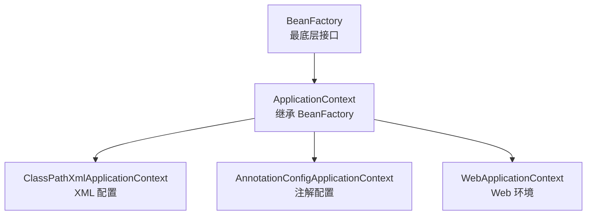
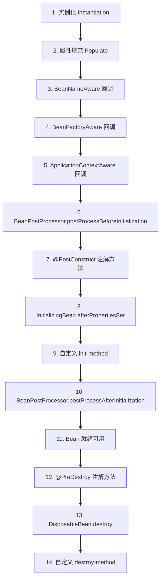

# IoC 容器与 Bean 生命周期

## ⭐ 面试重点速览

| 知识模块 | 重点内容 | 面试频率 |
|----------|----------|----------|
| IoC 与 DI | 概念辨析、三种注入方式 | 极高 |
| BeanFactory vs ApplicationContext | 层级关系、功能差异、启动时机 | 高 |
| Bean 生命周期 | 完整8阶段流程、PostProcessor 执行顺序 | 极高 |
| Bean 作用域 | singleton / prototype / request / session | 中高 |
| BeanPostProcessor | 扩展点机制、AOP 代理创建时机 | 极高 |
| 包扫描 | @ComponentScan 原理、过滤规则 | 中 |

---

## 一、IoC 与 DI 概念辨析

### 1.1 什么是 IoC（控制反转）？

**IoC（Inversion of Control）** 是一种设计**思想/原则**，将对象的创建和依赖关系的控制权从程序代码"反转"给外部容器（Spring IoC 容器）。

传统开发中，程序员手动 `new` 对象：

```java
// 传统方式 —— 自己控制对象创建
public class OrderService {
    private OrderDao orderDao = new OrderDaoImpl(); // 硬编码，紧耦合
}
```

使用 IoC 后，容器负责创建和管理对象：

```java
// IoC 方式 —— 容器控制对象创建，松耦合
@Service
public class OrderService {
    @Autowired
    private OrderDao orderDao; // 容器自动注入，面向接口
}
```

### 1.2 什么是 DI（依赖注入）？

**DI（Dependency Injection）** 是 IoC 的**具体实现方式**。容器通过构造器、Setter 方法或字段，自动将依赖对象"注入"到目标对象中。

::: tip IoC 与 DI 的关系
- **IoC 是"道"**（设计思想）：将控制权从程序代码转移给容器
- **DI 是"术"**（实现手段）：通过注入方式实现依赖关系的管理
- DI 是实现 IoC 的主要方式，但不是唯一方式（还有依赖查找 Dependency Lookup）
:::

### 1.3 ⭐ 三种注入方式对比

| 方式 | 示例 | 优点 | 缺点 | 推荐度 |
|------|------|------|------|--------|
| **构造器注入** | `public A(B b) { this.b = b; }` | 不可变、强制依赖、便于测试 | 参数多时冗长 | ⭐⭐⭐ 推荐 |
| **Setter 注入** | `public void setB(B b) { this.b = b; }` | 灵活、可选依赖 | 对象可能不完整 | ⭐⭐ 可选依赖用 |
| **字段注入** | `@Autowired private B b;` | 简洁 | 难以测试、破坏封装 | ⭐ 不推荐 |

```java
// 最佳实践：构造器注入 + Lombok
@Service
@RequiredArgsConstructor  // 为 final 字段生成构造器
public class OrderService {
    private final OrderDao orderDao;      // 强制依赖，不可变
    private final PaymentService payment;  // 构造器注入
}
```

::: danger 为什么不推荐字段注入？
1. **无法测试**：单元测试中必须启动 Spring 容器才能注入
2. **破坏封装**：依赖通过反射注入私有字段，绕过了封装
3. **可能 NPE**：字段可能为 null，编译器无法检查
4. **循环依赖隐患**：字段注入隐藏了循环依赖问题
:::

---

## 二、BeanFactory vs ApplicationContext

### 2.1 层级关系



### 2.2 核心区别

| 特性 | BeanFactory | ApplicationContext |
|------|-------------|-------------------|
| **Bean 加载时机** | 延迟加载（使用时才创建） | 预加载（启动时创建所有单例 Bean） |
| **国际化（i18n）** | 不支持 | 支持 MessageSource |
| **事件发布** | 不支持 | 支持 ApplicationEvent 机制 |
| **环境与 Profile** | 不支持 | 支持 Environment 抽象 |
| **资源加载** | 基础 | 支持 ResourceLoader 统一资源加载 |
| **AOP 集成** | 需手动注册 | 自动集成 |

::: tip 实际开发中
几乎所有场景都使用 ApplicationContext，BeanFactory 主要用于框架底层。Spring Boot 的 `SpringApplication.run()` 返回的就是 `ConfigurableApplicationContext`。
:::

---

## 三、⭐ Bean 生命周期（超高频，必背）

### 3.1 完整生命周期流程图



### 3.2 各阶段详细说明

```java
@Component
public class MyBean implements BeanNameAware, BeanFactoryAware, 
        ApplicationContextAware, InitializingBean, DisposableBean {
    
    private String name;

    // ===== 阶段 1：实例化 =====
    // Spring 通过反射调用无参构造器创建 Bean 实例
    public MyBean() {
        System.out.println("1. 实例化：调用构造方法");
    }

    // ===== 阶段 2：属性填充 =====
    // Spring 将依赖的 Bean 注入到当前 Bean 的成员变量
    @Autowired
    public void setName(String name) {
        this.name = name;
        System.out.println("2. 属性填充：注入依赖 name=" + name);
    }

    // ===== 阶段 3-5：Aware 接口回调 =====
    // 让 Bean 感知到 Spring 容器的存在
    @Override
    public void setBeanName(String beanName) {
        System.out.println("3. BeanNameAware：" + beanName);
    }

    @Override
    public void setBeanFactory(BeanFactory beanFactory) {
        System.out.println("4. BeanFactoryAware");
    }

    @Override
    public void setApplicationContext(ApplicationContext ctx) {
        System.out.println("5. ApplicationContextAware");
    }

    // ===== 阶段 6：BeanPostProcessor 前置处理 =====
    // Spring 最核心的扩展点，AOP 代理在此阶段之后创建

    // ===== 阶段 7-9：初始化 =====
    @PostConstruct
    public void postConstruct() {
        System.out.println("7. @PostConstruct 初始化");
    }

    @Override
    public void afterPropertiesSet() {
        System.out.println("8. InitializingBean.afterPropertiesSet");
    }

    public void customInit() {
        System.out.println("9. 自定义 init-method");
    }

    // ===== 阶段 10：BeanPostProcessor 后置处理 =====
    // ⭐ AOP 动态代理在此阶段生成！
    // AbstractAutoProxyCreator 会在此阶段创建代理对象

    // ===== 阶段 11：Bean 就绪 =====
    // 存入单例池 singletonObjects

    // ===== 阶段 12-14：销毁 =====
    @PreDestroy
    public void preDestroy() {
        System.out.println("12. @PreDestroy 销毁回调");
    }

    @Override
    public void destroy() {
        System.out.println("13. DisposableBean.destroy");
    }

    public void customDestroy() {
        System.out.println("14. 自定义 destroy-method");
    }
}
```

### 3.3 ⭐ BeanPostProcessor 详解

`BeanPostProcessor` 是 Spring 最核心的扩展点，它允许在 Bean 初始化前后进行自定义处理：

```java
// BeanPostProcessor 接口定义
public interface BeanPostProcessor {
    // 初始化前执行
    @Nullable
    default Object postProcessBeforeInitialization(Object bean, String beanName) {
        return bean; // 可以返回原始 Bean 或包装后的 Bean
    }

    // 初始化后执行（⭐ AOP 代理在此生成）
    @Nullable
    default Object postProcessAfterInitialization(Object bean, String beanName) {
        return bean;
    }
}
```

::: danger 面试追问：AOP 代理何时创建？

在 Bean 生命周期的第 10 步 —— `BeanPostProcessor.postProcessAfterInitialization` 阶段，`AbstractAutoProxyCreator`（实现了 BeanPostProcessor）会检查 Bean 是否需要 AOP 增强，如需则创建代理对象。**此时存入单例池的是代理对象，而非原始 Bean**。
:::

---

## 四、Bean 作用域

| 作用域 | 说明 | 使用场景 |
|--------|------|----------|
| **singleton**（默认） | IoC 容器中只有一个实例 | 无状态 Service、Dao、Controller |
| **prototype** | 每次获取都创建新实例 | 有状态的 Bean（如包含用户信息） |
| **request** | 每个 HTTP 请求一个实例 | Web 应用中请求级别的数据 |
| **session** | 每个 HTTP Session 一个实例 | 用户会话信息 |
| **application** | ServletContext 级别单例 | Web 应用全局数据 |

```java
// 作用域定义
@Component
@Scope("prototype")  // 每次获取新实例
public class ShoppingCart {
    private List<Item> items = new ArrayList<>();
    // 每个用户会话有一个独立的购物车
}
```

::: warning 注意：prototype Bean 的生命周期
Spring 只管理 prototype Bean 的创建，**不管理销毁**。prototype Bean 的 `@PreDestroy` 不会被调用，需要手动释放资源。
:::

---

## 五、@ComponentScan 包扫描机制

```java
@Configuration
@ComponentScan(
    basePackages = "com.example.service",  // 扫描包路径
    includeFilters = @ComponentScan.Filter(type = FilterType.ANNOTATION, 
        classes = Service.class),           // 包含的注解
    excludeFilters = @ComponentScan.Filter(type = FilterType.REGEX, 
        pattern = ".*Test.*")               // 排除的类
)
public class AppConfig { }
```

扫描原理：通过 `ClassPathBeanDefinitionScanner` 扫描指定包下的 `.class` 文件，过滤出带有 `@Component`（及其派生注解 `@Service`、`@Repository`、`@Controller`）的类，生成 `BeanDefinition` 注册到容器中。

---

## ⭐ 面试高频问题汇总

### Q1：IoC 和 DI 有什么区别？请用一句话概括。

IoC 是"控制反转"的设计思想（将对象创建权交给容器），DI 是"依赖注入"的实现手段（通过构造器/Setter/字段注入依赖）。**IoC 是目的，DI 是手段**。

### Q2：BeanFactory 和 ApplicationContext 的核心区别是什么？

| 维度 | BeanFactory | ApplicationContext |
|------|-------------|-------------------|
| Bean 加载 | 延迟加载 | 预加载（启动时创建所有单例） |
| 国际化 | 不支持 | 支持 |
| 事件发布 | 不支持 | 支持 |
| 使用场景 | 内存敏感环境 | 常规企业应用 |

**面试加分**：Spring Boot 启动时如果发现 Bean 创建失败，会立即报错（fail-fast），这是 ApplicationContext 预加载的体现。

### Q3：请完整描述 Spring Bean 的生命周期。

**核心 8 步**：实例化 → 属性填充 → Aware 接口回调 → BeanPostProcessor 前置处理 → 初始化（@PostConstruct → InitializingBean → init-method） → BeanPostProcessor 后置处理（AOP 代理创建） → 就绪 → 销毁（@PreDestroy → DisposableBean → destroy-method）

**面试加分**：强调 AOP 代理在 `postProcessAfterInitialization` 阶段创建，存入单例池的是代理对象。

### Q4：为什么 Spring 官方推荐使用构造器注入？

1. **依赖不可变**：final 字段确保依赖初始化后不被修改
2. **强制依赖**：构造器参数强制传入，避免 NPE
3. **便于测试**：单元测试可直接 new 对象传入 mock 依赖
4. **发现循环依赖**：构造器注入的循环依赖启动时即报错，不会被隐藏

### Q5：@Component 和 @Bean 有什么区别？

| 维度 | @Component | @Bean |
|------|-----------|-------|
| 作用位置 | 类级别 | 方法级别 |
| 自动检测 | 可以被 @ComponentScan 扫描 | 需配合 @Configuration |
| 适用场景 | 自己写的类 | 第三方库的类（如 RestTemplate） |
| 控制程度 | 有限 | 完全控制创建过程 |

```java
@Configuration
public class AppConfig {
    // @Bean 适用于引入第三方类
    @Bean
    public RestTemplate restTemplate() {
        return new RestTemplate();
    }
}
```

### Q6：BeanPostProcessor 和 BeanFactoryPostProcessor 有什么区别？

| 维度 | BeanFactoryPostProcessor | BeanPostProcessor |
|------|--------------------------|-------------------|
| 操作对象 | BeanDefinition（元数据） | Bean 实例 |
| 执行时机 | Bean 实例化之前 | Bean 初始化前后 |
| 经典实现 | ConfigurationClassPostProcessor | AbstractAutoProxyCreator |
| 用途 | 修改 Bean 定义（如修改属性值） | 对 Bean 实例进行增强（如 AOP 代理） |

### Q7：Spring 框架中 Bean 是线程安全的吗？

**默认不安全**。Spring 不保证 Bean 的线程安全，因为 Spring 只管理 Bean 的生命周期，不管理并发访问。保证线程安全的方法：
- 使用无状态 Bean（默认 singleton 通常无状态，天然线程安全）
- 使用 `@Scope("prototype")` 为每个线程创建新实例
- 使用 ThreadLocal 存储线程私有数据
- 使用 synchronized / Lock 等并发控制

---

## 面试追问环节

**Q：如果让你手写一个简易 IoC 容器，你会怎么做？**

核心三步：
1. **包扫描**：遍历指定包下所有 `.class` 文件，找到带 `@Component` 注解的类
2. **反射创建**：通过 `Class.newInstance()` 或 `Constructor.newInstance()` 创建实例
3. **依赖注入**：遍历实例的字段，找到带 `@Autowired` 的字段，从容器中获取依赖并反射注入

**Q：Spring 如何解决循环依赖？为什么需要三级缓存？**

详见 [依赖注入与循环依赖](./di-circular) 章节。核心要点：三级缓存通过"提前暴露半成品对象的工厂"来打破循环依赖，且三级缓存（而非二级）是为了解决 AOP 代理对象的循环依赖。