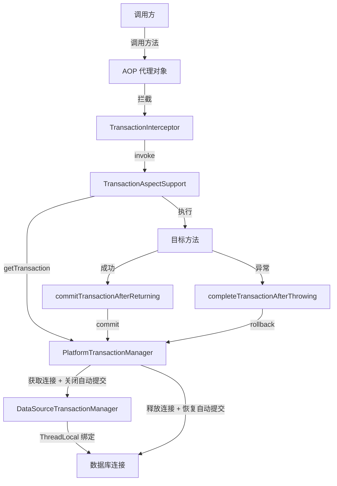
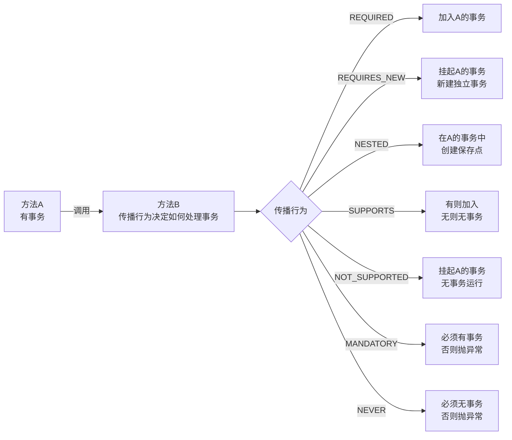

# Spring 事务管理

## ⭐ 面试重点速览

| 知识模块 | 重点内容 | 面试频率 |
|----------|----------|----------|
| 声明式事务原理 | AOP 代理 + TransactionInterceptor + PlatformTransactionManager | 极高 |
| 事务传播行为 | REQUIRED vs REQUIRES_NEW vs NESTED 的区分 | 极高 |
| 事务隔离级别 | 5 种级别与数据库对应关系、脏读/不可重复读/幻读 | 高 |
| @Transactional 失效 | 8 种失效场景及解决方案 | 极高 |
| 编程式事务 vs 声明式事务 | TransactionTemplate 使用、取舍原则 | 中高 |
| 事务超时与回滚 | timeout 机制、rollbackFor 配置 | 中 |

---

## 一、⭐ 声明式事务 @Transactional 原理

### 1.1 核心架构：AOP + TransactionInterceptor + PlatformTransactionManager

Spring 声明式事务的底层实现依赖于 **AOP 代理机制**。当你在方法上标注 `@Transactional` 时，Spring 会为该 Bean 生成一个代理对象，由 `TransactionInterceptor` 拦截方法调用，在方法执行前后通过 `PlatformTransactionManager` 开启/提交/回滚事务。



### 1.2 三大核心接口

```java
// 1. PlatformTransactionManager —— 事务管理器（核心）
public interface PlatformTransactionManager {
    TransactionStatus getTransaction(TransactionDefinition definition);
    void commit(TransactionStatus status);
    void rollback(TransactionStatus status);
}

// 2. TransactionDefinition —— 事务定义（传播行为、隔离级别、超时等）
public interface TransactionDefinition {
    int getPropagationBehavior();  // 传播行为
    int getIsolationLevel();       // 隔离级别
    int getTimeout();              // 超时时间
    boolean isReadOnly();          // 是否只读
}

// 3. TransactionStatus —— 事务运行状态
public interface TransactionStatus extends SavepointManager {
    boolean isNewTransaction();   // 是否新事务
    boolean hasSavepoint();       // 是否有保存点
    void setRollbackOnly();       // 标记仅回滚
    boolean isRollbackOnly();     // 是否标记回滚
}
```

### 1.3 完整执行时序

```java
// TransactionInterceptor 核心流程（伪代码）
public Object invoke(MethodInvocation invocation) {
    PlatformTransactionManager tm = determineTransactionManager(invocation);
    TransactionDefinition td = determineTransactionDefinition(invocation);
    TransactionStatus status = tm.getTransaction(td);  // 开启事务
    
    Object result;
    try {
        result = invocation.proceed();  // 执行业务逻辑
    } catch (Throwable ex) {
        completeTransactionAfterThrowing(status, ex);  // 异常回滚
        throw ex;
    }
    commitTransactionAfterReturning(status);  // 正常提交
    return result;
}
```

::: tip @Transactional 核心就是 AOP 切面
Spring 通过 `@EnableTransactionManagement` 引入 `ProxyTransactionManagementConfiguration` 配置类，注册 `TransactionInterceptor` 作为 AOP 通知（Advice），对 `@Transactional` 标注的方法进行环绕增强。整个过程本质上是 AOP 机制在事务场景下的具体应用。
:::

### 1.4 TransactionManager 的实现类

| 数据访问技术 | TransactionManager 实现类 |
|-------------|--------------------------|
| JDBC / MyBatis | `DataSourceTransactionManager` |
| JPA / Hibernate | `JpaTransactionManager` |
| JTA（分布式事务） | `JtaTransactionManager` |
| Spring Boot 自动配置 | 根据 classpath 自动适配 |

```java
// 手动配置示例（Spring Boot 通常自动配置）
@Configuration
public class TxConfig {
    @Bean
    public PlatformTransactionManager txManager(DataSource dataSource) {
        return new DataSourceTransactionManager(dataSource);
    }
}
```

---

## 二、⭐ 7 种事务传播行为详解

### 2.1 什么是事务传播行为？

**事务传播行为**定义了当前方法被调用时，事务应该如何传播 —— 是加入调用者的事务，还是新建一个事务，还是以非事务方式运行。



### 2.2 7 种传播行为总览

| 传播行为 | 含义 | 调用者无事务 | 调用者有事务 | 典型场景 |
|----------|------|-------------|-------------|----------|
| **REQUIRED**（默认） | 必须使用事务 | 新建事务 | 加入当前事务 | 绝大多数业务方法 |
| **REQUIRES_NEW** | 必须新事务 | 新建事务 | 挂起当前事务，新建独立事务 | 日志记录、消息发送 |
| **NESTED** | 嵌套事务 | 新建事务 | 创建保存点，可回滚到保存点 | 批量处理中部分失败 |
| **SUPPORTS** | 支持事务 | 以非事务运行 | 加入当前事务 | 查询方法 |
| **NOT_SUPPORTED** | 不支持事务 | 以非事务运行 | 挂起当前事务，非事务运行 | 不需要事务的操作 |
| **MANDATORY** | 强制事务 | 抛出异常 | 加入当前事务 | 必须在事务中执行 |
| **NEVER** | 禁止事务 | 以非事务运行 | 抛出异常 | 不允许事务的查询 |

### 2.3 ⭐ REQUIRED vs REQUIRES_NEW（面试必问）

这是面试中最高频的传播行为对比问题。两者的核心区别在于 **事务的独立性**：

```java
@Service
public class OrderService {
    @Autowired
    private LogService logService;
    
    @Transactional  // 外层：REQUIRED（默认）
    public void createOrder(Order order) {
        orderDao.insert(order);
        try {
            logService.recordLog(order);  // 调用独立事务方法
        } catch (Exception e) {
            log.error("日志记录失败，但不影响下单", e);  // ⭐ 日志失败，订单仍可提交
        }
    }
}

@Service
public class LogService {
    @Transactional(propagation = Propagation.REQUIRES_NEW)
    public void recordLog(Order order) {
        logDao.insert(new Log("下单", order.getId()));
        // 抛异常只回滚日志，不影响外层
    }
}
```

**核心行为对比：**

| 场景 | REQUIRED（默认） | REQUIRES_NEW |
|------|-----------------|--------------|
| 外层有事务时 | 加入外层事务 | 挂起外层，新建独立事务 |
| 外层无事务时 | 新建事务 | 新建事务 |
| 内层回滚影响外层 | 会（同一个事务） | **不会**（独立事务） |
| 外层回滚影响内层 | 会（同一个事务） | **不会**（已提交） |
| 内层提交时机 | 与外层一起提交 | **立即提交**（独立提交） |
| 连接持有 | 共用同一连接 | 占用新连接（需注意连接池） |

::: danger REQUIRES_NEW 的陷阱
1. **数据库连接消耗**：`REQUIRES_NEW` 会挂起外层连接并获取新连接，高并发下容易耗尽连接池
2. **外层回滚无法影响内层**：内层事务已独立提交，外层回滚时内层数据不会回滚
3. **死锁风险**：内外层操作同一数据行时，可能因锁冲突导致死锁
:::

### 2.4 NESTED 嵌套事务

`NESTED` 与 `REQUIRES_NEW` 不同，它利用 JDBC **保存点（Savepoint）** 机制，实现事务内的部分回滚：

```java
@Transactional(propagation = Propagation.REQUIRED)
public void batchProcess(List<Item> items) {
    for (Item item : items) {
        try {
            // NESTED：在循环中每个子任务使用保存点
            processItemNested(item);  
        } catch (Exception e) {
            // 失败只回滚到保存点，不影响其他项
            log.error("处理项 {} 失败，继续处理下一项", item.getId(), e);
        }
    }
}

@Transactional(propagation = Propagation.NESTED)
public void processItemNested(Item item) {
    itemDao.update(item);
    // 抛异常时只回滚到保存点，循环中其他项不受影响
}
```

| 维度 | REQUIRES_NEW | NESTED |
|------|-------------|--------|
| 实现方式 | 挂起外层事务，获取新连接 | JDBC Savepoint |
| 连接占用 | 占用独立连接 | 共用同一个连接 |
| 外层提交 | 不影响内层（内层已独立提交） | 外层提交时内层才真正提交 |
| 外层回滚 | 不影响内层 | **会**一起回滚 |
| 数据库支持 | 所有数据库 | 需要数据库支持 Savepoint |
| 适用场景 | 完全独立的子操作 | 需要随外层一起提交的子操作 |

### 2.5 传播行为选择速查

| 需求场景 | 选择 |
|----------|------|
| 必须要有事务，否则抛异常 | MANDATORY |
| 必须没有事务，否则抛异常 | NEVER |
| 有事务就加入，没有也行 | SUPPORTS |
| 必须不用事务 | NOT_SUPPORTED |
| 加入外层事务（最常用） | REQUIRED |
| 独立新事务（日志、审计） | REQUIRES_NEW |
| 嵌套保存点（批量处理） | NESTED |

---

## 三、5 种事务隔离级别

### 3.1 事务并发问题

| 问题 | 描述 | 类比 |
|------|------|------|
| **脏读（Dirty Read）** | 读到其他事务**未提交**的数据 | 看到别人草稿，之后对方可能撤回 |
| **不可重复读（Non-repeatable Read）** | 同一事务内两次读取**同一条**数据结果不同 | 第一次查余额 100，再查变 200 |
| **幻读（Phantom Read）** | 同一事务内两次范围查询结果**行数不同** | 第一次查 10 条记录，再查变 11 条 |

### 3.2 5 种隔离级别与数据库对应关系

| Spring 隔离级别 | 值 | 含义 | 脏读 | 不可重复读 | 幻读 | MySQL 对应 | Oracle 对应 |
|----------------|---|------|------|-----------|------|-----------|------------|
| **DEFAULT** | -1 | 使用数据库默认级别 | — | — | — | RR | RC |
| **READ_UNCOMMITTED** | 1 | 读未提交 | 是 | 是 | 是 | 支持 | 不支持 |
| **READ_COMMITTED** | 2 | 读已提交 | 否 | 是 | 是 | 支持 | 默认 |
| **REPEATABLE_READ** | 4 | 可重复读 | 否 | 否 | 是* | 默认 | 不支持 |
| **SERIALIZABLE** | 8 | 串行化 | 否 | 否 | 否 | 支持 | 支持 |

> *注：MySQL InnoDB 在 REPEATABLE_READ 级别下通过**间隙锁（Gap Lock）** 解决了幻读问题。

```java
@Transactional(isolation = Isolation.READ_COMMITTED)
public void transferMoney(String from, String to, BigDecimal amount) {
    // 转账场景：使用 READ_COMMITTED 即可
    // 不需要可重复读，也不需要避免幻读
    accountDao.debit(from, amount);
    accountDao.credit(to, amount);
}
```

::: warning 隔离级别选型建议
| 场景 | 推荐级别 | 原因 |
|------|----------|------|
| 一般业务（推荐） | **READ_COMMITTED** | 防止脏读，性能好，Spring 默认推荐 |
| 对一致性要求极高 | **REPEATABLE_READ** | 防止不可重复读，MySQL 默认 |
| 金融对账等严格场景 | **SERIALIZABLE** | 避免所有并发问题，但性能最差 |
:::

---

## 四、⭐ @Transactional 失效的 8 种场景（超高频）

### 场景一：非 public 方法

```java
@Service
public class OrderService {
    
    @Transactional  // ❌ 失效！Spring AOP 基于代理，无法拦截非 public 方法
    private void processInternal() {
        // 事务不会生效
    }
    
    @Transactional  // ✅ 正确
    public void processPublic() {
        // 事务正常生效
    }
}
```

**原理**：Spring AOP 默认使用 JDK 动态代理或 CGLIB 代理，只能拦截 `public` 方法。Spring 源码中 `AbstractFallbackTransactionAttributeSource` 会检查方法修饰符，非 public 方法直接返回 null（不应用事务）。

### 场景二：自调用（同一个类内方法互调）

```java
@Service
public class OrderService {
    
    @Transactional
    public void methodA() {
        // 直接调用 this.methodB()，绕过代理
        this.methodB();  // ❌ 事务不生效！
    }
    
    @Transactional(propagation = Propagation.REQUIRES_NEW)
    public void methodB() {
        // 期望新事务，实际不会生效
    }
}
```

```java
// ✅ 解决方案一：注入自身
@Service
public class OrderService {
    @Autowired
    private OrderService self;  // 注入代理对象
    
    @Transactional
    public void methodA() {
        self.methodB();  // 通过代理调用，事务生效
    }
    
    @Transactional(propagation = Propagation.REQUIRES_NEW)
    public void methodB() { /* 新事务生效 */ }
}

// ✅ 解决方案二：拆分到不同 Service 类（最佳实践）
@Service
public class OrderHelper {
    @Transactional(propagation = Propagation.REQUIRES_NEW)
    public void doSomething() { /* ... */ }
}
```

::: tip 自调用本质
代理模式的核心限制：目标对象内部调用 `this.method()` 时不经过代理对象。这是 AOP 的通用问题，不仅限于事务。
:::

### 场景三：异常被 catch 吃掉

```java
@Service
public class OrderService {
    
    @Transactional
    public void createOrder(Order order) {
        try {
            orderDao.insert(order);  // 执行成功
            paymentService.pay(order);  // 抛出 RuntimeException
        } catch (Exception e) {
            log.error("支付失败", e);
            // ❌ 事务不会回滚！异常被吞掉了
            // TransactionInterceptor 感知不到异常
        }
    }
}
```

```java
// ✅ 方案一：手动设置回滚状态
@Transactional
public void createOrder(Order order) {
    try {
        orderDao.insert(order);
        paymentService.pay(order);
    } catch (Exception e) {
        log.error("支付失败", e);
        TransactionAspectSupport.currentTransactionStatus().setRollbackOnly();
        throw new RuntimeException("支付失败，事务回滚", e);
    }
}

// ✅ 方案二：不 catch，让异常自然抛出（推荐）
@Transactional
public void createOrder(Order order) {
    orderDao.insert(order);
    paymentService.pay(order); // 异常自然向上抛出，事务自动回滚
}
```

### 场景四：rollbackFor 未指定

```java
@Service
public class OrderService {
    
    @Transactional  // ❌ 默认只回滚 RuntimeException 和 Error
    public void uploadFile() throws IOException {
        fileDao.save();
        throw new IOException("文件写入失败");  // 事务不会回滚！
        // IOException 是 CheckedException，不在默认回滚范围
    }
}
```

```java
// ✅ 显式指定 rollbackFor
@Transactional(rollbackFor = Exception.class)  // 所有异常都回滚
public void uploadFile() throws IOException {
    fileDao.save();
    throw new IOException("文件写入失败");  // 事务会回滚
}
```

::: danger Spring 默认回滚规则
- 默认回滚：`RuntimeException` 及其子类 + `Error` 及其子类
- 默认不回滚：`CheckedException`（Exception 的非运行时子类）
- **最佳实践**：始终显式指定 `@Transactional(rollbackFor = Exception.class)`
:::

### 场景五：传播机制配置错误

```java
@Service
public class OuterService {
    @Autowired
    private InnerService innerService;
    
    @Transactional
    public void outerMethod() {
        innerService.innerMethod();  // ❌ 期望独立提交，实际加入外层事务
    }
}

@Service
public class InnerService {
    @Transactional  // ❌ 默认 REQUIRED，加入外层事务
    public void innerMethod() { /* ... */ }
    
    // ✅ 正确：使用 REQUIRES_NEW
    @Transactional(propagation = Propagation.REQUIRES_NEW)
    public void innerMethodNew() { /* 独立事务 */ }
}
```

### 场景六：数据库引擎不支持事务

```sql
-- ❌ MySQL MyISAM 引擎不支持事务
CREATE TABLE orders (
    id BIGINT PRIMARY KEY,
    user_id BIGINT
) ENGINE=MyISAM;  -- MyISAM 不事务，@Transactional 无效！

-- ✅ 使用 InnoDB
CREATE TABLE orders (
    id BIGINT PRIMARY KEY,
    user_id BIGINT
) ENGINE=InnoDB;  -- InnoDB 支持事务
```

**Spring 不会报错**，事务注解看似生效，但底层的数据库操作实际上不在事务中，`rollback()` 调用也不会产生任何效果。

### 场景七：多线程环境

```java
@Service
public class OrderService {
    
    @Transactional
    public void processAsync() {
        // 主线程事务
        orderDao.insert(order);
        
        new Thread(() -> {
            // ❌ 新线程，不在原事务中！
            // 新线程需要从 ThreadLocal 获取数据库连接
            // 但事务信息绑定在原线程的 ThreadLocal 上
            logDao.insert(log);
        }).start();
        
        // 或者使用 @Async
        asyncService.doSomething();  // ❌ 异步方法的事务也是独立的
    }
}
```

**原理**：Spring 事务通过 `ThreadLocal` 将数据库连接绑定到当前线程。新线程的 `ThreadLocal` 是空的，获取不到当前事务，因此会在没有事务或独立事务中运行。

### 场景八：Bean 未被 Spring 容器管理

```java
// ❌ 手动 new 出来的对象，不受 Spring 管理
OrderService service = new OrderService();
service.createOrder(order);  // @Transactional 不生效！对象不是 Spring Bean

// ✅ 从容器获取
@Autowired
private OrderService orderService;
orderService.createOrder(order);  // 事务生效
```

::: tip 失效场景总结口诀
**"非公自调异被吞，rollback 未设传播错，库不支持线程新，不是 Bean"**
:::

---

## 五、编程式事务 vs 声明式事务

### 5.1 编程式事务：TransactionTemplate

```java
@Service
public class OrderService {
    @Autowired
    private TransactionTemplate transactionTemplate;
    
    public void createOrder(Order order) {
        // 编程式事务：精确控制事务边界
        transactionTemplate.execute(status -> {
            inventoryDao.decrease(order.getProductId(), order.getQuantity());
            orderDao.insert(order);
            accountDao.debit(order.getUserId(), order.getAmount());
            return null;
        });
    }
    
    // 另一种方式：通过 PlatformTransactionManager
    @Autowired
    private PlatformTransactionManager txManager;
    
    public void createOrderManual(Order order) {
        TransactionStatus status = txManager.getTransaction(
            new DefaultTransactionDefinition());
        try {
            orderDao.insert(order);
            txManager.commit(status);
        } catch (Exception e) {
            txManager.rollback(status);
            throw e;
        }
    }
}
```

### 5.2 两种方式对比

| 维度 | 声明式事务 (@Transactional) | 编程式事务 (TransactionTemplate) |
|------|---------------------------|----------------------------------|
| **实现方式** | AOP 注解，非侵入 | 代码显式调用 API |
| **代码侵入性** | 低（只需注解） | 高（模板代码） |
| **事务粒度** | 方法级别 | 代码块级别（可精确到几行） |
| **事务控制力** | 较弱（依赖配置） | 强（可在代码中动态决定） |
| **自调用支持** | 不生效（代理限制） | 生效（直接管理事务） |
| **异常处理** | 依赖 rollbackFor 配置 | 完全自主控制 |
| **维护成本** | 低 | 较高 |
| **适用场景** | 90% 的常规业务 | 复杂事务逻辑、小粒度控制 |

### 5.3 取舍建议

```java
// 推荐：声明式事务用于常规场景
@Transactional(rollbackFor = Exception.class)
public void createOrder(Order order) {
    orderDao.insert(order);  // 简单业务，一个注解搞定
}

// 编程式事务用于特殊场景：精确到代码块的事务控制，或同一方法内多个独立事务块
public void batchProcess(List<Order> orders) {
    for (Order order : orders) {
        transactionTemplate.execute(status -> {
            try {
                processSingleOrder(order);
                return null;
            } catch (Exception e) {
                status.setRollbackOnly();  // 只回滚当前这一条
                log.error("订单 {} 处理失败", order.getId(), e);
                return null; // 不抛异常，继续处理下一条
            }
        });
    }
}
```

::: tip 实际开发建议
- 绝大多数场景使用声明式事务，代码简洁且不易出错
- 编程式事务作为补充手段，用于声明式事务无法覆盖的精细控制场景
- 同一个项目中，尽量统一使用声明式事务，避免混用造成理解困难
:::

---
## 六、进阶要点

### 6.1 事务同步与 ThreadLocal

Spring 通过 `TransactionSynchronizationManager` 使用多个 `ThreadLocal` 变量管理当前线程的事务上下文，核心包括 `resources`（DataSource -> Connection 映射）、`synchronizations`（事务回调集合）、事务名称、只读状态、隔离级别等。事务提交后必须调用 `clear()` 清理所有 ThreadLocal，防止内存泄漏和线程池复用时的脏数据。

### 6.2 @Transactional 注解完整属性

```java
@Transactional(
    propagation = Propagation.REQUIRED,       // 传播行为：默认
    isolation = Isolation.READ_COMMITTED,      // 隔离级别：读已提交
    timeout = 30,                              // 超时：30 秒
    readOnly = false,                          // 非只读
    rollbackFor = Exception.class,             // 所有异常都回滚
    noRollbackFor = ValidationException.class, // 但校验异常不回滚
    transactionManager = "txManager"           // 指定事务管理器
)
public void createOrder(Order order) {
    orderDao.insert(order);
}
```

::: tip 只读事务优化
`@Transactional(readOnly = true)` 让数据库做优化，MySQL InnoDB 不走 undo log 维护。只用于纯查询方法，写操作不要加此标记。
:::

---

## ⭐ 面试高频问题汇总

### Q1：请描述 Spring 声明式事务的底层原理。

Spring 声明式事务基于 **AOP 代理**实现。当类或方法标注 `@Transactional` 后，Spring 为其创建代理对象，由 `TransactionInterceptor` 作为环绕通知，在方法执行前通过 `PlatformTransactionManager` 开启事务，方法执行成功则提交，出现回滚异常则回滚。链路：调用方 -> 代理 -> TransactionInterceptor -> PlatformTransactionManager -> DataSource（Connection） -> 目标方法。

### Q2：REQUIRED 和 REQUIRES_NEW 的核心区别是什么？

| 维度 | REQUIRED | REQUIRES_NEW |
|------|----------|--------------|
| 事务关系 | 加入外层事务 | 挂起外层，独立新事务 |
| 回滚影响 | 互相影响 | 互不影响 |
| 提交时机 | 与外层一起 | 立即独立提交 |
| 连接消耗 | 共用连接 | 占用新连接 |

- **REQUIRED**：适用于 90% 的常规业务（所有步骤要么全成功，要么全失败）
- **REQUIRES_NEW**：适用于需独立提交的场景，如操作日志记录

### Q3：NESTED 和 REQUIRES_NEW 有什么区别？

- **实现机制**：NESTED 基于 JDBC Savepoint；REQUIRES_NEW 基于挂起外层事务获取新连接
- **提交行为**：NESTED 内层随外层一起提交；REQUIRES_NEW 内层独立提交
- **回滚行为**：NESTED 外层回滚时内层也回滚；REQUIRES_NEW 互不影响
- **数据库依赖**：NESTED 需数据库支持 Savepoint；REQUIRES_NEW 所有数据库都支持

### Q4：@Transactional 在哪些场景下会失效？至少说出 5 种。

1. **非 public 方法**：AOP 代理无法拦截非 public 方法
2. **同类自调用**：`this.method()` 绕过代理对象
3. **异常被 catch 吃掉**：TransactionInterceptor 感知不到异常
4. **rollbackFor 未正确设置**：CheckedException 不在默认回滚范围
5. **数据库引擎不支持事务**：如 MySQL MyISAM
6. **多线程调用**：事务信息存储在 ThreadLocal 中，跨线程无效
7. **传播机制配置错误**：本应 REQUIRES_NEW 却用了 REQUIRED
8. **Bean 未被 Spring 管理**：手动 new 的对象没有代理

### Q5：事务的隔离级别有哪些？MySQL 默认是什么级别？

| 隔离级别 | 脏读 | 不可重复读 | 幻读 |
|----------|------|-----------|------|
| READ_UNCOMMITTED | 是 | 是 | 是 |
| READ_COMMITTED | 否 | 是 | 是 |
| REPEATABLE_READ | 否 | 否 | 是（MySQL InnoDB 通过间隙锁解决） |
| SERIALIZABLE | 否 | 否 | 否 |

- MySQL InnoDB 默认：**REPEATABLE_READ**
- Oracle 默认：**READ_COMMITTED**
- Spring 推荐：**READ_COMMITTED**（兼顾性能与一致性）

### Q6：声明式事务和编程式事务各有什么优缺点？

| 维度 | 声明式事务 | 编程式事务 |
|------|-----------|-----------|
| 代码侵入性 | 低 | 高 |
| 事务粒度 | 方法级 | 代码块级 |
| 自调用 | 失效 | 生效 |
| 适用场景 | 90% 常规业务 | 精细控制场景 |

**选择原则**：优先声明式事务，当声明式无法满足（如需要方法内多个独立事务块）时才使用编程式。

### Q7：Spring 事务中，同一个事务内的两次查询结果会不一样吗？

**取决于隔离级别**：
- `READ_UNCOMMITTED`：可能不一样（脏读）
- `READ_COMMITTED`：可能不一样（不可重复读）
- `REPEATABLE_READ`：同一行数据一致（但可能有幻读）
- `SERIALIZABLE`：一定一致

### Q8：如何在 Spring 事务中实现部分失败不全部回滚？

四种方式：
1. **REQUIRES_NEW**：将可能失败的操作放入独立事务，失败只回滚独立事务
2. **NESTED + Savepoint**：通过保存点实现部分回滚（需数据库支持）
3. **编程式事务 + try-catch**：`TransactionTemplate` 逐条处理，每条独立提交
4. **setRollbackOnly + 不抛异常**：不推荐，建议重新抛出让调用方感知

### Q9：@Transactional 注解加在类上和加在方法上有什么区别？

- **类级别**：对该类所有 `public` 方法生效，优先级较低
- **方法级别**：只对当前方法生效，覆盖类级别配置，遵循"就近原则"

```java
@Transactional(readOnly = true)  // 类级别：所有方法默认只读
public class QueryService {
    public Order getOrder(Long id) { return orderDao.findById(id); }
    
    @Transactional  // 方法级别覆盖：非只读
    public void updateOrder(Order order) { orderDao.update(order); }
}
```

### Q10：多个事务 TransactionManager 并存时如何指定？

```java
@Transactional(transactionManager = "orderTransactionManager")
public void createOrder(Order order) { /* 使用指定的事务管理器 */ }
```

---

## 面试追问环节

**Q：如果让你设计一个事务管理器，核心要考虑哪些点？**

1. **事务资源绑定**：通过 ThreadLocal 将数据库连接绑定到当前线程
2. **传播行为**：根据配置决定新建/加入/挂起事务
3. **隔离级别**：获取连接时设置对应级别
4. **异常处理**：根据异常类型决定回滚还是提交
5. **资源释放**：事务结束后释放连接、恢复自动提交、清理 ThreadLocal
6. **超时机制**：超时后自动回滚

**Q：Spring 的事务同步器 TransactionSynchronizationManager 是如何工作的？**

通过多个 `ThreadLocal` 变量管理当前线程的事务上下文：`resources`（DataSource -> Connection 映射）保证同一连接复用；`synchronizations`（回调集合）在提交/回滚前后触发。事务提交后必须调用 `clear()` 清理所有 ThreadLocal，防止内存泄漏和线程池复用时的脏数据。