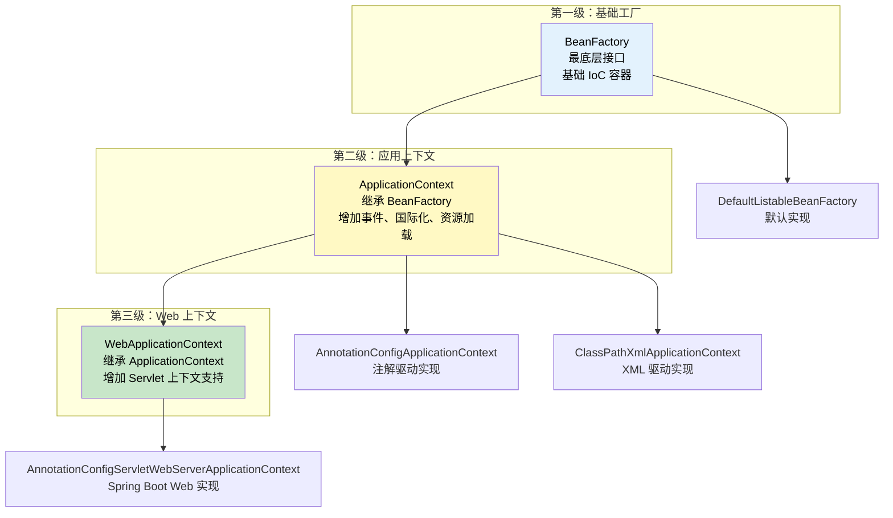
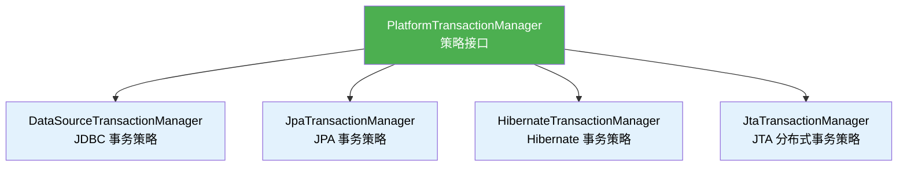
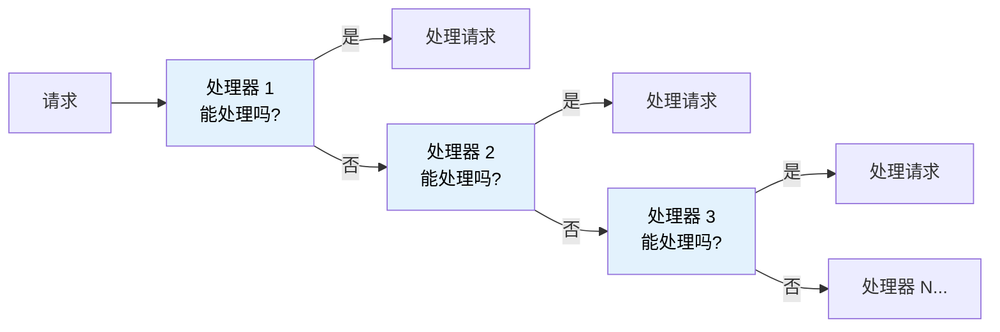
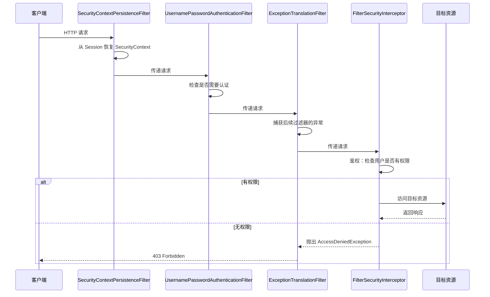
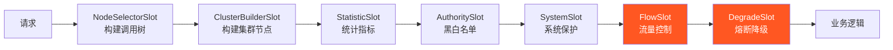
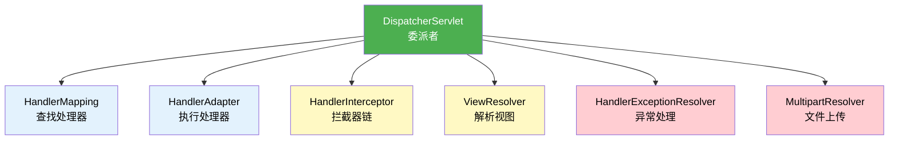
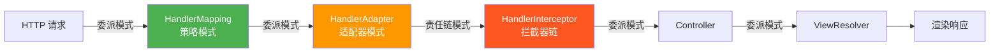

# 进阶模式：工厂·策略·责任链

## ⭐ 面试重点速览

| 知识模块 | 重点内容 | 面试频率 |
|----------|----------|----------|
| 工厂模式 | BeanFactory 三级继承体系、FactoryBean 机制、getObject() 方法 | 极高 |
| 策略模式 | PlatformTransactionManager 多实现切换、Resource 接口、HandlerMapping | 极高 |
| 责任链模式 | Spring Security 过滤器链、Sentinel Slot Chain 原理 | 极高 |
| 适配器模式 | HandlerAdapter 在 Spring MVC 中的解耦作用 | 高 |
| 委派模式 | DispatcherServlet 委派机制、各组件协作流程 | 高 |
| 模式组合 | 工厂+策略、适配器+委派、责任链+策略 的组合实践 | 中高 |

---

## 一、工厂模式：BeanFactory 三级继承体系

### 1.1 什么是工厂模式

**工厂模式（Factory Pattern）** 将对象的创建逻辑封装在工厂类中，让调用方通过工厂获取对象，而不需要直接使用 `new` 关键字。这样可以将对象的创建与使用解耦，符合"依赖倒置原则"。

Spring 的 IoC 容器本身就是一个巨大的工厂，所有 Bean 都由它创建和管理。

### 1.2 ⭐ BeanFactory 三级继承体系

Spring 的工厂体系采用了**分层设计**，从底层到高层逐级扩展功能：



| 层级 | 接口 | 核心能力 | 新增功能 |
|:----:|------|---------|----------|
| **第一级** | `BeanFactory` | 基础 IoC 容器 | Bean 的创建、获取、作用域管理 |
| **第二级** | `ApplicationContext` | 企业级应用上下文 | + 事件发布（ApplicationEvent）<br/>+ 国际化（MessageSource）<br/>+ 资源加载（ResourceLoader）<br/>+ 环境抽象（Environment） |
| **第三级** | `WebApplicationContext` | Web 应用上下文 | + Servlet 上下文（getServletContext）<br/>+ Web 作用域（request/session） |

```java
// 三级继承体系的接口定义
// 第一级：基础工厂
public interface BeanFactory {
    Object getBean(String name) throws BeansException;
    <T> T getBean(Class<T> requiredType) throws BeansException;
    boolean containsBean(String name);
    boolean isSingleton(String name) throws NoSuchBeanDefinitionException;
    // ... 更多基础方法
}

// 第二级：应用上下文（继承 BeanFactory）
public interface ApplicationContext extends BeanFactory,
        MessageSource,           // 国际化
        ApplicationEventPublisher,  // 事件发布
        ResourcePatternResolver,    // 资源加载
        EnvironmentCapable {        // 环境抽象
    // 继承 BeanFactory 的所有方法，并扩展了企业级功能
    String getId();
    String getApplicationName();
    // ...
}

// 第三级：Web 上下文（继承 ApplicationContext）
public interface WebApplicationContext extends ApplicationContext {
    // 扩展 Servlet 上下文访问
    ServletContext getServletContext();
}
```

::: tip 面试加分：为什么需要三级体系？
分层设计体现了**开闭原则**和**单一职责原则**：
- `BeanFactory` 只关注 Bean 管理这一核心职责，保持轻量
- `ApplicationContext` 扩展企业级功能，但复用 BeanFactory 的 Bean 管理能力
- `WebApplicationContext` 只在 Web 场景下使用，不污染非 Web 场景的 `ApplicationContext`
:::

### 1.3 ⭐ FactoryBean vs 普通 Bean

`FactoryBean` 是 Spring 中一个特殊的接口，它本身是一个 Bean，但它的作用是**生产其他 Bean**。这体现了工厂方法模式的精髓。

```java
// FactoryBean 接口定义
public interface FactoryBean<T> {
    /**
     * 返回由该 FactoryBean 创建的对象实例
     * ⭐ 这是工厂方法的核心：getObject() 返回的才是真正的"产品"
     */
    @Nullable
    T getObject() throws Exception;

    /**
     * 返回创建对象的类型
     */
    @Nullable
    Class<?> getObjectType();

    /**
     * 创建的对象是否是单例
     */
    default boolean isSingleton() {
        return true;
    }
}
```

#### FactoryBean 的核心机制：getBean("&name") vs getBean("name")

```java
// 自定义 FactoryBean：创建复杂对象
@Component("myService")
public class MyServiceFactoryBean implements FactoryBean<MyService> {

    @Override
    public MyService getObject() throws Exception {
        // ⭐ 工厂方法：创建复杂对象（如需要多步初始化、远程代理等）
        MyService service = new MyService();
        service.init();               // 初始化
        service.loadConfiguration();  // 加载配置
        return service;               // 返回最终产品
    }

    @Override
    public Class<?> getObjectType() {
        return MyService.class;
    }
}

// 使用方式
@Autowired
private MyService myService;  // 获取的是 FactoryBean.getObject() 的返回值

// 也可以通过容器获取
MyService service = applicationContext.getBean("myService", MyService.class);
// 如果要获取 FactoryBean 本身，需要加 "&" 前缀
MyServiceFactoryBean factoryBean = applicationContext.getBean("&myService", MyServiceFactoryBean.class);
```

| 获取方式 | 获取的对象 | 说明 |
|---------|-----------|------|
| `getBean("myService")` | `MyService` 实例 | 获取 FactoryBean 生产的**产品** |
| `getBean("&myService")` | `MyServiceFactoryBean` 实例 | 获取 FactoryBean **本身** |

::: warning FactoryBean 的典型应用场景
1. **MyBatis 的 `SqlSessionFactoryBean`**：创建 `SqlSessionFactory`，封装了 XML 解析、数据源配置等复杂初始化逻辑
2. **Feign 的 `FeignClientFactoryBean`**：为每个 `@FeignClient` 接口创建动态代理对象
3. **Spring 的 `ProxyFactoryBean`**：基于 FactoryBean 的 AOP 代理创建方式
4. **Redis 的 `LettuceConnectionFactory`**：创建 Redis 连接对象
:::

### 1.4 静态工厂与实例工厂

```java
@Configuration
public class FactoryConfig {

    // 方式一：静态工厂方法 —— 不需要实例化工厂类
    @Bean
    public Car car() {
        return CarFactory.createCar();  // 静态工厂方法
    }

    // 方式二：实例工厂方法 —— 先实例化工厂，再调用工厂方法
    @Bean
    public CarFactory carFactory() {
        return new CarFactory();
    }

    @Bean
    public Car anotherCar(CarFactory carFactory) {
        return carFactory.createCar();  // 实例工厂方法
    }
}

// 静态工厂类
public class CarFactory {
    // 静态工厂方法
    public static Car createCar() {
        return new Car("默认配置");
    }
}
```

---

## 二、策略模式：算法的封装与切换

### 2.1 什么是策略模式

**策略模式（Strategy Pattern）** 定义了一系列**算法族**，将每个算法封装起来，使它们可以互相替换。策略模式让算法的变化**独立于**使用算法的客户端。

```java
// 策略模式的标准结构
// 1. 策略接口
public interface PaymentStrategy {
    void pay(BigDecimal amount);
}

// 2. 具体策略实现
public class AlipayStrategy implements PaymentStrategy {
    @Override
    public void pay(BigDecimal amount) {
        System.out.println("支付宝支付：" + amount);
    }
}

public class WechatPayStrategy implements PaymentStrategy {
    @Override
    public void pay(BigDecimal amount) {
        System.out.println("微信支付：" + amount);
    }
}

// 3. 上下文 —— 持有策略引用，按需切换
public class PaymentContext {
    private PaymentStrategy strategy;

    public void setStrategy(PaymentStrategy strategy) {
        this.strategy = strategy;  // 运行时切换策略
    }

    public void executePayment(BigDecimal amount) {
        strategy.pay(amount);
    }
}
```

### 2.2 ⭐ PlatformTransactionManager —— 事务策略的经典实现

Spring 的事务管理是策略模式的最佳实践之一。`PlatformTransactionManager` 作为策略接口，不同数据访问技术有各自的实现。



```java
// 策略接口：PlatformTransactionManager
public interface PlatformTransactionManager {
    // 根据事务定义获取事务状态
    TransactionStatus getTransaction(@Nullable TransactionDefinition definition)
        throws TransactionException;
    // 提交事务
    void commit(TransactionStatus status) throws TransactionException;
    // 回滚事务
    void rollback(TransactionStatus status) throws TransactionException;
}

// 策略实现 1：JDBC 事务管理器
public class DataSourceTransactionManager extends AbstractPlatformTransactionManager {
    private DataSource dataSource;

    @Override
    protected Object doGetTransaction() {
        // 从 DataSource 获取当前连接
        DataSourceTransactionObject txObject = new DataSourceTransactionObject();
        ConnectionHolder conHolder = (ConnectionHolder)
            TransactionSynchronizationManager.getResource(this.dataSource);
        txObject.setConnectionHolder(conHolder);
        return txObject;
    }

    @Override
    protected void doBegin(Object transaction, TransactionDefinition definition) {
        // 获取连接 → 关闭自动提交 → 设置隔离级别
        DataSourceTransactionObject txObject = (DataSourceTransactionObject) transaction;
        Connection con = dataSource.getConnection();
        con.setAutoCommit(false);  // ⭐ 关闭自动提交，开启事务
        txObject.setConnectionHolder(new ConnectionHolder(con));
    }
}

// 策略实现 2：JPA 事务管理器
public class JpaTransactionManager extends AbstractPlatformTransactionManager {
    private EntityManagerFactory entityManagerFactory;

    @Override
    protected Object doGetTransaction() {
        // 从 EntityManagerFactory 获取事务对象
        // ...
    }
}

// 使用方式：Spring Boot 根据 classpath 中的依赖自动选择合适的策略
// 有 spring-boot-starter-data-jpa → JpaTransactionManager
// 有 spring-boot-starter-jdbc → DataSourceTransactionManager
// 有 spring-boot-starter-data-jpa + JTA 依赖 → JtaTransactionManager
```

::: tip 策略模式的核心价值
`PlatformTransactionManager` 让上层代码（如 `@Transactional` 注解处理器）不需要关心底层使用的是 JDBC、JPA 还是 Hibernate。**新增一种事务管理器只需要实现 `PlatformTransactionManager` 接口，无需修改现有代码** —— 完美符合开闭原则。
:::

### 2.3 Resource 接口 —— 资源加载的策略

`Resource` 接口是策略模式在 Spring 资源加载中的体现，不同资源类型有不同的实现：

```java
// 策略接口：Resource
public interface Resource extends InputStreamSource {
    boolean exists();
    boolean isReadable();
    boolean isOpen();
    URL getURL() throws IOException;
    File getFile() throws IOException;
    // ...
}

// 不同策略实现对应不同资源类型
Resource classPathResource = new ClassPathResource("application.yml");     // classpath 资源
Resource fileResource = new FileSystemResource("/etc/config/app.yml");    // 文件系统资源
Resource urlResource = new UrlResource("https://example.com/config.yml"); // 网络资源

// ApplicationContext 作为 ResourceLoader，统一加载各类资源
@Autowired
private ApplicationContext context;

// 策略模式：根据 classpath: / file: / http: 前缀自动选择策略
Resource r1 = context.getResource("classpath:data.sql");
Resource r2 = context.getResource("file:/opt/data.sql");
Resource r3 = context.getResource("https://example.com/data.sql");
```

### 2.4 HandlerMapping —— 请求映射的策略

Spring MVC 的 `HandlerMapping` 是策略模式的另一个经典应用：

```java
// 策略接口：HandlerMapping
public interface HandlerMapping {
    @Nullable
    HandlerExecutionChain getHandler(HttpServletRequest request) throws Exception;
}

// 策略实现 1：根据 URL 路径映射到 Controller 方法
// RequestMappingHandlerMapping —— 处理 @RequestMapping 注解

// 策略实现 2：根据 Bean 名称映射到 Controller
// BeanNameUrlHandlerMapping —— 处理 Bean 名称以 "/" 开头的 Controller

// 策略实现 3：处理静态资源
// SimpleUrlHandlerMapping —— 处理 /static/** 等静态资源路径

// DispatcherServlet 按优先级依次尝试所有 HandlerMapping
// 找到第一个能处理请求的 HandlerMapping 后停止
```

**策略模式的三个 Spring 实例对比**：

| 策略接口 | 具体策略实现 | 切换依据 | 面试要点 |
|---------|-------------|---------|---------|
| `PlatformTransactionManager` | JDBC / JPA / Hibernate / JTA | classpath 中的依赖 | 自动装配，开闭原则 |
| `Resource` | ClassPath / FileSystem / URL | 资源路径前缀 | 统一资源加载抽象 |
| `HandlerMapping` | RequestMapping / BeanNameUrl / SimpleUrl | 请求 URL 匹配 | 优先级链式尝试 |

---

## 三、责任链模式：过滤器链与 Sentinel Slot Chain

### 3.1 什么是责任链模式

**责任链模式（Chain of Responsibility Pattern）** 将请求的发送者和接收者解耦，让多个对象都有机会处理请求。将这些对象连成一条链，请求沿着链传递，直到被某个对象处理。



### 3.2 ⭐ Spring Security 过滤器链

Spring Security 的过滤器链是责任链模式的经典实现。每个过滤器负责一项安全检查，请求依次通过所有过滤器。

```java
// Spring Security 过滤器链的核心接口
public interface SecurityFilterChain {
    boolean matches(HttpServletRequest request);
    List<Filter> getFilters();  // ⭐ 返回过滤器列表（责任链）
}

// 典型过滤器链的配置
@Configuration
@EnableWebSecurity
public class SecurityConfig {

    @Bean
    public SecurityFilterChain filterChain(HttpSecurity http) throws Exception {
        http
            // 每个 .xxxx() 方法在链上添加一个过滤器
            .csrf(csrf -> csrf.disable())                    // 过滤器 1：CSRF 防护
            .cors(cors -> cors.configurationSource(...))     // 过滤器 2：跨域处理
            .authorizeHttpRequests(auth -> auth              // 过滤器 3：授权检查
                .requestMatchers("/api/public/**").permitAll()
                .requestMatchers("/api/admin/**").hasRole("ADMIN")
                .anyRequest().authenticated()
            )
            .formLogin(form -> form.loginPage("/login"))      // 过滤器 4：表单登录
            .logout(logout -> logout.logoutUrl("/logout"))    // 过滤器 5：登出处理
            .sessionManagement(session -> session             // 过滤器 6：会话管理
                .sessionCreationPolicy(SessionCreationPolicy.STATELESS)
            );

        return http.build();
    }
}
```

**请求经过过滤器链的完整流程**：



::: danger 面试重点：Filter 和 Interceptor 的区别
| 维度 | Filter（过滤器） | Interceptor（拦截器） |
|------|-----------------|---------------------|
| 规范 | Servlet 规范 | Spring 框架 |
| 容器 | Servlet 容器管理 | Spring IoC 容器管理 |
| 范围 | 所有请求 | 只拦截 Controller 请求 |
| 能力 | 可以修改请求/响应 | 可以获取 Handler 信息 |
| 执行顺序 | Filter → Interceptor → Controller |
:::

### 3.3 Sentinel Slot Chain —— 阿里 Sentinel 的责任链实现

Sentinel 是阿里巴巴开源的流量控制组件，其核心通过 `ProcessorSlotChain`（责任链）来实现流控、降级、系统保护等功能：

```java
// Sentinel 的责任链结构
public interface ProcessorSlot<T> {
    void entry(Context context, ResourceWrapper resourceWrapper,
               T param, int count, boolean prioritized, Object... args)
        throws Throwable;

    void fireEntry(Context context, ResourceWrapper resourceWrapper,
                   T param, int count, boolean prioritized, Object... args)
        throws Throwable;

    void exit(Context context, ResourceWrapper resourceWrapper,
              int count, Object... args);
}

// 责任链上的 Slot 顺序（链式调用）
// NodeSelectorSlot → ClusterBuilderSlot → LogSlot → StatisticSlot
// → AuthoritySlot → SystemSlot → FlowSlot → DegradeSlot

// NodeSelectorSlot：构建调用树，用于集群流控
// StatisticSlot：统计 QPS / RT 等指标
// FlowSlot：根据限流规则判断是否放行
// DegradeSlot：熔断降级检查
```



---

## 四、适配器模式：HandlerAdapter 在 Spring MVC 中的应用

### 4.1 什么是适配器模式

**适配器模式（Adapter Pattern）** 将一个类的接口转换为客户端期望的另一个接口，使原本不兼容的类可以一起工作。

在 Spring MVC 中，`DispatcherServlet` 需要调用不同类型的 Controller，但它们的接口不统一。`HandlerAdapter` 作为适配器，将不同 Controller 统一适配为 `DispatcherServlet` 可以调用的形式。

```java
// HandlerAdapter 接口 —— 适配器接口
public interface HandlerAdapter {
    // 判断是否支持该类型的 Handler
    boolean supports(Object handler);

    // 调用 Handler 处理请求，返回 ModelAndView
    @Nullable
    ModelAndView handle(HttpServletRequest request,
                        HttpServletResponse response,
                        Object handler) throws Exception;
}

// 适配器 1：适配 @Controller 注解的处理器
public class RequestMappingHandlerAdapter implements HandlerAdapter {
    @Override
    public boolean supports(Object handler) {
        // 支持 HandlerMethod 类型（@RequestMapping 注解的方法）
        return handler instanceof HandlerMethod;
    }

    @Override
    public ModelAndView handle(HttpServletRequest request,
                               HttpServletResponse response, Object handler) {
        // 反射调用 Controller 方法，处理参数绑定、返回值解析等
        return ((HandlerMethod) handler).invokeAndHandle(request, response);
    }
}

// 适配器 2：适配 HttpRequestHandler 接口的处理器
public class HttpRequestHandlerAdapter implements HandlerAdapter {
    @Override
    public boolean supports(Object handler) {
        return handler instanceof HttpRequestHandler;
    }

    @Override
    public ModelAndView handle(HttpServletRequest request,
                               HttpServletResponse response, Object handler) {
        ((HttpRequestHandler) handler).handleRequest(request, response);
        return null;  // HttpRequestHandler 自己处理响应，无需 ModelAndView
    }
}

// 适配器 3：适配普通 Servlet 的处理器
public class SimpleServletHandlerAdapter implements HandlerAdapter {
    @Override
    public boolean supports(Object handler) {
        return handler instanceof Servlet;
    }

    @Override
    public ModelAndView handle(HttpServletRequest request,
                               HttpServletResponse response, Object handler) {
        ((Servlet) handler).service(request, response);
        return null;
    }
}
```

**适配器模式的解耦效果**：

```mermaid
graph TB
    DS[DispatcherServlet<br/>前端控制器] --> HA{HandlerAdapter<br/>适配器}
    HA -->|supports + handle| RMHA[RequestMappingHandlerAdapter<br/>适配 @Controller]
    HA -->|supports + handle| HRHA[HttpRequestHandlerAdapter<br/>适配 HttpRequestHandler]
    HA -->|supports + handle| SSHA[SimpleServletHandlerAdapter<br/>适配 Servlet]

    RMHA --> C1[@Controller<br/>注解处理器]
    HRHA --> C2[HttpRequestHandler<br/>接口处理器]
    SSHA --> C3[Servlet<br/>原始处理器]

    style DS fill:#4CAF50,color:#fff
    style HA fill:#FF9800,color:#fff
```

::: tip 适配器模式的核心价值
`DispatcherServlet` 不需要知道具体 Handler 的类型，只需要通过 `HandlerAdapter.supports()` 判断是否匹配，通过 `HandlerAdapter.handle()` 统一调用。新增一种 Controller 类型只需新增一个 `HandlerAdapter` 实现，无需修改 `DispatcherServlet` 源码。
:::

---

## 五、委派模式：DispatcherServlet 的协作机制

### 5.1 什么是委派模式

**委派模式（Delegation Pattern）** 是一种不属于 GOF 23 种设计模式但广泛使用的模式。它通过一个"委派者"对象将任务分配给多个"被委派者"对象，实现分工协作。

`DispatcherServlet` 是委派模式的典型应用。它不自己处理请求，而是将请求委派给各种组件：

```java
// DispatcherServlet 核心处理流程（简化版）
public class DispatcherServlet extends FrameworkServlet {

    // 核心方法：doDispatch —— 委派模式的集中体现
    protected void doDispatch(HttpServletRequest request, HttpServletResponse response) {
        HttpServletRequest processedRequest = request;
        HandlerExecutionChain mappedHandler = null;

        try {
            // ===== 步骤 1：委派给 HandlerMapping 查找处理器 =====
            // 遍历所有 HandlerMapping，找到第一个能处理的
            mappedHandler = getHandler(processedRequest);
            if (mappedHandler == null) {
                noHandlerFound(processedRequest, response);
                return;
            }

            // ===== 步骤 2：委派给 HandlerAdapter 执行处理器 =====
            // 遍历所有 HandlerAdapter，找到第一个支持该 Handler 的
            HandlerAdapter ha = getHandlerAdapter(mappedHandler.getHandler());

            // ===== 步骤 3：执行拦截器前置处理 =====
            if (!mappedHandler.applyPreHandle(processedRequest, response)) {
                return;
            }

            // ===== 步骤 4：委派给 HandlerAdapter 实际调用 Controller =====
            ModelAndView mv = ha.handle(processedRequest, response, mappedHandler.getHandler());

            // ===== 步骤 5：委派给 ViewResolver 解析视图 =====
            if (mv != null && !mv.wasCleared()) {
                View view = resolveViewName(mv.getViewName(), locale);
                view.render(mv.getModel(), request, response);
            }

            // ===== 步骤 6：执行拦截器后置处理 =====
            mappedHandler.applyPostHandle(processedRequest, response, mv);

        } catch (Exception ex) {
            // 委派给 HandlerExceptionResolver 处理异常
            processDispatchResult(processedRequest, response, mappedHandler, mv, ex);
        }
    }
}
```

**委派关系一览**：



| 委派对象 | 接口 | 职责 |
|---------|------|------|
| `HandlerMapping` | 查找处理器 | 根据请求 URL 找到对应的 Controller |
| `HandlerAdapter` | 执行处理器 | 适配不同类型的 Controller 并调用 |
| `HandlerInterceptor` | 拦截器链 | 请求前后进行拦截处理 |
| `ViewResolver` | 视图解析 | 将逻辑视图名解析为具体 View 对象 |
| `HandlerExceptionResolver` | 异常处理 | 处理 Controller 执行过程中的异常 |
| `MultipartResolver` | 文件上传 | 解析 multipart/form-data 请求 |

::: tip 委派模式 vs 适配器模式 vs 策略模式
- **委派模式**关注"谁来做"（分工协作）：`DispatcherServlet` 自己不干活，把活分给各组件
- **适配器模式**关注"怎么做"（接口转换）：`HandlerAdapter` 把不同接口统一为一种调用方式
- **策略模式**关注"选哪个"（算法选择）：`HandlerMapping` 提供多种映射策略，择优使用

在 Spring MVC 中，这三种模式**组合使用**：`DispatcherServlet`（委派）通过 `HandlerMapping`（策略）找到处理器，再通过 `HandlerAdapter`（适配器）调用处理器。
:::

---

## 六、模式组合：设计模式在 Spring 中的协同工作

### 6.1 DispatcherServlet 中的模式组合

`DispatcherServlet` 是 Spring 中设计模式组合的最佳范例，一条请求处理链路涉及 5 种模式：



### 6.2 事务管理中的模式组合

Spring 事务管理也涉及多种模式的组合：

| 步骤 | 使用的模式 | 具体体现 |
|------|-----------|---------|
| 创建代理 | **代理模式** | `@Transactional` 注解触发的 AOP 代理 |
| 获取事务管理器 | **策略模式** | 根据数据源类型选择 `PlatformTransactionManager` 实现 |
| 执行事务流程 | **模板方法模式** | `TransactionTemplate` 封装事务的开启-执行-提交/回滚流程 |
| 事务同步 | **观察者模式** | `TransactionSynchronization` 在事务各阶段触发回调 |

---

## ⭐ 面试高频问题汇总

### Q1：请描述 Spring BeanFactory 的三级继承体系及每级的作用。

**三级继承体系**：`BeanFactory` → `ApplicationContext` → `WebApplicationContext`

| 层级 | 接口 | 核心能力 |
|:----:|------|---------|
| 1 | `BeanFactory` | 基础 IoC：Bean 的创建、获取、作用域 |
| 2 | `ApplicationContext` | + 事件发布、国际化、资源加载、环境抽象 |
| 3 | `WebApplicationContext` | + Servlet 上下文、Web 作用域 |

**面试加分**：`DefaultListableBeanFactory` 是 `BeanFactory` 的默认实现，`AnnotationConfigServletWebServerApplicationContext` 是 Spring Boot Web 应用的默认上下文。

### Q2：FactoryBean 和普通 Bean 有什么区别？getObject 方法的作用是什么？

| 维度 | 普通 Bean | FactoryBean |
|------|----------|-------------|
| 定义 | 直接提供服务的 Bean | 生产其他 Bean 的工厂 Bean |
| 获取方式 | `getBean("name")` 返回 Bean 本身 | `getBean("name")` 返回 `getObject()` 的产品 |
| 获取自身 | 直接获取 | `getBean("&name")` 获取 FactoryBean 本身 |
| 典型应用 | Service、Controller、Repository | MyBatis `SqlSessionFactoryBean`、Feign `FeignClientFactoryBean` |

`getObject()` 是 FactoryBean 的核心方法，返回该工厂生产的 Bean 实例。Spring 在 `getBean()` 时会检测该 Bean 是否是 FactoryBean，如果是，则调用 `getObject()` 获取真正的产品。

### Q3：策略模式在 Spring 中有哪些典型应用？请举 2-3 个例子。

1. **PlatformTransactionManager**：JDBC、JPA、Hibernate、JTA 等多种事务管理器实现，Spring Boot 根据 classpath 自动选择
2. **Resource 接口**：`ClassPathResource`、`FileSystemResource`、`UrlResource` 等，根据路径前缀自动选择加载策略
3. **HandlerMapping**：`RequestMappingHandlerMapping`、`BeanNameUrlHandlerMapping`、`SimpleUrlHandlerMapping` 等，按优先级依次尝试

核心思想：**定义接口，提供多种实现，运行时按需选择**。

### Q4：Spring Security 的过滤器链是如何体现责任链模式的？

Spring Security 通过 `SecurityFilterChain` 将多个 `Filter` 串联成一条链。每个 HTTP 请求依次经过链上的每个过滤器：

- `SecurityContextPersistenceFilter`：恢复安全上下文
- `UsernamePasswordAuthenticationFilter`：处理表单登录
- `ExceptionTranslationFilter`：捕获认证/授权异常
- `FilterSecurityInterceptor`：执行最终授权决策

每个过滤器处理完自己的职责后，通过 `FilterChain.doFilter()` 将请求传递给下一个过滤器。任何一个过滤器都可以中断链的传递（如认证失败直接返回 401）。

### Q5：Spring MVC 的 HandlerAdapter 是如何体现适配器模式的？

`DispatcherServlet` 需要调用不同类型的 Controller（`@Controller`、`HttpRequestHandler`、Servlet），但这些 Controller 的接口不统一。

`HandlerAdapter` 作为适配器：
- `supports()` 判断是否支持该 Handler 类型
- `handle()` 将 Handler 统一适配为 `DispatcherServlet` 可以调用的形式

三个主要适配器：`RequestMappingHandlerAdapter`（适配注解 Controller）、`HttpRequestHandlerAdapter`（适配 HttpRequestHandler）、`SimpleServletHandlerAdapter`（适配 Servlet）。

### Q6：DispatcherServlet 体现了哪些设计模式？它们之间是如何协作的？

`DispatcherServlet` 体现了至少 5 种设计模式：

1. **委派模式**：将请求处理委派给各组件
2. **策略模式**：`HandlerMapping` 提供多种 URL 映射策略
3. **适配器模式**：`HandlerAdapter` 适配不同类型的 Controller
4. **责任链模式**：`HandlerInterceptor` 拦截器链
5. **模板方法模式**：`doDispatch()` 定义了请求处理的标准流程

协作方式：`DispatcherServlet` 作为委派者，首先通过 `HandlerMapping`（策略模式）找到处理器，再通过 `HandlerAdapter`（适配器模式）调用处理器，处理器调用前后经过 `HandlerInterceptor` 拦截器链（责任链模式）。

### Q7：请解释委派模式，并说明它和代理模式、策略模式的核心区别。

**委派模式**：委派者自己不干活，将任务分配给被委派者。关注"分工协作"。

| 维度 | 委派模式 | 代理模式 | 策略模式 |
|------|---------|---------|---------|
| 核心关注 | 谁来做（分工） | 如何控制访问 | 选哪个算法 |
| 关系 | 一对多 | 一对一 | 一对一（但可切换） |
| 调用方感知 | 委派者可能暴露多个被委派者 | 代理对被代理者透明 | 调用方主动选择策略 |
| Spring 实例 | DispatcherServlet | AOP 代理 | PlatformTransactionManager |

**面试加分**：委派模式不属于 GOF 23 种设计模式，但它是 Spring 框架中应用最广泛的模式之一，也是理解 Spring 源码架构的关键。

### Q8：如何理解 Spring 中设计模式的"组合使用"？请举一个完整的例子。

以 Spring 事务管理为例：

1. **代理模式**：`@Transactional` 注解通过 AOP 代理创建代理对象，拦截方法调用
2. **策略模式**：代理对象内部调用 `PlatformTransactionManager`，根据数据源类型选择 JDBC/JPA/Hibernate 事务管理器
3. **模板方法模式**：`TransactionTemplate` 封装了"开启事务 → 执行业务 → 提交/回滚"的标准流程
4. **观察者模式**：`TransactionSynchronization` 在事务提交前/后、完成时触发回调，通知监听器

这四种模式**层层嵌套**，共同实现了 Spring 声明式事务的完整功能。

---

## 延伸阅读

- [Spring 中的设计模式全景](./index) —— 12 种设计模式总览与面试策略
- [核心模式：代理·模板·观察者](./proxy-template-observer) —— AOP 代理、JdbcTemplate 模板、事件驱动详解
- [IoC 容器与 Bean 生命周期](../spring-framework/ioc) —— BeanFactory 工厂体系的完整讲解
- [AOP 原理与实现](../spring-framework/aop) —— 代理模式在 AOP 中的完整实现
- [事务管理](../spring-framework/transaction) —— 策略模式 + 模板方法 + 代理模式的组合应用