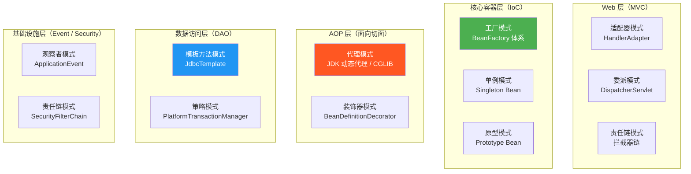
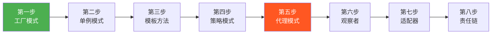

# Spring 中的设计模式全景

## ⭐ 面试重点速览

| 知识模块 | 重点内容 | 面试频率 |
|----------|----------|----------|
| 设计模式总览 | Spring 中用到了哪些设计模式，每种模式的典型场景 | 极高 |
| 代理模式 | JDK 动态代理 vs CGLIB、AOP 底层机制 | 极高 |
| 模板方法模式 | JdbcTemplate / RestTemplate 的设计思想 | 极高 |
| 工厂模式 | BeanFactory 三级继承体系、FactoryBean | 极高 |
| 观察者模式 | ApplicationEvent 事件驱动模型 | 高 |
| 策略模式 | PlatformTransactionManager / Resource 接口 | 高 |
| 单例模式 | Spring 单例 Bean 与 GOF 单例的区别 | 高 |
| 责任链模式 | Spring Security 过滤器链、Sentinel Slot Chain | 中高 |

---

## 一、为什么 Spring 是设计模式的"最佳教科书"

Spring 框架被广泛认为是学习设计模式的绝佳素材，原因有三：

1. **非侵入式设计**：Spring 通过设计模式将框架功能"织入"业务代码，而非让业务代码依赖框架
2. **可扩展性优先**：大量使用模板方法、策略、工厂等模式，让开发者可以替换框架的默认行为
3. **解耦为核心目标**：适配器、委派、观察者等模式让各模块独立演化

**面试金句**：Spring 不是"使用了设计模式"，而是"由设计模式驱动构建"的框架。理解 Spring 中的设计模式，就是理解 Spring 的设计哲学。

---

## 二、12 种设计模式在 Spring 中的应用总览

| 序号 | 模式名称 | Spring 中的应用 | 核心作用 | 面试频率 |
|:----:|----------|----------------|----------|:--------:|
| 1 | **单例模式** | Bean 的默认作用域 `@Scope("singleton")` | 确保一个类只有一个实例，全局共享 | ⭐⭐⭐ |
| 2 | **工厂方法模式** | `BeanFactory` / `ApplicationContext` 的 `getBean()` | 将对象创建逻辑封装在工厂中，解耦调用方与实现类 | ⭐⭐⭐⭐⭐ |
| 3 | **抽象工厂模式** | `BeanFactory` 三级继承体系（BeanFactory → ApplicationContext → WebApplicationContext） | 创建一系列相关或依赖的对象族 | ⭐⭐⭐ |
| 4 | **代理模式** | AOP 底层实现（JDK 动态代理 / CGLIB） | 在不修改原始类的情况下增强其功能 | ⭐⭐⭐⭐⭐ |
| 5 | **模板方法模式** | `JdbcTemplate` / `RestTemplate` / `RedisTemplate` | 定义算法骨架，将可变步骤延迟到子类或回调 | ⭐⭐⭐⭐⭐ |
| 6 | **观察者模式** | `ApplicationEvent` + `@EventListener` 事件机制 | 一对多依赖，主题状态变化时自动通知所有观察者 | ⭐⭐⭐⭐ |
| 7 | **策略模式** | `PlatformTransactionManager` / `Resource` / `HandlerMapping` | 定义一系列算法族，让它们可以互相替换 | ⭐⭐⭐⭐ |
| 8 | **责任链模式** | Spring Security `SecurityFilterChain` / Sentinel `ProcessorSlotChain` | 将请求沿处理器链传递，直到某个处理器处理它 | ⭐⭐⭐⭐ |
| 9 | **适配器模式** | Spring MVC 的 `HandlerAdapter` | 将不兼容的接口转换为客户端期望的接口 | ⭐⭐⭐⭐ |
| 10 | **委派模式** | `DispatcherServlet` 委派给各类组件 | 将任务"委派"给其他对象来执行，实现分工协作 | ⭐⭐⭐ |
| 11 | **装饰器模式** | `BeanDefinitionDecorator` / `ServerHttpRequestDecorator` | 动态地给对象添加额外职责 | ⭐⭐ |
| 12 | **原型模式** | Bean 的 `@Scope("prototype")` 作用域 | 通过拷贝原型实例来创建新对象 | ⭐⭐ |

::: tip 面试策略
面试官问"Spring 中用了哪些设计模式"时，**不要像背菜名一样罗列**。建议按**功能层次**分类回答（见第三部分），每种模式带一个具体例子，体现出你对 Spring 源码的理解深度。
:::

---

## 三、设计模式与 Spring 架构的层次关系

Spring 框架的不同层次使用了不同的设计模式，理解这种层次分布有助于从架构视角回答问题：



| 层次 | 核心设计模式 | 设计意图 |
|------|------------|----------|
| **核心容器（IoC）** | 工厂、单例、原型 | 管理 Bean 的创建和生命周期，实现控制反转 |
| **AOP 代理** | 代理、装饰器 | 在不修改源码的情况下为 Bean 添加横切关注点 |
| **Web MVC** | 适配器、委派、责任链 | 解耦请求处理流程，支持多种 Controller 类型 |
| **数据访问** | 模板方法、策略 | 简化数据访问操作，支持多种数据源切换 |
| **基础设施** | 观察者、责任链 | 实现事件驱动架构和安全过滤机制 |

---

## 四、面试中如何回答「Spring 中用了哪些设计模式」

### 4.1 分类回答策略（推荐）

当面试官抛出这个开放性问题时，按以下思路回答，既有层次感，又展示源码深度：

#### 第一层：IoC 容器相关（最核心）

> "首先是**工厂模式**。Spring 的 `BeanFactory` 和 `ApplicationContext` 本质上就是一个巨大的工厂，通过 `getBean()` 方法创建和管理对象。`ApplicationContext` 继承自 `BeanFactory`，形成了三级继承体系。
>
> `BeanFactory` 创建的所有 **默认单例 Bean 是单例模式的典型应用**，但 Spring 的单例是'容器级别的单例'，和 GOF 的单例不同——同一个 Class 在不同容器中可以有不同实例。"

#### 第二层：AOP 相关（最有技术含量）

> "其次是**代理模式**，这是 Spring AOP 的底层基石。Spring 根据目标类是否实现接口，自动选择 **JDK 动态代理** 或 **CGLIB 代理**。代理对象在 Bean 生命周期的 `postProcessAfterInitialization` 阶段由 `AbstractAutoProxyCreator` 创建。"

#### 第三层：数据访问与模板相关

> "然后是**模板方法模式**。`JdbcTemplate` 定义了 JDBC 操作的标准流程（获取连接 → 执行 SQL → 处理结果 → 释放资源），而将'如何处理 ResultSet'这个可变步骤留给开发者通过 `RowMapper` 回调实现。`RestTemplate` 和 `RedisTemplate` 也是同样的设计思路。"

#### 第四层：Web MVC 相关

> "在 Spring MVC 中，**适配器模式** 通过 `HandlerAdapter` 让 `DispatcherServlet` 可以适配不同类型的 Controller（注解 Controller、HttpRequestHandler 等）。**委派模式** 体现在 `DispatcherServlet` 将请求委派给 HandlerMapping、HandlerAdapter、ViewResolver 等组件处理。"

#### 第五层：事件与安全

> "**观察者模式** 体现在 `ApplicationEvent` 事件机制中，Spring Boot 的启动过程就是由 7 个核心事件驱动的。**责任链模式** 在 Spring Security 的 `SecurityFilterChain` 中体现得最明显。"

### 4.2 一句话总结模板

面试收尾时可以这样说：

> "Spring 中用了大约 12 种设计模式，其中最核心的是**工厂**（IoC 容器）、**代理**（AOP）、**模板方法**（JdbcTemplate）、**观察者**（事件机制）和**适配器**（MVC）。这些模式不是简单堆砌，而是根据'解耦'和'扩展'两大目标有机组合在一起的。"

::: danger 面试雷区
- 只背模式名称，说不出具体应用场景
- 把 Spring 单例和 GOF 单例完全等同
- 说 JDK 动态代理和 CGLIB 是两种"设计模式"（它们是代理模式的两种实现技术）
- 将"委派模式"说成是 GOF 23 种之一（委派模式不在 GOF 中，但被广泛使用）
:::

---

## 五、各模式深度对比（面试加分项）

### 5.1 代理模式 vs 装饰器模式

| 维度 | 代理模式 | 装饰器模式 |
|------|---------|-----------|
| **目的** | 控制访问（权限、延迟加载） | 增强功能（动态添加职责） |
| **关注点** | 对被代理对象的访问控制 | 对被装饰对象的功能扩展 |
| **Spring 实例** | AOP 动态代理 | `ServerHttpRequestDecorator`（包装请求添加功能） |
| **创建方式** | 通常由框架自动创建（隐藏代理细节） | 通常由开发者显式包装 |
| **关系** | 代理对象和被代理对象通常有相同接口 | 装饰器和被装饰对象有相同接口 |

### 5.2 策略模式 vs 模板方法模式

| 维度 | 策略模式 | 模板方法模式 |
|------|---------|-------------|
| **控制权** | 调用方选择策略 | 父类控制流程 |
| **粒度** | 整个算法可替换 | 算法的某个步骤可变 |
| **实现方式** | 接口 + 不同实现类 | 抽象类 + 子类覆盖 |
| **Spring 实例** | `PlatformTransactionManager` 的不同实现 | `JdbcTemplate` 的 `RowMapper` 回调 |
| **适用场景** | 多种算法并列，按需选择 | 流程固定，局部可变 |

### 5.3 工厂模式 vs 抽象工厂模式

| 维度 | 工厂方法模式 | 抽象工厂模式 |
|------|-------------|-------------|
| **产品数量** | 创建单一产品 | 创建产品族（多个相关产品） |
| **Spring 对应** | `getBean(String name)` 获取单个 Bean | `ApplicationContext` 作为产品族工厂（获取 Bean + 获取环境 + 获取资源） |
| **扩展方式** | 新增具体工厂类 | 新增具体工厂族 |

::: tip 面试技巧
当面试官问"某两个模式的区别"时，先分别给出定义和 Spring 中的实例，再用表格对比，最后用一句话总结。结构清晰且有深度。
:::

### 5.4 责任链模式 vs 委派模式

| 维度 | 责任链模式 | 委派模式 |
|------|-----------|---------|
| **核心思想** | 请求沿链传递，直到被处理 | 委派者将任务分配给被委派者 |
| **处理者关系** | 链式串联，按顺序尝试 | 并行分工，各司其职 |
| **是否中断** | 链上某个节点可以终止传递 | 各被委派者独立执行，不中断 |
| **Spring 实例** | SecurityFilterChain 过滤器链 | DispatcherServlet 委派各组件 |
| **典型场景** | 权限校验、过滤器 | 前端控制器、业务协调 |

### 5.5 设计模式分类速查（GOF 三大类）

Spring 中用到的设计模式，按 GOF 分类可以分为三大类：

| 分类 | 包含的模式 | 占比 |
|------|-----------|:----:|
| **创建型模式** | 单例、工厂方法、抽象工厂、原型 | 4/12 |
| **结构型模式** | 代理、适配器、装饰器 | 3/12 |
| **行为型模式** | 模板方法、观察者、策略、责任链、委派（非 GOF） | 5/12 |

::: tip 面试加分
面试官可能会追问"创建型/结构型/行为型模式各举一个 Spring 中的例子"：
- 创建型：`BeanFactory.getBean()`（工厂方法）
- 结构型：`HandlerAdapter`（适配器）
- 行为型：`JdbcTemplate`（模板方法）
:::

---

## 六、设计模式在 Spring 源码中的关键类速查

| 设计模式 | 关键类 / 接口 | 所在模块 | 源码切入点 |
|----------|-------------|----------|-----------|
| 单例模式 | `DefaultSingletonBeanRegistry` | spring-beans | `singletonObjects` 缓存 Map |
| 工厂模式 | `BeanFactory` → `ApplicationContext` | spring-beans / spring-context | `getBean()` 方法 |
| 代理模式 | `JdkDynamicAopProxy` / `CglibAopProxy` | spring-aop | `getProxy()` 方法 |
| 模板方法 | `JdbcTemplate` / `RestTemplate` | spring-jdbc / spring-web | `execute()` 方法 |
| 观察者 | `ApplicationEventMulticaster` | spring-context | `multicastEvent()` 方法 |
| 策略模式 | `PlatformTransactionManager` | spring-tx | `getTransaction()` 方法 |
| 适配器 | `HandlerAdapter` | spring-webmvc | `supports()` + `handle()` |
| 责任链 | `SecurityFilterChain` | spring-security | `doFilter()` 方法 |

---

## 六点五、关键模式代码速览（面试现场手写参考）

面试中有时会被要求"现场写一个体现某设计模式的 Spring 代码"，以下是各模式最简示例：

### 工厂模式：BeanFactory 获取 Bean

```java
// Spring 容器启动后，通过工厂方法获取 Bean
ApplicationContext ctx = SpringApplication.run(MyApp.class, args);
UserService userService = ctx.getBean(UserService.class);  // 工厂方法
userService.doSomething();
```

### 单例模式：Spring 默认单例 Bean

```java
@Service  // 默认 @Scope("singleton")
public class UserService {
    // Spring 容器保证只有一个实例，存放在 singletonObjects 中
}

// 多次获取，返回同一个实例
UserService s1 = ctx.getBean(UserService.class);
UserService s2 = ctx.getBean(UserService.class);
System.out.println(s1 == s2);  // true
```

### 代理模式：AOP 切面增强

```java
@Aspect
@Component
public class LogAspect {
    @Around("execution(* com.example.service.*.*(..))")
    public Object around(ProceedingJoinPoint pjp) throws Throwable {
        System.out.println(">> 开始执行：" + pjp.getSignature().getName());
        Object result = pjp.proceed();  // 调用原始方法
        System.out.println("<< 执行完成：" + pjp.getSignature().getName());
        return result;
    }
}
// 代理对象在 Bean 初始化后由 AbstractAutoProxyCreator 创建
```

### 模板方法模式：JdbcTemplate 回调

```java
@Repository
@RequiredArgsConstructor
public class UserDao {
    private final JdbcTemplate jdbcTemplate;

    public User findById(Long id) {
        // query() 是模板方法，RowMapper 是回调
        return jdbcTemplate.queryForObject(
            "SELECT * FROM users WHERE id = ?",
            (rs, rowNum) -> {  // RowMapper 回调 —— 可变部分
                User user = new User();
                user.setId(rs.getLong("id"));
                user.setName(rs.getString("name"));
                return user;
            },
            id
        );
    }
}
```

### 策略模式：事务管理器切换

```java
// Spring Boot 根据 classpath 自动选择事务管理器策略
// 有 spring-boot-starter-data-jpa → JpaTransactionManager
// 有 spring-boot-starter-jdbc  → DataSourceTransactionManager
// 上层代码无感知，只需使用 @Transactional
@Service
public class OrderService {
    @Transactional  // 不关心底层是 JDBC 还是 JPA 事务
    public void createOrder(OrderDTO dto) {
        orderRepository.save(dto.toEntity());
    }
}
```

### 观察者模式：事件发布与监听

```java
// 发布事件
@Service
@RequiredArgsConstructor
public class OrderService {
    private final ApplicationEventPublisher publisher;

    public void createOrder() {
        // ... 业务逻辑 ...
        publisher.publishEvent(new OrderCreatedEvent(this, orderId));
    }
}

// 监听事件
@Component
public class NotificationListener {
    @EventListener
    public void onOrderCreated(OrderCreatedEvent event) {
        System.out.println("订单创建：" + event.getOrderId());
    }
}
```

### 适配器模式：HandlerAdapter 适配不同 Controller

```java
// DispatcherServlet 通过 HandlerAdapter 统一调用不同类型的处理器
// 无需关心是 @Controller 还是 HttpRequestHandler 还是 Servlet
HandlerAdapter ha = getHandlerAdapter(handler);
ModelAndView mv = ha.handle(request, response, handler);
```

### 责任链模式：Spring Security 过滤器链

```java
@Bean
public SecurityFilterChain filterChain(HttpSecurity http) throws Exception {
    http
        .csrf(CsrfConfigurer::disable)         // 过滤器 1
        .cors(CorsConfigurer::disable)         // 过滤器 2
        .authorizeHttpRequests(auth -> auth    // 过滤器 3
            .anyRequest().authenticated()
        )
        .formLogin(Customizer.withDefaults()); // 过滤器 4
    return http.build();
}
// 请求依次经过：CSRF → CORS → 授权 → 表单登录 过滤器链
```

### 委派模式：DispatcherServlet 委派

```java
// DispatcherServlet 不自己处理请求，委派给各组件
protected void doDispatch(HttpServletRequest req, HttpServletResponse resp) {
    // 委派给 HandlerMapping 查找处理器
    HandlerExecutionChain handler = getHandler(req);
    // 委派给 HandlerAdapter 执行处理器
    HandlerAdapter ha = getHandlerAdapter(handler.getHandler());
    ModelAndView mv = ha.handle(req, resp, handler.getHandler());
    // 委派给 ViewResolver 解析视图
    render(mv, req, resp);
}
```

---

## 七、设计模式学习路径推荐

### 7.1 从 Spring 学设计模式的最佳路径

如果你希望通过 Spring 源码学习设计模式，推荐以下学习路径：



**每个阶段的学习重点**：

| 阶段 | 模式 | 切入点 | 学习目标 |
|:----:|------|-------|---------|
| 1 | 工厂模式 | `BeanFactory.getBean()` 源码 | 理解 IoC 容器的核心运作机制 |
| 2 | 单例模式 | `DefaultSingletonBeanRegistry` 三级缓存 | 理解 Spring 如何解决循环依赖 |
| 3 | 模板方法 | `JdbcTemplate.query()` 源码 | 理解回调模式和流程封装 |
| 4 | 策略模式 | `PlatformTransactionManager` 继承树 | 理解 Spring 如何实现多数据源切换 |
| 5 | 代理模式 | `AbstractAutoProxyCreator` 源码 | 理解 AOP 代理的创建时机和选择策略 |
| 6 | 观察者 | `ApplicationEventMulticaster` 源码 | 理解 Spring Boot 启动流程的事件驱动 |
| 7 | 适配器 | `DispatcherServlet.doDispatch()` 源码 | 理解 Spring MVC 请求处理全流程 |
| 8 | 责任链 | `SecurityFilterChain` 过滤器链 | 理解 Spring Security 的认证授权流程 |

### 7.2 面试准备优先级

| 优先级 | 模式 | 原因 |
|:------:|------|------|
| **P0（必掌握）** | 工厂、代理、模板方法 | 面试出现频率最高，涉及 Spring 核心机制 |
| **P1（高概率）** | 单例、观察者、策略 | 经常作为追问出现 |
| **P2（中概率）** | 适配器、责任链、委派 | 中高级岗位常见 |
| **P3（加分项）** | 装饰器、原型、抽象工厂 | 答出可体现知识广度 |

---

## 八、面试套路：Spring 设计模式答题模板

### 8.1 标准答题结构

当面试官问"Spring 中用了哪些设计模式"时，推荐按以下结构回答：

```
1. 总述（15秒）：
   "Spring 中用了 12 种左右的设计模式，我按层次来分类说明。"

2. 核心容器层（30秒）：
   "最核心的是工厂模式，BeanFactory 三级继承体系..."
   "Bean 的默认作用域是单例模式，但和 GOF 单例有区别..."

3. AOP 层（30秒）：
   "代理模式是 AOP 的基石，JDK 动态代理和 CGLIB 两种方式..."

4. 数据访问层（20秒）：
   "模板方法模式在 JdbcTemplate 中体现得最明显..."

5. Web MVC 层（20秒）：
   "适配器模式和委派模式在 DispatcherServlet 中组合使用..."

6. 总结（10秒）：
   "Spring 的设计模式不是孤立使用，而是围绕'解耦'和'扩展'有机组合。"
```

### 8.2 面试官可能的追问及应对

| 追问 | 应对策略 | 关键词 |
|------|---------|--------|
| "JDK 代理和 CGLIB 代理有什么区别？" | 从原理、条件、性能、继承关系四个维度对比 | 反射、字节码、final |
| "为什么说 Spring 单例不是真正的单例？" | 强调"容器级别"和"类级别"的区别 | 三级缓存、singletonObjects |
| "JdbcTemplate 用了哪些设计模式？" | 主要说模板方法，加分说回调模式 | RowMapper、execute() |
| "DispatcherServlet 用了哪些设计模式？" | 最少说 3 种：委派、适配器、责任链 | doDispatch、HandlerAdapter |
| "这些模式之间有联系吗？" | 举"工厂+代理"或"委派+适配器"的组合例子 | 组合使用 |

---

## ⭐ 面试高频问题汇总

### Q1：请说说 Spring 框架中用了哪些设计模式？每种举一个例子。

**标准回答框架**：按功能层次分类作答（见上文第四部分）。

**精简版（1-2 分钟）**：
1. **工厂模式** —— `BeanFactory` 和 `ApplicationContext` 创建 Bean
2. **代理模式** —— AOP 底层 JDK 动态代理 / CGLIB
3. **模板方法** —— `JdbcTemplate` 定义 JDBC 操作骨架
4. **观察者模式** —— `ApplicationEvent` 事件驱动
5. **适配器模式** —— `HandlerAdapter` 适配不同 Controller
6. **单例模式** —— Spring 容器管理的默认单例 Bean
7. **策略模式** —— `PlatformTransactionManager` 不同事务管理器实现

### Q2：Spring 中的单例和 GOF 设计模式中的单例有什么区别？

| 维度 | GOF 单例 | Spring 单例 |
|------|---------|------------|
| **范围** | 每个 ClassLoader 一个实例 | 每个 IoC 容器一个实例 |
| **保证方式** | 代码层面（私有构造器 + 静态变量） | 容器层面（singletonObjects 缓存） |
| **灵活性** | 严格唯一，无法打破 | 同一个 Class 在不同容器中可有不同实例 |
| **注册方式** | 硬编码在类中 | 通过配置或注解声明 |

**一句话总结**：GOF 单例是"类级别的单例"，Spring 单例是"容器级别、按名称的单例"。

### Q3：AOP 用到了什么设计模式？代理对象是何时创建的？

AOP 使用**代理模式**。代理对象在 Bean 生命周期的 **`postProcessAfterInitialization`** 阶段，由 `AbstractAutoProxyCreator`（实现了 `BeanPostProcessor`）创建。此时存入单例池（`singletonObjects`）的是**代理对象**，而非原始 Bean。

详见 [核心模式：代理·模板·观察者](./proxy-template-observer) 第一章。

### Q4：JdbcTemplate 用到了什么设计模式？设计意图是什么？

`JdbcTemplate` 使用**模板方法模式**。它定义了 JDBC 操作的标准流程（获取连接 → 准备语句 → 执行 SQL → 处理结果集 → 释放资源），而将"如何处理 `ResultSet`"这个**可变步骤**通过 `RowMapper<T>` 回调接口留给开发者实现。

设计意图：
1. 封装重复的、易错的样板代码（连接管理、异常处理）
2. 让开发者只关注业务逻辑（SQL 编写和结果映射）
3. 符合"开闭原则"——流程骨架不变，结果处理可扩展

### Q5：Spring 事件机制用到了什么设计模式？默认是同步还是异步？

使用**观察者模式**。Spring 的 `ApplicationEventPublisher` 作为主题（Subject），`@EventListener` 注解的方法作为观察者（Observer），`ApplicationEventMulticaster` 负责事件的多播分发。

**默认是同步执行的**。事件发布者调用 `publishEvent()` 后，会阻塞等待所有监听器执行完毕。如需异步，可通过 `@Async` + `@EventListener` 或配置自定义线程池的 `ApplicationEventMulticaster` 实现。

### Q6：Spring MVC 的 DispatcherServlet 体现了哪些设计模式？

`DispatcherServlet` 体现了至少三种设计模式：

1. **委派模式**：将请求处理委派给 `HandlerMapping`（查找处理器）、`HandlerAdapter`（执行处理器）、`ViewResolver`（解析视图）等组件
2. **适配器模式**：通过 `HandlerAdapter` 接口适配不同类型的 Controller（`@Controller` 注解、`HttpRequestHandler`、Servlet 等）
3. **责任链模式**：`HandlerInterceptor` 拦截器链在请求处理前后依次执行

### Q7：设计模式在 Spring 中是孤立使用的吗？它们之间有什么联系？

不是孤立的，Spring 中多个设计模式经常**组合使用**。典型组合：

- **工厂 + 代理**：`BeanFactory` 创建 Bean 后，`BeanPostProcessor`（代理模式）对 Bean 进行增强
- **模板方法 + 策略**：`JdbcTemplate`（模板方法）内部可以配置不同的 `DataSource`（策略模式）
- **委派 + 适配器**：`DispatcherServlet`（委派）通过 `HandlerAdapter`（适配器）调用不同类型的处理器
- **观察者 + 责任链**：事件多播器遍历监听器列表（观察者），拦截器链处理请求（责任链）

这种**模式组合**是 Spring 框架灵活性和扩展性的核心来源。

### Q8：Spring 中哪些设计模式不属于 GOF 23 种经典模式？

委派模式（Delegation Pattern）不在 GOF 23 种之中。但它在 Spring 中应用非常广泛——`DispatcherServlet` 将请求处理委派给 `HandlerMapping`、`HandlerAdapter`、`ViewResolver` 等组件。此外，`BeanDefinitionParser` 和 `NamespaceHandler` 也体现了委派模式。

**面试加分**：虽然委派模式不在 GOF 中，但 Martin Fowler 在《企业应用架构模式》中将其列为重要模式。这说明 Spring 不仅使用经典模式，还灵活运用了企业级模式。

### Q9：如果让你用设计模式重构一段 Spring 代码，你会如何选择模式？

选择策略：
1. 如果代码中有大量 `if-else` 判断不同类型 —— 考虑**策略模式**（将每种类型封装为策略）
2. 如果代码中有固定的流程框架，但某些步骤可定制 —— 考虑**模板方法模式**
3. 如果需要在不修改原代码的情况下添加功能 —— 考虑**代理模式**或**装饰器模式**
4. 如果多个对象需要协同处理一个请求 —— 考虑**责任链模式**
5. 如果对象创建逻辑复杂，需要集中管理 —— 考虑**工厂模式**

**核心原则**：不是"为用模式而用模式"，而是"发现代码中的坏味道，用合适的模式解决"。

---

## 延伸阅读

- [核心模式：代理·模板·观察者](./proxy-template-observer) —— AOP 代理、JdbcTemplate 模板、事件驱动三大核心模式深度分析
- [进阶模式：工厂·策略·责任链](./factory-strategy-chain) —— 工厂体系、策略切换、过滤器链等进阶模式详解
- [IoC 容器与 Bean 生命周期](../spring-framework/ioc) —— BeanFactory 工厂体系与 Bean 生命周期的完整讲解
- [AOP 原理与实现](../spring-framework/aop) —— 代理模式在 AOP 中的具体实现
- [Spring 事件机制](../spring-framework/event) —— 观察者模式的事件驱动详解