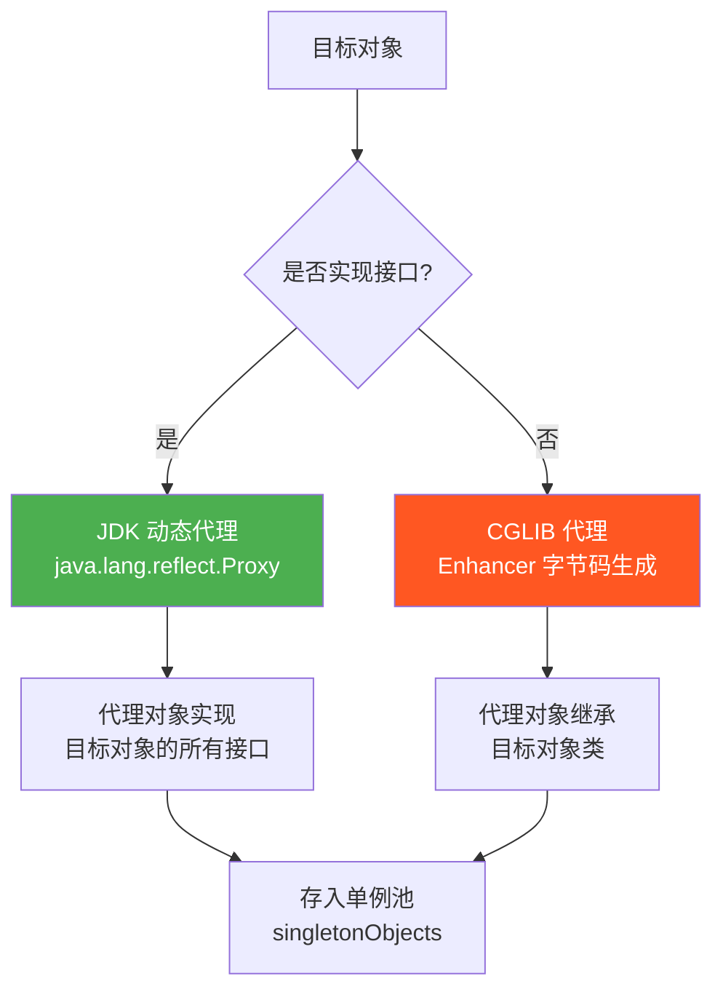
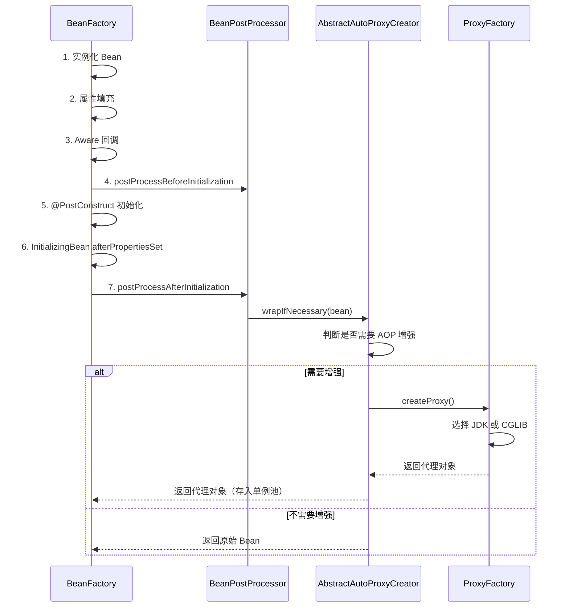
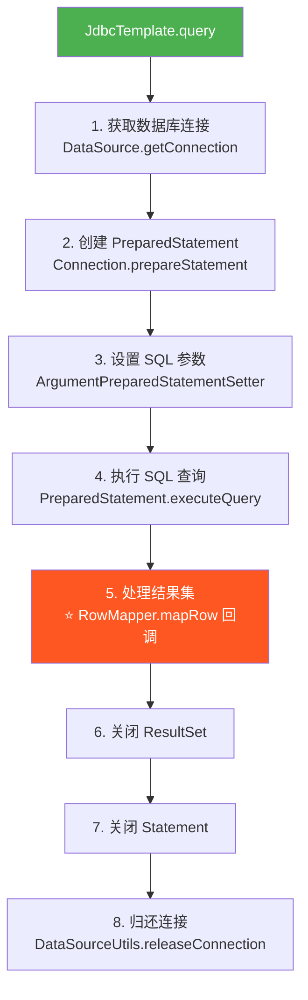
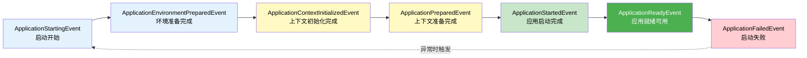

# 核心模式：代理·模板·观察者

## ⭐ 面试重点速览

| 知识模块 | 重点内容 | 面试频率 |
|----------|----------|----------|
| 代理模式 | JDK 动态代理 vs CGLIB 原理、选择策略、AOP 代理创建时机 | 极高 |
| 模板方法模式 | JdbcTemplate 源码骨架、RowMapper 回调、RestTemplate/RedisTemplate 应用 | 极高 |
| 观察者模式 | ApplicationEvent 事件模型、Spring Boot 启动 7 事件、自定义事件 | 极高 |
| 代理 vs 模板 vs 观察者 | 三种模式的本质区别与联系 | 高 |

---

## 一、代理模式：AOP 的底层基石

### 1.1 什么是代理模式

**代理模式（Proxy Pattern）** 为其他对象提供一种**代理**，以控制对这个对象的访问。在 Spring 中，代理模式的核心应用是 **AOP（面向切面编程）**——通过代理对象在不修改原始类的情况下，为方法调用添加横切关注点（日志、事务、权限等）。

```java
// 不使用代理 —— 业务代码和横切逻辑耦合
public class OrderService {
    public void createOrder() {
        // 日志逻辑
        System.out.println("开始创建订单...");
        // 业务逻辑
        // ... 创建订单 ...
        // 事务逻辑
        // ... 提交事务 ...
    }
}

// 使用代理 —— 横切逻辑从业务代码中分离
// 代理对象在调用目标方法前后织入增强逻辑
public class OrderServiceProxy extends OrderService {
    private LogAspect logAspect;
    private TransactionAspect txAspect;

    @Override
    public void createOrder() {
        logAspect.before();          // 前置增强：记录日志
        txAspect.begin();            // 前置增强：开启事务
        try {
            super.createOrder();     // 调用原始业务逻辑
            txAspect.commit();       // 后置增强：提交事务
        } catch (Exception e) {
            txAspect.rollback();     // 异常增强：回滚事务
            throw e;
        } finally {
            logAspect.after();       // 最终增强：记录结束日志
        }
    }
}
```

### 1.2 ⭐ Spring AOP 的两种代理方式

Spring AOP 根据目标对象是否实现接口，自动选择不同的代理技术：



#### JDK 动态代理

基于 Java 反射机制，要求目标对象**必须实现接口**。代理对象是 `java.lang.reflect.Proxy` 的子类，实现了目标对象的所有接口。

```java
// JDK 动态代理核心原理
// 1. 定义 InvocationHandler —— 增强逻辑的载体
public class JdkInvocationHandler implements InvocationHandler {
    private final Object target;  // 被代理的目标对象

    public JdkInvocationHandler(Object target) {
        this.target = target;
    }

    @Override
    public Object invoke(Object proxy, Method method, Object[] args) throws Throwable {
        System.out.println(">> [JDK代理] 前置增强：" + method.getName());
        try {
            Object result = method.invoke(target, args);  // 反射调用目标方法
            System.out.println("<< [JDK代理] 后置增强：" + method.getName());
            return result;
        } catch (Exception e) {
            System.out.println("!! [JDK代理] 异常增强：" + e.getMessage());
            throw e;
        }
    }
}

// 2. 创建代理对象
OrderService target = new OrderServiceImpl();  // 目标对象必须实现接口
OrderService proxy = (OrderService) Proxy.newProxyInstance(
    target.getClass().getClassLoader(),        // 类加载器
    target.getClass().getInterfaces(),          // 目标对象实现的接口
    new JdkInvocationHandler(target)            // InvocationHandler
);
// proxy 是 com.sun.proxy.$Proxy0 的实例，实现了 OrderService 接口
```

#### CGLIB 代理

基于 ASM 字节码生成技术，通过**继承目标类**来创建代理子类。不需要接口，但要求目标类不能是 `final` 的。

```java
// CGLIB 代理核心原理
// 1. 定义 MethodInterceptor —— 增强逻辑的载体
public class CglibMethodInterceptor implements MethodInterceptor {
    private final Object target;

    public CglibMethodInterceptor(Object target) {
        this.target = target;
    }

    @Override
    public Object intercept(Object obj, Method method, Object[] args, MethodProxy proxy) throws Throwable {
        System.out.println(">> [CGLIB代理] 前置增强：" + method.getName());
        try {
            // 使用 MethodProxy 调用父类方法（比反射更快）
            Object result = proxy.invokeSuper(obj, args);
            System.out.println("<< [CGLIB代理] 后置增强：" + method.getName());
            return result;
        } catch (Exception e) {
            System.out.println("!! [CGLIB代理] 异常增强：" + e.getMessage());
            throw e;
        }
    }
}

// 2. 创建代理对象
Enhancer enhancer = new Enhancer();
enhancer.setSuperclass(OrderServiceImpl.class);       // 设置父类（目标类）
enhancer.setCallback(new CglibMethodInterceptor(target));
OrderServiceImpl proxy = (OrderServiceImpl) enhancer.create();
// proxy 是 OrderServiceImpl 的子类实例
```

#### ⭐ JDK 动态代理 vs CGLIB 对比

| 维度 | JDK 动态代理 | CGLIB 代理 |
|------|-------------|-----------|
| **原理** | Java 反射 + 接口实现 | ASM 字节码生成 + 继承 |
| **前置条件** | 目标对象必须实现接口 | 目标类不能是 `final`，方法不能是 `final` |
| **性能** | 创建快，反射调用略慢（早期版本） | 创建慢（生成字节码），调用快 |
| **对象关系** | 代理对象和目标对象是兄弟（实现同一接口） | 代理对象是目标对象的子类 |
| **内部调用** | 同类方法内部调用不触发代理 | 同类方法内部调用不触发代理（相同） |
| **Spring 默认** | Spring Boot 1.x 默认 | Spring Boot 2.x+ 默认 |

::: warning Spring Boot 2.0+ 默认使用 CGLIB
从 Spring Boot 2.0 开始，`spring.aop.proxy-target-class` 默认值为 `true`，即默认使用 CGLIB 代理。原因是：
1. 避免开发者忘记为 Service 类抽取接口
2. CGLIB 性能在 JDK 8+ 已大幅优化，接近甚至超过 JDK 代理
3. 统一代理行为，减少因接口缺失导致的代理失败
:::

### 1.3 ⭐ AOP 代理的创建时机（BeanPostProcessor 后置处理阶段）

代理对象不是在 Bean 创建时立即生成的，而是在 **Bean 生命周期的 `postProcessAfterInitialization` 阶段**创建的：

```java
// AbstractAutoProxyCreator 的核心逻辑（简化版）
public abstract class AbstractAutoProxyCreator extends ProxyProcessorSupport
        implements SmartInstantiationAwareBeanPostProcessor {

    // ⭐ 关键方法：在 Bean 初始化之后执行
    @Override
    public Object postProcessAfterInitialization(@Nullable Object bean, String beanName) {
        if (bean != null) {
            Object cacheKey = getCacheKey(bean.getClass(), beanName);
            // 判断是否需要创建代理
            if (this.earlyProxyReferences.remove(cacheKey) != bean) {
                // ⭐ 核心：如果需要增强，就创建代理对象
                return wrapIfNecessary(bean, beanName, cacheKey);
            }
        }
        return bean;  // 不需要增强，返回原始 Bean
    }

    // 创建代理对象的核心逻辑
    protected Object wrapIfNecessary(Object bean, String beanName, Object cacheKey) {
        // 1. 获取所有匹配的 Advisor（切面 = 切点 + 通知）
        Object[] specificInterceptors = getAdvicesAndAdvisorsForBean(
            bean.getClass(), beanName, null);

        if (specificInterceptors != DO_NOT_PROXY) {
            // 2. 创建代理对象
            Object proxy = createProxy(bean.getClass(), beanName,
                specificInterceptors, new SingletonTargetSource(bean));
            return proxy;  // ⭐ 返回代理对象，而非原始 Bean
        }
        return bean;
    }

    // 创建代理（根据配置选择 JDK 或 CGLIB）
    protected Object createProxy(Class<?> beanClass, ...) {
        ProxyFactory proxyFactory = new ProxyFactory();
        proxyFactory.setTargetSource(targetSource);
        // ... 设置 Advisor 链 ...

        // 根据 proxyTargetClass 和接口情况决定代理方式
        if (proxyFactory.isProxyTargetClass()) {
            proxyFactory.setProxyTargetClass(true);  // 强制 CGLIB
        }
        return proxyFactory.getProxy(getProxyClassLoader());
    }
}
```

**完整时间线**：



::: danger 面试重点：存入单例池的是代理对象
注意：经过 `postProcessAfterInitialization` 后，存入 `singletonObjects` 单例池中的可能是**代理对象**而非原始 Bean。后续所有通过 `getBean()` 获取的实际上是代理对象。这也是为什么 `@Transactional` 和 `@Cacheable` 等 AOP 注解能生效的原因。
:::

### 1.4 代理模式失效的典型场景

```java
@Service
public class OrderService {

    @Transactional  // 声明式事务，通过 AOP 代理实现
    public void methodA() {
        // 业务逻辑
    }

    public void methodB() {
        // ⚠️ 失效场景：同类内部调用，绕过了代理
        this.methodA();  // 直接调用 this，不走代理对象
    }
}

// 解决方案：注入自身代理对象
@Service
public class OrderService {
    @Autowired
    private OrderService self;  // 注入代理对象

    public void methodB() {
        self.methodA();  // 通过代理对象调用，AOP 生效
    }
}
```

::: tip 代理失效的 6 大场景
1. **同类内部调用**（`this.method()` 绕过代理）
2. **方法非 public**（AOP 代理只能拦截 public 方法）
3. **final 方法**（CGLIB 无法代理 final 方法）
4. **static 方法**（代理基于实例，无法代理静态方法）
5. **异常被内部吞掉**（事务管理器无法感知异常）
6. **数据库引擎不支持事务**（如 MyISAM）
:::

---

## 二、模板方法模式：xxxTemplate 的设计哲学

### 2.1 什么是模板方法模式

**模板方法模式（Template Method Pattern）** 在一个方法中定义算法的**骨架**（固定流程），将某些**可变步骤**延迟到子类或回调中实现。Spring 中 `JdbcTemplate`、`RestTemplate`、`RedisTemplate` 等 Template 系列都是模板方法模式的经典应用。

```java
// 模板方法模式的标准结构
public abstract class AbstractTemplate {
    // ⭐ 模板方法（final，不可被子类覆盖 —— 控制反转）
    public final void execute() {
        step1();  // 固定步骤
        step2();  // 固定步骤
        step3();  // 可变步骤（子类实现）
        step4();  // 固定步骤
    }

    protected abstract void step3();  // 钩子方法：留给子类实现
}
```

### 2.2 ⭐ JdbcTemplate 源码分析

`JdbcTemplate` 是模板方法模式在 Spring 中的最佳范例。它将 JDBC 操作的标准流程固化，而将"如何处理结果集"这个可变部分抽象为回调。



```java
// JdbcTemplate 核心源码（简化版）
public class JdbcTemplate extends JdbcAccessor implements JdbcOperations {

    // ⭐ 模板方法：定义 JDBC 查询的标准流程
    @Override
    public <T> List<T> query(String sql, RowMapper<T> rowMapper) throws DataAccessException {
        // 步骤 1-4：获取连接、准备语句、设置参数、执行查询（固定流程）
        Connection con = DataSourceUtils.getConnection(getDataSource());
        PreparedStatement ps = null;
        ResultSet rs = null;
        try {
            ps = con.prepareStatement(sql);                   // 2. 创建语句
            applyStatementSettings(ps);                        // 3. 设置参数
            rs = ps.executeQuery();                            // 4. 执行查询

            // ⭐ 步骤 5：处理结果集 —— 可变部分，通过回调交给开发者
            List<T> results = new ArrayList<>();
            int rowNum = 0;
            while (rs.next()) {
                T row = rowMapper.mapRow(rs, rowNum++);       // ⭐ 回调 RowMapper
                results.add(row);
            }
            return results;
        } catch (SQLException ex) {
            // 异常转换：将 SQLException 转为 Spring 的 DataAccessException
            throw getExceptionTranslator().translate("Query", sql, ex);
        } finally {
            JdbcUtils.closeResultSet(rs);                      // 6. 关闭结果集
            JdbcUtils.closeStatement(ps);                      // 7. 关闭语句
            DataSourceUtils.releaseConnection(con, getDataSource()); // 8. 归还连接
        }
    }
}

// ⭐ 回调接口：RowMapper —— 开发者只需关注结果集映射
@FunctionalInterface
public interface RowMapper<T> {
    /**
     * 将 ResultSet 的当前行映射为 Java 对象
     * 开发者只需实现此方法，无需关心连接管理、异常处理等样板代码
     */
    T mapRow(ResultSet rs, int rowNum) throws SQLException;
}

// 使用示例
List<User> users = jdbcTemplate.query(
    "SELECT id, name, email FROM users WHERE age > ?",
    new Object[]{18},                              // SQL 参数
    (rs, rowNum) -> {                              // ⭐ Lambda 实现 RowMapper 回调
        User user = new User();
        user.setId(rs.getLong("id"));
        user.setName(rs.getString("name"));
        user.setEmail(rs.getString("email"));
        return user;
    }
);
```

::: tip 模板方法模式的核心价值
- **对开发者**：只关注 SQL 和结果映射，样板代码（连接管理、异常处理、资源释放）由框架封装
- **对框架**：流程骨架不变，行为可扩展（通过回调接口），符合开闭原则
- **面试加分点**：`JdbcTemplate` 还使用了**回调模式**（Callback Pattern）——`RowMapper` 本质上是一个回调接口，由模板方法在特定时机调用
:::

### 2.3 RestTemplate 与 RedisTemplate 的应用

模板方法模式在 Spring 生态中广泛使用，基本的 Template 都遵循同样的设计理念：

```java
// RestTemplate —— HTTP 请求模板
RestTemplate restTemplate = new RestTemplate();

// 1. GET 请求 —— 模板方法封装了 HTTP 连接的建立、发送、接收、关闭
String result = restTemplate.getForObject(
    "https://api.example.com/users/{id}",
    String.class,  // 响应类型 —— 可变部分
    123            // URI 参数
);

// 2. POST 请求 —— 同样的模板，不同的 HTTP 方法和参数
User user = restTemplate.postForObject(
    "https://api.example.com/users",
    new User("张三", "zhangsan@example.com"),  // 请求体
    User.class                                 // 响应类型
);

// RedisTemplate —— Redis 操作模板
@Autowired
private RedisTemplate<String, Object> redisTemplate;

// 模板方法封装了 Redis 连接的获取、序列化、命令执行、连接释放
redisTemplate.opsForValue().set("key", "value");
Object value = redisTemplate.opsForValue().get("key");
```

**三种 Template 的对比**：

| 维度 | JdbcTemplate | RestTemplate | RedisTemplate |
|------|-------------|--------------|---------------|
| **操作目标** | 关系型数据库 | HTTP REST API | Redis 缓存 |
| **固定流程** | 获取连接 → 执行 SQL → 处理结果 → 释放资源 | 建立连接 → 发送请求 → 接收响应 → 关闭连接 | 获取连接 → 序列化 → 执行命令 → 释放连接 |
| **可变部分** | RowMapper 结果映射 | 响应类型转换 | 序列化策略 |
| **回调接口** | `RowMapper<T>` | `ResponseExtractor<T>` | `RedisSerializer<T>` |
| **异常处理** | SQLException → DataAccessException | RestClientException | RedisSystemException |

---

## 三、观察者模式：Spring 事件驱动模型

### 3.1 什么是观察者模式

**观察者模式（Observer Pattern）** 定义了一种**一对多**的依赖关系，当主题（Subject）的状态发生变化时，所有依赖它的观察者（Observer）都会自动收到通知。

Spring 的事件机制是观察者模式的成熟实现。核心组件：

```mermaid
graph LR
    A[事件源<br/>Event Source] -->|调用 publishEvent| B[事件发布器<br/>ApplicationEventPublisher]
    B -->|委托| C[事件多播器<br/>ApplicationEventMulticaster]
    C -->|遍历分派| D[监听器1<br/>@EventListener]
    C -->|遍历分派| E[监听器2<br/>@EventListener]
    C -->|遍历分派| F[监听器N<br/>@EventListener]

    style B fill:#4CAF50,color:#fff
    style C fill:#FF9800,color:#fff
    style D fill:#2196F3,color:#fff
    style E fill:#2196F3,color:#fff
    style F fill:#2196F3,color:#fff
```

| 观察者模式角色 | Spring 事件机制对应 | 职责 |
|---------------|-------------------|------|
| 主题（Subject） | `ApplicationEventPublisher` | 发布事件 |
| 事件对象 | `ApplicationEvent` | 封装事件数据 |
| 观察者（Observer） | `ApplicationListener` / `@EventListener` | 接收并处理事件 |
| 通知机制 | `ApplicationEventMulticaster` | 将事件多播给所有匹配的监听器 |

### 3.2 自定义事件完整示例

```java
// ===== 步骤 1：定义事件（继承 ApplicationEvent） =====
@Getter
public class OrderCreatedEvent extends ApplicationEvent {
    private final Long orderId;
    private final String username;
    private final BigDecimal amount;

    public OrderCreatedEvent(Object source, Long orderId, String username, BigDecimal amount) {
        super(source);  // source 通常传 this（事件发布者）
        this.orderId = orderId;
        this.username = username;
        this.amount = amount;
    }
}

// ===== 步骤 2：发布事件（注入 ApplicationEventPublisher） =====
@Service
@RequiredArgsConstructor
public class OrderService {
    private final ApplicationEventPublisher eventPublisher;  // 事件发布器

    @Transactional
    public void createOrder(OrderDTO dto) {
        // 1. 保存订单到数据库
        Order order = orderRepository.save(dto.toEntity());

        // 2. ⭐ 发布事件 —— 通知所有监听器
        eventPublisher.publishEvent(new OrderCreatedEvent(
            this, order.getId(), order.getUsername(), order.getAmount()
        ));
    }
}

// ===== 步骤 3：监听事件（使用 @EventListener 注解） =====
@Component
public class OrderEventListeners {

    // 监听器 1：发送短信通知
    @EventListener
    @Async  // 异步执行，不阻塞主流程
    public void sendSms(OrderCreatedEvent event) {
        System.out.println(">> 发送短信：用户 " + event.getUsername()
            + " 的订单 " + event.getOrderId() + " 已创建");
    }

    // 监听器 2：记录审计日志
    @EventListener
    public void auditLog(OrderCreatedEvent event) {
        System.out.println(">> 审计日志：订单 " + event.getOrderId()
            + " 金额 " + event.getAmount() + " 已创建");
    }

    // 监听器 3：条件监听 —— 金额大于 1000 才触发
    @EventListener(condition = "#event.amount > 1000")
    public void riskCheck(OrderCreatedEvent event) {
        System.out.println(">> 风控检查：大额订单 " + event.getOrderId()
            + " 金额 " + event.getAmount());
    }
}
```

### 3.3 ⭐ Spring Boot 启动事件链（7 个核心事件）

Spring Boot 的启动过程由一系列事件驱动，理解这些事件有助于掌握启动流程：



| 序号 | 事件 | 触发时机 | 典型用途 |
|:----:|------|---------|----------|
| 1 | `ApplicationStartingEvent` | 启动开始，Environment 尚未创建 | 早期初始化、注册自定义监听器 |
| 2 | `ApplicationEnvironmentPreparedEvent` | Environment 创建完成，配置加载完毕 | 读取配置、修改环境变量 |
| 3 | `ApplicationContextInitializedEvent` | ApplicationContext 创建完成，Bean 尚未加载 | 上下文初始化后处理 |
| 4 | `ApplicationPreparedEvent` | ApplicationContext 准备完成，BeanDefinition 已加载 | 在 Bean 创建前做最后修改 |
| 5 | `ApplicationStartedEvent` | 应用上下文刷新完成，但 CommandLineRunner 尚未执行 | 应用启动后、Runner 执行前 |
| 6 | `ApplicationReadyEvent` | **应用完全就绪**，可以接收请求 | ⭐ 最常用：启动后初始化任务 |
| 7 | `ApplicationFailedEvent` | 启动过程中发生异常 | 启动失败处理、告警 |

```java
// 监听 ApplicationReadyEvent —— 应用完全就绪后执行初始化
@Component
public class ApplicationStartupListener {

    @EventListener(ApplicationReadyEvent.class)
    public void onApplicationReady() {
        System.out.println("应用已就绪，可以执行初始化任务...");
        // 预热缓存、加载数据等
    }
}
```

::: tip 事件机制默认是同步的
Spring 事件默认使用 `SimpleApplicationEventMulticaster`，**同步执行**——发布者调用 `publishEvent()` 后阻塞等待所有监听器执行完毕。需要异步时使用 `@Async` + `@EventListener`，或者配置自定义线程池的 `ApplicationEventMulticaster`。

**面试追问**：如果监听器中抛出异常，默认会中断事件传播，后续监听器不会执行。可以通过 `@EventListener` 的 `@Order` 控制监听器执行顺序，或用 `@Async` 隔离异常。
:::

---

## 四、三种模式的本质对比

| 维度 | 代理模式 | 模板方法模式 | 观察者模式 |
|------|---------|-------------|-----------|
| **核心思想** | 为对象提供替身，控制访问 | 定义算法骨架，子类实现可变步骤 | 一对多依赖，状态变化自动通知 |
| **控制权** | 代理控制对被代理对象的访问 | 父类控制流程，子类填充细节 | 主题控制通知时机，观察者被动接收 |
| **关系** | 一对一（代理 → 目标） | 一对一（子类 → 父类） | 一对多（主题 → 多个观察者） |
| **Spring 实例** | AOP 动态代理 | JdbcTemplate / RestTemplate | ApplicationEvent 事件机制 |
| **扩展点** | `InvocationHandler.invoke()` | `RowMapper.mapRow()` 回调 | `@EventListener` 注解方法 |
| **典型场景** | 日志、事务、权限增强 | 数据库操作、HTTP 调用模板 | 业务事件通知、启动流程驱动 |

---

## ⭐ 面试高频问题汇总

### Q1：JDK 动态代理和 CGLIB 代理有什么区别？Spring 如何选择？

| 维度 | JDK 动态代理 | CGLIB 代理 |
|------|-------------|-----------|
| 原理 | 反射 + 接口实现 | ASM 字节码 + 继承 |
| 要求 | 必须有接口 | 类和方法不能是 final |
| 创建速度 | 快 | 慢（需生成字节码） |
| 调用速度 | 略慢（反射） | 快（直接调用） |

Spring 的选择策略：如果目标类实现了接口，且未设置 `proxyTargetClass=true`，使用 JDK 代理；否则使用 CGLIB。**Spring Boot 2.0+ 默认 `proxyTargetClass=true`，即默认使用 CGLIB**。

### Q2：AOP 代理对象是在 Bean 生命周期的哪个阶段创建的？

在 **`postProcessAfterInitialization`** 阶段，由 `AbstractAutoProxyCreator`（实现了 `BeanPostProcessor`）创建。此时 Bean 已经完成实例化、属性填充和初始化，`AbstractAutoProxyCreator` 判断是否需要 AOP 增强，如果需要则创建代理对象并返回。**存入单例池的是代理对象，而非原始 Bean**。

### Q3：JdbcTemplate 是如何体现模板方法模式的？为什么要这样设计？

`JdbcTemplate` 定义了 JDBC 操作的标准流程（获取连接 → 准备语句 → 执行 SQL → 处理结果集 → 释放资源）作为**模板方法**，而将"如何处理 `ResultSet`"这个**可变步骤**通过 `RowMapper<T>` 回调接口留给开发者实现。

设计原因：
1. 封装样板代码（连接管理、异常处理、资源释放），减少重复和错误
2. 让开发者只关注业务逻辑（SQL 编写和结果映射）
3. 符合开闭原则：流程骨架不变，结果处理可扩展

### Q4：RestTemplate 和 JdbcTemplate 在模板方法模式的设计上有什么异同？

**相同点**：都定义了标准的操作流程，将可变部分抽象为回调接口。

**不同点**：

| 维度 | JdbcTemplate | RestTemplate |
|------|-------------|--------------|
| 操作目标 | 关系型数据库 | HTTP REST API |
| 可变部分 | 结果集映射（RowMapper） | 响应类型转换（ResponseExtractor） |
| 异常处理 | SQLException → DataAccessException | RestClientException |
| 回调接口 | `RowMapper<T>` | `ResponseExtractor<T>` / `HttpMessageConverter` |

### Q5：Spring Boot 启动过程中有哪些核心事件？它们的执行顺序是什么？

**7 个核心事件**，按执行顺序：
1. `ApplicationStartingEvent` —— 启动开始
2. `ApplicationEnvironmentPreparedEvent` —— 环境准备完成
3. `ApplicationContextInitializedEvent` —— 上下文初始化完成
4. `ApplicationPreparedEvent` —— 上下文准备完成
5. `ApplicationStartedEvent` —— 应用启动完成
6. `ApplicationReadyEvent` —— 应用就绪（最常用）
7. `ApplicationFailedEvent` —— 启动失败（异常时触发）

**面试加分**：Spring Boot 的 auto-configuration 在事件 3-4 之间完成，`CommandLineRunner` 在事件 5-6 之间执行。

### Q6：Spring 事件机制默认是同步还是异步？如何改为异步？

**默认同步**。`SimpleApplicationEventMulticaster` 在调用线程中同步执行所有监听器。

改为异步的两种方式：
1. **注解方式**：`@Async` + `@EventListener`（需启用 `@EnableAsync`）
2. **全局方式**：为 `ApplicationEventMulticaster` 配置自定义线程池

```java
@Bean
public ApplicationEventMulticaster applicationEventMulticaster() {
    SimpleApplicationEventMulticaster multicaster = new SimpleApplicationEventMulticaster();
    multicaster.setTaskExecutor(Executors.newFixedThreadPool(5));
    return multicaster;
}
```

### Q7：代理模式、模板方法模式、观察者模式在 Spring 中有没有组合使用的情况？

有。典型场景：

- **事务管理**：`@Transactional` 通过**代理模式**创建代理对象，`PlatformTransactionManager` 使用**策略模式**支持不同事务管理器，`TransactionTemplate` 使用**模板方法模式**封装事务流程
- **事件与事务**：`@TransactionalEventListener` 结合了**观察者模式**（事件监听）和**代理模式**（事务 AOP），在事务提交后才触发事件

### Q8：Spring 中模板方法模式与回调模式有什么关系？它们是一回事吗？

**不是一回事，但经常配合使用**。

- **模板方法模式**：通过**继承**实现，父类定义算法骨架，子类通过覆盖钩子方法改变行为。编译期确定关系。
- **回调模式**：通过**组合**实现，将可变逻辑封装为回调对象（接口），传递给模板方法。运行期确定关系。

Spring 的 `JdbcTemplate` 实际上**同时使用了两种模式**：
- `JdbcTemplate.query()` 是**模板方法**（定义 JDBC 操作流程）
- `RowMapper` 是**回调接口**（处理结果集的可变逻辑）

**面试加分**：Spring 更倾向于使用回调模式而非传统的模板方法模式（继承），因为组合比继承更灵活，避免了类爆炸问题。

### Q9：在实际项目中，什么场景下你会选择使用观察者模式（事件驱动）？

适合使用 Spring 事件驱动的场景：

1. **业务解耦**：订单创建后，通知库存、物流、积分等多个模块，它们之间不应该直接耦合
2. **异步处理**：发送短信、推送通知等非核心流程，通过 `@Async` 事件异步执行
3. **审计日志**：记录用户操作日志，与业务逻辑分离
4. **数据同步**：数据变更后通知缓存、搜索引擎等外部系统
5. **事务后处理**：通过 `@TransactionalEventListener` 在事务提交后才执行（如发送 MQ 消息）

**反例**：核心业务流程（如扣减库存）不应该用事件驱动，因为事件默认异步可能导致数据不一致。

---

## 延伸阅读

- [Spring 中的设计模式全景](./index) —— 12 种设计模式总览与面试策略
- [进阶模式：工厂·策略·责任链](./factory-strategy-chain) —— 工厂体系、策略切换、过滤器链详解
- [AOP 原理与实现](../spring-framework/aop) —— 代理模式在 AOP 中的完整实现
- [Spring 事件机制](../spring-framework/event) —— 观察者模式的事件驱动详解
- [事务管理](../spring-framework/transaction) —— 模板方法 + 策略模式在事务中的应用