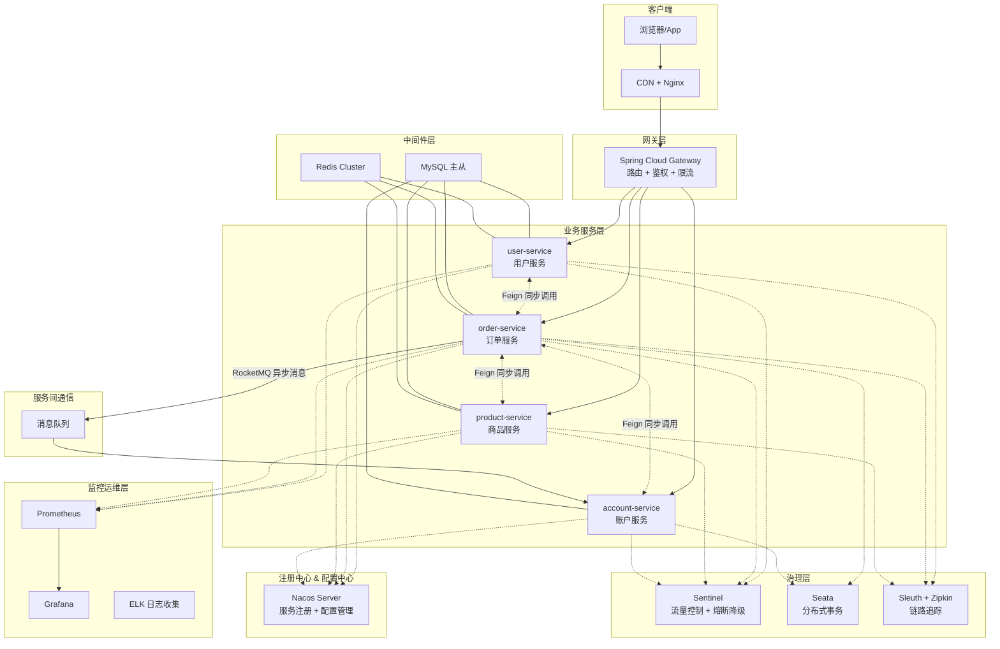
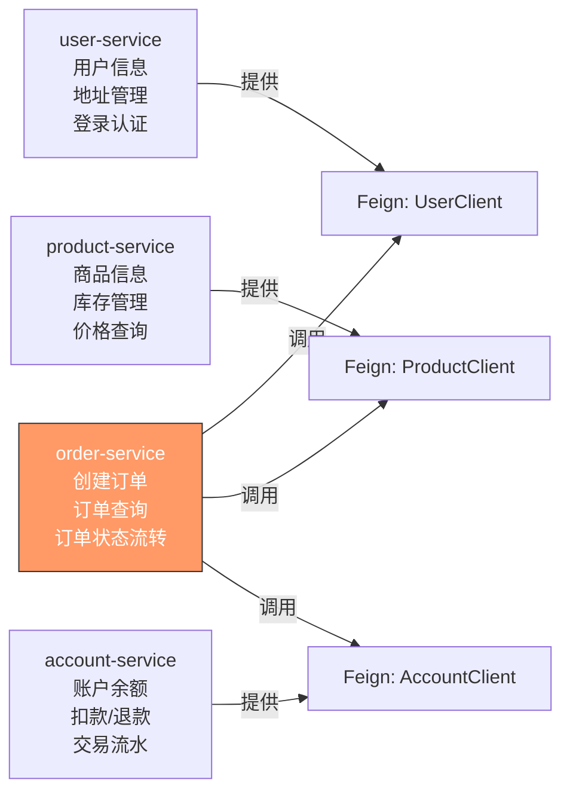
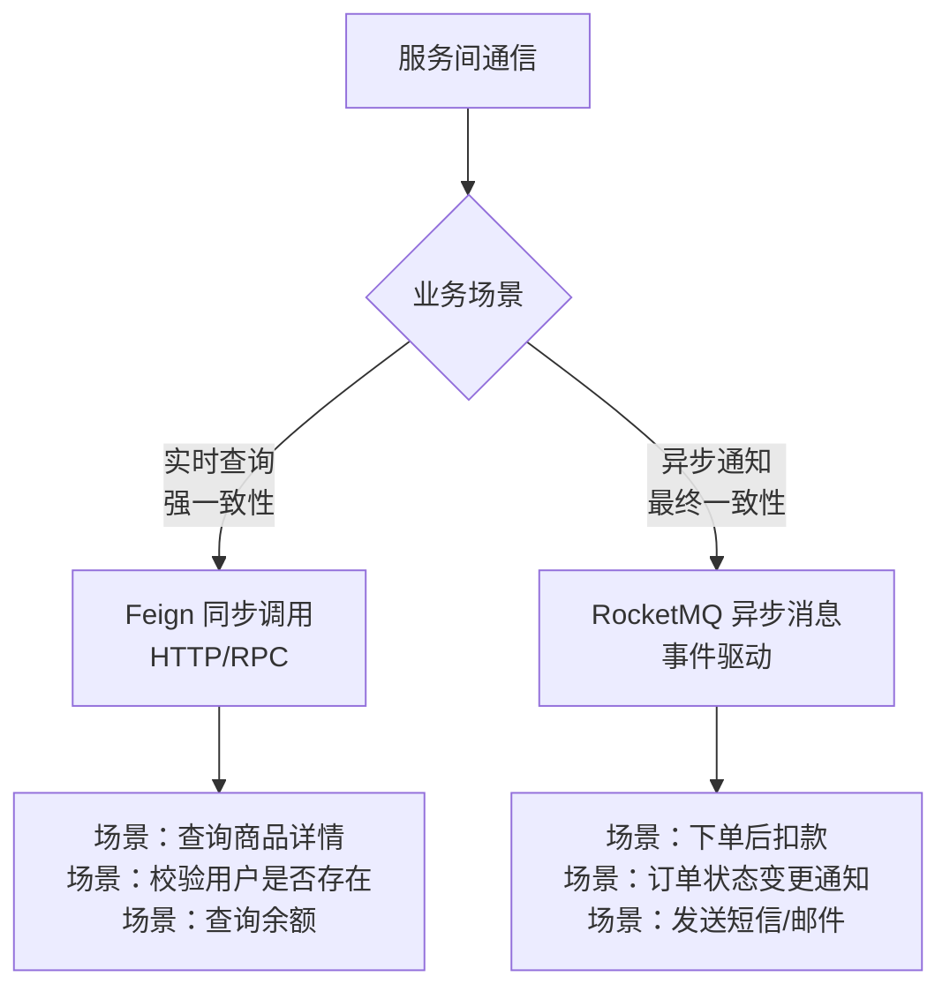
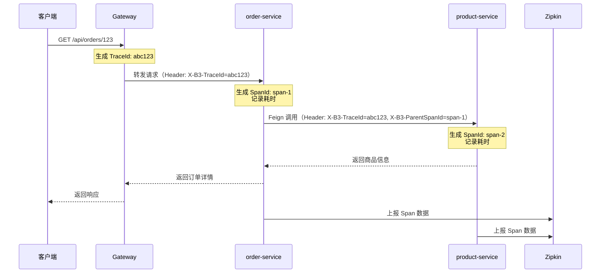

# 微服务架构实战

## ⭐ 面试重点速览

| 知识模块 | 重点内容 | 面试频率 |
|----------|----------|----------|
| 架构设计 | Gateway + Nacos + Feign + Sentinel + Seata + Sleuth 全套组件 | 极高 |
| 服务注册与发现 | Nacos 注册中心，AP/CP 模式切换，健康检查机制 | 高 |
| 服务间通信 | Feign 同步调用 vs MQ 异步消息，场景选择与对比 | 极高 |
| 统一异常处理 | @RestControllerAdvice + 统一 Result 封装 | 高 |
| 分布式链路追踪 | Micrometer Tracing + Zipkin，跨服务请求追踪 | 高 |
| 容器化部署 | Dockerfile + Docker Compose 一键编排启动 | 中高 |
| 监控体系 | Actuator + Prometheus + Grafana 可视化监控 | 中高 |

---

## 一、⭐ 完整微服务架构设计

### 1.1 架构全景图



### 1.2 技术选型与组件职责

| 组件 | 选型 | 核心职责 |
|------|------|----------|
| 注册中心 | Nacos 2.x | 服务注册发现、健康检查、动态配置 |
| 网关 | Spring Cloud Gateway | 统一入口、路由转发、鉴权、限流 |
| 远程调用 | OpenFeign | 声明式 HTTP 客户端，服务间同步调用 |
| 负载均衡 | Spring Cloud LoadBalancer | 客户端负载均衡（替代 Ribbon） |
| 熔断降级 | Sentinel | 流量控制、熔断降级、系统自适应保护 |
| 分布式事务 | Seata | AT 模式自动回滚，TCC 模式手动补偿 |
| 链路追踪 | Micrometer Tracing + Zipkin | 跨服务调用链追踪，性能瓶颈定位 |
| 消息队列 | RocketMQ | 服务间异步解耦，削峰填谷 |
| 监控 | Prometheus + Grafana | 指标采集与可视化 |

---

## 二、项目模块划分与依赖关系

### 2.1 模块结构

```
microservice-mall/
├── mall-gateway/              # 网关模块
│   ├── pom.xml
│   └── src/main/java/...
├── mall-common/               # 公共模块（依赖包）
│   ├── mall-common-core/      #  核心工具类、统一返回、异常定义
│   ├── mall-common-feign/     #  Feign 接口定义 + 降级实现
│   └── mall-common-security/  #  安全认证（JWT）
├── mall-service/              # 业务服务模块
│   ├── user-service/          #  用户服务（端口 8081）
│   ├── order-service/         #  订单服务（端口 8082）
│   ├── product-service/       #  商品服务（端口 8083）
│   └── account-service/       #  账户服务（端口 8084）
├── docker/                    # 容器化部署
│   ├── docker-compose.yml
│   └── Dockerfile
└── docs/                      # 文档
```

### 2.2 服务职责与依赖关系



| 服务 | 端口 | 数据库 | 核心职责 | 依赖服务 |
|------|------|--------|----------|----------|
| user-service | 8081 | user_db | 用户注册、登录、地址管理 | 无 |
| product-service | 8083 | product_db | 商品 CRUD、库存扣减、价格查询 | 无 |
| account-service | 8084 | account_db | 账户余额、扣款、退款、流水 | 无 |
| order-service | 8082 | order_db | 创建订单、状态流转、订单查询 | user + product + account |
| gateway | 8080 | 无 | 路由转发、鉴权、限流 | 所有服务 |

### 2.3 公共模块设计

```java
// mall-common-core —— 公共依赖
// Result.java —— 统一返回格式
@Data
@NoArgsConstructor
@AllArgsConstructor
public class Result<T> {
    private Integer code;
    private String message;
    private T data;

    public static <T> Result<T> success(T data) {
        return new Result<>(200, "success", data);
    }

    public static <T> Result<T> error(Integer code, String message) {
        return new Result<>(code, message, null);
    }
}
```

```java
// mall-common-feign —— Feign 接口定义（契约优先）
// 各服务提供方的 Feign 接口定义在公共模块中，供调用方直接依赖
@FeignClient(
    name = "product-service",           // 服务名（Nacos 中注册的名称）
    path = "/api/products",             // 统一前缀
    fallbackFactory = ProductClientFallbackFactory.class
)
public interface ProductClient {

    @GetMapping("/{id}")
    Result<ProductDTO> getById(@PathVariable("id") Long id);

    @PutMapping("/{id}/stock/deduct")
    Result<Void> deductStock(@PathVariable("id") Long id,
                              @RequestParam("quantity") Integer quantity);
}
```

::: tip 为什么 Feign 接口要放在公共模块？
这是 **"契约优先"** 的设计思想。Feign 接口本质上是一份 API 契约，调用方和服务提供方都需要遵守。放在公共模块中：
1. 调用方直接依赖，无需重复定义
2. 接口变更时编译期即可发现不兼容问题
3. 配合 fallback 实现统一降级逻辑
:::

---

## 三、服务间通信方案

### 3.1 同步调用 vs 异步消息



### 3.2 Feign 同步调用实战

```java
// OrderService.java —— 订单服务中调用其他服务
@Service
@RequiredArgsConstructor
@Slf4j
public class OrderService {

    private final ProductClient productClient;   // Feign 调用商品服务
    private final UserClient userClient;         // Feign 调用用户服务
    private final AccountClient accountClient;   // Feign 调用账户服务

    /**
     * 创建订单（同步调用多个服务）
     */
    @GlobalTransactional  // Seata 分布式事务注解
    public OrderVO createOrder(CreateOrderRequest request) {
        // 1. 调用用户服务：校验用户是否存在
        Result<UserDTO> userResult = userClient.getById(request.getUserId());
        if (userResult.getCode() != 200) {
            throw new BusinessException("用户不存在");
        }
        UserDTO user = userResult.getData();

        // 2. 调用商品服务：查询商品信息 + 锁定库存
        Result<ProductDTO> productResult = productClient.getById(request.getProductId());
        if (productResult.getCode() != 200) {
            throw new BusinessException("商品不存在");
        }
        ProductDTO product = productResult.getData();

        // 3. 扣减库存（Feign 调用商品服务）
        Result<Void> stockResult = productClient.deductStock(
            request.getProductId(), request.getQuantity());
        if (stockResult.getCode() != 200) {
            throw new BusinessException("库存不足");
        }

        // 4. 创建订单（本地操作）
        Order order = saveOrder(request, user, product);

        // 5. 调用账户服务：扣款
        Result<Void> payResult = accountClient.deduct(
            request.getUserId(), product.getPrice() * request.getQuantity());
        if (payResult.getCode() != 200) {
            throw new BusinessException("余额不足");
        }

        return OrderVO.from(order, user, product);
    }
}
```

### 3.3 MQ 异步消息实战

```java
// 订单创建成功后，异步发送通知
@Service
@RequiredArgsConstructor
public class OrderEventPublisher {

    private final RocketMQTemplate rocketMQTemplate;

    /**
     * 订单创建成功后，发布事件（异步解耦）
     */
    public void publishOrderCreated(Order order) {
        OrderCreatedEvent event = OrderCreatedEvent.builder()
            .orderId(order.getId())
            .userId(order.getUserId())
            .productId(order.getProductId())
            .amount(order.getTotalAmount())
            .createTime(LocalDateTime.now())
            .build();

        // 异步发送，不阻塞主流程
        rocketMQTemplate.asyncSend("order-created-topic", event, 
            new SendCallback() {
                @Override
                public void onSuccess(SendResult result) {
                    log.info("订单事件发送成功：orderId={}", order.getId());
                }
                @Override
                public void onException(Throwable e) {
                    log.error("订单事件发送失败：orderId={}", order.getId(), e);
                    // 写入本地事件表，定时补偿
                }
            });
    }
}
```

```java
// 账户服务消费订单事件，执行扣款
@Component
@RocketMQMessageListener(
    topic = "order-created-topic",
    consumerGroup = "account-deduct-group"
)
@RequiredArgsConstructor
public class OrderCreatedConsumer 
        implements RocketMQListener<OrderCreatedEvent> {

    private final AccountService accountService;

    @Override
    public void onMessage(OrderCreatedEvent event) {
        log.info("收到订单创建事件，开始扣款：orderId={}", event.getOrderId());
        // 幂等处理：根据 orderId 检查是否已扣款
        if (accountService.isAlreadyDeducted(event.getOrderId())) {
            log.info("订单已扣款，跳过：orderId={}", event.getOrderId());
            return;
        }
        accountService.deduct(event.getUserId(), event.getAmount(), event.getOrderId());
    }
}
```

### 3.4 场景选择决策表

| 场景 | 推荐方案 | 原因 |
|------|----------|------|
| 查询用户信息/商品详情 | Feign 同步 | 实时性要求高，必须返回结果 |
| 下单时扣库存 | Feign 同步 | 需要立即知道库存是否足够 |
| 下单后扣款 | MQ 异步 | 允许短暂延迟，解耦订单与账户 |
| 发送短信/邮件通知 | MQ 异步 | 非核心流程，不应阻塞主流程 |
| 订单状态变更通知 | MQ 异步 | 广播给多个消费者（物流、积分等） |

---

## 四、统一异常处理与返回格式

### 4.1 统一返回格式

```java
// Result.java —— 统一 API 返回格式
@Data
@NoArgsConstructor
@AllArgsConstructor
public class Result<T> {
    private Integer code;       // 状态码：200 成功，其他失败
    private String message;     // 提示信息
    private T data;             // 返回数据
    private Long timestamp;     // 时间戳

    public static <T> Result<T> success(T data) {
        return new Result<>(200, "success", data, System.currentTimeMillis());
    }

    public static <T> Result<T> success(String message, T data) {
        return new Result<>(200, message, data, System.currentTimeMillis());
    }

    public static <T> Result<T> error(Integer code, String message) {
        return new Result<>(code, message, null, System.currentTimeMillis());
    }

    public static <T> Result<T> error(ResultCode resultCode) {
        return new Result<>(resultCode.getCode(), 
            resultCode.getMessage(), null, System.currentTimeMillis());
    }
}
```

```java
// ResultCode.java —— 业务状态码枚举
@Getter
@AllArgsConstructor
public enum ResultCode {
    SUCCESS(200, "操作成功"),
    BAD_REQUEST(400, "参数错误"),
    UNAUTHORIZED(401, "未授权"),
    FORBIDDEN(403, "禁止访问"),
    NOT_FOUND(404, "资源不存在"),
    TOO_MANY_REQUESTS(429, "请求过于频繁"),
    INTERNAL_ERROR(500, "服务器内部错误"),
    // 业务异常（1xxx 用户模块，2xxx 商品模块，3xxx 订单模块）
    USER_NOT_FOUND(1001, "用户不存在"),
    PRODUCT_STOCK_INSUFFICIENT(2001, "商品库存不足"),
    ORDER_NOT_FOUND(3001, "订单不存在"),
    ACCOUNT_BALANCE_INSUFFICIENT(4001, "账户余额不足");

    private final Integer code;
    private final String message;
}
```

### 4.2 ⭐ 全局异常处理

```java
// GlobalExceptionHandler.java —— 全局异常拦截器
@RestControllerAdvice   // 拦截所有 @RestController 的异常
@Slf4j
public class GlobalExceptionHandler {

    /**
     * 业务异常处理
     */
    @ExceptionHandler(BusinessException.class)
    public Result<Void> handleBusinessException(BusinessException e) {
        log.warn("业务异常：code={}, message={}", e.getCode(), e.getMessage());
        return Result.error(e.getCode(), e.getMessage());
    }

    /**
     * 参数校验异常（@Valid 触发）
     */
    @ExceptionHandler(MethodArgumentNotValidException.class)
    public Result<Void> handleValidationException(MethodArgumentNotValidException e) {
        String message = e.getBindingResult().getFieldErrors().stream()
            .map(err -> err.getField() + ": " + err.getDefaultMessage())
            .collect(Collectors.joining("; "));
        log.warn("参数校验失败：{}", message);
        return Result.error(400, message);
    }

    /**
     * Feign 调用异常（服务不可用或超时）
     */
    @ExceptionHandler(FeignException.class)
    public Result<Void> handleFeignException(FeignException e) {
        log.error("Feign 调用失败：status={}, message={}", e.status(), e.getMessage());
        return Result.error(500, "服务调用失败，请稍后重试");
    }

    /**
     * 兜底异常处理（捕获所有未处理的异常）
     */
    @ExceptionHandler(Exception.class)
    public Result<Void> handleException(Exception e) {
        log.error("未知异常：", e);
        return Result.error(500, "服务器繁忙，请稍后重试");
    }
}
```

```java
// BusinessException.java —— 自定义业务异常
@Getter
public class BusinessException extends RuntimeException {
    private final Integer code;

    public BusinessException(Integer code, String message) {
        super(message);
        this.code = code;
    }

    public BusinessException(ResultCode resultCode) {
        super(resultCode.getMessage());
        this.code = resultCode.getCode();
    }
}
```

::: danger 全局异常处理要点
1. **异常类型要精确**：从具体到抽象（`BusinessException` → `FeignException` → `Exception`）
2. **不要吞掉异常**：`Exception` 兜底时必须打印完整堆栈日志
3. **Feign 降级要区分**：服务不可用（503）和业务异常（400）要返回不同提示
4. **敏感信息不要暴露**：生产环境不要返回堆栈信息给前端
:::

---

## 五、分布式链路追踪

### 5.1 为什么需要链路追踪？

在微服务架构中，一个用户请求可能经过多个服务：

```
用户请求 → Gateway → order-service → product-service → user-service → account-service
```

当请求变慢或出错时，如果没有链路追踪，需要逐个服务排查日志，效率极低。**链路追踪可以在一次请求中串联所有服务调用，快速定位瓶颈**。

### 5.2 Micrometer Tracing + Zipkin 集成

```xml
<!-- pom.xml —— 引入依赖 -->
<dependency>
    <groupId>io.micrometer</groupId>
    <artifactId>micrometer-tracing-bridge-brave</artifactId>
</dependency>
<dependency>
    <groupId>io.zipkin.reporter2</groupId>
    <artifactId>zipkin-reporter-brave</artifactId>
</dependency>
```

```yaml
# application.yml —— 链路追踪配置
spring:
  application:
    name: order-service
  # 链路追踪
  zipkin:
    base-url: http://localhost:9411        # Zipkin 服务端地址
    sender:
      type: web                             # HTTP 方式上报
  sleuth:
    sampler:
      probability: 1.0                      # 采样率 100%（生产建议 0.1）
  # 日志中输出 TraceId 和 SpanId
logging:
  pattern:
    level: "%5p [${spring.application.name:},%X{traceId:-},%X{spanId:-}]"
```

### 5.3 链路追踪工作原理



- **TraceId**：全局唯一，贯穿整个调用链，用于串联所有 Span
- **SpanId**：每个服务调用生成一个 Span，记录耗时、状态、标签
- **ParentSpanId**：记录父 Span，形成调用树

### 5.4 自定义 Span 埋点

```java
// OrderService.java —— 手动埋点记录关键业务节点
@Service
@RequiredArgsConstructor
@Slf4j
public class OrderService {

    private final ObservationRegistry observationRegistry;

    public Order createOrder(CreateOrderRequest request) {
        // 创建自定义 Observation（Span）
        return Observation.createNotStarted("order.create", observationRegistry)
            .lowCardinalityKeyValue("order.type", "normal")  // 低基数标签
            .highCardinalityKeyValue("order.userId",         // 高基数标签
                request.getUserId().toString())
            .observe(() -> {
                // 业务逻辑
                Order order = doCreateOrder(request);
                log.info("订单创建成功：orderId={}", order.getId());
                return order;
            });
    }
}
```

::: tip 链路追踪最佳实践
1. **生产环境采样率**：建议 10%~30%，避免全量采集影响性能
2. **日志关联**：在日志中输出 TraceId，方便排查问题时从日志跳转到 Zipkin
3. **异步线程传递**：使用 `LazyTraceExecutor` 包装线程池，确保 TraceId 跨线程传递
4. **MQ 消息传递**：在消息 Header 中携带 TraceId，消费者端恢复上下文
:::

---

## 六、容器化部署

### 6.1 Dockerfile 模板

```dockerfile
# Dockerfile —— 多阶段构建，减小镜像体积
# ===== 第一阶段：构建阶段 =====
FROM openjdk:17-jdk-slim AS builder
WORKDIR /app
COPY pom.xml .
COPY src ./src
# 使用 Maven Wrapper 构建（避免依赖本地 Maven）
RUN ./mvnw clean package -DskipTests -pl order-service -am

# ===== 第二阶段：运行阶段 =====
FROM openjdk:17-jre-slim
WORKDIR /app
# 创建非 root 用户运行应用
RUN addgroup --system appgroup && adduser --system appuser --ingroup appgroup
# 从构建阶段复制 JAR 包
COPY --from=builder /app/order-service/target/order-service.jar app.jar
# 健康检查
HEALTHCHECK --interval=30s --timeout=3s --retries=3 \
    CMD curl -f http://localhost:8082/actuator/health || exit 1
USER appuser
EXPOSE 8082
ENTRYPOINT ["java", "-jar", "-Xmx512m", "-Xms256m", "app.jar"]
```

### 6.2 Docker Compose 一键编排

```yaml
# docker-compose.yml —— 一键启动全部微服务
version: '3.8'
services:
  # ========== 基础设施 ==========
  nacos:
    image: nacos/nacos-server:v2.2.3
    container_name: nacos
    environment:
      - MODE=standalone
      - PREFER_HOST_MODE=hostname
    ports:
      - "8848:8848"
      - "9848:9848"
    volumes:
      - ./nacos/data:/home/nacos/data

  mysql:
    image: mysql:8.0
    container_name: mysql
    environment:
      MYSQL_ROOT_PASSWORD: root123
    ports:
      - "3306:3306"
    volumes:
      - ./mysql/data:/var/lib/mysql
      - ./mysql/init:/docker-entrypoint-initdb.d  # 初始化 SQL 脚本

  redis:
    image: redis:7-alpine
    container_name: redis
    ports:
      - "6379:6379"
    command: redis-server --appendonly yes

  zipkin:
    image: openzipkin/zipkin:latest
    container_name: zipkin
    ports:
      - "9411:9411"

  # ========== 业务服务 ==========
  user-service:
    build: ../mall-service/user-service
    container_name: user-service
    ports:
      - "8081:8081"
    environment:
      - SPRING_CLOUD_NACOS_DISCOVERY_SERVER-ADDR=nacos:8848
      - SPRING_DATASOURCE_URL=jdbc:mysql://mysql:3306/user_db
    depends_on:
      - nacos
      - mysql

  order-service:
    build: ../mall-service/order-service
    container_name: order-service
    ports:
      - "8082:8082"
    environment:
      - SPRING_CLOUD_NACOS_DISCOVERY_SERVER-ADDR=nacos:8848
      - SPRING_DATASOURCE_URL=jdbc:mysql://mysql:3306/order_db
      - SPRING_ZIPKIN_BASE-URL=http://zipkin:9411
    depends_on:
      - nacos
      - mysql
      - redis
      - zipkin

  product-service:
    build: ../mall-service/product-service
    container_name: product-service
    ports:
      - "8083:8083"
    environment:
      - SPRING_CLOUD_NACOS_DISCOVERY_SERVER-ADDR=nacos:8848
    depends_on:
      - nacos
      - mysql

  account-service:
    build: ../mall-service/account-service
    container_name: account-service
    ports:
      - "8084:8084"
    environment:
      - SPRING_CLOUD_NACOS_DISCOVERY_SERVER-ADDR=nacos:8848
    depends_on:
      - nacos
      - mysql

  # ========== 网关 ==========
  gateway:
    build: ../mall-gateway
    container_name: gateway
    ports:
      - "8080:8080"
    environment:
      - SPRING_CLOUD_NACOS_DISCOVERY_SERVER-ADDR=nacos:8848
    depends_on:
      - nacos
      - user-service
      - order-service
      - product-service
      - account-service

  # ========== 监控 ==========
  prometheus:
    image: prom/prometheus:latest
    container_name: prometheus
    ports:
      - "9090:9090"
    volumes:
      - ./prometheus/prometheus.yml:/etc/prometheus/prometheus.yml

  grafana:
    image: grafana/grafana:latest
    container_name: grafana
    ports:
      - "3000:3000"
    depends_on:
      - prometheus
```

::: tip 一键启动命令
```bash
# 在 docker 目录下执行
docker-compose up -d

# 查看所有服务状态
docker-compose ps

# 查看日志
docker-compose logs -f order-service
```
:::

---

## 七、监控体系

### 7.1 Actuator 端点暴露

```yaml
# application.yml —— Actuator 配置
management:
  endpoints:
    web:
      exposure:
        include: health,info,metrics,prometheus,loggers  # 暴露的端点
      base-path: /actuator
  endpoint:
    health:
      show-details: always           # 显示健康检查详情
  metrics:
    export:
      prometheus:
        enabled: true                 # 启用 Prometheus 指标导出
    tags:
      application: ${spring.application.name}  # 全局标签
```

### 7.2 Prometheus 采集配置

```yaml
# prometheus.yml —— Prometheus 采集配置
global:
  scrape_interval: 15s
  evaluation_interval: 15s

scrape_configs:
  - job_name: 'spring-boot-app'
    metrics_path: '/actuator/prometheus'
    static_configs:
      - targets:
          - 'user-service:8081'
          - 'order-service:8082'
          - 'product-service:8083'
          - 'account-service:8084'
          - 'gateway:8080'
        labels:
          env: 'dev'
```

### 7.3 Grafana 仪表盘配置

核心监控指标与 Grafana 面板配置：

| 面板 | PromQL 查询 | 说明 |
|------|-------------|------|
| **QPS** | `rate(http_server_requests_seconds_count[1m])` | 每秒请求数 |
| **响应时间 P99** | `histogram_quantile(0.99, rate(http_server_requests_seconds_bucket[1m]))` | 99 分位延迟 |
| **错误率** | `rate(http_server_requests_seconds_count{status=~"5.."}[1m]) / rate(http_server_requests_seconds_count[1m])` | 5xx 错误占比 |
| **JVM 堆内存** | `jvm_memory_used_bytes{area="heap"}` | 堆内存使用量 |
| **GC 频率** | `rate(jvm_gc_pause_seconds_count[1m])` | GC 暂停次数 |
| **CPU 使用率** | `system_cpu_usage` | 系统 CPU 使用率 |
| **线程数** | `jvm_threads_live_threads` | 活跃线程数 |

```java
// 自定义业务指标（如订单创建数量）
@Component
public class OrderMetrics {

    private final MeterRegistry meterRegistry;
    private final Counter orderCreatedCounter;

    public OrderMetrics(MeterRegistry meterRegistry) {
        this.meterRegistry = meterRegistry;
        // 注册计数器：统计订单创建数量
        this.orderCreatedCounter = Counter.builder("orders.created.total")
            .description("订单创建总数")
            .tag("service", "order-service")
            .register(meterRegistry);
    }

    public void incrementOrderCreated() {
        orderCreatedCounter.increment();
    }
}
```

::: warning 监控告警规则
```yaml
# Prometheus 告警规则示例
groups:
  - name: spring-boot-alerts
    rules:
      - alert: HighErrorRate
        expr: rate(http_server_requests_seconds_count{status=~"5.."}[5m]) > 0.05
        for: 2m
        labels:
          severity: critical
        annotations:
          summary: "服务 {{ $labels.application }} 错误率过高"
```
:::

---

## ⭐ 面试高频问题汇总

### Q1：微服务架构中，为什么需要网关（Gateway）？它解决了什么问题？

网关是微服务架构的**统一入口**，解决以下问题：

| 问题 | 网关解决方案 |
|------|-------------|
| 前端需要记住所有服务的地址 | 统一路由：`/api/orders/**` → order-service |
| 每个服务都要做鉴权 | 统一鉴权：网关层完成 JWT 校验 |
| 跨域问题 | 统一 CORS 配置 |
| 流量控制 | 统一限流：基于 Sentinel 的网关限流 |
| 日志记录 | 统一日志：请求/响应日志在网关层集中记录 |

一句话：**网关是微服务对外的唯一入口，负责路由、鉴权、限流、日志等横切关注点**。

### Q2：Feign 和 Dubbo 怎么选？分别适用于什么场景？

| 维度 | Feign（HTTP） | Dubbo（RPC） |
|------|--------------|-------------|
| 协议 | HTTP/1.1（文本协议） | 自定义 RPC 协议（二进制） |
| 性能 | 较低（HTTP 头开销大） | 较高（二进制序列化，长连接复用） |
| 跨语言 | 天然支持 | 需额外适配 |
| 生态 | Spring Cloud 全家桶 | 阿里系中间件 |
| 适用场景 | 对外 API、跨语言调用 | 内部高性能服务间调用 |

**结论**：Spring Cloud 生态首选 Feign；对性能要求极高、纯 Java 技术栈的内部服务可考虑 Dubbo。

### Q3：分布式事务 Seata AT 模式的工作原理是什么？

AT 模式基于**两阶段提交**的改进版：

```
第一阶段（执行 SQL）：
  业务 SQL → Seata 拦截 → 记录 undo_log（前镜像和后镜像）→ 执行 SQL → 提交本地事务

第二阶段（全局提交/回滚）：
  全部成功 → 异步删除 undo_log（全局提交）
  任一失败 → 根据 undo_log 生成反向 SQL 回滚（全局回滚）
```

核心是通过 **undo_log 表** 记录数据变更前后的快照，回滚时生成反向 SQL 实现自动补偿。

### Q4：Sentinel 的熔断策略有哪些？分别适用于什么场景？

| 策略 | 原理 | 适用场景 |
|------|------|----------|
| **慢调用比例** | 响应时间超过阈值的请求比例 > 设定值 | 下游服务变慢（如数据库慢查询） |
| **异常比例** | 异常请求比例 > 设定值 | 下游服务出错率升高 |
| **异常数** | 异常请求数 > 设定值 | 对异常敏感的接口 |

**熔断状态流转**：`CLOSED（正常）→ OPEN（熔断）→ HALF-OPEN（半开探测）→ CLOSED/OPEN`

### Q5：链路追踪中 TraceId 是如何在服务间传递的？

通过 **HTTP Header 透传** 机制：

1. **入口**：Gateway 生成全局唯一的 TraceId
2. **传递**：Feign 调用时，通过 `RequestInterceptor` 将 TraceId 放入 HTTP Header（`X-B3-TraceId`）
3. **接收**：下游服务通过 Filter 从 Header 中提取 TraceId，存入 `ThreadLocal`（MDC）
4. **日志**：日志模式中配置 `%X{traceId}`，自动输出 TraceId

```java
// Feign 拦截器 —— 自动传递 TraceId
@Bean
public RequestInterceptor traceIdInterceptor() {
    return requestTemplate -> {
        String traceId = MDC.get("traceId");
        if (traceId != null) {
            requestTemplate.header("X-B3-TraceId", traceId);
        }
    };
}
```

### Q6：Docker Compose 中的 `depends_on` 能保证服务启动顺序吗？

**不能完全保证**。`depends_on` 只控制容器启动顺序，但容器启动不等于服务就绪（如 MySQL 容器启动了但还在初始化数据库）。正确的做法是：

```yaml
# 方案一：使用 healthcheck + condition（Compose v3 已废弃，需 v2.1+）
depends_on:
  mysql:
    condition: service_healthy

# 方案二：应用层面配置重试（推荐）
spring:
  datasource:
    hikari:
      initialization-fail-timeout: -1  # 连接池初始化失败时无限重试

# 方案三：使用 wait-for-it.sh 脚本等待服务就绪
command: ["./wait-for-it.sh", "mysql:3306", "--", "java", "-jar", "app.jar"]
```

### Q7：Prometheus + Grafana 监控体系中，如何设置告警？告警可以发送到哪些渠道？

**告警设置流程**：

1. **Prometheus 定义告警规则**（前面已展示）
2. **Alertmanager 配置告警路由**（分组、抑制、静默）
3. **配置通知渠道**：

```yaml
# alertmanager.yml —— 告警通知配置
route:
  group_by: ['alertname']
  group_wait: 10s
  group_interval: 10s
  repeat_interval: 1h
  receiver: 'default'

receivers:
  - name: 'default'
    webhook_configs:
      - url: 'http://dingtalk-webhook/send'   # 钉钉机器人
    email_configs:
      - to: 'ops@company.com'                  # 邮件通知
    wechat_configs:
      - corp_id: 'xxx'                         # 企业微信
```

### Q8：微服务架构下，如何保证 API 的向后兼容性？

1. **接口版本化**：URL 路径版本（`/api/v1/orders` vs `/api/v2/orders`）或 Header 版本
2. **新增字段不删旧字段**：只增不减，废弃字段标记 `@Deprecated`
3. **Feign 接口契约测试**：使用 Spring Cloud Contract 做消费者驱动的契约测试
4. **灰度发布**：先发布新版本到少量实例，验证兼容性后再全量发布

---

## 面试追问环节

**Q：如果让你从零搭建一个微服务项目，你会按什么顺序进行？**

1. **基础设施搭建**：Nacos、MySQL、Redis、RocketMQ 容器化部署
2. **公共模块**：定义统一 Result、异常类、Feign 接口
3. **基础服务**：user-service、product-service（无依赖的服务先上）
4. **核心服务**：order-service（依赖基础服务）
5. **网关层**：Gateway 路由配置 + 鉴权
6. **治理层**：Sentinel 限流熔断 + Seata 分布式事务
7. **可观测性**：Zipkin 链路追踪 + Prometheus + Grafana 监控
8. **容器化**：Dockerfile + Docker Compose 一键部署

**Q：微服务架构最大的挑战是什么？**

三个核心挑战：
1. **分布式复杂性**：网络延迟、分布式事务、数据一致性远比单体复杂
2. **运维成本**：从 1 个服务变成 N 个服务，部署、监控、排查问题的成本指数增长
3. **服务拆分粒度**：拆得太细（过度设计）增加复杂度，拆得太粗（变成分布式单体）失去微服务优势

**核心原则**：不要为了微服务而微服务。项目初期先用模块化单体，等业务复杂度和团队规模上来后再逐步拆分。