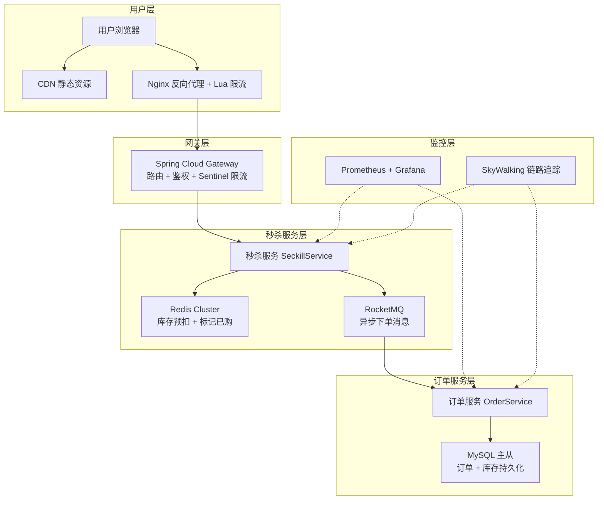
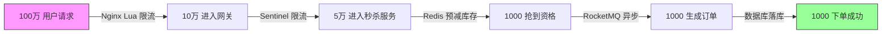
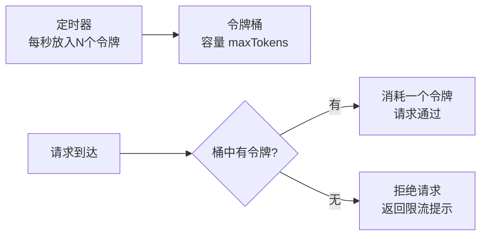
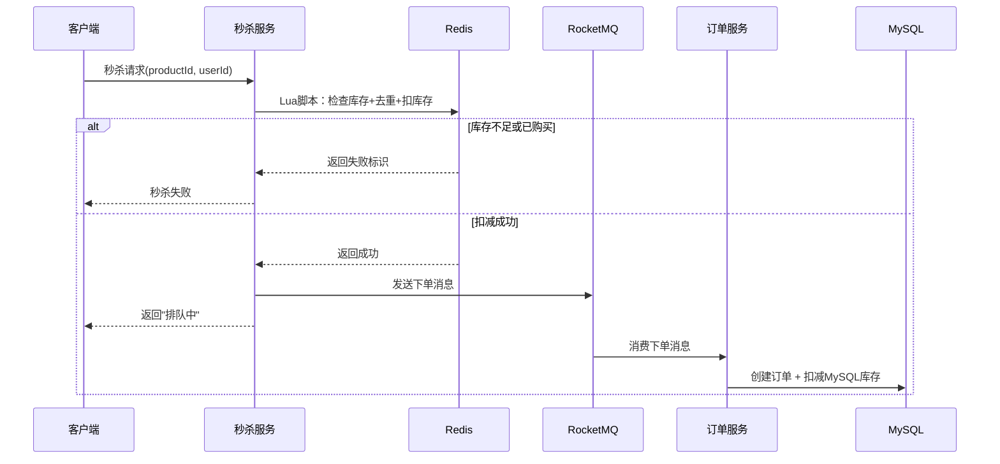
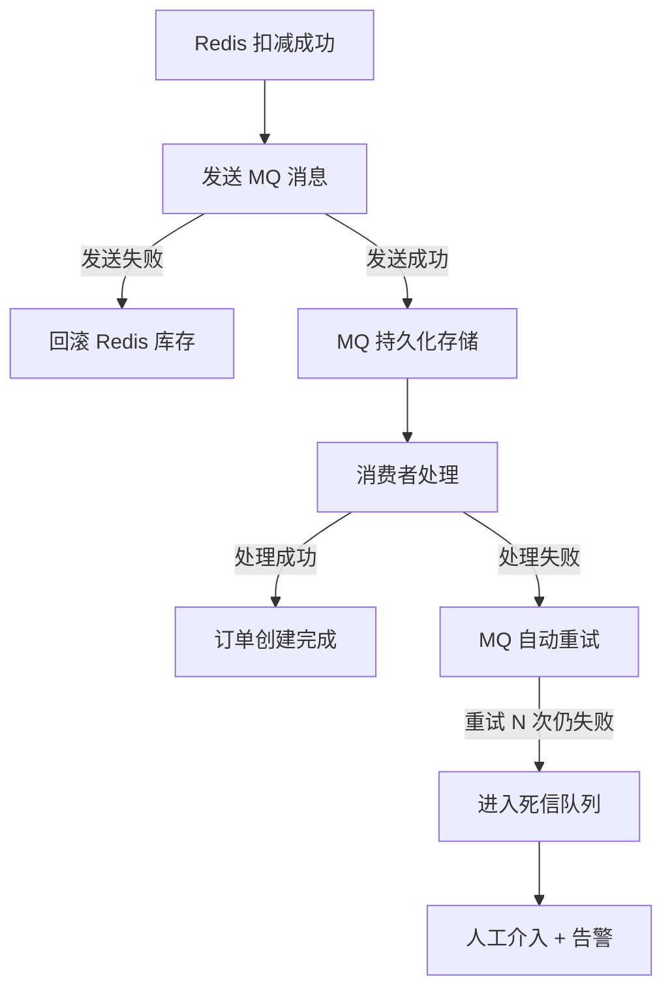
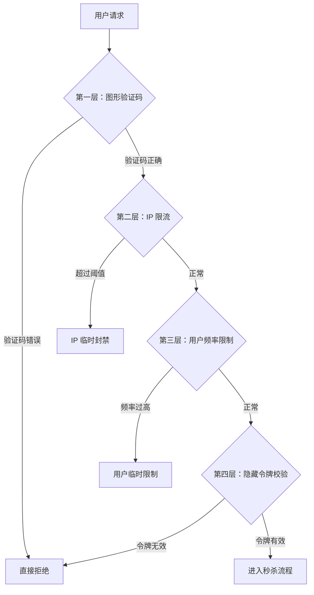

# Spring Boot 秒杀系统实战

## ⭐ 面试重点速览

| 知识模块 | 重点内容 | 面试频率 |
|----------|----------|----------|
| 系统架构 | Nginx → Gateway → 秒杀服务 → Redis → RocketMQ → 订单服务 → MySQL 全链路 | 极高 |
| 前端限流 | Nginx + Lua 令牌桶算法，挡掉 90% 无效请求 | 高 |
| 后端限流 | Sentinel 接口限流 + 热点参数限流（商品 ID 维度） | 极高 |
| Redis 预减库存 | Lua 脚本原子操作，先扣 Redis 再异步落库 | 极高 |
| MQ 异步下单 | RocketMQ 削峰填谷，最终一致性保证 | 极高 |
| 防超卖 | 行锁 vs 乐观锁 vs Redisson 分布式锁，三种方案对比 | 极高 |
| 接口防刷 | 验证码 + 限流 + IP 黑名单 + 用户频率限制，多层防护 | 高 |

---

## 一、⭐ 系统架构设计

### 1.1 秒杀系统核心挑战

秒杀场景的本质矛盾是**瞬时超高并发**与**有限商品库存**之间的冲突。普通电商架构在秒杀场景下会面临以下问题：

- **高并发读**：商品详情页被海量用户同时刷新，数据库扛不住
- **高并发写**：下单请求集中在同一时刻，数据库行锁竞争激烈
- **库存超卖**：并发扣减库存时，没有正确加锁导致超卖
- **流量冲击**：瞬时流量可能是平时的 100~1000 倍

### 1.2 整体架构图



### 1.3 请求漏斗模型



::: tip 漏斗设计思想
每一层都有独立的限流与过滤机制，逐层削减流量。前端的 Nginx 挡掉大部分无效流量，后端只需处理少量有效请求，这是秒杀系统最核心的设计思想。
:::

---

## 二、前端限流：Nginx + Lua 令牌桶

### 2.1 为什么需要前端限流？

后端服务的 QPS 有上限（例如单机 5000 QPS），而秒杀期间的请求可能达到数十万 QPS。如果所有请求都打到后端，服务会直接崩溃。**Nginx 单机可轻松处理 10 万+ 并发连接**，在前端做限流是最经济高效的方式。

### 2.2 令牌桶算法原理

令牌桶算法是经典的流量整形算法：

- 系统以固定速率向"桶"中放入令牌（如每秒 1000 个）
- 每个请求需要消耗一个令牌才能通过
- 桶有容量上限，令牌满了就丢弃（防止突发流量）
- 请求到达时如果没有令牌，则被限流拒绝



### 2.3 Lua 脚本实现

Nginx 通过 `lua-resty-limit-traffic` 模块实现令牌桶限流。以下是完整配置：

```nginx
# nginx.conf —— 秒杀接口限流配置
http {
    # 定义共享内存区域（存储令牌桶状态）
    lua_shared_dict seckill_limit 10m;

    server {
        listen 80;

        # 秒杀接口 —— 使用 Lua 限流
        location /api/seckill/submit {
            # 请求进入时执行 Lua 限流脚本
            access_by_lua_file /etc/nginx/lua/seckill_limiter.lua;

            # 通过限流的请求转发到后端网关
            proxy_pass http://gateway-cluster;
        }
    }
}
```

```lua
-- seckill_limiter.lua —— 令牌桶限流脚本
local limit = require("resty.limit.req")

-- 初始化限流器：rate=1000（每秒1000个令牌），burst=200（允许200个突发）
local limiter, err = limit.new("seckill_limit", 1000, 200)

if not limiter then
    ngx.log(ngx.ERR, "限流器初始化失败: ", err)
    return ngx.exit(500)
end

-- 尝试消耗一个令牌，不延迟等待
local delay, err = limiter:incoming("seckill_key", false)

if not delay then
    if err == "rejected" then
        -- 令牌不足，返回限流提示
        ngx.status = ngx.HTTP_TOO_MANY_REQUESTS
        ngx.header["Content-Type"] = "application/json;charset=utf-8"
        ngx.say('{"code":429,"msg":"当前参与人数过多，请稍后再试"}')
        return ngx.exit(429)
    end
    ngx.log(ngx.ERR, "限流检查异常: ", err)
    return ngx.exit(500)
end

-- delay >= 0 表示请求需要排队等待，delay 为等待时间（秒）
if delay >= 0.1 then
    -- 需要等待超过 100ms 就拒绝
    ngx.status = ngx.HTTP_TOO_MANY_REQUESTS
    ngx.header["Content-Type"] = "application/json;charset=utf-8"
    ngx.say('{"code":429,"msg":"当前参与人数过多，请稍后再试"}')
    return ngx.exit(429)
end

-- 令牌获取成功，请求继续
```

::: tip Lua 限流最佳实践
- **rate 设置**：根据后端实际处理能力的 80% 设置，留出余量
- **burst 设置**：允许小幅度突发，但不能过大，否则后端会被打垮
- **共享内存**：多 Worker 进程共享计数，确保全局准确
- **快速失败**：被限流直接返回 429，不要排队等待（用户不会等）
:::

---

## 三、后端限流：Sentinel 限流

### 3.1 接口级别限流（QPS 限流）

Nginx 层挡住大部分流量后，后端仍需 Sentinel 做精细化的接口限流：

```java
// SentinelConfig.java —— 秒杀接口限流规则配置
@Configuration
public class SentinelConfig implements InitializingBean {

    @Override
    public void afterPropertiesSet() {
        initFlowRules();
    }

    /**
     * 初始化秒杀接口的 QPS 限流规则
     */
    private void initFlowRules() {
        List<FlowRule> rules = new ArrayList<>();

        // 规则1：秒杀下单接口 —— 限流为单机 2000 QPS
        FlowRule submitRule = new FlowRule();
        submitRule.setResource("seckill:submit");   // 资源名，对应 @SentinelResource
        submitRule.setGrade(RuleConstant.FLOW_GRADE_QPS); // QPS 限流模式
        submitRule.setCount(2000);                   // 单机阈值 2000 QPS
        rules.add(submitRule);

        // 规则2：秒杀商品查询接口 —— 限流为单机 5000 QPS
        FlowRule queryRule = new FlowRule();
        queryRule.setResource("seckill:query");
        queryRule.setGrade(RuleConstant.FLOW_GRADE_QPS);
        queryRule.setCount(5000);
        rules.add(queryRule);

        FlowRuleManager.loadRules(rules);
    }
}
```

```java
// SeckillController.java —— 使用 @SentinelResource 标记限流资源
@RestController
@RequestMapping("/api/seckill")
public class SeckillController {

    @Autowired
    private SeckillService seckillService;

    /**
     * 秒杀下单接口
     * blockHandler 指定被限流时的降级处理方法
     */
    @PostMapping("/submit")
    @SentinelResource(
        value = "seckill:submit",           // 与 FlowRule 的 resource 对应
        blockHandler = "handleBlock"         // 被限流时执行的方法
    )
    public Result<String> submit(@RequestParam Long productId,
                                  @RequestParam Long userId) {
        return seckillService.executeSeckill(productId, userId);
    }

    /**
     * 限流/降级时的兜底方法
     * 方法签名必须与原方法一致，并额外加上 BlockException 参数
     */
    public Result<String> handleBlock(Long productId, Long userId,
                                       BlockException ex) {
        return Result.error(429, "当前参与人数过多，请稍后再试");
    }
}
```

### 3.2 ⭐ 热点参数限流（商品 ID 维度）

秒杀场景下，流量会集中在**特定几个热门商品**上。Sentinel 的热点参数限流能精确控制每个商品 ID 的访问频率：

```java
// SentinelConfig.java —— 热点参数限流规则
private void initParamFlowRules() {
    List<ParamFlowRule> rules = new ArrayList<>();

    // 热点参数限流：针对秒杀接口的第一个参数（productId 索引为 0）
    ParamFlowRule rule = new ParamFlowRule();
    rule.setResource("seckill:submit");          // 资源名
    rule.setParamIdx(0);                         // 对第0个参数（productId）限流
    rule.setGrade(RuleConstant.FLOW_GRADE_QPS);  // QPS 模式
    rule.setCount(100);                          // 每个商品 ID 最多 100 QPS

    // 设置例外项：热门商品可以单独放宽限制
    ParamFlowItem hotItem = new ParamFlowItem();
    hotItem.setObject("10001");                  // 热门商品 ID
    hotItem.setClassType(Long.class.getName());
    hotItem.setCount(500);                       // 热门商品放宽到 500 QPS
    rule.setParamFlowItemList(Collections.singletonList(hotItem));

    rules.add(rule);
    ParamFlowRuleManager.loadRules(rules);
}
```

::: danger 热点参数限流 vs 普通限流
- **普通限流**：对整个接口的 QPS 做限制，粒度粗
- **热点参数限流**：对某个参数的具体值（如商品ID=10001）单独限流，粒度细

秒杀中必须两者配合使用。比如接口级别限制 2000 QPS，同时对热门商品 ID 单独限制 500 QPS，防止某个商品的流量把整个接口打垮。
:::

---

## 四、⭐ Redis 预减库存（原子操作）

### 4.1 为什么用 Redis 预减库存？

如果每次都去 MySQL 扣减库存，数据库的行锁会成为瓶颈（单行 TPS 约 1000）。Redis 单线程模型天然串行化，单机可支撑 10 万+ QPS 的读写操作，是库存扣减的最佳前置缓存。

### 4.2 库存预扣流程



### 4.3 ⭐ Lua 脚本原子操作

Redis 执行 Lua 脚本期间，其他命令必须等待，这保证了原子性。核心脚本实现：

```java
// StockRedisService.java —— Redis 库存预扣服务
@Service
public class StockRedisService {

    @Autowired
    private StringRedisTemplate redisTemplate;

    /**
     * 预减库存 Lua 脚本（原子操作）
     * KEYS[1]: 库存 key（如 seckill:stock:10001）
     * KEYS[2]: 已购买用户集合 key（如 seckill:users:10001）
     * ARGV[1]: 用户 ID
     * ARGV[2]: 每人限购数量
     * 
     * 返回值：
     *   -1：库存不足
     *   -2：用户已购买（重复下单）
     *   >=0：扣减后的剩余库存
     */
    private static final String DEDUCT_STOCK_LUA =
        "local stock = redis.call('get', KEYS[1]) " +
        "if not stock or tonumber(stock) <= 0 then " +
        "    return -1 " +              // 库存不足
        "end " +
        "local exists = redis.call('sismember', KEYS[2], ARGV[1]) " +
        "if exists == 1 then " +
        "    return -2 " +              // 用户已购买
        "end " +
        "local remain = redis.call('decr', KEYS[1]) " +
        "redis.call('sadd', KEYS[2], ARGV[1]) " +
        "return remain";               // 返回剩余库存
}
```

```java
    // 编译并缓存 Lua 脚本
    private final RedisScript<Long> deductScript;

    public StockRedisService() {
        this.deductScript = new DefaultRedisScript<>(DEDUCT_STOCK_LUA, Long.class);
    }

    /**
     * 执行库存预扣
     * @param productId 商品 ID
     * @param userId    用户 ID
     * @return 扣减结果
     */
    public DeductResult deductStock(Long productId, Long userId) {
        List<String> keys = Arrays.asList(
            "seckill:stock:" + productId,     // KEYS[1]：库存
            "seckill:users:" + productId       // KEYS[2]：已购用户集合
        );

        Long result = redisTemplate.execute(
            deductScript,
            keys,
            userId.toString()
        );

        if (result == null) {
            return DeductResult.error("系统异常");
        }
        if (result == -1) {
            return DeductResult.error("库存不足");
        }
        if (result == -2) {
            return DeductResult.error("您已参与过该活动");
        }

        return DeductResult.success(result);
    }
}
```

```java
// DeductResult.java —— 扣减结果封装
@Data
@AllArgsConstructor
public class DeductResult {
    private boolean success;
    private String message;
    private Long remainStock;

    public static DeductResult success(Long remain) {
        return new DeductResult(true, "success", remain);
    }

    public static DeductResult error(String msg) {
        return new DeductResult(false, msg, null);
    }
}
```

### 4.4 库存预热

秒杀开始前，需要将库存数据从 MySQL 加载到 Redis：

```java
// StockWarmUpService.java —— 库存预热服务
@Service
@Slf4j
public class StockWarmUpService {

    @Autowired
    private JdbcTemplate jdbcTemplate;
    @Autowired
    private StringRedisTemplate redisTemplate;

    /**
     * 秒杀开始前调用，将库存预热到 Redis
     */
    @PostConstruct  // 服务启动时自动预热
    public void warmUpStocks() {
        // 从 MySQL 查询所有有效的秒杀商品及其库存
        List<SeckillStock> stocks = jdbcTemplate.query(
            "SELECT product_id, total_stock FROM seckill_product " +
            "WHERE start_time <= NOW() AND end_time >= NOW()",
            (rs, rowNum) -> new SeckillStock(
                rs.getLong("product_id"),
                rs.getInt("total_stock")
            )
        );

        for (SeckillStock stock : stocks) {
            String stockKey = "seckill:stock:" + stock.getProductId();
            String usersKey = "seckill:users:" + stock.getProductId();

            // 使用 SETNX 避免重复预热覆盖已有数据
            Boolean setSuccess = redisTemplate.opsForValue()
                .setIfAbsent(stockKey, String.valueOf(stock.getTotalStock()));

            if (Boolean.TRUE.equals(setSuccess)) {
                // 设置过期时间（比秒杀结束时间稍长，防止数据残留）
                redisTemplate.expire(stockKey, 2, TimeUnit.HOURS);
                redisTemplate.expire(usersKey, 2, TimeUnit.HOURS);
                log.info("库存预热成功：productId={}, stock={}", 
                    stock.getProductId(), stock.getTotalStock());
            }
        }
    }

    @Data
    @AllArgsConstructor
    private static class SeckillStock {
        private Long productId;
        private Integer totalStock;
    }
}
```

::: warning Redis 库存与 MySQL 库存的对账
秒杀结束后，需要将 Redis 中的剩余库存回写到 MySQL，并进行对账。如果出现不一致，以 MySQL 为准，通过人工介入处理。日常监控中需关注 Redis 与 MySQL 的库存差值。
:::

---

## 五、消息队列异步下单（削峰填谷）

### 5.1 为什么需要异步下单？

Redis 预减库存只需要毫秒级，而真正的下单操作（创建订单、扣减 MySQL 库存、生成支付单）可能需要数百毫秒。如果同步处理，后端服务很快会被阻塞耗尽线程池。

**异步下单的核心思想**：Redis 扣减成功后立即返回"排队中"，实际下单逻辑交给 RocketMQ 异步消费，实现削峰填谷。

### 5.2 生产者 —— 发送下单消息

```java
// SeckillService.java —— 秒杀核心服务
@Service
@Slf4j
public class SeckillService {

    @Autowired
    private StockRedisService stockRedisService;
    @Autowired
    private RocketMQTemplate rocketMQTemplate;

    /**
     * 执行秒杀（核心流程）
     */
    public Result<String> executeSeckill(Long productId, Long userId) {
        // 1. Redis 预减库存（原子操作）
        DeductResult deductResult = stockRedisService.deductStock(productId, userId);
        if (!deductResult.isSuccess()) {
            return Result.error(deductResult.getMessage());
        }

        // 2. 构造下单消息
        SeckillOrderMessage message = new SeckillOrderMessage();
        message.setProductId(productId);
        message.setUserId(userId);
        message.setCreateTime(LocalDateTime.now());
        message.setMessageId(UUID.randomUUID().toString());

        // 3. 发送异步下单消息到 RocketMQ
        //    使用事务消息或异步发送，确保消息不丢失
        rocketMQTemplate.asyncSend("seckill-order-topic", message, 
            new SendCallback() {
                @Override
                public void onSuccess(SendResult sendResult) {
                    log.info("下单消息发送成功：msgId={}", message.getMessageId());
                }

                @Override
                public void onException(Throwable e) {
                    // ⚠️ 发送失败需要回滚 Redis 库存！
                    log.error("下单消息发送失败，回滚库存：productId={}, userId={}", 
                        productId, userId);
                    rollbackRedisStock(productId, userId);
                }
            }
        );

        // 4. 立即返回"排队中"，不阻塞用户
        return Result.success("排队中，请稍后查看订单");
    }

    /**
     * 回滚 Redis 库存（消息发送失败时调用）
     */
    private void rollbackRedisStock(Long productId, Long userId) {
        String stockKey = "seckill:stock:" + productId;
        String usersKey = "seckill:users:" + productId;
        // Lua 脚本回滚：incr 恢复库存，srem 移除用户标记
        // 此处简化处理，实际需要 Lua 原子操作
        redisTemplate.opsForValue().increment(stockKey);
        redisTemplate.opsForSet().remove(usersKey, userId.toString());
    }
}
```

### 5.3 消费者 —— 处理下单消息

```java
// SeckillOrderConsumer.java —— RocketMQ 消费者
@Component
@RocketMQMessageListener(
    topic = "seckill-order-topic",        // 消费的主题
    consumerGroup = "seckill-order-group", // 消费者组
    consumeMode = ConsumeMode.ORDERLY      // 顺序消费（同一商品的消息按序处理）
)
@Slf4j
public class SeckillOrderConsumer 
        implements RocketMQListener<SeckillOrderMessage> {

    @Autowired
    private OrderService orderService;

    @Override
    public void onMessage(SeckillOrderMessage message) {
        try {
            log.info("开始处理下单消息：productId={}, userId={}", 
                message.getProductId(), message.getUserId());

            // 调用订单服务创建订单（包含 MySQL 库存扣减）
            orderService.createSeckillOrder(message);

            log.info("下单处理成功：msgId={}", message.getMessageId());

        } catch (Exception e) {
            log.error("下单处理失败：msgId={}", message.getMessageId(), e);
            // ⚠️ 消费失败，MQ 会自动重试
            // 重试次数达到上限后进入死信队列，人工介入处理
            throw new RuntimeException("下单处理失败，触发 MQ 重试", e);
        }
    }
}
```

### 5.4 保证最终一致性



```java
// 消费失败重试配置
@Configuration
public class RocketMQRetryConfig {

    /**
     * 配置消费者重试策略
     */
    @Bean
    public RocketMQPushConsumerLifecycleListener retryListener() {
        return consumer -> {
            // 最大重试次数：3 次
            consumer.setMaxReconsumeTimes(3);
            // 重试间隔：10s, 30s, 60s（逐渐递增）
            // 3 次后仍然失败，进入死信队列 %DLQ%seckill-order-group
        };
    }
}
```

::: danger 消息可靠性保障的三个关键点
1. **发送端**：发送失败必须回滚 Redis 库存，否则用户扣了库存但没下单
2. **Broker 端**：RocketMQ 使用同步刷盘 + 主从复制保证消息不丢
3. **消费端**：消费失败触发重试，重试上限后进入死信队列，人工兜底
:::

---

## 六、⭐ 防止超卖（三种方案对比）

### 6.1 方案一：数据库行锁（悲观锁）

利用 `SELECT ... FOR UPDATE` 加行锁，事务提交后释放：

```java
// 悲观锁 —— 行锁方案
@Transactional(rollbackFor = Exception.class)
public void deductStockByPessimisticLock(Long productId, Integer quantity) {
    // FOR UPDATE 会对查询到的行加排他锁，其他事务必须等待
    SeckillProduct product = jdbcTemplate.queryForObject(
        "SELECT id, stock FROM seckill_product WHERE id = ? FOR UPDATE",
        new Object[]{productId},
        (rs, rowNum) -> new SeckillProduct(
            rs.getLong("id"), rs.getInt("stock"))
    );

    if (product.getStock() < quantity) {
        throw new BusinessException("库存不足");
    }

    // 扣减库存
    jdbcTemplate.update(
        "UPDATE seckill_product SET stock = stock - ? WHERE id = ?",
        quantity, productId);
}
```

| 优点 | 缺点 |
|------|------|
| 实现简单，绝对安全 | 性能差，高并发下行锁竞争激烈 |
| 强一致性 | 单行 TPS 约 1000，无法满足秒杀需求 |

### 6.2 方案二：乐观锁（版本号）

在表中增加 `version` 字段，更新时检查版本号：

```java
// 乐观锁 —— 版本号方案
@Transactional(rollbackFor = Exception.class)
public boolean deductStockByOptimisticLock(Long productId, Integer quantity) {
    // 先查询当前库存和版本号
    SeckillProduct product = jdbcTemplate.queryForObject(
        "SELECT id, stock, version FROM seckill_product WHERE id = ?",
        new Object[]{productId},
        (rs, rowNum) -> new SeckillProduct(
            rs.getLong("id"), rs.getInt("stock"), rs.getInt("version"))
    );

    if (product.getStock() < quantity) {
        throw new BusinessException("库存不足");
    }

    // 带版本号更新 —— CAS（Compare And Swap）操作
    int affected = jdbcTemplate.update(
        "UPDATE seckill_product SET stock = stock - ?, version = version + 1 " +
        "WHERE id = ? AND version = ? AND stock >= ?",
        quantity, productId, product.getVersion(), quantity);

    // affected == 0 表示版本号已变化，更新失败
    if (affected == 0) {
        return false; // 并发冲突，需要重试
    }
    return true;
}
```

```java
// 乐观锁 + 自旋重试（适合低冲突场景）
public void deductWithRetry(Long productId, Integer quantity) {
    int maxRetries = 3;       // 最多重试 3 次
    long sleepMs = 50;        // 重试间隔 50ms

    for (int i = 0; i < maxRetries; i++) {
        boolean success = deductStockByOptimisticLock(productId, quantity);
        if (success) {
            return;           // 成功，退出
        }
        // 失败，短暂休眠后重试
        try {
            Thread.sleep(sleepMs * (i + 1));  // 递增等待：50ms, 100ms, 150ms
        } catch (InterruptedException e) {
            Thread.currentThread().interrupt();
        }
    }
    throw new BusinessException("系统繁忙，请重试");
}
```

::: warning 乐观锁的 ABA 问题
高并发下，乐观锁的 `affected == 0` 比例可能很高，导致大量无效重试。秒杀场景的冲突率极高，**单独使用乐观锁不是最佳方案**。
:::

### 6.3 ⭐ 方案三：Redis 分布式锁（Redisson）

使用 Redisson 的看门狗机制实现自动续期：

```java
// 分布式锁 —— Redisson 方案（推荐）
@Service
public class StockLockService {

    @Autowired
    private RedissonClient redissonClient;

    /**
     * 使用 Redisson 分布式锁扣减 MySQL 库存
     */
    public void deductStockWithLock(Long productId, Integer quantity) {
        String lockKey = "seckill:lock:stock:" + productId;
        RLock lock = redissonClient.getLock(lockKey);

        try {
            // 尝试加锁：等待 3 秒，锁有效期 10 秒（看门狗会自动续期）
            boolean locked = lock.tryLock(3, 10, TimeUnit.SECONDS);
            if (!locked) {
                throw new BusinessException("系统繁忙，请稍后重试");
            }

            // 临界区：查询 + 校验 + 扣减
            SeckillProduct product = jdbcTemplate.queryForObject(
                "SELECT id, stock FROM seckill_product WHERE id = ?",
                new Object[]{productId},
                (rs, rowNum) -> new SeckillProduct(
                    rs.getLong("id"), rs.getInt("stock"))
            );

            if (product.getStock() < quantity) {
                throw new BusinessException("库存不足");
            }

            jdbcTemplate.update(
                "UPDATE seckill_product SET stock = stock - ? WHERE id = ?",
                quantity, productId);

        } catch (InterruptedException e) {
            Thread.currentThread().interrupt();
            throw new BusinessException("系统异常");
        } finally {
            // ⚠️ 必须释放锁，且只能释放自己加的锁
            if (lock.isHeldByCurrentThread()) {
                lock.unlock();
            }
        }
    }
}
```

### 6.4 三种防超卖方案对比

| 方案 | 原理 | 性能 | 复杂度 | 适用场景 |
|------|------|------|--------|----------|
| **行锁（悲观锁）** | `SELECT FOR UPDATE` | 低（~1000 TPS） | 低 | 低并发、强一致性要求 |
| **乐观锁（版本号）** | `WHERE version = ?` CAS | 中（冲突高时下降） | 中 | 并发冲突率低的场景 |
| **Redisson 分布式锁** | Redis + Lua + 看门狗 | 高（~10000 TPS） | 中高 | **秒杀等高并发场景** |

::: tip 秒杀防超卖最佳组合方案
**Redis 预减库存（第一层防护） + Redisson 分布式锁（第二层防护） + 数据库行锁（第三层兜底）**

三层防护层层递进：
1. Redis Lua 在内存中原子扣减，挡掉 99% 的无效请求
2. Redisson 分布式锁控制进入 MySQL 的并发量
3. MySQL 行锁作为最后保障，确保绝对不超卖
:::

---

## 七、接口防刷（多层防护体系）

### 7.1 防护体系总览



### 7.2 第一层：图形验证码

```java
// CaptchaController.java —— 验证码接口
@RestController
@RequestMapping("/api/seckill")
public class CaptchaController {

    @Autowired
    private StringRedisTemplate redisTemplate;

    /**
     * 获取秒杀验证码（秒杀开始前才开放）
     */
    @GetMapping("/captcha")
    public Result<Map<String, String>> getCaptcha(@RequestParam Long productId) {
        // 生成数学验证码：如 "3 + 5 = ?"
        int a = ThreadLocalRandom.current().nextInt(1, 20);
        int b = ThreadLocalRandom.current().nextInt(1, 20);
        int answer = a + b;
        String question = a + " + " + b + " = ?";

        // 生成 captchaId 并缓存答案（60秒有效）
        String captchaId = UUID.randomUUID().toString();
        redisTemplate.opsForValue().set(
            "seckill:captcha:" + captchaId,
            String.valueOf(answer),
            60, TimeUnit.SECONDS
        );

        Map<String, String> result = new HashMap<>();
        result.put("captchaId", captchaId);
        result.put("question", question);
        return Result.success(result);
    }
}
```

```java
// 秒杀接口中校验验证码
@PostMapping("/submit")
public Result<String> submit(
        @RequestParam Long productId,
        @RequestParam Long userId,
        @RequestParam String captchaId,
        @RequestParam Integer captchaAnswer) {

    // 校验验证码
    String cached = redisTemplate.opsForValue()
        .get("seckill:captcha:" + captchaId);
    if (cached == null) {
        return Result.error("验证码已过期");
    }
    if (!cached.equals(String.valueOf(captchaAnswer))) {
        return Result.error("验证码错误");
    }
    // 验证通过，删除验证码（一次性使用）
    redisTemplate.delete("seckill:captcha:" + captchaId);

    return seckillService.executeSeckill(productId, userId);
}
```

### 7.3 第二、三层：IP 限流 + 用户频率限制

```java
// AntiBrushService.java —— 防刷服务
@Service
@Slf4j
public class AntiBrushService {

    @Autowired
    private StringRedisTemplate redisTemplate;

    /**
     * IP 级别限流：同一 IP 每秒最多 5 次请求
     */
    public boolean checkIpRateLimit(String ip) {
        String key = "seckill:ip:rate:" + ip;
        Long count = redisTemplate.opsForValue().increment(key);

        // 第一次访问时设置过期时间
        if (count != null && count == 1) {
            redisTemplate.expire(key, 1, TimeUnit.SECONDS);
        }

        if (count != null && count > 5) {
            // 超限，加入 IP 黑名单（封禁 10 分钟）
            blacklistIp(ip);
            return false;
        }
        return true;
    }

    /**
     * 用户级别频率限制：同一用户每分钟最多 3 次秒杀请求
     */
    public boolean checkUserRateLimit(Long userId) {
        String key = "seckill:user:rate:" + userId;
        Long count = redisTemplate.opsForValue().increment(key);

        if (count != null && count == 1) {
            redisTemplate.expire(key, 1, TimeUnit.MINUTES);
        }

        return count != null && count <= 3;
    }

    /**
     * IP 黑名单
     */
    private void blacklistIp(String ip) {
        String key = "seckill:ip:blacklist:" + ip;
        redisTemplate.opsForValue().set(key, "1", 10, TimeUnit.MINUTES);
        log.warn("IP 已被加入黑名单：{}", ip);
    }

    /**
     * 检查 IP 是否在黑名单中
     */
    public boolean isIpBlacklisted(String ip) {
        return Boolean.TRUE.equals(
            redisTemplate.hasKey("seckill:ip:blacklist:" + ip));
    }
}
```

### 7.4 第四层：隐藏令牌（Hidden Token）

```java
// TokenService.java —— 秒杀接口隐藏令牌
@Service
public class TokenService {

    @Autowired
    private StringRedisTemplate redisTemplate;

    /**
     * 获取秒杀令牌（需先通过验证码验证）
     */
    public String generateToken(Long productId, Long userId) {
        String token = UUID.randomUUID().toString().replace("-", "");
        String key = "seckill:token:" + productId + ":" + userId;
        // 令牌 5 分钟内有效，一次性使用
        redisTemplate.opsForValue().set(key, token, 5, TimeUnit.MINUTES);
        return token;
    }

    /**
     * 校验令牌
     */
    public boolean validateToken(Long productId, Long userId, String token) {
        String key = "seckill:token:" + productId + ":" + userId;
        String cached = redisTemplate.opsForValue().get(key);
        if (cached == null || !cached.equals(token)) {
            return false;
        }
        // 验证通过后删除令牌（防止重复使用）
        redisTemplate.delete(key);
        return true;
    }
}
```

::: danger 防刷策略要点
1. **层层递进，逐级拦截**：验证码 → IP限流 → 用户限流 → 令牌校验，后层只处理通过前层的请求
2. **验证码要动态生成**：不同时间、不同用户看到的验证码不同，防止脚本暴力破解
3. **黑名单要设有效期**：临时封禁而非永久，避免误伤正常用户
4. **令牌一次性使用**：防止同一个令牌被重复利用
:::

---

## ⭐ 面试高频问题汇总

### Q1：秒杀系统为什么需要前端限流？只用后端限流行不行？

**不行**。Nginx 单机可轻松支撑 10 万+ 并发，而 Java 后端单机通常只能支撑几千 QPS。前端限流的目的是**在流量入口处就挡掉 90% 以上的无效请求，保护后端服务不被冲垮**。这是一种 **"漏斗"设计思想**，每一层都有独立的过滤能力。

| 层级 | 技术 | 并发能力 | 挡掉的流量 |
|------|------|----------|------------|
| Nginx + Lua | 令牌桶 | 10万+ | ~90% |
| Sentinel | QPS限流 | 几千 | ~5% |
| Redis 库存 | Lua 原子 | 10万+ QPS读写 | ~4% |
| MQ + MySQL | 异步+行锁 | 几百 TPS | ~1%（有效订单） |

### Q2：Redis 预减库存后，Mysql 库存如何保证一致性？

核心策略是 **"Redis 是大脑，MySQL 是账本"**：

1. **秒杀前**：库存预热，将 MySQL 库存同步到 Redis
2. **秒杀中**：Redis 扣减（快速决策），MQ 异步写入 MySQL（持久化）
3. **秒杀后**：对账 Redis 与 MySQL 库存差异，以 MySQL 为准修正

对于发送 MQ 消息失败的情况，必须**回滚 Redis 库存**。如果消费者处理失败，MQ 会自动重试；最终进入死信队列的消息由人工处理。

### Q3：为什么使用 Lua 脚本而不是 Redis 事务（MULTI/EXEC）？

| 对比项 | Lua 脚本 | Redis 事务 |
|--------|----------|------------|
| 原子性 | 整个脚本执行期间独占 Redis | 命令入队期间不阻塞，EXEC 时执行 |
| 条件判断 | 支持 if/else 等复杂逻辑 | 不支持（无法在事务中根据中间结果做判断） |
| 返回值 | 可以返回任意计算结果 | 只能返回每个命令的执行结果列表 |
| 性能 | 一次网络往返 | 多次网络往返（WATCH + MULTI + EXEC） |

Lua 脚本的关键优势是可以在一次 Redis 调用中完成**检查库存 → 检查重复 → 扣减库存 → 标记用户**的完整逻辑，且支持条件判断。

### Q4：RocketMQ 消息丢失怎么办？如何保证消息不丢？

消息丢失的三个环节及对策：

| 环节 | 丢失场景 | 解决方案 |
|------|----------|----------|
| **生产者发送** | 网络故障导致发送失败 | 异步发送 + 失败回调中**回滚 Redis 库存** |
| **Broker 存储** | Broker 宕机 | 同步刷盘（flushDiskType=SYNC_FLUSH）+ 主从同步 |
| **消费者处理** | 消费失败未确认 | 消费异常抛出 RuntimeException 触发 MQ 重试 |

终极兜底：重试次数达到上限后进入死信队列，通过**定时任务扫描死信队列 + 人工处理**。

### Q5：乐观锁为什么在秒杀场景下效果不好？

乐观锁的核心是 CAS（Compare-And-Swap），依赖"冲突很少"的假设。但秒杀场景下，**数万人同时对同一个商品下单，冲突率极高**。大部分 `UPDATE` 操作因为 `version` 不匹配而失败（affected=0），导致大量无效的 SQL 执行和重试，反而加剧了数据库压力。

**结论**：秒杀场景优先使用 **Redis 分布锁（Redisson）** 或 **分组扣减**（将库存拆分到多个桶）来降低单行竞争。

### Q6：Redisson 的看门狗（Watchdog）机制是什么？为什么要用？

Redisson 的看门狗是一个**自动续期机制**：

```java
// 加锁时如果不指定 leaseTime，默认开启看门狗
lock.lock();  // 看门狗每隔 10 秒自动续期 30 秒

// 如果指定了 leaseTime，看门狗不生效
lock.lock(10, TimeUnit.SECONDS);  // 10 秒后自动释放，不续期
```

**为什么需要看门狗？** 如果业务执行时间超过了锁的过期时间，锁会被自动释放，此时其他线程可能获取到锁，导致并发问题。看门狗在业务执行期间自动续期，**只要业务不崩溃，锁就不会过期**。

### Q7：如果秒杀流量比预期大 10 倍，哪些环节可能先崩溃？如何应对？

崩溃顺序和应对方案：

| 崩溃环节 | 现象 | 应急预案 |
|----------|------|----------|
| **Redis** | 连接池耗尽、OOM | Redis Cluster 水平扩容 + 限流降级 |
| **RocketMQ** | 消息积压严重 | 动态增加消费者实例 + 限流 |
| **MySQL** | 连接池耗尽、死锁 | 读写分离 + 分库分表 + 降级（关闭非核心查询） |
| **Nginx** | 连接数打满 | 增加 Nginx 节点 + DNS 轮询 |

**核心原则：逐层限流 + 快速失败 + 优雅降级**。宁可让用户看到"排队中"，也不能让系统崩溃导致所有用户都无法访问。

### Q8：秒杀系统如何保证不超卖？请描述完整的三层防护体系。

三层防护逐级递进：

```
第一层：Redis Lua 原子预减库存（挡掉 99% 无效请求）
   ↓
第二层：Redisson 分布式锁控制 MySQL 写入并发
   ↓  
第三层：MySQL 行锁（FOR UPDATE）作为最后兜底
```

1. **Redis 层**：Lua 脚本在一个原子操作中完成 `GET` 库存 → `DECR` 扣减 → `SADD` 标记用户，保证不会多扣
2. **Redisson 层**：对同一商品 ID 加分布式锁，同一时刻只有一个消费者线程操作 MySQL，避免并发写入冲突
3. **MySQL 层**：`UPDATE stock = stock - 1 WHERE stock > 0`，在 SQL 层面做最终校验

三层防护任意一层失败都不会导致超卖，且性能逐层递减但安全性逐层递增。

---

## 面试追问环节

**Q：如果需要支撑百万级并发秒杀，架构应该如何演进？**

核心演进方向：

1. **Nginx 层**：多机房部署 + CDN 分流 + 边缘计算限流
2. **Redis 层**：Redis Cluster 分片，按商品 ID 哈希到不同节点，单商品库存拆分到多个 Key（库存桶），降低热点竞争
3. **MQ 层**：RocketMQ 集群 + 消息优先级（VIP 用户优先）
4. **数据库层**：彻底去 MySQL，使用 TiDB 等分布式数据库，或使用分库分表中间件（ShardingSphere）
5. **架构层面**：秒杀服务独立部署，与常规业务物理隔离，防止相互影响

**Q：Redis 挂了怎么办？如何做高可用？**

- **主从 + Sentinel**：一主多从，主节点故障时自动切换
- **Redis Cluster**：多主多从，数据分片 + 自动故障转移
- **降级方案**：Redis 不可用时，直接走数据库扣减（性能大幅下降但保证可用）

**Q：如果用户在 Redis 扣减成功后、MQ 消费前又发了一次请求怎么办？**

Redis Lua 脚本中通过 `SISMEMBER` 检查 `seckill:users:{productId}` 集合，已购买用户直接返回 -2，**从源头杜绝重复下单**。