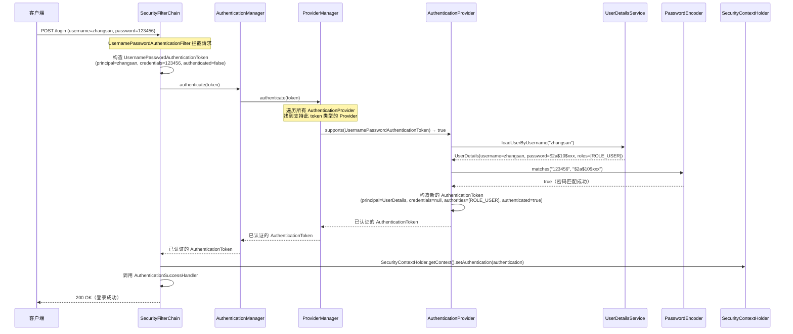
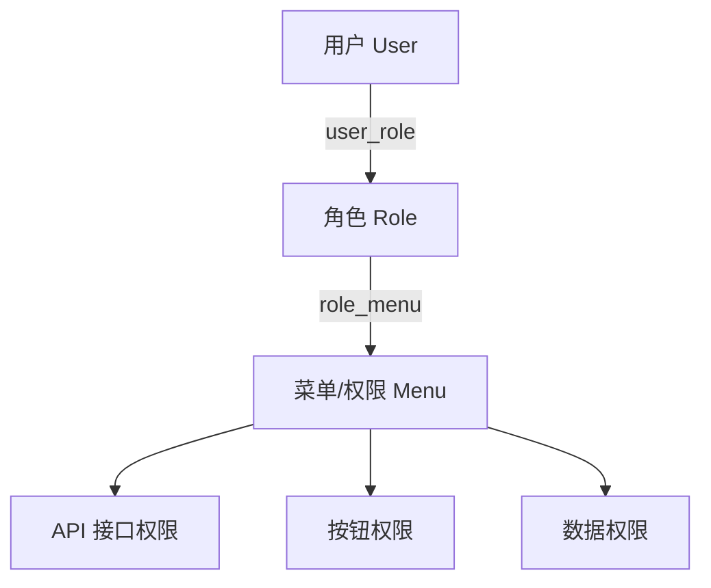

# 认证与授权

## ⭐ 面试重点速览

| 知识模块 | 重点内容 | 面试频率 |
|----------|----------|----------|
| 认证流程 | AuthenticationManager → ProviderManager → AuthenticationProvider → UserDetailsService 链 | 极高 |
| UserDetailsService | loadUserByUsername 实现、UserDetails 接口 | 极高 |
| 密码编码器 | DelegatingPasswordEncoder、{bcrypt} 前缀机制、BCryptPasswordEncoder | 高 |
| RBAC 权限模型 | 五张核心表设计、权限表达式 | 极高 |
| 方法级权限控制 | @EnableMethodSecurity、@PreAuthorize、@PostAuthorize | 极高 |
| SpEL 权限表达式 | hasRole、hasAuthority、hasPermission、自定义权限表达式 | 高 |
| SecurityContext 获取 | SecurityContextHolder 三种获取方式 | 中高 |

---

## 一、⭐ 认证流程详解

### 1.1 完整认证流程（Mermaid 图）



### 1.2 认证流程核心组件职责

| 组件 | 职责 | 类比 |
|------|------|------|
| **AuthenticationManager** | 认证管理的顶层接口，定义 `authenticate()` 方法 | 公司 CEO（只负责拍板） |
| **ProviderManager** | AuthenticationManager 的默认实现，管理多个 AuthenticationProvider | 部门经理（协调多个认证方式） |
| **AuthenticationProvider** | 具体执行认证逻辑（如 DaoAuthenticationProvider 处理用户名密码认证） | 具体执行者（真正干活的人） |
| **UserDetailsService** | 根据用户名加载用户信息 | 人事档案（查询用户信息） |
| **PasswordEncoder** | 密码编码/匹配 | 密码校验器 |

```java
// ProviderManager 的核心逻辑（简化版）
public class ProviderManager implements AuthenticationManager {

    private List<AuthenticationProvider> providers;

    @Override
    public Authentication authenticate(Authentication authentication) {
        // 遍历所有 AuthenticationProvider
        for (AuthenticationProvider provider : providers) {
            // 检查当前 Provider 是否支持此认证类型
            if (!provider.supports(authentication.getClass())) {
                continue;
            }
            // 委托给 Provider 执行认证
            Authentication result = provider.authenticate(authentication);
            if (result != null) {
                // 认证成功后，清除凭证中的密码（安全措施）
                // copyDetails 复制 details 信息
                return result;
            }
        }
        // 所有 Provider 都不支持，抛出异常
        throw new ProviderNotFoundException("No provider supports " + authentication);
    }
}
```

::: tip 为什么需要 ProviderManager 管理多个 Provider？
一个系统可能同时支持多种认证方式：
- 用户名密码登录（DaoAuthenticationProvider）
- 手机验证码登录（自定义 AuthenticationProvider）
- 微信扫码登录（自定义 AuthenticationProvider）
- LDAP 认证（LdapAuthenticationProvider）

ProviderManager 遍历所有 Provider，找到第一个支持当前认证类型并认证成功的即可。
:::

---

## 二、UserDetailsService 与 UserDetails 接口

### 2.1 UserDetails 接口

`UserDetails` 是 Spring Security 中表示"用户详情"的核心接口，定义了用户的基本信息和权限：

```java
public interface UserDetails extends Serializable {

    // 权限集合（核心方法）
    Collection<? extends GrantedAuthority> getAuthorities();

    // 密码（加密后的）
    String getPassword();

    // 用户名（唯一标识）
    String getUsername();

    // ====== 账户状态标志（四种锁定机制） ======
    boolean isAccountNonExpired();     // 账户是否未过期
    boolean isAccountNonLocked();      // 账户是否未锁定
    boolean isCredentialsNonExpired(); // 凭证（密码）是否未过期
    boolean isEnabled();               // 账户是否启用
}
```

### 2.2 自定义 UserDetailsService 实现

```java
@Service
@RequiredArgsConstructor
public class UserDetailsServiceImpl implements UserDetailsService {

    private final UserMapper userMapper;
    private final RoleMapper roleMapper;
    private final MenuMapper menuMapper;

    /**
     * 根据用户名加载用户信息
     * 这是 Spring Security 认证流程中最核心的回调方法
     */
    @Override
    public UserDetails loadUserByUsername(String username) throws UsernameNotFoundException {
        // 1. 查询用户基本信息
        User user = userMapper.selectByUsername(username);
        if (user == null) {
            throw new UsernameNotFoundException("用户不存在：" + username);
        }

        // 2. 查询用户角色列表
        List<Role> roles = roleMapper.selectByUserId(user.getId());

        // 3. 查询用户权限列表（菜单/按钮级别）
        List<Menu> menus = menuMapper.selectByUserId(user.getId());

        // 4. 构建 GrantedAuthority 集合
        //    角色以 ROLE_ 前缀，权限直接用权限标识符
        List<GrantedAuthority> authorities = new ArrayList<>();

        // 添加角色
        roles.forEach(role -> {
            authorities.add(new SimpleGrantedAuthority("ROLE_" + role.getRoleCode()));
        });

        // 添加权限（如 system:user:add、system:user:delete）
        menus.forEach(menu -> {
            if (menu.getPerms() != null && !menu.getPerms().isEmpty()) {
                authorities.add(new SimpleGrantedAuthority(menu.getPerms()));
            }
        });

        // 5. 返回 Spring Security 的 UserDetails 实现
        return new org.springframework.security.core.userdetails.User(
                user.getUsername(),
                user.getPassword(),
                user.getStatus() == 1,               // enabled
                true,                                 // accountNonExpired
                true,                                 // credentialsNonExpired
                true,                                 // accountNonLocked
                authorities
        );
    }
}
```

### 2.3 自定义 UserDetails（推荐扩展方式）

当需要携带更多用户信息时（如用户ID、部门ID等），建议自定义实现：

```java
/**
 * 自定义 UserDetails，扩展 Spring Security 默认实现
 * 携带用户ID、昵称等业务信息，方便后续使用
 */
@Data
public class SecurityUser implements UserDetails {

    private Long userId;           // 用户ID
    private String username;       // 用户名
    private String password;       // 密码（加密后）
    private String nickname;       // 昵称
    private String avatar;         // 头像URL
    private Integer status;        // 状态（1:正常 0:禁用）
    private List<GrantedAuthority> authorities; // 权限列表

    @Override
    public Collection<? extends GrantedAuthority> getAuthorities() {
        return authorities;
    }

    @Override
    public String getPassword() {
        return password;
    }

    @Override
    public String getUsername() {
        return username;
    }

    @Override
    public boolean isAccountNonExpired() {
        return true;
    }

    @Override
    public boolean isAccountNonLocked() {
        return true;
    }

    @Override
    public boolean isCredentialsNonExpired() {
        return true;
    }

    @Override
    public boolean isEnabled() {
        return status != null && status == 1;
    }
}
```

```java
// 在 Controller 中获取扩展信息
@GetMapping("/current")
public Result<Map<String, Object>> getCurrentUser() {
    Authentication auth = SecurityContextHolder.getContext().getAuthentication();
    if (auth.getPrincipal() instanceof SecurityUser) {
        SecurityUser user = (SecurityUser) auth.getPrincipal();
        return Result.ok(Map.of(
            "userId", user.getUserId(),
            "username", user.getUsername(),
            "nickname", user.getNickname(),
            "avatar", user.getAvatar()
        ));
    }
    return Result.fail("未登录");
}
```

---

## 三、DelegatingPasswordEncoder 密码编码器代理

### 3.1 为什么需要密码编码器代理？

在真实项目中，密码存储可能存在多种编码格式（历史遗留问题），`DelegatingPasswordEncoder` 通过**前缀机制**自动识别密码格式并选择对应的编码器：

```java
// 密码存储格式：{编码器ID}加密后的密码
// {bcrypt}$2a$10$N9qo8uLOickgx2ZMRZoMyeIjZAgcfl7p92ldGxad68LJZdL17lhWy
// {noop}123456
// {pbkdf2}5d923b44a6ce1295f0d3e1e4a2b06c6f1a7b8c9d0e1f2a3b4c5d6e7f8a9b0c1d
// {sha256}8d969eef6ecad3c29a3a629280e686cf0c3f5d5a86aff3ca12020c923adc6c92

// Spring Security 根据前缀 {bcrypt} 自动选择 BCryptPasswordEncoder
// 如果没有前缀，默认使用配置的默认编码器
```

### 3.2 创建 DelegatingPasswordEncoder

```java
@Configuration
public class PasswordEncoderConfig {

    /**
     * 使用 PasswordEncoderFactories 创建默认的 DelegatingPasswordEncoder
     * 默认编码器为 BCryptPasswordEncoder
     * 支持的前缀：{bcrypt}、{noop}、{pbkdf2}、{scrypt}、{sha256}
     */
    @Bean
    public PasswordEncoder passwordEncoder() {
        return PasswordEncoderFactories.createDelegatingPasswordEncoder();
    }

    /**
     * 自定义 DelegatingPasswordEncoder（更灵活）
     */
    @Bean
    public PasswordEncoder customPasswordEncoder() {
        // 编码器ID → 编码器实例的映射
        Map<String, PasswordEncoder> encoders = new HashMap<>();
        encoders.put("bcrypt", new BCryptPasswordEncoder());
        encoders.put("noop", NoOpPasswordEncoder.getInstance());
        encoders.put("pbkdf2", Pbkdf2PasswordEncoder.defaultsForSpringSecurity_v5_8());
        encoders.put("scrypt", new SCryptPasswordEncoder(
                16384, 8, 1, 32, 64));

        // 默认编码器（用于新密码编码）
        String defaultEncoderId = "bcrypt";

        DelegatingPasswordEncoder encoder = new DelegatingPasswordEncoder(
                defaultEncoderId, encoders);
        // 如果密码没有前缀，使用 {bcrypt} 编码
        encoder.setDefaultPasswordEncoderForMatches(
                new BCryptPasswordEncoder());

        return encoder;
    }
}
```

### 3.3 密码编码器对比

| 编码器 | 前缀 | 安全性 | 性能 | 推荐程度 |
|--------|------|--------|------|----------|
| **BCryptPasswordEncoder** | `{bcrypt}` | 高（内置盐值，可调节强度） | 中（故意慢，防暴力破解） | ⭐⭐⭐ 推荐 |
| **Pbkdf2PasswordEncoder** | `{pbkdf2}` | 高 | 中 | ⭐⭐ |
| **SCryptPasswordEncoder** | `{scrypt}` | 高 | 中（内存消耗大） | ⭐⭐ |
| **NoOpPasswordEncoder** | `{noop}` | 无（明文） | 极高 | ❌ 仅测试环境 |
| **StandardPasswordEncoder** | `{sha256}` | 低（已废弃） | 高 | ❌ 已废弃 |

```java
// BCryptPasswordEncoder 使用示例
BCryptPasswordEncoder encoder = new BCryptPasswordEncoder();
// 强度参数：4~31，默认10。值越大越安全但越慢
BCryptPasswordEncoder strongEncoder = new BCryptPasswordEncoder(12);

// 编码（每次生成不同的密文，因为内置随机盐值）
String encoded1 = encoder.encode("123456"); // $2a$10$xxx...
String encoded2 = encoder.encode("123456"); // $2a$10$yyy...（与上面不同！）

// 验证
boolean matches = encoder.matches("123456", encoded1); // true
```

::: danger BCrypt 密码长度限制
BCrypt 算法对密码长度有 **72 字节** 的限制。如果密码超过 72 字节，超出的部分会被截断。如果业务需要支持超长密码，建议先对原始密码做 SHA-256 哈希，再传给 BCrypt 编码。
:::

### 3.4 密码升级策略

当需要升级密码编码方式时，DelegatingPasswordEncoder 的 `upgradeEncoding` 方法可以检测密码是否需要升级：

```java
@Service
@RequiredArgsConstructor
public class PasswordUpgradeService {

    private final PasswordEncoder passwordEncoder;

    public String upgradePassword(String rawPassword, String encodedPassword) {
        // 检查当前密码是否使用了过时的编码方式
        if (passwordEncoder.upgradeEncoding(encodedPassword)) {
            // 使用当前默认编码器重新编码
            return passwordEncoder.encode(rawPassword);
        }
        return encodedPassword; // 无需升级
    }
}
```

---

## 四、⭐ RBAC 权限模型

### 4.1 RBAC 是什么？

**RBAC（Role-Based Access Control，基于角色的访问控制）** 是业界最通用的权限模型。核心思想：**用户 → 角色 → 权限**，通过角色间接关联权限，而非直接将权限赋予用户。



### 4.2 ⭐ 五张核心表设计

```sql
-- ============================================================
-- RBAC 权限模型五张核心表
-- 用户 → 用户角色关联 → 角色 → 角色菜单关联 → 菜单/权限
-- ============================================================

-- 1. 用户表
CREATE TABLE `sys_user` (
    `id`          BIGINT       NOT NULL AUTO_INCREMENT COMMENT '用户ID',
    `username`    VARCHAR(50)  NOT NULL COMMENT '用户名',
    `password`    VARCHAR(200) NOT NULL COMMENT '密码（加密后）',
    `nickname`    VARCHAR(50)  DEFAULT NULL COMMENT '昵称',
    `email`       VARCHAR(100) DEFAULT NULL COMMENT '邮箱',
    `phone`       VARCHAR(20)  DEFAULT NULL COMMENT '手机号',
    `status`      TINYINT      DEFAULT 1 COMMENT '状态（1:正常 0:禁用）',
    `create_time` DATETIME     DEFAULT CURRENT_TIMESTAMP COMMENT '创建时间',
    PRIMARY KEY (`id`),
    UNIQUE KEY `uk_username` (`username`)
) ENGINE=InnoDB DEFAULT CHARSET=utf8mb4 COMMENT='用户表';

-- 2. 角色表
CREATE TABLE `sys_role` (
    `id`          BIGINT      NOT NULL AUTO_INCREMENT COMMENT '角色ID',
    `role_name`   VARCHAR(50) NOT NULL COMMENT '角色名称',
    `role_code`   VARCHAR(50) NOT NULL COMMENT '角色编码（如 ADMIN、USER）',
    `description` VARCHAR(200) DEFAULT NULL COMMENT '角色描述',
    `status`      TINYINT     DEFAULT 1 COMMENT '状态（1:正常 0:禁用）',
    `create_time` DATETIME    DEFAULT CURRENT_TIMESTAMP COMMENT '创建时间',
    PRIMARY KEY (`id`),
    UNIQUE KEY `uk_role_code` (`role_code`)
) ENGINE=InnoDB DEFAULT CHARSET=utf8mb4 COMMENT='角色表';

-- 3. 菜单/权限表（同时存储菜单和按钮权限）
CREATE TABLE `sys_menu` (
    `id`          BIGINT       NOT NULL AUTO_INCREMENT COMMENT '菜单ID',
    `parent_id`   BIGINT       DEFAULT 0 COMMENT '父菜单ID（0:顶级菜单）',
    `menu_name`   VARCHAR(50)  NOT NULL COMMENT '菜单名称',
    `menu_type`   CHAR(1)      NOT NULL COMMENT '菜单类型（M:目录 C:菜单 F:按钮）',
    `path`        VARCHAR(200) DEFAULT NULL COMMENT '路由路径',
    `component`   VARCHAR(200) DEFAULT NULL COMMENT '组件路径',
    `perms`       VARCHAR(100) DEFAULT NULL COMMENT '权限标识（如 system:user:add）',
    `icon`        VARCHAR(50)  DEFAULT NULL COMMENT '菜单图标',
    `sort`        INT          DEFAULT 0 COMMENT '排序',
    `visible`     TINYINT      DEFAULT 1 COMMENT '是否可见（1:是 0:否）',
    `status`      TINYINT      DEFAULT 1 COMMENT '状态（1:正常 0:禁用）',
    PRIMARY KEY (`id`)
) ENGINE=InnoDB DEFAULT CHARSET=utf8mb4 COMMENT='菜单权限表';

-- 4. 用户角色关联表
CREATE TABLE `sys_user_role` (
    `user_id` BIGINT NOT NULL COMMENT '用户ID',
    `role_id` BIGINT NOT NULL COMMENT '角色ID',
    PRIMARY KEY (`user_id`, `role_id`)
) ENGINE=InnoDB DEFAULT CHARSET=utf8mb4 COMMENT='用户角色关联表';

-- 5. 角色菜单关联表
CREATE TABLE `sys_role_menu` (
    `role_id` BIGINT NOT NULL COMMENT '角色ID',
    `menu_id` BIGINT NOT NULL COMMENT '菜单ID',
    PRIMARY KEY (`role_id`, `menu_id`)
) ENGINE=InnoDB DEFAULT CHARSET=utf8mb4 COMMENT='角色菜单关联表';
```

### 4.3 RBAC 的查询 SQL

```java
// 查询用户的所有权限标识
@Select("""
    SELECT DISTINCT m.perms
    FROM sys_user u
    JOIN sys_user_role ur ON u.id = ur.user_id
    JOIN sys_role_menu rm ON ur.role_id = rm.role_id
    JOIN sys_menu m ON rm.menu_id = m.id
    WHERE u.username = #{username}
      AND m.perms IS NOT NULL
      AND m.perms != ''
      AND m.status = 1
""")
List<String> selectPermsByUsername(String username);

// 查询用户的所有角色编码
@Select("""
    SELECT DISTINCT r.role_code
    FROM sys_user u
    JOIN sys_user_role ur ON u.id = ur.user_id
    JOIN sys_role r ON ur.role_id = r.id
    WHERE u.username = #{username}
      AND r.status = 1
""")
List<String> selectRoleCodesByUsername(String username);
```

---

## 五、⭐ 方法级权限控制

### 5.1 @EnableMethodSecurity

Spring Security 6.x 使用 `@EnableMethodSecurity` 替代 5.x 的 `@EnableGlobalMethodSecurity`：

```java
@Configuration
@EnableWebSecurity
@EnableMethodSecurity(
    prePostEnabled = true,   // 启用 @PreAuthorize / @PostAuthorize（默认 true）
    securedEnabled = true,   // 启用 @Secured 注解
    jsr250Enabled = true     // 启用 @RolesAllowed 注解
)
public class SecurityConfig {
    // ... 其他配置
}
```

### 5.2 @PreAuthorize（方法执行前校验）

**这是最常用的方法级权限注解**，在方法执行前进行权限校验：

```java
@RestController
@RequestMapping("/api/users")
public class UserController {

    // ====== 基于角色判断 ======
    @PreAuthorize("hasRole('ADMIN')")
    @GetMapping("/list")
    public Result<List<User>> list() {
        // 只有 ROLE_ADMIN 角色能访问
        return Result.ok(userService.list());
    }

    // ====== 基于权限判断 ======
    @PreAuthorize("hasAuthority('system:user:add')")
    @PostMapping
    public Result<Void> add(@RequestBody UserDTO dto) {
        userService.add(dto);
        return Result.ok();
    }

    // ====== 多条件组合 ======
    @PreAuthorize("hasRole('ADMIN') or hasAuthority('order:delete')")
    @DeleteMapping("/order/{id}")
    public Result<Void> deleteOrder(@PathVariable Long id) {
        orderService.delete(id);
        return Result.ok();
    }

    // ====== 访问方法参数 ======
    // 只允许用户操作自己的数据（#username 引用方法参数）
    @PreAuthorize("#username == authentication.principal.username")
    @GetMapping("/{username}/profile")
    public Result<UserProfile> getProfile(@PathVariable String username) {
        return Result.ok(userService.getProfile(username));
    }

    // ====== 访问返回值对象属性 ======
    @PreAuthorize("@roleService.isAdmin(#userId)")
    @PutMapping("/{userId}/role")
    public Result<Void> updateRole(@PathVariable Long userId, @RequestBody RoleDTO dto) {
        userService.updateRole(userId, dto);
        return Result.ok();
    }
}
```

### 5.3 @PostAuthorize（方法执行后校验）

在方法执行后校验返回结果，适合需要基于返回值做权限判断的场景：

```java
// 查询订单后，校验订单是否属于当前用户
@PostAuthorize("returnObject.data.userId == authentication.principal.userId")
@GetMapping("/order/{id}")
public Result<Order> getOrder(@PathVariable Long id) {
    return Result.ok(orderService.getById(id));
}

// 校验返回值是否为空
@PostAuthorize("returnObject != null and returnObject.status == 'ACTIVE'")
@GetMapping("/active-order/{id}")
public Order getActiveOrder(@PathVariable Long id) {
    return orderService.getById(id);
}
```

### 5.4 @Secured 和 @RolesAllowed

```java
// @Secured：基于角色的权限校验（不支持 SpEL 表达式）
@Secured("ROLE_ADMIN")       // 只能传入角色，不能是权限字符串
@DeleteMapping("/{id}")
public Result<Void> delete(@PathVariable Long id) {
    return Result.ok();
}

// @RolesAllowed：JSR-250 标准注解
@RolesAllowed({"ADMIN", "MANAGER"})
@GetMapping("/dashboard")
public Result<Dashboard> dashboard() {
    return Result.ok();
}
```

::: warning 三种注解对比

| 注解 | 来源 | 支持 SpEL | 校验时机 | 推荐度 |
|------|------|-----------|----------|--------|
| `@PreAuthorize` | Spring Security | 支持 | 方法执行前 | ⭐⭐⭐ 推荐 |
| `@PostAuthorize` | Spring Security | 支持 | 方法执行后 | ⭐⭐ 特定场景 |
| `@Secured` | Spring Security | 不支持 | 方法执行前 | ⭐ 简单场景 |
| `@RolesAllowed` | JSR-250 | 不支持 | 方法执行前 | ⭐ 可移植性要求 |
:::

### 5.5 自定义权限表达式

当内置的 SpEL 表达式不够用时，可以扩展自定义权限表达式：

```java
/**
 * 自定义权限校验服务
 * 使用 Bean 引用方式：@PreAuthorize("@pms.hasPermission('system:user:add')")
 */
@Component("pms")  // ⚠️ Bean 名称必须与 SpEL 中引用一致
public class PermissionService {

    /**
     * 判断当前用户是否拥有指定权限
     * 支持通配符：system:user:* 匹配 system:user:add、system:user:delete 等
     */
    public boolean hasPermission(String permission) {
        Authentication auth = SecurityContextHolder.getContext().getAuthentication();
        if (auth == null || !auth.isAuthenticated()) {
            return false;
        }

        // 超级管理员拥有所有权限
        Collection<? extends GrantedAuthority> authorities = auth.getAuthorities();
        if (authorities.stream()
                .anyMatch(a -> "ROLE_ADMIN".equals(a.getAuthority()))) {
            return true;
        }

        // 精确匹配 + 通配符匹配
        return authorities.stream()
                .map(GrantedAuthority::getAuthority)
                .anyMatch(auth -> {
                    if (auth.equals(permission)) return true;
                    // 通配符匹配：auth:user:* 匹配 auth:user:add
                    return auth.endsWith(":*") &&
                           permission.startsWith(auth.replace(":*", ":"));
                });
    }

    /**
     * 判断是否拥有任一权限
     */
    public boolean hasAnyPermission(String... permissions) {
        return Arrays.stream(permissions).anyMatch(this::hasPermission);
    }

    /**
     * 判断是否拥有所有权限
     */
    public boolean hasAllPermissions(String... permissions) {
        return Arrays.stream(permissions).allMatch(this::hasPermission);
    }
}
```

```java
// 使用自定义权限表达式
@RestController
@RequestMapping("/api/users")
public class UserController {

    // 使用 @pms Bean 引用自定义权限方法
    @PreAuthorize("@pms.hasPermission('system:user:add')")
    @PostMapping
    public Result<Void> add(@RequestBody UserDTO dto) {
        return Result.ok();
    }

    // 通配符：system:user:* 可以匹配 system:user:add/delete/update
    @PreAuthorize("@pms.hasPermission('system:user:edit')")
    @PutMapping("/{id}")
    public Result<Void> update(@PathVariable Long id, @RequestBody UserDTO dto) {
        return Result.ok();
    }

    // 多权限判断
    @PreAuthorize("@pms.hasAnyPermission('system:user:delete', 'system:user:batch-delete')")
    @DeleteMapping("/batch")
    public Result<Void> batchDelete(@RequestBody List<Long> ids) {
        return Result.ok();
    }
}
```

---

## ⭐ 面试高频问题汇总

### Q1：请描述 Spring Security 的完整认证流程。

从客户端发出 POST /login 请求开始，流程如下：
1. `UsernamePasswordAuthenticationFilter` 拦截请求，提取用户名密码，构造**未认证**的 `UsernamePasswordAuthenticationToken`
2. 调用 `AuthenticationManager.authenticate()`，实际由 `ProviderManager` 执行
3. `ProviderManager` 遍历所有 `AuthenticationProvider`，找到支持该 Token 类型的 Provider
4. `DaoAuthenticationProvider` 调用 `UserDetailsService.loadUserByUsername()` 加载用户信息
5. 调用 `PasswordEncoder.matches()` 比较密码
6. 认证成功后，构造**已认证**的 `Authentication` 对象（密码字段置为 null）
7. 存入 `SecurityContextHolder`
8. 调用 `AuthenticationSuccessHandler` 返回成功响应

### Q2：UserDetailsService 的 loadUserByUsername 返回 null 会怎样？

Spring Security 内部会检查返回值，如果返回 `null`，`DaoAuthenticationProvider` 会抛出 `UsernameNotFoundException`。但**最佳实践是在 Service 中主动抛出异常**，而不是返回 null：

```java
@Override
public UserDetails loadUserByUsername(String username) {
    User user = userMapper.selectByUsername(username);
    if (user == null) {
        throw new UsernameNotFoundException("用户不存在：" + username);
    }
    // ...
}
```

### Q3：DelegatingPasswordEncoder 的前缀机制是什么？有什么作用？

密码存储时使用 `{编码器ID}密文` 的格式，如 `{bcrypt}$2a$10$xxx`。`DelegatingPasswordEncoder` 解析前缀，选择对应的编码器进行匹配。作用：
1. **兼容历史密码**：不同时期可能使用不同编码方式，通过前缀自动识别
2. **平滑升级**：新密码使用新编码器，旧密码仍可正常验证
3. **无需迁移**：不用一次性迁移所有密码，而是按需升级

### Q4：请画出 RBAC 权限模型的五张核心表，并说明它们之间的关系。

```
sys_user（用户） ──N:M── sys_user_role（关联表） ──N:M── sys_role（角色）
sys_role（角色） ──N:M── sys_role_menu（关联表） ──N:M── sys_menu（菜单/权限）
```

五张表：用户表、角色表、菜单表、用户角色关联表、角色菜单关联表。用户通过关联表间接获得角色，角色通过关联表间接获得权限。

### Q5：@PreAuthorize 和 @PostAuthorize 有什么区别？分别适用于什么场景？

| 维度 | @PreAuthorize | @PostAuthorize |
|------|---------------|----------------|
| 执行时机 | 方法执行**前** | 方法执行**后** |
| 能访问方法参数 | 可以 | 不可以（但可以访问 returnObject） |
| 能访问返回值 | 不可以 | 可以 |
| 性能影响 | 小（提前拦截） | 大（方法已执行） |
| 适用场景 | 绝大多数场景 | 需要基于返回值判断权限 |

### Q6：如何实现数据权限（如：部门经理只能看到本部门的数据）？

数据权限通常**不能仅靠 Spring Security 的注解实现**，需要结合业务逻辑：

```java
// 方案 1：在 SQL 层过滤（MyBatis 拦截器 + ThreadLocal 传递当前用户）
@Select("SELECT * FROM sys_user WHERE dept_id IN "
        + "(SELECT dept_id FROM sys_user_dept WHERE user_id = #{userId})")
List<User> selectByDataScope(@Param("userId") Long userId);

// 方案 2：在 Service 层过滤
@PreAuthorize("@pms.hasPermission('user:list')")
public List<User> list() {
    Long currentUserId = getCurrentUserId();
    if (isAdmin()) {
        return userMapper.selectAll();          // 管理员看全部
    }
    return userMapper.selectByDeptManager(currentUserId); // 部门经理看本部门
}
```

### Q7：@PreAuthorize 中的 SpEL 表达式支持哪些内置变量？

| 变量 | 说明 | 示例 |
|------|------|------|
| `authentication` | 当前认证信息 | `authentication.principal.username` |
| `principal` | 当前用户主体 | `principal.userId` |
| `#paramName` | 方法参数 | `#userId`、`#dto.name` |
| `returnObject` | 方法返回值（仅 @PostAuthorize） | `returnObject.userId` |
| `@beanName` | Spring Bean 引用 | `@pms.hasPermission('xxx')` |
| `hasRole('xxx')` | 内置函数 | `hasRole('ADMIN')` |
| `hasAuthority('xxx')` | 内置函数 | `hasAuthority('user:delete')` |

---

## 面试追问环节

**Q：如果让你设计一个支持多租户的 RBAC 权限系统，你会怎么做？**

核心设计要点：
1. **所有核心表添加 `tenant_id` 字段**（用户、角色、菜单、关联表）
2. **在 SecurityContext 中存储当前租户信息**（通过自定义 Authentication 扩展）
3. **权限校验时同时校验租户**（防止跨租户数据访问）
4. **考虑租户级别的 Admin 角色**（每个租户有自己的管理员）

**Q：AuthenticationManager 和 AuthenticationProvider 的关系是什么？**

`AuthenticationManager` 是顶层接口（外观模式），`ProviderManager` 是其默认实现，内部维护一个 `AuthenticationProvider` 列表。认证时，`ProviderManager` 遍历所有 Provider，找到支持当前认证类型的 Provider 执行认证。这是一种**责任链模式**的变体。