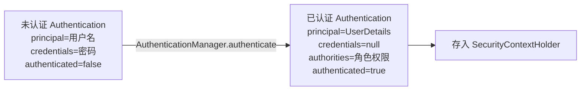
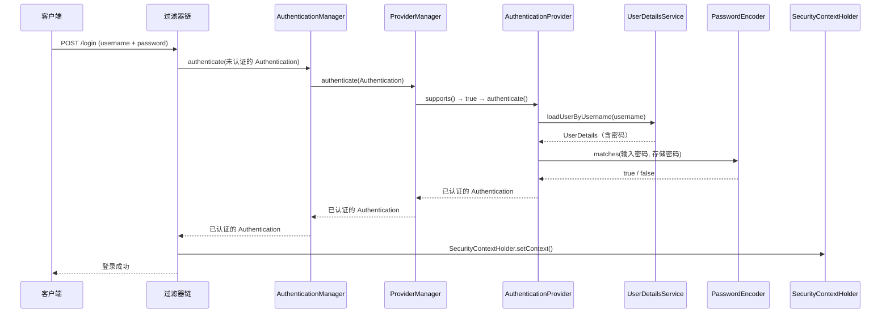

# Spring Security 安全框架概览

## ⭐ 面试重点速览

| 知识模块 | 重点内容 | 面试频率 |
|----------|----------|----------|
| 过滤器链机制 | SecurityFilterChain、FilterChainProxy、DelegatingFilterProxy | 极高 |
| Spring Security 6.x 变化 | WebSecurityConfigurerAdapter 废弃、Lambda DSL 配置 | 极高 |
| SecurityContextHolder | SecurityContext 存储策略（ThreadLocal / InheritableThreadLocal / MODE_GLOBAL） | 高 |
| Authentication 体系 | Principal / Credential / GrantedAuthority 三者关系 | 高 |
| 认证与授权区别 | Authentication vs Authorization 概念辨析 | 中高 |
| 核心组件协作 | AuthenticationManager → ProviderManager → AuthenticationProvider 链 | 高 |

---

## 一、Spring Security 核心架构

### 1.1 Spring Security 是什么？

Spring Security 是 Spring 生态中负责**认证（Authentication）**和**授权（Authorization）**的安全框架，基于 **Servlet 过滤器（Filter）** 机制实现。它的核心思想是：**通过一系列过滤器组成的"过滤器链"拦截所有请求，在请求到达 Controller 之前完成身份验证和权限校验**。

```java
// Spring Security 本质上就是一组 Filter 的集合
// 所有安全逻辑都在 Servlet Filter 层完成，对业务代码无侵入
```

### 1.2 ⭐ 过滤器链（Filter Chain）架构

Spring Security 的核心架构可以用一条过滤器链来概括。当请求到达时，它依次经过以下关键过滤器：

```mermaid
graph LR
    A[客户端请求] --> B[DelegatingFilterProxy]
    B --> C[FilterChainProxy]
    C --> D[SecurityFilterChain]
    D --> E1[SecurityContextPersistenceFilter]
    E1 --> E2[CsrfFilter]
    E2 --> E3[CorsFilter]
    E3 --> E4[AuthenticationFilter]
    E4 --> E5[AuthorizationFilter]
    E5 --> E6[ExceptionTranslationFilter]
    E6 --> F[DispatcherServlet]
    F --> G[Controller]
```



### 1.3 关键过滤器说明

| 过滤器 | 说明 | 关键作用 |
|--------|------|----------|
| **SecurityContextPersistenceFilter** | 请求开始时从 SecurityContextRepository 加载 SecurityContext，请求结束时保存 | 确保同一请求内 SecurityContext 一致 |
| **CsrfFilter** | 校验请求中的 CSRF Token | 防止跨站请求伪造攻击 |
| **CorsFilter** | 处理跨域请求 | 基于配置返回 CORS 响应头 |
| **UsernamePasswordAuthenticationFilter** | 处理表单登录请求（默认 POST /login） | 提取用户名密码，发起认证 |
| **BearerTokenAuthenticationFilter** | 处理 Bearer Token 认证（JWT 等） | 从 Authorization 头提取 Token |
| **AuthorizationFilter** | 检查已认证用户是否有权限访问当前资源 | 授权决策点 |
| **ExceptionTranslationFilter** | 捕获过滤器链中抛出的 AuthenticationException 和 AccessDeniedException | 将异常转换为相应的 HTTP 响应 |

```java
// DelegatingFilterProxy 是 Spring Security 的入口
// 它在 web.xml 或 Servlet 容器中注册，将请求委托给 Spring 容器中的 FilterChainProxy
// FilterChainProxy 内部维护了多个 SecurityFilterChain，按顺序匹配请求
```

::: tip DelegatingFilterProxy 的作用
- Spring Security 的 Filter 是 Spring Bean，需要由 Spring 容器管理
- 但 Servlet 容器只能识别 `javax.servlet.Filter`，不认识 Spring Bean
- `DelegatingFilterProxy` 充当桥梁：它是一个标准 Servlet Filter，内部将请求转发给 Spring 容器中的 `FilterChainProxy`
:::

### 1.4 多个 SecurityFilterChain

一个应用可以配置多个 `SecurityFilterChain`，FilterChainProxy 会按顺序匹配，选择第一个匹配的链执行：

```java
@Configuration
@EnableWebSecurity
public class SecurityConfig {

    // ========== API 安全链：JWT 认证（最先匹配） ==========
    @Bean
    @Order(1)
    public SecurityFilterChain apiFilterChain(HttpSecurity http) throws Exception {
        http
            .securityMatcher("/api/**")         // 仅匹配 /api/** 路径
            .authorizeHttpRequests(auth -> auth
                .anyRequest().authenticated()
            )
            .oauth2ResourceServer(oauth2 -> oauth2
                .jwt(Customizer.withDefaults()) // JWT 认证
            )
            .csrf(csrf -> csrf.disable());      // API 关闭 CSRF
        return http.build();
    }

    // ========== Web 安全链：表单登录（兜底匹配） ==========
    @Bean
    @Order(2)
    public SecurityFilterChain webFilterChain(HttpSecurity http) throws Exception {
        http
            .authorizeHttpRequests(auth -> auth
                .requestMatchers("/login", "/css/**", "/js/**").permitAll()
                .requestMatchers("/admin/**").hasRole("ADMIN")
                .anyRequest().authenticated()
            )
            .formLogin(form -> form
                .loginPage("/login")
                .defaultSuccessUrl("/home")
            );
        return http.build();
    }
}
```

---

## 二、⭐ Spring Security 6.x 核心变化

### 2.1 最大的变化：WebSecurityConfigurerAdapter 正式废弃

Spring Security 5.7 开始标记 `WebSecurityConfigurerAdapter` 为 `@Deprecated`，**Spring Security 6.x 正式移除**。这是面试中的高频考点。

```java
// ❌ Spring Security 5.x 旧写法（6.x 已移除）
@Configuration
@EnableWebSecurity
public class OldSecurityConfig extends WebSecurityConfigurerAdapter {

    @Override
    protected void configure(HttpSecurity http) throws Exception {
        http
            .authorizeRequests()
                .antMatchers("/admin/**").hasRole("ADMIN")
                .anyRequest().authenticated()
                .and()
            .formLogin();
    }

    // 还需要覆盖 configure(AuthenticationManagerBuilder) 等方法
}
```

```java
// ✅ Spring Security 6.x 新写法
@Configuration
@EnableWebSecurity
public class NewSecurityConfig {

    @Bean
    public SecurityFilterChain filterChain(HttpSecurity http) throws Exception {
        http
            .authorizeHttpRequests(auth -> auth
                .requestMatchers("/admin/**").hasRole("ADMIN")
                .anyRequest().authenticated()
            )
            .formLogin(Customizer.withDefaults());
        return http.build();
    }
}
```

### 2.2 Spring Security 6.x 变化一览

| 变化项 | 旧方式（5.x） | 新方式（6.x） |
|--------|--------------|---------------|
| 配置风格 | 继承 `WebSecurityConfigurerAdapter` | 声明 `SecurityFilterChain` Bean |
| 配置方法 | `configure(HttpSecurity http)` 重写 | Lambda DSL：`authorizeHttpRequests(auth -> auth.xxx)` |
| 路径匹配 | `antMatchers()` | `requestMatchers()` 使用 `MvcRequestMatcher` |
| 密码编码器 | 默认 `NoOpPasswordEncoder` | **必须显式指定** `PasswordEncoder` |
| CSRF | 默认开启 | 默认开启，但建议 API 明确关闭 |
| OAuth2 客户端 | `@EnableOAuth2Client` | 统一用 `OAuth2ClientConfigurer` |
| 方法安全 | `@EnableGlobalMethodSecurity` | `@EnableMethodSecurity` |

::: danger 面试陷阱
"Spring Security 6.x 默认不再允许明文密码，如果未显式指定 PasswordEncoder，启动时会抛出异常。"
:::

### 2.3 为什么要废弃 WebSecurityConfigurerAdapter？

1. **职责过于集中**：一个类需要同时处理认证、授权、CSRF、CORS 等所有配置
2. **难以组合**：多套安全配置难以拆分（如 API 用 JWT，页面用表单）
3. **不符合组件化趋势**：新方式通过多个 `SecurityFilterChain` Bean 实现关注点分离
4. **Lambda DSL 更安全**：使用 Lambda 表达式避免 `and()` 链式调用中的配置遗漏

---

## 三、SecurityFilterChain Bean 配置方式

### 3.1 完整配置示例

以下是一个同时支持**表单登录**和**JWT 认证**的完整配置：

```java
@Configuration
@EnableWebSecurity
@EnableMethodSecurity  // 开启方法级权限控制（替代 @EnableGlobalMethodSecurity）
@RequiredArgsConstructor
public class SecurityConfig {

    private final JwtAuthenticationFilter jwtAuthFilter;
    private final UserDetailsService userDetailsService;

    // ========== 密码编码器（必须显式声明） ==========
    @Bean
    public PasswordEncoder passwordEncoder() {
        return PasswordEncoderFactories.createDelegatingPasswordEncoder();
    }

    // ========== AuthenticationManager（认证管理器） ==========
    @Bean
    public AuthenticationManager authenticationManager(
            AuthenticationConfiguration config) throws Exception {
        return config.getAuthenticationManager();
    }

    // ========== SecurityFilterChain 配置 ==========
    @Bean
    public SecurityFilterChain filterChain(HttpSecurity http) throws Exception {
        http
            // 1. 跨域配置（使用 Spring 容器中的 CorsConfigurationSource Bean）
            .cors(cors -> cors.configurationSource(corsConfigurationSource()))

            // 2. CSRF 配置（前后端分离项目关闭 CSRF）
            .csrf(csrf -> csrf.disable())

            // 3. 会话管理（前后端分离使用无状态会话）
            .sessionManagement(session -> session
                .sessionCreationPolicy(SessionCreationPolicy.STATELESS)
            )

            // 4. 请求授权规则
            .authorizeHttpRequests(auth -> auth
                .requestMatchers("/api/auth/**").permitAll()       // 登录接口放行
                .requestMatchers("/api/public/**").permitAll()     // 公开接口放行
                .requestMatchers("/swagger-ui/**", "/v3/api-docs/**").permitAll()
                .requestMatchers("/api/admin/**").hasRole("ADMIN") // 管理员接口
                .anyRequest().authenticated()                      // 其余需要认证
            )

            // 5. 表单登录（如果需要同时支持）
            .formLogin(form -> form
                .loginProcessingUrl("/api/auth/login")
                .successHandler(authenticationSuccessHandler())
                .failureHandler(authenticationFailureHandler())
            )

            // 6. 添加 JWT 过滤器（在 UsernamePasswordAuthenticationFilter 之前）
            .addFilterBefore(jwtAuthFilter,
                    UsernamePasswordAuthenticationFilter.class)

            // 7. 异常处理
            .exceptionHandling(ex -> ex
                .authenticationEntryPoint(
                    (request, response, authException) -> {
                        response.setContentType("application/json;charset=UTF-8");
                        response.setStatus(HttpServletResponse.SC_UNAUTHORIZED);
                        response.getWriter().write("{\"code\":401,\"msg\":\"未登录\"}");
                    }
                )
                .accessDeniedHandler(
                    (request, response, accessDeniedException) -> {
                        response.setContentType("application/json;charset=UTF-8");
                        response.setStatus(HttpServletResponse.SC_FORBIDDEN);
                        response.getWriter().write("{\"code\":403,\"msg\":\"权限不足\"}");
                    }
                )
            )

            // 8. 登出配置
            .logout(logout -> logout
                .logoutUrl("/api/auth/logout")
                .logoutSuccessHandler((request, response, authentication) -> {
                    response.setContentType("application/json;charset=UTF-8");
                    response.getWriter().write("{\"code\":200,\"msg\":\"退出成功\"}");
                })
            );

        return http.build();
    }

    // ========== CORS 配置源 ==========
    @Bean
    public CorsConfigurationSource corsConfigurationSource() {
        CorsConfiguration config = new CorsConfiguration();
        config.setAllowedOriginPatterns(List.of("*"));     // Spring Security 6.x 使用 Pattern
        config.setAllowedMethods(List.of("GET", "POST", "PUT", "DELETE", "OPTIONS"));
        config.setAllowedHeaders(List.of("*"));
        config.setAllowCredentials(true);

        UrlBasedCorsConfigurationSource source = new UrlBasedCorsConfigurationSource();
        source.registerCorsConfiguration("/**", config);
        return source;
    }
}
```

### 3.2 authorizeHttpRequests 常用匹配规则

```java
http.authorizeHttpRequests(auth -> auth
    // ====== 按路径匹配 ======
    .requestMatchers("/admin/**").hasRole("ADMIN")          // 必须具有 ADMIN 角色
    .requestMatchers("/user/**").hasAnyRole("ADMIN", "USER")// 具有任一角色即可
    .requestMatchers("/api/**").hasAuthority("api:read")    // 必须有特定权限
    .requestMatchers(HttpMethod.GET, "/goods/**").permitAll()// GET 请求放行
    .requestMatchers(HttpMethod.POST, "/goods/**").authenticated()

    // ====== 按 IP 匹配 ======
    .requestMatchers("/internal/**").hasIpAddress("192.168.1.0/24")

    // ====== 自定义匹配 ======
    .requestMatchers(request -> {
        // 自定义匹配逻辑，例如检查请求头
        String header = request.getHeader("X-Internal");
        return "true".equals(header);
    }).authenticated()

    .anyRequest().denyAll()  // 兜底：拒绝所有未匹配请求
);
```

---

## 四、核心组件详解

### 4.1 SecurityContextHolder ------ 安全上下文的"保管箱"

`SecurityContextHolder` 是 Spring Security 中最基础的组件，用于**存储当前请求的安全上下文**（即当前是哪个用户、拥有什么权限）。

```java
// SecurityContextHolder 内部结构
// SecurityContextHolder
//    └── SecurityContext（安全上下文）
//         └── Authentication（认证信息）
//              ├── Principal（主体，通常为用户名或 UserDetails 对象）
//              ├── Credentials（凭证，通常为密码，认证后通常清除）
//              └── Authorities（权限集合，GrantedAuthority 列表）
```

**三种存储策略：**

| 策略 | 说明 | 使用场景 |
|------|------|----------|
| **MODE_THREADLOCAL**（默认） | 使用 ThreadLocal 存储，每个线程独立 | 标准 Web 请求处理 |
| **MODE_INHERITABLETHREADLOCAL** | 子线程可继承父线程的 SecurityContext | 使用 @Async 异步任务时 |
| **MODE_GLOBAL** | 全局共享，所有线程使用同一个 | 独立桌面应用 |

```java
// 获取当前用户的认证信息
Authentication authentication = SecurityContextHolder.getContext().getAuthentication();

// 获取用户名
String username = authentication.getName();  // 返回 Principal 的 toString

// 获取当前用户的 UserDetails
Object principal = authentication.getPrincipal();
if (principal instanceof UserDetails) {
    UserDetails userDetails = (UserDetails) principal;
    String email = userDetails.getUsername();
}

// 手动设置 SecurityContext（常用于 JWT 过滤器）
SecurityContext context = SecurityContextHolder.createEmptyContext();
context.setAuthentication(authentication);
SecurityContextHolder.setContext(context);

// ⚠️ 线程池环境下必须清除，防止 ThreadLocal 内存泄漏和串号
SecurityContextHolder.clearContext();
```

::: danger ThreadLocal 内存泄漏与串号问题
在 Tomcat 等使用线程池的容器中，请求处理完必须调用 `SecurityContextHolder.clearContext()` 清除 ThreadLocal，否则：
1. 可能造成**内存泄漏**（ThreadLocal 中的对象无法被 GC）
2. 可能造成**用户串号**（下一个请求复用线程时拿到上一个用户的认证信息）

Spring Security 的 `SecurityContextPersistenceFilter` 会自动在请求结束时清除，但自定义过滤器中使用后需要手动处理。
:::

### 4.2 Authentication ------ 认证信息的载体

`Authentication` 接口是 Spring Security 中表示"当前认证信息"的核心接口：

```java
// Authentication 接口的核心方法
public interface Authentication extends Principal, Serializable {

    // 权限集合（认证成功后填充）
    Collection<? extends GrantedAuthority> getAuthorities();

    // 凭证（通常是密码，认证完成后通常清除）
    Object getCredentials();

    // 附加信息（如 IP 地址、证书序列号等）
    Object getDetails();

    // 主体（通常是用户名或 UserDetails 对象）
    Object getPrincipal();

    // 是否已认证
    boolean isAuthenticated();

    // 设置认证状态（通常由 AuthenticationManager 调用）
    void setAuthenticated(boolean isAuthenticated) throws IllegalArgumentException;
}
```

**Authentication 的生命周期：**



### 4.3 GrantedAuthority ------ 权限的抽象

`GrantedAuthority` 表示授予用户的"权限"，只有一个方法 `getAuthority()`：

```java
public interface GrantedAuthority extends Serializable {
    String getAuthority();  // 返回权限字符串
}

// Spring Security 内置实现
public class SimpleGrantedAuthority implements GrantedAuthority {
    private final String role;

    public SimpleGrantedAuthority(String role) {
        this.role = role;
    }

    @Override
    public String getAuthority() {
        return role;
    }
}
```

::: warning 角色 vs 权限的区别

| 概念 | 格式 | 示例 | 说明 |
|------|------|------|------|
| **角色（Role）** | `ROLE_` 前缀 | `ROLE_ADMIN`、`ROLE_USER` | 粗粒度，一组权限的集合 |
| **权限（Authority）** | 任意字符串 | `user:read`、`order:delete` | 细粒度，具体操作 |

```java
// hasRole("ADMIN") 实际校验的是 "ROLE_ADMIN"
.requestMatchers("/admin/**").hasRole("ADMIN")   // 等价于 hasAuthority("ROLE_ADMIN")

// hasAuthority 直接校验完整字符串
.requestMatchers("/order/delete").hasAuthority("order:delete")
```
:::

### 4.4 SecurityContext ------ 安全上下文的容器

`SecurityContext` 是存放 `Authentication` 的容器：

```java
public interface SecurityContext extends Serializable {

    // 获取/设置 Authentication
    Authentication getAuthentication();
    void setAuthentication(Authentication authentication);
}

// 标准实现
public class SecurityContextImpl implements SecurityContext {
    private Authentication authentication;
    // getter / setter ...
}
```

**SecurityContext 的存储与传播机制：**

```java
// 1. 存储：SecurityContextHolder 通过 SecurityContextHolderStrategy 存储
//    - 默认策略：ThreadLocalSecurityContextHolderStrategy（ThreadLocal）
//    - 跨线程策略：InheritableThreadLocalSecurityContextHolderStrategy

// 2. 持久化：SecurityContextRepository 负责在请求间保存/加载 SecurityContext
//    - HttpSessionSecurityContextRepository：基于 HttpSession（默认）
//    - RequestAttributeSecurityContextRepository：基于 Request 属性
//    - NullSecurityContextRepository：不持久化（无状态应用，如 JWT）

// 3. 传播：SecurityContextHolderFilter（6.x 新名称）在请求开始时加载，
//    请求结束时通过 SecurityContextHolderFilter 清理
```

---

## 五、认证与授权核心流程

### 5.1 认证流程（简版）



### 5.2 认证与授权的区别

| 维度 | 认证（Authentication） | 授权（Authorization） |
|------|----------------------|---------------------|
| 核心问题 | **你是谁？** | **你能做什么？** |
| 英文 | AuthN | AuthZ |
| Spring Security 接口 | `AuthenticationManager` | `AccessDecisionManager` |
| 返回信息 | 用户身份信息 | 是否允许访问 |
| 失败状态码 | 401 Unauthorized | 403 Forbidden |

---

## ⭐ 面试高频问题汇总

### Q1：Spring Security 的过滤器链是如何工作的？

Spring Security 通过 `DelegatingFilterProxy` 作为 Servlet 容器和 Spring 容器的桥梁，将请求转发给 `FilterChainProxy`。`FilterChainProxy` 内部维护多个 `SecurityFilterChain`，按 `@Order` 顺序匹配，选择第一个匹配的链执行。每个 `SecurityFilterChain` 由一系列安全过滤器组成（如 CsrfFilter、AuthenticationFilter、AuthorizationFilter 等）。

### Q2：Spring Security 6.x 的最大变化是什么？

**`WebSecurityConfigurerAdapter` 被正式移除**。配置方式从"继承并覆盖方法"改为"声明 `SecurityFilterChain` Bean"并使用 Lambda DSL 风格。同时：
- `antMatchers()` 改为 `requestMatchers()`（内部默认使用 `MvcRequestMatcher`）
- `@EnableGlobalMethodSecurity` 改为 `@EnableMethodSecurity`
- 密码编码器不再默认使用 NoOp，必须显式声明
- 方法安全默认启用 `prePostEnabled = true`

### Q3：SecurityContextHolder 的三种存储模式有什么区别？

| 模式 | 存储方式 | 适用场景 |
|------|----------|----------|
| MODE_THREADLOCAL | ThreadLocal，线程隔离 | 标准 Web 请求（默认） |
| MODE_INHERITABLETHREADLOCAL | InheritableThreadLocal，子线程可继承 | @Async 异步任务 |
| MODE_GLOBAL | 全局变量，所有线程共享 | 桌面应用 |

### Q4：Authentication 的 isAuthenticated() 什么时候变为 true？

当 `AuthenticationManager.authenticate()` 方法**成功完成认证并返回新的 Authentication 对象**后。关键是：只有 `AuthenticationManager` 返回的 `Authentication` 的 `isAuthenticated()` 才是 `true`。**切勿手动调用 `setAuthenticated(true)`**，因为那不会触发实际认证逻辑。

### Q5：已经认证的请求如何在后续过滤器/Controller 中获取用户信息？

```java
// 方式 1：通过 SecurityContextHolder 获取
Authentication auth = SecurityContextHolder.getContext().getAuthentication();
UserDetails user = (UserDetails) auth.getPrincipal();

// 方式 2：Controller 方法参数直接注入
@GetMapping("/profile")
public String profile(@AuthenticationPrincipal UserDetails user) {
    return user.getUsername();
}

// 方式 3：Principal 参数注入（只获取用户名）
@GetMapping("/profile")
public String profile(Principal principal) {
    return principal.getName();
}
```

### Q6：多个 SecurityFilterChain 的匹配顺序是怎样的？

`FilterChainProxy` 按 `@Order` 值从小到大排序，依次尝试匹配。`@Order` 值越小，优先级越高。一个请求**只会**被第一个匹配到的 `SecurityFilterChain` 处理。因此更具体的规则（如 `/api/**`）应该放在更通用的规则（如 `/**`）之前。

### Q7：Spring Security 适合微服务架构吗？如何处理分布式认证？

Spring Security 非常适合微服务架构。常见方案：
1. **JWT 无状态认证**：每个微服务独立验证 JWT Token，无需共享 Session
2. **OAuth2 + Spring Authorization Server**：统一授权服务器发放 Token，网关统一验证
3. **Spring Cloud Gateway + Spring Security**：在网关层统一认证，下游服务信任网关传递的身份信息

---

## 面试追问环节

**Q：如果让你从零设计一个安全框架，你会怎么设计过滤器链？**

核心四点：
1. **认证过滤器**（提取用户凭证，自动化认证）
2. **授权过滤器**（检查已认证用户的权限）
3. **异常处理过滤器**（捕获认证/授权异常，统一返回格式）
4. **上下文过滤器**（请求开始加载安全上下文，请求结束清理）

**Q：SecurityContextHolderFilter 和 SecurityContextPersistenceFilter 有什么区别？**

| 维度 | SecurityContextPersistenceFilter | SecurityContextHolderFilter |
|------|--------------------------------|---------------------------|
| 引入版本 | Spring Security 早期 | Spring Security 5.7+ / 6.x 默认 |
| 持久化 | 负责加载和保存 SecurityContext | 只负责加载，不负责保存 |
| 保存机制 | 请求结束时自动保存到 HttpSession | 需要显式通过 SecurityContextRepository 保存 |
| 推荐程度 | 旧版遗留 | 新版推荐 |